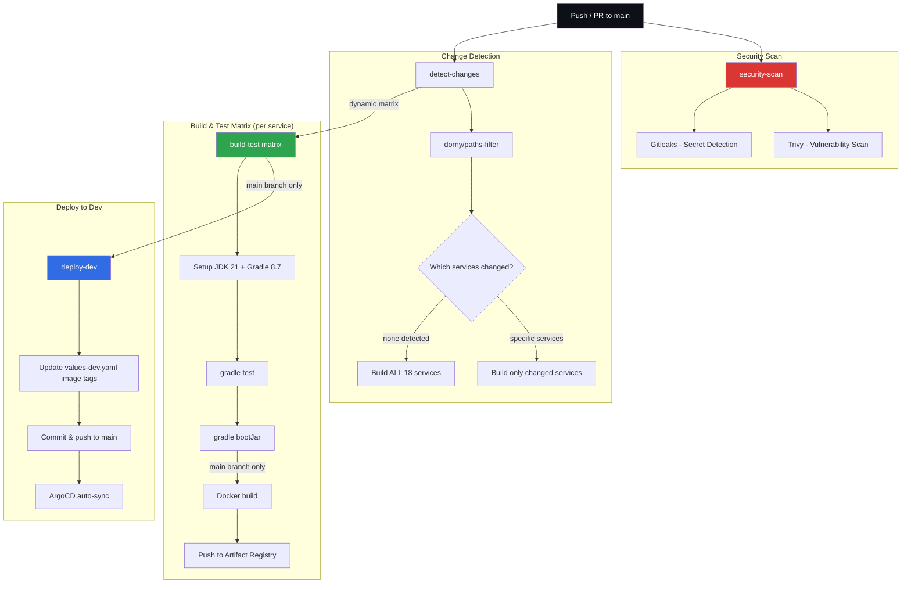

# GitHub Configuration

CI/CD workflows, Dependabot configuration, and automation for the InstaCommerce platform.

## CI Pipeline

The CI pipeline (`.github/workflows/ci.yml`) uses a **multi-service build matrix** with change detection to only build and deploy services that have been modified.



### Services in the Build Matrix

The following 18 services are independently detected and built:

| Service | Path Filter |
|---------|-------------|
| identity-service | `services/identity-service/**` |
| catalog-service | `services/catalog-service/**` |
| inventory-service | `services/inventory-service/**` |
| order-service | `services/order-service/**` |
| payment-service | `services/payment-service/**` |
| fulfillment-service | `services/fulfillment-service/**` |
| notification-service | `services/notification-service/**` |
| search-service | `services/search-service/**` |
| pricing-service | `services/pricing-service/**` |
| cart-service | `services/cart-service/**` |
| checkout-orchestrator-service | `services/checkout-orchestrator-service/**` |
| warehouse-service | `services/warehouse-service/**` |
| rider-fleet-service | `services/rider-fleet-service/**` |
| routing-eta-service | `services/routing-eta-service/**` |
| wallet-loyalty-service | `services/wallet-loyalty-service/**` |
| audit-trail-service | `services/audit-trail-service/**` |
| fraud-detection-service | `services/fraud-detection-service/**` |
| config-feature-flag-service | `services/config-feature-flag-service/**` |

### Container Registry

Images are pushed to **Google Artifact Registry**:
```
asia-south1-docker.pkg.dev/instacommerce/images/<service-name>:<git-sha>
```

## How to Add a New Service to CI

1. **Add the path filter** in `ci.yml` under `steps.filter.with.filters`:
   ```yaml
   my-new-service: 'services/my-new-service/**'
   ```

2. **Add the matrix entry** in the `set-matrix` step:
   ```bash
   [[ "${{ steps.filter.outputs.my-new-service }}" == "true" ]] && services+=("my-new-service")
   ```

3. **Add to the fallback list** (builds all when no changes detected):
   ```bash
   services=(... my-new-service)
   ```

4. **Ensure your service has**:
   - A `build.gradle.kts` with `bootJar` task
   - A `Dockerfile` in `services/my-new-service/`
   - Tests runnable via `gradle test`

## Dependabot Configuration

Dependabot (`.github/dependabot.yml`) is configured to automatically create PRs for dependency updates:

| Ecosystem | Directory | Schedule | PR Limit |
|-----------|-----------|----------|----------|
| Gradle | `/` (root) | Weekly | 10 |
| Docker | `/services/identity-service` | Weekly | 5 (default) |
| GitHub Actions | `/` (root) | Weekly | 5 (default) |

## Files

| File | Description |
|------|-------------|
| `workflows/ci.yml` | Multi-service CI pipeline with change detection, build matrix, and GitOps deploy |
| `dependabot.yml` | Automated dependency update configuration |
