<p align="center">
  
</p>

<h1 align="center">InstaCommerce</h1>

<p align="center">
  <strong>Production-grade Q-Commerce backend platform powering 10-minute grocery delivery</strong>
</p>

<p align="center">
  <a href="#"></a>
  <a href="#"></a>
  <a href="#license"></a>
  <a href="#"></a>
  <a href="#"></a>
  <a href="#"></a>
</p>

<p align="center">
  Serving <strong>20M+ users</strong> and processing <strong>500K+ orders/day</strong> across dark stores nationwide.<br/>
  Comparable to Zepto · Blinkit · Instacart · DoorDash
</p>

---

## 📑 Table of Contents

- [Architecture Overview](#-architecture-overview)
- [Tech Stack](#-tech-stack)
- [Service Inventory](#-service-inventory)
- [Getting Started](#-getting-started)
- [Project Structure](#-project-structure)
- [Architecture Decisions](#-architecture-decisions)
- [Documentation](#-documentation)
- [Contributing](#-contributing)
- [License](#-license)

---

## 🏗 Architecture Overview

The platform follows a **domain-driven microservices architecture** with event-driven communication via Kafka, orchestrated workflows via Temporal, and a polyglot service mesh managed by Istio on GKE. In the current transactional model, the checkout money path remains orchestrated in `checkout-orchestrator-service`, while downstream order progression from fulfillment through delivery is migrating to Kafka-driven choreography behind explicit rollout controls.

```mermaid
graph TB
    subgraph Clients
        MA["📱 Mobile App<br/>(React Native)"]
        WA["🌐 Web App<br/>(Next.js)"]
        AO["🛠 Admin Ops<br/>(Internal Portal)"]
    end

    subgraph API Layer
        AG["🚪 API Gateway<br/>(Istio Ingress)"]
        MB["📲 Mobile BFF"]
        ADG["🔧 Admin Gateway"]
    end

    subgraph Core["Core Services — Java/Spring Boot"]
        IS["🔐 Identity Service"]
        CS["📦 Catalog Service"]
        SS["🔍 Search Service"]
        PS["💲 Pricing Service"]
        CTS["🛒 Cart Service"]
        CO["🔄 Checkout Orchestrator"]
        OS["📋 Order Service"]
        PAY["💳 Payment Service"]
        INV["📊 Inventory Service"]
        FS["🚀 Fulfillment Service"]
        NS["🔔 Notification Service"]
    end

    subgraph Fleet["Fleet & Logistics"]
        RFS["🏍 Rider Fleet Service"]
        RES["🗺 Routing/ETA Service"]
        WS["🏭 Warehouse Service"]
    end

    subgraph Intelligence["Intelligence — Python"]
        AIO["🧠 AI Orchestrator<br/>(LangGraph)"]
        AII["🤖 AI Inference<br/>(ML Models)"]
    end

    subgraph Platform["Platform Services"]
        WLS["👛 Wallet/Loyalty"]
        FDS["🛡 Fraud Detection"]
        ATS["📝 Audit Trail"]
        CFS["⚙ Config/Feature Flags"]
    end

    subgraph DataEvents["Data & Events — Go"]
        ORS["📤 Outbox Relay"]
        CDC["🔁 CDC Consumer"]
        LIS["📍 Location Ingestion"]
        PWS["🪝 Payment Webhook"]
        DOS["🧮 Dispatch Optimizer"]
        SP["🌊 Stream Processor"]
        RE["⚖ Reconciliation Engine"]
    end

    subgraph Infra["Infrastructure"]
        K["📨 Kafka<br/>(Strimzi)"]
        PG["🐘 PostgreSQL<br/>(Cloud SQL)"]
        RD["⚡ Redis<br/>(Memorystore)"]
        TP["⏱ Temporal"]
        BQ["📈 BigQuery"]
    end

    %% Client → API Layer
    MA --> AG
    WA --> AG
    AO --> AG
    AG --> MB
    AG --> ADG

    %% BFF → Core Services
    MB --> IS
    MB --> CS
    MB --> SS
    MB --> PS
    MB --> CTS
    MB --> CO
    MB --> OS
    MB --> NS

    %% Admin Gateway → Services
    ADG --> INV
    ADG --> WS
    ADG --> CFS
    ADG --> ATS

    %% Core Service Interactions
    CO --> CTS
    CO --> INV
    CO --> PAY
    CO --> OS
    OS --> FS
    FS --> RFS
    RFS --> RES
    FS --> WS

    %% Intelligence
    SS --> AII
    PS --> AII
    DOS --> AII
    AIO --> AII

    %% Platform Services
    PAY --> WLS
    CO --> FDS
    OS --> ATS

    %% Event-Driven (via Kafka)
    OS --> K
    PAY --> K
    INV --> K
    FS --> K
    K --> ORS
    K --> CDC
    K --> SP
    K --> NS

    %% Go Services
    LIS --> RD
    PWS --> PAY
    RE --> BQ

    %% Infrastructure connections
    IS --> PG
    CS --> PG
    OS --> PG
    INV --> PG
    CTS --> RD
    SS --> RD
    CO --> TP
    FS --> TP
    SP --> BQ
    CDC --> PG
```



---

## ⚙ Tech Stack

| Layer | Technology | Details |
|---|---|---|
| **Core Services** | Java 21, Spring Boot 3.x, Gradle | 20 microservices — order lifecycle, payments, catalog, fulfillment |
| **AI/ML** | Python 3.11, FastAPI | AI orchestrator (LangGraph) + inference service (ONNX Runtime) |
| **Data/Event Services** | Go 1.22 | 7 high-throughput services — CDC, streaming, outbox relay, dispatch |
| **Databases** | PostgreSQL 15, Redis 7 | Transactional storage + caching / session store |
| **Messaging** | Kafka (Strimzi) | Event backbone — 200+ topics, Avro schemas, exactly-once semantics |
| **Orchestration** | Temporal | Saga workflows — checkout, fulfillment, reconciliation |
| **Container Platform** | GKE, Istio, Helm | Service mesh, mTLS, traffic management, canary deployments |
| **GitOps / IaC** | ArgoCD, Terraform | Declarative infra and app deployment |
| **Data Platform** | BigQuery, dbt, Airflow | Analytics warehouse, transformations, orchestration |
| **ML/AI** | LightGBM, XGBoost, LangGraph, ONNX Runtime, Vertex AI | Demand forecasting, ETA prediction, fraud scoring, AI agents |
| **Observability** | Prometheus, Grafana, OpenTelemetry | Metrics, dashboards, distributed tracing |

---

## 📋 Service Inventory

| # | Service | Language | Port | Purpose | Status |
|---|---|---|---|---|---|
| 1 | `identity-service` | Java | 8081 | Authentication, authorization, JWT/OAuth2 | ✅ Active |
| 2 | `catalog-service` | Java | 8082 | Product catalog, categories, SKU management | ✅ Active |
| 3 | `search-service` | Java | 8083 | Full-text product search with Elasticsearch | ✅ Active |
| 4 | `pricing-service` | Java | 8084 | Dynamic pricing, surge pricing, promotions | ✅ Active |
| 5 | `cart-service` | Java | 8085 | Cart management, item validation, Redis-backed | ✅ Active |
| 6 | `checkout-orchestrator` | Java | 8086 | Saga-based checkout workflow via Temporal | ✅ Active |
| 7 | `order-service` | Java | 8087 | Order lifecycle, state machine, event sourcing | ✅ Active |
| 8 | `payment-service` | Java | 8088 | Payment gateway integration, refunds, ledger | ✅ Active |
| 9 | `inventory-service` | Java | 8089 | Real-time stock levels, reservation, replenishment | ✅ Active |
| 10 | `fulfillment-service` | Java | 8090 | Pick-pack-dispatch orchestration via Temporal | ✅ Active |
| 11 | `notification-service` | Java | 8091 | Push, SMS, email notifications via templates | ✅ Active |
| 12 | `mobile-bff` | Java | 8092 | Backend-for-Frontend aggregation for mobile | ✅ Active |
| 13 | `admin-gateway` | Java | 8093 | Internal admin API aggregation | ✅ Active |
| 14 | `wallet-loyalty-service` | Java | 8094 | Digital wallet, loyalty points, cashback | ✅ Active |
| 15 | `fraud-detection-service` | Java | 8095 | Real-time fraud scoring, rule engine | ✅ Active |
| 16 | `audit-trail-service` | Java | 8096 | Immutable audit log, compliance events | ✅ Active |
| 17 | `config-service` | Java | 8097 | Feature flags, A/B testing, remote config | ✅ Active |
| 18 | `rider-fleet-service` | Java | 8098 | Rider onboarding, shift management, allocation | ✅ Active |
| 19 | `routing-eta-service` | Java | 8099 | Route optimization, ETA prediction, geofencing | ✅ Active |
| 20 | `warehouse-service` | Java | 8100 | Dark store ops, bin management, pick lists | ✅ Active |
| 21 | `ai-orchestrator` | Python | 9001 | LangGraph AI agent workflows, prompt management | ✅ Active |
| 22 | `ai-inference` | Python | 9002 | ML model serving — demand, ETA, fraud (ONNX) | ✅ Active |
| 23 | `outbox-relay` | Go | 7001 | Transactional outbox → Kafka publisher | ✅ Active |
| 24 | `cdc-consumer` | Go | 7002 | Change data capture consumer, materialized views | ✅ Active |
| 25 | `location-ingestion` | Go | 7003 | High-frequency rider GPS ingestion (10K msg/s) | ✅ Active |
| 26 | `payment-webhook` | Go | 7004 | Payment gateway webhook receiver, idempotent | ✅ Active |
| 27 | `dispatch-optimizer` | Go | 7005 | Real-time rider-order matching, optimization | ✅ Active |
| 28 | `stream-processor` | Go | 7006 | Kafka Streams — enrichment, aggregation, sink | ✅ Active |
| 29 | `reconciliation-engine` | Go | 7007 | Financial reconciliation, settlement, reporting | ✅ Active |
| 30 | `data-platform-jobs` | Python | — | dbt transforms, Airflow DAGs, data quality | ✅ Active |

---

## 🚀 Getting Started

### Prerequisites

| Tool | Version | Purpose |
|---|---|---|
| Java (Temurin) | 21+ | Core microservices |
| Go | 1.22+ | Data/event services |
| Python | 3.11+ | AI/ML services |
| Docker & Compose | Latest | Local development |
| Node.js | 20+ | Contract testing, tooling |

### Quick Start — Local Development

```bash
# 1. Clone the repository
git clone https://github.com/your-org/InstaCommerce.git
cd InstaCommerce

# 2. Start infrastructure (Kafka, PostgreSQL, Redis, Temporal)
docker-compose up -d

# 3. Build all Java services
./gradlew build -x test

# 4. Run a specific service
./gradlew :services:order-service:bootRun

# 5. Run Go services
cd services/outbox-relay && go run ./cmd/main.go

# 6. Run Python AI services
cd services/ai-orchestrator && pip install -r requirements.txt && uvicorn app.main:app --port 9001
```

### Running Individual Services

```bash
# Java service (any of the 20 services)
./gradlew :services:<service-name>:bootRun

# Go service (any of the 7 services)
cd services/<service-name> && go run ./cmd/main.go

# Python service
cd services/<service-name> && uvicorn app.main:app --reload
```

### Running Tests

```bash
# All Java unit + integration tests
./gradlew test

# Go tests with race detection
cd services/<service-name> && go test -race ./...

# Python tests
cd services/<service-name> && pytest -v
```

---

## 📁 Project Structure

```
InstaCommerce/
├── services/                  # 30 microservices (Java, Python, Go)
│   ├── identity-service/      #   🔐 Auth & identity (Java)
│   ├── catalog-service/       #   📦 Product catalog (Java)
│   ├── search-service/        #   🔍 Product search (Java)
│   ├── pricing-service/       #   💲 Pricing engine (Java)
│   ├── cart-service/          #   🛒 Cart management (Java)
│   ├── checkout-orchestrator/ #   🔄 Checkout saga (Java)
│   ├── order-service/         #   📋 Order lifecycle (Java)
│   ├── payment-service/       #   💳 Payments (Java)
│   ├── inventory-service/     #   📊 Inventory (Java)
│   ├── fulfillment-service/   #   🚀 Fulfillment (Java)
│   ├── notification-service/  #   🔔 Notifications (Java)
│   ├── mobile-bff/            #   📲 Mobile BFF (Java)
│   ├── admin-gateway/         #   🔧 Admin API (Java)
│   ├── wallet-loyalty-service/#   👛 Wallet & loyalty (Java)
│   ├── fraud-detection-service/#  🛡 Fraud detection (Java)
│   ├── audit-trail-service/   #   📝 Audit trail (Java)
│   ├── config-service/        #   ⚙ Feature flags (Java)
│   ├── rider-fleet-service/   #   🏍 Rider fleet (Java)
│   ├── routing-eta-service/   #   🗺 Routing & ETA (Java)
│   ├── warehouse-service/     #   🏭 Warehouse ops (Java)
│   ├── ai-orchestrator/       #   🧠 AI agents (Python)
│   ├── ai-inference/          #   🤖 ML inference (Python)
│   ├── outbox-relay/          #   📤 Outbox → Kafka (Go)
│   ├── cdc-consumer/          #   🔁 CDC consumer (Go)
│   ├── location-ingestion/    #   📍 GPS ingestion (Go)
│   ├── payment-webhook/       #   🪝 Payment webhooks (Go)
│   ├── dispatch-optimizer/    #   🧮 Dispatch optimization (Go)
│   ├── stream-processor/      #   🌊 Stream processing (Go)
│   └── reconciliation-engine/ #   ⚖ Reconciliation (Go)
├── contracts/                 # Event schemas (Avro/JSON) + gRPC protos
│   ├── avro/                  #   Avro schema definitions
│   ├── proto/                 #   Protocol Buffer definitions
│   └── json-schema/           #   JSON Schema for REST APIs
├── deploy/helm/               # Kubernetes Helm charts per service
├── infra/terraform/           # GCP infrastructure as code
│   ├── modules/               #   VPC, GKE, Cloud SQL, Memorystore, etc.
│   └── environments/          #   dev / staging / production
├── argocd/                    # GitOps application manifests
├── ml/                        # ML training, serving, feature store
│   ├── training/              #   Model training pipelines
│   ├── serving/               #   Model serving configs
│   └── feature_store/         #   Feature definitions & pipelines
├── data-platform/             # Data engineering
│   ├── dbt/                   #   dbt models & transformations
│   ├── airflow/               #   DAG definitions
│   ├── streaming/             #   Kafka Connect & stream configs
│   └── quality/               #   Great Expectations data quality
├── monitoring/                # Observability
│   ├── prometheus/            #   Alert rules & recording rules
│   ├── grafana/               #   Dashboard JSON definitions
│   └── otel/                  #   OpenTelemetry collector config
├── docs/                      # Architecture documentation
│   ├── hld/                   #   High-level design documents
│   ├── lld/                   #   Low-level design documents
│   └── reviews/               #   Architecture review reports
├── scripts/                   # Utility & automation scripts
├── docker-compose.yml         # Local development infrastructure
├── build.gradle               # Root Gradle build
├── settings.gradle            # Multi-project settings
└── README.md                  # ← You are here
```

---

## 📐 Architecture Decisions

| ADR | Decision | Rationale |
|---|---|---|
| **ADR-001** | Java for core services, Go for data pipelines, Python for AI/ML | Java ecosystem maturity for business logic; Go for high-throughput, low-latency data paths; Python for ML tooling |
| **ADR-002** | Event-driven architecture via Kafka | Decoupled services, eventual consistency at scale, replay capability for debugging |
| **ADR-003** | Saga pattern (Temporal) for checkout & fulfillment | Distributed transactions across payment, inventory, order services without 2PC |
| **ADR-004** | Transactional outbox pattern | Guarantees at-least-once event publishing without dual-write problems |
| **ADR-005** | CQRS for order & inventory services | Separate read/write models for high-read catalog queries vs. transactional writes |
| **ADR-006** | Redis for cart & session state | Sub-millisecond latency for cart operations; TTL-based expiry; no DB pressure |
| **ADR-007** | PostgreSQL per service (database-per-service) | Strong isolation, independent schema evolution, no cross-service joins |
| **ADR-008** | Istio service mesh | mTLS, traffic management, canary deployments, observability without app changes |
| **ADR-009** | CDC via Debezium for materialized views | Real-time data synchronization without polling; feeds search index & analytics |
| **ADR-010** | ONNX Runtime for ML inference | Framework-agnostic model serving; consistent performance across LightGBM/XGBoost |
| **ADR-011** | LangGraph for AI orchestration | Stateful, graph-based agent workflows; better than plain LangChain for multi-step |
| **ADR-012** | BigQuery + dbt for analytics | Serverless warehouse; version-controlled transformations; cost-effective at scale |
| **ADR-013** | Feature flags via internal config service | Controlled rollouts, A/B testing, kill switches without redeployment |
| **ADR-014** | Monorepo structure | Unified CI/CD, shared contracts, atomic cross-service changes |

---

## 📚 Documentation

| Document | Description | Location |
|---|---|---|
| 🏛 **High-Level Design** | System architecture, domain model, integration patterns | [`docs/hld/`](docs/hld/) |
| 🔬 **Low-Level Design** | Service internals, API contracts, DB schemas | [`docs/lld/`](docs/lld/) |
| 🔄 **Data Flow Diagrams** | End-to-end order flow, payment flow, fulfillment flow | [`docs/hld/data-flow/`](docs/hld/) |
| 🏗 **Infrastructure** | Terraform modules, GKE setup, networking | [`infra/terraform/`](infra/terraform/) |
| 📊 **ML Documentation** | Model cards, training pipelines, feature store | [`ml/`](ml/) |
| 📦 **Contract Schemas** | Avro events, gRPC protos, JSON schemas | [`contracts/`](contracts/) |
| 🚀 **Deployment Guide** | Helm charts, ArgoCD apps, rollback procedures | [`deploy/`](deploy/) |
| 📈 **Monitoring Runbook** | Alert definitions, dashboard guide, incident response | [`monitoring/`](monitoring/) |

---

## 🤝 Contributing

### Branch Strategy

```
main              ← production (protected, deploy on merge)
├── staging       ← pre-production validation
├── develop       ← integration branch
│   ├── feature/* ← new features
│   ├── fix/*     ← bug fixes
│   └── chore/*   ← maintenance tasks
└── hotfix/*      ← emergency production fixes
```

### Pull Request Requirements

- [ ] Branch from `develop` (or `main` for hotfixes)
- [ ] All CI checks passing (build, test, lint, security scan)
- [ ] Unit test coverage ≥ 80% for new code
- [ ] Integration tests for API changes
- [ ] Contract schema backward compatibility verified
- [ ] At least **2 approvals** from code owners
- [ ] Squash merge with conventional commit message

### CI Pipeline

```
PR Created → Lint → Build → Unit Tests → Integration Tests → Contract Tests → Security Scan → Review → Merge
                                                                                                        ↓
                                                                          Staging Deploy → Smoke Tests → Production Deploy (canary → full)
```

### Commit Convention

```
feat(order-service): add retry logic for payment timeouts
fix(cart-service): resolve race condition in concurrent cart updates
chore(deps): upgrade Spring Boot to 3.3.1
docs(hld): add fulfillment flow sequence diagram
```

---

## 📄 License

```
MIT License

Copyright (c) 2024 InstaCommerce

Permission is hereby granted, free of charge, to any person obtaining a copy
of this software and associated documentation files (the "Software"), to deal
in the Software without restriction, including without limitation the rights
to use, copy, modify, merge, publish, distribute, sublicense, and/or sell
copies of the Software, and to permit persons to whom the Software is
furnished to do so, subject to the following conditions:

The above copyright notice and this permission notice shall be included in all
copies or substantial portions of the Software.

THE SOFTWARE IS PROVIDED "AS IS", WITHOUT WARRANTY OF ANY KIND, EXPRESS OR
IMPLIED, INCLUDING BUT NOT LIMITED TO THE WARRANTIES OF MERCHANTABILITY,
FITNESS FOR A PARTICULAR PURPOSE AND NONINFRINGEMENT. IN NO EVENT SHALL THE
AUTHORS OR COPYRIGHT HOLDERS BE LIABLE FOR ANY CLAIM, DAMAGES OR OTHER
LIABILITY, WHETHER IN AN ACTION OF CONTRACT, TORT OR OTHERWISE, ARISING FROM,
OUT OF OR IN CONNECTION WITH THE SOFTWARE OR THE USE OR OTHER DEALINGS IN THE
SOFTWARE.
```

---

<p align="center">
  Built with ❤️ by the InstaCommerce Engineering Team
</p>
