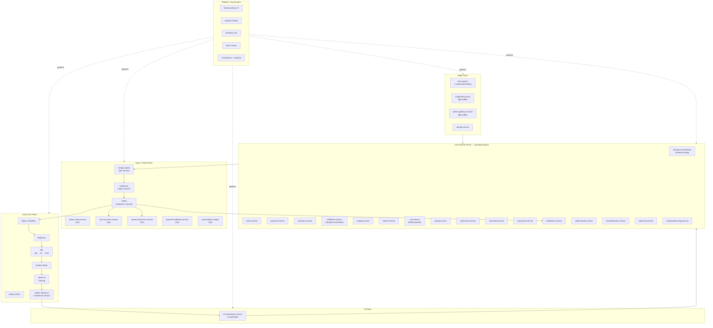
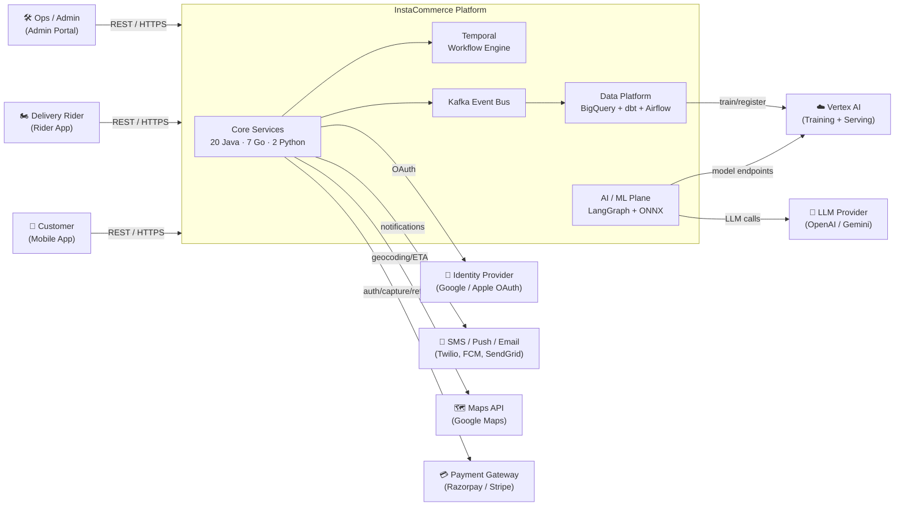
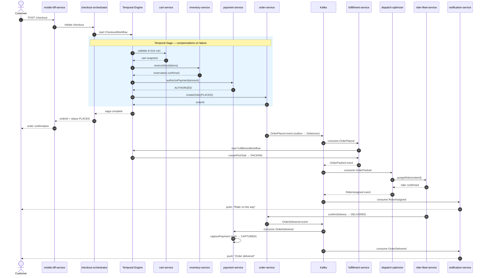
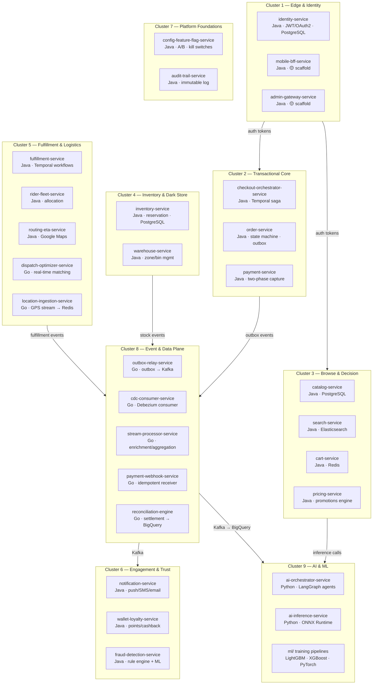

# InstaCommerce

**Q-Commerce backend monorepo — 30 microservices across Java/Spring Boot, Go, and Python/FastAPI on GKE.**

> **Honesty note:** This README is grounded in checked-in code, CI configuration
> (`ci.yml`), `settings.gradle.kts`, `docker-compose.yml`, `contracts/`,
> architecture docs under `docs/architecture/`, and the iteration-3 principal
> engineering review under `docs/reviews/iter3/`. Where the codebase has known
> gaps or scaffold-only services, those are called out explicitly. See
> [Known Limitations & Current-State Gaps](#known-limitations--current-state-gaps)
> for the honest delta between target and actual.

---

## Table of Contents

- [Repo Role & Boundaries](#repo-role--boundaries)
- [High-Level Design (HLD)](#high-level-design-hld)
- [System Interaction View](#system-interaction-view)
- [Order Lifecycle — Sequence Diagram](#order-lifecycle--sequence-diagram)
- [Component / Domain Map](#component--domain-map)
- [Service Inventory](#service-inventory)
- [Low-Level Design & Navigation](#low-level-design--navigation)
- [Runtime & Validation Entrypoints](#runtime--validation-entrypoints)
- [Rollout & Release Posture](#rollout--release-posture)
- [Observability & Testing Overview](#observability--testing-overview)
- [Known Limitations & Current-State Gaps](#known-limitations--current-state-gaps)
- [Comparison Note — Q-Commerce Platform Patterns](#comparison-note--q-commerce-platform-patterns)
- [Documentation Index](#documentation-index)
- [License](#license)

---

## Repo Role & Boundaries

This monorepo is the single source of truth for the InstaCommerce backend
platform. It contains:

| What | Where | Canonical identifier |
|------|-------|---------------------|
| 20 Java/Spring Boot services | `services/` + `settings.gradle.kts` | Gradle module paths (e.g. `:services:order-service`) |
| 7 Go data/event services + 1 shared library | `services/*/go.mod` | Per-module `go.mod` (e.g. `services/outbox-relay-service`) |
| 2 Python/FastAPI AI services | `services/ai-orchestrator-service`, `services/ai-inference-service` | `uvicorn app.main:app` entrypoint |
| Cross-service contracts | `contracts/` (Protobuf + JSON Schema) | `./gradlew :contracts:build` |
| Data platform | `data-platform/` (dbt, Airflow, Beam, Great Expectations) | `dbt run`, Airflow DAGs |
| ML platform | `ml/` (training, eval, feature store, serving) | Config-driven under `ml/train/*/config.yaml` |
| Infrastructure as code | `infra/terraform/`, `deploy/helm/`, `argocd/` | Terraform modules, Helm values, ArgoCD app-of-apps |
| Observability | `monitoring/` | Prometheus rules (`prometheus-rules.yaml`) |
| CI | `.github/workflows/ci.yml` | Path-filtered per-service builds + security gates |

**What is not in this repo:** client applications (mobile, web, admin portal),
third-party gateway configurations, and production secrets.

`settings.gradle.kts` and `.github/workflows/ci.yml` are the authoritative
references for service module identifiers and CI coverage. Human-facing docs may
use shorter display names, but the real module paths are under `services/`.

---

## High-Level Design (HLD)

The platform is organized into six architectural planes as defined in the
iteration-3 HLD diagrams (`docs/architecture/ITER3-HLD-DIAGRAMS.md`):

1. **Edge Plane** — Istio ingress, BFF/admin gateway, identity/auth
2. **Core Domain Plane** — Transactional services (checkout, order, payment, inventory, fulfillment, catalog, cart, pricing, search, warehouse, rider fleet, routing/ETA)
3. **Async / Event Plane** — Outbox + Debezium CDC → Kafka → Go consumers (relay, CDC, stream processor, payment webhook, reconciliation)
4. **Data & ML Plane** — Kafka → BigQuery → dbt (staging → intermediate → marts) → feature store → ML training (Vertex AI) → ONNX inference
5. **AI Plane** — LangGraph agent orchestration (`ai-orchestrator-service`) + model inference (`ai-inference-service`)
6. **Platform / Governance** — CI/CD, GitOps (ArgoCD + Helm), Terraform, SLO alerting, security



> **Source:** `docs/architecture/HLD.md` §1–§6, `docs/architecture/ITER3-HLD-DIAGRAMS.md` §2,
> `docs/reviews/iter3/master-review.md` §6.

---

## System Interaction View

This diagram shows the runtime interaction between the platform, external actors,
and third-party systems. Derived from the C4 Level 1 context in `docs/architecture/HLD.md` §2
and `docs/architecture/ITER3-HLD-DIAGRAMS.md` §1.



---

## Order Lifecycle — Sequence Diagram

Representative happy-path flow from customer checkout through delivery. Derived
from `docs/architecture/LLD.md` §1 (order state machine), §3 (checkout saga),
§4 (fulfillment pipeline), and `contracts/README.md` event types.



> **State machine reference:** PENDING → PLACED → PACKING → PACKED →
> OUT_FOR_DELIVERY → DELIVERED (with CANCELLED/FAILED branches). See
> `docs/architecture/LLD.md` §1. Each transition emits an event to the
> `orders.events` Kafka topic via the outbox pattern.

---

## Component / Domain Map

UML-style component diagram showing domain boundaries, ownership, and
technology per cluster. Aligned with the nine service clusters from
`docs/reviews/iter3/service-wise-guide.md`.



---

## Service Inventory

Authoritative module list from `settings.gradle.kts` (Java) and
`services/*/go.mod` (Go). Port numbers are from service `application.yml` files.
Status reflects checked-in implementation, not design intent.

| # | Service | Language | Module Path | Status |
|---|---------|----------|-------------|--------|
| 1 | identity-service | Java | `services/identity-service` | ✅ Active |
| 2 | catalog-service | Java | `services/catalog-service` | ✅ Active |
| 3 | search-service | Java | `services/search-service` | ✅ Active |
| 4 | pricing-service | Java | `services/pricing-service` | ✅ Active |
| 5 | cart-service | Java | `services/cart-service` | ✅ Active |
| 6 | checkout-orchestrator-service | Java | `services/checkout-orchestrator-service` | ✅ Active |
| 7 | order-service | Java | `services/order-service` | ✅ Active |
| 8 | payment-service | Java | `services/payment-service` | ✅ Active |
| 9 | inventory-service | Java | `services/inventory-service` | ✅ Active |
| 10 | fulfillment-service | Java | `services/fulfillment-service` | ✅ Active |
| 11 | notification-service | Java | `services/notification-service` | ✅ Active |
| 12 | mobile-bff-service | Java | `services/mobile-bff-service` | 🟡 Scaffold |
| 13 | admin-gateway-service | Java | `services/admin-gateway-service` | 🟡 Scaffold |
| 14 | wallet-loyalty-service | Java | `services/wallet-loyalty-service` | ✅ Active |
| 15 | fraud-detection-service | Java | `services/fraud-detection-service` | ✅ Active |
| 16 | audit-trail-service | Java | `services/audit-trail-service` | ✅ Active |
| 17 | config-feature-flag-service | Java | `services/config-feature-flag-service` | ✅ Active |
| 18 | rider-fleet-service | Java | `services/rider-fleet-service` | ✅ Active |
| 19 | routing-eta-service | Java | `services/routing-eta-service` | ✅ Active |
| 20 | warehouse-service | Java | `services/warehouse-service` | ✅ Active |
| 21 | ai-orchestrator-service | Python | `services/ai-orchestrator-service` | ✅ Active |
| 22 | ai-inference-service | Python | `services/ai-inference-service` | ✅ Active |
| 23 | outbox-relay-service | Go | `services/outbox-relay-service` | ✅ Active |
| 24 | cdc-consumer-service | Go | `services/cdc-consumer-service` | ✅ Active |
| 25 | location-ingestion-service | Go | `services/location-ingestion-service` | ✅ Active |
| 26 | payment-webhook-service | Go | `services/payment-webhook-service` | ✅ Active |
| 27 | dispatch-optimizer-service | Go | `services/dispatch-optimizer-service` | ✅ Active |
| 28 | stream-processor-service | Go | `services/stream-processor-service` | ✅ Active |
| 29 | reconciliation-engine | Go | `services/reconciliation-engine` | ✅ Active |
| 30 | go-shared | Go | `services/go-shared` | Shared library |

> **Go deploy-name mapping:** Some Go modules have different Helm/deploy keys.
> Current CI mappings: `cdc-consumer-service` → `cdc-consumer`,
> `location-ingestion-service` → `location-ingestion`,
> `payment-webhook-service` → `payment-webhook`.
> See `.github/workflows/ci.yml` for the authoritative list.

---

## Low-Level Design & Navigation

| Area | Document | Key content |
|------|----------|-------------|
| Order state machine | [`docs/architecture/LLD.md`](docs/architecture/LLD.md) §1 | PENDING → PLACED → PACKING → PACKED → OUT_FOR_DELIVERY → DELIVERED; outbox-emitted transitions |
| Payment state machine | [`docs/architecture/LLD.md`](docs/architecture/LLD.md) §2 | Two-phase capture: AUTHORIZE → CAPTURE on delivery, VOID on cancel |
| Checkout saga | [`docs/architecture/LLD.md`](docs/architecture/LLD.md) §3 | Temporal workflow: cart lock → stock reserve → payment auth → order create (with compensations) |
| Fulfillment pipeline | [`docs/architecture/LLD.md`](docs/architecture/LLD.md) §4 | Pick-task creation → packing → rider assignment → delivery confirmation |
| Event flow | [`docs/architecture/DATA-FLOW.md`](docs/architecture/DATA-FLOW.md) | Outbox → Debezium CDC → Kafka topics → consumers (notification, analytics, ML) |
| Kafka topic topology | [`docs/architecture/DATA-FLOW.md`](docs/architecture/DATA-FLOW.md) §6 | Per-domain topics: `orders.events`, `payments.events`, `inventory.events`, etc. |
| Event envelope | [`contracts/README.md`](contracts/README.md) | Standard fields: `event_id`, `event_type`, `aggregate_id`, `schema_version`, `source_service`, `correlation_id`, `timestamp`, `payload` |
| Schema evolution | [`contracts/README.md`](contracts/README.md) | Additive changes stay in-version; breaking changes create new `vN` file with 90-day deprecation window |
| Database isolation | [`scripts/init-dbs.sql`](scripts/init-dbs.sql) | 17 per-service PostgreSQL databases (database-per-service pattern) |
| ML model inventory | [`ml/README.md`](ml/README.md) | Search ranking (LightGBM), fraud (XGBoost), ETA (LightGBM), demand forecast (Prophet+TFT), personalization (PyTorch), CLV (BG/NBD) |
| Data platform layers | [`data-platform/README.md`](data-platform/README.md) | Kafka → Beam/Dataflow → BigQuery raw → dbt staging → intermediate → marts → feature store |
| Infrastructure | [`docs/architecture/INFRASTRUCTURE.md`](docs/architecture/INFRASTRUCTURE.md) | GKE (regional, private), Cloud SQL (HA), Memorystore Redis, Istio mesh, Cloud Armor WAF |
| Iteration-3 deep dives | [`docs/reviews/iter3/README.md`](docs/reviews/iter3/README.md) | Master review, 9 service-cluster guides, 9 platform guides, benchmarks, appendices |

### Project Structure

```
InstaCommerce/
├── services/                         # 29 service modules + 1 Go shared library
│   ├── <service-name>/               # Each has its own build, config, migrations
│   └── go-shared/                    # Reusable Go: auth, config, health, Kafka, HTTP, observability
├── contracts/                        # Protobuf (gRPC) + JSON Schema event definitions
│   └── src/main/{proto,resources/schemas}/
├── data-platform/                    # dbt, Airflow DAGs, Beam pipelines, Great Expectations
├── data-platform-jobs/               # Batch jobs adjacent to data platform
├── deploy/helm/                      # Helm chart, values-dev.yaml, values-prod.yaml
├── argocd/                           # ArgoCD app-of-apps manifest
├── infra/terraform/                  # GCP Terraform modules (GKE, Cloud SQL, Redis, etc.)
├── ml/                               # Training configs, eval gates, feature store, serving
├── monitoring/                       # prometheus-rules.yaml, dashboard inventory
├── docs/
│   ├── architecture/                 # HLD, LLD, DATA-FLOW, INFRASTRUCTURE, ITER3-HLD-DIAGRAMS
│   └── reviews/                      # Service reviews, iter3/ principal review program
├── scripts/                          # init-dbs.sql (local DB bootstrap), utilities
├── docker-compose.yml                # Local infra: PostgreSQL 15, Redis 7, Kafka, Debezium, Temporal
├── build.gradle.kts                  # Root Gradle: Spring Boot 4.0.0, spring-cloud-gcp 5.1.0
├── settings.gradle.kts               # 20 Java modules + contracts
└── .github/workflows/ci.yml          # Path-filtered CI: build, test, security gates
```

---

## Runtime & Validation Entrypoints

### Local Infrastructure

```bash
# Start PostgreSQL, Redis, Kafka, Debezium Connect, Temporal, Temporal UI, Kafka UI
docker-compose up -d
# init-dbs.sql auto-creates 17 per-service databases
```

### Java Services (20 modules via Gradle)

```bash
./gradlew build -x test                                   # Build all
./gradlew test                                             # Test all
./gradlew :services:order-service:test                     # Test one service
./gradlew :services:order-service:test --tests "com.instacommerce.order.OrderServiceTest"
./gradlew :services:order-service:bootRun                  # Run one service
./gradlew :contracts:build                                 # Rebuild Protobuf + JSON Schema stubs
```

### Go Services (7 modules + go-shared)

```bash
cd services/outbox-relay-service && go test -race ./... && go build ./...
cd services/cdc-consumer-service && go test -race ./... && go build ./...
# If go-shared changes, revalidate every Go module
```

### Python Services

```bash
cd services/ai-orchestrator-service && pip install -r requirements.txt
uvicorn app.main:app --host 0.0.0.0 --port 8100 --reload

cd services/ai-inference-service && pip install -r requirements.txt
uvicorn app.main:app --host 0.0.0.0 --port 8000 --reload

cd services/<python-service> && pytest -v                  # Run tests
```

### Data Platform

```bash
cd data-platform/dbt && dbt deps
cd data-platform/dbt && dbt run --select staging
cd data-platform/dbt && dbt run --select intermediate
cd data-platform/dbt && dbt run --select marts
cd data-platform/dbt && dbt test
cd data-platform/dbt && dbt test --select <model-or-selector>
```

### Health Endpoints

| Stack | Readiness | Liveness | Metrics |
|-------|-----------|----------|---------|
| Java (Spring Actuator) | `/actuator/health/readiness` | `/actuator/health/liveness` | `/actuator/prometheus` |
| Go (go-shared) | `/health/ready` | `/health/live` | `/metrics` |
| Python (FastAPI) | `/health` | `/health` | Application-level |

---

## Rollout & Release Posture

**CI source of truth:** `.github/workflows/ci.yml`

| Aspect | Implementation |
|--------|---------------|
| **Trigger** | `push` to `main`/`master`/`develop`; PRs against those branches; `workflow_dispatch` |
| **Path filtering** | `dorny/paths-filter` per service — PRs only build/test changed services |
| **Full matrix** | `main`/`master` pushes run all Java and Go service matrices |
| **Java validation** | `./gradlew :services:<svc>:build` + `./gradlew :services:<svc>:test` per matrix entry |
| **Go validation** | `go test ./...` + `go build ./...` per module; `go-shared` changes trigger full Go revalidation |
| **Security gates** | Gitleaks (secret scanning), Trivy (container scanning), dependency review |
| **Image registry** | `asia-south1-docker.pkg.dev/instacommerce/images` (Artifact Registry) |
| **Deploy** | GitOps via ArgoCD (`argocd/app-of-apps.yaml`) syncing Helm values per environment |
| **Helm environments** | `deploy/helm/values-dev.yaml`, `deploy/helm/values-prod.yaml` |
| **IaC** | `infra/terraform/` — GKE, Cloud SQL, Memorystore, networking, IAM |

**Branch model:** `main` (production) ← `develop` (integration) ← `feature/*` / `fix/*` / `chore/*`. Hotfixes branch from `main`.

> **Iter-3 note:** The implementation program (`docs/reviews/iter3/implementation-program.md`)
> identifies that image-registry-to-deploy lineage and CODEOWNERS enforcement
> are Wave 0 truth-restoration items not yet fully closed. See
> [Known Limitations](#known-limitations--current-state-gaps).

---

## Observability & Testing Overview

### Alerting

Defined in `monitoring/prometheus-rules.yaml` under the `instacommerce-slos` rule group:

| Alert | Condition | Severity |
|-------|-----------|----------|
| `HighErrorRate` | 5xx rate > 1% for 5 min | 🔴 Critical → PagerDuty + Slack |
| `HighLatency` | p99 > 500 ms for 5 min | 🟡 Warning → Slack |
| `KafkaConsumerLag` | lag > 1000 for 10 min | 🟡 Warning → Slack |
| `FrequentPodRestarts` | > 3 restarts in 30 min | 🔴 Critical → PagerDuty |
| `DatabaseHighCPU` | Cloud SQL CPU > 80% for 10 min | 🟡 Warning → Slack |

Metrics sourced from Spring Boot Actuator (`http_server_requests_seconds_*`),
Kafka client metrics, kube-state-metrics, and Cloud SQL exporter. See
[`monitoring/README.md`](monitoring/README.md) for dashboard inventory and
escalation routing.

### Dashboards

Service overview, order pipeline, Kafka & messaging, database health, Redis,
ML model performance, Kubernetes cluster, and data platform. Documented in
`monitoring/README.md`.

### Testing

| Stack | Framework | Pattern | Command |
|-------|-----------|---------|---------|
| Java | JUnit Platform (Gradle) | Unit + Testcontainers/PostgreSQL integration | `./gradlew :services:<svc>:test` |
| Go | `go test` | Unit + race detection | `go test -race ./...` |
| Python | pytest | Unit + FastAPI TestClient | `pytest -v` |
| Contracts | Gradle proto compilation + JSON Schema validation | Breaking change detection on PR | `./gradlew :contracts:build` |
| Data | dbt test + Great Expectations | Model-level assertions + data quality suites | `dbt test --select <selector>` |

> **Iter-3 finding:** The master review (`docs/reviews/iter3/master-review.md` §5)
> identifies "effective absence of test coverage across the fleet" as a P0 issue.
> Representative services wire in Testcontainers, but fleet-wide coverage gates
> are not yet enforced in CI.

---

## Known Limitations & Current-State Gaps

These are grounded in the iteration-3 principal engineering review
(`docs/reviews/iter3/master-review.md`) and implementation program
(`docs/reviews/iter3/implementation-program.md`). They represent the honest
delta between target architecture and current codebase.

| Area | Gap | Reference |
|------|-----|-----------|
| **Edge services** | `mobile-bff-service` and `admin-gateway-service` are scaffolds with stub endpoints, not production aggregators | iter3 master-review §4.2, §5 P0 |
| **Checkout authority** | Checkout logic exists in both `checkout-orchestrator-service` and `order-service`; needs single-owner ADR | iter3 master-review §4.3 |
| **Payment idempotency** | Pending-state recovery and webhook durability are incomplete | iter3 master-review §4.3 |
| **Search indexing** | catalog → search indexing path is non-functional; availability-aware ranking absent | iter3 master-review §4.4 |
| **Dark-store loop** | Inventory → warehouse → fulfillment → dispatch → rider → delivery is not a closed operational loop | iter3 master-review §4.5 |
| **Contract enforcement** | Event contracts exist in `contracts/` but are not fully CI-enforced; ghost events reported | iter3 master-review §5 P0 |
| **Test coverage** | Fleet-wide test coverage gates not enforced in CI; no repo-wide lint task wired | iter3 master-review §5 P0 |
| **Deploy lineage** | Image registry references may not match deploy artifact expectations | iter3 master-review §5 P0 |
| **ML serving** | Training scripts export native artifacts (`.lgb`, `.xgb`); end-to-end ONNX export/promotion path is partial | `ml/README.md` honesty note |
| **Data platform** | Beam pipelines use processing time instead of event time in some paths | iter3 master-review §5 P1 |
| **AI governance** | AI services exist but governance (tool-risk classification, HITL, PII redaction) is not yet implemented | iter3 master-review §10 |

The iteration-3 implementation program prescribes a **seven-wave remediation sequence:**
Wave 0 (truth restoration) → Wave 1 (money-path hardening) → Wave 2 (dark-store loop) →
Wave 3 (read/decision hardening) → Wave 4 (event/data/ML) → Wave 5 (SLO governance) →
Wave 6 (governed AI rollout). See `docs/reviews/iter3/implementation-program.md` for
the full wave plan, dependency map, and exit conditions.

---

## Comparison Note — Q-Commerce Platform Patterns

This section is grounded in `docs/reviews/iter3/benchmarks/` (global and India
operator patterns) and `docs/reviews/iter3/master-review.md` §7.

**Where InstaCommerce is directionally aligned** with patterns seen in public
engineering disclosures from Instacart, DoorDash, Blinkit, Zepto, and Swiggy
Instamart:

- Domain-oriented microservice decomposition with database-per-service isolation
- Event-driven architecture via transactional outbox + CDC + Kafka
- Temporal for saga orchestration (checkout, fulfillment)
- Separate data and AI/ML planes with feature-store integration
- GitOps-based delivery (ArgoCD + Helm + Terraform)

**Where leading operators are stronger** (per iter-3 benchmarking):

- **Closed operational loops** — inventory → dispatch → delivery is fully wired, not implied
- **Contract discipline** — fewer ghost interfaces, stronger shared semantics
- **Latency ownership** — explicit hot-path budgets, clear sync vs. async separation
- **Governance maturity** — CODEOWNERS, ADRs, test gates, change classification
- **Search truth** — availability-aware ranking with real-time freshness

> The iter-3 review concludes that the gap is not architectural direction but
> **implemented control**: authority clarity, contract enforcement, idempotency,
> and measurable reliability governance.

---

## Documentation Index

| Document | Path | Description |
|----------|------|-------------|
| Documentation hub | [`docs/README.md`](docs/README.md) | Central navigation for all architecture, review, and iter3 materials |
| High-Level Design | [`docs/architecture/HLD.md`](docs/architecture/HLD.md) | C4 system context, container view, domain boundaries, NFRs |
| Low-Level Design | [`docs/architecture/LLD.md`](docs/architecture/LLD.md) | State machines, sagas, class diagrams, database schemas |
| Data Flow | [`docs/architecture/DATA-FLOW.md`](docs/architecture/DATA-FLOW.md) | Event-driven flows, outbox, CDC, streaming, GDPR erasure |
| Infrastructure | [`docs/architecture/INFRASTRUCTURE.md`](docs/architecture/INFRASTRUCTURE.md) | GKE, Istio, Terraform modules, auto-scaling, DR |
| Iter-3 HLD Diagrams | [`docs/architecture/ITER3-HLD-DIAGRAMS.md`](docs/architecture/ITER3-HLD-DIAGRAMS.md) | Six-plane boundary diagrams, refreshed C4 context |
| Iter-3 Review Hub | [`docs/reviews/iter3/README.md`](docs/reviews/iter3/README.md) | Master review, service/platform guides, benchmarks, appendices |
| Iter-3 Implementation Program | [`docs/reviews/iter3/implementation-program.md`](docs/reviews/iter3/implementation-program.md) | Seven-wave execution plan with dependency map |
| Contracts | [`contracts/README.md`](contracts/README.md) | Event envelope, JSON Schema catalog, gRPC protos, evolution rules |
| Data Platform | [`data-platform/README.md`](data-platform/README.md) | BigQuery, dbt layers, Airflow, Beam/Dataflow, quality gates |
| ML Platform | [`ml/README.md`](ml/README.md) | Model inventory, MLOps pipeline, training configs, serving |
| Monitoring | [`monitoring/README.md`](monitoring/README.md) | Alert rules, dashboard inventory, escalation routing |
| Helm Deployment | [`deploy/helm/README.md`](deploy/helm/README.md) | Chart configuration, environment values |
| Terraform IaC | [`infra/terraform/README.md`](infra/terraform/README.md) | GCP module hierarchy, backend config |
| ArgoCD GitOps | [`argocd/README.md`](argocd/README.md) | App-of-apps manifest, sync configuration |

---

## License

MIT License — see full text below.

```
MIT License

Copyright (c) 2024 InstaCommerce

Permission is hereby granted, free of charge, to any person obtaining a copy
of this software and associated documentation files (the "Software"), to deal
in the Software without restriction, including without limitation the rights
to use, copy, modify, merge, publish, distribute, sublicense, and/or sell
copies of the Software, and to permit persons to whom the Software is
furnished to do so, subject to the following conditions:

The above copyright notice and this permission notice shall be included in all
copies or substantial portions of the Software.

THE SOFTWARE IS PROVIDED "AS IS", WITHOUT WARRANTY OF ANY KIND, EXPRESS OR
IMPLIED, INCLUDING BUT NOT LIMITED TO THE WARRANTIES OF MERCHANTABILITY,
FITNESS FOR A PARTICULAR PURPOSE AND NONINFRINGEMENT. IN NO EVENT SHALL THE
AUTHORS OR COPYRIGHT HOLDERS BE LIABLE FOR ANY CLAIM, DAMAGES OR OTHER
LIABILITY, WHETHER IN AN ACTION OF CONTRACT, TORT OR OTHERWISE, ARISING FROM,
OUT OF OR IN CONNECTION WITH THE SOFTWARE OR THE USE OR OTHER DEALINGS IN THE
SOFTWARE.
```
