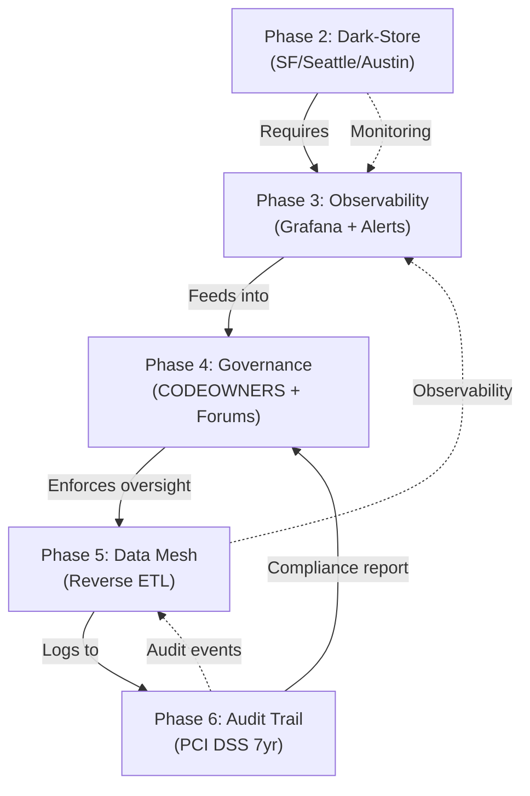

# Wave 40 Phase 2-6 Implementation Infrastructure

## Deployment Architecture & Configuration

This document covers infrastructure requirements for all Wave 40 phases (2-6).

---

## Phase 2: Dark-Store Infrastructure

### Kubernetes Namespace Configuration

```yaml
# namespaces/darkstore-sf.yaml
apiVersion: v1
kind: Namespace
metadata:
  name: darkstore-sf
  labels:
    phase: wave40-phase2
    city: san-francisco
    stage: canary
    tier: critical

---
# namespaces/darkstore-seattle.yaml
apiVersion: v1
kind: Namespace
metadata:
  name: darkstore-seattle
  labels:
    phase: wave40-phase2
    city: seattle
    stage: gated
    tier: critical

---
# namespaces/darkstore-austin.yaml
apiVersion: v1
kind: Namespace
metadata:
  name: darkstore-austin
  labels:
    phase: wave40-phase2
    city: austin
    stage: gated
    tier: critical
```

### Service Mesh Configuration (Istio)

```yaml
# istio/darkstore-virtual-services.yaml
---
# SF Canary (100% traffic to darkstore)
apiVersion: networking.istio.io/v1beta1
kind: VirtualService
metadata:
  name: fulfillment-darkstore-sf
  namespace: darkstore-sf
spec:
  hosts:
  - fulfillment-sf.darkstore.local
  http:
  - match:
    - uri:
        prefix: /api/v1/fulfillment
    route:
    - destination:
        host: fulfillment-service
        subset: darkstore-sf
      weight: 100
    timeout: 2s
    retries:
      attempts: 2
      perTryTimeout: 1s

---
# Seattle Gated (10% traffic initially)
apiVersion: networking.istio.io/v1beta1
kind: VirtualService
metadata:
  name: fulfillment-darkstore-seattle
  namespace: darkstore-seattle
spec:
  hosts:
  - fulfillment-seattle.darkstore.local
  http:
  - match:
    - uri:
        prefix: /api/v1/fulfillment
    route:
    - destination:
        host: fulfillment-service
        subset: darkstore-seattle
      weight: 10
    - destination:
        host: fulfillment-service
        subset: legacy-seattle
      weight: 90
    timeout: 2s

---
# Austin Gated (5% traffic on week 3)
apiVersion: networking.istio.io/v1beta1
kind: VirtualService
metadata:
  name: fulfillment-darkstore-austin
  namespace: darkstore-austin
spec:
  hosts:
  - fulfillment-austin.darkstore.local
  http:
  - match:
    - uri:
        prefix: /api/v1/fulfillment
    route:
    - destination:
        host: fulfillment-service
        subset: darkstore-austin
      weight: 5
    - destination:
        host: fulfillment-service
        subset: legacy-austin
      weight: 95
    timeout: 2s
```

### Traffic Management Progression

| Week | SF | Seattle | Austin | Status |
|------|-----|---------|--------|--------|
| 1 | 100% | 0% | 0% | Canary validation |
| 2 | 100% | 10% | 0% | Pre-production gates |
| 3 | 100% | 100% | 5% | Full rollout sequence |
| 4 | 100% | 100% | 100% | All cities live |

---

## Phase 3: Observability Infrastructure

### Prometheus ConfigMap

```yaml
# observability/prometheus-config.yaml
apiVersion: v1
kind: ConfigMap
metadata:
  name: prometheus-darkstore-config
  namespace: monitoring
data:
  prometheus.yml: |
    global:
      scrape_interval: 15s
      evaluation_interval: 15s
      external_labels:
        cluster: production
        environment: darkstore
        phase: wave40-phase3

    scrape_configs:
    # Java services metrics
    - job_name: 'fulfillment-service'
      kubernetes_sd_configs:
      - role: pod
        namespaces:
          names:
          - darkstore-sf
          - darkstore-seattle
          - darkstore-austin
      relabel_configs:
      - source_labels: [__meta_kubernetes_pod_annotation_prometheus_io_scrape]
        action: keep
        regex: true
      - source_labels: [__meta_kubernetes_pod_annotation_prometheus_io_path]
        action: replace
        target_label: __metrics_path__
        regex: (.+)
      - source_labels: [__address__, __meta_kubernetes_pod_annotation_prometheus_io_port]
        action: replace
        regex: ([^:]+)(?::\d+)?;(\d+)
        replacement: $1:$2
        target_label: __address__
```

### Grafana Dashboard Template

```json
{
  "dashboard": {
    "title": "Wave 40 Phase 2-3: Dark-Store Real-Time Metrics",
    "panels": [
      {
        "title": "City-Level Throughput (orders/min)",
        "targets": [
          {
            "expr": "increase(fulfillment_orders_total{city=~'sf|seattle|austin'}[5m]) / 5"
          }
        ],
        "unit": "ops"
      },
      {
        "title": "Order Fulfillment Latency (p99)",
        "targets": [
          {
            "expr": "histogram_quantile(0.99, fulfillment_duration_bucket{city=~'sf|seattle|austin'})"
          }
        ],
        "unit": "ms"
      },
      {
        "title": "Error Rate by City",
        "targets": [
          {
            "expr": "rate(fulfillment_errors_total{city=~'sf|seattle|austin'}[5m]) * 100"
          }
        ],
        "unit": "percent"
      },
      {
        "title": "Warehouse Inventory Sync (items/min)",
        "targets": [
          {
            "expr": "rate(warehouse_inventory_syncs_total{city=~'sf|seattle|austin'}[5m])"
          }
        ],
        "unit": "ops"
      },
      {
        "title": "Traffic Split %",
        "targets": [
          {
            "expr": "darkstore_traffic_weight{city=~'sf|seattle|austin'}"
          }
        ],
        "unit": "percent"
      }
    ]
  }
}
```

---

## Phase 4: Governance Infrastructure

### CODEOWNERS Configuration

```
# .github/CODEOWNERS (Excerpt - Money Path)

# Payment Services
services/payment-service/                          @payment-team @finance-lead
services/payment-webhook-service/                  @payment-team
services/reconciliation-engine/                    @payment-team @compliance-officer

# Order Processing
services/order-service/                            @order-team @product-lead
services/checkout-orchestrator-service/            @order-team

# Fulfillment
services/fulfillment-service/                      @fulfillment-team
services/warehouse-service/                        @fulfillment-team
services/rider-fleet-service/                      @logistics-lead

# Platform
services/identity-service/                         @platform-team @security-lead
services/admin-gateway-service/                    @platform-team
services/config-feature-flag-service/              @platform-team

# Data & Operations
services/reconciliation-engine/                    @data-team @compliance-officer
services/stream-processor-service/                 @data-team
services/audit-trail-service/                      @compliance-officer

# AI/ML
services/ai-inference-service/                     @ml-team
services/ai-orchestrator-service/                  @ml-team

# Engagement
services/notification-service/                     @engagement-team
services/fraud-detection-service/                  @security-team

# Docs & Diagrams
docs/services/                                     @platform-team @architecture-lead
docs/adr/                                          @architecture-lead
docs/slos/                                         @platform-team
docs/governance/                                   @leadership-team

# Infrastructure
.github/workflows/                                 @devops-lead
helm/                                              @devops-lead
terraform/                                         @devops-lead
> /Users/omkarkumar/InstaCommerce/WAVE_40_INFRASTRUCTURE.md
```

### Branch Protection Policy

```yaml
# github/branch-protection.yaml
branch_protection_rules:
  - branch: master
    enforce_admins: true
    require_code_owner_reviews: true
    required_approving_review_count: 2  # Require 2 code owner reviews
    dismiss_stale_reviews: true
    require_status_checks: true
    required_status_checks:
      - ci/build
      - ci/test
      - security-scan
      - contract-validation
    allow_deletions: false
    allow_force_pushes: false
    allow_dismissals: false
```

---

## Phase 5: Data Mesh Infrastructure

### Kubernetes Service for Reverse ETL Orchestrator

```yaml
# services/reverse-etl-orchestrator/deployment.yaml
apiVersion: apps/v1
kind: Deployment
metadata:
  name: reverse-etl-orchestrator
  namespace: data-mesh
spec:
  replicas: 2
  selector:
    matchLabels:
      app: reverse-etl-orchestrator
  template:
    metadata:
      labels:
        app: reverse-etl-orchestrator
      annotations:
        prometheus.io/scrape: "true"
        prometheus.io/port: "8097"
        prometheus.io/path: "/metrics"
    spec:
      serviceAccountName: reverse-etl-orchestrator
      containers:
      - name: orchestrator
        image: asia-south1-docker.pkg.dev/instacommerce/images/reverse-etl-orchestrator:{{VERSION}}
        ports:
        - name: http
          containerPort: 8097
        - name: metrics
          containerPort: 9090
        env:
        - name: POSTGRES_URL
          valueFrom:
            secretKeyRef:
              name: reverse-etl-secrets
              key: postgres-url
        - name: KAFKA_BROKERS
          value: "kafka-0.kafka-headless:9092,kafka-1.kafka-headless:9092,kafka-2.kafka-headless:9092"
        - name: BIGQUERY_PROJECT
          valueFrom:
            secretKeyRef:
              name: reverse-etl-secrets
              key: bigquery-project
        resources:
          requests:
            cpu: 500m
            memory: 512Mi
          limits:
            cpu: 1000m
            memory: 1Gi
        livenessProbe:
          httpGet:
            path: /health/live
            port: http
          initialDelaySeconds: 30
          periodSeconds: 10
        readinessProbe:
          httpGet:
            path: /health/ready
            port: http
          initialDelaySeconds: 10
          periodSeconds: 5
```

---

## Phase 6: Audit Trail Infrastructure

### PostgreSQL Partition Management

```sql
-- audit-trail/postgres-partitions.sql

-- Create main audit ledger table
CREATE TABLE audit_ledger (
  id BIGSERIAL NOT NULL,
  event_id UUID NOT NULL,
  event_type VARCHAR(50) NOT NULL,
  actor_id VARCHAR(100) NOT NULL,
  action VARCHAR(100) NOT NULL,
  entity_type VARCHAR(50) NOT NULL,
  entity_id VARCHAR(100) NOT NULL,
  before_state JSONB,
  after_state JSONB,
  timestamp TIMESTAMPTZ NOT NULL,
  source_ip INET,
  reason TEXT,
  signature BYTEA NOT NULL,
  created_at TIMESTAMPTZ DEFAULT NOW()
) PARTITION BY RANGE (DATE(timestamp));

-- Create daily partitions (7-year retention)
CREATE TABLE audit_ledger_2026_01_01 PARTITION OF audit_ledger
  FOR VALUES FROM ('2026-01-01') TO ('2026-01-02');

-- Create indexes
CREATE INDEX idx_audit_timestamp ON audit_ledger (timestamp DESC);
CREATE INDEX idx_audit_event_type ON audit_ledger (event_type);
CREATE INDEX idx_audit_actor ON audit_ledger (actor_id);
CREATE INDEX idx_audit_entity ON audit_ledger (entity_type, entity_id);

-- Enable row-level security
ALTER TABLE audit_ledger ENABLE ROW LEVEL SECURITY;

CREATE POLICY audit_read_policy ON audit_ledger
  FOR SELECT USING (
    current_user IN ('compliance_officer', 'cfo', 'audit_team')
  );

-- No UPDATE/DELETE allowed (immutable)
CREATE POLICY audit_insert_only ON audit_ledger
  FOR INSERT WITH CHECK (true);
```

### S3 Configuration for Cold Storage

```yaml
# terraform/s3-audit-archive.tf
resource "aws_s3_bucket" "audit_archive" {
  bucket = "instacommerce-audit-archive"
}

# Enable Object Lock (7-year immutability)
resource "aws_s3_bucket_object_lock_configuration" "audit_lock" {
  bucket = aws_s3_bucket.audit_archive.id

  rule {
    default_retention {
      mode = "GOVERNANCE"
      days = 2555  # 7 years
    }
  }
}

# Enable versioning (immutable)
resource "aws_s3_bucket_versioning" "audit_versioning" {
  bucket = aws_s3_bucket.audit_archive.id

  versioning_configuration {
    status = "Enabled"
  }
}

# Lifecycle: Move to Glacier after 1 year
resource "aws_s3_bucket_lifecycle_configuration" "audit_lifecycle" {
  bucket = aws_s3_bucket.audit_archive.id

  rule {
    id     = "move-to-glacier"
    status = "Enabled"

    transition {
      days          = 365
      storage_class = "GLACIER"
    }

    noncurrent_version_transition {
      days          = 365
      storage_class = "GLACIER"
    }
  }
}

# Encryption at-rest (AES-256)
resource "aws_s3_bucket_server_side_encryption_configuration" "audit_encryption" {
  bucket = aws_s3_bucket.audit_archive.id

  rule {
    apply_server_side_encryption_by_default {
      sse_algorithm = "AES256"
    }
  }
}
```

---

## Cross-Phase Dependencies



---

## Success Metrics Dashboard

| Phase | Metric | Target | Current | Status |
|-------|--------|--------|---------|--------|
| 2 | Canary uptime (SF) | 99.5% | - | 📋 Week 1 |
| 2 | Order latency p99 | <2s | - | 📋 Week 1-2 |
| 3 | Alert latency | <30s | - | 📋 Week 3 |
| 3 | Dashboard load time | <2s | - | 📋 Week 3 |
| 4 | Forum attendance | >80% | - | 📋 Week 4 |
| 4 | PR review time | <24hr | - | 📋 Week 4 |
| 5 | Data freshness | <5min | - | 📋 Week 4-5 |
| 6 | Audit log completeness | 100% | - | 📋 Week 5 |

---

## Deployment Sequence

```
Week 1 (Mar 24-30): Phase 2 SF Canary
  Mon: Infrastructure setup
  Tue: SF deployment
  Wed-Fri: Monitoring & validation

Week 2 (Mar 31-Apr 6): Phase 2 Seattle + Phase 3 Start
  Mon: Seattle 10% traffic
  Tue-Wed: Phase 3 Grafana setup
  Thu-Fri: Dashboard validation

Week 3 (Apr 7-13): Phase 2 Austin + Phase 3 Complete
  Mon: Austin 5% traffic
  Tue-Wed: SLO alert validation
  Thu: Phase 3 team training
  Fri: Phase 4 preparation

Week 4 (Apr 14-20): Phase 4 + Phase 5 Start
  Mon: CODEOWNERS enforcement
  Tue-Wed: Governance forums launch
  Thu-Fri: Phase 5 orchestrator design review

Week 5 (Apr 21-27): Phase 5 + Phase 6
  Mon-Wed: Phase 5 implementation
  Thu-Fri: Phase 6 audit trail deployment
  End: Wave 40 completion review
```

---

## Team Assignments

| Phase | Lead | Team | Capacity |
|-------|------|------|----------|
| 2 | Fulfillment Lead | 4 FTE | 1 week |
| 3 | Platform Lead | 2 FTE | 1 week |
| 4 | Product Lead | 1 FTE | 1 week |
| 5 | Data Lead | 3 FTE | 2 weeks |
| 6 | Compliance Officer | 2 FTE | 1 week |
| Wave 41 | QA Lead | 3 FTE | 2 weeks |

---

**Last Updated**: 2026-03-21
**Status**: 🟢 Ready for Phase 2 execution
**Next**: Commit infrastructure configs + phase plans to master
