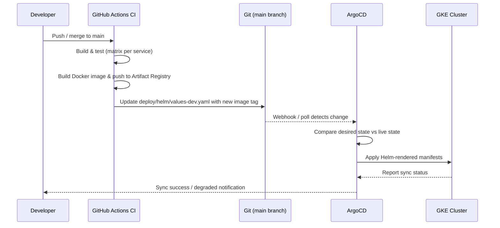

# ArgoCD GitOps Deployment

Declarative, GitOps-driven deployment configuration for InstaCommerce microservices using ArgoCD.

## App-of-Apps Pattern

InstaCommerce uses the **App-of-Apps** pattern — a single root `Application` resource (`app-of-apps.yaml`) manages all child service deployments from the `deploy/helm` chart.

```mermaid
graph TD
    A[ArgoCD Server] -->|watches| B[app-of-apps.yaml]
    B -->|references| C[deploy/helm Chart]
    C --> D[identity-service]
    C --> E[catalog-service]
    C --> F[order-service]
    C --> G[payment-service]
    C --> H[fulfillment-service]
    C --> I[cart-service]
    C --> J[checkout-orchestrator]
    C --> K[search-service]
    C --> L[pricing-service]
    C --> M[notification-service]
    C --> N[warehouse-service]
    C --> O[rider-fleet-service]
    C --> P[routing-eta-service]
    C --> Q[wallet-loyalty-service]
    C --> R[fraud-detection-service]
    C --> S[audit-trail-service]
    C --> T[config-feature-flag-service]
    C --> U[ai-orchestrator-service]
    C --> V[ai-inference-service]
    C --> W[dispatch-optimizer-service]
    C --> X[outbox-relay]
    C --> Y[cdc-consumer]
    C --> Z[mobile-bff-service]
    C --> AA[admin-gateway-service]

    style A fill:#e44d26,color:#fff
    style B fill:#326ce5,color:#fff
    style C fill:#0db7ed,color:#fff
```



## Sync Strategy

The root application is configured with **automated sync**:

| Setting | Value | Description |
|---------|-------|-------------|
| `automated.prune` | `true` | Removes resources no longer in Git |
| `automated.selfHeal` | `true` | Reverts manual cluster changes |
| `CreateNamespace` | `true` | Auto-creates target namespace |
| Target Revision | `main` | Tracks the `main` branch |
| Destination | `instacommerce` namespace | Single namespace deployment |

## Deployment Flow



### Environments

| Environment | Values File | Trigger |
|-------------|------------|---------|
| **dev** | `values-dev.yaml` | Automatic on merge to `main` |
| **prod** | `values-prod.yaml` | Manual promotion / tag-based |

## Rollback Procedure

### Automatic Rollback (Self-Heal)

ArgoCD's `selfHeal: true` automatically reverts any manual changes made directly to the cluster.

### Manual Rollback via Git

```bash
# 1. Identify the last known-good commit
git log --oneline deploy/helm/values-dev.yaml

# 2. Revert the values file to the previous version
git revert <commit-sha>
git push origin main

# 3. ArgoCD auto-syncs the reverted state
```

### Manual Rollback via ArgoCD CLI

```bash
# List application history
argocd app history instacommerce

# Roll back to a specific revision
argocd app rollback instacommerce <revision-id>

# Force sync to a specific Git commit
argocd app sync instacommerce --revision <git-sha>
```

### Emergency Rollback

```bash
# Disable auto-sync to prevent ArgoCD from overwriting manual fixes
argocd app set instacommerce --sync-policy none

# Manually roll back a specific deployment in-cluster
kubectl rollout undo deployment/<service-name> -n instacommerce

# Re-enable auto-sync after the Git state is corrected
argocd app set instacommerce --sync-policy automated --self-heal --auto-prune
```

## Files

| File | Description |
|------|-------------|
| `app-of-apps.yaml` | Root ArgoCD Application pointing to `deploy/helm` |
