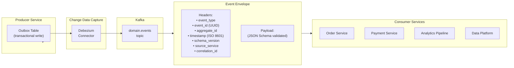
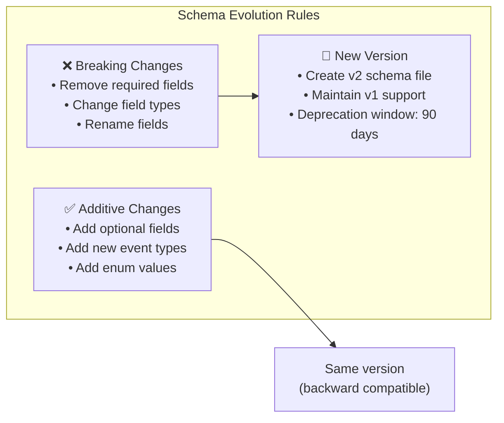

# InstaCommerce Event Contracts

Canonical event schemas (JSON Schema) and gRPC service definitions (Protocol Buffers) for cross-service communication in the InstaCommerce platform. All domain events flow through Kafka via the outbox + Debezium CDC pipeline.

---

## Event Envelope



Every event published to Kafka is wrapped in a standard envelope:

```json
{
  "event_id": "550e8400-e29b-41d4-a716-446655440000",
  "event_type": "OrderPlaced",
  "aggregate_id": "order-12345",
  "schema_version": "v1",
  "source_service": "order-service",
  "correlation_id": "req-abc-123",
  "timestamp": "2024-01-15T10:30:00Z",
  "payload": { ... }
}
```

---

## Directory Structure

```
contracts/
├── build.gradle.kts                   # Protobuf plugin + gRPC dependencies
│
└── src/main/
    ├── proto/                         # gRPC service definitions
    │   ├── common/v1/
    │   │   └── money.proto            # Shared Money type
    │   ├── catalog/v1/
    │   │   └── catalog_service.proto  # Catalog gRPC service
    │   ├── inventory/v1/
    │   │   └── inventory_service.proto # Inventory gRPC service
    │   └── payment/v1/
    │       └── payment_service.proto  # Payment gRPC service
    │
    └── resources/schemas/             # JSON Schema event definitions
        ├── README.md
        ├── catalog/
        ├── orders/
        ├── payments/
        ├── inventory/
        ├── fulfillment/
        ├── identity/
        ├── fraud/
        ├── rider/
        └── warehouse/
```

### Build

```bash
# Generate Protobuf + gRPC stubs
./gradlew :contracts:build
```

| Library | Version |
|---------|---------|
| grpc-protobuf | 1.62.2 |
| grpc-stub | 1.62.2 |
| grpc-netty-shaded | 1.62.2 |
| protoc | 3.25.3 |
| protoc-gen-grpc-java | 1.62.2 |

---

## Event Types by Domain

### Orders (`orders.events`)

| Event | Schema | Version | Description |
|-------|--------|---------|-------------|
| `OrderPlaced` | `orders/OrderPlaced.v1.json` | v1 | Order created with items, totals, payment reference |
| `OrderPacked` | `orders/OrderPacked.v1.json` | v1 | Order picked and packed at store |
| `OrderDispatched` | `orders/OrderDispatched.v1.json` | v1 | Order handed to rider for delivery |
| `OrderDelivered` | `orders/OrderDelivered.v1.json` | v1 | Order delivered to customer |
| `OrderCancelled` | `orders/OrderCancelled.v1.json` | v1 | Order cancelled (by customer or system) |
| `OrderFailed` | `orders/OrderFailed.v1.json` | v1 | Order processing failed |

### Payments (`payments.events`)

| Event | Schema | Version | Description |
|-------|--------|---------|-------------|
| `PaymentAuthorized` | `payments/PaymentAuthorized.v1.json` | v1 | Payment authorization succeeded |
| `PaymentCaptured` | `payments/PaymentCaptured.v1.json` | v1 | Payment captured (funds collected) |
| `PaymentFailed` | `payments/PaymentFailed.v1.json` | v1 | Payment processing failed |
| `PaymentRefunded` | `payments/PaymentRefunded.v1.json` | v1 | Payment refunded to customer |
| `PaymentVoided` | `payments/PaymentVoided.v1.json` | v1 | Payment authorization voided |
| `PaymentDisputed` | `payments/PaymentDisputed.v1.json` | v1 | Payment disputed by cardholder |
| `PaymentDisputeUpdated` | `payments/PaymentDisputeUpdated.v1.json` | v1 | Dispute status updated by PSP |
| `PaymentDisputeWon` | `payments/PaymentDisputeWon.v1.json` | v1 | Dispute resolved in merchant's favor |
| `PaymentDisputeLost` | `payments/PaymentDisputeLost.v1.json` | v1 | Dispute resolved in cardholder's favor |
| `PaymentCaptureReverted` | `payments/PaymentCaptureReverted.v1.json` | v1 | Capture attempt reverted to authorized |
| `PaymentVoidReverted` | `payments/PaymentVoidReverted.v1.json` | v1 | Void attempt reverted to authorized |
| `PaymentRefundFailed` | `payments/PaymentRefundFailed.v1.json` | v1 | Refund processing failed |

### Inventory (`inventory.events`)

| Event | Schema | Version | Description |
|-------|--------|---------|-------------|
| `StockReserved` | `inventory/StockReserved.v1.json` | v1 | Stock reserved for an order |
| `StockConfirmed` | `inventory/StockConfirmed.v1.json` | v1 | Stock reservation confirmed |
| `StockReleased` | `inventory/StockReleased.v1.json` | v1 | Reserved stock released back |
| `LowStockAlert` | `inventory/LowStockAlert.v1.json` | v1 | Stock below reorder threshold |

### Fulfillment (`fulfillment.events`)

| Event | Schema | Version | Description |
|-------|--------|---------|-------------|
| `PickTaskCreated` | `fulfillment/PickTaskCreated.v1.json` | v1 | Pick task assigned to store staff |
| `OrderPacked` | `fulfillment/OrderPacked.v1.json` | v1 | Order packing completed |
| `RiderAssigned` | `fulfillment/RiderAssigned.v1.json` | v1 | Rider assigned to order |
| `DeliveryCompleted` | `fulfillment/DeliveryCompleted.v1.json` | v1 | Delivery confirmed complete |

### Catalog (`catalog.events`)

| Event | Schema | Version | Description |
|-------|--------|---------|-------------|
| `ProductCreated` | `catalog/ProductCreated.v1.json` | v1 | New product added to catalog |
| `ProductUpdated` | `catalog/ProductUpdated.v1.json` | v1 | Product details updated |

### Identity (`identity.events`)

| Event | Schema | Version | Description |
|-------|--------|---------|-------------|
| `UserErased` | `identity/UserErased.v1.json` | v1 | User data erased (GDPR right-to-be-forgotten) |

### Fraud (`fraud.events`)

| Event | Schema | Version | Description |
|-------|--------|---------|-------------|
| `FraudDetected` | `fraud/FraudDetected.v1.json` | v1 | Fraud detected on transaction |

### Rider (`rider.events`)

| Event | Schema | Version | Description |
|-------|--------|---------|-------------|
| `RiderCreated` | `rider/RiderCreated.v1.json` | v1 | New rider registered |
| `RiderOnboarded` | `rider/RiderOnboarded.v1.json` | v1 | Rider onboarding completed |
| `RiderActivated` | `rider/RiderActivated.v1.json` | v1 | Rider activated for deliveries |
| `RiderAssigned` | `rider/RiderAssigned.v1.json` | v1 | Rider assigned to order |
| `RiderSuspended` | `rider/RiderSuspended.v1.json` | v1 | Rider account suspended |

### Warehouse (`warehouse.events`)

| Event | Schema | Version | Description |
|-------|--------|---------|-------------|
| `StoreCreated` | `warehouse/StoreCreated.v1.json` | v1 | New store/dark store created |
| `StoreStatusChanged` | `warehouse/StoreStatusChanged.v1.json` | v1 | Store status changed (open/closed/maintenance) |
| `StoreDeleted` | `warehouse/StoreDeleted.v1.json` | v1 | Store decommissioned |

---

## gRPC Proto Definitions

| Service | Proto File | Description |
|---------|-----------|-------------|
| `common.v1.Money` | `common/v1/money.proto` | Shared monetary value type (amount + currency) |
| `CatalogService` | `catalog/v1/catalog_service.proto` | Product CRUD, search, category management |
| `InventoryService` | `inventory/v1/inventory_service.proto` | Stock queries, reservations, adjustments |
| `PaymentService` | `payment/v1/payment_service.proto` | Payment authorization, capture, refund |

---

## Schema Evolution Strategy



### Rules

1. **Backward compatible** (additive) changes are applied to the existing `v1` schema:
   - Add new optional fields
   - Add new event types
   - Widen enum values

2. **Breaking changes** require a new version file (e.g., `OrderPlaced.v2.json`):
   - Removing or renaming required fields
   - Changing field types
   - Both v1 and v2 are supported during a **90-day deprecation window**

3. **Naming conventions**:
   - Events: `{AggregateAction}.v{N}.json` (e.g., `OrderPlaced.v1.json`)
   - Kafka topics: `{domain}.events` (e.g., `orders.events`)

---

## CI Validation

Schema validation runs automatically in CI:

```bash
# Build contracts (compiles protos + validates JSON schemas)
./gradlew :contracts:build
```

| Check | Trigger | Description |
|-------|---------|-------------|
| Proto compilation | Every PR | Compile all `.proto` files, generate gRPC stubs |
| JSON Schema validation | Every PR | Validate all schemas are valid draft-07 |
| Breaking change detection | Every PR | Diff schemas against `main` branch for field removals |
| Compatibility test | Every PR | Verify consumers can deserialize with updated schemas |
