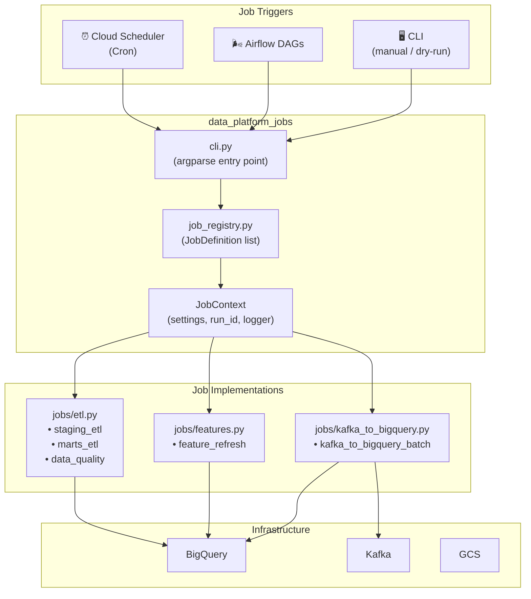

# InstaCommerce Data Platform Jobs

Scheduled ETL and feature computation jobs for the InstaCommerce data platform. Provides a unified Python CLI for running BigQuery staging/marts refreshes, ML feature recomputation, Kafka batch loading, and post-load quality checks.

---

## Architecture



---

## Directory Structure

```
data-platform-jobs/
├── README.md
├── requirements.txt
│
└── data_platform_jobs/
    ├── __init__.py
    ├── __main__.py              # python -m entry point
    ├── cli.py                   # CLI runner (list, run, schedules)
    ├── config.py                # JobSettings from env vars
    ├── bigquery.py              # BigQuery client helpers
    ├── job_registry.py          # Central job definitions + context builder
    │
    ├── jobs/
    │   ├── __init__.py
    │   ├── etl.py               # staging_etl, marts_etl, data_quality
    │   ├── features.py          # feature_refresh computation
    │   └── kafka_to_bigquery.py # Kafka batch loader skeleton
    │
    └── hooks/
        ├── __init__.py
        └── scheduler.py         # Cron metadata export
```

---

## Job Registry

All jobs are defined in `job_registry.py` as `JobDefinition` dataclasses:

| Job | Cron (UTC) | Handler | Purpose |
|-----|-----------|---------|---------|
| `staging_etl` | `0 */2 * * *` | `etl.run_staging_etl` | Refresh BigQuery staging tables from raw datasets |
| `marts_etl` | `0 2 * * *` | `etl.run_marts_etl` | Refresh BigQuery marts for analytics consumption |
| `feature_refresh` | `0 */4 * * *` | `features.run_feature_refresh` | Compute offline ML features in BigQuery |
| `kafka_to_bigquery_batch` | `*/15 * * * *` | `kafka_to_bigquery.run_batch_loader` | Batch-load Kafka events into BigQuery raw tables |
| `data_quality` | `0 */2 * * *` | `etl.run_data_quality_checks` | Run post-load data quality checks |

---

## CLI Usage

```bash
cd data-platform-jobs

# List all registered jobs
python -m data_platform_jobs list

# Run a job (dry-run mode logs without executing queries)
python -m data_platform_jobs run --job staging_etl --dry-run

# Run a job for real
python -m data_platform_jobs run --job feature_refresh

# Export schedules as JSON or text
python -m data_platform_jobs schedules --format json
python -m data_platform_jobs schedules --format text

# Custom log level
python -m data_platform_jobs --log-level DEBUG run --job marts_etl
```

### CLI Commands

| Command | Description |
|---------|------------|
| `list` | Print all available jobs with description and cron schedule |
| `run --job <name> [--dry-run]` | Execute a job; `--dry-run` logs actions without running queries |
| `schedules --format <json\|text>` | Export all job schedules for external scheduler integration |

---

## Configuration

All settings are loaded from environment variables with sensible defaults (see `config.py`):

| Environment Variable | Default | Description |
|---------------------|---------|-------------|
| `DATA_PLATFORM_PROJECT_ID` | `instacommerce-dev` | GCP project ID |
| `DATA_PLATFORM_BQ_DATASET_RAW` | `raw` | BigQuery raw dataset |
| `DATA_PLATFORM_BQ_DATASET_STAGING` | `staging` | BigQuery staging dataset |
| `DATA_PLATFORM_BQ_DATASET_MARTS` | `marts` | BigQuery marts dataset |
| `DATA_PLATFORM_BQ_DATASET_FEATURES` | `features` | BigQuery features dataset |
| `DATA_PLATFORM_KAFKA_BOOTSTRAP` | `localhost:9092` | Kafka bootstrap servers |
| `DATA_PLATFORM_KAFKA_TOPICS` | `order.events,payment.events` | Kafka topics to consume |
| `DATA_PLATFORM_KAFKA_CONSUMER_GROUP` | `data-platform-batch-loader` | Kafka consumer group |
| `DATA_PLATFORM_KAFKA_MAX_MESSAGES` | `5000` | Max messages per batch window |
| `DATA_PLATFORM_BATCH_WINDOW_MINUTES` | `15` | Batch window duration |
| `DATA_PLATFORM_TIMEZONE` | `UTC` | Timezone for scheduling |

---

## How to Add a New Job

1. **Create the handler** in `data_platform_jobs/jobs/`:

   ```python
   # data_platform_jobs/jobs/my_new_job.py
   def run_my_job(context: "JobContext") -> None:
       context.logger.info("Running my job", extra={"run_id": context.run_id})
       if context.dry_run:
           context.logger.info("DRY RUN — skipping execution")
           return
       # ... actual job logic ...
   ```

2. **Register it** in `job_registry.py`:

   ```python
   from data_platform_jobs.jobs import my_new_job

   JOB_DEFINITIONS.append(
       JobDefinition(
           name="my_new_job",
           description="Description of what this job does.",
           schedule=JobSchedule(cron="0 6 * * *"),
           handler=my_new_job.run_my_job,
       )
   )
   ```

3. **Test locally**:

   ```bash
   python -m data_platform_jobs run --job my_new_job --dry-run
   ```

4. **Deploy**: The job will be picked up automatically by Airflow or Cloud Scheduler via the exported schedules.

---

## Notes

- The BigQuery and Kafka integrations are intentionally lightweight; install Google Cloud and Kafka client libraries in the runtime environment when wiring to production infrastructure.
- Each job execution gets a unique `run_id` (UUID hex) and UTC timestamp for traceability.
- All jobs support `--dry-run` mode for safe local testing.
