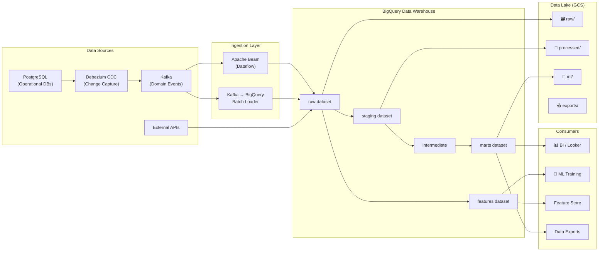
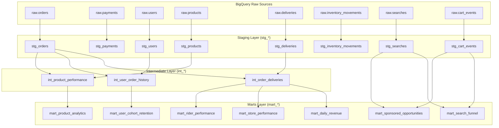
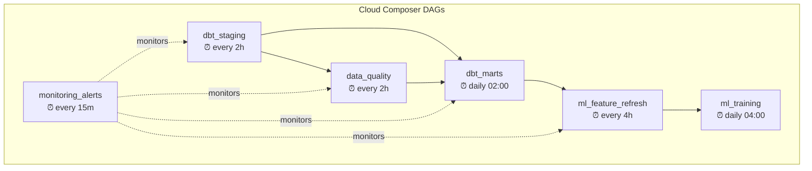
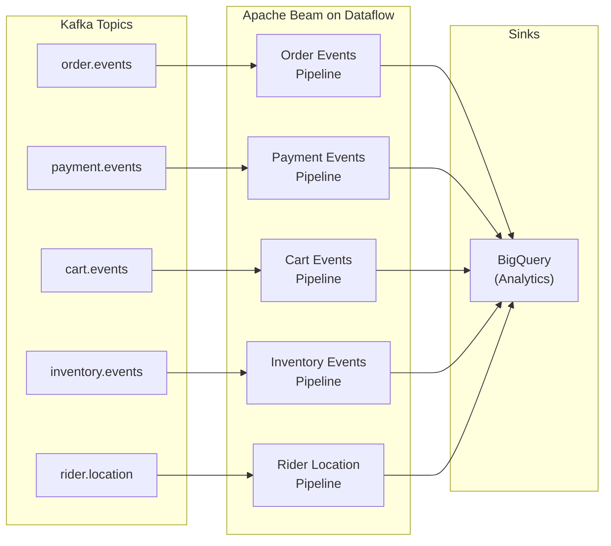
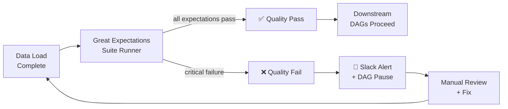
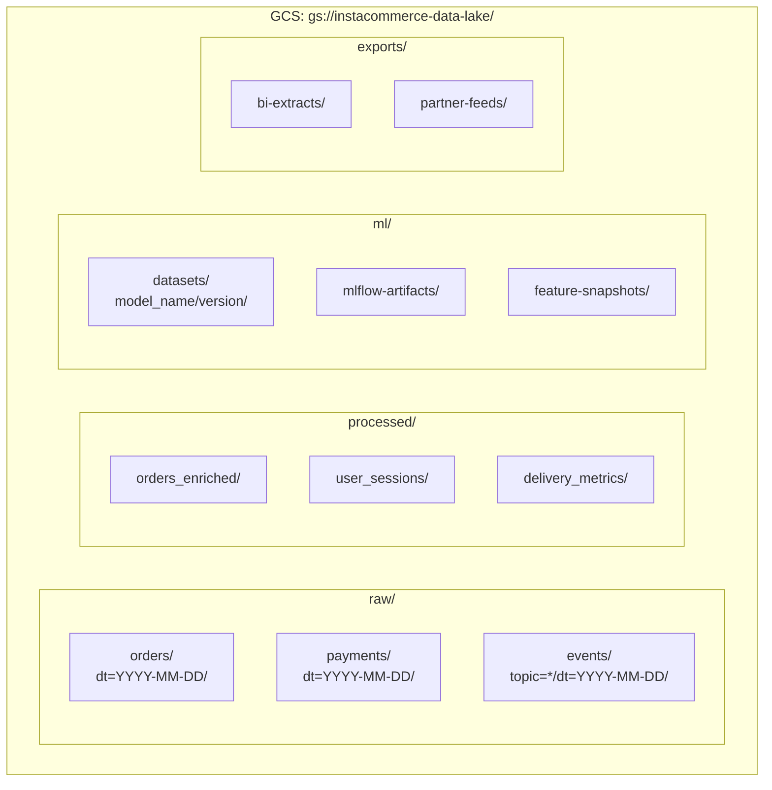

# InstaCommerce Data Platform

Analytics data warehouse (dbt), workflow orchestration (Airflow), real-time
streaming pipelines (Apache Beam on Dataflow), and data quality enforcement
(Great Expectations) for the InstaCommerce Q-commerce platform.

> **Source-of-truth note:** the detailed streaming contract lives in
> [`streaming/README.md`](streaming/README.md). This top-level README focuses on
> platform architecture and now mirrors the actual pipeline windows, sinks, and
> DAG schedules in the repository.

---

## High-Level Design (HLD)



---

## Low-Level Design (LLD)

### Repository Structure

```
data-platform/
├── README.md
│
├── dbt/                              # dbt analytics project
│   ├── dbt_project.yml
│   ├── profiles.yml
│   └── models/
│       ├── staging/                   # 1:1 source mirrors, light cleaning
│       │   ├── sources.yml
│       │   ├── schema.yml
│       │   ├── stg_orders.sql
│       │   ├── stg_payments.sql
│       │   ├── stg_users.sql
│       │   ├── stg_products.sql
│       │   ├── stg_deliveries.sql
│       │   ├── stg_inventory_movements.sql
│       │   ├── stg_searches.sql
│       │   └── stg_cart_events.sql
│       ├── intermediate/              # Business logic joins
│       │   ├── int_order_deliveries.sql
│       │   ├── int_user_order_history.sql
│       │   └── int_product_performance.sql
│       └── marts/                     # Consumption-ready analytics
│           ├── schema.yml
│           ├── mart_daily_revenue.sql
│           ├── mart_store_performance.sql
│           ├── mart_rider_performance.sql
│           ├── mart_search_funnel.sql
│           ├── mart_product_analytics.sql
│           ├── mart_user_cohort_retention.sql
│           └── mart_sponsored_opportunities.sql
│
├── airflow/                           # Cloud Composer DAGs
│   ├── requirements.txt
│   ├── dags/
│   │   ├── dbt_staging.py             # Refresh staging models
│   │   ├── dbt_marts.py               # Refresh mart models
│   │   ├── data_quality.py            # Post-load quality checks
│   │   ├── ml_feature_refresh.py      # Recompute ML features
│   │   ├── ml_training.py             # Trigger model training
│   │   └── monitoring_alerts.py       # SLA & freshness alerts
│   └── plugins/
│       ├── __init__.py
│       └── slack_alerts.py            # Slack notification hooks
│
├── streaming/                         # Apache Beam pipelines (Dataflow)
│   ├── README.md
│   ├── requirements.txt
│   ├── pipelines/
│   │   ├── order_events_pipeline.py
│   │   ├── payment_events_pipeline.py
│   │   ├── cart_events_pipeline.py
│   │   ├── inventory_events_pipeline.py
│   │   └── rider_location_pipeline.py
│   └── deploy/
│       └── dataflow_template.yaml
│
└── quality/                           # Data quality (Great Expectations)
    ├── run_quality_checks.py
    └── expectations/
        ├── orders_suite.yaml
        ├── payments_suite.yaml
        ├── users_suite.yaml
        └── inventory_suite.yaml
```

---

## dbt Layer Diagram



### dbt Quick Start

```bash
cd data-platform/dbt
dbt deps
dbt run --select staging      # refresh staging models
dbt run --select intermediate # refresh intermediate
dbt run --select marts        # refresh marts
dbt test                      # run schema + data tests
```

---

## Airflow DAG Dependencies



| DAG | Schedule (UTC) | Purpose |
|-----|---------------|---------|
| `dbt_staging` | `0 */2 * * *` | Refresh staging tables from raw sources |
| `data_quality` | `0 */2 * * *` | Run Great Expectations suites post-load |
| `dbt_marts` | `0 2 * * *` | Rebuild analytics marts (daily) |
| `ml_feature_refresh` | `0 */4 * * *` | Recompute ML feature tables in BigQuery |
| `ml_training` | `0 4 * * *` | Trigger daily model retraining / evaluation pipeline |
| `monitoring_alerts` | `*/15 * * * *` | Check SLA freshness & alert on Slack |

---

## Streaming Pipeline Architecture



| Pipeline | Source Topic | Sinks | Window | Purpose |
|----------|-------------|-------|--------|---------|
| `order_events_pipeline` | `order.events` | BigQuery | 1 min fixed | Order analytics and SLA tracking |
| `payment_events_pipeline` | `payment.events` | BigQuery | 1 min fixed | Payment reconciliation and success metrics |
| `cart_events_pipeline` | `cart.events` | BigQuery | 15 min session | Cart analytics and abandonment modeling |
| `inventory_events_pipeline` | `inventory.events` | BigQuery | 5 min fixed | Stock velocity and stockout tracking |
| `rider_location_pipeline` | `rider.location` | BigQuery | 1 min fixed | Rider utilization and zone-level tracking |

> The streaming README contains the canonical per-pipeline deployment and
> monitoring details. Use this top-level table as the architecture summary and
> [`streaming/README.md`](streaming/README.md) for execution specifics.

---

## Data Quality Gate Flow



### Quality Suites

| Suite | Target Tables | Key Expectations |
|-------|--------------|------------------|
| `orders_suite` | `raw.orders`, `staging.orders` | Non-null order_id, valid amounts, referential integrity |
| `payments_suite` | `raw.payments`, `staging.payments` | Amount > 0, valid currency codes, status enum |
| `users_suite` | `raw.users`, `staging.users` | Valid email format, unique user_id |
| `inventory_suite` | `raw.inventory_movements` | Non-negative quantities, valid store references |

---

## Data Lake Structure



| Zone | Path Pattern | Retention | Format |
|------|-------------|-----------|--------|
| `raw/` | `raw/{domain}/dt=YYYY-MM-DD/` | 90 days | Avro / JSON |
| `processed/` | `processed/{domain}/` | 1 year | Parquet |
| `ml/` | `ml/datasets/{model}/{version}/` | Indefinite | Parquet |
| `exports/` | `exports/{consumer}/` | 30 days | CSV / Parquet |

---

## Testing and Validation

Use the existing dbt and quality commands as the first-line validation loop for any platform change:

```bash
cd data-platform/dbt && dbt deps
cd data-platform/dbt && dbt test
cd data-platform/dbt && dbt run --select marts
python data-platform/quality/run_quality_checks.py
```

## Rollout and Rollback

- ship streaming, dbt, and DAG changes independently so ingestion, transformation, and orchestration can be rolled back without a full-platform revert
- prefer additive BigQuery/dbt changes over destructive schema rewrites
- canary new Beam/Dataflow jobs with side-by-side output validation before cutting consumers over
- pause downstream DAGs and alert analytics owners when Great Expectations finds critical contract failures

## Known Limitations

- some platform diagrams still describe target-state storage zones and activation flows that are only partially represented in checked-in code
- event-time correctness, late-data handling, and contract governance are called out in `docs/reviews/iter3/platform/data-platform-correctness.md` and remain active hardening areas
- the top-level README is intentionally high-signal; `streaming/README.md`, dbt models, and Airflow DAGs remain the executable source of truth
