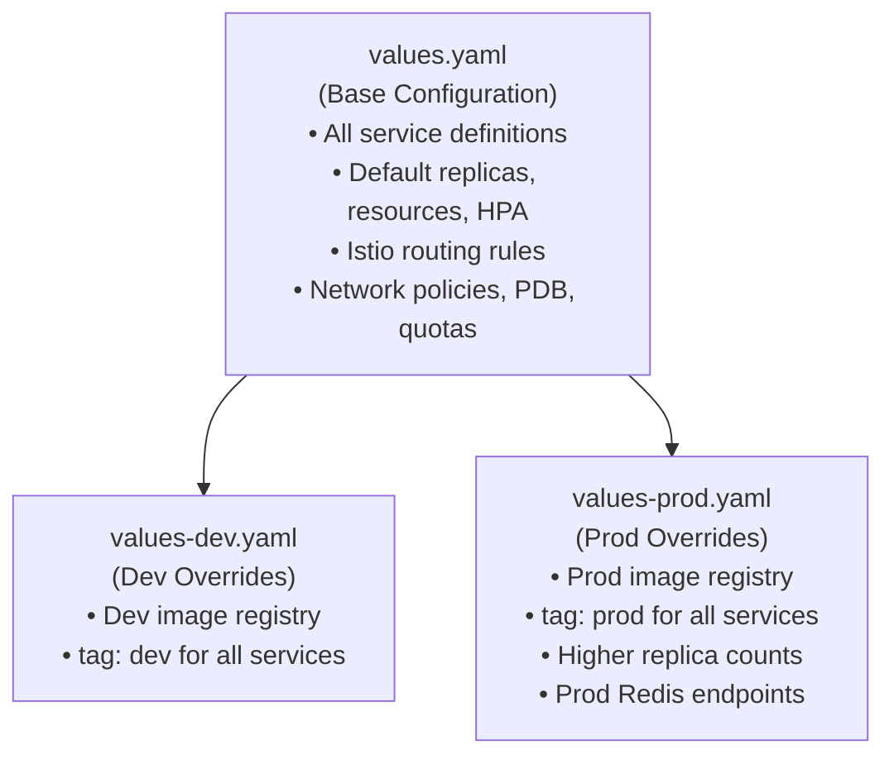

# InstaCommerce Helm Charts

Kubernetes deployment configuration for all InstaCommerce microservices. Uses a single umbrella Helm chart with per-service configuration and environment-specific value overrides.

---

## Chart Structure

```
deploy/helm/
├── Chart.yaml                   # Chart metadata (instacommerce v0.1.0)
├── values.yaml                  # Base values (all services, Istio, PDB, quotas)
├── values-dev.yaml              # Dev environment overrides
├── values-prod.yaml             # Production environment overrides
│
└── templates/
    ├── _helpers.tpl             # Template helper functions
    ├── deployment.yaml          # Deployment per service
    ├── service.yaml             # ClusterIP Service per service
    ├── serviceaccount.yaml      # ServiceAccount per service
    ├── hpa.yaml                 # HorizontalPodAutoscaler
    ├── pdb.yaml                 # PodDisruptionBudget
    ├── ingress.yaml             # Ingress (disabled, Istio used instead)
    ├── network-policy.yaml      # NetworkPolicy rules
    ├── resource-quota.yaml      # Namespace ResourceQuota
    │
    └── istio/                   # Istio service mesh configuration
        ├── gateway.yaml         # Istio Gateway (TLS termination)
        ├── virtual-service.yaml # Traffic routing rules
        ├── destination-rule.yaml # Load balancing + circuit breaker
        ├── peer-authentication.yaml # mTLS enforcement
        ├── request-authentication.yaml # JWT validation
        ├── authorization-policy.yaml # Service-to-service AuthZ
        └── security-headers.yaml # Security header injection
```

| Field | Value |
|-------|-------|
| Chart Name | `instacommerce` |
| Chart Version | `0.1.0` |
| App Version | `0.1.0` |
| Type | `application` |

---

## Values Hierarchy



| Layer | File | Purpose |
|-------|------|---------|
| **Base** | `values.yaml` | All service definitions, resource requests/limits, HPA configs, Istio rules, network policies |
| **Dev** | `values-dev.yaml` | Dev image registry (`dev-images`), `tag: dev` for all services |
| **Prod** | `values-prod.yaml` | Prod image registry (`prod-images`), `tag: prod`, higher replica counts (3), prod Redis hosts |

---

## Service Port Mapping

| Service | Port | Replicas (Base) | Replicas (Prod) | CPU Request | Memory Request |
|---------|------|----------------|-----------------|-------------|---------------|
| `identity-service` | 8080 | 2 | 3 | 500m | 768Mi |
| `catalog-service` | 8080 | 2 | 3 | 250m | 384Mi |
| `inventory-service` | 8080 | 2 | 3 | 500m | 512Mi |
| `order-service` | 8080 | 2 | 3 | 500m | 768Mi |
| `payment-service` | 8080 | 2 | 3 | 500m | 768Mi |
| `fulfillment-service` | 8080 | 2 | 3 | 500m | 512Mi |
| `notification-service` | 8080 | 2 | 2 | 200m | 256Mi |
| `search-service` | 8086 | 2 | 2 | 500m | 512Mi |
| `pricing-service` | 8087 | 2 | 2 | 500m | 512Mi |
| `cart-service` | 8088 | 2 | 2 | 500m | 512Mi |
| `checkout-orchestrator-service` | 8089 | 2 | 2 | 500m | 768Mi |
| `ai-orchestrator-service` | 8100 | 2 | 2 | 500m | 768Mi |
| `ai-inference-service` | 8101 | 2 | 2 | 750m | 1024Mi |
| `dispatch-optimizer-service` | 8102 | 2 | 2 | 500m | 512Mi |
| `outbox-relay` | 8103 | 2 | 2 | 500m | 512Mi |
| `cdc-consumer` | 8104 | 2 | 2 | 500m | 512Mi |
| `location-ingestion` | 8105 | 2 | 2 | 500m | 512Mi |
| `payment-webhook` | 8106 | 2 | 2 | 500m | 512Mi |
| `reconciliation-engine` | 8107 | 2 | 2 | 500m | 512Mi |
| `warehouse-service` | 8090 | 2 | 2 | 250m | 384Mi |
| `rider-fleet-service` | 8091 | 2 | 2 | 250m | 384Mi |
| `routing-eta-service` | 8092 | 2 | 2 | 250m | 384Mi |
| `wallet-loyalty-service` | 8093 | 2 | 2 | 250m | 384Mi |
| `audit-trail-service` | 8094 | 2 | 2 | 200m | 256Mi |
| `fraud-detection-service` | 8095 | 2 | 2 | 250m | 384Mi |
| `config-feature-flag-service` | 8096 | 2 | 2 | 200m | 256Mi |
| `mobile-bff-service` | 8097 | 2 | 2 | 250m | 384Mi |
| `admin-gateway-service` | 8099 | 2 | 2 | 250m | 384Mi |

---

## Istio Routing

API traffic is routed through the Istio service mesh:

| Route Prefix | Target Service |
|-------------|---------------|
| `/api/v1/auth`, `/api/v1/users` | `identity-service` |
| `/api/v1/products`, `/api/v1/categories` | `catalog-service` |
| `/api/v1/search` | `search-service` |
| `/api/v1/pricing` | `pricing-service` |
| `/api/v1/cart` | `cart-service` |
| `/api/v1/checkout` | `checkout-orchestrator-service` |
| `/api/v1/orders` | `order-service` |
| `/api/v1/fulfillment` | `fulfillment-service` |
| `/api/v1/stores` | `warehouse-service` |
| `/api/v1/riders` | `rider-fleet-service` |
| `/api/v1/deliveries`, `/api/v1/tracking` | `routing-eta-service` |
| `/api/v1/notifications` | `notification-service` |
| `/api/v1/wallet`, `/api/v1/loyalty`, `/api/v1/referral` | `wallet-loyalty-service` |
| `/api/v1/fraud` | `fraud-detection-service` |
| `/api/v1/flags` | `config-feature-flag-service` |
| `/api/v1/audit` | `audit-trail-service` |
| `/bff/mobile/v1`, `/m/v1` | `mobile-bff-service` |
| `/admin/v1` | `admin-gateway-service` |

Gateway hosts: `api.instacommerce.dev`, `m.instacommerce.dev`, `admin.instacommerce.dev`

### Service Mesh Features

- **mTLS**: Enforced via PeerAuthentication (STRICT mode)
- **JWT validation**: RequestAuthentication with JWKS from identity-service
- **AuthorizationPolicy**: Restricts inter-service access (e.g., only `order-service` and `fulfillment-service` can call `payment-service`)
- **Autoscaling**: All services have HPA with CPU target of **70%**, min/max replicas vary by criticality (2–15)

---

## How to Deploy

### Prerequisites

- Kubernetes cluster with Istio installed
- Helm 3.x
- `kubectl` configured for the target cluster

### Deploy to Dev

```bash
helm upgrade --install instacommerce deploy/helm/ \
  -f deploy/helm/values.yaml \
  -f deploy/helm/values-dev.yaml \
  -n instacommerce-dev \
  --create-namespace
```

### Deploy to Production

```bash
helm upgrade --install instacommerce deploy/helm/ \
  -f deploy/helm/values.yaml \
  -f deploy/helm/values-prod.yaml \
  -n instacommerce-prod \
  --create-namespace
```

### Dry Run / Diff

```bash
# Preview rendered templates
helm template instacommerce deploy/helm/ \
  -f deploy/helm/values.yaml \
  -f deploy/helm/values-dev.yaml

# Diff against live cluster
helm diff upgrade instacommerce deploy/helm/ \
  -f deploy/helm/values.yaml \
  -f deploy/helm/values-prod.yaml \
  -n instacommerce-prod
```

---

## Resource Quotas

Namespace-level resource quota (enabled by default):

| Resource | Quota |
|----------|-------|
| CPU requests | 64 cores |
| Memory requests | 84 Gi |
| CPU limits | 128 cores |
| Memory limits | 164 Gi |
