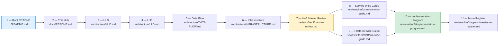
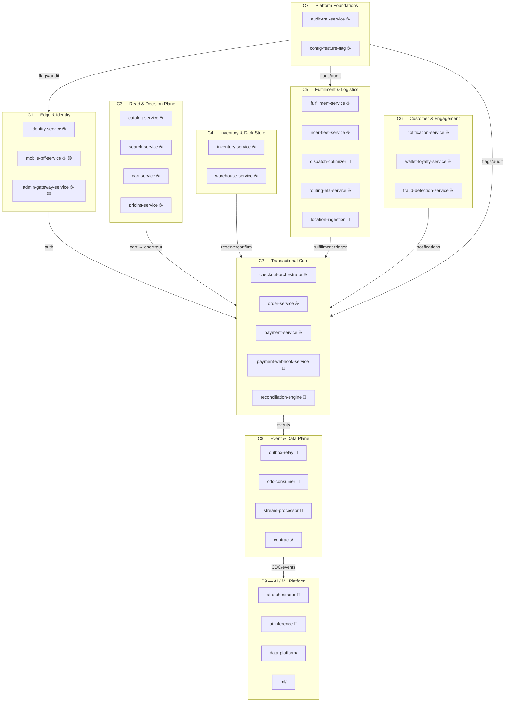
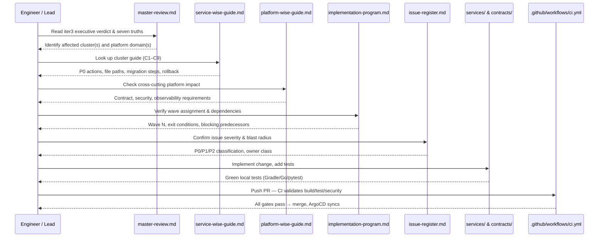
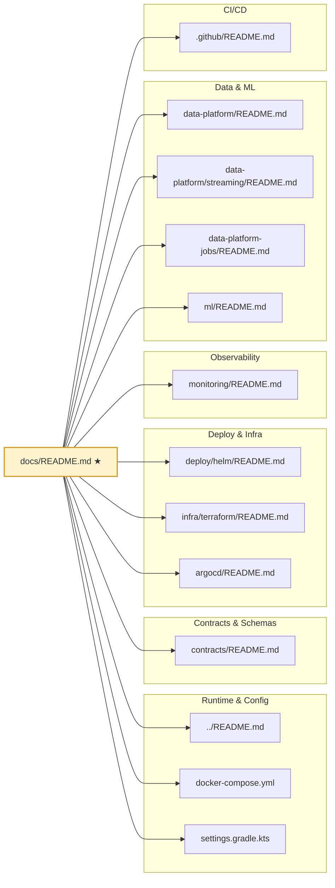

# InstaCommerce Documentation Hub

> **Role of this file.** This README is the single entry-point for navigating all
> architecture, design, review, and operational documentation in the InstaCommerce
> monorepo. It does **not** duplicate the repository-level getting-started guide
> ([`../README.md`](../README.md)) or the CI/build reference
> ([`.github/workflows/ci.yml`](../.github/workflows/ci.yml)). Instead it provides
> a reading order, domain map, and explicit links so any engineer — from new joiner
> to principal reviewer — can reach the right document in two clicks.
>
> **Audience:** CTO, Principal/Staff Engineers, EMs, SRE, Platform, Security,
> Data/ML, AI, and new joiners seeking orientation.

---

## Table of Contents

1. [Recommended Reading Order](#1-recommended-reading-order)
2. [Documentation Flow — How This Hub Connects](#2-documentation-flow--how-this-hub-connects)
3. [Architecture Documents (HLD / LLD)](#3-architecture-documents-hld--lld)
4. [Domain Map — Service Clusters](#4-domain-map--service-clusters)
5. [Iteration 3 Review Artifacts](#5-iteration-3-review-artifacts)
6. [Iter3 Artifacts → Implementation Mapping](#6-iter3-artifacts--implementation-mapping)
7. [Service Review Reports](#7-service-review-reports)
8. [Infrastructure & Cross-Cutting Reviews](#8-infrastructure--cross-cutting-reviews)
9. [Related Documentation (Repo-Wide)](#9-related-documentation-repo-wide)
10. [Rollout & Ownership Guidance](#10-rollout--ownership-guidance)
11. [Known Limitations](#11-known-limitations)
12. [Comparison Note — Q-Commerce Documentation Programs](#12-comparison-note--q-commerce-documentation-programs)

---

## 1. Recommended Reading Order

The documentation set is large. The sequence below minimises back-tracking.

| Step | Document | Why Read It |
|------|----------|-------------|
| 1 | [`../README.md`](../README.md) | Service inventory, tech stack, quick-start commands, top-level architecture diagram |
| 2 | **This file** | Navigation hub — you are here |
| 3 | [`architecture/HLD.md`](architecture/HLD.md) | C4 system context, bounded contexts, NFRs (p99 < 300 ms checkout, 99.95 % availability) |
| 4 | [`architecture/LLD.md`](architecture/LLD.md) | Order/payment state machines, checkout saga (Temporal), Kafka event flow, class diagrams |
| 5 | [`architecture/DATA-FLOW.md`](architecture/DATA-FLOW.md) | Outbox → Debezium → Kafka → BigQuery pipeline, ML feature flow, GDPR erasure |
| 6 | [`architecture/INFRASTRUCTURE.md`](architecture/INFRASTRUCTURE.md) | GCP/GKE single-region topology, Istio mesh, Terraform modules, DR posture |
| 7 | [`reviews/iter3/master-review.md`](reviews/iter3/master-review.md) | Iteration 3 principal-level synthesis — the "seven defining truths" of the repo |
| 8 | [`reviews/iter3/service-wise-guide.md`](reviews/iter3/service-wise-guide.md) | Nine-cluster implementation guide with P0 fixes, rollback, and validation detail |
| 9 | [`reviews/iter3/platform-wise-guide.md`](reviews/iter3/platform-wise-guide.md) | Nine platform domains — contracts, security, observability, data, ML, AI governance |
| 10 | [`reviews/iter3/implementation-program.md`](reviews/iter3/implementation-program.md) | Wave 0–6 execution program, dependency graph, exit conditions |
| 11 | [`reviews/iter3/appendices/issue-register.md`](reviews/iter3/appendices/issue-register.md) | Consolidated P0/P1/P2 issue tracker with blast radius, evidence, and remediation |

---

## 2. Documentation Flow — How This Hub Connects

```mermaid
flowchart TB
    subgraph repo["Repository Root"]
        root_readme["README.md\n(getting started, inventory)"]
        ci[".github/workflows/ci.yml\n(CI source of truth)"]
        settings["settings.gradle.kts\n(20 Java modules)"]
        contracts_readme["contracts/README.md\n(event envelope, schemas)"]
        monitoring_readme["monitoring/README.md\n(alerts, SLOs)"]
    end

    subgraph hub["docs/ — This Hub"]
        this["docs/README.md ★"]
    end

    subgraph arch["docs/architecture/"]
        hld["HLD.md"]
        lld["LLD.md"]
        dataflow["DATA-FLOW.md"]
        infra_doc["INFRASTRUCTURE.md"]
        iter3_hld["ITER3-HLD-DIAGRAMS.md"]
        wave2["WAVE2-DATA-ML-ROADMAP-B.md"]
        future["FUTURE-IMPROVEMENTS.md"]
    end

    subgraph reviews["docs/reviews/"]
        service_reviews["18 service review files"]
        infra_review["infrastructure-review.md"]
        contracts_review["contracts-events-review.md"]
        api_bff["api-gateway-bff-design.md"]
        data_ml_design["data-platform-ml-design.md"]
    end

    subgraph iter3["docs/reviews/iter3/"]
        master["master-review.md"]
        svc_guide["service-wise-guide.md"]
        plat_guide["platform-wise-guide.md"]
        impl_program["implementation-program.md"]
        benchmarks_dir["benchmarks/ (4 files)"]
        diagrams_dir["diagrams/ (6 + 9 LLD files)"]
        services_dir["services/ (9 cluster guides)"]
        platform_dir["platform/ (9 platform guides)"]
        appendices_dir["appendices/ (3 files)"]
    end

    root_readme --> this
    ci --> this
    settings --> this
    contracts_readme --> this
    monitoring_readme --> this

    this --> hld & lld & dataflow & infra_doc & iter3_hld & wave2 & future
    this --> service_reviews & infra_review & contracts_review & api_bff & data_ml_design
    this --> master & svc_guide & plat_guide & impl_program
    master --> benchmarks_dir & diagrams_dir
    svc_guide --> services_dir
    plat_guide --> platform_dir
    impl_program --> appendices_dir

    style this fill:#fff3cd,stroke:#d29922,stroke-width:2px
```

---

## 3. Architecture Documents (HLD / LLD)

### Core Architecture

| Document | Path | Scope |
|----------|------|-------|
| High-Level Design (v1.0) | [`architecture/HLD.md`](architecture/HLD.md) | C4 L1/L2, bounded contexts, order lifecycle, deployment, security, NFRs |
| Low-Level Design | [`architecture/LLD.md`](architecture/LLD.md) | State machines (order, payment), checkout saga, Kafka event flow, class diagrams, DB schemas |
| Data Flow | [`architecture/DATA-FLOW.md`](architecture/DATA-FLOW.md) | Outbox pattern, CDC pipeline, streaming, ML data pipeline, Kafka topic topology, GDPR flow |
| Infrastructure | [`architecture/INFRASTRUCTURE.md`](architecture/INFRASTRUCTURE.md) | GCP/GKE, Istio, Terraform modules, Helm values, monitoring stack, DR, auto-scaling |

### Iteration 3 & Roadmap Extensions

| Document | Path | Scope |
|----------|------|-------|
| Iter3 HLD & System Context (v3.0) | [`architecture/ITER3-HLD-DIAGRAMS.md`](architecture/ITER3-HLD-DIAGRAMS.md) | Six architectural planes, per-plane boundary diagrams, AI plane, governance overlay |
| Wave 2 Data/ML Roadmap | [`architecture/WAVE2-DATA-ML-ROADMAP-B.md`](architecture/WAVE2-DATA-ML-ROADMAP-B.md) | Data activation, reverse ETL, ML platform evolution, growth roadmap |
| Future Improvements | [`architecture/FUTURE-IMPROVEMENTS.md`](architecture/FUTURE-IMPROVEMENTS.md) | Technology evolution 2026–2027, scaling, architecture, competitive gap analysis |
| Internal AI Agents Roadmap | [`architecture/INTERNAL-AI-AGENTS-ROADMAP.md`](architecture/INTERNAL-AI-AGENTS-ROADMAP.md) | AI agent fleet plan, LangGraph orchestration, governance model |

### Design Deep-Dives

| Document | Path | Scope |
|----------|------|-------|
| API Gateway & BFF Design | [`reviews/api-gateway-bff-design.md`](reviews/api-gateway-bff-design.md) | Edge routing, BFF patterns, gateway responsibilities |
| Data Platform & ML Design | [`reviews/data-platform-ml-design.md`](reviews/data-platform-ml-design.md) | Data lake, streaming, feature store, ML platform architecture |

---

## 4. Domain Map — Service Clusters

The 30-service fleet (20 Java · 7 Go + `go-shared` · 2 Python) decomposes into
nine clusters. This mapping originates from the iteration-3 service-wise guide
([`reviews/iter3/service-wise-guide.md`](reviews/iter3/service-wise-guide.md) § 2)
and aligns with `settings.gradle.kts` (Java) and `services/*/go.mod` (Go).

> ☕ = Java/Spring Boot &nbsp; 🔵 = Go &nbsp; 🐍 = Python/FastAPI &nbsp; 🟡 = scaffold (not yet a full aggregator)

---

## 5. Iteration 3 Review Artifacts

Iteration 3 is a **delivery program disguised as a review** (per
[`master-review.md`](reviews/iter3/master-review.md) § 2). It added 30+
workstreams, competitor benchmarks, Mermaid diagram sets, and a gated
wave-based implementation program.

### Top-Level Synthesis

| Document | Path | Description |
|----------|------|-------------|
| Iter3 folder index | [`reviews/iter3/README.md`](reviews/iter3/README.md) | Discoverable index for the full iter3 tree |
| Master review | [`reviews/iter3/master-review.md`](reviews/iter3/master-review.md) | Seven defining truths, what iter3 added, supporting deliverables |
| Service-wise guide | [`reviews/iter3/service-wise-guide.md`](reviews/iter3/service-wise-guide.md) | Nine-cluster implementation guide — per-cluster P0s, rollback, validation |
| Platform-wise guide | [`reviews/iter3/platform-wise-guide.md`](reviews/iter3/platform-wise-guide.md) | Nine platform domains — contracts, security, SRE, data, ML, AI |
| Implementation program | [`reviews/iter3/implementation-program.md`](reviews/iter3/implementation-program.md) | Wave 0–6 plan, dependency graph, exit conditions, engineering principles |

### Root-Level Principal Review Docs (Canonical Copies)

| Document | Path |
|----------|------|
| Principal Review Iteration 3 | [`reviews/PRINCIPAL-ENGINEERING-REVIEW-ITERATION-3-2026-03-06.md`](reviews/PRINCIPAL-ENGINEERING-REVIEW-ITERATION-3-2026-03-06.md) |
| Implementation Program | [`reviews/PRINCIPAL-ENGINEERING-IMPLEMENTATION-PROGRAM-2026-03-06.md`](reviews/PRINCIPAL-ENGINEERING-IMPLEMENTATION-PROGRAM-2026-03-06.md) |
| Service-Wise Guide | [`reviews/PRINCIPAL-ENGINEERING-IMPLEMENTATION-GUIDE-SERVICE-WISE-2026-03-06.md`](reviews/PRINCIPAL-ENGINEERING-IMPLEMENTATION-GUIDE-SERVICE-WISE-2026-03-06.md) |
| Platform-Wise Guide | [`reviews/PRINCIPAL-ENGINEERING-IMPLEMENTATION-GUIDE-PLATFORM-WISE-2026-03-06.md`](reviews/PRINCIPAL-ENGINEERING-IMPLEMENTATION-GUIDE-PLATFORM-WISE-2026-03-06.md) |

### Deep-Dive Hubs

| Area | Contents | Entry-Point |
|------|----------|-------------|
| **Benchmarks** (4 files) | Global/India operator patterns, public best practices, AI-agent use cases | [`reviews/iter3/benchmarks/`](reviews/iter3/benchmarks/) |
| **Diagrams** (6 top-level + 9 LLD) | HLD system context, LLD edge-to-checkout, eventing/data LLD, checkout/payment sequence, governance/rollout flow, data/ML/AI flow, plus 9 per-domain LLD diagrams | [`reviews/iter3/diagrams/`](reviews/iter3/diagrams/) |
| **Service guides** (9 files) | Edge/identity, transactional core, read/decision, inventory/dark-store, fulfillment/logistics, customer/engagement, platform foundations, event/data plane, AI/ML | [`reviews/iter3/services/`](reviews/iter3/services/) |
| **Platform guides** (9 files) | Repo truth, contracts, security, infra/GitOps, observability/SRE, testing/quality, data correctness, ML productionization, AI governance | [`reviews/iter3/platform/`](reviews/iter3/platform/) |
| **Appendices** (3 files) | Issue register, approach comparison matrix, validation/rollout playbooks | [`reviews/iter3/appendices/`](reviews/iter3/appendices/) |

---

## 6. Iter3 Artifacts → Implementation Mapping

The following sequence diagram shows how an engineer or team lead traces an
iter3 finding through to a validated production change. Arrows represent the
recommended reading/action flow.

### Artifact-to-Cluster Quick Reference

| Iter3 Artifact | Maps To | Implementation Code |
|----------------|---------|---------------------|
| [`services/edge-identity.md`](reviews/iter3/services/edge-identity.md) | C1 | `services/identity-service/`, `services/mobile-bff-service/`, `services/admin-gateway-service/` |
| [`services/transactional-core.md`](reviews/iter3/services/transactional-core.md) | C2 | `services/checkout-orchestrator-service/`, `services/order-service/`, `services/payment-service/`, `services/payment-webhook-service/`, `services/reconciliation-engine/` |
| [`services/read-decision-plane.md`](reviews/iter3/services/read-decision-plane.md) | C3 | `services/catalog-service/`, `services/search-service/`, `services/cart-service/`, `services/pricing-service/` |
| [`services/inventory-dark-store.md`](reviews/iter3/services/inventory-dark-store.md) | C4 | `services/inventory-service/`, `services/warehouse-service/` |
| [`services/fulfillment-logistics.md`](reviews/iter3/services/fulfillment-logistics.md) | C5 | `services/fulfillment-service/`, `services/rider-fleet-service/`, `services/dispatch-optimizer-service/`, `services/routing-eta-service/`, `services/location-ingestion-service/` |
| [`services/customer-engagement.md`](reviews/iter3/services/customer-engagement.md) | C6 | `services/notification-service/`, `services/wallet-loyalty-service/`, `services/fraud-detection-service/` |
| [`services/platform-foundations.md`](reviews/iter3/services/platform-foundations.md) | C7 | `services/audit-trail-service/`, `services/config-feature-flag-service/` |
| [`services/event-data-plane.md`](reviews/iter3/services/event-data-plane.md) | C8 | `services/outbox-relay-service/`, `services/cdc-consumer-service/`, `services/stream-processor-service/`, `contracts/` |
| [`services/ai-ml-platform.md`](reviews/iter3/services/ai-ml-platform.md) | C9 | `services/ai-orchestrator-service/`, `services/ai-inference-service/`, `data-platform/`, `ml/` |

---

## 7. Service Review Reports

Eighteen standalone service reviews provide per-service deep dives (auth, state
machines, persistence, outbox events, API design). These were written before
iteration 3 and remain the canonical single-service references.

| Service | Path |
|---------|------|
| Identity | [`reviews/identity-service-review.md`](reviews/identity-service-review.md) |
| Catalog | [`reviews/catalog-service-review.md`](reviews/catalog-service-review.md) |
| Inventory | [`reviews/inventory-service-review.md`](reviews/inventory-service-review.md) |
| Order | [`reviews/order-service-review.md`](reviews/order-service-review.md) |
| Payment | [`reviews/payment-service-review.md`](reviews/payment-service-review.md) |
| Fulfillment | [`reviews/fulfillment-service-review.md`](reviews/fulfillment-service-review.md) |
| Notification | [`reviews/notification-service-review.md`](reviews/notification-service-review.md) |
| Search | [`reviews/search-service-review.md`](reviews/search-service-review.md) |
| Pricing | [`reviews/pricing-service-review.md`](reviews/pricing-service-review.md) |
| Cart | [`reviews/cart-service-review.md`](reviews/cart-service-review.md) |
| Checkout Orchestrator | [`reviews/checkout-orchestrator-review.md`](reviews/checkout-orchestrator-review.md) |
| Warehouse | [`reviews/warehouse-service-review.md`](reviews/warehouse-service-review.md) |
| Rider Fleet | [`reviews/rider-fleet-service-review.md`](reviews/rider-fleet-service-review.md) |
| Routing & ETA | [`reviews/routing-eta-service-review.md`](reviews/routing-eta-service-review.md) |
| Wallet & Loyalty | [`reviews/wallet-loyalty-service-review.md`](reviews/wallet-loyalty-service-review.md) |
| Fraud Detection | [`reviews/fraud-detection-service-review.md`](reviews/fraud-detection-service-review.md) |
| Audit Trail | [`reviews/audit-trail-service-review.md`](reviews/audit-trail-service-review.md) |
| Config & Feature Flags | [`reviews/config-feature-flag-service-review.md`](reviews/config-feature-flag-service-review.md) |

---

## 8. Infrastructure & Cross-Cutting Reviews

| Document | Path | Scope |
|----------|------|-------|
| Infrastructure Review | [`reviews/infrastructure-review.md`](reviews/infrastructure-review.md) | GKE, Terraform, Helm, networking, security |
| Contracts & Events Review | [`reviews/contracts-events-review.md`](reviews/contracts-events-review.md) | Event schemas, Protobuf contracts, CDC pipeline |
| Fleet Architecture Review | [`reviews/FLEET-ARCHITECTURE-REVIEW-2026-02-13.md`](reviews/FLEET-ARCHITECTURE-REVIEW-2026-02-13.md) | Rider fleet, dispatch, delivery architecture |
| AI / Golang Opportunities | [`reviews/AI-GOLANG-OPPORTUNITIES-REVIEW.md`](reviews/AI-GOLANG-OPPORTUNITIES-REVIEW.md) | Go service AI integration opportunities |
| Master Review & Refactor Plan | [`reviews/MASTER-REVIEW-AND-REFACTOR-PLAN.md`](reviews/MASTER-REVIEW-AND-REFACTOR-PLAN.md) | Cross-cutting refactoring roadmap |
| Iter3 Dataflow Diagrams | [`reviews/ITER3-DATAFLOW-PLATFORM-DIAGRAMS-2026.md`](reviews/ITER3-DATAFLOW-PLATFORM-DIAGRAMS-2026.md) | Deep data/ML/AI dataflow diagrams |

---

## 9. Related Documentation (Repo-Wide)

These documents live outside `docs/` but are critical reference material.

| Area | Location | Description |
|------|----------|-------------|
| Root repository guide | [`../README.md`](../README.md) | Service inventory (30 services), tech stack, quick start, architecture overview |
| Docker Compose | [`../docker-compose.yml`](../docker-compose.yml) | Local infra: PostgreSQL, Redis, Kafka, Debezium, Temporal |
| Gradle settings | [`../settings.gradle.kts`](../settings.gradle.kts) | Canonical list of 20 Java modules (`contracts` + 19 `services:*`) |
| Contracts | [`../contracts/README.md`](../contracts/README.md) | Event envelope, JSON Schema, Protobuf definitions, topic naming |
| Helm charts | [`../deploy/helm/README.md`](../deploy/helm/README.md) | Kubernetes deployment, environment values |
| Terraform | [`../infra/terraform/README.md`](../infra/terraform/README.md) | GCP infrastructure as code |
| ArgoCD | [`../argocd/README.md`](../argocd/README.md) | GitOps application manifests |
| Monitoring | [`../monitoring/README.md`](../monitoring/README.md) | Prometheus alert rules (`instacommerce-slos`), Grafana dashboards, escalation routing |
| CI/CD | [`../.github/README.md`](../.github/README.md) | GitHub Actions workflows, Dependabot, security gates (Gitleaks, Trivy) |
| ML platform | [`../ml/README.md`](../ml/README.md) | Model cards, training pipelines, feature store, serving |
| Data platform | [`../data-platform/README.md`](../data-platform/README.md) | dbt (`stg_` → `int_` → `mart_`), Airflow, Beam/Dataflow, Great Expectations |
| Data platform streaming | [`../data-platform/streaming/README.md`](../data-platform/streaming/README.md) | Kafka/Dataflow streaming pipelines |
| Data platform jobs | [`../data-platform-jobs/README.md`](../data-platform-jobs/README.md) | Batch data processing jobs |

---

## 10. Validation & Maintenance Workflow

- validate README or architecture-hub changes with `git diff --check` and link checks where practical
- treat `settings.gradle.kts`, `.github/workflows/ci.yml`, and `contracts/README.md` as source-of-truth inputs when updating service inventory or platform claims
- prefer additive doc updates that call out current-state gaps instead of silently rewriting target-state narratives as if they were already deployed
- when implementation changes land, update the nearest service README first, then the docs hub if the repo-level reading order or architecture map changed

## 11. Rollout & Ownership Guidance

The iteration-3 implementation program
([`reviews/iter3/implementation-program.md`](reviews/iter3/implementation-program.md))
defines a seven-wave execution model. The core principle is: **restore truth
before adding capability**.

| Wave | Name | Primary Objective | Dominant Owners | Key Exit Condition |
|------|------|-------------------|-----------------|-------------------|
| 0 | Truth Restoration | Make docs, CI, deploy, and ownership truthful | Platform + Principals | Repo is an honest control plane |
| 1 | Money Path Hardening | Make checkout, payment, and auth trustworthy | Transactional Core + Security + SRE | No open CRITICAL money-path issues |
| 2 | Dark-Store Loop Closure | Make inventory → warehouse → dispatch → rider → delivery operable | Logistics + Inventory | Closed reserve-pack-assign-deliver loop |
| 3 | Read/Decision Hardening | Fix browse/search/cart/pricing surfaces | Search/Catalog + Growth | User-visible decisioning stops lying |
| 4 | Event/Data/ML Hardening | Make eventing, analytics, feature pipelines, and ML reliable | Data Platform + ML | Contracts and data become enforceable |
| 5 | Governance & SLO Maturity | Add measurable reliability and controlled rollout policy | SRE + Platform | Error-budget-driven delivery is real |
| 6 | Governed AI Rollout | Expand AI with policy, rollback, and HITL | AI/ML + Security | AI moves from advisory to governed production capability |

**Key engineering principles** (from [`implementation-program.md`](reviews/iter3/implementation-program.md) § 2):

- One write-path owner per critical decision
- At-least-once + durable idempotency beats fake exactly-once
- Hot paths stay short — no blocking request threads on user-facing latency paths
- Contracts are product surfaces, governed like code
- All waves must be reversible with observable rollback triggers
- Operational trust is a prerequisite for AI autonomy

**Ownership model:** The issue register
([`appendices/issue-register.md`](reviews/iter3/appendices/issue-register.md))
classifies each finding by Owner Class (Service, Platform, SRE, Security,
Data/ML) and Wave assignment. The validation/rollout playbooks
([`appendices/validation-rollout-playbooks.md`](reviews/iter3/appendices/validation-rollout-playbooks.md))
provide per-wave rollout and rollback procedures.

---

## 12. Known Limitations

These limitations are documented in the checked-in review artifacts and are not
yet resolved at the time of writing.

| # | Limitation | Source | Impact |
|---|-----------|--------|--------|
| 1 | **Shared internal service token grants overbroad privilege.** A single `INTERNAL_SERVICE_TOKEN` is used across all 28 deployed services; compromise of one pod enables lateral movement across the full mesh. | [`issue-register.md`](reviews/iter3/appendices/issue-register.md) C1-P0-01 | P0 — security, PCI/GDPR risk |
| 2 | **Admin gateway has no application-layer auth.** `admin-gateway-service` exposes admin routes without JWT validation or RBAC. | [`issue-register.md`](reviews/iter3/appendices/issue-register.md) C1-P0-02 | P0 — admin impersonation risk |
| 3 | **BFF services are scaffolds.** `mobile-bff-service` and `admin-gateway-service` are stubs, not full aggregators (noted in [`../README.md`](../README.md)). | Root README § Architecture Overview | Edge facades are incomplete |
| 4 | **Checkout authority is split.** Both `checkout-orchestrator-service` and `order-service` can reference cart items, creating dual authority over checkout state. | [`master-review.md`](reviews/iter3/master-review.md) § 4 | Correctness risk on money path |
| 5 | **Event contracts lack runtime enforcement.** Schemas exist in `contracts/` but schema validation is not wired into the Kafka producer/consumer hot path. | [`platform-wise-guide.md`](reviews/iter3/platform-wise-guide.md) § 0 | Contract drift escapes to production |
| 6 | **No per-service CODEOWNERS file.** Ownership is implicit rather than enforced by GitHub `CODEOWNERS`. | [`platform/repo-truth-ownership.md`](reviews/iter3/platform/repo-truth-ownership.md) | Unclear change-review authority |
| 7 | **Single-region deployment.** The platform runs in one GCP region (multi-zone). No active-active or cross-region DR is in place. | [`architecture/INFRASTRUCTURE.md`](architecture/INFRASTRUCTURE.md) § 1 | Regional outage = full downtime |
| 8 | **AI governance is documented but not runtime-enforced.** LangGraph agent policy stubs exist, but HITL gates and fail-safe controls are not yet wired. | [`platform/ai-agent-governance.md`](reviews/iter3/platform/ai-agent-governance.md) | AI cannot safely make production mutations |

---

## 13. Comparison Note — Q-Commerce Documentation Programs

The iteration-3 benchmark documents
([`benchmarks/global-operator-patterns.md`](reviews/iter3/benchmarks/global-operator-patterns.md),
[`benchmarks/india-operator-patterns.md`](reviews/iter3/benchmarks/india-operator-patterns.md))
ground every comparison claim in public engineering signals, specific InstaCommerce
file paths, and concrete implementation gaps.

Key points from those benchmarks (not original claims — sourced from the
checked-in documents):

- **DoorDash** resolved multi-service order-state fragmentation by introducing a
  canonical Order Platform with a single FSM owner. InstaCommerce's split
  checkout authority (C1-P0 finding) is the same class of problem.
- **Instacart** established a Catalog Truth Service where all downstream
  consumers (search, pricing, picking) are event-driven read replicas.
  InstaCommerce's `catalog-service` partially follows this pattern, but search
  indexing is not yet trustfully connected.
- **Zepto / Blinkit / Swiggy Instamart** operate under India-specific regulatory
  and last-mile constraints. The India operator patterns benchmark identifies
  areas where InstaCommerce's dispatch and dark-store loops need tighter closure
  to match production-grade Indian q-commerce expectations.

These comparisons are relevant only as directional signals for prioritising
the wave-based implementation program — not as claims of feature parity.
