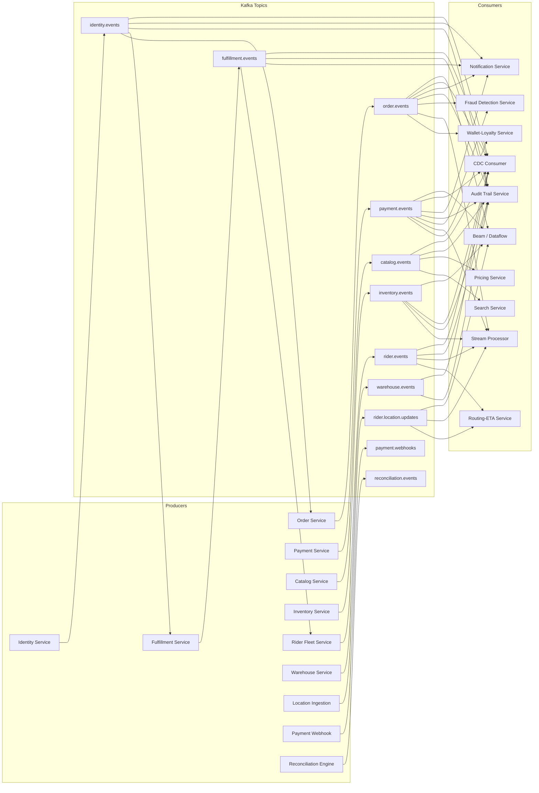
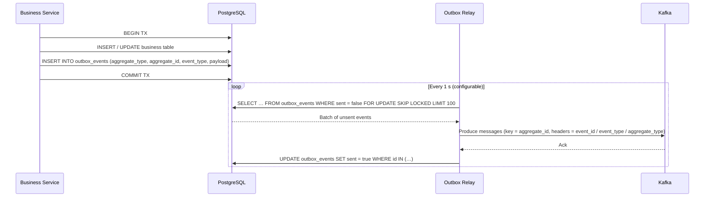
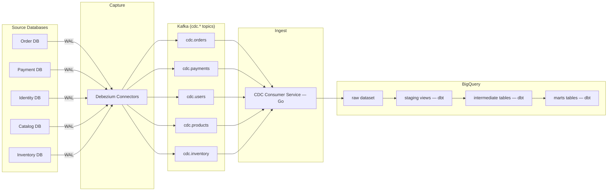
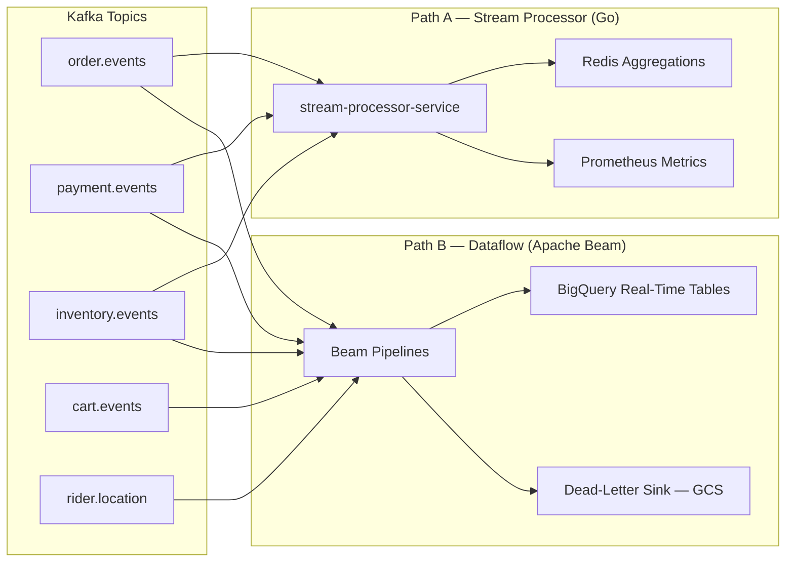
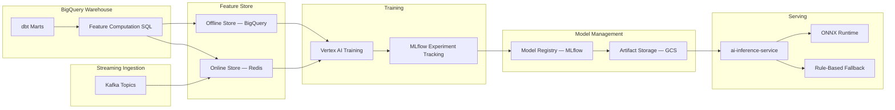
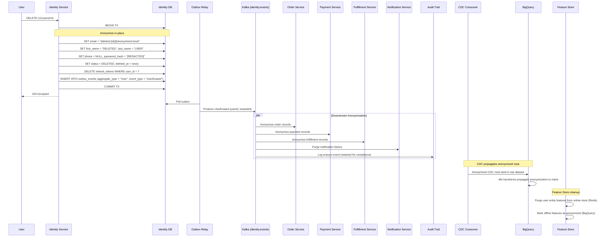
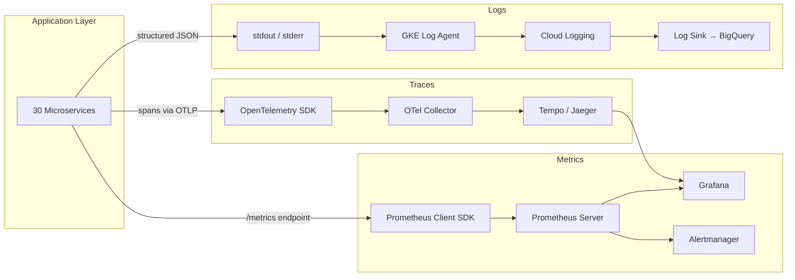

# Data Flow Architecture

> Comprehensive guide to data movement across the InstaCommerce Q-commerce platform —
> 30 microservices, Kafka event bus, outbox pattern, CDC via Debezium, BigQuery warehouse,
> feature store, and ML pipelines.

---

## Table of Contents

1. [Event-Driven Architecture Overview](#1-event-driven-architecture-overview)
2. [Outbox Pattern Flow](#2-outbox-pattern-flow)
3. [CDC Pipeline](#3-cdc-pipeline)
4. [Real-Time Streaming Architecture](#4-real-time-streaming-architecture)
5. [ML Data Pipeline](#5-ml-data-pipeline)
6. [Kafka Topic Topology](#6-kafka-topic-topology)
7. [Event Envelope Schema](#7-event-envelope-schema)
8. [GDPR Data Erasure Flow](#8-gdpr-data-erasure-flow)
9. [Data Lake Architecture](#9-data-lake-architecture)
10. [Monitoring Data Flow](#10-monitoring-data-flow)

---

## 1. Event-Driven Architecture Overview

Every state change in InstaCommerce is captured as a domain event and published to
Kafka via the [outbox pattern](#2-outbox-pattern-flow). Services never communicate
synchronously for state propagation — they produce events to dedicated Kafka topics
and consume events from the topics they care about.



### Key Design Decisions

| Decision | Rationale |
|----------|-----------|
| One topic per aggregate | Keeps consumers focused; enables independent scaling |
| Aggregate ID as partition key | Guarantees per-entity ordering |
| JSON + schema registry | Flexibility with backward-compatible evolution |
| At-least-once delivery | Simpler ops; consumers are idempotent |

---

## 2. Outbox Pattern Flow

All 13 outbox-enabled services write domain events to a local `outbox_events` table
**within the same database transaction** as the business state change. The
`outbox-relay-service` (Go) polls this table and relays events to Kafka, ensuring
exactly-once semantics between the database and the broker.



### Outbox Table Schema

```sql
CREATE TABLE outbox_events (
    id             UUID         PRIMARY KEY DEFAULT gen_random_uuid(),
    aggregate_type VARCHAR(50)  NOT NULL,   -- "Order", "Payment", "User", …
    aggregate_id   VARCHAR(255) NOT NULL,   -- Domain entity ID
    event_type     VARCHAR(50)  NOT NULL,   -- "OrderPlaced", "PaymentCaptured", …
    payload        JSONB        NOT NULL,   -- Serialized event body
    created_at     TIMESTAMPTZ  NOT NULL DEFAULT now(),
    sent           BOOLEAN      NOT NULL DEFAULT false
);

CREATE INDEX idx_outbox_unsent ON outbox_events (sent) WHERE sent = false;
```

### Services Using the Outbox Pattern

| # | Service | Aggregate Type | Example Events |
|---|---------|---------------|----------------|
| 1 | Order Service | `Order` | OrderPlaced, OrderCancelled, OrderFailed |
| 2 | Payment Service | `Payment` | PaymentAuthorized, PaymentCaptured, PaymentRefunded, PaymentFailed, PaymentVoided |
| 3 | Identity Service | `User` | UserErased |
| 4 | Catalog Service | `Catalog` | ProductCreated, ProductUpdated |
| 5 | Inventory Service | `Inventory` | StockReserved, StockConfirmed, StockReleased, LowStockAlert |
| 6 | Fulfillment Service | `Fulfillment` | PickTaskCreated, OrderPacked, RiderAssigned, DeliveryCompleted |
| 7 | Rider Fleet Service | `Rider` | RiderCreated, RiderAssigned, RiderActivated, RiderSuspended, RiderOnboarded |
| 8 | Warehouse Service | `Warehouse` | StoreCreated, StoreStatusChanged, StoreDeleted |
| 9 | Pricing Service | `Pricing` | PriceUpdated |
| 10 | Wallet-Loyalty Service | `Wallet` | WalletCredited, WalletDebited |
| 11 | Cart Service | `Cart` | CartUpdated |
| 12 | Routing-ETA Service | `Routing` | ETAUpdated |
| 13 | Fraud Detection Service | `Fraud` | FraudDetected |

### Relay Configuration

| Variable | Default | Description |
|----------|---------|-------------|
| `OUTBOX_POLL_INTERVAL` | `1s` | How often the relay queries for unsent events |
| `OUTBOX_BATCH_SIZE` | `100` | Max events per poll cycle |
| `OUTBOX_TABLE` | `outbox_events` | Table name |
| `OUTBOX_TOPIC` | _(aggregate_type)_ | Override to route all events to a fixed topic |

The relay uses `sarama` sync producer with **idempotent** mode and `WaitForAll`
acks, and exposes Prometheus metrics for events relayed, failures, and lag.

---

## 3. CDC Pipeline

Change Data Capture extracts every row-level change from PostgreSQL and lands it in
BigQuery for analytics. The pipeline runs through three stages: capture → ingest → transform.



### CDC Consumer Details

The `cdc-consumer-service` (Go, port 8104) reads Debezium messages and micro-batches
them into BigQuery using the Storage Write API.

| Setting | Value |
|---------|-------|
| Batch size | 500 rows |
| Batch timeout | 5 s |
| Insert timeout | 30 s |
| Retry count | 5 (exponential backoff, 1 s base, 30 s max) |
| DLQ topic | `cdc.dlq` |

**BigQuery Row Schema (raw)**

| Column | Type | Source |
|--------|------|--------|
| `topic` | STRING | Kafka topic |
| `partition` | INT64 | Kafka partition |
| `offset` | INT64 | Kafka offset |
| `key` | STRING | Message key |
| `op` | STRING | Debezium operation (c/u/d/r) |
| `ts_ms` | INT64 | Debezium source timestamp |
| `source` | JSON | Debezium source metadata |
| `before` | JSON | Row state before change |
| `after` | JSON | Row state after change |
| `payload` | JSON | Full Debezium payload |
| `headers` | JSON | Kafka headers |
| `raw` | STRING | Raw message bytes |
| `kafka_timestamp` | TIMESTAMP | Kafka broker timestamp |
| `ingested_at` | TIMESTAMP | Insertion time |

### dbt Transformation Layers

```
raw (CDC Consumer)
 └─▶ staging (views) — 8 models
      ├── stg_orders
      ├── stg_deliveries
      ├── stg_payments
      ├── stg_searches
      ├── stg_cart_events
      ├── stg_products
      ├── stg_stores
      └── stg_users
      └─▶ intermediate (tables) — 3 models
           ├── int_order_deliveries
           ├── int_product_performance
           └── int_user_order_history
           └─▶ marts (tables) — 6 models
                ├── mart_daily_revenue
                ├── mart_search_funnel
                ├── mart_product_analytics
                ├── mart_rider_performance
                ├── mart_store_performance
                └── mart_user_cohort_retention
```

All mart tables are partitioned by `order_date` and schemas are auto-created per layer.

---

## 4. Real-Time Streaming Architecture

Two complementary streaming paths handle sub-minute analytics.



### Path A — Stream Processor Service (Go)

The `stream-processor-service` maintains in-memory counters and pushes rolling
aggregations into Redis for consumption by dashboards and API gateways.

- **Input topics**: `order.events`, `payment.events`, `inventory.events`, `rider.events`
- **Output**: Redis sorted sets / hashes, Prometheus counters and histograms
- **Latency**: < 500 ms end-to-end

### Path B — Apache Beam / Dataflow Pipelines

Five Beam pipelines run on Google Cloud Dataflow for windowed analytics that land
directly in BigQuery.

| Pipeline | Source Topic | Window | Output Table(s) | Key Metrics |
|----------|-------------|--------|------------------|-------------|
| Order Events | `order.events` | 1-min fixed, 30-min sliding | `analytics.realtime_order_volume`, `analytics.sla_compliance` | Orders/min, GMV, SLA rate |
| Payment Events | `payment.events` | 1-min fixed | `analytics.payment_metrics` | Success rate, latency P95 |
| Inventory Events | `inventory.events` | 5-min fixed | `analytics.inventory_velocity`, `analytics.stockout_alerts` | Inventory velocity, stockouts |
| Cart Events | `cart.events` | 15-min session | `analytics.cart_abandonment` | Abandonment rate |
| Rider Location | `rider.location` | 1-min fixed | `analytics.rider_utilization` | Rider utilization per zone |

Malformed events that fail deserialization are routed to a GCS dead-letter bucket
for later replay.

---

## 5. ML Data Pipeline

The ML platform spans offline training and online serving, connected by a centralized
feature store.



### Feature Store Entities & Groups

| Entity | Feature Group | # Features | Refresh | Ingestion |
|--------|--------------|------------|---------|-----------|
| `user` | user_features | 14 | per-event (streaming) | `order.events` |
| `product` | product_features | 12 | hourly (batch) | BigQuery SQL |
| `store` | store_features | 8 | every 5 min | BigQuery SQL |
| `rider` | rider_features | 9 | per-event (streaming) | `rider.location.updates`, `fulfillment.events` |
| `search_query` | search_features | 10 | per-event (streaming) | `order.events` |

### Feature Views (Model-Specific Projections)

| Feature View | Consuming Model | Online SLO |
|--------------|----------------|------------|
| `search_ranking` | Search Ranking (LambdaMART) | < 10 ms p95 |
| `fraud_detection` | Fraud Detection (XGBoost) | < 10 ms p95 |
| `eta_prediction` | ETA Prediction (LightGBM) | < 10 ms p95 |
| `demand_forecast` | Demand Forecast (Prophet + TFT) | < 10 ms p95 |
| `personalization` | Personalization (Two-Tower NCF) | < 10 ms p95 |

### Production Models

| Model | Algorithm | Training Cadence | Serving Latency SLO |
|-------|-----------|-----------------|---------------------|
| Search Ranking | LambdaMART | Daily | < 50 ms p99 |
| Fraud Detection | XGBoost | Daily | < 50 ms p99 |
| ETA Prediction | LightGBM | Daily | < 50 ms p99 |
| Demand Forecast | Prophet + Temporal Fusion Transformer | Daily | < 50 ms p99 |
| Personalization | Two-Tower Neural CF | Daily | < 50 ms p99 |
| CLV Prediction | BG/NBD + Gamma-Gamma | Daily | < 50 ms p99 |

### Training Pipeline (Airflow)

The `ml_training` DAG runs daily at **04:00 UTC**:

1. Fetch point-in-time correct training set from offline store
2. Launch Vertex AI Training job (GPU for neural models)
3. Evaluate against promotion gates (minimum metrics + bias checks)
4. Register new model version in MLflow Model Registry
5. Deploy to shadow mode alongside production
6. Automatic promotion after validation window or rollback on metric regression

Feature refresh runs every **4 hours** via the `ml_feature_refresh` DAG:
compute SQL → materialize to online store (Redis) + offline store (BigQuery).

---

## 6. Kafka Topic Topology

### Core Domain Event Topics

| Topic | Producer(s) | Consumer(s) | Partitions | Retention |
|-------|------------|-------------|------------|-----------|
| `order.events` | Order Service | Wallet-Loyalty, Stream Processor, Fraud Detection, Audit Trail, Notification, CDC Consumer, Dataflow | 12 | 7 days |
| `payment.events` | Payment Service | Wallet-Loyalty, Stream Processor, Fraud Detection, Audit Trail, Notification, CDC Consumer, Dataflow | 12 | 7 days |
| `identity.events` | Identity Service | Order Service, Fulfillment Service, Audit Trail, Notification, CDC Consumer | 6 | 14 days |
| `catalog.events` | Catalog Service | Search Service, Pricing Service, Audit Trail, CDC Consumer | 6 | 7 days |
| `inventory.events` | Inventory Service | Stream Processor, Audit Trail, CDC Consumer, Dataflow | 12 | 7 days |
| `fulfillment.events` | Fulfillment Service | Rider Fleet, Notification, Audit Trail, CDC Consumer | 12 | 7 days |
| `rider.events` | Rider Fleet Service | Routing-ETA, Stream Processor, Audit Trail, CDC Consumer | 12 | 7 days |
| `warehouse.events` | Warehouse Service | Audit Trail, CDC Consumer | 3 | 7 days |

### Specialized Topics

| Topic | Producer(s) | Consumer(s) | Partitions | Retention |
|-------|------------|-------------|------------|-----------|
| `rider.location.updates` | Location Ingestion Service | Routing-ETA, Stream Processor | 24 | 24 hours |
| `rider.location` | Location Ingestion Service | Dataflow (Rider Location Pipeline) | 24 | 24 hours |
| `payment.webhooks` | Payment Webhook Service | Payment Service | 6 | 3 days |
| `cart.events` | Cart Service | Dataflow (Cart Pipeline), Audit Trail | 6 | 3 days |
| `reconciliation.events` | Reconciliation Engine | Audit Trail | 3 | 14 days |

### Ancillary / Audit Topics

| Topic | Producer(s) | Consumer(s) | Partitions | Retention |
|-------|------------|-------------|------------|-----------|
| `notification.events` | Notification Service | Audit Trail | 3 | 3 days |
| `search.events` | Search Service | Audit Trail | 3 | 3 days |
| `pricing.events` | Pricing Service | Audit Trail | 3 | 3 days |
| `promotion.events` | Pricing Service | Audit Trail | 3 | 3 days |
| `customer-support.events` | _(external)_ | Audit Trail | 3 | 7 days |
| `returns.events` | _(external)_ | Audit Trail | 3 | 7 days |

### Dead-Letter Queue Topics

| Topic | Source Service | Partitions | Retention |
|-------|---------------|------------|-----------|
| `audit.dlq` | Audit Trail Service | 3 | 30 days |
| `cdc.dlq` | CDC Consumer Service | 3 | 30 days |
| `notification.dlq` | Notification Service | 3 | 30 days |

### CDC Topics (Debezium-managed)

| Topic | Source Table | Partitions | Retention |
|-------|-------------|------------|-----------|
| `cdc.orders` | `orders` | 6 | 3 days |
| `cdc.payments` | `payments` | 6 | 3 days |
| `cdc.users` | `users` | 3 | 3 days |
| `cdc.products` | `products` | 3 | 3 days |
| `cdc.inventory` | `stock_levels` | 6 | 3 days |

---

## 7. Event Envelope Schema

All domain events follow a standard envelope format. The envelope metadata is carried
in Kafka headers and the outbox row, while the `payload` contains the domain-specific
event body.

### Kafka Message Structure

```
┌──────────────────────────────────────────────────┐
│ Kafka Message                                    │
├──────────────┬───────────────────────────────────┤
│ Key          │ aggregate_id  (e.g. order UUID)   │
├──────────────┼───────────────────────────────────┤
│ Headers      │ event_id      UUID                │
│              │ event_type    e.g. "OrderPlaced"  │
│              │ aggregate_type e.g. "Order"       │
├──────────────┼───────────────────────────────────┤
│ Value (JSON) │ {                                 │
│              │   "orderId": "…",                 │
│              │   "userId": "…",                  │
│              │   …domain fields…                 │
│              │ }                                 │
└──────────────┴───────────────────────────────────┘
```

### Event Schema Contracts

All event schemas are defined as JSON Schema (Draft-07) in
`contracts/src/main/resources/schemas/` and validated at build time.

```json
{
  "$schema": "http://json-schema.org/draft-07/schema#",
  "title": "OrderPlaced",
  "type": "object",
  "required": ["orderId", "userId", "storeId", "items", "totalCents", "currency", "placedAt"],
  "properties": {
    "orderId":       { "type": "string", "format": "uuid" },
    "userId":        { "type": "string", "format": "uuid" },
    "storeId":       { "type": "string" },
    "paymentId":     { "type": "string", "format": "uuid" },
    "items": {
      "type": "array",
      "items": {
        "type": "object",
        "required": ["productId", "quantity", "unitPriceCents", "lineTotalCents"],
        "properties": {
          "productId":      { "type": "string", "format": "uuid" },
          "productName":    { "type": "string" },
          "quantity":       { "type": "integer", "minimum": 1 },
          "unitPriceCents": { "type": "integer" },
          "lineTotalCents": { "type": "integer" }
        }
      }
    },
    "totalCents":    { "type": "integer" },
    "currency":      { "type": "string", "minLength": 3, "maxLength": 3 },
    "placedAt":      { "type": "string", "format": "date-time" }
  }
}
```

### Event Catalog by Domain

| Domain | Event Types |
|--------|-------------|
| **Orders** | `OrderPlaced`, `OrderPacked`, `OrderDispatched`, `OrderDelivered`, `OrderCancelled`, `OrderFailed` |
| **Payments** | `PaymentAuthorized`, `PaymentCaptured`, `PaymentRefunded`, `PaymentFailed`, `PaymentVoided` |
| **Inventory** | `StockReserved`, `StockConfirmed`, `StockReleased`, `LowStockAlert` |
| **Identity** | `UserErased` |
| **Catalog** | `ProductCreated`, `ProductUpdated` |
| **Rider** | `RiderCreated`, `RiderAssigned`, `RiderActivated`, `RiderSuspended`, `RiderOnboarded` |
| **Fulfillment** | `PickTaskCreated`, `OrderPacked`, `RiderAssigned`, `DeliveryCompleted` |
| **Fraud** | `FraudDetected` |
| **Warehouse** | `StoreCreated`, `StoreStatusChanged`, `StoreDeleted` |

---

## 8. GDPR Data Erasure Flow

When a user requests account deletion, the erasure cascades across all services and
data stores via a choreographed event-driven flow.



### UserErased Event Schema

```json
{
  "$schema": "http://json-schema.org/draft-07/schema#",
  "title": "UserErased",
  "type": "object",
  "required": ["userId", "erasedAt"],
  "properties": {
    "userId":   { "type": "string", "format": "uuid" },
    "erasedAt": { "type": "string", "format": "date-time" }
  }
}
```

### Anonymization Details

| Field | Before | After |
|-------|--------|-------|
| `email` | `jane@example.com` | `deleted-<uuid>@anonymized.local` |
| `first_name` | `Jane` | `DELETED` |
| `last_name` | `Doe` | `USER` |
| `phone` | `+1-555-0123` | `NULL` |
| `password_hash` | `$2b$12$…` | `[REDACTED]` |
| `status` | `ACTIVE` | `DELETED` |

Each downstream service applies its own anonymization rules on receipt of the
`UserErased` event. The Audit Trail retains an immutable compliance record of the
erasure event itself (without PII).

---

## 9. Data Lake Architecture

Cloud Storage is organized into four logical layers, each with distinct access
patterns and lifecycle policies.

```mermaid
graph TD
    subgraph "Cloud Storage (GCS)"
        subgraph "raw/"
            R1["raw/cdc/{table}/{date}/*.parquet"]
            R2["raw/events/{topic}/{date}/*.json"]
            R3["raw/webhooks/{provider}/{date}/*.json"]
        end

        subgraph "processed/"
            P1["processed/dbt_staging/{model}/{date}/"]
            P2["processed/dbt_intermediate/{model}/{date}/"]
            P3["processed/dbt_marts/{model}/{date}/"]
            P4["processed/data_quality/{run_id}/"]
        end

        subgraph "ml/"
            M1["ml/training_data/{model}/{version}/"]
            M2["ml/feature_snapshots/{entity}/{date}/"]
            M3["ml/model_artifacts/{model}/{version}/"]
            M4["ml/evaluation/{model}/{version}/"]
        end

        subgraph "exports/"
            E1["exports/reports/{report}/{date}/"]
            E2["exports/partner_feeds/{partner}/{date}/"]
            E3["exports/gdpr_exports/{request_id}/"]
        end
    end

    subgraph "Lifecycle"
        RAW_LC["raw/ → Nearline after 30d → Coldline after 90d"]
        PROC_LC["processed/ → Nearline after 60d → Delete after 180d"]
        ML_LC["ml/ → Nearline after 90d"]
        EXP_LC["exports/ → Delete after 30d"]
    end

    R1 --> RAW_LC
    P1 --> PROC_LC
    M1 --> ML_LC
    E1 --> EXP_LC
```



### Layer Descriptions

| Layer | Purpose | Format | Access Pattern |
|-------|---------|--------|----------------|
| `raw/` | Immutable landing zone for all ingested data | Parquet (CDC), JSON (events) | Write-once, read by dbt / Beam |
| `processed/` | Cleaned, deduplicated, transformed datasets | Parquet | Read by analysts, ML pipelines |
| `ml/` | Training data, feature snapshots, model artifacts | Parquet, ONNX, pickle | Read by Vertex AI, MLflow |
| `exports/` | Scheduled reports, partner data feeds, GDPR exports | CSV, JSON | Read by external consumers |

### Dead-Letter Buckets

| Bucket | Source | Purpose |
|--------|--------|---------|
| `gs://{project}-dlq-events/` | Dataflow pipelines | Malformed events that failed deserialization |
| `gs://{project}-dlq-cdc/` | CDC Consumer | Rows that exceeded retry limit |

---

## 10. Monitoring Data Flow

Observability data flows through three independent channels — logs, metrics, and
traces — unified in Grafana dashboards.



### Logs

| Component | Detail |
|-----------|--------|
| Format | Structured JSON to stdout |
| Collection | GKE logging agent (Fluentbit) |
| Storage | Cloud Logging (30-day hot) → BigQuery log sink (long-term) |
| Query | Logs Explorer + BigQuery SQL |

### Metrics

| Component | Detail |
|-----------|--------|
| Client | Prometheus client libraries (Go `promhttp`, Java Micrometer) |
| Scraping | Prometheus server scrapes `/metrics` every 15 s |
| Dashboards | Grafana (30+ dashboards) |
| Alerting | Alertmanager → PagerDuty / Slack |
| Key rules | Defined in `monitoring/prometheus-rules.yaml` |

### Traces

| Component | Detail |
|-----------|--------|
| SDK | OpenTelemetry (OTLP HTTP and gRPC exporters) |
| Collector | OpenTelemetry Collector (sidecar in GKE) |
| Backend | Tempo (or Jaeger) |
| Visualization | Grafana Tempo data source |
| Sampling | Head-based, 10 % default, 100 % on error |

### Airflow Monitoring DAGs

The `monitoring_alerts` DAG continuously checks platform health:

| Check | Threshold | Action |
|-------|-----------|--------|
| Kafka consumer lag | > 10 000 messages | Slack alert |
| BigQuery table freshness | > 2 hours stale | Slack alert |
| dbt model SLA | Run exceeds 30 min | PagerDuty |
| Feature Store staleness | > 4 hours | Slack alert |
| Data quality failures | Any critical rule | Block downstream DAGs + Slack |

---

## Appendix A — Service Port Map

| Service | Port | Role |
|---------|------|------|
| outbox-relay-service | 8103 | Outbox → Kafka relay |
| cdc-consumer-service | 8104 | Kafka CDC → BigQuery ingest |
| stream-processor-service | — | Real-time aggregation |
| ai-inference-service | — | Model serving (ONNX) |

## Appendix B — Key Airflow DAGs

| DAG | Schedule | Description |
|-----|----------|-------------|
| `ml_training` | Daily 04:00 UTC | Train all 6 production models |
| `ml_feature_refresh` | Every 4 hours | Recompute features → online + offline store |
| `dbt_staging` | Hourly | Run dbt staging models |
| `dbt_marts` | Hourly (after staging) | Run dbt mart models + notifications |
| `data_quality` | Hourly (after marts) | Domain validation rules; blocks downstream on failure |
| `monitoring_alerts` | Every 15 min | Platform health checks |

---

_Last updated: auto-generated from codebase analysis._
