# InstaCommerce — Future Improvements Roadmap

> A comprehensive technology, architecture, and business evolution plan for InstaCommerce's 30-microservice Q-commerce platform. Benchmarked against Instacart, Zepto, Blinkit, and DoorDash.

---

## Table of Contents

1. [Technology Evolution Roadmap](#1-technology-evolution-roadmap)
2. [Scaling Improvements](#2-scaling-improvements)
3. [ML/AI Evolution](#3-mlai-evolution)
4. [Architecture Evolution](#4-architecture-evolution)
5. [New Revenue Streams](#5-new-revenue-streams)
6. [Operational Excellence](#6-operational-excellence)
7. [Security Enhancements](#7-security-enhancements)
8. [Data Platform Evolution](#8-data-platform-evolution)
9. [Mobile & Frontend](#9-mobile--frontend)
10. [Competitive Gap Analysis](#10-competitive-gap-analysis)
11. [Wave 2 — Customer-Facing AI Agents Roadmap](#11-wave-2--customer-facing-ai-agents-roadmap)

---

## 1. Technology Evolution Roadmap

The following Gantt chart outlines InstaCommerce's technology roadmap across three pillars — Infrastructure, ML/AI, and Architecture — through 2026–2027.

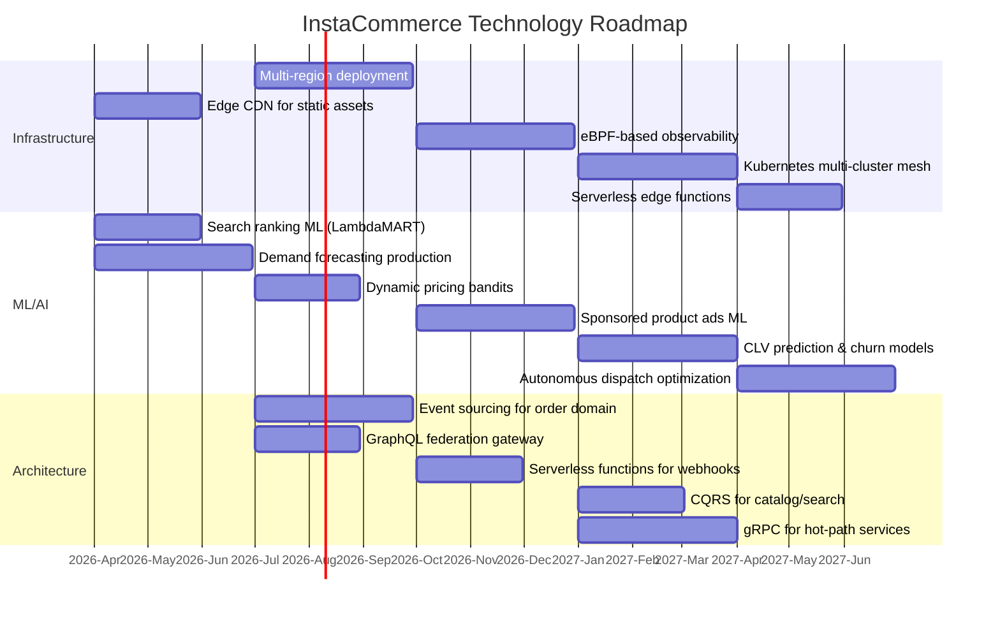

### Roadmap Phases

| Phase | Timeline | Theme | Key Deliverables |
|-------|----------|-------|-----------------|
| **Phase 1** | 2026 Q2 | Foundation | CDN, search ML, demand forecasting |
| **Phase 2** | 2026 Q3 | Scale | Multi-region, event sourcing, GraphQL federation |
| **Phase 3** | 2026 Q4 | Intelligence | eBPF observability, dynamic pricing, ad ML |
| **Phase 4** | 2027 Q1–Q2 | Autonomy | Multi-cluster mesh, CLV/churn, CQRS, gRPC migration |

---

## 2. Scaling Improvements

### 2.1 Database Sharding Strategy

As InstaCommerce grows beyond 10M orders/month, a single database instance becomes a bottleneck. We adopt a `user_id`-based sharding strategy for high-write domains.

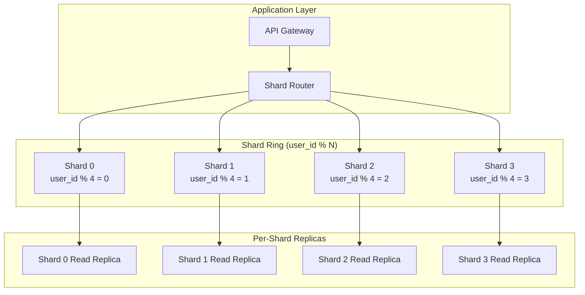

**Sharding plan by domain:**

| Service | Shard Key | Rationale |
|---------|-----------|-----------|
| Order Service | `user_id` | Orders are queried per-user; co-locate with payment |
| Payment Service | `user_id` | Payment history is always per-user |
| Notification Service | `user_id` | Notifications scoped to user |
| Catalog Service | No shard (read replicas) | Catalog is read-heavy, replicas suffice |
| Inventory Service | `store_id` | Inventory is per-store |
| Analytics Service | `date` range partitioning | Time-series queries dominate |

### 2.2 Read Replicas with Query Routing

- **Write path:** All mutations route to primary via connection pooler (PgBouncer).
- **Read path:** `SELECT` queries route to nearest read replica via ProxySQL or application-level routing.
- **Replication lag SLA:** < 100 ms for catalog, < 50 ms for inventory (critical for stock accuracy).
- **Consistency model:** Strong consistency for orders/payments, eventual consistency for catalog/search.

### 2.3 Multi-Region Active-Active Deployment

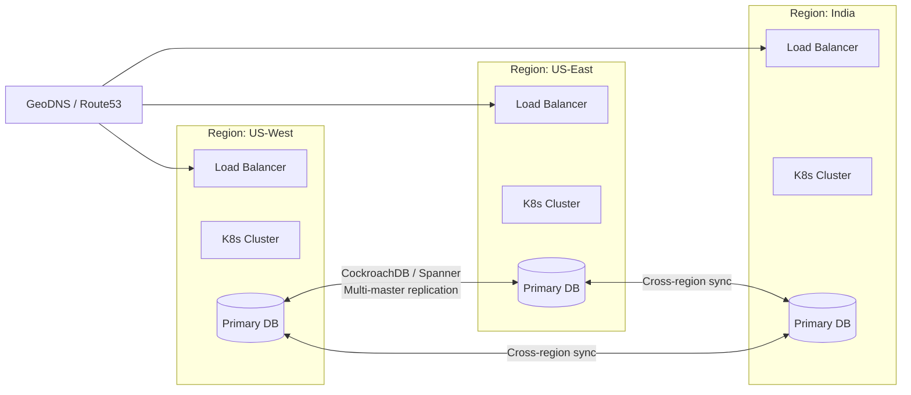

**Strategy:**
- CockroachDB or YugabyteDB for multi-master writes with serializable isolation.
- Conflict resolution: last-writer-wins for non-critical data; application-level merge for orders.
- Latency target: < 50 ms intra-region, < 200 ms cross-region.

### 2.4 Edge Caching (CDN + Redis at Edge)

| Layer | Technology | Cache Target | TTL |
|-------|-----------|-------------|-----|
| CDN Edge | CloudFront / Fastly | Product images, static assets | 24h |
| Edge Redis | Redis Enterprise Active-Active | Catalog reads, pricing | 5 min |
| Application Cache | Local in-memory (Caffeine) | Config, feature flags | 60s |
| Query Cache | Redis Cluster | Search results, recommendations | 2 min |

### 2.5 Kafka Tiered Storage

- **Hot tier (NVMe SSD):** Last 24 hours of events — high throughput reads/writes.
- **Warm tier (EBS gp3):** 1–30 days — moderate access for replay and analytics.
- **Cold tier (S3):** 30+ days — compliance retention, rare access.
- **Cost savings:** Estimated 60% reduction in Kafka storage costs at 1B events/month.
- **Implementation:** Confluent Tiered Storage or Apache Kafka KIP-405.

---

## 3. ML/AI Evolution

### ML Maturity Model

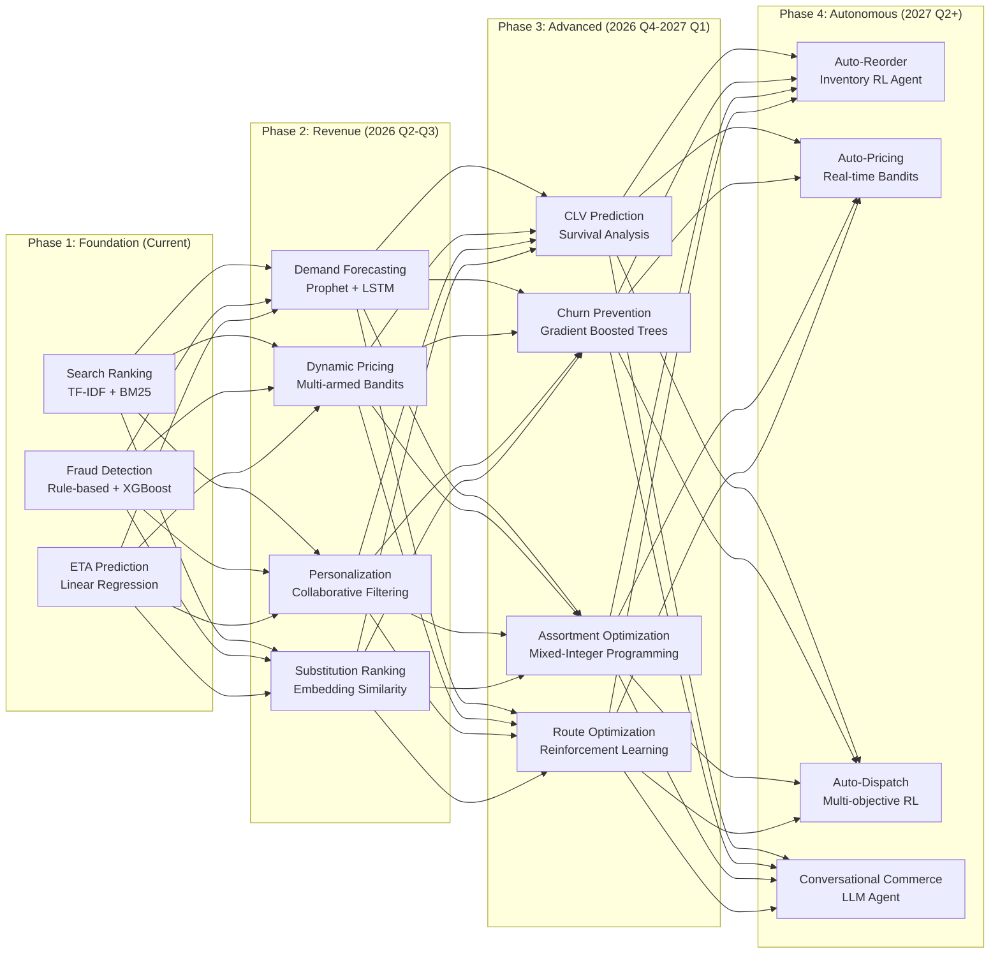

### Phase Details

#### Phase 1 — Foundation (Current State)

| Model | Algorithm | Input Features | Serving Latency | Impact |
|-------|-----------|---------------|-----------------|--------|
| Search Ranking | TF-IDF + BM25 | Query text, product metadata | < 20 ms | Baseline relevance |
| Fraud Detection | XGBoost + rules | Transaction velocity, device fingerprint, IP | < 50 ms | 85% precision |
| ETA Prediction | Linear Regression | Distance, traffic, store prep time | < 10 ms | ± 5 min accuracy |

#### Phase 2 — Revenue Models (2026 Q2–Q3)

- **Demand Forecasting:** Facebook Prophet for daily/weekly seasonality + LSTM for real-time adjustments. Input: historical sales, weather, local events, promotions. Output: SKU-level demand per store per hour. Impact: 30% reduction in stockouts (Instacart achieved 25%).
- **Dynamic Pricing:** Thompson Sampling multi-armed bandits. Each price point is an arm; reward = conversion × margin. Guardrails: max ±15% from base price, no surge on essentials.
- **Personalization:** Matrix factorization (ALS) on user-item interaction matrix. Cold-start via content-based fallback using product embeddings from BERT.
- **Substitution Ranking:** Product2Vec embeddings trained on co-purchase data. When an item is OOS, rank substitutes by embedding cosine similarity × price similarity × brand affinity.

#### Phase 3 — Advanced (2026 Q4–2027 Q1)

- **Customer Lifetime Value (CLV):** BG/NBD model for purchase frequency + Gamma-Gamma for monetary value. Used for acquisition budget allocation and retention targeting.
- **Churn Prevention:** LightGBM classifier on recency, frequency, monetary, app engagement, support tickets. Trigger proactive offers when churn probability > 0.7.
- **Assortment Optimization:** Mixed-integer linear program to maximize expected revenue subject to shelf-space, supplier, and freshness constraints. Per-store assortment tailored to local demographics.
- **Route Optimization:** Capacitated Vehicle Routing Problem (CVRP) solved via OR-Tools + reinforcement learning fine-tuning for real-time re-routing.

#### Phase 4 — Autonomous Operations (2027 Q2+)

- **Auto-Reorder:** RL agent that learns optimal reorder points and quantities per SKU per store. State = current stock, demand forecast, lead time. Action = order quantity.
- **Auto-Pricing:** Real-time contextual bandits that adjust prices based on demand elasticity, competitor prices, and inventory levels.
- **Auto-Dispatch:** Multi-objective RL balancing delivery time, rider utilization, and customer satisfaction.
- **Conversational Commerce:** LLM-powered agent for voice/chat ordering, recipe-based basket building, and proactive reordering.

### Custom ML Platform (DoorDash Sibyl-Inspired)

When model count exceeds ~100, build a unified ML platform:

| Component | Technology | Purpose |
|-----------|-----------|---------|
| Feature Store | Feast + Redis | Consistent feature serving (online + offline) |
| Model Registry | MLflow | Versioning, lineage, A/B tracking |
| Training Orchestration | Kubeflow Pipelines | Distributed training, hyperparameter tuning |
| Model Serving | Seldon Core / KServe | Canary deployments, autoscaling |
| Experiment Tracking | MLflow + custom UI | A/B test analysis, metric dashboards |
| Data Validation | Great Expectations | Schema and distribution drift detection |

---

## 4. Architecture Evolution

### 4.1 Event Sourcing for Order Domain

Replace the current mutable order table with an immutable event log. Every state change is an event; current state is a projection.

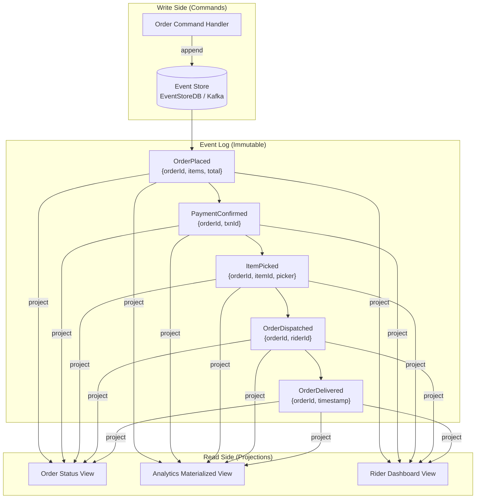

**Benefits:**
- Complete audit trail for every order (regulatory compliance).
- Temporal queries: "What was the order state at 3:42 PM?"
- Replay capability: rebuild projections after bug fixes.
- Decoupled read/write scaling.

**Implementation notes:**
- EventStoreDB as the primary event store (or Kafka with compaction disabled).
- Projections built via Kafka Streams / Flink into PostgreSQL read models.
- Snapshotting every 100 events to limit replay time.

### 4.2 CQRS for Catalog/Search

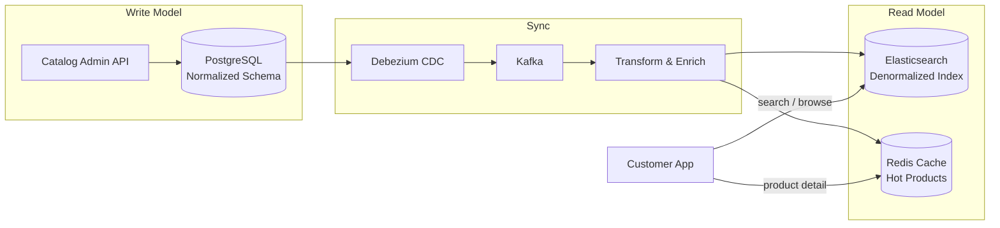

**Why CQRS for catalog:**
- Write model is normalized (product, category, attribute tables) for consistency.
- Read model is denormalized (single Elasticsearch document per product) for sub-10ms queries.
- CDC via Debezium ensures read model stays in sync without application coupling.
- Independent scaling: add more Elasticsearch nodes for read traffic without touching writes.

### 4.3 GraphQL Federation as API Layer

Replace the monolithic API gateway with Apollo Federation v2:

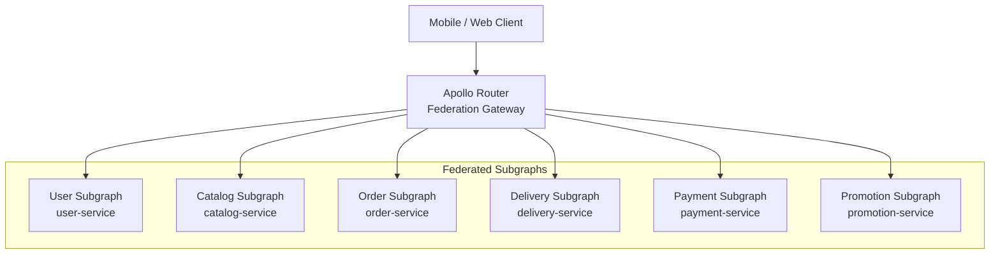

**Advantages over REST gateway:**
- Single request fetches data from multiple services (e.g., order + delivery + payment).
- Client controls response shape — reduces over-fetching on mobile.
- Schema-first development with strong typing.
- Incremental adoption: wrap existing REST services as subgraphs.

### 4.4 gRPC for Inter-Service Communication

Replace REST for hot-path internal calls:

| Communication Path | Current | Target | Expected Improvement |
|-------------------|---------|--------|---------------------|
| Order → Payment | REST/JSON | gRPC/Protobuf | 3× throughput, 40% latency reduction |
| Order → Inventory | REST/JSON | gRPC/Protobuf | 2× throughput |
| Search → Catalog | REST/JSON | gRPC streaming | 5× for batch lookups |
| Delivery → Location | REST polling | gRPC bidirectional stream | Real-time updates, 80% less bandwidth |

**Migration strategy:** Dual-stack (REST + gRPC) with feature flag; migrate one path at a time.

### 4.5 WebAssembly Plugins for Feature Flags

- Compile feature flag evaluation logic to WASM modules.
- Embed in Envoy sidecar for zero-network-hop evaluation.
- Sub-microsecond flag checks vs. current 1–5ms remote calls.
- Use cases: gradual rollouts, A/B experiments, kill switches.

---

## 5. New Revenue Streams

### 5.1 Sponsored Product Ads

Instacart generates ~$800M/year from sponsored ads. InstaCommerce can replicate this:

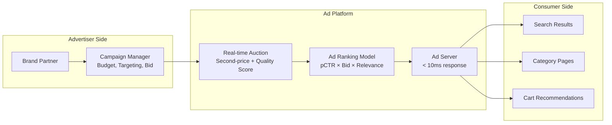

**Revenue projections:**

| Metric | Year 1 | Year 2 | Year 3 |
|--------|--------|--------|--------|
| Active advertisers | 50 | 200 | 500 |
| Avg. spend/advertiser/month | $2,000 | $5,000 | $10,000 |
| Annual ad revenue | $1.2M | $12M | $60M |
| Ad revenue as % of GMV | 0.5% | 2% | 5% |

### 5.2 B2B Analytics Platform

Sell aggregated, anonymized insights to brand partners:
- **Category performance dashboards:** Market share, velocity, price elasticity by region.
- **Competitive intelligence:** Brand-level share-of-search, share-of-cart.
- **Consumer insights:** Purchase basket affinity, repeat purchase rates, cohort trends.
- **Pricing:** Tiered SaaS model ($5K–$50K/month based on data access level).

### 5.3 White-Label Q-Commerce Platform

Package InstaCommerce's 30 microservices as a SaaS offering:
- Multi-tenant architecture with namespace isolation.
- Configurable catalog, payment, and delivery modules.
- Target customers: regional grocery chains, pharmacy chains, convenience stores.
- Revenue model: Platform fee (2–4% of GMV) + monthly SaaS fee.

### 5.4 Financial Services

- **BNPL (Buy Now Pay Later):** Partner with Klarna/Affirm or build in-house for orders > $50.
- **Rider lending:** Micro-loans to delivery partners based on earnings history.
- **Store working capital:** Short-term lending to store partners based on GMV data.
- **Insurance:** Delivery insurance for high-value orders.

---

## 6. Operational Excellence

### 6.1 Chaos Engineering

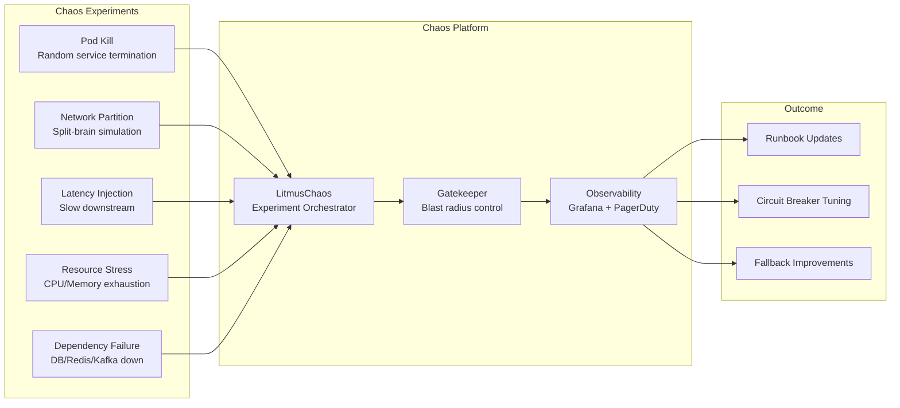

**Cadence:** Weekly automated chaos in staging, monthly Game Days in production (business hours, with blast radius limits).

### 6.2 Progressive Delivery

| Strategy | Tool | Use Case | Rollback Time |
|----------|------|----------|---------------|
| Canary Release | Flagger + Istio | New service versions | < 30s automated |
| Blue/Green | Argo Rollouts | Database migrations | < 60s manual |
| Feature Flags | LaunchDarkly / Unleash | Feature rollout | Instant (flag toggle) |
| A/B Testing | Statsig / Eppo | UX experiments | N/A (experiment-based) |
| Dark Launch | Istio traffic mirroring | Load testing new code | N/A (shadow traffic) |

### 6.3 Automated Incident Response

- **Detection:** Prometheus alerting → PagerDuty escalation (L1 → L2 → L3 within 15 min).
- **Diagnosis:** Automated runbooks triggered by alert type (e.g., high error rate → check recent deployments → auto-rollback if correlation found).
- **Remediation:** Self-healing actions — pod restart, circuit breaker activation, traffic reroute.
- **Post-incident:** Automated blameless postmortem template, SLO impact tracking, action item assignment.

### 6.4 Cost Optimization

| Initiative | Savings Estimate | Effort |
|-----------|-----------------|--------|
| Spot instances for stateless services | 60–70% compute cost | Medium |
| Right-sizing (Goldilocks / VPA) | 20–30% resource waste | Low |
| Reserved capacity for databases | 40% vs. on-demand | Low |
| Kafka tiered storage | 60% storage cost | Medium |
| Autoscaling tuning (KEDA) | 25% off-peak savings | Medium |
| Image optimization (distroless) | 15% registry cost | Low |

### 6.5 Developer Experience

- **Local development:** Tilt or Skaffold for fast inner-loop dev with hot-reload against a local K8s (k3d).
- **Service catalog:** Backstage for service discovery, API docs, ownership, and dependency visualization.
- **Dev environments:** Codespaces / Gitpod for zero-setup onboarding (< 5 min to first build).
- **Internal CLI:** `insta` CLI for common tasks — deploy, rollback, log tailing, feature flag management.
- **Golden paths:** Cookiecutter templates for new microservices with pre-configured CI/CD, observability, and testing.

---

## 7. Security Enhancements

### 7.1 Zero-Trust Architecture (BeyondCorp Model)

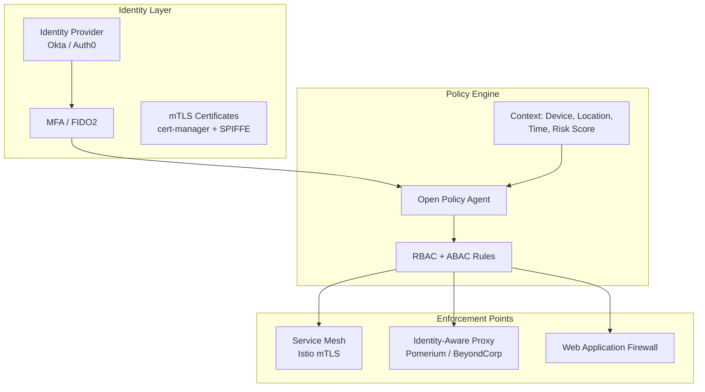

**Principles:**
- Never trust, always verify — every request authenticated and authorized.
- mTLS between all services via Istio (no plaintext internal traffic).
- Identity-aware proxy for all internal tools (no VPN required).
- Continuous access evaluation — revoke sessions on risk signal change.

### 7.2 Runtime Application Security (RASP)

- Deploy Falco for runtime syscall monitoring on all K8s nodes.
- Detect and block: container escape, privilege escalation, cryptomining, data exfiltration.
- Integrate with SIEM (Splunk / Elastic Security) for correlation.

### 7.3 Supply Chain Security

| Control | Tool | Purpose |
|---------|------|---------|
| SBOM Generation | Syft | Software Bill of Materials for every image |
| Vulnerability Scanning | Grype / Trivy | CVE detection in dependencies |
| Image Signing | Sigstore / Cosign | Verify image provenance |
| SLSA Level 3 | GitHub Actions + SLSA framework | Build provenance attestation |
| Policy Enforcement | Kyverno | Block unsigned or vulnerable images |
| Dependency Updates | Dependabot / Renovate | Automated security patches |

### 7.4 SOC 2 Type II Compliance

- **Scope:** All 30 microservices + infrastructure + data stores.
- **Controls:** Access management, change management, incident response, encryption, monitoring.
- **Evidence automation:** Vanta or Drata for continuous compliance monitoring.
- **Timeline:** 3 months readiness + 6 months observation period.

### 7.5 PCI DSS Level 1 Certification

- **Scope reduction:** Tokenize all card data via Stripe/Adyen (SAQ A-EP).
- **Network segmentation:** Isolate payment service in dedicated namespace with strict NetworkPolicies.
- **Key management:** AWS KMS / HashiCorp Vault for encryption key lifecycle.
- **Quarterly ASV scans + annual penetration testing.**

---

## 8. Data Platform Evolution

### 8.1 Real-Time Feature Store

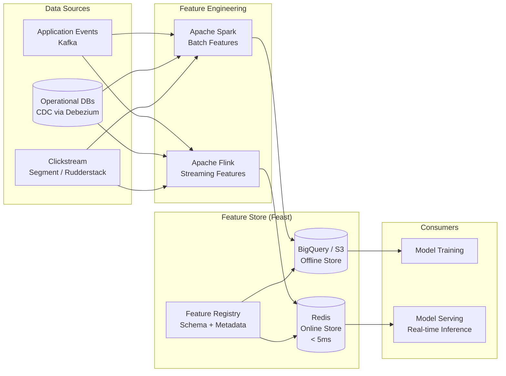

**Key features:**
- Point-in-time correct joins for training (prevent data leakage).
- Feature sharing across teams — single source of truth.
- Online/offline consistency — same feature definitions, computed differently.
- Feature monitoring — distribution drift alerts.

### 8.2 Streaming SQL (Apache Flink)

Replace batch ETL with streaming for latency-sensitive use cases:

| Use Case | Current (Batch) | Target (Streaming) | Latency Improvement |
|----------|----------------|-------------------|-------------------|
| Real-time GMV dashboard | 15 min | < 5 sec | 180× |
| Fraud detection features | 1 hour | < 1 sec | 3600× |
| Inventory sync | 5 min | < 10 sec | 30× |
| Rider earnings calculation | 1 hour | < 1 min | 60× |

### 8.3 Data Mesh Architecture

Shift from centralized data team to domain-owned data products:

| Domain | Data Product | Owner | SLA |
|--------|-------------|-------|-----|
| Order | `order-events`, `order-summary` | Order Team | 99.9%, < 5s freshness |
| Catalog | `product-catalog`, `price-history` | Catalog Team | 99.9%, < 1min freshness |
| Delivery | `delivery-events`, `rider-metrics` | Delivery Team | 99.5%, < 30s freshness |
| Customer | `customer-360`, `cohort-segments` | Growth Team | 99.5%, < 1hr freshness |
| Finance | `revenue-ledger`, `settlement` | Finance Team | 99.99%, daily reconciliation |

**Platform capabilities (self-serve):**
- Data product catalog (DataHub / Amundsen).
- Automated data quality (Great Expectations, Soda).
- Access management (tag-based policies via Apache Ranger / OPA).
- Schema registry (Confluent Schema Registry) with compatibility enforcement.

### 8.4 DataOps

- **CI/CD for data pipelines:** dbt + GitHub Actions — test every model change before merge.
- **Data contracts:** Schema-first development; producers publish contracts, consumers validate.
- **Automated testing:** Freshness, volume, distribution, referential integrity checks on every pipeline run.
- **Data observability:** Monte Carlo or Elementary for automated anomaly detection.

### 8.5 Reverse ETL

Push analytical data back to operational systems:

| Source | Destination | Use Case |
|--------|------------|----------|
| BigQuery (CLV scores) | CRM (HubSpot) | High-value customer segmentation |
| BigQuery (churn risk) | Notification Service | Proactive retention campaigns |
| BigQuery (demand forecast) | Inventory Service | Auto-replenishment triggers |
| BigQuery (rider scores) | Dispatch Service | Priority assignment for top riders |

**Tools:** Census, Hightouch, or custom Airflow DAGs.

---

## 9. Mobile & Frontend

### 9.1 Server-Driven UI (Instacart Approach)

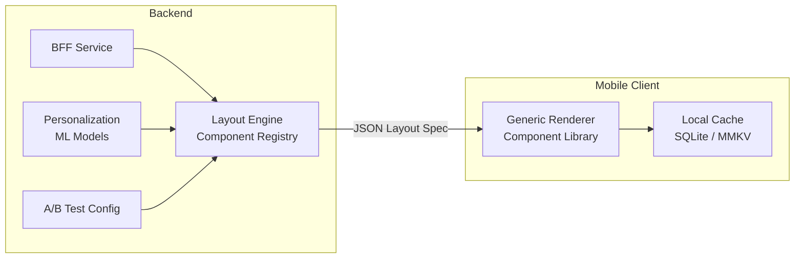

**Benefits:**
- Ship UI changes without app store releases (critical for experimentation velocity).
- Personalized layouts per user segment (e.g., different home screen for new vs. power users).
- A/B test entire page layouts, not just individual components.
- Instacart reports 3× faster experiment velocity after adopting SDUI.

### 9.2 Offline-First Architecture

- **Local database:** MMKV (key-value) + WatermelonDB (relational) on device.
- **Sync engine:** Conflict-free replicated data types (CRDTs) for cart state.
- **Offline capabilities:** Browse cached catalog, add to cart, queue orders for submission on reconnect.
- **Target:** App remains functional for core browsing/carting during 30-second connectivity gaps.

### 9.3 Real-Time Inventory Sync via WebSocket

- Replace polling-based inventory checks with WebSocket push.
- Server pushes stock-level changes as they occur (picker picks item → client updates).
- Fallback: Server-Sent Events (SSE) for clients that don't support WebSocket.
- Expected impact: 90% reduction in "item unavailable after ordering" complaints.

### 9.4 AR for Product Scanning

- **Barcode scanning:** Camera-based barcode recognition for quick product lookup.
- **Visual search:** Point camera at a product → identify via image embedding model.
- **AR aisle navigation:** In-store navigation for click-and-collect orders.
- **Tech stack:** ARKit (iOS) + ARCore (Android) + TensorFlow Lite for on-device inference.

### 9.5 Voice Ordering via AI Agent

- **LLM-powered conversational agent** for hands-free ordering.
- **Capabilities:** "Add milk and eggs to my cart," "Reorder my last grocery order," "What's on sale this week?"
- **Integration:** Siri Shortcuts, Google Assistant, Alexa Skills.
- **Architecture:** Speech-to-text → intent classification → fulfillment API → text-to-speech.
- **Personalization:** Agent learns user preferences (brands, sizes, quantities) over time.

---

## 10. Competitive Gap Analysis

### Feature Comparison Matrix

| Dimension | InstaCommerce (Current) | Instacart | Zepto | Blinkit | DoorDash | InstaCommerce (Target) |
|-----------|------------------------|-----------|-------|---------|----------|----------------------|
| **Delivery Speed** | 30–45 min | 1–2 hrs | 10 min | 10 min | 30–60 min | 10–15 min |
| **Dark Store Network** | 0 | 0 (partner stores) | 350+ | 500+ | 0 (partner) | 50+ dark stores |
| **Catalog Size** | 50K SKUs | 500K+ | 5K–8K | 5K–10K | 300K+ | 100K SKUs |
| **Search Relevance** | BM25 | LTR + Deep Learning | Basic | Basic | Semantic Search | LambdaMART + BERT |
| **Personalization** | Rule-based | ML (deep) | Basic | ML (growing) | ML (deep) | Collaborative Filtering + Deep |
| **Dynamic Pricing** | None | Surge on delivery fee | Minimal | Minimal | Dynamic delivery fee | Multi-armed Bandits |
| **Demand Forecasting** | None | Prophet + custom ML | ML-based | ML-based | Custom ML platform | Prophet + LSTM |
| **ETA Accuracy** | ± 10 min | ± 5 min | ± 2 min | ± 2 min | ± 5 min | ± 3 min |
| **Ad Platform** | None | $800M/yr revenue | None | Growing | $1B+ /yr | Sponsored Ads Platform |
| **ML Platform** | Ad-hoc | Lore (custom) | Basic | Growing | Sibyl (custom) | Feast + MLflow + KServe |
| **Event Architecture** | REST + Kafka | Event-driven | Event-driven | Event-driven | Event-driven | Event Sourcing + CQRS |
| **API Layer** | REST | GraphQL | REST | REST + gRPC | GraphQL + gRPC | GraphQL Federation + gRPC |
| **Mobile Architecture** | React Native | Native + SDUI | Native | React Native | Native + SDUI | React Native + SDUI |
| **Offline Support** | None | Partial | None | None | Partial | Offline-first (CRDTs) |
| **Chaos Engineering** | None | Yes (custom) | Unknown | Unknown | Yes (custom) | LitmusChaos |
| **Multi-Region** | Single region | Multi-region | India only | India only | Multi-region | Active-Active (3 regions) |
| **Observability** | Prometheus + Grafana | Custom + Datadog | Basic | Growing | Custom + Datadog | eBPF + OpenTelemetry |
| **CI/CD Maturity** | GitHub Actions | Advanced (custom) | Growing | Growing | Advanced (custom) | Progressive Delivery (Flagger) |
| **Data Platform** | PostgreSQL + Redis | Snowflake + custom | BigQuery | BigQuery | Snowflake + custom | Data Mesh + Flink |
| **Security Posture** | Basic (TLS + JWT) | SOC2 + PCI DSS L1 | Growing | Growing | SOC2 + PCI DSS | Zero-Trust + SOC2 + PCI |
| **Voice Ordering** | None | None | None | None | None | LLM-powered Agent |
| **AR Features** | None | None | None | None | None | Barcode + Visual Search |
| **Revenue Streams** | Commission only | Commission + Ads + B2B | Commission | Commission + Ads | Commission + Ads + DashPass | Commission + Ads + B2B + SaaS |

### Gap Priority Matrix

```mermaid
quadrantChart
    title Gap Priority: Impact vs Effort
    x-axis Low Effort --> High Effort
    y-axis Low Impact --> High Impact
    quadrant-1 Do First (High Impact, Low Effort)
    quadrant-2 Plan Carefully (High Impact, High Effort)
    quadrant-3 Consider Later (Low Impact, High Effort)
    quadrant-4 Quick Wins (Low Impact, Low Effort)
    Search ML: [0.3, 0.8]
    Dynamic Pricing: [0.4, 0.75]
    Sponsored Ads: [0.7, 0.9]
    Event Sourcing: [0.6, 0.65]
    GraphQL Federation: [0.4, 0.5]
    Multi-Region: [0.85, 0.8]
    Dark Stores: [0.9, 0.95]
    Chaos Engineering: [0.3, 0.45]
    SDUI: [0.55, 0.6]
    Zero Trust: [0.65, 0.5]
    Voice Ordering: [0.75, 0.3]
    AR Features: [0.8, 0.2]
```

### Strategic Recommendations

| Priority | Initiative | Timeline | Expected Impact | Investment |
|----------|-----------|----------|----------------|-----------|
| **P0** | Search ML (LambdaMART) | 2026 Q2 | +15% conversion | $200K |
| **P0** | Demand Forecasting | 2026 Q2 | -30% stockouts | $300K |
| **P0** | Sponsored Ads Platform | 2026 Q3–Q4 | $1.2M Year 1 revenue | $500K |
| **P1** | Dynamic Pricing | 2026 Q3 | +8% margin | $200K |
| **P1** | Event Sourcing (Orders) | 2026 Q3 | Audit + replay capability | $300K |
| **P1** | GraphQL Federation | 2026 Q3 | 40% fewer API calls | $200K |
| **P2** | Multi-Region Active-Active | 2026 Q3–Q4 | 99.99% availability | $800K |
| **P2** | SDUI Mobile | 2026 Q4 | 3× experiment velocity | $400K |
| **P2** | Zero-Trust Security | 2026 Q4 | Compliance readiness | $350K |
| **P3** | Dark Store Network | 2027+ | 10-min delivery | $5M+ |
| **P3** | ML Platform (Sibyl-like) | 2027+ | 10× model deployment speed | $1M |
| **P3** | Voice/AR Features | 2027+ | Differentiation | $500K |

---

## 11. Wave 2 — Customer-Facing AI Agents Roadmap

This Wave 2 plan operationalizes **§3.4 Conversational Commerce**, **§9.5 Voice Ordering**, and the competitive gaps in **§10** with a production rollout path tuned for 10-minute Q-commerce SLAs (Zepto/Blinkit speed, Instacart substitution quality, DoorDash-grade reliability patterns).

### 11.1 Prioritized Capabilities and Repo Integration Points

| Priority | Capability | Outcome + Leader Alignment | Repo Integration Points (existing + required extension) |
|---|---|---|---|
| **P0** | **Unified Voice/Chat Ordering Agent** | Hands-free and conversational ordering for high-frequency baskets; aligns with FUTURE-IMPROVEMENTS conversational commerce target while preserving q-commerce speed constraints. | `services\mobile-bff-service\src\main\java\com\instacommerce\mobilebff\controller\MobileBffController.java` (add `/m/v1/ai/*` proxy endpoints), `services\ai-orchestrator-service\app\main.py` (`/agent/assist`), `services\ai-orchestrator-service\app\api\handlers.py` (`/v2/agent/invoke`) |
| **P0** | **Smart Cart Agent** | Higher conversion/AOV via basket completion, coupon hints, and low-stock alternatives (Instacart-style basket optimization + DoorDash-style personalization). | `services\cart-service\src\main\java\com\instacommerce\cart\controller\CartController.java`, `services\pricing-service\src\main\java\com\instacommerce\pricing\controller\PricingController.java`, `services\inventory-service\src\main\java\com\instacommerce\inventory\controller\StockController.java`, `services\ai-inference-service\app\main.py` (`/inference/ranking`) |
| **P1** | **Substitution Assistant** | Reduces failed orders and improves fill-rate with explainable alternatives (Instacart core playbook). | `services\ai-orchestrator-service\app\main.py` (`/agent/substitute`), `services\ai-orchestrator-service\app\graph\tools.py` (tool plans for `catalog.search`, `inventory.check`, `pricing.get_product`), `services\catalog-service\src\main\java\com\instacommerce\catalog\controller\SearchController.java` |
| **P2** | **Proactive Reorder Agent** | Retention and frequency uplift through “buy again” and predicted replenish reminders (DoorDash/Instacart retention pattern). | `services\order-service\src\main\java\com\instacommerce\order\service\OrderService.java` (`OrderPlaced` outbox), `services\outbox-relay-service\main.go`, `services\notification-service\src\main\java\com\instacommerce\notification\consumer\OrderEventConsumer.java`, `data-platform-jobs` (reorder scoring pipelines), `services\ai-inference-service\app\main.py` (add `/inference/reorder`) |

### 11.2 LLD — Orchestration, Memory/Context, Tool-Calling, Safety/Guardrails

#### A) Orchestration LLD

| Layer | Design | Current Anchor |
|---|---|---|
| Channel ingress | Mobile BFF receives chat payloads; voice path adds STT/TTS adapter before orchestrator invocation. | `mobile-bff-service` controller layer |
| Agent orchestration | LangGraph state machine: `classify_intent → check_policy → retrieve_context → execute_tools → validate_output → respond/escalate`. | `services\ai-orchestrator-service\app\graph\graph.py` |
| Fulfillment execution | Tool registry invokes commerce APIs with timeout, retry, and circuit breaker. | `services\ai-orchestrator-service\app\graph\tools.py` |
| Transaction boundary | Cart mutations and checkout use idempotent writes and Temporal saga for order finalization. | `cart-service`, `checkout-orchestrator-service`, `order-service` |

#### B) Memory/Context LLD

| Memory Tier | Data | Store/TTL | Access Pattern |
|---|---|---|---|
| Session memory | Last turns, intent state, unresolved slots | Redis checkpoint with 1h TTL fallback to in-memory | Read/write each agent turn |
| User preference memory | Brand affinity, typical basket, substitution acceptance | Derived from order/cart history; cached in orchestrator context | Read during ranking/substitution |
| Real-time commerce context | Stock, price, promotions, ETA | Live tool calls (inventory/pricing/catalog/order) | Read-before-write for every recommendation |
| Predictive memory | Reorder propensity, cadence, churn risk | Data platform jobs + AI inference model artifacts | Batch refresh + online lookup |

Implementation anchors: `services\ai-orchestrator-service\app\graph\state.py`, `services\ai-orchestrator-service\app\graph\checkpoints.py`, `services\order-service\src\main\java\com\instacommerce\order\service\OrderService.java`.

#### C) Tool-Calling LLD

- **Planner policy:** read-only tools first; write tools (`cart.add`, `checkout.start`) require explicit user confirmation phrase/CTA.
- **Execution controls:** per-tool timeout, retries, circuit breaker, allowlist, and idempotency key for writes.
- **Failure strategy:** partial failure → fallback suggestion; repeated failure/high risk → `escalate`.
- **Eventing:** successful order/cart actions emit outbox events for downstream notification/reorder flows.

Primary enforcement points: `services\ai-orchestrator-service\app\graph\tools.py`, `services\ai-orchestrator-service\app\main.py`, `services\outbox-relay-service\main.go`.

#### D) Safety/Guardrails LLD

| Guardrail | Control | Repo Anchor |
|---|---|---|
| Prompt injection defense | Pattern + entropy + role-boundary detection | `services\ai-orchestrator-service\app\guardrails\injection.py` |
| PII protection | Redact-before-LLM, restore-after-response vault | `services\ai-orchestrator-service\app\guardrails\pii.py` |
| Output policy | Schema, business rules, citation checks | `services\ai-orchestrator-service\app\guardrails\output_validator.py` |
| Risk/escalation | Low-confidence, high-risk, repeated-failure handoff | `services\ai-orchestrator-service\app\guardrails\escalation.py` |
| Abuse throttling | Per-user token bucket rate limiting | `services\ai-orchestrator-service\app\guardrails\rate_limiter.py` |

### 11.3 Voice/Chat Intent → Fulfillment Pipeline

```mermaid
flowchart LR
    A[Customer Voice/Chat Input] --> B{Channel}
    B -->|Voice| C[Speech-to-Text + Language Detect]
    B -->|Chat| D[Text Normalization]
    C --> E[Intent + Entity Parse]
    D --> E
    E --> F[AI Orchestrator: classify_intent]
    F --> G[Policy Gate + Guardrails]
    G -->|Escalate| H[Human Support Queue]
    G -->|Allowed| I[Context Load: session + preferences + live signals]
    I --> J[Tool Planner + Executor]
    J --> K{Intent Type}
    K -->|Ordering / Smart Cart| L[Catalog + Pricing + Inventory + Cart Tools]
    K -->|Substitution| M[Alternative Ranking + Availability Check]
    K -->|Proactive Reorder| N[Order History + Reorder Score + Reminder Plan]
    L --> O[Checkout Orchestrator (Temporal Saga)]
    M --> O
    N --> P[Draft Cart / Reminder Notification]
    O --> Q[Order Service + Outbox]
    P --> Q
    Q --> R[Notification Service]
    R --> S[Customer Confirmation + ETA]
    S --> T[Optional Text-to-Speech Reply]
```

### 11.4 Rollout Strategy + Latency/Cost/Reliability SLOs

#### Rollout Plan (Feature-Flag Driven)

| Phase | Scope | Flags/Controls | Exit Criteria |
|---|---|---|---|
| **Phase 0 (2–3 weeks)** | Offline eval + dogfood for employees | `flags` + `experiments` APIs, kill-switch default OFF | Intent accuracy ≥ 90%, zero critical safety leaks |
| **Phase 1** | 5% chat users, read-heavy smart cart | Read-only tool allowlist, shadow write validation | p95 chat latency SLO met for 7 days |
| **Phase 2** | 15–25% users, substitution + cart writes | Write-tool confirmation gate + circuit breakers | Cart-write success ≥ 99.5%, escalation < 8% |
| **Phase 3** | 30–50% users, voice + checkout handoff | Voice path enabled per cohort | Voice completion rate ≥ 60% of chat baseline |
| **Phase 4** | 100% rollout + proactive reorder cohorts | Segment-based experiments and holdouts | Repeat-order uplift statistically significant |

#### SLO Targets

| Dimension | SLO Target | Notes |
|---|---|---|
| **Latency (chat)** | p95 ≤ **1.2s**, p99 ≤ **2.5s** | From BFF ingress to first actionable response |
| **Latency (voice end-to-end)** | p95 ≤ **2.8s** | Includes STT + orchestration + TTS |
| **Tool reliability** | Success rate ≥ **99.5%** | Circuit-breaker fallback on downstream degradation |
| **Agent availability** | ≥ **99.9%** monthly | Error budget ~43 min/month |
| **Cost per successful session** | Chat ≤ **$0.03**, Voice ≤ **$0.06** | LLM + retrieval + tool invocation blended cost |
| **Safety** | Critical policy violations = **0** | Hard fail + escalation on detection |

Operational controls: canary by cohort, real-time SLO burn-rate alerts, automatic rollback through feature flags (`/flags/{key}`), and human fallback queue when risk or confidence thresholds are violated.

---

## Appendix: Decision Log

| Decision | Date | Rationale | Alternatives Considered |
|----------|------|-----------|------------------------|
| `user_id` sharding over `order_id` | — | Co-locates user's orders + payments; most queries are per-user | `order_id` sharding (rejected: cross-shard for user history) |
| EventStoreDB over Kafka for event sourcing | — | Purpose-built for event sourcing; projections built-in | Kafka (viable but requires more custom code for projections) |
| Feast over Tecton for feature store | — | Open-source, K8s-native, active community | Tecton (better managed but vendor lock-in), Hopsworks (smaller community) |
| Apollo Federation over schema stitching | — | Industry standard, better tooling, type-safe composition | Schema stitching (fragile), API gateway aggregation (no type safety) |
| LitmusChaos over Chaos Monkey | — | K8s-native, declarative experiments, GitOps compatible | Chaos Monkey (Netflix-specific), Gremlin (paid) |

---

> **Last updated:** 2025  
> **Maintainer:** InstaCommerce Platform Engineering  
> **Review cadence:** Quarterly (align with OKR cycle)
