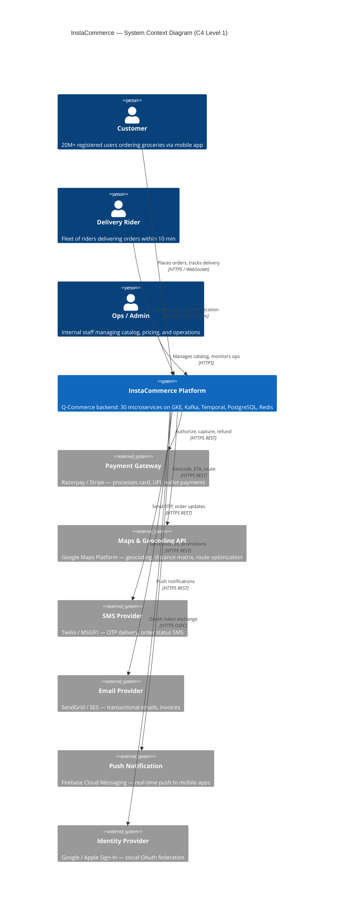
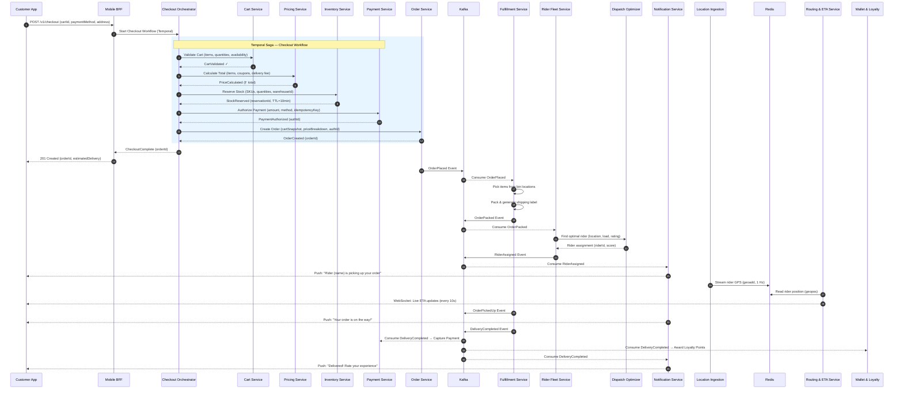
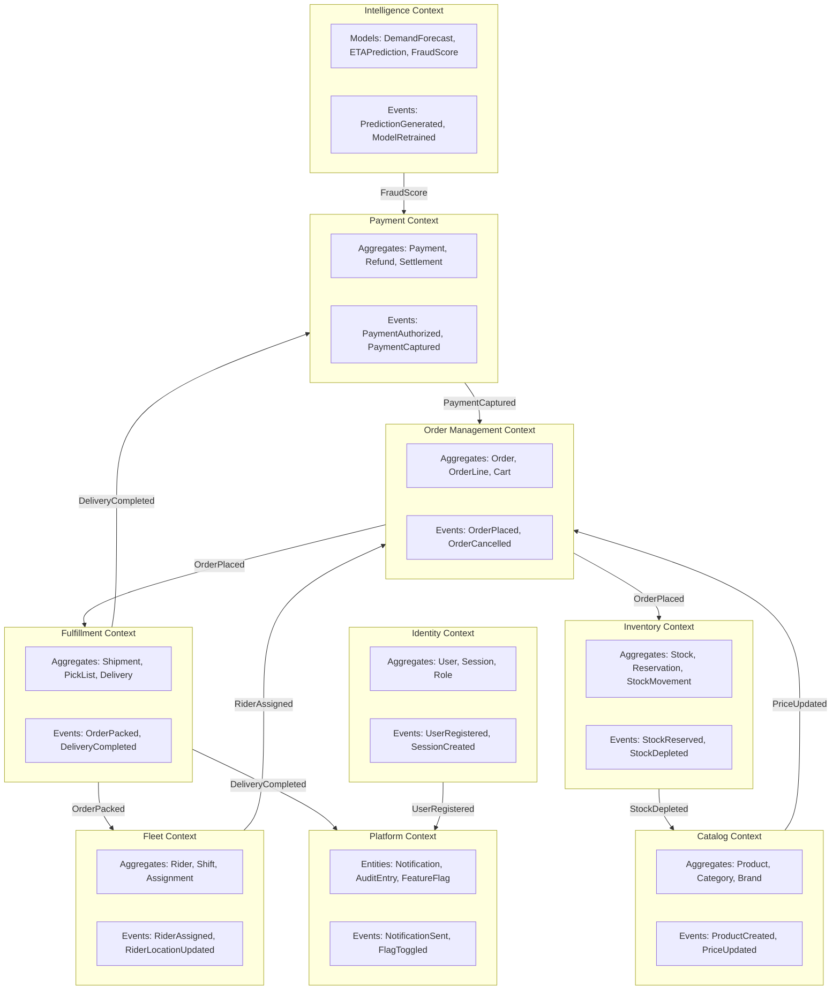
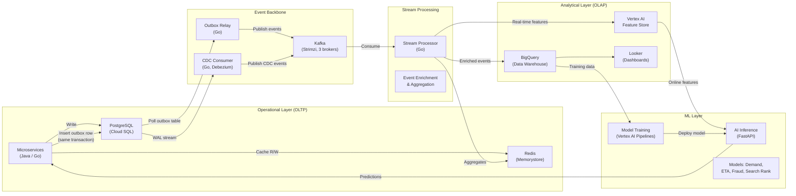
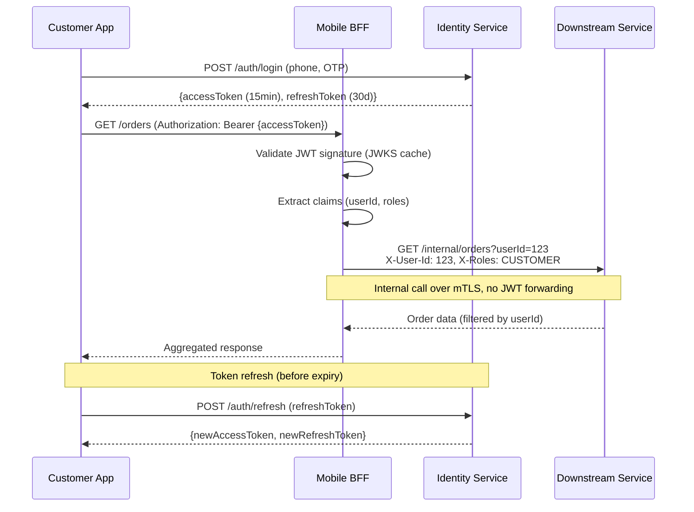
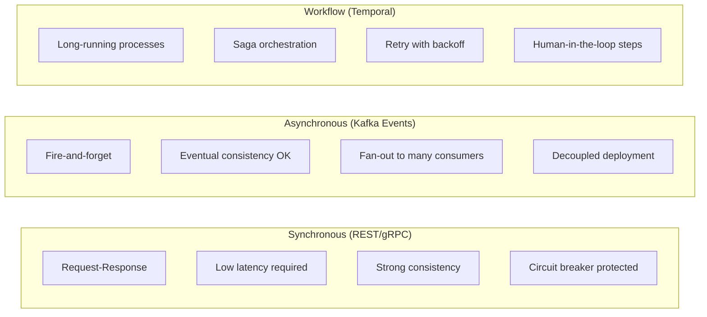

# InstaCommerce — High-Level Design (HLD)

> **Version:** 1.0  
> **Last Updated:** 2025-01-15  
> **Status:** Living Document  
> **Audience:** Engineering, Architecture Review Board, SRE, Security

---

## Table of Contents

1. [Executive Summary](#1-executive-summary)
2. [System Context (C4 Level 1)](#2-system-context-c4-level-1)
3. [Container Diagram (C4 Level 2)](#3-container-diagram-c4-level-2)
4. [Order Lifecycle Flow](#4-order-lifecycle-flow)
5. [Deployment Architecture](#5-deployment-architecture)
6. [Domain-Driven Design — Bounded Contexts](#6-domain-driven-design--bounded-contexts)
7. [Data Architecture](#7-data-architecture)
8. [Security Architecture](#8-security-architecture)
9. [Scalability Architecture](#9-scalability-architecture)
10. [Communication Patterns](#10-communication-patterns)
11. [Technology Decision Matrix](#11-technology-decision-matrix)
12. [Non-Functional Requirements](#12-non-functional-requirements)
13. [Glossary](#13-glossary)

---

## 1. Executive Summary

InstaCommerce is a production-grade Quick-Commerce (Q-Commerce) backend platform engineered to serve
**20M+ registered users**, process **500K+ orders per day**, and guarantee a **10-minute delivery SLA**
from order placement to doorstep. The system powers three client surfaces — a customer mobile
application, a rider mobile application, and an admin operations portal — each backed by a
purpose-built Backend-for-Frontend (BFF) or API gateway.

### Key Architectural Characteristics

| Characteristic | Target |
|---|---|
| Peak concurrent users | 2M+ |
| Order throughput | ~6 orders/second sustained, 30/s burst |
| End-to-end latency (p99) | < 300 ms for checkout |
| Delivery SLA | 10 minutes from order placement |
| Availability | 99.95% (≈ 4.4 h downtime/year) |
| Data residency | Regional (single GCP region, multi-zone) |
| RPO / RTO | 1 min / 5 min |

The platform is composed of **30 microservices** spanning three language runtimes — Java/Spring Boot
(20 services), Go (8 services/libraries), and Python/FastAPI (2 services) — each chosen to match
the performance and developer-productivity profile of its domain (see
[§11 Technology Decision Matrix](#11-technology-decision-matrix)).

All services are deployed on **Google Kubernetes Engine (GKE)** with **Istio** providing service mesh
capabilities (mTLS, traffic management, observability). Asynchronous communication is handled by
**Apache Kafka** (Strimzi operator), long-running workflows by **Temporal**, and ML inference by
**Vertex AI** and custom FastAPI model servers.

---

## 2. System Context (C4 Level 1)

The System Context diagram identifies the external actors and third-party systems that interact with
InstaCommerce. At this level of abstraction, the entire platform is treated as a single black box.

### Design Rationale

- **Customer App** communicates over HTTPS with WebSocket upgrade for live order tracking (rider
  location, ETA updates). The Mobile BFF aggregates multiple downstream calls into a single
  optimized response payload to minimize mobile round-trips.
- **Rider App** streams GPS coordinates via gRPC bidirectional streaming to the Location Ingestion
  service, ensuring sub-second position updates at scale (~50K concurrent riders).
- **Admin Portal** is a React SPA fronted by the Admin Gateway, which enforces RBAC policies and
  rate limiting independently of the customer path.
- All external provider integrations use **circuit breakers** (Resilience4j / custom Go middleware)
  and **fallback strategies** (e.g., SMS falls back from Twilio to MSG91) to maintain resilience.

---

## 3. Container Diagram (C4 Level 2)

The Container diagram decomposes the InstaCommerce system into its 30 constituent services, grouped
by business domain. Inter-service communication is shown using three patterns: synchronous REST,
asynchronous Kafka events, and Temporal workflow orchestration.

```mermaid
C4Container
    title InstaCommerce — Container Diagram (C4 Level 2)

    Person(customer, "Customer App")
    Person(rider, "Rider App")
    Person(admin, "Admin Portal")

    System_Boundary(instacommerce, "InstaCommerce Platform") {

        Container_Boundary(core, "Core Commerce Domain") {
            Container(identity, "Identity Service", "Java / Spring Boot", "Auth, user profiles, RBAC")
            Container(catalog, "Catalog Service", "Java / Spring Boot", "Product catalog, categories")
            Container(search, "Search Service", "Java / Spring Boot", "Full-text search, Elasticsearch")
            Container(pricing, "Pricing Service", "Java / Spring Boot", "Dynamic pricing, promotions, coupons")
            Container(cart, "Cart Service", "Java / Spring Boot", "Cart management, TTL-based expiry")
            Container(checkout, "Checkout Orchestrator", "Java / Spring Boot", "Saga orchestration via Temporal")
            Container(order, "Order Service", "Java / Spring Boot", "Order lifecycle, state machine")
            Container(payment, "Payment Service", "Java / Spring Boot", "Payment auth, capture, refund")
            Container(inventory, "Inventory Service", "Java / Spring Boot", "Stock levels, reservations, ATP")
            Container(wallet, "Wallet & Loyalty", "Java / Spring Boot", "Wallet balance, loyalty points, cashback")
            Container(fraud, "Fraud Detection", "Java / Spring Boot", "Rule engine + ML scoring")
        }

        Container_Boundary(fleet, "Fleet & Logistics Domain") {
            Container(fulfillment, "Fulfillment Service", "Java / Spring Boot", "Pick, pack, handoff")
            Container(riderfleet, "Rider Fleet Service", "Java / Spring Boot", "Rider onboarding, shift mgmt")
            Container(routing, "Routing & ETA", "Java / Spring Boot", "ETA calculation, route optimization")
            Container(warehouse, "Warehouse Service", "Java / Spring Boot", "Dark store ops, bin management")
            Container(dispatch, "Dispatch Optimizer", "Go", "Real-time rider-order matching, Hungarian algo")
            Container(location, "Location Ingestion", "Go", "High-throughput GPS stream processing")
        }

        Container_Boundary(intelligence, "Intelligence Domain") {
            Container(ai_orch, "AI Orchestrator", "Python / FastAPI", "LangGraph agent workflows, RAG")
            Container(ai_inf, "AI Inference", "Python / FastAPI", "ML model serving: demand, ETA, fraud")
        }

        Container_Boundary(platform, "Platform Domain") {
            Container(notification, "Notification Service", "Java / Spring Boot", "Multi-channel: SMS, email, push")
            Container(audit, "Audit Trail", "Java / Spring Boot", "Immutable event log, compliance")
            Container(config, "Config & Feature Flags", "Java / Spring Boot", "Runtime config, A/B testing")
            Container(mobile_bff, "Mobile BFF", "Java / Spring Boot", "Customer app aggregation layer")
            Container(admin_gw, "Admin Gateway", "Java / Spring Boot", "Admin API gateway, RBAC enforcement")
        }

        Container_Boundary(data_infra, "Data Infrastructure") {
            Container(outbox, "Outbox Relay", "Go", "Transactional outbox → Kafka publisher")
            Container(cdc, "CDC Consumer", "Go", "Change Data Capture processing")
            Container(recon, "Reconciliation Engine", "Go", "Payment & inventory reconciliation")
            Container(stream, "Stream Processor", "Go", "Real-time event enrichment & aggregation")
            Container(webhook, "Payment Webhook", "Go", "Idempotent payment callback handler")
            Container(goshared, "Go Shared Libs", "Go", "Common middleware, telemetry, error handling")
        }
    }

    Rel(customer, mobile_bff, "REST / WebSocket", "HTTPS")
    Rel(rider, riderfleet, "gRPC / REST", "HTTPS")
    Rel(admin, admin_gw, "REST", "HTTPS")

    Rel(mobile_bff, identity, "Authenticate", "REST")
    Rel(mobile_bff, catalog, "Browse products", "REST")
    Rel(mobile_bff, search, "Search", "REST")
    Rel(mobile_bff, cart, "Manage cart", "REST")
    Rel(mobile_bff, checkout, "Place order", "REST")
    Rel(mobile_bff, order, "Track order", "REST")

    Rel(checkout, cart, "Validate", "REST")
    Rel(checkout, pricing, "Calculate", "REST")
    Rel(checkout, inventory, "Reserve", "REST")
    Rel(checkout, payment, "Authorize", "REST")
    Rel(checkout, order, "Create", "REST")

    Rel(dispatch, location, "Rider positions", "REST/gRPC")
    Rel(riderfleet, dispatch, "Assignment request", "REST")
    Rel(routing, location, "Current positions", "Redis")
```

### Domain Grouping Rationale

| Domain | Services | Responsibility |
|---|---|---|
| **Core Commerce** | 11 services | End-to-end purchase flow from browse to payment |
| **Fleet & Logistics** | 6 services | Last-mile delivery: warehouse → rider → customer |
| **Intelligence** | 2 services | AI/ML: demand forecasting, ETA prediction, fraud scoring, conversational AI |
| **Platform** | 5 services | Cross-cutting: notifications, audit, config, BFF, admin |
| **Data Infrastructure** | 6 services/libs | Event relay, CDC, reconciliation, stream processing |

The domain boundaries align with Conway's Law — each domain maps to an autonomous squad that owns
its services, schemas, and deployment pipeline. Cross-domain communication is exclusively via Kafka
events or Temporal workflow signals, never direct database access.

---

## 4. Order Lifecycle Flow

The order lifecycle is the most critical flow in InstaCommerce, spanning 8 services and producing
12+ domain events. The Checkout Orchestrator implements a **Saga pattern via Temporal** to coordinate
the multi-step checkout with compensating transactions on failure.

### Saga Compensation

If any step in the Temporal checkout workflow fails, compensating actions execute in reverse order:

| Step | Forward Action | Compensating Action |
|---|---|---|
| 1 | Validate Cart | — (read-only) |
| 2 | Calculate Price | — (read-only) |
| 3 | Reserve Stock | Release reservation (`DELETE /reservations/{id}`) |
| 4 | Authorize Payment | Void authorization (`POST /payments/{authId}/void`) |
| 5 | Create Order | Mark order as `CANCELLED` |

Temporal provides durable execution guarantees — if the Checkout Orchestrator pod crashes mid-saga,
the workflow resumes from the last completed step on a different worker, ensuring exactly-once
semantics without manual intervention.

### Event Catalog (Order Domain)

| Event | Producer | Key Consumers | Kafka Topic |
|---|---|---|---|
| `OrderPlaced` | Order Service | Fulfillment, Analytics, Fraud | `order.lifecycle` |
| `OrderPacked` | Fulfillment | Rider Fleet, Notification | `fulfillment.events` |
| `RiderAssigned` | Rider Fleet | Notification, ETA | `fleet.events` |
| `OrderPickedUp` | Fulfillment | Notification, ETA | `fulfillment.events` |
| `DeliveryCompleted` | Fulfillment | Payment, Wallet, Notification, Analytics | `fulfillment.events` |
| `OrderCancelled` | Order Service | Inventory, Payment, Notification | `order.lifecycle` |

---

## 5. Deployment Architecture

InstaCommerce runs on **Google Cloud Platform (GCP)** in a single region with multi-zone redundancy.
All workloads are containerized and deployed to a GKE Autopilot cluster managed via GitOps (ArgoCD)
with Helm charts for templating.

```mermaid
graph TB
    subgraph GCP["Google Cloud Platform (asia-south1)"]
        subgraph GKE["GKE Autopilot Cluster"]
            subgraph Istio["Istio Service Mesh (mTLS, traffic mgmt)"]
                subgraph ns_core["Namespace: core-commerce"]
                    identity[Identity]
                    catalog[Catalog]
                    search[Search]
                    pricing[Pricing]
                    cart[Cart]
                    checkout[Checkout Orchestrator]
                    order_svc[Order]
                    payment_svc[Payment]
                    inventory[Inventory]
                    wallet[Wallet & Loyalty]
                    fraud[Fraud Detection]
                end
                subgraph ns_fleet["Namespace: fleet-logistics"]
                    fulfillment[Fulfillment]
                    rider_fleet[Rider Fleet]
                    routing_eta[Routing & ETA]
                    warehouse_svc[Warehouse]
                    dispatch_opt[Dispatch Optimizer]
                    location_ing[Location Ingestion]
                end
                subgraph ns_intel["Namespace: intelligence"]
                    ai_orch[AI Orchestrator]
                    ai_inf[AI Inference]
                end
                subgraph ns_platform["Namespace: platform"]
                    notification[Notification]
                    audit[Audit Trail]
                    config_ff[Config & Feature Flags]
                    mobile_bff[Mobile BFF]
                    admin_gw[Admin Gateway]
                end
                subgraph ns_data["Namespace: data-infra"]
                    outbox[Outbox Relay]
                    cdc[CDC Consumer]
                    recon[Reconciliation]
                    stream_proc[Stream Processor]
                    pay_webhook[Payment Webhook]
                end
            end
            subgraph infra_ns["Namespace: infrastructure"]
                kafka["Kafka (Strimzi Operator)<br/>3 brokers, 3 ZK"]
                temporal["Temporal Server<br/>+ Workers"]
                es["Elasticsearch<br/>(Search index)"]
            end
        end
        subgraph managed["GCP Managed Services"]
            cloudsql["Cloud SQL (PostgreSQL 15)<br/>HA, read replicas"]
            redis["Memorystore (Redis 7)<br/>Cluster mode, 64GB"]
            bq["BigQuery<br/>Analytics data warehouse"]
            vertex["Vertex AI<br/>Model training & endpoints"]
            gcs["Cloud Storage<br/>Images, exports, backups"]
            secret_mgr["Secret Manager<br/>API keys, DB creds"]
            cloud_armor["Cloud Armor<br/>WAF, DDoS protection"]
            lb["Cloud Load Balancer<br/>Global L7, SSL termination"]
        end
    end

    subgraph cicd["CI/CD Pipeline"]
        gh["GitHub Actions<br/>Build, test, scan"]
        ar["Artifact Registry<br/>Container images"]
        sonar["SonarQube<br/>Code quality"]
        trivy["Trivy<br/>Image vulnerability scan"]
        argo["ArgoCD<br/>GitOps deployment"]
        helm["Helm Charts<br/>K8s templating"]
        tf["Terraform<br/>Infrastructure as Code"]
    end

    subgraph monitoring["Observability Stack"]
        prom["Prometheus + Grafana"]
        loki["Loki (Logs)"]
        tempo["Tempo (Traces)"]
        otel["OpenTelemetry Collector"]
        pager["PagerDuty / Opsgenie"]
    end

    lb --> mobile_bff
    lb --> admin_gw
    lb --> pay_webhook

    gh --> ar
    ar --> argo
    argo --> GKE
    tf --> managed

    Istio --> cloudsql
    Istio --> redis
    outbox --> kafka
    cdc --> kafka
    stream_proc --> bq
    ai_inf --> vertex

    otel --> prom
    otel --> loki
    otel --> tempo
    prom --> pager
```

### Deployment Strategy

| Aspect | Configuration |
|---|---|
| **Cluster** | GKE Autopilot, `asia-south1`, 3 zones |
| **Node pools** | Autopilot-managed (no manual node management) |
| **Namespaces** | 5 domain namespaces + `infrastructure` + `monitoring` + `istio-system` |
| **Rollout strategy** | Canary (Istio traffic splitting: 5% → 25% → 50% → 100%) |
| **Image registry** | Artifact Registry with vulnerability scanning |
| **Secrets** | GCP Secret Manager, synced to K8s via External Secrets Operator |
| **DNS** | Cloud DNS with automated cert management (cert-manager + Let's Encrypt) |

### GitOps Workflow

1. Developer pushes to `main` → GitHub Actions builds, tests, scans, and pushes image to Artifact Registry.
2. GitHub Actions updates the Helm values file in the `deploy/` repo with the new image tag.
3. ArgoCD detects the Git diff, renders the Helm template, and applies to GKE.
4. Istio VirtualService controls canary traffic split; Prometheus metrics gate promotion.
5. ArgoCD auto-promotes after health checks pass (HTTP 200, gRPC OK, latency < SLO).

---

## 6. Domain-Driven Design — Bounded Contexts

InstaCommerce is designed around **Domain-Driven Design (DDD)** principles. Each bounded context
owns its domain model, database schema, and API contract. Cross-context communication is mediated
exclusively through published domain events (Kafka) or orchestrated workflows (Temporal).

### Context Map Relationships

| Upstream Context | Downstream Context | Relationship | Integration Pattern |
|---|---|---|---|
| Order Management | Fulfillment | Customer-Supplier | Kafka event (`OrderPlaced`) |
| Fulfillment | Fleet | Customer-Supplier | Kafka event (`OrderPacked`) |
| Fulfillment | Payment | Customer-Supplier | Kafka event (`DeliveryCompleted`) |
| Catalog | Order Management | Conformist | REST API (product details at order time) |
| Identity | All contexts | Open Host Service | JWT token validation, shared JWKS endpoint |
| Intelligence | Payment (Fraud) | Anti-Corruption Layer | REST with response mapping |
| Platform (Config) | All contexts | Published Language | Feature flag SDK, polling-based config |

### Schema Ownership

Each bounded context owns a dedicated **PostgreSQL schema** (logical isolation within Cloud SQL) or a
separate **Cloud SQL instance** for high-traffic contexts. No service ever reads another service's
database directly — all cross-context data access is via APIs or events.

| Context | Database | Schema | Estimated Size |
|---|---|---|---|
| Identity | `insta-identity` | `identity` | 50 GB |
| Catalog | `insta-catalog` | `catalog` | 20 GB |
| Order Management | `insta-orders` | `orders` | 500 GB (partitioned by month) |
| Payment | `insta-payments` | `payments` | 300 GB |
| Inventory | `insta-inventory` | `inventory` | 10 GB |
| Fulfillment | `insta-fulfillment` | `fulfillment` | 200 GB |
| Fleet | `insta-fleet` | `fleet` | 80 GB |

---

## 7. Data Architecture

InstaCommerce implements a **Lambda-style data architecture** with separate operational (OLTP) and
analytical (OLAP) paths. The Transactional Outbox pattern ensures reliable event publishing without
dual-write risks, while CDC captures schema-level changes for the data warehouse.

### Transactional Outbox Pattern

The Outbox Relay (Go) solves the dual-write problem — it guarantees that a domain event is published
to Kafka if and only if the corresponding database transaction commits:

1. Service writes business data + outbox row in a **single PostgreSQL transaction**.
2. Outbox Relay polls the `outbox_events` table every 100ms (configurable).
3. Publishes each event to the appropriate Kafka topic with the outbox row ID as the idempotency key.
4. Marks the outbox row as `PUBLISHED` after Kafka acknowledgement.
5. A background job prunes published rows older than 72 hours.

### CDC Pipeline

Change Data Capture (via Debezium-like logical replication in Go) streams PostgreSQL WAL changes
for tables that need analytical replication without impacting the application write path. CDC events
flow through Kafka to the Stream Processor, which enriches them with Redis-cached reference data
before sinking to BigQuery.

### Feature Store

Vertex AI Feature Store provides low-latency (<10ms) online feature serving for ML models:

| Feature Group | Features | Update Frequency | Source |
|---|---|---|---|
| User behavior | order_count_30d, avg_basket_value, cancel_rate | Hourly | BigQuery batch |
| Product demand | demand_forecast_1h, demand_forecast_24h | Every 15 min | Stream Processor |
| Rider performance | avg_delivery_time, acceptance_rate, rating | Real-time | Kafka stream |
| Geo features | zone_demand_heatmap, zone_avg_eta | Every 5 min | Stream Processor |

---

## 8. Security Architecture

InstaCommerce implements a **defense-in-depth** security model with multiple layers of protection
from the network edge to the database row level.

```mermaid
graph TB
    subgraph edge["Edge Security"]
        waf["Cloud Armor WAF<br/>OWASP Top 10, rate limiting"]
        lb["Global L7 Load Balancer<br/>SSL/TLS termination"]
        ddos["DDoS Protection<br/>Cloud Armor adaptive"]
    end

    subgraph api_layer["API Layer"]
        apigw["Mobile BFF / Admin Gateway<br/>JWT validation, rate limiting"]
        auth_flow["Auth Flow:<br/>1. Client sends JWT in Authorization header<br/>2. BFF validates with Identity Service JWKS<br/>3. Claims extracted: userId, roles, permissions"]
    end

    subgraph mesh["Service Mesh (Istio)"]
        mtls["mTLS<br/>All service-to-service traffic encrypted"]
        authz["Authorization Policy<br/>Service-level RBAC via Istio"]
        rbac["OPA Policies<br/>Fine-grained access control"]
    end

    subgraph app["Application Security"]
        jwt["JWT (RS256)<br/>Short-lived access tokens (15 min)<br/>Long-lived refresh tokens (30 days)"]
        api_key["API Key Auth<br/>Webhook callbacks, partner APIs"]
        encrypt["Field-Level Encryption<br/>PII fields: phone, email, address"]
        input_val["Input Validation<br/>Bean Validation (Java), Pydantic (Python)"]
    end

    subgraph data["Data Security"]
        tde["Encryption at Rest<br/>Cloud SQL: AES-256, CMEK"]
        transit["Encryption in Transit<br/>TLS 1.3 everywhere"]
        masking["Data Masking<br/>PII masked in logs, non-prod envs"]
        backup["Encrypted Backups<br/>Automated, CMEK, cross-region"]
    end

    subgraph compliance["Compliance & GDPR"]
        erasure["GDPR Erasure Pipeline<br/>Temporal workflow, 72h SLA"]
        consent["Consent Management<br/>Granular opt-in/opt-out"]
        audit_log["Audit Trail Service<br/>Immutable append-only log"]
        dpia["Data Protection Impact Assessments"]
    end

    edge --> api_layer
    api_layer --> mesh
    mesh --> app
    app --> data
    data --> compliance
```

### JWT Authentication Flow

### GDPR Erasure Pipeline

When a user requests account deletion (Right to Erasure), a Temporal workflow orchestrates data
removal across all services within a 72-hour SLA:

1. **Identity Service** — Anonymize user record, revoke all tokens.
2. **Order Service** — Retain order records with anonymized user reference (legal requirement: 7 years).
3. **Payment Service** — Remove stored payment methods, anonymize transaction records.
4. **Notification Service** — Purge notification history, unsubscribe from all channels.
5. **Analytics (BigQuery)** — Execute `DELETE` on user-attributed rows, purge from Feature Store.
6. **Audit Trail** — Log the erasure action itself (immutable, required for compliance proof).

### Security Controls Summary

| Layer | Control | Implementation |
|---|---|---|
| Network edge | WAF + DDoS | Cloud Armor |
| Transport | TLS 1.3 | Cloud LB (external), Istio mTLS (internal) |
| Authentication | JWT (RS256) | Identity Service + JWKS endpoint |
| Authorization | RBAC + ABAC | Istio AuthorizationPolicy + OPA |
| Secrets | Rotation | GCP Secret Manager + External Secrets Operator |
| PII | Field encryption | AES-256-GCM, application-layer |
| Audit | Immutable log | Audit Trail service, append-only PostgreSQL |
| Compliance | GDPR erasure | Temporal workflow, 72h SLA |
| Code | SAST + SCA | SonarQube + Trivy in CI pipeline |
| Container | Image scan | Trivy + Artifact Registry vulnerability scanning |

---

## 9. Scalability Architecture

InstaCommerce is designed to handle **10x traffic spikes** (festive sales, flash deals) without
degradation. The scalability strategy operates at four layers: compute, cache, messaging, and data.

```mermaid
graph TB
    subgraph compute["Compute Scaling"]
        hpa["Horizontal Pod Autoscaler<br/>CPU: 70%, Memory: 80%<br/>Custom: requests/sec, Kafka lag"]
        vpa["Vertical Pod Autoscaler<br/>Recommendation mode (non-disruptive)"]
        pdb["Pod Disruption Budget<br/>minAvailable: 2 for critical services"]
        anti["Pod Anti-Affinity<br/>Spread across zones (topology key)"]
        priority["Priority Classes<br/>Critical: checkout, payment, order<br/>Normal: catalog, search<br/>Low: analytics, reconciliation"]
    end

    subgraph cache["Caching Strategy"]
        l1["L1: In-Process Cache<br/>Caffeine (Java), 10s TTL<br/>Feature flags, config"]
        l2["L2: Redis (Memorystore)<br/>Cluster mode, 64 GB<br/>Session, cart, inventory counts"]
        l3["L3: CDN / Edge Cache<br/>Cloud CDN<br/>Product images, static assets"]
        cache_aside["Cache-Aside Pattern<br/>Read: cache → DB on miss<br/>Write: DB → invalidate cache"]
        write_through["Write-Through<br/>Cart, rider location<br/>Redis is source of truth"]
    end

    subgraph messaging["Kafka Scaling"]
        partitions["Partition Strategy<br/>order.lifecycle: 32 partitions<br/>fulfillment.events: 16 partitions<br/>fleet.events: 64 partitions (high volume)"]
        consumers["Consumer Groups<br/>Auto-scaling consumers per partition<br/>Max parallelism = partition count"]
        retention["Retention Policy<br/>Hot: 7 days (SSD)<br/>Cold: 90 days (tiered storage)"]
        backpressure["Backpressure<br/>Consumer lag alert > 10K<br/>Auto-scale consumer pods"]
    end

    subgraph database["Database Scaling"]
        read_replica["Read Replicas<br/>2 replicas per primary<br/>Read traffic routed via PgBouncer"]
        conn_pool["Connection Pooling<br/>PgBouncer: max 500 connections/instance<br/>HikariCP: max 20 per service pod"]
        partitioning["Table Partitioning<br/>Orders: range partition by month<br/>Events: range partition by day"]
        indexing["Index Strategy<br/>Partial indexes for active records<br/>BRIN indexes for time-series"]
    end

    compute --> cache
    cache --> messaging
    messaging --> database
```

### Horizontal Pod Autoscaler Configuration

| Service | Min Replicas | Max Replicas | Scale Metric | Target |
|---|---|---|---|---|
| Mobile BFF | 4 | 40 | CPU utilization | 70% |
| Checkout Orchestrator | 3 | 20 | Requests/sec | 200 rps |
| Order Service | 3 | 30 | CPU utilization | 70% |
| Payment Service | 3 | 20 | CPU utilization | 60% |
| Inventory Service | 3 | 20 | CPU utilization | 70% |
| Location Ingestion | 4 | 50 | Kafka consumer lag | < 5,000 |
| Dispatch Optimizer | 2 | 15 | CPU utilization | 75% |
| Stream Processor | 2 | 20 | Kafka consumer lag | < 10,000 |
| AI Inference | 2 | 10 | GPU utilization | 60% |

### Redis Caching Layers

| Cache Use Case | Key Pattern | TTL | Eviction |
|---|---|---|---|
| User session | `session:{userId}` | 30 min | LRU |
| Cart | `cart:{userId}` | 24 hours | Explicit delete |
| Product catalog | `product:{sku}` | 5 min | LRU |
| Inventory count | `stock:{warehouseId}:{sku}` | 30 sec | Write-through |
| Rider location | `rider:loc:{riderId}` | 60 sec | Overwrite |
| Feature flags | `flags:{namespace}` | 10 sec | Refresh-ahead |
| Rate limit | `ratelimit:{ip}:{endpoint}` | 1 min | TTL expiry |
| Search result | `search:{queryHash}` | 2 min | LRU |

### Database Connection Pooling

To prevent connection exhaustion with 30 microservices (potentially 200+ pods) hitting PostgreSQL:

1. **HikariCP** (application-level): Each pod maintains a pool of 15–20 connections.
2. **PgBouncer** (sidecar): Multiplexes application connections to a smaller set of PostgreSQL
   connections. Transaction-mode pooling reduces idle connection waste.
3. **Cloud SQL Proxy** (sidecar): Provides IAM-authenticated, encrypted connections to Cloud SQL
   without exposing database credentials in environment variables.

Connection math: 200 pods × 20 HikariCP connections = 4,000 logical connections →
PgBouncer reduces to ~400 actual PostgreSQL connections → Cloud SQL max_connections = 500.

---

## 10. Communication Patterns

Service-to-service communication in InstaCommerce follows three patterns, each chosen based on the
coupling and consistency requirements of the interaction.

### Pattern Overview

### Service Communication Matrix

| Source Service | Target Service | Pattern | Protocol | Purpose |
|---|---|---|---|---|
| Mobile BFF | Identity | Sync | REST | Token validation, user profile |
| Mobile BFF | Catalog | Sync | REST | Product listing, detail |
| Mobile BFF | Search | Sync | REST | Full-text product search |
| Mobile BFF | Cart | Sync | REST | Cart CRUD operations |
| Mobile BFF | Order | Sync | REST | Order status, history |
| Mobile BFF | Routing & ETA | Sync | WebSocket | Live ETA updates |
| Checkout Orchestrator | Cart | Sync | REST | Validate cart contents |
| Checkout Orchestrator | Pricing | Sync | REST | Price calculation |
| Checkout Orchestrator | Inventory | Sync | REST | Stock reservation |
| Checkout Orchestrator | Payment | Sync | REST | Payment authorization |
| Checkout Orchestrator | Order | Sync | REST | Order creation |
| Checkout Orchestrator | — | Workflow | Temporal | Saga orchestration |
| Rider Fleet | Dispatch Optimizer | Sync | gRPC | Optimal rider assignment |
| Routing & ETA | Location Ingestion | Sync | Redis read | Current rider position |
| Fraud Detection | AI Inference | Sync | REST | Fraud score prediction |
| Search | AI Inference | Sync | REST | Search ranking model |
| Admin Gateway | All core services | Sync | REST | Admin CRUD operations |
| Order Service | Fulfillment | Async | Kafka | `OrderPlaced` event |
| Order Service | Notification | Async | Kafka | `OrderPlaced` event |
| Fulfillment | Rider Fleet | Async | Kafka | `OrderPacked` event |
| Fulfillment | Payment | Async | Kafka | `DeliveryCompleted` → capture |
| Fulfillment | Wallet & Loyalty | Async | Kafka | `DeliveryCompleted` → points |
| Rider Fleet | Notification | Async | Kafka | `RiderAssigned` event |
| Location Ingestion | Redis | Async | Geo stream | Rider GPS coordinates |
| Outbox Relay | Kafka | Async | Poll + publish | Transactional outbox drain |
| CDC Consumer | Kafka | Async | WAL stream | Schema change replication |
| Stream Processor | BigQuery | Async | Kafka → sink | Analytical event pipeline |
| Payment Webhook | Payment Service | Async | Kafka | External callback → event |
| Reconciliation Engine | Payment + Inventory | Workflow | Temporal | Daily reconciliation |
| AI Orchestrator | Multiple | Workflow | LangGraph | Multi-step AI agent flows |
| GDPR Erasure | All services | Workflow | Temporal | User data deletion saga |

### Circuit Breaker Configuration (Synchronous Calls)

All synchronous inter-service calls are protected by circuit breakers (Resilience4j for Java,
custom middleware for Go) to prevent cascade failures:

| Parameter | Value | Rationale |
|---|---|---|
| Failure rate threshold | 50% | Trip after half of calls fail |
| Slow call threshold | 80% | Trip if 80% of calls exceed duration |
| Slow call duration | 2 seconds | Maximum acceptable latency |
| Wait duration in open state | 30 seconds | Cooldown before half-open |
| Permitted calls in half-open | 5 | Probe calls to test recovery |
| Sliding window size | 20 calls | Recent call sample size |

### Kafka Topic Configuration

| Topic | Partitions | Replication | Retention | Compaction | Key |
|---|---|---|---|---|---|
| `order.lifecycle` | 32 | 3 | 7 days | No | `orderId` |
| `fulfillment.events` | 16 | 3 | 7 days | No | `orderId` |
| `fleet.events` | 64 | 3 | 3 days | No | `riderId` |
| `payment.events` | 16 | 3 | 30 days | No | `paymentId` |
| `inventory.events` | 16 | 3 | 7 days | No | `warehouseId:sku` |
| `notification.commands` | 8 | 3 | 1 day | No | `userId` |
| `cdc.catalog` | 8 | 3 | 3 days | Compact | `productId` |
| `cdc.orders` | 32 | 3 | 3 days | No | `orderId` |
| `rider.location` | 64 | 2 | 1 hour | No | `riderId` |
| `analytics.enriched` | 16 | 3 | 90 days | No | `eventId` |

---

## 11. Technology Decision Matrix

Every technology choice in InstaCommerce is made with explicit rationale. This section documents
the key architectural decisions as an Architecture Decision Record (ADR) summary.

| # | Decision | Choice | Alternatives Considered | Rationale |
|---|---|---|---|---|
| 1 | **Domain services language** | Java 21 + Spring Boot 3 | Kotlin, Go, Node.js | Mature ecosystem for complex domain logic, rich ORM (JPA/Hibernate), proven at scale, large talent pool. Virtual threads (Project Loom) eliminate reactive complexity for I/O. |
| 2 | **I/O-bound services language** | Go 1.22 | Rust, Java, Node.js | Superior goroutine concurrency model for high-throughput I/O (GPS ingestion at 50K writes/sec). Minimal memory footprint (30 MB vs 200 MB JVM). Fast cold start for burst scaling. |
| 3 | **ML services language** | Python 3.12 + FastAPI | Java (DJL), Go (TFServing) | Python is the lingua franca of ML — best library support (PyTorch, scikit-learn, LangChain). FastAPI provides async HTTP with automatic OpenAPI docs. |
| 4 | **Saga orchestration** | Temporal | Axon Framework, Camunda, custom | Durable execution model eliminates state management complexity. Native support for retries, timeouts, compensation. Language-agnostic workers (Java + Go). Battle-tested at Uber/Snap scale. |
| 5 | **Event streaming** | Apache Kafka (Strimzi) | RabbitMQ, Pulsar, GCP Pub/Sub | Kafka's log-based architecture enables event replay, exactly-once semantics, and high throughput (100K msg/s). Strimzi operator simplifies K8s-native operations. |
| 6 | **Service mesh** | Istio | Linkerd, Consul Connect, none | mTLS without code changes, traffic shifting for canary deploys, rich observability (distributed tracing). Envoy proxy provides circuit breaking and rate limiting at the mesh layer. |
| 7 | **Primary database** | PostgreSQL 15 (Cloud SQL) | MySQL, CockroachDB, Spanner | JSONB for flexible schemas, excellent indexing (GIN, BRIN, partial), strong consistency, mature tooling. Cloud SQL provides automated HA, backups, and read replicas. |
| 8 | **Cache** | Redis 7 (Memorystore) | Memcached, Hazelcast | Rich data structures (sorted sets for leaderboards, geo for locations, streams for event buffering). Cluster mode for horizontal scaling. Sub-millisecond latency. |
| 9 | **Container orchestration** | GKE Autopilot | EKS, AKS, self-managed K8s | Autopilot eliminates node management overhead. Native integration with GCP services (Cloud SQL, Memorystore, IAM). Pod-level SLA. |
| 10 | **CI/CD** | GitHub Actions + ArgoCD | Jenkins, GitLab CI, Flux | GitHub Actions for build/test (native GitHub integration). ArgoCD for GitOps deployment (declarative, auditable, drift detection). |
| 11 | **Infrastructure as Code** | Terraform | Pulumi, Crossplane, GCP DM | Industry standard, vast provider ecosystem, state management, plan/apply workflow ensures safe infra changes. |
| 12 | **Search engine** | Elasticsearch | Algolia, Meilisearch, Typesense | Full-text search with fuzzy matching, faceted navigation, and custom ranking. Self-hosted for data control and cost at scale. |
| 13 | **AI agent framework** | LangGraph (LangChain) | AutoGen, CrewAI, custom | Graph-based agent orchestration with state persistence, human-in-the-loop support, and native tool calling. |
| 14 | **Data warehouse** | BigQuery | Snowflake, Redshift, ClickHouse | Serverless, pay-per-query, native GCP integration, ML integration with Vertex AI, columnar storage for analytics. |
| 15 | **Observability** | OpenTelemetry + Prometheus + Grafana + Loki + Tempo | Datadog, New Relic, Elastic APM | Open-source, vendor-neutral, full telemetry (metrics + logs + traces). Cost-effective at scale vs. SaaS alternatives. |

### Language Runtime Comparison (InstaCommerce Workloads)

| Criterion | Java 21 (Spring Boot) | Go 1.22 | Python 3.12 (FastAPI) |
|---|---|---|---|
| **Best for** | Complex domain logic, CRUD | High-throughput I/O, streaming | ML inference, AI agents |
| **Concurrency model** | Virtual threads (Loom) | Goroutines + channels | asyncio + uvicorn workers |
| **Memory per pod** | ~200–400 MB | ~30–80 MB | ~150–300 MB |
| **Cold start** | 3–8 sec (mitigated by CDS) | < 500 ms | 1–3 sec |
| **Ecosystem** | Spring, JPA, Resilience4j | stdlib, chi, sqlx | FastAPI, PyTorch, LangChain |
| **Service count** | 20 | 8 (incl. shared libs) | 2 |

---

## 12. Non-Functional Requirements

### Performance SLAs

| Endpoint Category | p50 Latency | p99 Latency | Availability |
|---|---|---|---|
| Product search | 50 ms | 200 ms | 99.9% |
| Cart operations | 30 ms | 100 ms | 99.95% |
| Checkout (end-to-end) | 200 ms | 500 ms | 99.95% |
| Payment authorization | 300 ms | 1,000 ms | 99.99% |
| Order status | 20 ms | 80 ms | 99.9% |
| Rider location update | 10 ms | 50 ms | 99.9% |
| ETA calculation | 80 ms | 300 ms | 99.9% |
| AI inference (fraud) | 50 ms | 200 ms | 99.5% |

### Disaster Recovery

| Aspect | Strategy |
|---|---|
| **Database** | Cloud SQL HA (synchronous replication across zones), automated backups every 6 hours, PITR with 7-day retention |
| **Kafka** | 3x replication factor, rack-aware placement across zones, MirrorMaker for DR region |
| **Redis** | Memorystore Standard tier (automatic failover), daily RDB snapshots |
| **Application state** | Stateless pods — all state in PostgreSQL, Redis, or Kafka. Any pod can be replaced. |
| **Temporal** | Persistent workflow state in PostgreSQL, survives worker pod restarts |

### Observability

The **Three Pillars of Observability** are implemented uniformly across all 30 services:

1. **Metrics** — OpenTelemetry SDK → Prometheus → Grafana. Standard RED metrics (Rate, Errors,
   Duration) for every service. Custom business metrics (orders/min, delivery times, cart
   abandonment rate).
2. **Logs** — Structured JSON logging (Logback for Java, zerolog for Go, structlog for Python) →
   Loki → Grafana. Correlation IDs propagated via `X-Request-Id` header.
3. **Traces** — OpenTelemetry auto-instrumentation → Tempo → Grafana. End-to-end trace from
   customer request through Kafka consumers to database queries.

### Alerting Tiers

| Tier | Response Time | Channel | Example |
|---|---|---|---|
| P1 — Critical | 5 min | PagerDuty (phone call) | Checkout failure rate > 5%, payment service down |
| P2 — High | 15 min | PagerDuty (push) | Kafka consumer lag > 50K, p99 latency > 2x SLO |
| P3 — Medium | 1 hour | Slack #alerts | Disk usage > 80%, certificate expiry < 30 days |
| P4 — Low | Next business day | Slack #alerts-low | Non-critical pod restart, config drift detected |

---

## 13. Glossary

| Term | Definition |
|---|---|
| **Q-Commerce** | Quick Commerce — delivery of goods (typically groceries) within 10–30 minutes |
| **BFF** | Backend-for-Frontend — aggregation layer tailored to a specific client (mobile, web, admin) |
| **Saga** | Distributed transaction pattern using a sequence of local transactions with compensating actions |
| **Outbox Pattern** | Technique to reliably publish events by writing them to a database table in the same transaction as business data |
| **CDC** | Change Data Capture — streaming database changes (inserts, updates, deletes) to downstream systems |
| **ATP** | Available to Promise — real-time inventory count available for customer orders |
| **mTLS** | Mutual TLS — both client and server authenticate each other via certificates |
| **JWKS** | JSON Web Key Set — endpoint exposing public keys for JWT signature verification |
| **HPA** | Horizontal Pod Autoscaler — Kubernetes resource that automatically scales pod replicas |
| **CMEK** | Customer-Managed Encryption Keys — encryption keys managed by the customer (vs. Google-managed) |
| **CDS** | Class Data Sharing — JVM feature to reduce startup time by sharing class metadata across processes |
| **BRIN** | Block Range Index — PostgreSQL index type optimized for naturally ordered data (timestamps) |
| **RED** | Rate, Errors, Duration — standard service-level metrics methodology |
| **PITR** | Point-in-Time Recovery — ability to restore a database to any specific moment |

---

*This document is maintained by the Architecture team. For questions or proposed changes, open a PR
against `docs/architecture/HLD.md` and tag `@instacommerce/architecture` for review.*
