# InstaCommerce — Infrastructure Architecture

> Q-commerce platform deployed on **Google Cloud Platform** using GKE, Istio service mesh, Terraform IaC, Helm charts, and ArgoCD GitOps.

---

## Table of Contents

1. [GCP Infrastructure Overview](#1-gcp-infrastructure-overview)
2. [CI/CD Pipeline](#2-cicd-pipeline)
3. [Istio Service Mesh Architecture](#3-istio-service-mesh-architecture)
4. [Terraform Module Hierarchy](#4-terraform-module-hierarchy)
5. [Kubernetes Resource Architecture](#5-kubernetes-resource-architecture)
6. [Helm Values Structure](#6-helm-values-structure)
7. [Monitoring Stack](#7-monitoring-stack)
8. [Database Architecture](#8-database-architecture)
9. [Security Architecture](#9-security-architecture)
10. [Disaster Recovery](#10-disaster-recovery)
11. [Auto-Scaling Strategy](#11-auto-scaling-strategy)

---

## 1. GCP Infrastructure Overview

The entire InstaCommerce platform runs inside a single GCP project with a dedicated VPC. Compute workloads are orchestrated via a regional GKE cluster, while stateful data services leverage GCP-managed offerings for operational simplicity.

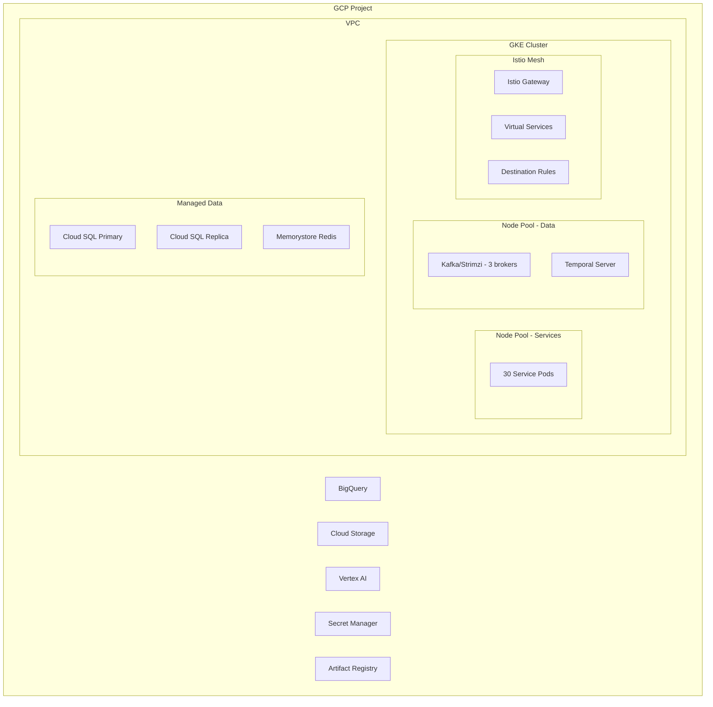

### Key GCP Services

| Service | Purpose | Configuration |
|---|---|---|
| **GKE** | Container orchestration | Regional, private cluster, 2 node pools |
| **Cloud SQL (PostgreSQL 15)** | Relational data | HA with read replica, `db-custom-4-16384` |
| **Memorystore (Redis 7)** | Caching & sessions | 5 GB, Standard tier with failover |
| **BigQuery** | Analytics data warehouse | Partitioned tables, streaming inserts |
| **Cloud Storage** | Object storage / data lake | Multi-regional, lifecycle policies |
| **Vertex AI** | ML model serving | Online prediction endpoints |
| **Secret Manager** | Secrets management | Automatic rotation, IAM-bound |
| **Artifact Registry** | Docker image registry | Vulnerability scanning enabled |
| **Cloud NAT** | Outbound internet for private nodes | Static IP pool |
| **Cloud Armor** | WAF / DDoS protection | OWASP top-10 rule set |

### Node Pool Configuration

```yaml
# Node Pool — Services (general workloads)
machineType: e2-standard-4    # 4 vCPU, 16 GB RAM
minNodes: 3
maxNodes: 12
diskSizeGb: 100
diskType: pd-ssd
autoScaling: true
labels:
  pool: services

# Node Pool — Data (Kafka, Temporal)
machineType: e2-standard-8    # 8 vCPU, 32 GB RAM
minNodes: 3
maxNodes: 6
diskSizeGb: 200
diskType: pd-ssd
autoScaling: true
taints:
  - key: dedicated
    value: data
    effect: NoSchedule
labels:
  pool: data
```

---

## 2. CI/CD Pipeline

InstaCommerce uses a GitOps workflow: GitHub Actions builds, tests, and publishes images; ArgoCD detects new images and reconciles Helm releases against the GKE cluster.

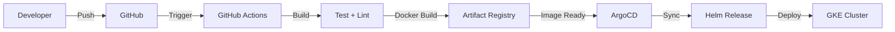

### Pipeline Stages

| Stage | Tool | Details |
|---|---|---|
| **Lint** | ktlint, ESLint | Code style enforcement |
| **Unit Tests** | JUnit 5, Kotest | Per-service test suites |
| **Integration Tests** | Testcontainers | Postgres, Redis, Kafka containers |
| **Contract Tests** | Pact | Consumer-driven contract verification |
| **Build** | Gradle (Kotlin DSL) | Multi-project build, build cache |
| **Docker Build** | Docker Buildx | Multi-stage, layer caching via registry |
| **Image Push** | Artifact Registry | Tagged with `sha-<commit>` and `latest` |
| **Security Scan** | Trivy, gcloud | Image vulnerability scanning |
| **Deploy** | ArgoCD | Auto-sync on image tag change |

### GitHub Actions Workflow

```yaml
# .github/workflows/ci.yml (simplified)
name: CI/CD
on:
  push:
    branches: [main, develop]
  pull_request:
    branches: [main]

jobs:
  build-test:
    runs-on: ubuntu-latest
    steps:
      - uses: actions/checkout@v4
      - uses: actions/setup-java@v4
        with:
          java-version: '21'
          distribution: 'temurin'
      - name: Build & Test
        run: ./gradlew build test --parallel
      - name: Lint
        run: ./gradlew ktlintCheck

  docker-publish:
    needs: build-test
    if: github.ref == 'refs/heads/main'
    runs-on: ubuntu-latest
    strategy:
      matrix:
        service:
          - api-gateway
          - user-service
          - product-catalog-service
          - order-service
          - inventory-service
          - payment-service
          - delivery-service
          - notification-service
          - search-service
          - analytics-service
    steps:
      - name: Build & Push
        run: |
          docker buildx build \
            -t $REGION-docker.pkg.dev/$PROJECT/$REPO/${{ matrix.service }}:sha-${{ github.sha }} \
            --push services/${{ matrix.service }}

  deploy:
    needs: docker-publish
    runs-on: ubuntu-latest
    steps:
      - name: Update ArgoCD image tag
        run: |
          argocd app set instacommerce \
            --helm-set image.tag=sha-${{ github.sha }}
```

### ArgoCD Application

```yaml
# argocd/application.yaml
apiVersion: argoproj.io/v1alpha1
kind: Application
metadata:
  name: instacommerce
  namespace: argocd
spec:
  project: default
  source:
    repoURL: https://github.com/org/InstaCommerce
    targetRevision: main
    path: deploy/helm/instacommerce
    helm:
      valueFiles:
        - values.yaml
        - values-prod.yaml
  destination:
    server: https://kubernetes.default.svc
    namespace: instacommerce
  syncPolicy:
    automated:
      prune: true
      selfHeal: true
    syncOptions:
      - CreateNamespace=true
      - ApplyOutOfSyncOnly=true
```

---

## 3. Istio Service Mesh Architecture

Istio provides traffic management, mutual TLS, and fine-grained authorization between all services inside the mesh.

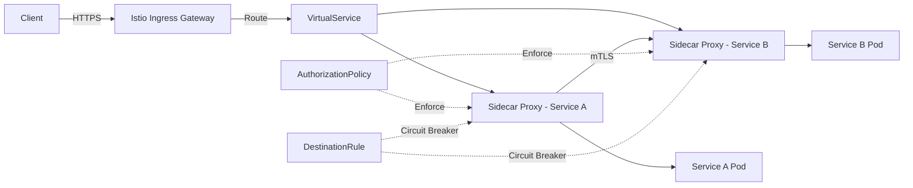

### Istio Gateway

```yaml
apiVersion: networking.istio.io/v1beta1
kind: Gateway
metadata:
  name: instacommerce-gateway
  namespace: istio-system
spec:
  selector:
    istio: ingressgateway
  servers:
    - port:
        number: 443
        name: https
        protocol: HTTPS
      tls:
        mode: SIMPLE
        credentialName: instacommerce-tls
      hosts:
        - "api.instacommerce.com"
        - "*.instacommerce.com"
```

### VirtualService Routing

```yaml
apiVersion: networking.istio.io/v1beta1
kind: VirtualService
metadata:
  name: api-routing
  namespace: instacommerce
spec:
  hosts:
    - "api.instacommerce.com"
  gateways:
    - istio-system/instacommerce-gateway
  http:
    - match:
        - uri:
            prefix: /api/v1/users
      route:
        - destination:
            host: user-service
            port:
              number: 8080
    - match:
        - uri:
            prefix: /api/v1/products
      route:
        - destination:
            host: product-catalog-service
            port:
              number: 8080
    - match:
        - uri:
            prefix: /api/v1/orders
      route:
        - destination:
            host: order-service
            port:
              number: 8080
      retries:
        attempts: 3
        perTryTimeout: 2s
        retryOn: 5xx,reset,connect-failure
```

### Destination Rules (Circuit Breaking)

```yaml
apiVersion: networking.istio.io/v1beta1
kind: DestinationRule
metadata:
  name: order-service-dr
  namespace: instacommerce
spec:
  host: order-service
  trafficPolicy:
    connectionPool:
      tcp:
        maxConnections: 100
      http:
        h2UpgradePolicy: UPGRADE
        http1MaxPendingRequests: 100
        http2MaxRequests: 1000
    outlierDetection:
      consecutive5xxErrors: 5
      interval: 30s
      baseEjectionTime: 30s
      maxEjectionPercent: 50
```

### Authorization Policy

```yaml
apiVersion: security.istio.io/v1beta1
kind: AuthorizationPolicy
metadata:
  name: order-service-authz
  namespace: instacommerce
spec:
  selector:
    matchLabels:
      app: order-service
  rules:
    - from:
        - source:
            principals:
              - cluster.local/ns/instacommerce/sa/api-gateway
              - cluster.local/ns/instacommerce/sa/payment-service
      to:
        - operation:
            methods: ["GET", "POST"]
            paths: ["/api/v1/orders/*"]
```

---

## 4. Terraform Module Hierarchy

All GCP infrastructure is defined as Terraform modules, parameterized per environment.

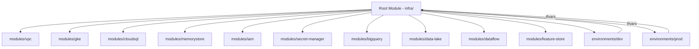

### Module Inventory

| Module | Path | Description |
|---|---|---|
| `vpc` | `infra/modules/vpc` | VPC, subnets, firewall rules, Cloud NAT, Cloud Router |
| `gke` | `infra/modules/gke` | GKE cluster, node pools, Workload Identity |
| `cloudsql` | `infra/modules/cloudsql` | Cloud SQL instances, databases, users, HA config |
| `memorystore` | `infra/modules/memorystore` | Redis instances, failover, auth |
| `iam` | `infra/modules/iam` | Service accounts, IAM bindings, Workload Identity |
| `secret-manager` | `infra/modules/secret-manager` | Secrets, versions, IAM policies |
| `bigquery` | `infra/modules/bigquery` | Datasets, tables, views, scheduled queries |
| `data-lake` | `infra/modules/data-lake` | GCS buckets, lifecycle rules, IAM |
| `dataflow` | `infra/modules/dataflow` | Dataflow jobs, templates, networking |
| `feature-store` | `infra/modules/feature-store` | Vertex AI Feature Store, entity types |

### Environment Configuration

```hcl
# infra/environments/prod/terraform.tfvars
project_id       = "instacommerce-prod"
region           = "asia-south1"
zone             = "asia-south1-a"

# GKE
gke_min_nodes    = 3
gke_max_nodes    = 12
gke_machine_type = "e2-standard-4"

# Cloud SQL
sql_tier              = "db-custom-4-16384"
sql_ha_enabled        = true
sql_backup_enabled    = true
sql_point_in_time     = true

# Redis
redis_memory_size_gb  = 5
redis_tier            = "STANDARD_HA"
redis_version         = "REDIS_7_0"
```

```hcl
# infra/environments/dev/terraform.tfvars
project_id       = "instacommerce-dev"
region           = "asia-south1"
zone             = "asia-south1-a"

# GKE
gke_min_nodes    = 1
gke_max_nodes    = 3
gke_machine_type = "e2-standard-2"

# Cloud SQL
sql_tier              = "db-f1-micro"
sql_ha_enabled        = false
sql_backup_enabled    = false
sql_point_in_time     = false

# Redis
redis_memory_size_gb  = 1
redis_tier            = "BASIC"
redis_version         = "REDIS_7_0"
```

### Terraform State

- **Backend:** GCS bucket (`instacommerce-tf-state`)
- **Locking:** Enabled via GCS object versioning
- **Workspaces:** One workspace per environment (`dev`, `prod`)

---

## 5. Kubernetes Resource Architecture

Every microservice follows a standardized resource topology inside the `instacommerce` namespace.

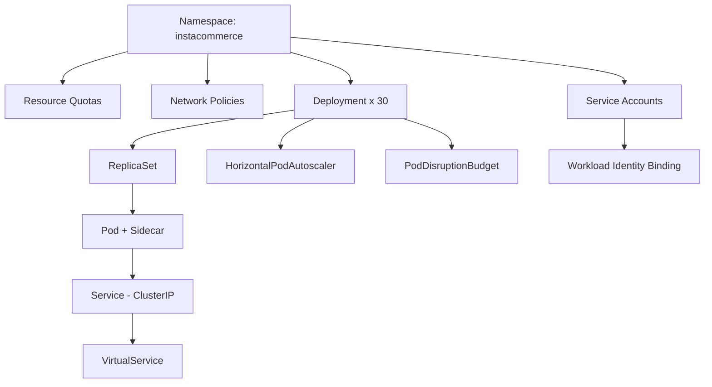

### Resource Quotas

```yaml
apiVersion: v1
kind: ResourceQuota
metadata:
  name: instacommerce-quota
  namespace: instacommerce
spec:
  hard:
    requests.cpu: "80"
    requests.memory: "160Gi"
    limits.cpu: "160"
    limits.memory: "320Gi"
    pods: "200"
    services: "50"
    persistentvolumeclaims: "30"
```

### Network Policy

```yaml
apiVersion: networking.k8s.io/v1
kind: NetworkPolicy
metadata:
  name: default-deny-all
  namespace: instacommerce
spec:
  podSelector: {}
  policyTypes:
    - Ingress
    - Egress
  ingress: []
  egress:
    - to:
        - namespaceSelector:
            matchLabels:
              name: kube-system
      ports:
        - protocol: UDP
          port: 53
---
apiVersion: networking.k8s.io/v1
kind: NetworkPolicy
metadata:
  name: allow-mesh-traffic
  namespace: instacommerce
spec:
  podSelector: {}
  policyTypes:
    - Ingress
  ingress:
    - from:
        - namespaceSelector:
            matchLabels:
              name: istio-system
        - podSelector: {}
```

### PodDisruptionBudget

```yaml
apiVersion: policy/v1
kind: PodDisruptionBudget
metadata:
  name: order-service-pdb
  namespace: instacommerce
spec:
  minAvailable: 1
  selector:
    matchLabels:
      app: order-service
```

### Service List (30 Deployments)

| # | Service | Replicas | CPU Req/Lim | Memory Req/Lim |
|---|---|---|---|---|
| 1 | api-gateway | 3 | 500m / 1000m | 512Mi / 1Gi |
| 2 | user-service | 2 | 250m / 500m | 256Mi / 512Mi |
| 3 | product-catalog-service | 3 | 500m / 1000m | 512Mi / 1Gi |
| 4 | order-service | 3 | 500m / 1000m | 512Mi / 1Gi |
| 5 | inventory-service | 3 | 500m / 1000m | 512Mi / 1Gi |
| 6 | payment-service | 2 | 500m / 1000m | 512Mi / 1Gi |
| 7 | delivery-service | 3 | 500m / 1000m | 512Mi / 1Gi |
| 8 | notification-service | 2 | 250m / 500m | 256Mi / 512Mi |
| 9 | search-service | 2 | 500m / 1000m | 1Gi / 2Gi |
| 10 | analytics-service | 2 | 250m / 500m | 512Mi / 1Gi |
| 11 | pricing-service | 2 | 250m / 500m | 256Mi / 512Mi |
| 12 | promotion-service | 2 | 250m / 500m | 256Mi / 512Mi |
| 13 | review-service | 1 | 250m / 500m | 256Mi / 512Mi |
| 14 | recommendation-service | 2 | 500m / 1000m | 1Gi / 2Gi |
| 15 | cart-service | 3 | 250m / 500m | 256Mi / 512Mi |
| 16 | wishlist-service | 1 | 250m / 500m | 256Mi / 512Mi |
| 17 | address-service | 1 | 250m / 500m | 256Mi / 512Mi |
| 18 | loyalty-service | 1 | 250m / 500m | 256Mi / 512Mi |
| 19 | fulfillment-service | 2 | 500m / 1000m | 512Mi / 1Gi |
| 20 | warehouse-service | 2 | 250m / 500m | 256Mi / 512Mi |
| 21 | store-service | 1 | 250m / 500m | 256Mi / 512Mi |
| 22 | rider-service | 2 | 500m / 1000m | 512Mi / 1Gi |
| 23 | route-optimization-service | 2 | 500m / 1000m | 1Gi / 2Gi |
| 24 | fraud-detection-service | 2 | 500m / 1000m | 1Gi / 2Gi |
| 25 | media-service | 1 | 250m / 500m | 512Mi / 1Gi |
| 26 | audit-service | 1 | 250m / 500m | 256Mi / 512Mi |
| 27 | config-service | 1 | 250m / 500m | 256Mi / 512Mi |
| 28 | scheduler-service | 1 | 250m / 500m | 256Mi / 512Mi |
| 29 | event-processor | 3 | 500m / 1000m | 512Mi / 1Gi |
| 30 | data-pipeline-service | 2 | 500m / 1000m | 1Gi / 2Gi |

---

## 6. Helm Values Structure

Helm values follow a layered override pattern: base → environment-specific → per-service.

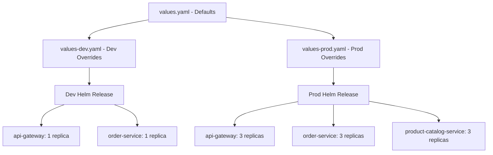

### Base Values (`values.yaml`)

```yaml
global:
  image:
    registry: asia-south1-docker.pkg.dev/instacommerce-prod/services
    pullPolicy: IfNotPresent
  istio:
    enabled: true
  monitoring:
    enabled: true
    port: 9090

services:
  api-gateway:
    port: 8080
    replicas: 2
    resources:
      requests: { cpu: 500m, memory: 512Mi }
      limits:   { cpu: 1000m, memory: 1Gi }
    hpa:
      minReplicas: 2
      maxReplicas: 10
      targetCPU: 70

  user-service:
    port: 8080
    replicas: 2
    resources:
      requests: { cpu: 250m, memory: 256Mi }
      limits:   { cpu: 500m, memory: 512Mi }

  order-service:
    port: 8080
    replicas: 2
    resources:
      requests: { cpu: 500m, memory: 512Mi }
      limits:   { cpu: 1000m, memory: 1Gi }
    hpa:
      minReplicas: 2
      maxReplicas: 15
      targetCPU: 65

  product-catalog-service:
    port: 8080
    replicas: 2
    resources:
      requests: { cpu: 500m, memory: 512Mi }
      limits:   { cpu: 1000m, memory: 1Gi }

  inventory-service:
    port: 8080
    replicas: 2
    resources:
      requests: { cpu: 500m, memory: 512Mi }
      limits:   { cpu: 1000m, memory: 1Gi }

  payment-service:
    port: 8080
    replicas: 2
    resources:
      requests: { cpu: 500m, memory: 512Mi }
      limits:   { cpu: 1000m, memory: 1Gi }

  delivery-service:
    port: 8080
    replicas: 2
    resources:
      requests: { cpu: 500m, memory: 512Mi }
      limits:   { cpu: 1000m, memory: 1Gi }

  notification-service:
    port: 8080
    replicas: 1
    resources:
      requests: { cpu: 250m, memory: 256Mi }
      limits:   { cpu: 500m, memory: 512Mi }
```

### Production Overrides (`values-prod.yaml`)

```yaml
global:
  image:
    pullPolicy: Always

services:
  api-gateway:
    replicas: 3
    hpa:
      minReplicas: 3
      maxReplicas: 20
      targetCPU: 60
  order-service:
    replicas: 3
    hpa:
      minReplicas: 3
      maxReplicas: 20
  inventory-service:
    replicas: 3
  delivery-service:
    replicas: 3
  product-catalog-service:
    replicas: 3
  event-processor:
    replicas: 3
```

### Dev Overrides (`values-dev.yaml`)

```yaml
global:
  image:
    registry: asia-south1-docker.pkg.dev/instacommerce-dev/services

services:
  api-gateway:
    replicas: 1
    hpa:
      minReplicas: 1
      maxReplicas: 2
  order-service:
    replicas: 1
  inventory-service:
    replicas: 1
  delivery-service:
    replicas: 1
```

---

## 7. Monitoring Stack

Observability is built on three pillars: metrics (Prometheus), traces (OpenTelemetry), and logs (Cloud Logging).

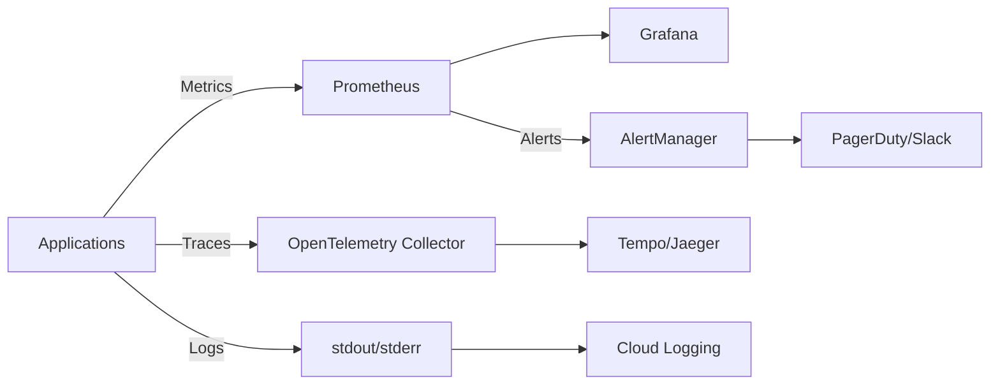

### Metrics (Prometheus + Grafana)

| Metric Category | Examples |
|---|---|
| **RED Metrics** | Request rate, error rate, duration per service |
| **USE Metrics** | CPU utilization, memory saturation, network errors |
| **Business Metrics** | Orders/min, delivery SLA %, payment success rate |
| **Kafka Metrics** | Consumer lag, throughput, partition count |
| **JVM Metrics** | Heap usage, GC pauses, thread count |

### Key Alerts

```yaml
# monitoring/prometheus/alerts.yaml
groups:
  - name: instacommerce-critical
    rules:
      - alert: HighErrorRate
        expr: |
          sum(rate(http_server_requests_seconds_count{status=~"5.."}[5m])) by (service)
          / sum(rate(http_server_requests_seconds_count[5m])) by (service)
          > 0.05
        for: 2m
        labels:
          severity: critical
        annotations:
          summary: "High error rate on {{ $labels.service }}"

      - alert: HighLatencyP99
        expr: |
          histogram_quantile(0.99, rate(http_server_requests_seconds_bucket[5m])) > 2
        for: 5m
        labels:
          severity: warning

      - alert: KafkaConsumerLag
        expr: |
          kafka_consumer_group_lag > 10000
        for: 5m
        labels:
          severity: warning

      - alert: PodCrashLooping
        expr: |
          rate(kube_pod_container_status_restarts_total[15m]) > 0
        for: 5m
        labels:
          severity: critical
```

### Distributed Tracing

- **Instrumentation:** OpenTelemetry Java Agent (auto-instrumentation)
- **Collector:** OpenTelemetry Collector deployed as DaemonSet
- **Backend:** Tempo (Grafana) or Cloud Trace
- **Sampling:** Head-based, 10% in production, 100% in dev
- **Context propagation:** W3C Trace Context headers across all HTTP and Kafka calls

### Grafana Dashboards

| Dashboard | Purpose |
|---|---|
| Service Overview | RED metrics for all 30 services |
| Order Pipeline | End-to-end order flow latency |
| Kafka Health | Broker health, consumer lag, throughput |
| GKE Cluster | Node utilization, pod scheduling |
| Istio Mesh | Traffic flow, mTLS status, error rates |
| Business KPIs | Revenue, orders, delivery times |

---

## 8. Database Architecture

Each service owns its database schema (database-per-service pattern). All relational data lives in Cloud SQL PostgreSQL.

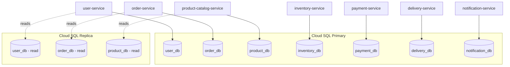

### Connection Pooling (HikariCP)

```yaml
# Per-service Spring Boot configuration
spring:
  datasource:
    hikari:
      minimum-idle: 5
      maximum-pool-size: 20
      idle-timeout: 300000        # 5 min
      max-lifetime: 1800000       # 30 min
      connection-timeout: 30000   # 30 sec
      leak-detection-threshold: 60000
      pool-name: ${spring.application.name}-pool
```

### Cloud SQL HA Configuration

| Parameter | Dev | Production |
|---|---|---|
| **Tier** | `db-f1-micro` | `db-custom-4-16384` |
| **HA** | Disabled | Enabled (regional) |
| **Read Replica** | None | 1 replica |
| **Backups** | Disabled | Daily, 7-day retention |
| **Point-in-Time Recovery** | Disabled | Enabled |
| **Maintenance Window** | Any | Sun 03:00 UTC |
| **Storage** | 10 GB SSD | 100 GB SSD, auto-increase |
| **Max Connections** | 25 | 200 |
| **Flags** | Default | `max_connections=200`, `shared_buffers=4GB` |

### Data Ownership

| Service | Database | Key Tables |
|---|---|---|
| user-service | `user_db` | users, addresses, preferences |
| order-service | `order_db` | orders, order_items, order_events |
| product-catalog-service | `product_db` | products, categories, brands |
| inventory-service | `inventory_db` | inventory, stock_movements, warehouses |
| payment-service | `payment_db` | payments, refunds, ledger_entries |
| delivery-service | `delivery_db` | deliveries, routes, rider_assignments |
| notification-service | `notification_db` | notifications, templates, channels |

---

## 9. Security Architecture

Security is enforced at every layer: network, identity, application, and data.

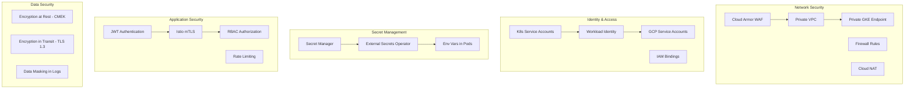

### Network Security

- **Private GKE Cluster:** Control plane accessible only via authorized networks
- **VPC:** Custom VPC with private subnets, no public IPs on nodes
- **Cloud NAT:** Outbound internet access for private nodes via static IP pool
- **Firewall Rules:** Default deny, explicit allow for required ports only
- **Cloud Armor:** WAF with OWASP top-10 rules, geo-blocking, rate limiting at edge

### Identity & Access Management

```yaml
# Workload Identity binding (Terraform)
resource "google_service_account_iam_member" "workload_identity" {
  service_account_id = google_service_account.order_service.name
  role               = "roles/iam.workloadIdentityUser"
  member             = "serviceAccount:${var.project_id}.svc.id.goog[instacommerce/order-service]"
}
```

- Each Kubernetes ServiceAccount is bound to a GCP Service Account via Workload Identity
- Least-privilege IAM roles: services only access the GCP resources they need
- No long-lived service account keys; all authentication is via Workload Identity tokens

### Secret Management Flow

```
Secret Manager → External Secrets Operator → Kubernetes Secret → Pod Env Vars
```

- Secrets are created in GCP Secret Manager (via Terraform)
- External Secrets Operator (ESO) syncs them into Kubernetes Secrets
- Pods consume secrets as environment variables or mounted files
- Automatic rotation supported via Secret Manager version policies

### Application Security Controls

| Control | Implementation |
|---|---|
| **Authentication** | JWT tokens (access + refresh), issued by user-service |
| **mTLS** | Istio PeerAuthentication `STRICT` mode for all mesh traffic |
| **Authorization** | Istio AuthorizationPolicy + application-level RBAC |
| **Rate Limiting** | Istio EnvoyFilter, 100 req/min per user for mutations |
| **Input Validation** | Bean Validation (Jakarta) on all DTOs |
| **CORS** | Configured at Istio Gateway level |
| **Security Headers** | X-Frame-Options, CSP, HSTS via Istio response headers |

---

## 10. Disaster Recovery

InstaCommerce is designed for high availability within a single GCP region with multi-zone redundancy.

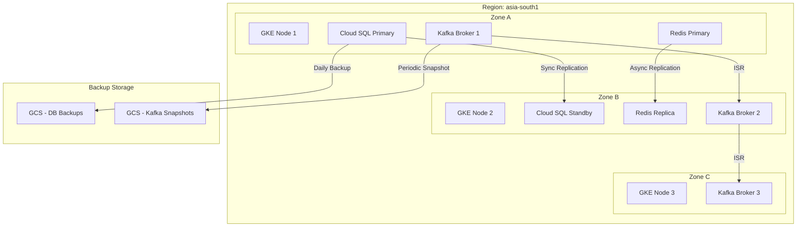

### Recovery Targets

| Component | RTO | RPO | Strategy |
|---|---|---|---|
| **GKE Cluster** | < 5 min | 0 | Multi-zone, auto-repair, auto-upgrade |
| **Cloud SQL** | < 1 min | 0 | Regional HA with automatic failover |
| **Redis** | < 30 sec | ~few sec | Standard HA tier with automatic failover |
| **Kafka** | < 1 min | 0 | 3 brokers, replication factor 3, min ISR 2 |
| **Application State** | Immediate | 0 | Stateless pods, horizontal scaling |

### Backup Strategy

| Resource | Schedule | Retention | Storage |
|---|---|---|---|
| Cloud SQL | Daily automated | 7 days (dev), 30 days (prod) | GCS (regional) |
| Cloud SQL PITR | Continuous WAL | 7 days | GCS |
| Kafka topics | Daily snapshot | 7 days | GCS |
| GCS data lake | Versioning enabled | 90 days | GCS (multi-regional) |
| Terraform state | Versioned bucket | Indefinite | GCS |
| ArgoCD config | Git repository | Indefinite | GitHub |

### Failover Procedures

1. **Cloud SQL failover:** Automatic — standby promoted within 60 seconds
2. **Redis failover:** Automatic — replica promoted by Memorystore
3. **Kafka broker failure:** Automatic — ISR leaders re-elected, partitions rebalanced
4. **Node failure:** GKE auto-repair replaces unhealthy nodes; pods rescheduled by scheduler
5. **Full zone outage:** GKE reschedules pods to surviving zones; Cloud SQL and Redis fail over automatically

---

## 11. Auto-Scaling Strategy

Scaling operates at both the pod level (HPA, event-driven) and the node level (Cluster Autoscaler).

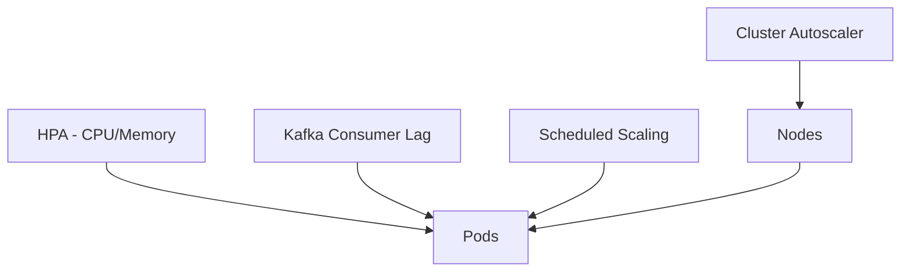

### Horizontal Pod Autoscaler (HPA)

```yaml
apiVersion: autoscaling/v2
kind: HorizontalPodAutoscaler
metadata:
  name: order-service-hpa
  namespace: instacommerce
spec:
  scaleTargetRef:
    apiVersion: apps/v1
    kind: Deployment
    name: order-service
  minReplicas: 3
  maxReplicas: 20
  metrics:
    - type: Resource
      resource:
        name: cpu
        target:
          type: Utilization
          averageUtilization: 65
    - type: Resource
      resource:
        name: memory
        target:
          type: Utilization
          averageUtilization: 75
  behavior:
    scaleUp:
      stabilizationWindowSeconds: 60
      policies:
        - type: Percent
          value: 50
          periodSeconds: 60
    scaleDown:
      stabilizationWindowSeconds: 300
      policies:
        - type: Percent
          value: 25
          periodSeconds: 120
```

### Event-Driven Scaling (KEDA)

```yaml
apiVersion: keda.sh/v1alpha1
kind: ScaledObject
metadata:
  name: event-processor-scaler
  namespace: instacommerce
spec:
  scaleTargetRef:
    name: event-processor
  minReplicaCount: 2
  maxReplicaCount: 15
  triggers:
    - type: kafka
      metadata:
        bootstrapServers: kafka-bootstrap.kafka:9092
        consumerGroup: event-processor-group
        topic: order-events
        lagThreshold: "100"
```

### Scheduled Scaling (CronHPA)

```yaml
# Scale up during peak hours (lunch & dinner)
apiVersion: autoscaling.k8s.io/v1alpha1
kind: CronHPA
metadata:
  name: peak-hours-scaling
  namespace: instacommerce
spec:
  scaleTargetRef:
    apiVersion: apps/v1
    kind: Deployment
    name: order-service
  crons:
    - schedule: "0 11 * * *"   # 11 AM — lunch ramp-up
      minReplicas: 8
      maxReplicas: 20
    - schedule: "0 15 * * *"   # 3 PM — lunch wind-down
      minReplicas: 3
      maxReplicas: 15
    - schedule: "0 18 * * *"   # 6 PM — dinner ramp-up
      minReplicas: 8
      maxReplicas: 20
    - schedule: "0 23 * * *"   # 11 PM — night wind-down
      minReplicas: 3
      maxReplicas: 10
```

### Cluster Autoscaler

```yaml
# GKE Cluster Autoscaler configuration (Terraform)
cluster_autoscaling {
  enabled = true
  resource_limits {
    resource_type = "cpu"
    minimum       = 12   # 3 nodes × 4 vCPU
    maximum       = 48   # 12 nodes × 4 vCPU
  }
  resource_limits {
    resource_type = "memory"
    minimum       = 48   # 3 nodes × 16 GB
    maximum       = 192  # 12 nodes × 16 GB
  }
  auto_provisioning_defaults {
    oauth_scopes = ["https://www.googleapis.com/auth/cloud-platform"]
    service_account = google_service_account.gke_nodes.email
  }
}
```

### Scaling Summary

| Component | Trigger | Min | Max | Cool-down |
|---|---|---|---|---|
| api-gateway | CPU 60% | 3 | 20 | 5 min |
| order-service | CPU 65% | 3 | 20 | 5 min |
| event-processor | Kafka lag > 100 | 2 | 15 | 3 min |
| delivery-service | CPU 65% | 3 | 15 | 5 min |
| inventory-service | CPU 70% | 3 | 12 | 5 min |
| Node pool (services) | Pod scheduling pressure | 3 | 12 | 10 min |
| Node pool (data) | Pod scheduling pressure | 3 | 6 | 10 min |

---

## Quick Reference

| Area | Technology |
|---|---|
| Cloud Provider | GCP |
| Container Orchestration | GKE (regional, private) |
| Service Mesh | Istio 1.20+ |
| IaC | Terraform 1.6+ |
| Package Manager | Helm 3 |
| GitOps | ArgoCD 2.9+ |
| CI | GitHub Actions |
| Database | Cloud SQL PostgreSQL 15 |
| Cache | Memorystore Redis 7 |
| Messaging | Kafka (Strimzi) 3.6+ |
| Workflow Engine | Temporal |
| Monitoring | Prometheus + Grafana |
| Tracing | OpenTelemetry + Tempo |
| Logging | Cloud Logging |
| ML Platform | Vertex AI |
| Data Warehouse | BigQuery |
| Secrets | Secret Manager + ESO |
| Autoscaling | HPA + KEDA + Cluster Autoscaler |

---

*Last updated: 2025*
