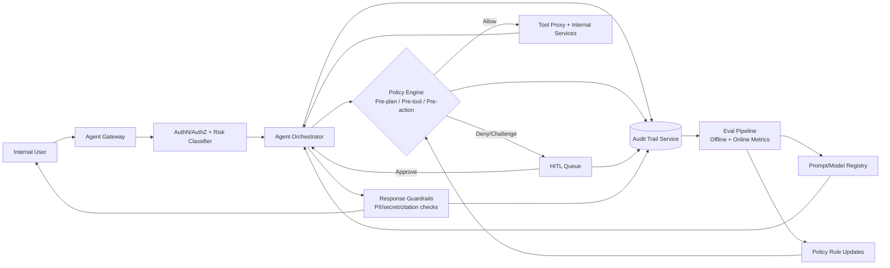

# Internal AI Agents Roadmap (Wave 2B)

**Scope:** Ops Copilot, Incident Copilot, Merchandiser Copilot, Fraud Analyst Copilot  
**Audience:** Engineering, SRE, Security, Risk, Compliance, Data, Product Ops  
**Goal:** Production-grade internal agent platform with enforceable governance, measurable quality, and human-in-the-loop controls.

---

## 1) Prioritized internal agent opportunities + integration points

### Prioritization rubric
- **Business impact (40%)**: MTTR, fraud loss reduction, margin uplift, operator productivity
- **Data/tool readiness (25%)**: existing APIs/events, runbooks, historical labeled data
- **Operational risk (20%)**: blast radius if wrong action is taken
- **Implementation effort (15%)**: integration complexity and policy requirements

| Priority | Agent | Primary outcomes | Core integration points | Release mode |
|---|---|---|---|---|
| **P0** | **Incident Copilot** | Reduce MTTR, improve triage consistency, automate diagnostics | `monitoring/` alerts (Prometheus/Grafana), OpenTelemetry traces, Kubernetes events, ArgoCD deployment history, service runbooks in `docs/`, Slack/Pager tooling | Shadow -> HITL execute |
| **P0** | **Fraud Analyst Copilot** | Faster fraud triage, reduced false positives, analyst case throughput | `fraud-detection-service`, `payment-service`, `order-service`, `wallet-loyalty-service`, `audit-trail-service`, BigQuery fraud features | Read-only -> HITL disposition |
| **P1** | **Ops Copilot** | Improve day-2 operations, change safety, toil reduction | `config-feature-flag-service`, ArgoCD app manifests, Helm values, service SLO dashboards, deployment metadata | Suggestion-first -> guarded actions |
| **P1** | **Merchandiser Copilot** | Better availability/margin decisions, faster campaign setup | `catalog-service`, `pricing-service`, `inventory-service`, `warehouse-service`, demand/elasticity outputs in `ml/` and `data-platform/` | Recommendations -> human approval |

### Initial high-value use-cases

#### Incident Copilot (P0)
1. Correlate alerts with recent deploy/config changes and likely culprit service.
2. Generate triage timeline from logs/metrics/traces with probable root causes.
3. Propose runbook steps; require approval for all write actions (rollback, flag flip, restart).

#### Fraud Analyst Copilot (P0)
1. Build case summary from transaction graph, device, velocity, chargeback history.
2. Recommend decision (`allow`, `step-up`, `block`) with evidence and confidence.
3. Auto-draft SAR/analyst notes and queue to reviewer for final disposition.

#### Ops Copilot (P1)
1. Explain current service health and recent SLO drift by domain/service.
2. Recommend safe canary/rollback plan with explicit risk assessment.
3. Draft config changes and rollout plans with policy checks before execution.

#### Merchandiser Copilot (P1)
1. Recommend assortment substitutions for low-stock/high-demand SKUs.
2. Suggest promo/pricing adjustments with guardrails (margin floor, stock cover).
3. Generate campaign drafts and expected uplift/risk before approval.

---

## 2) LLD: governance, eval framework, policy checks, auditability

### 2.1 Logical components

1. **Agent Gateway**
   - AuthN via identity-service JWT; AuthZ via RBAC scopes (`agent.read`, `agent.execute`, `agent.approve`).
   - Request normalization, tenant/team context injection, rate limits.
2. **Agent Orchestrator (LangGraph in ai-orchestrator-service)**
   - Plan -> tool selection -> reasoning -> response pipeline.
   - Model routing by risk tier and latency SLO.
3. **Policy Decision Point (PDP)**
   - Central policy engine for action allow/deny/challenge.
   - Evaluates user role, risk score, data classification, tool/action requested.
4. **Tool Proxy Layer**
   - Typed adapters to internal APIs/queues; default read-only.
   - Enforces per-agent allowlist and parameter schema validation.
5. **Eval Service**
   - Offline eval runner (golden sets + adversarial cases).
   - Online eval collector (human ratings, outcome labels, drift).
6. **HITL Control Plane**
   - Approval queues, escalation paths, SLA timers, dual-approval for high-risk actions.
7. **Audit Trail**
   - Immutable event log in `audit-trail-service` with hash-chained records and replay support.

### 2.2 Risk tiers and required controls

| Risk tier | Example actions | Required controls |
|---|---|---|
| **R0 (Low)** | Summaries, explanations, runbook retrieval | Output filtering + audit log |
| **R1 (Medium)** | Recommendations that influence analyst/operator decisions | Confidence threshold + citation requirement + reviewer acknowledgement |
| **R2 (High)** | Any config/deployment/payment/fraud disposition write | Explicit HITL approval + policy pass + dry-run simulation + rollback plan |
| **R3 (Critical)** | Broad-impact or financial/regulatory actions | Dual approval (Ops + Security/Risk), change window enforcement, break-glass logging |

### 2.3 Policy checks (enforced at runtime)

1. **Pre-plan checks**: user entitlement, purpose binding, session risk score.
2. **Pre-tool checks**: tool allowlist, input schema, data sensitivity guard.
3. **Pre-action checks**: write-action gate, environment restrictions (prod vs non-prod), blast-radius estimate.
4. **Pre-response checks**: PII/secret redaction, policy-safe phrasing, unsupported-claim suppression.
5. **Post-action checks**: verify outcome, attach evidence, create rollback ticket if partial failure.

### 2.4 Eval framework (release gates + continuous quality)

#### Offline (pre-release) gates
- **Task Success Rate** >= 85% on golden scenarios per agent domain.
- **Policy Violation Rate** <= 0.5%.
- **Critical Hallucination Rate** <= 1%.
- **Citation Coverage** >= 95% for factual/decision outputs.
- **Latency SLO**: p95 <= 7s (read-only), <= 20s (decision workflows).

#### Online (post-release) monitoring
- Decision acceptance/reversal rate by analysts/operators.
- MTTR delta (Incident Copilot), fraud loss/FP/FN deltas (Fraud Copilot), margin and stock-out deltas (Merch Copilot), change failure rate (Ops Copilot).
- Drift detection on prompts/models/tools and policy-deny spikes.

#### Promotion policy
- `dev -> shadow -> limited prod -> full prod` only after 2 consecutive weeks of gate pass.
- Automatic rollback to previous prompt/model/policy bundle on threshold breach.

### 2.5 Auditability design

For every interaction, persist:
- `request_id`, `agent_id`, `user_id`, `role`, `risk_tier`, `model_version`
- tool calls (name, params hash, result hash), policy decisions (rule id, outcome)
- approval metadata (approver, timestamp, decision rationale)
- output artifacts (response hash, citation ids)
- outcome status and follow-up actions (ticket id, rollback id)

Retention and controls:
- Immutable audit events with 1-year hot + 6-year cold retention for regulated workflows.
- Access via least-privilege roles; all audit access itself is audited.
- Daily integrity checks on hash chain; monthly replay drills.

---

## 3) Agent runtime with policy/eval feedback loop

---

## 4) Rollout strategy with risk controls and compliance guardrails

### Phase 0 (Weeks 0-4): Foundation
- Stand up Gateway, PDP, Tool Proxy, Eval Service, HITL queue, and audit schema.
- Define risk tiers, approval matrix, and policy bundle v1.
- Build golden datasets: incidents, fraud cases, ops changes, merchandising decisions.

### Phase 1 (Weeks 5-8): P0 shadow launch
- Launch Incident Copilot + Fraud Analyst Copilot in **shadow mode** (no direct actions).
- Compare copilot recommendations against human outcomes; collect disagreement labels.
- Exit criteria: offline/online gates met, no critical policy breaches.

### Phase 2 (Weeks 9-12): Controlled actioning
- Enable limited write actions behind HITL for pre-approved runbooks and fraud dispositions.
- Enforce dual approval for R3 and all financial-impacting decisions.
- Add automatic rollback hooks for config/deploy actions.

### Phase 3 (Weeks 13-18): Scale to Ops + Merchandising
- Roll out Ops Copilot and Merchandiser Copilot to pilot teams first.
- Expand tool access by policy, not by prompt; keep default deny on new tools.
- Run quarterly model risk review and policy red-team exercises.

### Mandatory risk controls
- **Kill switch:** global and per-agent immediate disable.
- **Separation of duties:** requester cannot self-approve high-risk actions.
- **Environment fencing:** prod actions blocked outside approved windows unless break-glass.
- **Blast-radius caps:** bounded by service/team/region and reversible change plans.
- **Fallback mode:** agent degraded to read-only on policy/eval outages.

### Compliance guardrails
- **Data protection:** PII minimization, tokenization/redaction in prompts/logs.
- **Regulated domains:** PCI-aware handling for payment/fraud contexts.
- **Traceability:** full decision provenance and immutable audit evidence.
- **Access governance:** least privilege, periodic access recertification, JIT elevation.
- **Model governance:** versioned prompts/models, signed releases, reproducible eval reports.

---

## Go/No-Go checklist before broad production

- [ ] All four agents mapped to approved tool allowlists and risk tiers.
- [ ] Offline + online eval gates green for 2 consecutive release windows.
- [ ] HITL SLAs operational with on-call and escalation ownership.
- [ ] Audit replay + integrity checks validated.
- [ ] Security, Risk, Compliance sign-offs recorded.
- [ ] Runbooks updated with rollback and incident response for agent failures.
