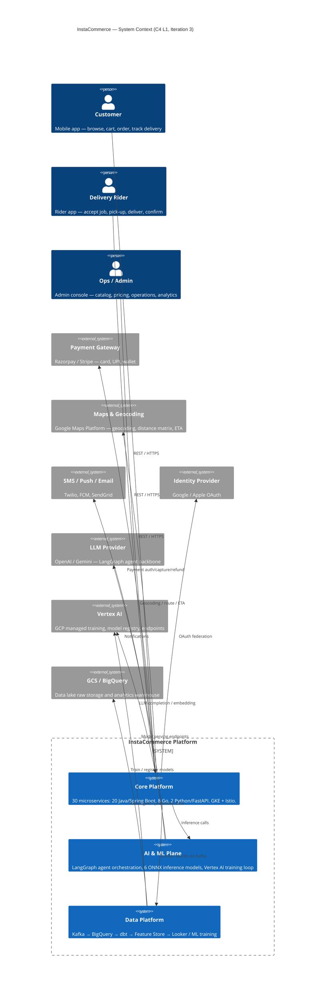
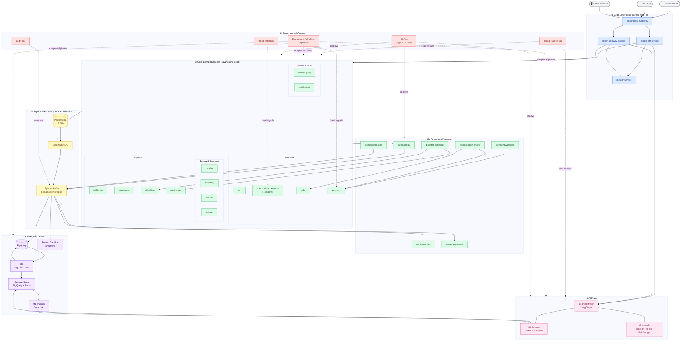
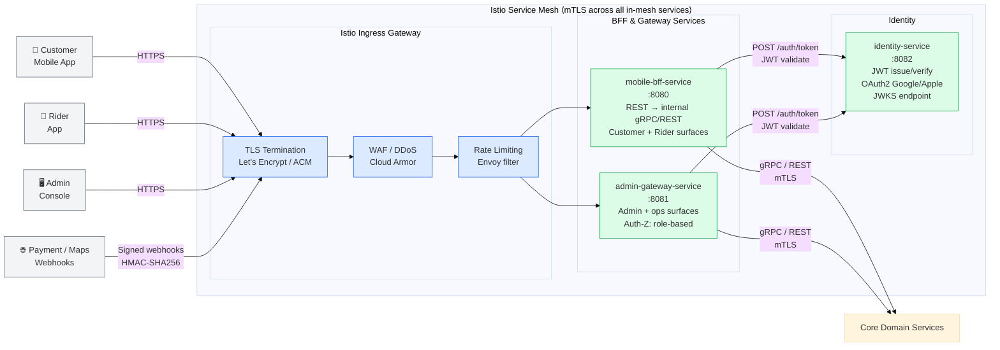
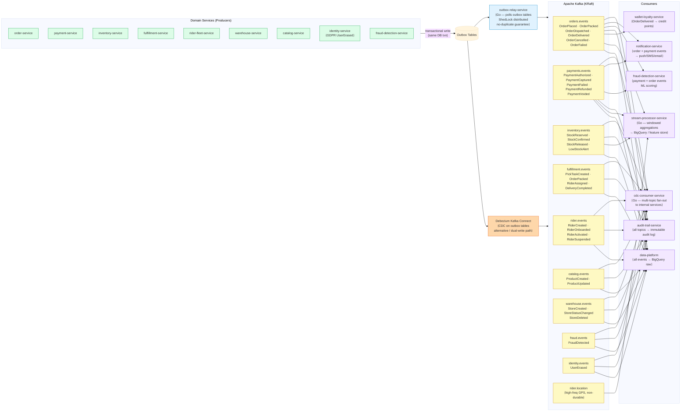
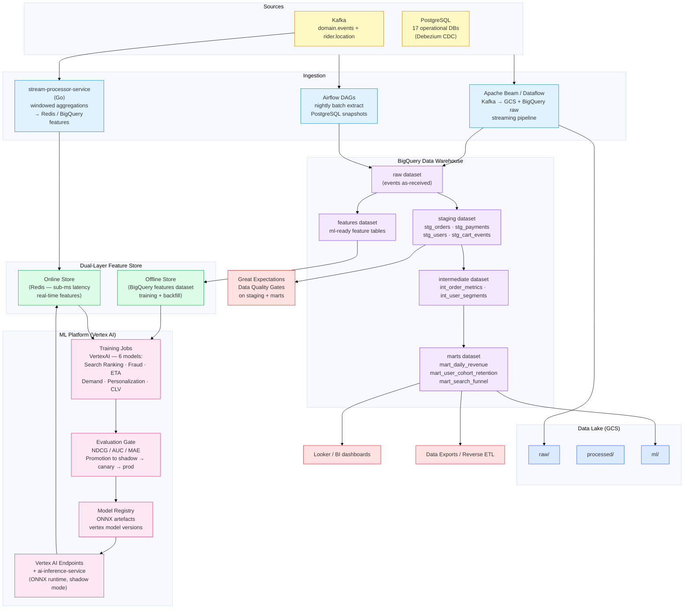
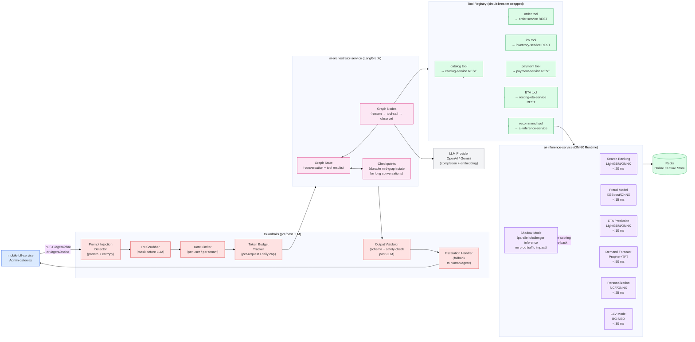
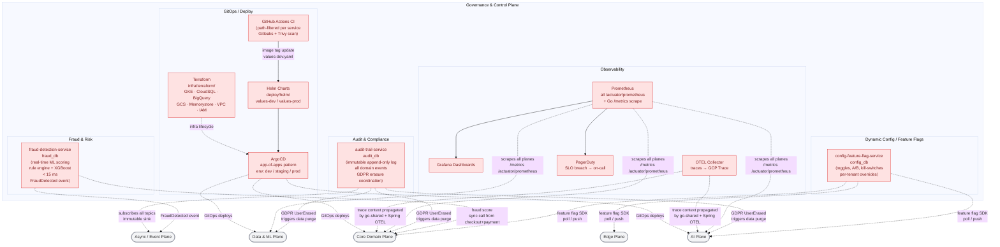

# InstaCommerce — Iteration 3: HLD & System-Context Diagrams

> **Version:** 3.0 (Iteration 3)
> **Date:** 2026-03-06
> **Author:** Principal Engineering Review
> **Status:** Living Document — Target Architecture
> **Audience:** CTO, Principal/Staff Engineers, SRE, Platform, Data/ML, AI
>
> **Relationship to existing HLD.md:** `HLD.md` (v1.0, 2025-01-15) covers the foundational
> container view and technology decisions. This document adds **Iteration-3-level precision**:
> a refreshed system context with the AI plane; decomposed boundary diagrams for each of the
> six architectural planes; annotated inter-plane flows; and a closed-loop data/ML/AI view
> reflecting the target q-commerce operating model. Both documents should be kept in sync
> as the platform evolves.

---

## Table of Contents

1. [System Context — C4 Level 1 (Refreshed)](#1-system-context--c4-level-1-refreshed)
2. [HLD Boundary Map — Six Planes](#2-hld-boundary-map--six-planes)
3. [Plane 1 — Edge Layer](#3-plane-1--edge-layer)
4. [Plane 2 — Core Domain Services](#4-plane-2--core-domain-services)
5. [Plane 3 — Async / Event Bus](#5-plane-3--async--event-bus)
6. [Plane 4 — Data & ML Pipeline](#6-plane-4--data--ml-pipeline)
7. [Plane 5 — AI Plane](#7-plane-5--ai-plane)
8. [Governance & Control Boundary](#8-governance--control-boundary)
9. [Boundary Definitions & Notes](#9-boundary-definitions--notes)
10. [Completed Work / Done vs. Needs More Work / Blockers](#10-completed-work--done-vs-needs-more-work--blockers)

---

## 1. System Context — C4 Level 1 (Refreshed)

This is the outermost view. The entire InstaCommerce platform is one system. External actors and
third-party systems are shown. The AI plane (LLM provider) and the ML serving backend (Vertex AI)
are surfaced as distinct external-or-internal boundaries because they have separate trust, cost,
and latency profiles.

> **Boundary note:** The AI Plane and Data Platform are logical sub-systems inside the GKE cluster.
> The LLM Provider is the only out-of-region, metered, non-idempotent external dependency — its
> outage or cost exceedance is a distinct operational risk separate from the payment gateway and
> maps dependencies.

---

## 2. HLD Boundary Map — Six Planes

This single-page overview shows how the six planes relate to each other. It is the "landscape" view
a principal engineer would sketch on a whiteboard. Detail for each plane follows in later diagrams.

> **Reading the diagram:** Solid arrows = primary data/call flows. Dashed arrows = control-plane
> cross-cuts that apply to multiple bounded contexts. The six numbered subgraphs correspond to
> the six planes detailed in §§ 3–8.

---

## 3. Plane 1 — Edge Layer

**Boundary definition:** Everything from the client TCP connection to the first authenticated
service call. Encompasses Istio ingress, mTLS policy enforcement, JWT validation, rate limiting,
and BFF protocol/contract adaptation. Nothing inside this boundary should hold business state.

> **Key constraints:**
> - The BFF owns protocol translation (REST ↔ internal gRPC) and payload shaping for mobile clients; it must not own business logic.
> - The admin gateway enforces RBAC at this layer before any downstream call.
> - Identity-service issues short-lived JWTs (15 min) with refresh tokens (7 days); JWKS rotation is the only key-management surface.
> - Cloud Armor sits upstream of Istio for volumetric DDoS; Envoy rate-limiting handles per-token/IP quotas inside the mesh.
> - Webhook ingress (payment gateway callbacks, maps async results) enters the same gateway but is routed to `payment-webhook-service` (Go) via a dedicated ingress rule.

---

## 4. Plane 2 — Core Domain Services

**Boundary definition:** All stateful business logic and its PostgreSQL databases. Grouped into four
sub-domains. Inter-service synchronous calls are gRPC (catalog, inventory, payment — proto-defined
in `contracts/`). All async side-effects use the Transactional Outbox pattern; no direct inter-service
Kafka writes from domain code.

```mermaid
%%{init: {"theme": "base"}}%%
flowchart TD
    classDef svc fill:#dcfce7,stroke:#16a34a,color:#14532d
    classDef db fill:#fef9c3,stroke:#ca8a04
    classDef go fill:#e0f2fe,stroke:#0284c7

    %% ── Browse & Discover ──────────────────────────────────────────
    subgraph BD["Browse & Discover"]
        CAT[catalog-service\ncatalog_db]:::svc
        INV[inventory-service\ninventory_db\n⟨gRPC: stock reserve/confirm/cancel⟩]:::svc
        SCH[search-service\nsearch_db\n⟨Elasticsearch-backed⟩]:::svc
        PRC[pricing-service\npricing_db\n⟨surge + AI dynamic price⟩]:::svc
    end

    %% ── Transact ────────────────────────────────────────────────────
    subgraph TX["Transact"]
        CRT[cart-service\ncart_db + Redis\n⟨session cart⟩]:::svc
        CHK[checkout-orchestrator-service\n⟨Temporal workflow / saga⟩\nno own DB — orchestration only]:::svc
        ORD[order-service\norder_db\n⟨state machine⟩]:::svc
        PAY[payment-service\npayment_db\n⟨gRPC: auth/capture/refund⟩]:::svc
    end

    %% ── Logistics ───────────────────────────────────────────────────
    subgraph LOG["Logistics"]
        FUL[fulfillment-service\nfulfillment_db\n⟨pick/pack/dispatch⟩]:::svc
        WHS[warehouse-service\nwarehouse_db\n⟨dark-store zone/slot config⟩]:::svc
        RFL[rider-fleet-service\nrider_db\n⟨availability/onboarding⟩]:::svc
        ETA[routing-eta-service\nrouting_db\n⟨ML-backed ETA⟩]:::svc
    end

    %% ── Go Logistics Ops ────────────────────────────────────────────
    subgraph GOOPS["Go Logistics Ops"]
        DIS[dispatch-optimizer-service\n⟨VRP / Hungarian algorithm⟩]:::go
        LOC[location-ingestion-service\n⟨high-freq rider GPS⟩]:::go
    end

    %% ── Growth & Trust ──────────────────────────────────────────────
    subgraph GT["Growth & Trust"]
        WAL[wallet-loyalty-service\nwallet_db]:::svc
        NOT[notification-service\nnotification_db\n⟨push/SMS/email⟩]:::svc
    end

    %% ── Go Payments Ops ─────────────────────────────────────────────
    subgraph GOPAY["Go Payment Ops"]
        PWH[payment-webhook-service\n⟨idempotent webhook ingestion⟩]:::go
        REC[reconciliation-engine\n⟨nightly/near-RT settlement⟩]:::go
    end

    %% Flows
    CRT -->|"reserve stock\ngRPC"| INV
    CRT -->|"price quote\nREST"| PRC
    CHK -->|"Temporal activity:\nreserve stock"| INV
    CHK -->|"Temporal activity:\nauthorise payment\ngRPC"| PAY
    CHK -->|"Temporal activity:\ncreate order"| ORD
    ORD -->|"fulfillment trigger\nevent"| FUL
    FUL -->|"assign rider\nevent"| RFL
    DIS -->|"optimise dispatch\nREST"| RFL
    DIS -->|"ETA input\nREST"| ETA
    LOC -->|"rider position\nKafka: rider.location"| RFL
    PWH -->|"payment callback\nREST"| PAY
    REC -->|"settlement match\nREST"| PAY & ORD
    ORD -->|"wallet credit on delivery"| WAL
    ORD & PAY & FUL & RFL -->|"outbox events\n→ Kafka"| OUTBOX[("Outbox Tables\n(per-service, transactional)")]:::db
```

> **Key constraints:**
> - `checkout-orchestrator-service` is a **pure saga coordinator** (Temporal workflow); it holds no business state of its own and calls downstream services as Temporal activities.
> - Every Kafka-bound side-effect from Java services is written into a **transactional outbox table** (same DB transaction as the domain write), then forwarded by `outbox-relay-service` (Go). No service writes directly to Kafka from domain code.
> - gRPC contracts for catalog, inventory, and payment are the canonical cross-service synchronous API surface (see `contracts/src/main/proto/`).
> - `dispatch-optimizer-service` and `location-ingestion-service` are Go services in the logistics plane; they interact with the Java fleet/ETA services over HTTP/REST.

---

## 5. Plane 3 — Async / Event Bus

**Boundary definition:** All durable, broker-mediated communication. The outbox-to-broker pipeline
is the only reliable path for eventual consistency across bounded contexts. Topics are named
`{domain}.events` by convention. Consumers own their consumer-group offset and must be idempotent.

> **Key constraints:**
> - The **outbox-relay-service** (Go, `ShedLock`-backed) is the primary forward path from domain DBs to Kafka. Debezium acts as a secondary/parallel CDC path for the data platform; having two paths to the broker for the same row is an **at-least-once delivery** guarantee but requires idempotent consumer logic.
> - `rider.location` is a high-volume, low-durability topic (location pings); it must be treated differently from domain-event topics (shorter retention, no guaranteed delivery SLA).
> - `audit-trail-service` subscribes to **all** topics as a fan-out consumer group; it must not be in the critical consumer-group path for any saga compensation.
> - Schema evolution is contract-first: additive changes stay on `v1`; breaking changes create a new `{Event}.v2.json` and a 90-day dual-publish window.

---

## 6. Plane 4 — Data & ML Pipeline

**Boundary definition:** Everything downstream of Kafka that is not a live transactional service.
This plane converts high-throughput event streams into analytical datasets, trained models, and
low-latency feature vectors. It owns BigQuery, GCS, dbt, Airflow, Apache Beam/Dataflow, the dual
Feature Store, Vertex AI training jobs, and the ONNX model artefacts consumed by the AI Plane.

> **Key constraints:**
> - The dbt **layer contract** is strict: `stg_` models rename and cast; `int_` models join and derive; `mart_` models are the only layer exposed to BI and ML consumers. Cross-layer shortcuts are a code smell.
> - The **dual feature store** (online: Redis, offline: BigQuery) means a feature definition change must be applied to both stores atomically or with an explicit backfill strategy — the `ml/feature_store/` directory owns the ingestion logic.
> - MLOps promotion gate (shadow → canary → production) lives in `ml/eval/`. PSI > 0.2 on any feature triggers automated retraining. Models are exported as ONNX before being served by `ai-inference-service` for sub-25 ms inference.
> - **Airflow** orchestrates batch DAGs; **Dataflow** (Beam) handles streaming; mixing them into a single DAG is an anti-pattern to avoid.
> - Great Expectations quality gates on `staging` and `marts` must block Airflow downstream steps on failure — they are not advisory-only.

---

## 7. Plane 5 — AI Plane

**Boundary definition:** The two Python/FastAPI services (`ai-orchestrator-service`,
`ai-inference-service`) plus the guardrail sub-system. This plane has three distinct trust zones:
(a) user-facing agent calls (LangGraph graph, external LLM); (b) internal ML inference (ONNX, no
external dependency); (c) control surfaces (guardrails, budgets, shadow mode). The LLM dependency
is the only synchronous, metered, non-deterministic external call in the entire platform.

> **Key constraints:**
> - **Guardrails are non-optional, in-path**: injection detection, PII masking, and token-budget checks run before any LLM call. Output validation and escalation run after. There is no bypass path.
> - The **circuit breaker** on every tool (failure threshold: 3 consecutive errors, reset: 30 s) prevents the agent graph from cascading a downstream service failure into LLM retry storms.
> - **ONNX inference** in `ai-inference-service` has no external network dependency; it is safe to call from checkout and real-time pricing paths. The LangGraph agent is only for conversational / higher-latency flows.
> - **Shadow mode** runs a challenger model in parallel against the production model on every request without affecting the response; PSI drift detected here triggers the MLOps retraining gate.
> - LangGraph **checkpoint persistence** (`app/graph/checkpoints.py`) enables resumable multi-turn conversations; checkpoints must be scoped per user/session to prevent cross-user state leakage.

---

## 8. Governance & Control Boundary

**Boundary definition:** Cross-cutting services and processes that enforce policy, safety, auditability,
and deployment correctness across all other planes. These services do not handle the happy path;
they are the guardrails that make the happy path trustworthy. Failure in this plane should degrade
gracefully (e.g., feature flags default to off; fraud scoring fails open with alert, not hard block).

> **Key constraints:**
> - `config-feature-flag-service` must be in the **fast path** for feature evaluation but **not** in the critical checkout path. Services should cache flag values locally (short TTL) and fail safe to the default when the flag service is unreachable.
> - `fraud-detection-service` is called synchronously from `checkout-orchestrator-service` and `payment-service`. It must respect the **< 15 ms p99** contract; if it times out, the saga must proceed with a risk-accepted flag, not a hard block (configurable via kill-switch).
> - `audit-trail-service` subscribes to all domain topics but must be in its own **isolated consumer group** — its lag must never affect other consumer groups or trigger back-pressure on producers.
> - The **GDPR erasure pipeline** is event-driven: `identity-service` publishes `UserErased` on `identity.events`; `audit-trail-service`, `order-service`, and the data platform all consume and execute field-level deletion. The AI Plane must also purge LangGraph checkpoint state for the user.
> - **Terraform modules** (`bigquery`, `cloudsql`, `dataflow`, `feature-store`, `gke`, `iam`, `memorystore`, `secret-manager`, `vpc`) are the source of truth for GCP resource configuration — never hand-edit cloud resources.
> - CI path filters in `.github/workflows/ci.yml` are the authoritative list of what gets built per PR. Adding a service requires updating the filter list, matrix, and any Go-to-Helm deploy-name mapping simultaneously.

---

## 9. Boundary Definitions & Notes

| Plane | What it owns | What crosses its boundary | Failure mode |
|---|---|---|---|
| **① Edge** | Protocol termination, JWT validation, rate limiting, BFF shaping | Authenticated REST/gRPC calls inbound; webhook ingress to Go handlers | Auth outage → 401 all requests; BFF crash → that surface dark |
| **② Core Domains** | Business state (PostgreSQL, 17 DBs), synchronous gRPC contracts, Temporal saga state | Outbox events outbound; gRPC calls to inventory/catalog/payment inbound | DB outage → that bounded context unavailable; Temporal handles saga compensation |
| **③ Async / Event Bus** | Kafka topics, Debezium CDC, outbox relay, consumer group offsets | Domain events inbound from outbox; enriched data outbound to data plane and audit | Consumer lag → eventual inconsistency; relay crash → events queue in outbox (durable) |
| **④ Data & ML** | BigQuery warehouse, dbt transformations, Feature Store, Vertex AI training, ONNX artefacts | Kafka events inbound; trained model artefacts outbound to AI plane; marts outbound to BI | Pipeline lag → stale features / stale models; quality gate failure → blocks downstream mart consumers |
| **⑤ AI Plane** | LangGraph agent state, ONNX model serving, guardrail policies, shadow mode results | BFF calls inbound; tool calls to core domain services; LLM API calls outbound; feature vectors from Feature Store | LLM outage → agent degraded (fallback to ONNX-only path); ONNX failure → feature unavailable |
| **⑥ Governance** | Feature flags, fraud rules, immutable audit log, observability scrape, GitOps state | Policy reads/pushes to all planes; event subscriptions to audit; alert routing to on-call | Flag service down → local cached defaults; fraud service timeout → proceed with risk flag |

### Cross-Cutting Concerns (apply to all planes)

- **mTLS everywhere inside the mesh**: Istio enforces STRICT mTLS policy; any plaintext service-to-service call is a policy violation.
- **OTEL trace propagation**: `go-shared` and Spring OTEL auto-instrumentation ensure that a single checkout request carries one `correlation_id` / trace ID across Java, Go, and Python services.
- **Secret management**: All credentials (DB passwords, Kafka credentials, LLM API keys) are stored in GCP Secret Manager (`infra/terraform/modules/secret-manager/`) and injected as environment variables at pod startup via Kubernetes External Secrets Operator. No secrets in Helm values files.
- **Schema ownership**: Each event type is owned by exactly one source service; no other service writes to a topic it doesn't own.

---

## 10. Completed Work / Done vs. Needs More Work / Blockers

### ✅ Completed

| Item | Status |
|---|---|
| System context diagram (C4 L1) refreshed with AI plane and LLM dependency | Done |
| Six-plane boundary map (HLD overview) | Done |
| Edge plane diagram with Istio, BFFs, identity | Done |
| Core domain services diagram with DB-per-service, gRPC contracts, Temporal saga, Go logistics ops | Done |
| Async/event bus diagram with full topic inventory, dual relay path, consumer fan-out | Done |
| Data & ML pipeline diagram with dbt layers, dual feature store, Vertex AI MLOps loop | Done |
| AI plane diagram with LangGraph, ONNX models, guardrails, shadow mode, circuit breakers | Done |
| Governance & control diagram with feature flags, fraud, audit, observability, GitOps | Done |
| Boundary definitions table | Done |
| Cross-cutting concerns note (mTLS, OTEL, secrets, schema ownership) | Done |

### ⚠️ Needs More Work

| Item | Gap | Suggested next step |
|---|---|---|
| **Temporal workflow detail** | The saga compensation paths (inventory release, payment void, rider unassign) are not shown in any diagram | Add a dedicated Temporal saga flow diagram (sequence or state-machine) to `docs/architecture/` |
| **gRPC service mesh topology** | The service communication matrix in `HLD.md §10` is prose; no diagram shows which services call which others synchronously | Generate a service dependency graph from Helm/config values |
| **Data mesh ownership** | dbt models don't yet have explicit domain ownership annotations (`meta.owner`); the data mesh boundary is aspirational | Add `meta: owner:` to all mart models; document the data product contract in `data-platform/dbt/` |
| **GDPR erasure pipeline** | UserErased event is defined; downstream per-service field purge logic is not yet documented or verified for all 17 DBs | Audit each service's erasure handler; create a runbook in `docs/reviews/` |
| **LLM cost/budget control** | Token budget tracker exists in `app/graph/budgets.py` but there is no infrastructure-level spend alert or circuit breaker on the LLM API call | Wire a GCP billing alert + a kill-switch feature flag to the ai-orchestrator-service |
| **Rider location topic SLA** | `rider.location` retention policy, compaction strategy, and consumer lag SLO are not documented anywhere | Add Kafka topic config (`retention.ms`, `segment.ms`) to the contracts README or a dedicated ops runbook |
| **Reconciliation engine scope** | `reconciliation-engine` (Go) purpose is clear but its interaction with external settlement files / bank feeds is not captured in any diagram | Add reconciliation flow to the payment plane or create a dedicated payment operations diagram |

### 🚧 Blockers / Questions for Principal Review

1. **Dual outbox relay path**: Both `outbox-relay-service` (Go, poll-based) and Debezium CDC are forwarding outbox rows to Kafka. This creates a **at-least-once delivery risk with potential duplicates** unless exactly one path is authoritative per table. Which is the primary path? Are consumers actually idempotent (DB unique constraint on `event_id`)?

2. **Checkout ownership ambiguity**: `checkout-orchestrator-service` uses Temporal; `cart-service` has checkout-related endpoints; `order-service` has order creation. The exact boundary between "cart checkout" and "order creation" is not drawn in code — it surfaced as a finding in Iteration 2. This needs an explicit ADR before a payment correctness incident.

3. **LLM provider dependency governance**: There is no SLA, fallback provider, or budget hard-stop for the LLM provider today. For a q-commerce checkout assist or fraud explanation use-case, LLM unavailability must not block order flow. An explicit "degrade to ONNX-only" policy needs to be codified in the guardrails config.

4. **Feature flag in critical path**: If `config-feature-flag-service` is queried synchronously on every checkout request, its p99 must be < 5 ms or be cached with a circuit breaker. Current service code does not show explicit local caching of evaluated flags. This is a latency and availability risk.

5. **AI inference service port / routing**: `ai-inference-service` (port 8000) and `ai-orchestrator-service` (port 8100) are both in-cluster. The Helm `values-dev.yaml` confirms they are deployed, but no Istio `VirtualService` or `DestinationRule` is visible in the review. Confirm mTLS policy applies to Python pods (requires Istio sidecar injection on the Python namespace).

---

*Generated by: Iteration 3 — Principal Engineering Review*
*Repo evidence: `settings.gradle.kts`, `docker-compose.yml`, `scripts/init-dbs.sql`, `contracts/README.md`, `deploy/helm/values-dev.yaml`, `ml/README.md`, `data-platform/README.md`, `monitoring/README.md`, `services/ai-orchestrator-service/app/`, `services/ai-inference-service/app/`, `services/go-shared/go.mod`, `infra/terraform/modules/`, `docs/architecture/HLD.md`*
