# InstaCommerce — Low-Level Design (LLD)

> **Platform**: Q-commerce (quick-commerce)
> **Architecture**: 30 microservices — 20 Java (Spring Boot), 2 Python (FastAPI), 8 Go
> **Messaging**: Apache Kafka (event-driven, outbox pattern)
> **Orchestration**: Temporal (saga / workflow engine)
> **Service Mesh**: Istio (mTLS STRICT)
> **Deployment**: Kubernetes (GKE) + ArgoCD GitOps + Helm

---

## Table of Contents

1. [Order State Machine](#1-order-state-machine)
2. [Payment State Machine](#2-payment-state-machine)
3. [Checkout Saga (Temporal Workflow)](#3-checkout-saga-temporal-workflow)
4. [Fulfillment Pipeline](#4-fulfillment-pipeline)
5. [Authentication & Authorization Flow](#5-authentication--authorization-flow)
6. [Kafka Event Flow](#6-kafka-event-flow)
7. [Class Diagrams — Key Domain Models](#7-class-diagrams--key-domain-models)
8. [Database Schema Overview](#8-database-schema-overview)
9. [AI / ML Pipeline](#9-ai--ml-pipeline)
10. [Go Service Architectures](#10-go-service-architectures)
11. [Notification Channel Routing](#11-notification-channel-routing)
12. [Feature Flag Evaluation Flow](#12-feature-flag-evaluation-flow)
13. [Fraud Detection Pipeline](#13-fraud-detection-pipeline)
14. [Wallet & Loyalty Flow](#14-wallet--loyalty-flow)

---

## 1. Order State Machine

Every order progresses through a well-defined set of states. Transitions are persisted
in the `order_status_history` table with the actor and an optional note.

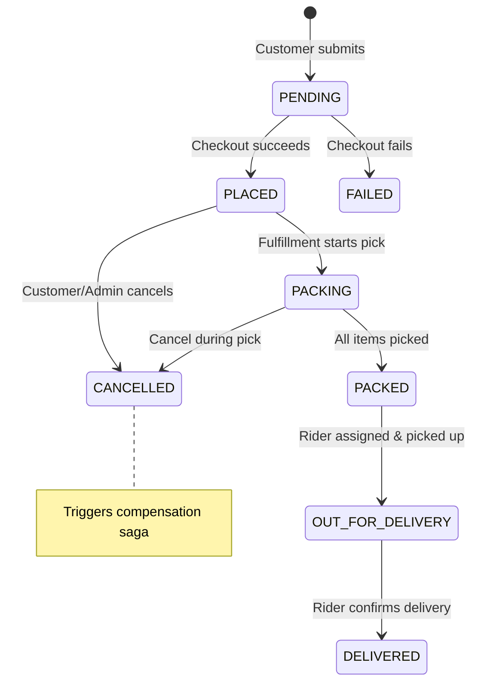
```mermaid
stateDiagram-v2
    [*] --> PENDING: Customer submits
    PENDING --> PLACED: Checkout succeeds
    PENDING --> FAILED: Checkout fails
    PLACED --> PACKING: Fulfillment starts pick
    PACKING --> PACKED: All items picked
    PACKED --> OUT_FOR_DELIVERY: Rider assigned & picked up
    OUT_FOR_DELIVERY --> DELIVERED: Rider confirms delivery
    PLACED --> CANCELLED: Customer/Admin cancels
    PACKING --> CANCELLED: Cancel during pick
    note right of CANCELLED: Triggers compensation saga
```

### Transition Rules

| From               | To                 | Trigger                          |
|--------------------|--------------------|----------------------------------|
| `PENDING`          | `PLACED`           | Temporal checkout workflow completes |
| `PENDING`          | `FAILED`           | Payment auth fails / stock unavailable |
| `PLACED`           | `PACKING`          | Fulfillment service creates PickTask |
| `PACKING`          | `PACKED`           | All items picked (or substituted) |
| `PACKED`           | `OUT_FOR_DELIVERY`  | Dispatch optimizer assigns rider  |
| `OUT_FOR_DELIVERY` | `DELIVERED`         | Rider confirms via mobile-bff     |
| `PLACED`/`PACKING` | `CANCELLED`        | Customer or admin cancellation     |

Each transition emits an event to the `orders.events` Kafka topic via the outbox pattern.

---

## 2. Payment State Machine

Payments follow a two-phase capture model (authorize first, capture on delivery).

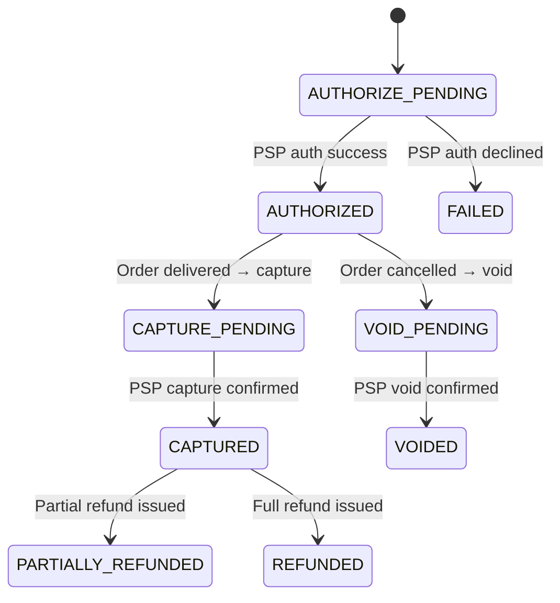
```mermaid
stateDiagram-v2
    [*] --> AUTHORIZE_PENDING
    AUTHORIZE_PENDING --> AUTHORIZED: PSP auth success
    AUTHORIZE_PENDING --> FAILED: PSP auth declined
    AUTHORIZED --> CAPTURE_PENDING: Order delivered → capture
    CAPTURE_PENDING --> CAPTURED: PSP capture confirmed
    AUTHORIZED --> VOID_PENDING: Order cancelled → void
    VOID_PENDING --> VOIDED: PSP void confirmed
    CAPTURED --> PARTIALLY_REFUNDED: Partial refund issued
    CAPTURED --> REFUNDED: Full refund issued
```

### Key Invariants

- **Idempotency**: Every authorize, capture, void, and refund carries an `idempotency_key`.
- **Optimistic Locking**: `version` column prevents concurrent state mutations.
- **Double-Entry Ledger**: Every state change writes a `DEBIT` or `CREDIT` entry to the `ledger_entries` table.

---

## 3. Checkout Saga (Temporal Workflow)

The `checkout-orchestrator-service` drives the checkout as a Temporal workflow with
compensating activities. Each activity is idempotent.

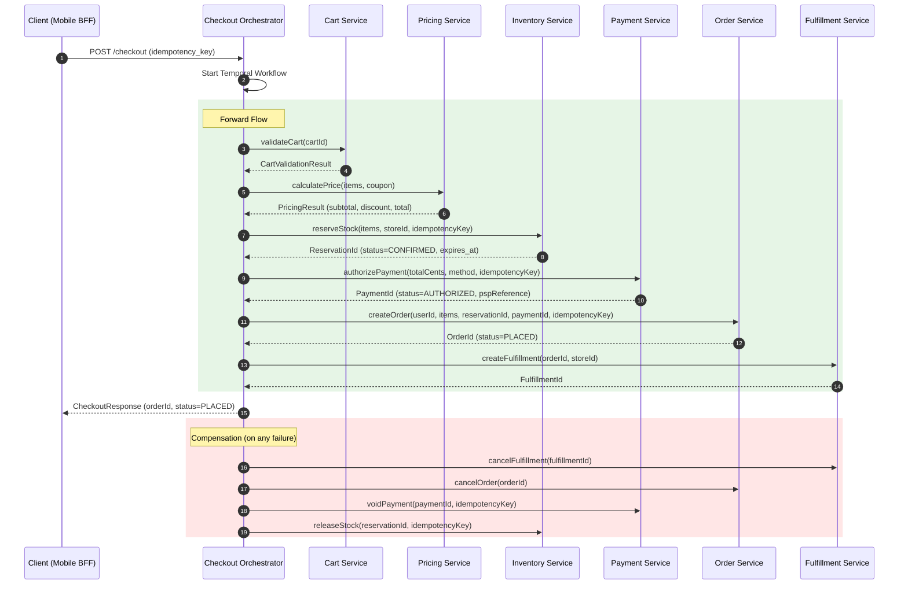
```mermaid
sequenceDiagram
    autonumber
    participant C as Client (Mobile BFF)
    participant CO as Checkout Orchestrator
    participant CS as Cart Service
    participant PS as Pricing Service
    participant IS as Inventory Service
    participant PY as Payment Service
    participant OS as Order Service
    participant FS as Fulfillment Service

    C->>CO: POST /checkout (idempotency_key)
    CO->>CO: Start Temporal Workflow

    rect rgb(230,245,230)
        Note over CO: Forward Flow
        CO->>CS: validateCart(cartId)
        CS-->>CO: CartValidationResult
        CO->>PS: calculatePrice(items, coupon)
        PS-->>CO: PricingResult (subtotal, discount, total)
        CO->>IS: reserveStock(items, storeId, idempotencyKey)
        IS-->>CO: ReservationId (status=CONFIRMED, expires_at)
        CO->>PY: authorizePayment(totalCents, method, idempotencyKey)
        PY-->>CO: PaymentId (status=AUTHORIZED, pspReference)
        CO->>OS: createOrder(userId, items, reservationId, paymentId, idempotencyKey)
        OS-->>CO: OrderId (status=PLACED)
        CO->>FS: createFulfillment(orderId, storeId)
        FS-->>CO: FulfillmentId
    end

    CO-->>C: CheckoutResponse (orderId, status=PLACED)

    rect rgb(255,230,230)
        Note over CO: Compensation (on any failure)
        CO->>FS: cancelFulfillment(fulfillmentId)
        CO->>OS: cancelOrder(orderId)
        CO->>PY: voidPayment(paymentId, idempotencyKey)
        CO->>IS: releaseStock(reservationId, idempotencyKey)
    end
```

### Idempotency Key Handling

1. The client generates a UUID `idempotency_key` and passes it with the checkout request.
2. The orchestrator forwards this key to inventory reservation, payment authorization, and order creation.
3. Each downstream service stores the key in a unique-constrained column. Duplicate requests return the existing result instead of creating a new resource.
4. Temporal's built-in deduplication prevents duplicate workflow executions for the same workflow ID (derived from the idempotency key).

### Compensation Order

Compensations execute in **reverse order** (last-created resource is cleaned up first). Parallel compensation is disabled to ensure strict ordering and avoid race conditions.

---

## 4. Fulfillment Pipeline

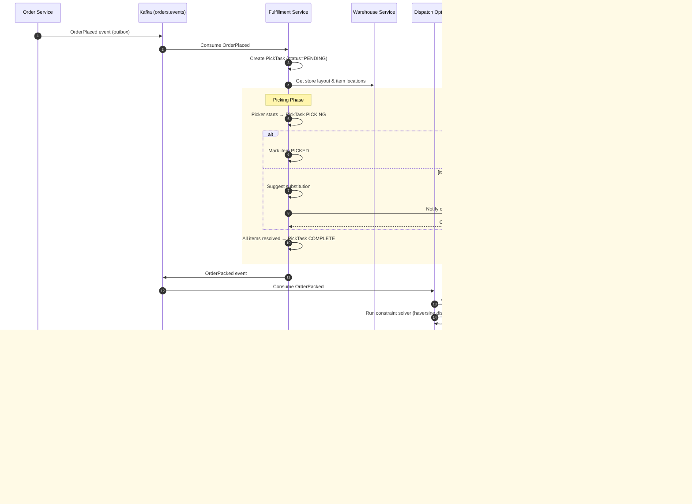
```mermaid
sequenceDiagram
    autonumber
    participant OS as Order Service
    participant K as Kafka (orders.events)
    participant FS as Fulfillment Service
    participant WH as Warehouse Service
    participant DO as Dispatch Optimizer
    participant RF as Rider Fleet Service
    participant LI as Location Ingestion
    participant NS as Notification Service

    OS->>K: OrderPlaced event (outbox)
    K->>FS: Consume OrderPlaced
    FS->>FS: Create PickTask (status=PENDING)
    FS->>WH: Get store layout & item locations

    rect rgb(255,250,230)
        Note over FS: Picking Phase
        FS->>FS: Picker starts → PickTask PICKING
        alt Item available
            FS->>FS: Mark item PICKED
        else Item unavailable
            FS->>FS: Suggest substitution
            FS->>NS: Notify customer (substitution approval)
            NS-->>FS: Customer approves/rejects
        end
        FS->>FS: All items resolved → PickTask COMPLETE
    end

    FS->>K: OrderPacked event
    K->>DO: Consume OrderPacked
    DO->>RF: Get available riders (zone, capacity)
    DO->>DO: Run constraint solver (haversine distance, zone match, capacity)
    DO->>RF: Assign rider to order

    RF->>K: RiderAssigned event
    K->>FS: Consume RiderAssigned
    FS->>FS: Update status → OUT_FOR_DELIVERY

    LI->>K: rider.location.updates (GPS pings)
    K->>RF: Track rider location

    RF->>K: DeliveryCompleted event
    K->>FS: Consume DeliveryCompleted → status DELIVERED
    K->>OS: Consume DeliveryCompleted → order DELIVERED
    K->>NS: Consume DeliveryCompleted → notify customer
```

### Substitution Logic

When an item is unavailable during picking:
1. The system suggests a substitute from the same category with a similar price.
2. The customer is notified via push notification.
3. If the customer approves, the order item is updated; if rejected, the item is removed and the price recalculated.
4. Payment capture amount adjusts to reflect the final basket.

---

## 5. Authentication & Authorization Flow

### 5.1 JWT Token Lifecycle

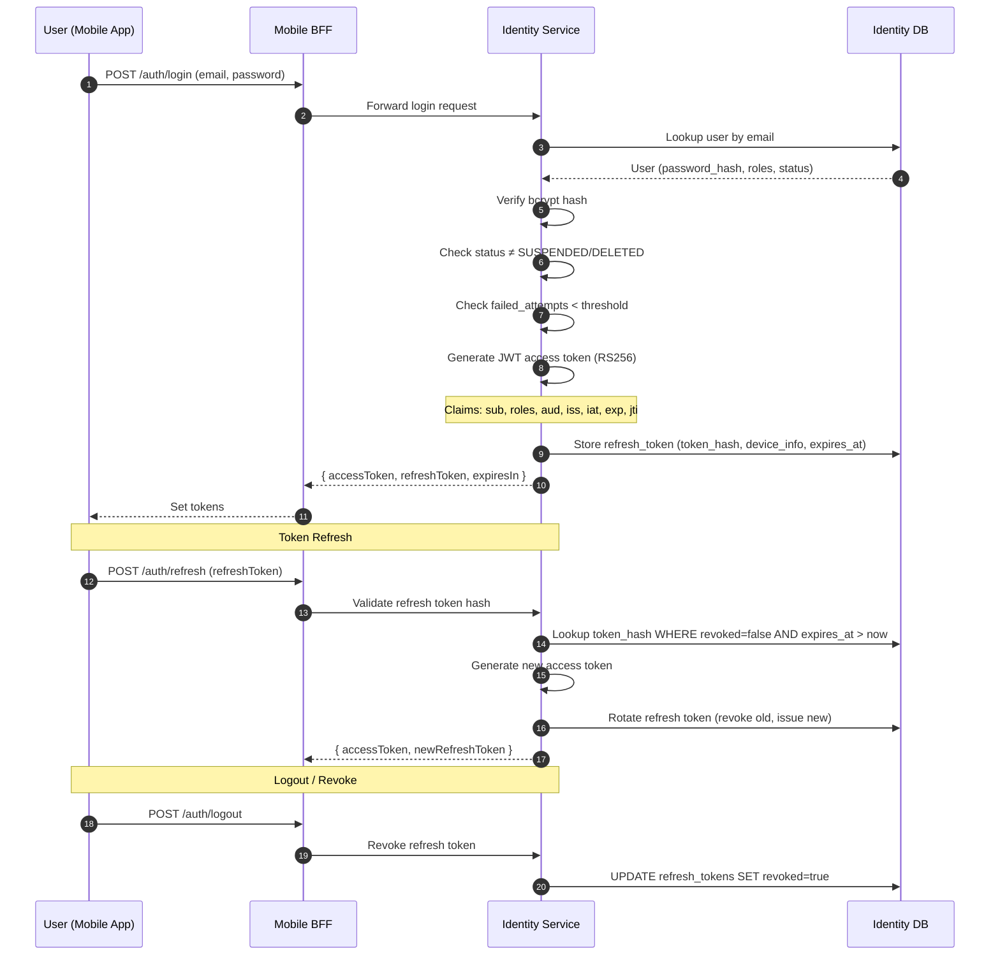
```mermaid
sequenceDiagram
    autonumber
    participant U as User (Mobile App)
    participant BFF as Mobile BFF
    participant ID as Identity Service
    participant DB as Identity DB

    U->>BFF: POST /auth/login (email, password)
    BFF->>ID: Forward login request
    ID->>DB: Lookup user by email
    DB-->>ID: User (password_hash, roles, status)
    ID->>ID: Verify bcrypt hash
    ID->>ID: Check status ≠ SUSPENDED/DELETED
    ID->>ID: Check failed_attempts < threshold
    ID->>ID: Generate JWT access token (RS256)
    Note over ID: Claims: sub, roles, aud, iss, iat, exp, jti
    ID->>DB: Store refresh_token (token_hash, device_info, expires_at)
    ID-->>BFF: { accessToken, refreshToken, expiresIn }
    BFF-->>U: Set tokens

    Note over U,ID: Token Refresh
    U->>BFF: POST /auth/refresh (refreshToken)
    BFF->>ID: Validate refresh token hash
    ID->>DB: Lookup token_hash WHERE revoked=false AND expires_at > now
    ID->>ID: Generate new access token
    ID->>DB: Rotate refresh token (revoke old, issue new)
    ID-->>BFF: { accessToken, newRefreshToken }

    Note over U,ID: Logout / Revoke
    U->>BFF: POST /auth/logout
    BFF->>ID: Revoke refresh token
    ID->>DB: UPDATE refresh_tokens SET revoked=true
```

### 5.2 Service-to-Service Authentication

Internal services authenticate using shared headers validated by `InternalServiceAuthFilter`:

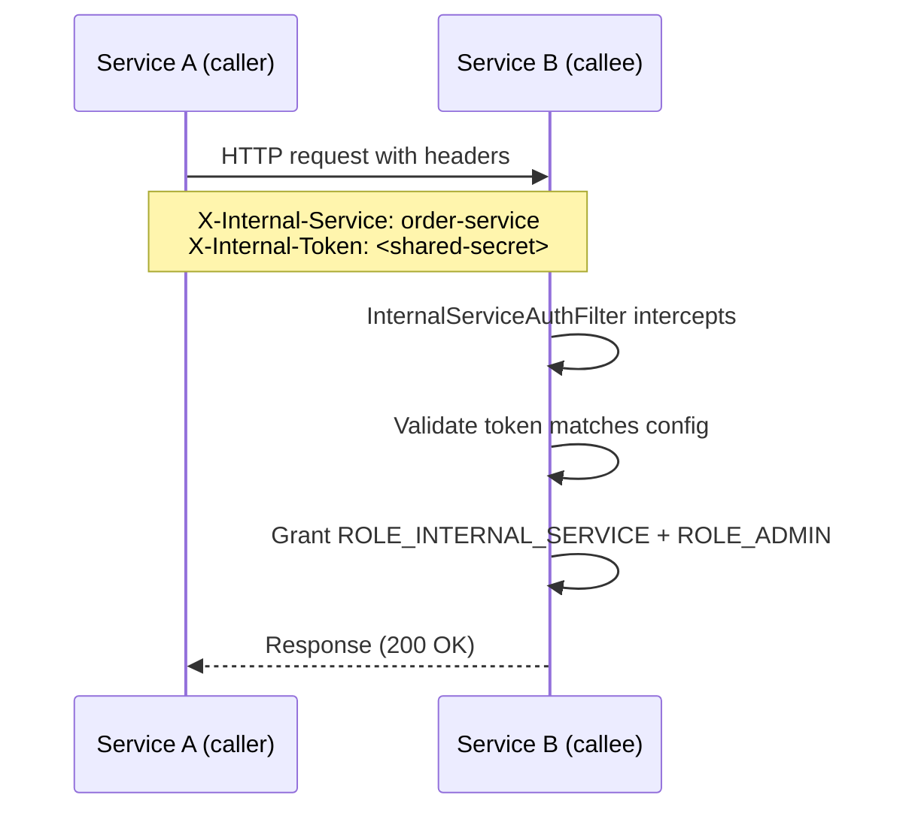
```mermaid
sequenceDiagram
    participant SA as Service A (caller)
    participant SB as Service B (callee)

    SA->>SB: HTTP request with headers
    Note over SA,SB: X-Internal-Service: order-service<br/>X-Internal-Token: <shared-secret>
    SB->>SB: InternalServiceAuthFilter intercepts
    SB->>SB: Validate token matches config
    SB->>SB: Grant ROLE_INTERNAL_SERVICE + ROLE_ADMIN
    SB-->>SA: Response (200 OK)
```

### 5.3 Istio mTLS + RequestAuthentication

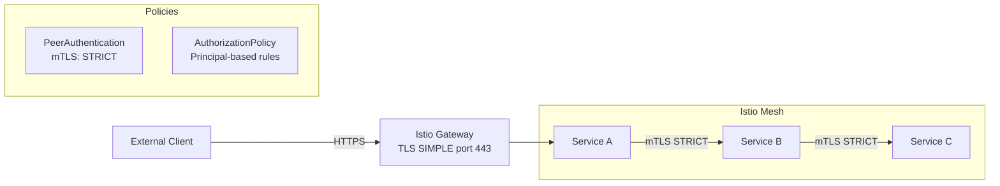
```mermaid
flowchart LR
    subgraph Istio Mesh
        A[Service A] -->|mTLS STRICT| B[Service B]
        B -->|mTLS STRICT| C[Service C]
    end

    Gateway[Istio Gateway<br/>TLS SIMPLE port 443] --> A
    Client[External Client] -->|HTTPS| Gateway

    subgraph Policies
        PA[PeerAuthentication<br/>mTLS: STRICT]
        AP[AuthorizationPolicy<br/>Principal-based rules]
    end
```

**Security layers:**
1. **External → Gateway**: TLS termination at Istio Ingress Gateway (certificate: `instacommerce-tls`).
2. **Gateway → Service**: Istio injects mTLS sidecar proxies; `PeerAuthentication` enforces `STRICT` mode.
3. **Service → Service**: All in-mesh communication is mTLS-encrypted. `AuthorizationPolicy` resources restrict which principals (services) can call which endpoints.

---

## 6. Kafka Event Flow

### 6.1 Topic Map

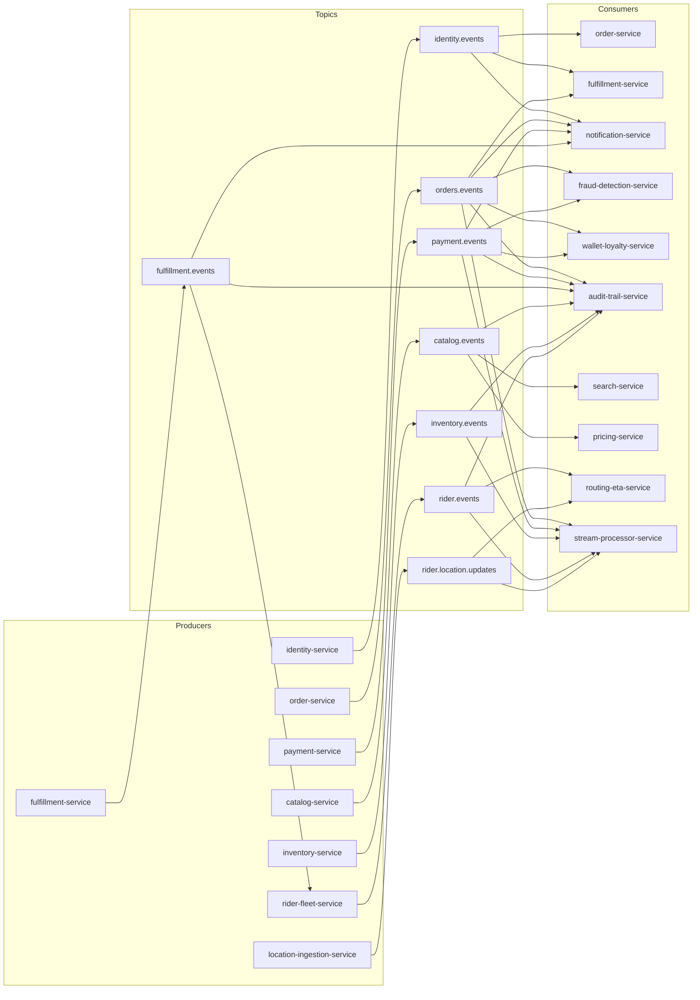
```mermaid
flowchart LR
    subgraph Producers
        IDS[identity-service]
        OS[order-service]
        PYS[payment-service]
        FS[fulfillment-service]
        CS[catalog-service]
        IS[inventory-service]
        RFS[rider-fleet-service]
        LI[location-ingestion-service]
    end

    subgraph Topics
        T1[identity.events]
        T2[orders.events]
        T3[payment.events]
        T4[fulfillment.events]
        T5[catalog.events]
        T6[inventory.events]
        T7[rider.events]
        T8[rider.location.updates]
    end

    subgraph Consumers
        OS2[order-service]
        FS2[fulfillment-service]
        NS[notification-service]
        FD[fraud-detection-service]
        WL[wallet-loyalty-service]
        AT[audit-trail-service]
        SS[search-service]
        PS[pricing-service]
        RE[routing-eta-service]
        SP[stream-processor-service]
    end

    IDS --> T1
    OS --> T2
    PYS --> T3
    FS --> T4
    CS --> T5
    IS --> T6
    RFS --> T7
    LI --> T8

    T1 --> OS2
    T1 --> FS2
    T1 --> NS

    T2 --> FS2
    T2 --> NS
    T2 --> FD
    T2 --> WL
    T2 --> AT
    T2 --> SP

    T3 --> NS
    T3 --> FD
    T3 --> WL
    T3 --> AT
    T3 --> SP

    T4 --> NS
    T4 --> RFS
    T4 --> AT

    T5 --> SS
    T5 --> PS
    T5 --> AT

    T6 --> AT
    T6 --> SP

    T7 --> RE
    T7 --> AT
    T7 --> SP

    T8 --> RE
    T8 --> SP
```

### 6.2 Topic Details

| Topic                    | Producer              | Consumers                                                | Key Events                                                |
|--------------------------|-----------------------|----------------------------------------------------------|-----------------------------------------------------------|
| `identity.events`        | identity-service      | order-service, fulfillment-service, notification-service | UserCreated, UserUpdated, UserDeleted (GDPR erasure)       |
| `orders.events`          | order-service         | fulfillment, notification, fraud-detection, wallet-loyalty, audit-trail, stream-processor | OrderPlaced, OrderCancelled, OrderDelivered, OrderFailed   |
| `payment.events`         | payment-service       | notification, fraud-detection, wallet-loyalty, audit-trail, stream-processor | PaymentAuthorized, PaymentCaptured, PaymentRefunded        |
| `fulfillment.events`     | fulfillment-service   | notification, rider-fleet, audit-trail                   | PickStarted, PickCompleted, OrderPacked, OrderDispatched   |
| `catalog.events`         | catalog-service       | search-service, pricing-service, audit-trail             | ProductCreated, ProductUpdated, PriceChanged, CouponCreated |
| `inventory.events`       | inventory-service     | audit-trail, stream-processor                            | StockAdjusted, ReservationCreated, ReservationReleased     |
| `rider.events`           | rider-fleet-service   | routing-eta, audit-trail, stream-processor               | RiderAssigned, RiderAvailable, DeliveryCompleted           |
| `rider.location.updates` | location-ingestion    | routing-eta, stream-processor                            | GPS pings (rider_id, lat, lng, speed, heading, battery)    |

### 6.3 Dead Letter Topics

Every topic has an auto-generated `.DLT` suffix (e.g., `orders.events.DLT`). Failed messages are routed to the DLT after the configured retry count is exhausted, enabling offline inspection and replay.

### 6.4 Outbox Pattern

All Java services write events to a local `outbox_events` table within the same database transaction that mutates domain state. The Go-based `outbox-relay-service` polls this table and publishes events to Kafka, guaranteeing at-least-once delivery.

---

## 7. Class Diagrams — Key Domain Models

### 7.1 Order Aggregate

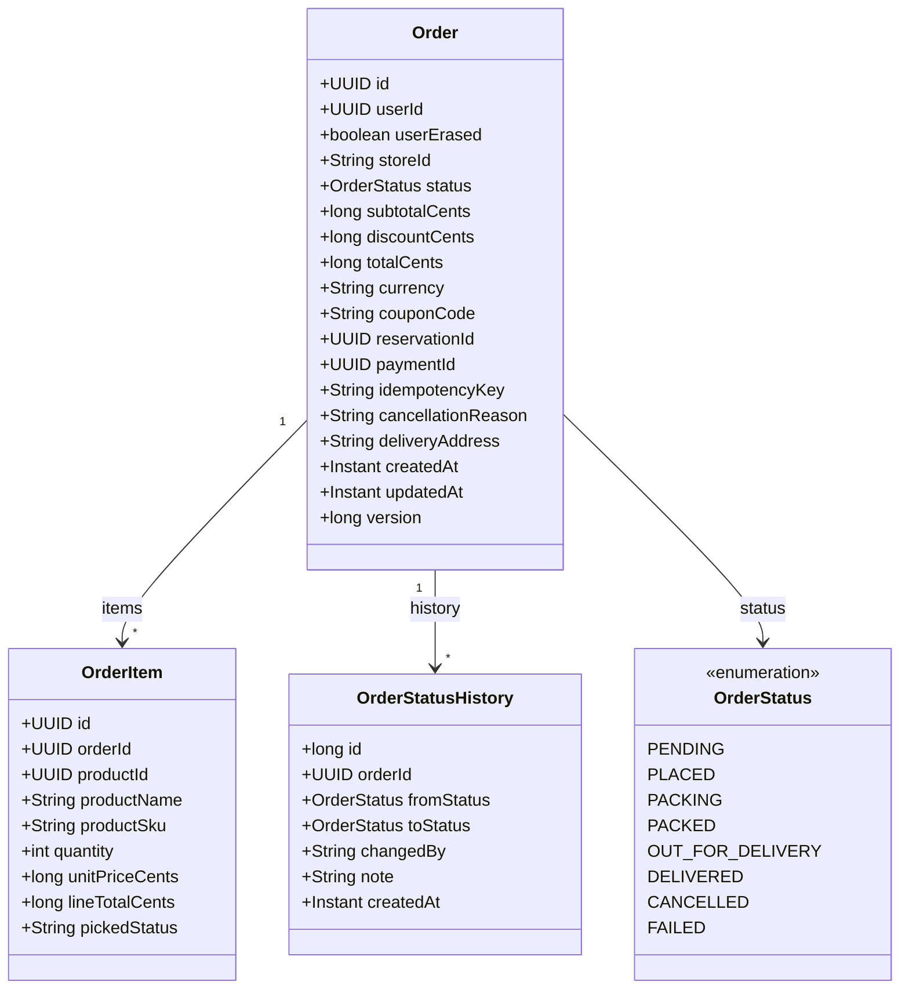
```mermaid
classDiagram
    class Order {
        +UUID id
        +UUID userId
        +boolean userErased
        +String storeId
        +OrderStatus status
        +long subtotalCents
        +long discountCents
        +long totalCents
        +String currency
        +String couponCode
        +UUID reservationId
        +UUID paymentId
        +String idempotencyKey
        +String cancellationReason
        +String deliveryAddress
        +Instant createdAt
        +Instant updatedAt
        +long version
    }

    class OrderItem {
        +UUID id
        +UUID orderId
        +UUID productId
        +String productName
        +String productSku
        +int quantity
        +long unitPriceCents
        +long lineTotalCents
        +String pickedStatus
    }

    class OrderStatusHistory {
        +long id
        +UUID orderId
        +OrderStatus fromStatus
        +OrderStatus toStatus
        +String changedBy
        +String note
        +Instant createdAt
    }

    class OrderStatus {
        <<enumeration>>
        PENDING
        PLACED
        PACKING
        PACKED
        OUT_FOR_DELIVERY
        DELIVERED
        CANCELLED
        FAILED
    }

    Order "1" --> "*" OrderItem : items
    Order "1" --> "*" OrderStatusHistory : history
    Order --> OrderStatus : status
```

### 7.2 Payment Aggregate

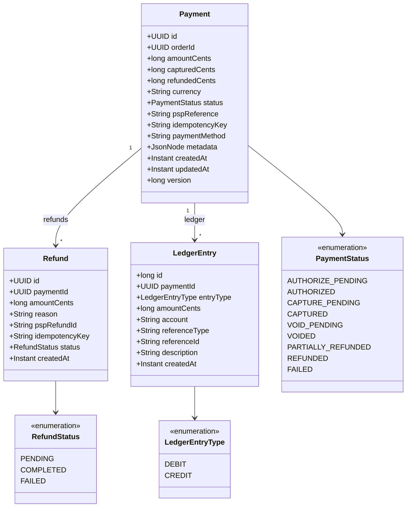
```mermaid
classDiagram
    class Payment {
        +UUID id
        +UUID orderId
        +long amountCents
        +long capturedCents
        +long refundedCents
        +String currency
        +PaymentStatus status
        +String pspReference
        +String idempotencyKey
        +String paymentMethod
        +JsonNode metadata
        +Instant createdAt
        +Instant updatedAt
        +long version
    }

    class Refund {
        +UUID id
        +UUID paymentId
        +long amountCents
        +String reason
        +String pspRefundId
        +String idempotencyKey
        +RefundStatus status
        +Instant createdAt
    }

    class LedgerEntry {
        +long id
        +UUID paymentId
        +LedgerEntryType entryType
        +long amountCents
        +String account
        +String referenceType
        +String referenceId
        +String description
        +Instant createdAt
    }

    class PaymentStatus {
        <<enumeration>>
        AUTHORIZE_PENDING
        AUTHORIZED
        CAPTURE_PENDING
        CAPTURED
        VOID_PENDING
        VOIDED
        PARTIALLY_REFUNDED
        REFUNDED
        FAILED
    }

    class RefundStatus {
        <<enumeration>>
        PENDING
        COMPLETED
        FAILED
    }

    class LedgerEntryType {
        <<enumeration>>
        DEBIT
        CREDIT
    }

    Payment "1" --> "*" Refund : refunds
    Payment "1" --> "*" LedgerEntry : ledger
    Payment --> PaymentStatus
    Refund --> RefundStatus
    LedgerEntry --> LedgerEntryType
```

### 7.3 Inventory

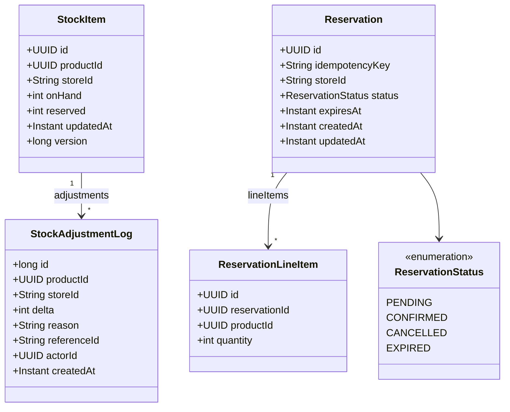
```mermaid
classDiagram
    class StockItem {
        +UUID id
        +UUID productId
        +String storeId
        +int onHand
        +int reserved
        +Instant updatedAt
        +long version
    }

    class Reservation {
        +UUID id
        +String idempotencyKey
        +String storeId
        +ReservationStatus status
        +Instant expiresAt
        +Instant createdAt
        +Instant updatedAt
    }

    class ReservationLineItem {
        +UUID id
        +UUID reservationId
        +UUID productId
        +int quantity
    }

    class StockAdjustmentLog {
        +long id
        +UUID productId
        +String storeId
        +int delta
        +String reason
        +String referenceId
        +UUID actorId
        +Instant createdAt
    }

    class ReservationStatus {
        <<enumeration>>
        PENDING
        CONFIRMED
        CANCELLED
        EXPIRED
    }

    Reservation "1" --> "*" ReservationLineItem : lineItems
    StockItem "1" --> "*" StockAdjustmentLog : adjustments
    Reservation --> ReservationStatus
```

### 7.4 User (Identity)

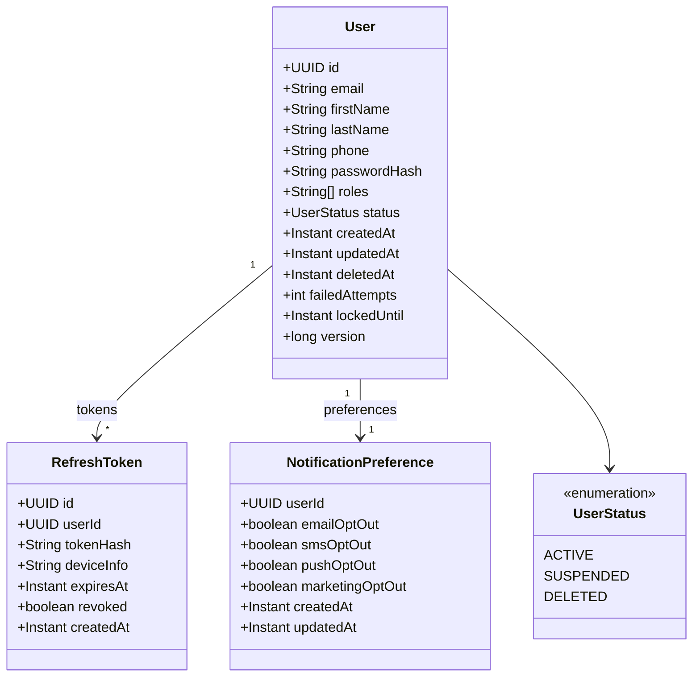
```mermaid
classDiagram
    class User {
        +UUID id
        +String email
        +String firstName
        +String lastName
        +String phone
        +String passwordHash
        +String[] roles
        +UserStatus status
        +Instant createdAt
        +Instant updatedAt
        +Instant deletedAt
        +int failedAttempts
        +Instant lockedUntil
        +long version
    }

    class RefreshToken {
        +UUID id
        +UUID userId
        +String tokenHash
        +String deviceInfo
        +Instant expiresAt
        +boolean revoked
        +Instant createdAt
    }

    class NotificationPreference {
        +UUID userId
        +boolean emailOptOut
        +boolean smsOptOut
        +boolean pushOptOut
        +boolean marketingOptOut
        +Instant createdAt
        +Instant updatedAt
    }

    class UserStatus {
        <<enumeration>>
        ACTIVE
        SUSPENDED
        DELETED
    }

    User "1" --> "*" RefreshToken : tokens
    User "1" --> "1" NotificationPreference : preferences
    User --> UserStatus
```

---

## 8. Database Schema Overview

### 8.1 Database-per-Service Isolation

Every microservice owns its database. No service reads another service's tables directly;
all cross-service communication happens via Kafka events or synchronous HTTP/gRPC.

| Service                   | Database           | Engine         |
|---------------------------|--------------------|----------------|
| identity-service          | `identity_db`      | PostgreSQL 15  |
| catalog-service           | `catalog_db`       | PostgreSQL 15  |
| inventory-service         | `inventory_db`     | PostgreSQL 15  |
| order-service             | `order_db`         | PostgreSQL 15  |
| payment-service           | `payment_db`       | PostgreSQL 15  |
| fulfillment-service       | `fulfillment_db`   | PostgreSQL 15  |
| notification-service      | `notification_db`  | PostgreSQL 15  |
| fraud-detection-service   | `fraud_db`         | PostgreSQL 15  |
| wallet-loyalty-service    | `wallet_db`        | PostgreSQL 15  |
| config-feature-flag-service | `config_db`      | PostgreSQL 15  |
| warehouse-service         | `warehouse_db`     | PostgreSQL 15  |
| routing-eta-service       | `routing_db`       | PostgreSQL 15  |
| audit-trail-service       | `audit_db`         | PostgreSQL 15  |

### 8.2 Key Tables per Service

#### order-service (`order_db`)

| Table                  | Key Columns                                                                 |
|------------------------|-----------------------------------------------------------------------------|
| `orders`               | id, user_id, status, subtotal_cents, discount_cents, total_cents, currency, coupon_code, reservation_id, payment_id, idempotency_key, cancellation_reason, delivery_address, version |
| `order_items`          | id, order_id (FK), product_id, product_name, product_sku, quantity, unit_price_cents, line_total_cents, picked_status |
| `order_status_history` | id, order_id (FK), from_status, to_status, changed_by, note, created_at    |
| `outbox_events`        | id, aggregate_type, aggregate_id, event_type, payload (jsonb), created_at, sent |

#### payment-service (`payment_db`)

| Table            | Key Columns                                                                       |
|------------------|-----------------------------------------------------------------------------------|
| `payments`       | id, order_id, amount_cents, captured_cents, refunded_cents, currency, status, psp_reference, idempotency_key, payment_method, metadata (jsonb), version |
| `refunds`        | id, payment_id (FK), amount_cents, reason, psp_refund_id, idempotency_key, status |
| `ledger_entries` | id, payment_id (FK), entry_type (DEBIT/CREDIT), amount_cents, account, reference_type, reference_id, description |
| `outbox_events`  | id, aggregate_type, aggregate_id, event_type, payload (jsonb), created_at, sent   |

#### inventory-service (`inventory_db`)

| Table                    | Key Columns                                                          |
|--------------------------|----------------------------------------------------------------------|
| `stock_items`            | id, product_id, store_id, on_hand, reserved, updated_at, version    |
| `reservations`           | id, idempotency_key, store_id, status, expires_at                   |
| `reservation_line_items` | id, reservation_id (FK), product_id, quantity                        |
| `stock_adjustment_log`   | id, product_id, store_id, delta, reason, reference_id, actor_id     |
| `outbox_events`          | id, aggregate_type, aggregate_id, event_type, payload, created_at, sent |

#### identity-service (`identity_db`)

| Table                       | Key Columns                                                       |
|-----------------------------|-------------------------------------------------------------------|
| `users`                     | id, email (unique), first_name, last_name, phone, password_hash, roles (varchar[]), status, failed_attempts, locked_until, version |
| `refresh_tokens`            | id, user_id (FK), token_hash (unique), device_info, expires_at, revoked |
| `notification_preferences`  | user_id (PK/FK), email_opt_out, sms_opt_out, push_opt_out, marketing_opt_out |

#### fraud-detection-service (`fraud_db`)

| Table               | Key Columns                                                                  |
|---------------------|------------------------------------------------------------------------------|
| `fraud_signals`     | id, user_id, order_id, device_fingerprint, ip_address, score, risk_level, rules_triggered (jsonb), action_taken |
| `fraud_rules`       | id, name, rule_type, condition_json (jsonb), score_impact, action, active, priority |
| `velocity_counters` | id, entity_type, entity_id, counter_type, counter_value, window_start, window_end |
| `blocked_entities`  | id, entity_type, entity_value, reason, blocked_by, blocked_at, expires_at, active |

#### wallet-loyalty-service (`wallet_db`)

| Table                  | Key Columns                                                              |
|------------------------|--------------------------------------------------------------------------|
| `wallets`              | id, user_id (unique), balance_cents, currency, version                   |
| `wallet_ledger_entries`| id, wallet_id (FK), debit_account, credit_account, amount_cents, transaction_type, reference_id |
| `loyalty_accounts`     | id, user_id (unique), points_balance, lifetime_points, tier              |
| `loyalty_transactions` | id, account_id (FK), type (EARN/REDEEM/EXPIRE), points, reference_type, reference_id |

### 8.3 Outbox Pattern — `outbox_events` Table

Every Java service that emits domain events includes this table:

```sql
CREATE TABLE outbox_events (
    id             UUID PRIMARY KEY DEFAULT gen_random_uuid(),
    aggregate_type VARCHAR(100)  NOT NULL,   -- e.g., 'Order', 'Payment'
    aggregate_id   VARCHAR(255)  NOT NULL,   -- e.g., order UUID
    event_type     VARCHAR(100)  NOT NULL,   -- e.g., 'OrderPlaced'
    payload        JSONB         NOT NULL,   -- full event payload
    created_at     TIMESTAMPTZ   NOT NULL DEFAULT now(),
    sent           BOOLEAN       NOT NULL DEFAULT FALSE
);

CREATE INDEX idx_outbox_unsent ON outbox_events (created_at) WHERE sent = FALSE;
```

**Flow**: Domain transaction writes to both the aggregate table and `outbox_events` atomically.
The `outbox-relay-service` (Go) polls for `sent = FALSE` rows using `SELECT ... FOR UPDATE SKIP LOCKED`,
publishes them to Kafka, and marks them `sent = TRUE`.

---

## 9. AI / ML Pipeline

### 9.1 LangGraph Agent Workflow (AI Orchestrator)

The `ai-orchestrator-service` (Python/FastAPI) implements a stateful agent using LangGraph:

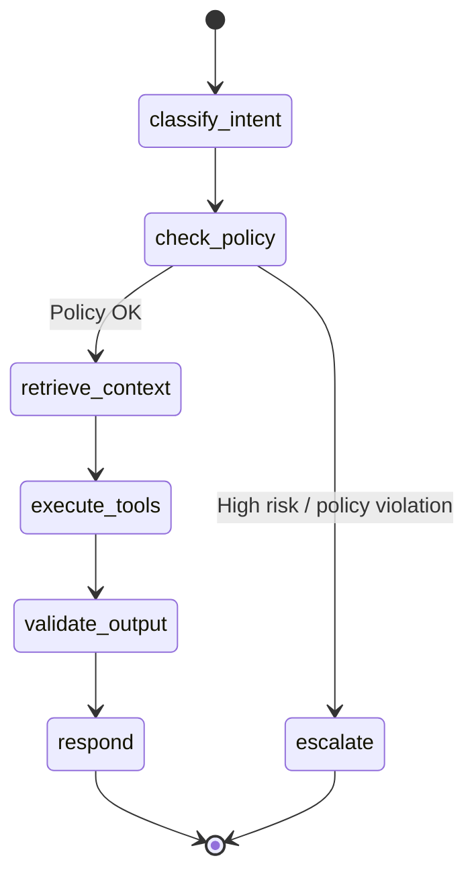
```mermaid
stateDiagram-v2
    [*] --> classify_intent
    classify_intent --> check_policy
    check_policy --> escalate: High risk / policy violation
    check_policy --> retrieve_context: Policy OK
    retrieve_context --> execute_tools
    execute_tools --> validate_output
    validate_output --> respond
    respond --> [*]
    escalate --> [*]
```

#### Agent State

```python
class AgentState:
    intent: str          # SUPPORT, RECOMMEND, SEARCH, ORDER_STATUS, SUBSTITUTE
    risk_level: str      # LOW, MEDIUM, HIGH
    needs_escalation: bool
    context: dict        # Retrieved from downstream services
    tool_results: list   # Results of tool invocations
    errors: list         # Accumulated errors
```

#### Node Responsibilities

| Node               | Purpose                                                                   |
|--------------------|---------------------------------------------------------------------------|
| `classify_intent`  | Keyword-based intent mapping to SUPPORT, RECOMMEND, SEARCH, ORDER_STATUS, SUBSTITUTE |
| `check_policy`     | Risk assessment; triggers escalation if high-risk                         |
| `retrieve_context` | Fetches relevant data from order, catalog, and fulfillment services       |
| `execute_tools`    | Invokes tools with budget tracking (token count, invocation limits)       |
| `validate_output`  | PII redaction (regex), content safety, format validation                  |
| `respond`          | Formats final response for the user                                       |
| `escalate`         | Hands off to a human agent                                                |

#### Guardrails

- **Rate Limiter**: Per-user request throttling
- **PII Detector**: Regex-based detection and redaction of emails, phone numbers, etc.
- **Injection Protection**: Prompt injection detection
- **Circuit Breaker**: Per-tool circuit breaker (states: CLOSED → OPEN → HALF_OPEN), 2.5s timeout per tool call

### 9.2 ML Model Serving

The `ai-inference-service` (Python/FastAPI) hosts all ML models behind a unified predictor interface.

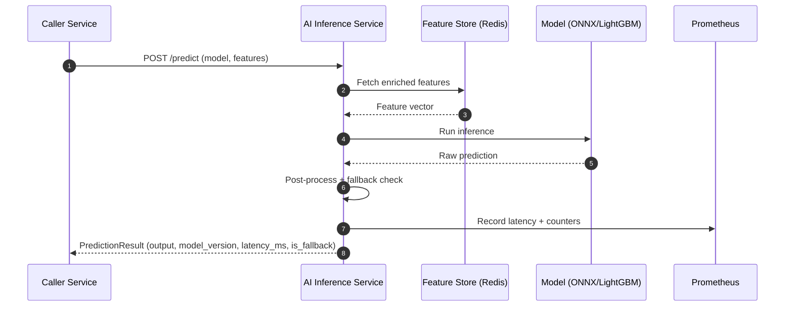
```mermaid
sequenceDiagram
    autonumber
    participant C as Caller Service
    participant AI as AI Inference Service
    participant FS as Feature Store (Redis)
    participant M as Model (ONNX/LightGBM)
    participant PR as Prometheus

    C->>AI: POST /predict (model, features)
    AI->>FS: Fetch enriched features
    FS-->>AI: Feature vector
    AI->>M: Run inference
    M-->>AI: Raw prediction
    AI->>AI: Post-process + fallback check
    AI->>PR: Record latency + counters
    AI-->>C: PredictionResult (output, model_version, latency_ms, is_fallback)
```

#### Predictor Hierarchy

| Predictor                | Model Framework       | Fallback Strategy                                |
|--------------------------|-----------------------|--------------------------------------------------|
| `RankingPredictor`       | LightGBM → ONNX      | 0.6×popularity + 0.3×recency + 0.1×rating       |
| `DemandPredictor`        | Prophet + TFT         | Historical average                               |
| `ETAPredictor`           | Custom regression     | Static zone-based estimate                       |
| `FraudPredictor`         | Gradient boosting     | Rule-based scoring                               |
| `CLVPredictor`           | XGBoost               | Cohort average                                   |
| `PersonalizationPredictor`| Collaborative filter | Popularity-based recommendations                 |

#### Model Status Lifecycle

```
LOADING → READY → DEGRADED (fallback active) → FAILED
```

### 9.3 Training Pipeline

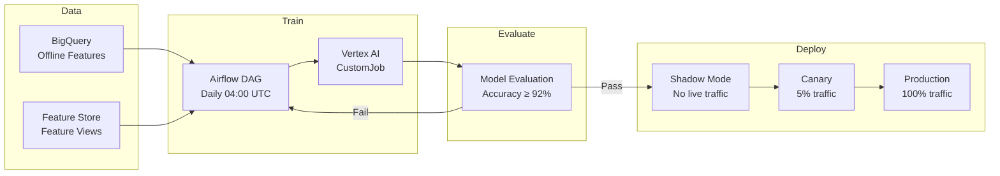
```mermaid
flowchart LR
    subgraph Data
        BQ[BigQuery<br/>Offline Features]
        FS[Feature Store<br/>Feature Views]
    end

    subgraph Train
        AF[Airflow DAG<br/>Daily 04:00 UTC]
        VJ[Vertex AI<br/>CustomJob]
    end

    subgraph Evaluate
        ME[Model Evaluation<br/>Accuracy ≥ 92%]
    end

    subgraph Deploy
        SH[Shadow Mode<br/>No live traffic]
        CN[Canary<br/>5% traffic]
        PR[Production<br/>100% traffic]
    end

    BQ --> AF
    FS --> AF
    AF --> VJ
    VJ --> ME
    ME -->|Pass| SH
    ME -->|Fail| AF
    SH --> CN
    CN --> PR
```

#### Model Registry

- **Version management**: Each model tracks version, framework, metrics, and feature list.
- **A/B traffic routing**: Weighted traffic split between model versions.
- **Shadow mode**: New model runs inference in parallel without serving results to users.
- **Kill switch**: Instant rollback to the previous version.

---

## 10. Go Service Architectures

### 10.1 Outbox Relay Service

Polls PostgreSQL for unsent outbox events and publishes them to Kafka.

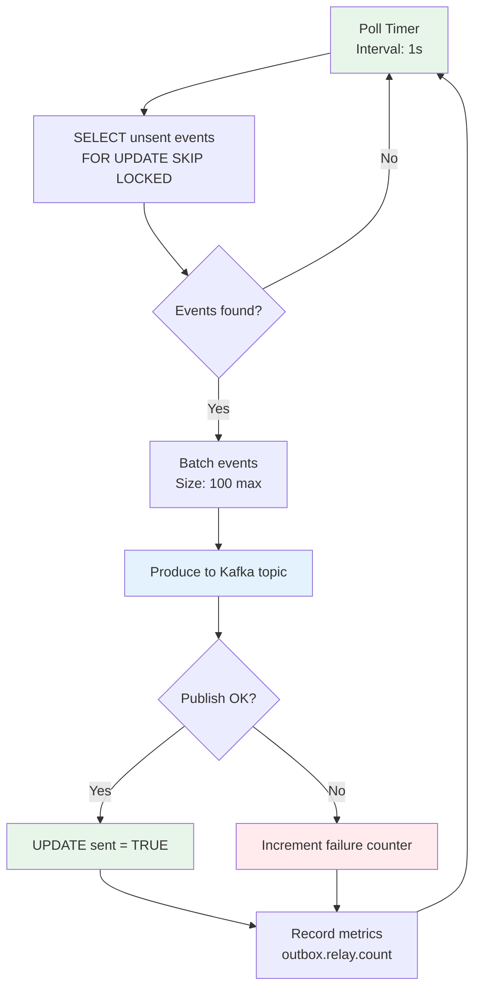
```mermaid
flowchart TD
    A[Poll Timer<br/>Interval: 1s] --> B[SELECT unsent events<br/>FOR UPDATE SKIP LOCKED]
    B --> C{Events found?}
    C -->|No| A
    C -->|Yes| D[Batch events<br/>Size: 100 max]
    D --> E[Produce to Kafka topic]
    E --> F{Publish OK?}
    F -->|Yes| G[UPDATE sent = TRUE]
    F -->|No| H[Increment failure counter]
    G --> I[Record metrics<br/>outbox.relay.count]
    H --> I
    I --> A

    style A fill:#e8f5e9
    style E fill:#e3f2fd
    style G fill:#e8f5e9
    style H fill:#ffebee
```

**Configuration**:
- `OUTBOX_POLL_INTERVAL`: Default 1s
- `OUTBOX_BATCH_SIZE`: Default 100
- `OUTBOX_TABLE`: Configurable table name
- `OUTBOX_TOPIC`: Target Kafka topic

**Observability**: OpenTelemetry spans (`outbox.relay.batch`, `outbox.relay.publish`) + Prometheus metrics (`outbox.relay.count`, `outbox.relay.failures`, `outbox.relay.lag.seconds`).

### 10.2 Location Ingestion Service

Receives GPS pings from rider apps and fans out to Kafka and Redis.

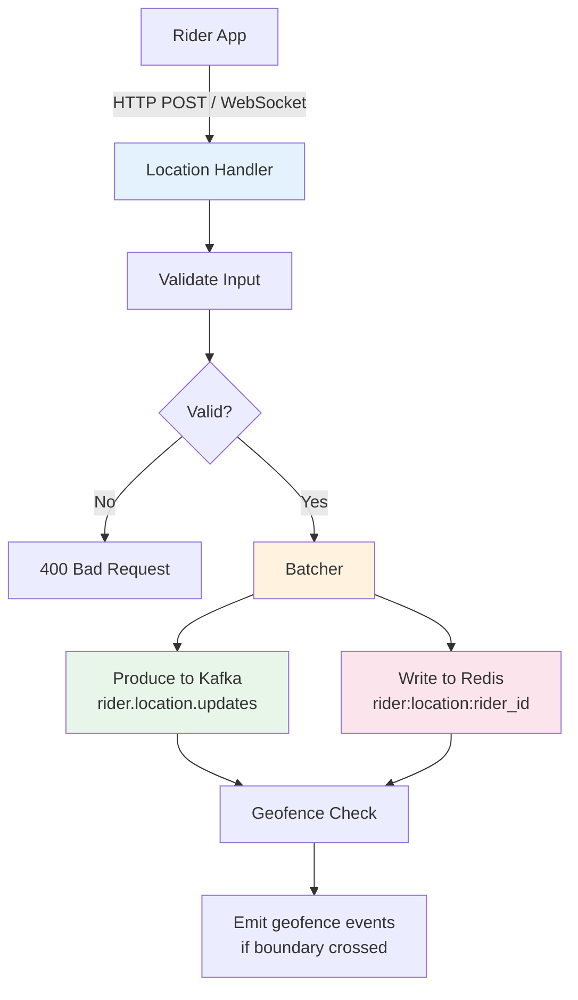
```mermaid
flowchart TD
    A[Rider App] -->|HTTP POST / WebSocket| B[Location Handler]
    B --> C[Validate Input]
    C --> D{Valid?}
    D -->|No| E[400 Bad Request]
    D -->|Yes| F[Batcher]
    F --> G[Produce to Kafka<br/>rider.location.updates]
    F --> H[Write to Redis<br/>rider:location:rider_id]
    G --> I[Geofence Check]
    H --> I
    I --> J[Emit geofence events<br/>if boundary crossed]

    style B fill:#e3f2fd
    style F fill:#fff3e0
    style G fill:#e8f5e9
    style H fill:#fce4ec
```

**LocationUpdate struct**:

| Field            | Type    | Validation                    |
|------------------|---------|-------------------------------|
| `rider_id`       | string  | Required                      |
| `lat`            | float64 | -90 to 90                     |
| `lng`            | float64 | -180 to 180                   |
| `accuracy_meters`| float64 | ≥ 0                           |
| `speed_kmh`      | float64 | ≥ 0                           |
| `heading_degrees`| float64 | 0 to 360                      |
| `timestamp`      | time    | Required                      |
| `battery_pct`    | int     | 0 to 100                      |

### 10.3 Stream Processor Service

Consumes events from multiple Kafka topics, computes real-time aggregations,
and writes to Redis counters and Prometheus metrics.

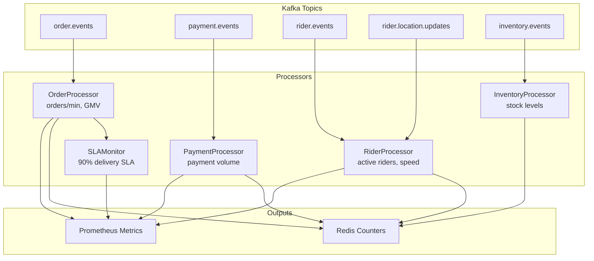
```mermaid
flowchart TD
    subgraph Kafka Topics
        T1[order.events]
        T2[payment.events]
        T3[rider.events]
        T4[rider.location.updates]
        T5[inventory.events]
    end

    subgraph Processors
        OP[OrderProcessor<br/>orders/min, GMV]
        PP[PaymentProcessor<br/>payment volume]
        RP[RiderProcessor<br/>active riders, speed]
        IP[InventoryProcessor<br/>stock levels]
        SM[SLAMonitor<br/>90% delivery SLA]
    end

    subgraph Outputs
        RC[Redis Counters]
        PM[Prometheus Metrics]
    end

    T1 --> OP
    T2 --> PP
    T3 --> RP
    T4 --> RP
    T5 --> IP
    OP --> SM

    OP --> RC
    OP --> PM
    PP --> RC
    PP --> PM
    RP --> RC
    RP --> PM
    IP --> RC
    SM --> PM
```

**Key Metrics Emitted**:
- `orders_total` — Total orders per store/zone
- `gmv_total_cents` — Gross merchandise value
- `delivery_duration_minutes` — Per-delivery histogram
- `sla_compliance_ratio` — 90th percentile delivery SLA
- `order_cancellations_total` — Cancellation counter

### 10.4 Dispatch Optimizer Service

Receives a batch of pending orders and available riders, runs a constraint solver,
and returns optimal rider-order assignments.

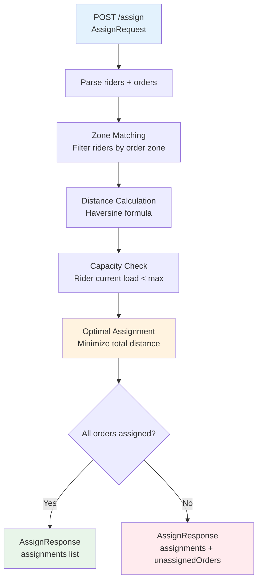
```mermaid
flowchart TD
    A[POST /assign<br/>AssignRequest] --> B[Parse riders + orders]
    B --> C[Zone Matching<br/>Filter riders by order zone]
    C --> D[Distance Calculation<br/>Haversine formula]
    D --> E[Capacity Check<br/>Rider current load < max]
    E --> F[Optimal Assignment<br/>Minimize total distance]
    F --> G{All orders assigned?}
    G -->|Yes| H[AssignResponse<br/>assignments list]
    G -->|No| I[AssignResponse<br/>assignments + unassignedOrders]

    style A fill:#e3f2fd
    style F fill:#fff3e0
    style H fill:#e8f5e9
    style I fill:#ffebee
```

**Data Structures**:

```go
type AssignRequest struct {
    Riders   []Rider   // id, position{lat,lng}, zone
    Orders   []Order   // id, position{lat,lng}, zone
    Capacity int       // max orders per rider
}

type AssignResponse struct {
    Assignments      []Assignment  // rider_id, order_id, distance_km
    UnassignedOrders []string      // order IDs with no available rider
}
```

**Algorithm**: Greedy nearest-rider assignment with zone constraint. For each unassigned order, find the closest available rider in the same zone with remaining capacity. Ties are broken by rider ID for determinism.

---

## 11. Notification Channel Routing

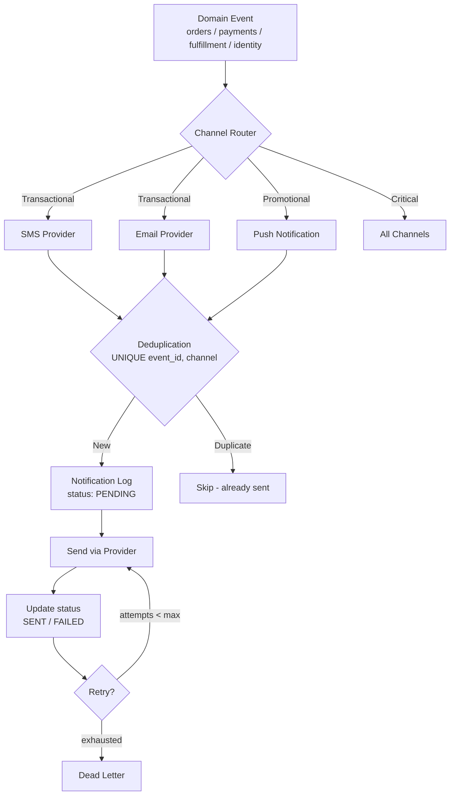
```mermaid
flowchart TD
    Event[Domain Event<br/>orders / payments / fulfillment / identity] --> Router{Channel Router}
    Router -->|Transactional| SMS[SMS Provider]
    Router -->|Transactional| Email[Email Provider]
    Router -->|Promotional| Push[Push Notification]
    Router -->|Critical| All[All Channels]
    SMS --> Dedup{Deduplication<br/>UNIQUE event_id, channel}
    Email --> Dedup
    Push --> Dedup
    Dedup -->|New| Log[Notification Log<br/>status: PENDING]
    Dedup -->|Duplicate| Skip[Skip - already sent]
    Log --> Send[Send via Provider]
    Send --> Update[Update status<br/>SENT / FAILED]
    Update --> Retry{Retry?}
    Retry -->|attempts < max| Send
    Retry -->|exhausted| DLT[Dead Letter]
```

### Notification Log Table

| Column         | Type          | Purpose                                      |
|----------------|---------------|----------------------------------------------|
| `id`           | UUID          | Primary key                                  |
| `user_id`      | UUID          | Target user                                  |
| `event_id`     | VARCHAR(64)   | Source domain event ID                        |
| `channel`      | VARCHAR(10)   | EMAIL, SMS, or PUSH                           |
| `template_id`  | VARCHAR(50)   | Notification template reference               |
| `recipient`    | VARCHAR(255)  | Email address, phone number, or device token  |
| `status`       | VARCHAR(20)   | PENDING → SENT / FAILED / SKIPPED            |
| `provider_ref` | VARCHAR(255)  | External provider message ID                  |
| `attempts`     | INT           | Send attempt count                            |
| `last_error`   | TEXT          | Last failure reason                           |
| `created_at`   | TIMESTAMPTZ   | When the notification was queued              |
| `sent_at`      | TIMESTAMPTZ   | When successfully delivered                   |

**Deduplication constraint**: `UNIQUE(event_id, channel)` — a `DataIntegrityViolationException` on insert means the notification was already processed.

### Consumer Routing

| Kafka Topic          | Event Types Handled                        | Channel Selection                     |
|----------------------|--------------------------------------------|---------------------------------------|
| `orders.events`      | OrderPlaced, OrderCancelled, OrderDelivered | SMS + Push (transactional)            |
| `payments.events`    | PaymentCaptured, PaymentRefunded           | Email + Push (transactional)          |
| `fulfillment.events` | RiderAssigned, OrderDispatched             | Push (real-time updates)              |
| `identity.events`    | UserCreated, PasswordChanged               | Email (transactional)                 |

---

## 12. Feature Flag Evaluation Flow

```mermaid
flowchart TD
    A[Flag Request<br/>flagKey + userId] --> B{Cache Hit?}
    B -->|Yes| C[Return cached variant]
    B -->|No| D[Load flag from DB]
    D --> E{Flag enabled?}
    E -->|No| F[Return default_value]
    E -->|Yes| G{Flag type?}
    G -->|BOOLEAN| H[Return true]
    G -->|USER_LIST| I{userId in target_users?}
    I -->|Yes| H
    I -->|No| F
    G -->|PERCENTAGE| J[Hash userId → bucket 0-99]
    J --> K{bucket < rollout_percentage?}
    K -->|Yes| H
    K -->|No| F
    G -->|JSON| L[Return JSON value]

    H --> M[Cache result<br/>TTL from config]
    F --> M
    L --> M
    M --> N[Return EvaluationResult]

    style A fill:#e3f2fd
    style H fill:#e8f5e9
    style F fill:#ffebee
```

### Flag Types

| Type         | Evaluation Logic                                                |
|--------------|-----------------------------------------------------------------|
| `BOOLEAN`    | Simple on/off toggle                                            |
| `PERCENTAGE` | Hash user ID → deterministic bucket → compare with rollout %   |
| `USER_LIST`  | Check if user ID is in the `target_users` JSONB array           |
| `JSON`       | Return arbitrary JSON payload as the variant value              |

### Experiments

The feature-flag service also supports A/B experiments:
- **Experiment** with multiple **ExperimentVariant** records (name, weight, payload).
- **ExperimentExposure** tracks which user saw which variant for analytics.
- Consistent hashing ensures the same user always sees the same variant.

### Supporting Tables

| Table                  | Purpose                                        |
|------------------------|------------------------------------------------|
| `feature_flags`        | Flag definitions with rollout config           |
| `flag_overrides`       | Per-user or per-environment overrides          |
| `flag_audit_logs`      | Audit trail for flag changes                   |
| `experiments`          | A/B experiment definitions                     |
| `experiment_variants`  | Variant definitions (name, weight, payload)    |
| `experiment_exposures` | User-variant assignment tracking               |

---

## 13. Fraud Detection Pipeline

```mermaid
flowchart TD
    subgraph Event Sources
        OE[order.events<br/>OrderPlaced]
        PE[payment.events<br/>PaymentAuthorized]
    end

    OE --> FC[Fraud Consumer]
    PE --> FC

    FC --> VC[Velocity Checks<br/>Orders/hour, Amount/day]
    VC --> RE[Rule Evaluation<br/>VELOCITY, AMOUNT,<br/>DEVICE, GEO, PATTERN]
    RE --> ML[ML Scoring<br/>FraudPredictor]
    ML --> SC[Score Aggregation<br/>rules + ML combined]
    SC --> RL{Risk Level}

    RL -->|0-25| LOW[LOW → ALLOW]
    RL -->|26-50| MED[MEDIUM → FLAG]
    RL -->|51-75| HIGH[HIGH → REVIEW]
    RL -->|76-100| CRIT[CRITICAL → BLOCK]

    LOW --> FS[Write FraudSignal]
    MED --> FS
    HIGH --> FS
    CRIT --> FS
    CRIT --> BL[Add to blocked_entities]
    FS --> DB[(fraud_db)]
    BL --> DB

    style LOW fill:#e8f5e9
    style MED fill:#fff3e0
    style HIGH fill:#fff9c4
    style CRIT fill:#ffebee
```

### Fraud Rules

| Rule Type   | Description                              | Example Condition (JSONB)                      |
|-------------|------------------------------------------|------------------------------------------------|
| `VELOCITY`  | Rate-based checks                        | `{"max_orders_per_hour": 5}`                   |
| `AMOUNT`    | Transaction amount thresholds            | `{"max_amount_cents": 500000}`                 |
| `DEVICE`    | Device fingerprint anomalies             | `{"max_devices_per_user": 3}`                  |
| `GEO`       | Geographic impossibility                 | `{"max_distance_km_per_hour": 500}`            |
| `PATTERN`   | Behavioral pattern matching              | `{"suspicious_patterns": ["rapid_retry"]}`     |

### Velocity Counters

Sliding-window counters stored in `velocity_counters` table:
- `entity_type`: USER, DEVICE, IP
- `counter_type`: ORDER_COUNT, PAYMENT_AMOUNT, FAILED_AUTH_COUNT
- `window_start` / `window_end`: Time range for the counter

### Actions

| Action   | Behavior                                              |
|----------|-------------------------------------------------------|
| `ALLOW`  | Order proceeds normally                               |
| `FLAG`   | Order proceeds; signal logged for later review        |
| `REVIEW` | Order held for manual review by fraud analyst         |
| `BLOCK`  | Order rejected; entity added to `blocked_entities`    |

---

## 14. Wallet & Loyalty Flow

```mermaid
sequenceDiagram
    autonumber
    participant K as Kafka (orders.events)
    participant WL as Wallet-Loyalty Service
    participant DB as Wallet DB

    K->>WL: OrderDelivered event
    WL->>DB: Lookup loyalty_account by user_id
    WL->>WL: Calculate points<br/>(totalCents × pointsPerRupee / 100)
    WL->>DB: INSERT loyalty_transaction (type=EARN)
    WL->>DB: UPDATE loyalty_account<br/>points_balance += earned<br/>lifetime_points += earned
    WL->>WL: Evaluate tier<br/>fromLifetimePoints(lifetime_points)
    WL->>DB: UPDATE loyalty_account SET tier = newTier

    Note over WL,DB: Wallet Cashback (if applicable)
    WL->>DB: Lookup wallet by user_id
    WL->>DB: INSERT wallet_ledger_entry<br/>(type=CASHBACK, debit=cashback_pool, credit=user_wallet)
    WL->>DB: UPDATE wallet SET balance_cents += cashback

    K->>WL: PaymentRefunded event
    WL->>DB: INSERT loyalty_transaction (type=REDEEM, negative points)
    WL->>DB: UPDATE loyalty_account<br/>points_balance -= deducted
```

### Loyalty Tiers

| Tier       | Lifetime Points Threshold | Benefits                          |
|------------|---------------------------|-----------------------------------|
| `BRONZE`   | 0                         | Base earn rate                    |
| `SILVER`   | 5,000                     | 1.2x earn multiplier             |
| `GOLD`     | 25,000                    | 1.5x earn multiplier + free delivery |
| `PLATINUM` | 100,000                   | 2x earn multiplier + priority support |

### Wallet Transaction Types

| Type        | Description                       | Debit Account     | Credit Account |
|-------------|-----------------------------------|-------------------|----------------|
| `TOPUP`     | User adds money to wallet         | payment_gateway   | user_wallet    |
| `PURCHASE`  | User pays with wallet balance     | user_wallet       | merchant       |
| `REFUND`    | Refund credited to wallet         | merchant          | user_wallet    |
| `PROMOTION` | Promotional credit                | promo_pool        | user_wallet    |
| `CASHBACK`  | Order completion cashback         | cashback_pool     | user_wallet    |
| `REFERRAL`  | Referral bonus                    | referral_pool     | user_wallet    |

### Idempotency

The `loyalty_transactions` table has a unique constraint on `(account_id, reference_type, reference_id)`.
This prevents duplicate point earnings if the same `OrderDelivered` event is consumed multiple times
(at-least-once delivery guarantee from Kafka).

---

## Appendix A: Cross-Cutting Concerns

### Observability Stack

| Layer       | Tool                           | Purpose                          |
|-------------|--------------------------------|----------------------------------|
| Metrics     | Prometheus + Grafana           | Request rates, latencies, SLAs   |
| Tracing     | OpenTelemetry (OTLP)           | Distributed trace propagation    |
| Logging     | Structured JSON logs           | Centralized log aggregation      |
| Alerting    | Prometheus Alertmanager        | HighErrorRate, HighLatency, KafkaConsumerLag, FrequentPodRestarts, DatabaseHighCPU |

### Alert Thresholds

| Alert                  | Condition                           | Duration |
|------------------------|-------------------------------------|----------|
| `HighErrorRate`        | 5xx error rate > 1%                 | 5 min    |
| `HighLatency`          | p99 latency > 500ms                 | 5 min    |
| `KafkaConsumerLag`     | Lag > 1,000 records                 | 5 min    |
| `FrequentPodRestarts`  | > 3 restarts in window              | 30 min   |
| `DatabaseHighCPU`      | CloudSQL CPU utilization > 80%      | 10 min   |

### Security Posture

| Layer              | Mechanism                                                |
|--------------------|----------------------------------------------------------|
| External traffic   | TLS termination at Istio Gateway (port 443)              |
| Service mesh       | mTLS STRICT via PeerAuthentication                       |
| API authentication | JWT (RS256) via identity-service                         |
| S2S authentication | X-Internal-Service + X-Internal-Token headers            |
| Authorization      | Istio AuthorizationPolicy (principal-based)              |
| Data at rest       | Encrypted PostgreSQL (CloudSQL managed encryption)       |
| Secrets            | Kubernetes Secrets (sealed-secrets or external-secrets)  |

### Deployment Strategy

| Concern          | Approach                                            |
|------------------|-----------------------------------------------------|
| GitOps           | ArgoCD with auto-sync (prune + selfHeal)            |
| Packaging        | Helm chart with per-service values                  |
| Rollout          | Kubernetes rolling update (maxUnavailable: 1)       |
| Pod security     | Non-root, read-only filesystem, no privilege escalation |
| Network policy   | Namespace-scoped network policies                   |
| Resource quotas  | Enforced per namespace                              |

---

## Appendix B: Data Platform

### dbt Layer Progression

```
Raw (BigQuery) → Staging (views) → Intermediate (tables) → Marts (partitioned tables)
```

| Layer          | Models                                                                         |
|----------------|--------------------------------------------------------------------------------|
| **Staging**    | stg_orders, stg_users, stg_products, stg_payments, stg_deliveries, stg_searches, stg_cart_events, stg_inventory_movements |
| **Intermediate** | int_user_order_history, int_product_performance, int_order_deliveries        |
| **Marts**      | mart_daily_revenue, mart_store_performance, mart_product_analytics, mart_user_cohort_retention, mart_rider_performance, mart_search_funnel |

### Streaming Pipelines (Dataflow)

| Pipeline                  | Source Topic           | Sink                  |
|---------------------------|------------------------|-----------------------|
| cart_events_pipeline      | cart.events            | BigQuery              |
| order_events_pipeline     | orders.events          | BigQuery              |
| payment_events_pipeline   | payment.events         | BigQuery              |
| inventory_events_pipeline | inventory.events       | BigQuery              |
| rider_location_pipeline   | rider.location.updates | BigQuery + Feature Store |

### Data Quality

Great Expectations validation suites run daily via Airflow: `users_suite`, `payments_suite`, `orders_suite`, `inventory_suite`.
