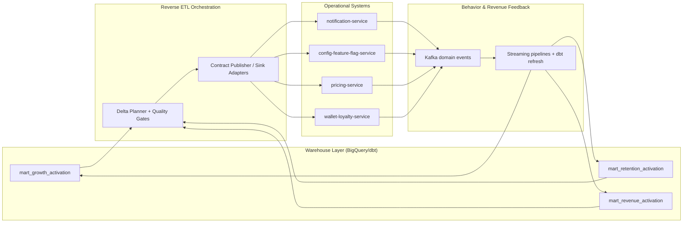

# Wave 2 Data/ML Roadmap B

Production-ready roadmap for **DataOps**, **data mesh**, **reverse ETL**, and **analytics activation** to drive **growth**, **retention**, and **revenue** outcomes.

---

## Target Outcomes (Next 2 Quarters)

- **Growth:** improve first-30-day order conversion via segment-driven activation.
- **Retention:** reduce churn with proactive risk scoring and lifecycle triggers.
- **Revenue:** improve AOV and margin using offer/promo activation loops.
- **Platform:** enforce contract + quality gates so downstream activation is reliable by default.

---

## 1) Prioritized Initiatives with Concrete Repo Touchpoints

| Priority | Initiative | Business Outcome | Concrete Repo Touchpoints |
|---|---|---|---|
| **P0** | Domain data products for growth/retention/revenue in warehouse | Trusted activation-ready datasets with explicit ownership | `data-platform/dbt/models/staging/stg_users.sql`, `data-platform/dbt/models/staging/stg_orders.sql`, `data-platform/dbt/models/staging/stg_payments.sql`, `data-platform/dbt/models/staging/stg_cart_events.sql`, `data-platform/dbt/models/marts/mart_user_cohort_retention.sql`, `data-platform/dbt/models/marts/mart_daily_revenue.sql`, `data-platform/dbt/models/marts/mart_search_funnel.sql`, `data-platform/dbt/models/marts/schema.yml`, **new:** `data-platform/dbt/models/marts/mart_growth_activation.sql`, `data-platform/dbt/models/marts/mart_retention_activation.sql`, `data-platform/dbt/models/marts/mart_revenue_activation.sql` |
| **P0** | Contract-first mesh interfaces for activation entities | Safe producer/consumer decoupling with versioned schema evolution | `contracts/src/main/resources/schemas/orders/OrderPlaced.v1.json`, `contracts/src/main/resources/schemas/payments/PaymentCaptured.v1.json`, `contracts/src/main/resources/schemas/identity/UserErased.v1.json`, `contracts/src/main/resources/schemas/README.md`, **new:** `contracts/src/main/resources/schemas/activation/CustomerSegmentUpserted.v1.json`, `contracts/src/main/resources/schemas/activation/ChurnRiskScored.v1.json`, `contracts/src/main/resources/schemas/activation/RevenueOfferRecommended.v1.json` |
| **P0** | DataOps quality gates from PR to runtime | Prevent bad data from reaching activation systems | `.github/workflows/ci.yml`, `data-platform/quality/run_quality_checks.py`, `data-platform/quality/expectations/orders_suite.yaml`, `data-platform/quality/expectations/payments_suite.yaml`, `data-platform/quality/expectations/users_suite.yaml`, `data-platform/quality/expectations/inventory_suite.yaml`, **new:** `data-platform/quality/expectations/activation_suite.yaml`, `monitoring/prometheus-rules.yaml` |
| **P1** | Reverse ETL orchestrator and sync controls | Reliable push from warehouse to operational systems | `data-platform-jobs/data_platform_jobs/job_registry.py`, `data-platform-jobs/data_platform_jobs/config.py`, `data-platform-jobs/data_platform_jobs/cli.py`, `data-platform-jobs/data_platform_jobs/jobs/features.py`, **new:** `data-platform-jobs/data_platform_jobs/jobs/reverse_etl.py`, `data-platform/airflow/dags/reverse_etl_activation.py` |
| **P1** | Activation sinks in operational services | Turn analytics into product experiences | `services/notification-service/src/main/java/com/instacommerce/notification/service/NotificationService.java`, `services/config-feature-flag-service/src/main/java/com/instacommerce/featureflag/service/ExperimentEvaluationService.java`, `services/pricing-service/src/main/java/com/instacommerce/pricing/service/PricingService.java`, `services/wallet-loyalty-service/src/main/java/com/instacommerce/wallet/service/LoyaltyService.java`, `services/inventory-service/src/main/java/com/instacommerce/inventory/service/InventoryService.java`, service `src/main/resources/application.yml` files for sink configuration |
| **P2** | Closed-loop attribution and ML-driven segment refresh | Continuous optimization of campaigns and offers | `data-platform/streaming/pipelines/order_events_pipeline.py`, `data-platform/streaming/pipelines/cart_events_pipeline.py`, `ml/feature_store/sql/user_features.sql`, `ml/feature_store/feature_groups/user_features.yaml`, `ml/train/clv_prediction/config.yaml`, `ml/eval/evaluate.py` |

---

## 2) LLD

### 2.1 Domain Data Products (Data Mesh)

Each domain exposes a product with explicit **owner**, **SLO**, **contract**, and **quality suite**.

| Data Product | Domain Owner | Grain / Keys | Primary Inputs | Published Outputs | Freshness / SLO | Primary Consumers |
|---|---|---|---|---|---|---|
| `growth_activation_product` | Growth Squad + Data Platform | `user_id`, `as_of_date` | `stg_users`, `stg_cart_events`, `mart_search_funnel` | `marts.mart_growth_activation`, `CustomerSegmentUpserted.v1` | 2h freshness, 99.5% success | Notification, Feature Flags |
| `retention_health_product` | Retention Squad + Data Platform | `user_id`, `as_of_date` | `stg_orders`, `stg_payments`, `mart_user_cohort_retention` | `marts.mart_retention_activation`, `ChurnRiskScored.v1` | 4h freshness, 99.5% success | Notification, Wallet-Loyalty |
| `revenue_optimization_product` | Revenue Squad + Data Platform | `user_id`/`store_id`, `as_of_date` | `mart_daily_revenue`, `mart_product_analytics`, `stg_payments` | `marts.mart_revenue_activation`, `RevenueOfferRecommended.v1` | Daily + intraday refresh, 99.9% success | Pricing, Catalog, Wallet-Loyalty |

**Standard product package (per domain):**
- dbt model + schema tests: `data-platform/dbt/models/marts/*`
- contract artifact: `contracts/src/main/resources/schemas/activation/*`
- expectations suite: `data-platform/quality/expectations/activation_suite.yaml`
- activation sync job: `data-platform-jobs/data_platform_jobs/jobs/reverse_etl.py`

### 2.2 Contract LLD

**Contract envelope standard (already established):**
- `event_id`, `event_type`, `aggregate_id`, `schema_version`, `source_service`, `correlation_id`, `timestamp`, `payload`

**Activation contract rules:**
1. Additive field changes remain in same version.
2. Breaking field changes require new `v{N}` contract.
3. 90-day dual-read support window for prior versions.
4. Consumer compatibility tests must pass in CI before merge.

| Contract | Producer | Consumers | Key Payload Fields | Repo Touchpoints |
|---|---|---|---|---|
| `CustomerSegmentUpserted.v1` | Reverse ETL job | Feature Flag, Notification | `user_id`, `segment_code`, `score`, `valid_from`, `valid_to` | `contracts/.../activation/CustomerSegmentUpserted.v1.json`, `services/config-feature-flag-service/.../ExperimentEvaluationService.java`, `services/notification-service/.../NotificationService.java` |
| `ChurnRiskScored.v1` | Reverse ETL job | Notification, Wallet-Loyalty | `user_id`, `risk_band`, `risk_score`, `next_best_action` | `contracts/.../activation/ChurnRiskScored.v1.json`, `services/wallet-loyalty-service/.../LoyaltyService.java` |
| `RevenueOfferRecommended.v1` | Reverse ETL job | Pricing, Catalog | `user_id`, `offer_id`, `discount_type`, `discount_value`, `expiry_at` | `contracts/.../activation/RevenueOfferRecommended.v1.json`, `services/pricing-service/.../PricingService.java`, `services/catalog-service/.../PricingController.java` |

### 2.3 DataOps Quality Gate LLD

| Gate ID | Stage | Check | Tooling / Enforcement | Failure Action |
|---|---|---|---|---|
| `G1-contract` | PR | Schema validity + compatibility + protobuf build | `.github/workflows/ci.yml` + `./gradlew :contracts:build` | Block merge |
| `G2-transform` | PR + scheduled | dbt model tests (null/unique/relationships), SQL lineage checks | `data-platform/dbt/models/marts/schema.yml`, dbt test runs via Airflow/CI | Block downstream DAG |
| `G3-expectations` | Post-load | Freshness, volume drift, enum and range constraints | `data-platform/quality/run_quality_checks.py`, `data-platform/quality/expectations/*.yaml`, `data-platform/airflow/dags/data_quality.py` | Stop activation publish + alert |
| `G4-sync` | Reverse ETL run | Idempotency, row-count reconciliation, sink ACK checks | `data-platform-jobs/.../jobs/reverse_etl.py`, `data-platform-jobs/.../job_registry.py` | Retry with backoff, then DLQ |
| `G5-business-guardrail` | Runtime | Campaign pressure cap, margin floor, churn false-positive cap | `services/*/application.yml`, `monitoring/prometheus-rules.yaml` | Auto-disable segment/offer rollout |

### 2.4 Reverse ETL Activation LLD

**Execution model**
1. dbt materializes activation marts (`mart_growth_activation`, `mart_retention_activation`, `mart_revenue_activation`).
2. Reverse ETL job computes delta snapshots (`new`, `changed`, `expired`) per `user_id + as_of_date`.
3. Per-sink adapters publish contract events and/or call service APIs.
4. Service responses are captured as sync receipts for reconciliation and replay.
5. Downstream user actions re-enter Kafka streams and feed attribution models.

**Sink mapping**
- **Growth activation:** Notification + Feature Flags
- **Retention activation:** Notification + Wallet/Loyalty
- **Revenue activation:** Pricing + Catalog + Wallet/Loyalty

**Operational controls**
- Idempotency key: `activation_type:user_id:as_of_date`
- Retries: exponential backoff; dead-letter on terminal failures
- Replay: bounded replay window (last 7 days) with contract-version pinning
- Audit: sync manifest + checksum persisted per batch run

---

## 3) Warehouse → Activation → Operational Systems Loop

---

## 4) Rollout Strategy, Ownership, and Governance Model

### 4.1 Phased Rollout

| Phase | Window | Scope | Exit Criteria |
|---|---|---|---|
| **Phase 0: Foundation** | Weeks 1-2 | Contract templates, CI gates, baseline quality checks | `G1` + `G2` live for all activation contracts/models |
| **Phase 1: Mesh Products** | Weeks 3-6 | Ship 3 domain data products and SLO dashboards | Activation marts available with owner + SLO + tests |
| **Phase 2: Reverse ETL Launch** | Weeks 7-10 | Push growth/retention segments to operational systems | Daily sync success ≥ 99%, no unresolved P1 data incidents |
| **Phase 3: Revenue Activation + Optimization** | Weeks 11-14 | Revenue offer loop + attribution feedback loop | Measured uplift, automated rollback guardrails active |

### 4.2 Ownership Model

| Capability | Responsible Team | Accountable Role | Consulted | Informed |
|---|---|---|---|---|
| Data contracts | Data Platform + Domain Producers | Staff Data Engineer | Service Owners, Security | All consuming teams |
| Domain data products | Growth/Retention/Revenue domain squads | Domain Engineering Manager | Analytics, ML Platform | Product leadership |
| Quality gates + observability | Data Platform + SRE | Platform Tech Lead | Domain squads | On-call rotation |
| Reverse ETL operations | Data Platform | DataOps Lead | Service Owners | Growth/Retention/Revenue PMs |
| Activation policy/guardrails | Domain squads + Product | Group PM | Finance, Risk | Exec stakeholders |

### 4.3 Governance Model

1. **Data Product Council (weekly):** owner assignment, SLO review, readiness approvals.
2. **Contract Review Board (per PR):** schema evolution and compatibility sign-off.
3. **Activation Governance Review (biweekly):** growth/retention/revenue KPI movement, pressure-cap and fairness checks.
4. **Incident Governance:** any `G3+` gate breach opens a cross-team incident with RCA and runbook updates in same sprint.

**Decision policy**
- No activation rollout without passing `G1-G4`.
- `G5` guardrail violation triggers automatic rollback and council review.
- Ownership cannot be shared ambiguously; each data product has one DRI.

