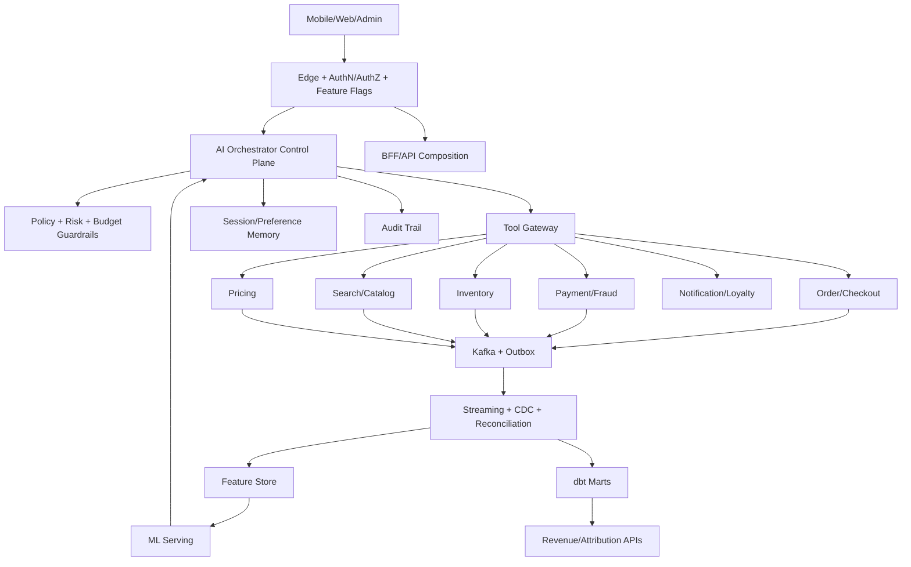
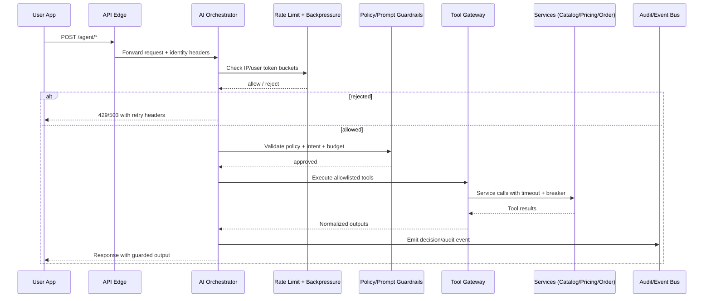
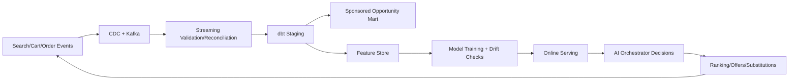

# InstaCommerce AI Agent Fleet Plan (Production)

Date: 2026-02-13  
Scope: Deep AI/Data/ML + revenue plan with 24-agent operating model, benchmarked using codebase findings and public references from Instacart, DoorDash, Zepto, and Blinkit/Zomato.

## 1) Planning input and method

- Executed **22 parallel sub-agents** across checkout/payment, search/pricing, inventory/fleet, fraud, loyalty, AI platform, eventing, data platform, ML serving, feature store, security, and monetization.
- Benchmarked with web sources:
  - Instacart Tech: CV + LLM pipeline for shoppable flyers and promotion digitization (`tech.instacart.com/feed`, 2026-02 article).
  - DoorDash Engineering: substitution ML evolution (TF-IDF -> LightGBM -> deep learning embeddings), and internal ML Workbench for platform velocity.
  - Zepto TechXPress: Debezium CDC optimization at scale with reduction buffer + Postgres write-path optimization.
  - Blinkit/Zomato ecosystem: scale of dark-store quick commerce and Flink reconciliation patterns for reliable real-time ads feedback loops.

## 2) Executive plan summary

### Business outcomes targeted

1. **Revenue uplift**: sponsored placements, intelligent substitution, dynamic pricing guardrails, retention nudges.
2. **Margin protection**: policy-constrained AI recommendations with hard business caps and confidence thresholds.
3. **Reliability under AI load**: queueing, rate limits, backpressure, and event contract integrity.
4. **Data/ML velocity**: stronger CDC, feature freshness/parity, model governance, and attribution-grade marts.

### Fleet model

- **24 production agents** across four domains:
  1. Customer journey agents (ordering, substitution, recommendations, support).
  2. Growth/revenue agents (pricing, promotions, ads, churn prevention).
  3. Ops/risk agents (fraud, incident copilot, SLA/breach copilot).
  4. Data/ML governance agents (feature parity, drift, quality, retraining orchestration).

## 3) HLD: Competitor-aligned architecture direction

### 3.1) Alignment to `docs/architecture/FUTURE-IMPROVEMENTS.md`

- Keep canonical event envelopes and topic normalization as non-negotiable foundations for cross-service AI/data reliability.
- Enforce zero-trust and policy-first execution in orchestration and service-to-service calls.
- Prioritize search/pricing and agent safety controls in the same P0 window to avoid unsafe growth experiments.
- Sequence delivery against the FUTURE-IMPROVEMENTS strategic tracks: P0 search ML + demand forecasting + sponsored ads readiness, P1 dynamic pricing/event-sourcing, P2 zero-trust + multi-region hardening.
- Build monetization and retention loops on top of governed marts and feature-store parity checks.

### 3.2) LLD: AI request processing path (Mermaid)

### 3.3) Data/ML revenue loop (Mermaid)

## 4) 24-agent operating model (production ownership)

### A) Customer-facing agents (8)
1. Voice/Chat Ordering Agent  
2. Smart Cart Agent  
3. Substitution Agent  
4. Reorder Agent  
5. Delivery ETA Confidence Agent  
6. Order Status Copilot  
7. Returns/Refund Triage Agent  
8. Shopper Support Agent (HITL fallback)

### B) Growth/revenue agents (8)
9. Dynamic Pricing Guardrail Agent  
10. Coupon Optimization Agent  
11. Sponsored Placement Agent  
12. Search Monetization Agent  
13. Retention Nudge Agent  
14. CLV Offer Agent  
15. Referral Optimization Agent  
16. Campaign ROI Agent

### C) Ops/risk agents (4)
17. Fraud Decision Copilot  
18. Payment Recovery Agent  
19. Incident Copilot  
20. SLA Breach Copilot

### D) Data/ML governance agents (4)
21. Feature Parity Agent  
22. Drift + Retraining Agent  
23. Data Quality Contract Agent  
24. Experiment/Canary Governance Agent

## 5) Prioritized rollout

### P0 (now)
- AI orchestration reliability and guardrails under load.
- Revenue foundation marts for ad/sponsored readiness and prioritization.
- Checkout/payment/fraud integration hardening (already in progress from prior P0 batch).

### P1
- Sponsored placements + attribution write path.
- Substitution and pricing optimization loops.
- Feature-store freshness SLIs and automatic drift-trigger workflows.

### P2
- Multi-armed bandit experimentation fabric.
- Region-aware dispatch optimization with calibrated ETA confidence intervals.
- Full internal copilots with approval workflows and immutable audit gates.

## 6) Implementation started in this cycle

This cycle starts with two production-safe foundations:

1. **AI Orchestrator Guardrail Hardening**
   - Enforce per-IP + per-user throttling.
   - Add queue/backpressure control for surge protection.
   - Keep fail-closed semantics with explicit 429/503 behavior.

2. **Revenue Data Foundation**
   - Add sponsored monetization opportunity mart in dbt using existing funnel/product/revenue assets.
   - Provide daily prioritization surface for GTM and ad-sales readiness.

## 7) Delivery and safety gates

- Canary-first rollout for new AI controls.
- Strict schema/contracts compatibility for data marts.
- No silent fallback on policy failures; explicit escalation and telemetry.
- Keep existing business-critical behavior backward compatible.
