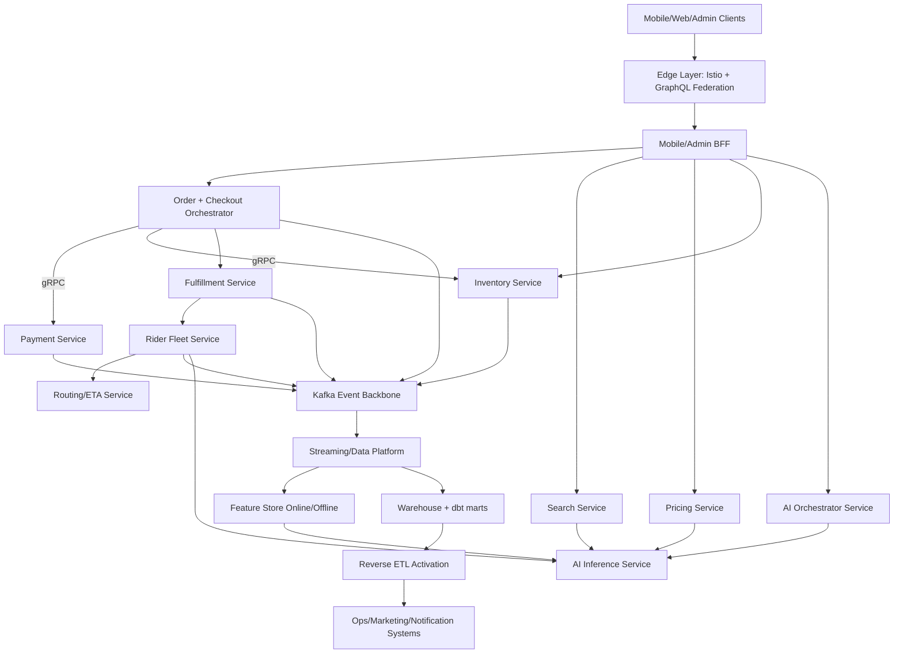
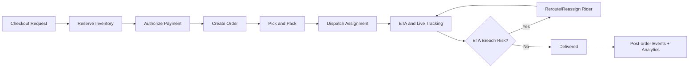
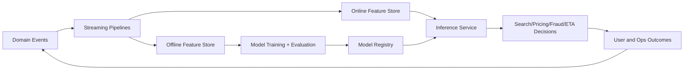
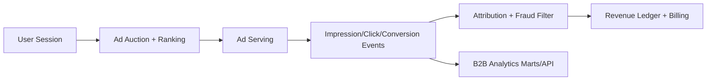

# InstaCommerce Fleet Architecture Review (Q-Commerce)

Date: 2026-02-13  
Scope: Full-repo architecture and code review aligned to `docs/architecture/FUTURE-IMPROVEMENTS.md` and benchmarked against Zepto, Blinkit, Instacart, and DoorDash.

## 1) Review method and planning

This review was executed in fleet mode with **20 parallel sub-agents**:

- **Wave 1 (10 agents):** current-state discovery across core services, Go data path, AI, data/ML, contracts, infra, and security.
- **Wave 2 (10 agents):** target-state design across order/payment, search/pricing/personalization, inventory/fleet, API evolution, resilience/security, **2 AI-agent tracks**, **2 Data/ML tracks**, and monetization architecture.

All workstreams were tracked in SQL todos with dependency management (`todos`, `todo_deps`) and consolidated here.

## 2) Executive summary

### Current strengths

- Strong domain microservice decomposition (Java, Go, Python) with clear bounded contexts.
- Existing event-driven backbone (Kafka + outbox pattern) and Temporal-based orchestration.
- Good foundational docs in `docs/architecture/*` and `docs/reviews/*`.
- Existing AI and ML building blocks (`services/ai-*`, `ml/*`, `data-platform/*`).

### Critical gaps to close for top-tier Q-commerce

1. **Hot-path latency and consistency:** order/checkout/payment ownership overlap, REST-heavy synchronous hops, uneven idempotency.
2. **Search and pricing competitiveness:** BM25-first search and rule-heavy pricing need LTR + contextual bandits with strong guardrails.
3. **Inventory-to-dispatch loop:** rider assignment ownership and event contract consistency need hardening for 10-15 minute SLA.
4. **Security and resilience posture:** zero-trust and supply-chain controls are partial; progressive delivery and chaos engineering need formal rollout.
5. **Data/ML operating model:** feature freshness/parity, model promotion gates, and reverse-ETL activation need stronger production controls.
6. **Monetization maturity:** sponsored ads, B2B analytics, fintech risk products, and white-label platform need explicit architecture and governance.

## 3) Target platform architecture (recommended)

## 4) LLD blueprints by domain

### A) Order + Checkout + Payment (P0)

- Make `checkout-orchestrator-service` the single checkout workflow owner.
- Enforce operation-level idempotency (`authorize`, `capture`, `void`, `refund`) with deterministic keys.
- Standardize outbox envelope (`event_id`, `event_type`, `aggregate_id`, `schema_version`, `correlation_id`).
- Introduce dual-stack migration for hot path (`REST + gRPC`), then progressively move checkout calls to gRPC.
- Add pending-state recovery and reconciliation jobs in payment + ledger flow.

Primary touchpoints:
- `services/checkout-orchestrator-service/.../CheckoutWorkflowImpl.java`
- `services/order-service/.../CheckoutController.java`
- `services/payment-service/.../PaymentService.java`
- `services/payment-service/.../RefundService.java`
- `services/outbox-relay-service/main.go`

### B) Search + Pricing + Personalization (P0/P1)

- Retrieval and ranking pipeline: BM25/ANN retrieval -> feature join -> LTR re-rank -> business constraints.
- Dynamic pricing via contextual bandits with hard guardrails:
  - margin floor, essentials no-surge, max multiplier, complaint/cancellation rollback triggers.
- Unify recommendation serving across buy-again, substitution, and cross-sell surfaces with cold-start policies.
- Run all rollouts through experiment control plane with exposure logging and holdout cohorts.

Primary touchpoints:
- `services/search-service/.../SearchService.java`
- `services/pricing-service/.../PricingService.java`
- `services/ai-inference-service/app/main.py`
- `ml/train/search_ranking/train.py`
- `services/config-feature-flag-service/.../ExperimentEvaluationService.java`

### C) AI Agents (2-track rollout)

#### Track 1 (customer-facing)
- Voice/chat ordering, smart cart, substitution assistant, proactive reorder.
- Required controls: memory/context policy, prompt guardrails, tool allowlists, latency/cost budgets.
- SLO targets: low-latency responses, bounded token/cost spend, deterministic fallback behavior.

#### Track 2 (internal agents)
- Incident Copilot, Fraud Analyst Copilot, Ops Copilot, Merchandiser Copilot.
- Mandatory governance: policy decision point, HITL approvals, audit trail, offline/online eval gates.

Primary touchpoints:
- `services/ai-orchestrator-service/app/graph/*`
- `services/ai-orchestrator-service/app/guardrails/*`
- `services/ai-inference-service/app/models/*`
- `docs/architecture/INTERNAL-AI-AGENTS-ROADMAP.md`

### D) Data/ML platform (2-track rollout)

#### Track 1 (real-time feature + serving)
- Stream-first feature computation, online/offline feature parity checks, low-latency inference path.
- Drift/freshness SLOs tied to promotion and rollback policy.

#### Track 2 (DataOps + mesh + reverse ETL)
- Domain data products with ownership and SLOs.
- Contract-first activation entities and CI quality gates.
- Reverse ETL orchestration into notification/pricing/loyalty systems.

Primary touchpoints:
- `data-platform/streaming/pipelines/*.py`
- `data-platform/quality/*`
- `ml/feature_store/*`
- `data-platform-jobs/data_platform_jobs/jobs/*`
- `docs/architecture/WAVE2-DATA-ML-ROADMAP-B.md`

## 5) Core operational flow (10-15 min delivery target)

## 6) Data/ML decision loop (closed loop optimization)

## 7) Revenue architecture and opportunities

### Priority opportunities

1. **Sponsored ads platform (P0):** auction + ranking + attribution + billing.
2. **B2B analytics product (P0/P1):** multi-tenant insights API and dashboards.
3. **Fintech services (P1):** risk-priced payouts/credit workflows with strict controls.
4. **White-label platform (P2):** tenant-isolated commerce stack for partner chains.

## 8) Prioritized execution plan

### Phase P0 (foundation and risk removal)

- Checkout/payment ownership and idempotency hardening.
- Canonical event contracts and relay topic normalization.
- Security baseline: zero-trust expansion, supply-chain gates, incident automation.
- Search LTR and pricing guardrail foundations.

### Phase P1 (growth and performance)

- GraphQL federation edge with backward-compatible rollout.
- gRPC adoption for checkout hot path.
- Inventory/fleet dispatch optimization and ETA breach reroute loops.
- Reverse ETL activation to lifecycle systems.

### Phase P2 (differentiation and scale)

- Event sourcing for order domain projections.
- Multi-region active-active and shard strategy.
- Internal copilots and autonomous operational workflows.
- White-label and fintech expansion.

## 9) Production-ready implementation backlog (high-confidence)

1. Standardize schema and envelope:
   - `contracts/src/main/resources/schemas/*`
   - all event consumers in `services/*/consumer/*`
2. Checkout/payment idempotency and compensation hardening:
   - `services/checkout-orchestrator-service/.../activity/*`
   - `services/payment-service/.../service/*`
3. Search/pricing ML integration:
   - `services/search-service/.../service/*`
   - `services/pricing-service/.../service/*`
   - `services/ai-inference-service/app/main.py`
4. Security and progressive delivery:
   - `.github/workflows/ci.yml`
   - `deploy/helm/templates/istio/*`
   - `deploy/helm/values*.yaml`
5. Data/ML quality and activation:
   - `data-platform/quality/*`
   - `data-platform/airflow/dags/*`
   - `data-platform-jobs/data_platform_jobs/jobs/*`

## 10) Decisions required from leadership

1. Event store choice for order event sourcing (`EventStoreDB` vs Kafka-backed implementation).
2. GraphQL federation runtime selection and ownership model.
3. Multi-region database strategy (`CockroachDB`/`YugabyteDB` vs phased read replica approach).
4. Monetization sequence: ads-first vs analytics-first, with risk appetite for fintech launch.

---

This document is the consolidated fleet review output and should be used with:
- `docs/architecture/FUTURE-IMPROVEMENTS.md`
- `docs/reviews/MASTER-REVIEW-AND-REFACTOR-PLAN.md`
- `docs/architecture/INTERNAL-AI-AGENTS-ROADMAP.md`
- `docs/architecture/WAVE2-DATA-ML-ROADMAP-B.md`
