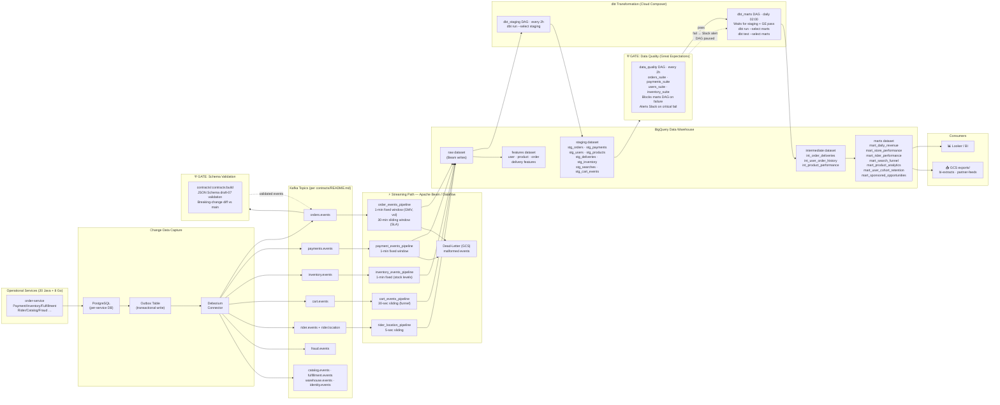
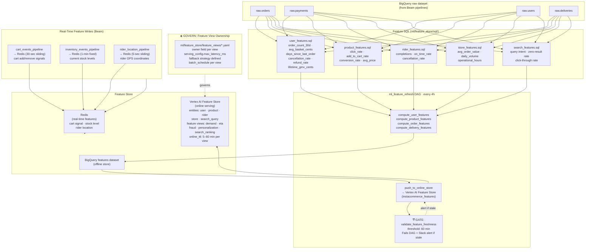
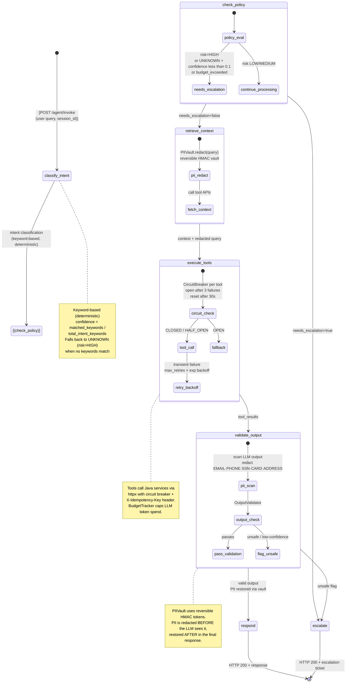
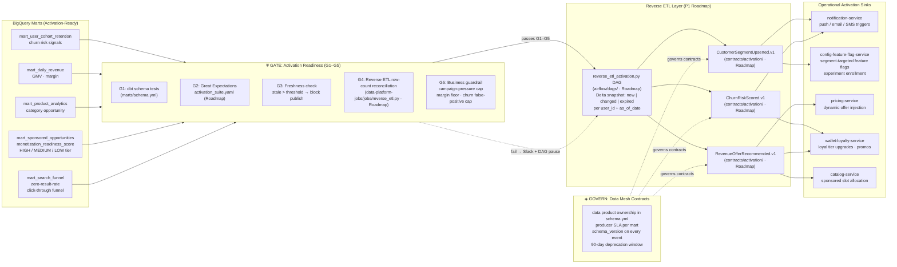
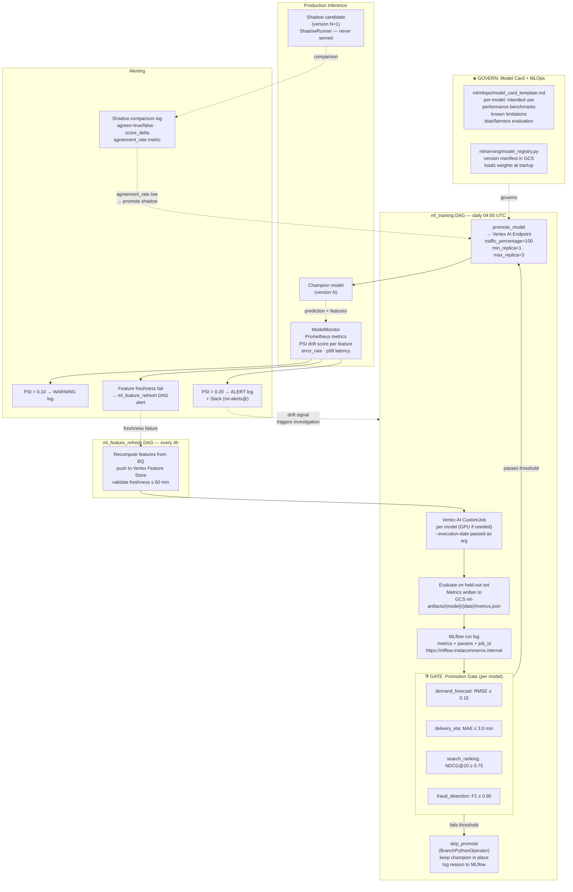

# Iteration-3 · Data Platform Dataflow Diagrams
**Principal Review — InstaCommerce**  
_All evidence sourced from repo artefacts in `data-platform/`, `ml/`, `services/ai-*`, `contracts/`, and `services/stream-processor-service/`._

---

## How to read these diagrams

| Symbol / style | Meaning |
|---|---|
| `⛨ GATE` label | Quality gate or governance checkpoint — failure blocks progress |
| `◈ GOVERN` label | Governance checkpoint — schema version, ownership, or compliance check |
| `→` solid arrow | Synchronous or near-real-time data movement |
| `-→` dashed arrow | Async, scheduled, or indirect signal |
| Red/`:::alert` nodes | Known gaps, risks, or unimplemented paths (Roadmap items) |

---

## Diagram 1 — End-to-End: Operational Events → Analytics Warehouse

> **Scope:** how every write in a transactional service eventually becomes a queryable row in BigQuery.  
> Two paths exist: a **streaming path** (sub-minute latency) and a **batch/dbt path** (hours).

**Notes:**
- Every service uses the **outbox + Debezium** pattern — no direct DB coupling between services.
- `orders.events`, `payments.events`, `inventory.events`, `cart.events`, `rider.location` each have a dedicated Beam pipeline. Dead-letters land in `gs://instacommerce-dataflow/dead-letter/`.
- `dbt_marts` waits on `ExternalTaskSensor` for `dbt_staging` + Great Expectations gate; marts are never built on dirty data.
- `mart_sponsored_opportunities` computes a `monetization_readiness_score` — HIGH/MEDIUM/LOW opportunity tier per store+category.

---

## Diagram 2 — Feature Pipeline: Events → Feature Store → Online Serving

> **Scope:** how raw events are transformed into low-latency features available to ML models at inference time.

**Notes:**
- `ml_feature_refresh` runs every 4 hours and pushes to **Vertex AI Feature Store** via `entity_type.ingest_from_bq()`.
- Redis holds the freshest signals (cart, stock, location) — read by `ai-inference-service` via `feature_store_backend=redis`.
- The `fraud_detection_view.yaml` defines `online_ttl_minutes: 5` and `max_latency_ms: 100` with a `rules_based` fallback — critical safety net if the feature store is unavailable.
- Five **feature view YAML files** carry explicit `owner`, `serving_config`, and `model_refs` — this is the governance anchor.

---

## Diagram 3 — ML Inference: Request-Time Scoring

> **Scope:** how a live request through `ai-inference-service` becomes a model score, with shadow mode, caching, and monitoring.

```mermaid
flowchart LR
    subgraph callers["Callers"]
        fraud_svc["fraud-detection-service\n(Java) at checkout"]
        pricing_svc["pricing-service\n(Java) demand signal"]
        search_svc["search-service\n(Java) ranking"]
        bff["mobile-bff-service\n(Java) personalization · ETA"]
    end

    subgraph inf["ai-inference-service (FastAPI :8000)"]
        cache["LRU Cache\nttl: 5 min · max 1000 items\n(env AI_INFERENCE_CACHE_*)"]
        feat_read["Feature Read\nVertex AI Feature Store (batch)\nor Redis (real-time)\nor BigQuery fallback"]

        subgraph models["Model Predictors"]
            eta["eta_predictor\nlinear regression\neta-linear-v1"]
            rank["ranking_predictor\nlearning-to-rank\nranking-linear-v1"]
            fraud["fraud_predictor\nlogistic / XGBoost\nfraud-logit-v1\nauto_approve: <30\nsoft_review: 30–70\nblock: >70"]
            person["personalization_predictor\ncollaborative filtering"]
            demand["demand_predictor\ntime-series / gradient boost"]
            clv["clv_predictor\nsurvival model"]
        end

        shadow["ShadowRunner\n(ml/serving/shadow_mode.py)\nruns candidate in background\ntimeout: 1s\nnever serves shadow result\nlogs agreement_rate"]
        monitor["ModelMonitor\n(ml/serving/monitoring.py)\nPrometheus: prediction_count\nprediction_latency_seconds\nmodel_error_rate\nmodel_drift_psi"]
        registry["ModelRegistry\n(ml/serving/model_registry.py)\nloads weights from GCS\nmanages model versions"]
    end

    subgraph gate5["⛨ GATE: Promotion Gate (Airflow ml_training)"]
        pg_demand["demand_forecast\nRMSE ≤ 0.15 (minimize)"]
        pg_eta["delivery_eta\nMAE ≤ 3.0 min (minimize)"]
        pg_rank["search_ranking\nNDCG@10 ≥ 0.75 (maximize)"]
        pg_fraud["fraud_detection\nF1 ≥ 0.90 (maximize)"]
    end

    subgraph prom["Prometheus / Grafana"]
        p_drift["model_drift_psi\nPSI > 0.10 → WARNING\nPSI > 0.20 → ALERT"]
        p_err["model_error_rate"]
        p_lat["prediction_latency_p99"]
    end

    callers --> cache
    cache -. "hit" .-> callers
    cache -. "miss" .-> feat_read
    feat_read --> models
    models --> shadow
    models --> monitor
    monitor --> prom
    shadow -. "comparison logged\nnot served" .-> monitor

    gate5 -- "promoted model\n→ Vertex AI Endpoint" --> registry
    registry --> models

    p_drift -. "PSI > 0.2 alert\n→ triggers retrain" .-> gate5
```

**Notes:**
- The inference service exposes a **single HTTP endpoint per model type** with `POST /predict/{model_name}`.
- `ShadowRunner` uses a `ThreadPoolExecutor(max_workers=4)` — shadow predictions timeout after 1 s and are discarded, never served.
- `ModelMonitor.check_drift()` uses **Population Stability Index (PSI)**; bins recent predictions against the training baseline distribution.
- Feature freshness is checked per-request via `check_freshness()` with a configurable `max_age_s` (default 1 h).
- The `fraud_predictor` has three scoring thresholds: **auto_approve < 30**, **soft_review 30–70**, **block > 70** — these map directly to the `fraud-detection-service` decision path.

---

## Diagram 4 — AI Agent Flow: LangGraph Orchestrator

> **Scope:** the `ai-orchestrator-service` LangGraph state machine — from inbound query to response or human escalation.

**Governance checkpoints in the AI agent path:**

| Checkpoint | Where | What it enforces |
|---|---|---|
| `◈ GOVERN: PII Redaction` | `guardrails/pii.py` | PII stripped before LLM, restored after via HMAC vault |
| `◈ GOVERN: Injection Guard` | `guardrails/injection.py` | Prompt injection pattern detection on inbound query |
| `◈ GOVERN: Rate Limiter` | `guardrails/rate_limiter.py` | Per-user/IP request throttling |
| `◈ GOVERN: Output Validator` | `guardrails/output_validator.py` | Schema + safety check on LLM output before serving |
| `◈ GOVERN: Escalation` | `guardrails/escalation.py` | Routes high-risk / low-confidence to human agent |
| `⛨ GATE: Budget Tracker` | `graph/budgets.py` | Caps LLM token spend per session; raises `BudgetExceededError` → escalate |

**Notes:**
- Intent classification is **fully deterministic** (keyword scoring), not LLM-based — latency predictable, debuggable, no hallucination risk at the routing layer.
- Circuit breakers wrap every downstream Java service call from the orchestrator tools — failure in one service (e.g., `order-service`) does not cascade to the AI agent.
- PII vault uses **HMAC-keyed token mapping** with a per-instance `threading.Lock` — thread-safe for the asyncio event loop + thread pool.

---

## Diagram 5 — Reverse-ETL and Activation Loops

> **Scope:** how warehouse insights flow back to operational services to close the product loop.  
> **Status:** partially roadmap — see notes.

> ⚠️ **Roadmap gap:** `reverse_etl_activation.py` DAG, `data-platform-jobs/jobs/reverse_etl.py`, and `contracts/activation/*.v1.json` schemas are defined in `docs/architecture/WAVE2-DATA-ML-ROADMAP-B.md` as P1 work but **do not yet exist in the repo**. The activation pathway currently ends at mart materialization and GCS exports only.

---

## Diagram 6 — Feedback Loops: Production → Retraining → Promotion

> **Scope:** the closed loop from live model performance back to training, covering drift detection, shadow mode, and CI/CD promotion gates.

**Notes:**
- The feedback loop has **two trigger paths**: (a) scheduled daily retraining regardless of drift, (b) PSI > 0.20 alert that drives on-demand investigation and potentially an off-schedule retrain.
- `ShadowRunner.agreement_rate` is logged but **not yet wired to an automatic promotion trigger** — it requires manual review of shadow comparison logs. This is a gap.
- All model promotions go through `Vertex AI Endpoint.deploy()` with `traffic_percentage=100`; there is **no gradual canary rollout** in the current DAG — a gap for high-risk models like `fraud_detection`.
- `ml/mlops/model_card_template.md` exists as a governance artefact but **model cards are not yet auto-generated** as part of the promotion pipeline.
- MLflow at `https://mlflow.instacommerce.internal` is the experiment tracking store; all training runs log metric + job_id for lineage.

---

## Diagram 7 — Unified Quality Gate Map

> **Scope:** all quality gates and governance checkpoints across the full data + ML + AI stack, in execution order.

```mermaid
flowchart LR
    subgraph ci["CI (every PR — .github/workflows/ci.yml)"]
        ci1["◈ GOVERN: contracts:build\nProto compilation + JSON Schema validation\nBreaking-change diff vs main\nConsumer deserialization test"]
        ci2["⛨ GATE: Gitleaks\nSecret scanning"]
        ci3["⛨ GATE: Trivy\nContainer + dependency CVEs"]
    end

    subgraph ingest["Data Ingestion"]
        g_dlq["⛨ GATE: Beam Dead-Letter\nMalformed events → GCS DLQ\nDoes not block pipeline"]
        g_schema["◈ GOVERN: Event Envelope\nevent_id · aggregate_id · schema_version\nsource_service · correlation_id required"]
    end

    subgraph warehouse["Warehouse Build"]
        g_stg["⛨ GATE: dbt test (staging)\nschema + not_null + unique tests\nBlocks marts DAG via ExternalTaskSensor"]
        g_ge["⛨ GATE: Great Expectations\norders · payments · users · inventory suites\nFreshness + volume + enum + range\nSlack alert + DAG pause on critical fail"]
        g_mart["⛨ GATE: dbt test (marts)\nrelationships + accepted_values\nBlocks BI + activation publish"]
    end

    subgraph features["Feature Pipeline"]
        g_fresh["⛨ GATE: Feature Freshness\n≤ 60 min threshold\nFails DAG + Slack if stale\nPer-feature row-count validation"]
        g_fv["◈ GOVERN: Feature View YAML\nowner · serving_config · max_latency_ms\nfallback strategy required\nml/feature_store/feature_views/*.yaml"]
    end

    subgraph ml_train["ML Training"]
        g_promo["⛨ GATE: Promotion Gate\nPer-model metric threshold\ndirection: minimize | maximize\nBranchPythonOperator → promote | skip"]
        g_mc["◈ GOVERN: Model Card\nml/mlops/model_card_template.md\n(Manual today · auto-gen gap)"]
    end

    subgraph serving["ML Serving"]
        g_psi["⛨ GATE: PSI Drift\nPSI > 0.10 WARNING\nPSI > 0.20 ALERT + retrain signal\nml/serving/monitoring.py"]
        g_shadow["◈ GOVERN: Shadow Mode\nShadowRunner — agreement_rate logged\n(Manual promotion review today)"]
        g_feat_age["⛨ GATE: Feature Staleness\ncheck_freshness() per request\nmax_age_s: 3600"]
    end

    subgraph ai_agent["AI Agent"]
        g_pii["◈ GOVERN: PII Vault\nredact before LLM · restore after\nguardrails/pii.py"]
        g_inj["⛨ GATE: Injection Guard\nguardrails/injection.py"]
        g_budget["⛨ GATE: Budget Tracker\nLLM token cap per session\ngraph/budgets.py → BudgetExceededError"]
        g_out["⛨ GATE: Output Validator\nguardrails/output_validator.py"]
    end

    subgraph activation["Activation / Reverse-ETL (Roadmap P1)"]
        g_act1["⛨ GATE: G4 Row-Count Reconciliation\n(data-platform-jobs · not yet implemented)"]
        g_act2["⛨ GATE: G5 Business Guardrail\ncampaign pressure cap · margin floor\n(prometheus-rules.yaml · partial)"]
    end

    ci --> ingest --> warehouse --> features --> ml_train --> serving --> ai_agent
    warehouse --> activation
```

---

## Assessment

### ✅ Done / Solid

| Area | Evidence |
|---|---|
| Event contract governance | `contracts/README.md`: envelope standard, JSON Schema draft-07, proto compilation, breaking-change detection in CI, 90-day deprecation window |
| Streaming pipelines | 5 Beam/Dataflow pipelines with fixed/sliding windows, dead-letter sinks, correct schema parsing |
| dbt layering | `stg_*` → `int_*` → `mart_*` strictly separated; `ExternalTaskSensor` dependency chain enforced in Airflow |
| Great Expectations gates | 4 suites (orders, payments, users, inventory); DAG fails and Slack-alerts on critical expectation failure |
| Feature store structure | 5 entities, 5 feature groups, 5 feature views with owner + serving config + fallback defined in YAML |
| Promotion gates | Per-model metric thresholds in `ml_training` DAG; `BranchPythonOperator` blocks bad models from reaching production |
| Model monitoring | `ModelMonitor`: PSI drift (warning/alert thresholds), prediction count, latency histogram, error rate — all Prometheus-backed |
| Shadow mode | `ShadowRunner` — async, timeout-bounded, never serves shadow result, logs agreement rate |
| AI agent guardrails | PII vault, injection guard, rate limiter, output validator, escalation, budget tracker — all wired into LangGraph nodes |
| Fraud scoring thresholds | `fraud_detection_view.yaml`: auto_approve/soft_review/block thresholds; `rules_based` fallback |
| MLflow experiment tracking | `ml_training` DAG logs metrics + job_id + params for lineage |
| Reverse-ETL roadmap | `docs/architecture/WAVE2-DATA-ML-ROADMAP-B.md` has detailed P0/P1/P2 LLD including gate IDs G1–G5 |

### 🔶 Needs More Work

| Gap | Risk | Recommendation |
|---|---|---|
| Reverse-ETL DAG and jobs not implemented | Analytics insights cannot currently reach operational services (notification, pricing, loyalty) systematically | Implement `reverse_etl_activation.py` DAG + `data-platform-jobs/jobs/reverse_etl.py` per roadmap P1 |
| `activation/*.v1.json` contract schemas missing | `CustomerSegmentUpserted`, `ChurnRiskScored`, `RevenueOfferRecommended` exist only in roadmap doc — not in `contracts/` | Create schemas, add to contracts CI validation |
| Shadow mode not wired to auto-promotion | `ShadowRunner.agreement_rate` is logged but not read by any DAG or alert | Add Prometheus `shadow_agreement_rate` gauge; alert when < threshold, trigger human review |
| Fraud model canary rollout absent | `fraud_detection` promotion deploys at `traffic_percentage=100` — no blue/green or canary | Add staged rollout: 10% → 50% → 100% with auto-rollback on F1 regression |
| Model card auto-generation not implemented | `ml/mlops/model_card_template.md` exists as template but is never populated by the training DAG | Add a `generate_model_card` task after `promote_model` in `ml_training` DAG |
| `monitoring_alerts` DAG content unknown | `monitoring_alerts.py` exists but was not fully available — coverage of drift → retrain trigger unclear | Verify drift alert → `ml_training` DAG trigger is wired (not just manual investigation) |
| Great Expectations activation suite missing | `activation_suite.yaml` referenced in roadmap but absent in `data-platform/quality/expectations/` | Required before reverse-ETL publish path is trustworthy |
| No streaming quality gate | Dead-letter sink exists but there is no alert on DLQ volume growth | Add `monitoring_alerts` check on DLQ row count + alert threshold |

### 🚫 Blockers / Questions

| Item | Question |
|---|---|
| **Reverse-ETL ownership** | Who owns `data-platform-jobs/jobs/reverse_etl.py`? Data Engineering or ML Engineering? The roadmap lists both. Needs explicit CODEOWNERS assignment before implementation starts. |
| **Identity events → feature pipeline** | `identity.events` (`UserErased`) must propagate GDPR erasure to the feature store and BigQuery. There is no current diagram or implementation of this deletion path. Is this handled? |
| **`mart_sponsored_opportunities` consumer** | This mart produces `monetization_readiness_score` but there is no consuming service or activation job. Is this feeding a DSP or an internal ad-serving product? |
| **Vertex AI Feature Store billing region** | `FEATURE_STORE_REGION = "us-central1"` in `ml_feature_refresh.py`. If users/orders are EU-resident, this may conflict with GDPR data-residency requirements. |
| **MLflow availability** | `MLFLOW_TRACKING_URI = "https://mlflow.instacommerce.internal"` — is this a managed service or self-hosted? If self-hosted, it is a single point of failure for the training DAG. |
