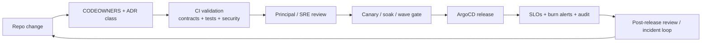
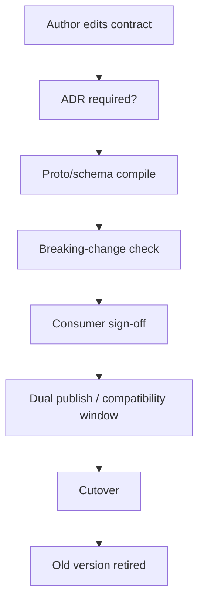
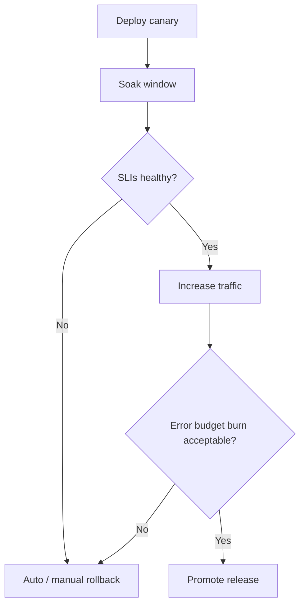

# InstaCommerce Principal Engineering Implementation Guide — Platform Wise

**Date:** 2026-03-06  
**Audience:** CTO, Principal Engineers, Staff Engineers, Platform, SRE, Security, Data/ML, AI  
**Scope:** Cross-cutting platform implementation guidance for contracts, infra, SRE, security, data, ML, AI, testing, and governance.  
**Supporting docs:**  
- `docs/reviews/PRINCIPAL-ENGINEERING-REVIEW-ITERATION-2-2026-03-06.md`  
- `docs/reviews/PRINCIPAL-ENGINEERING-IMPLEMENTATION-PROGRAM-2026-03-06.md`  
- `docs/architecture/ITER3-HLD-DIAGRAMS.md`  
- `docs/reviews/ITER3-DATAFLOW-PLATFORM-DIAGRAMS-2026.md`

---

## 1. Executive summary

The platform-side problem is not a lack of tooling. It is a lack of **enforced truth**.

Iteration 3 showed that the platform already has many of the right primitives:

- Istio and mTLS
- GitOps and Terraform
- outbox + Debezium + Kafka
- data platform directories and ML pipelines
- feature flags, fraud, audit, and AI guardrail intent

But the controlling weakness is this: **the guardrails are not yet strong enough to make the rest of the repo trustworthy.**

This guide therefore focuses on the platform work that makes every service cluster safer:

1. truthful contracts and CI  
2. real trust boundaries  
3. deploy lineage and rollout safety  
4. measurable SLO governance  
5. event-time and ML/AI operational correctness  

---

## 2. Platform priorities in order

| Priority | Platform area | Why it comes first |
|---|---|---|
| P0 | Repo truth, ownership, and CI coverage | without this, every later control is performative |
| P1 | Security and trust boundaries | current shared-token and mesh-auth gaps are too broad |
| P1 | Contracts and event governance | silent schema drift can break the whole platform |
| P1 | Infra / GitOps deployment lineage | CI and deploy must reference the same artifacts |
| P1 | Observability and rollback controls | you cannot harden what you cannot see or reverse |
| P2 | Data platform correctness | event-time and idempotency errors poison downstream decisions |
| P2 | ML productionization | real models, real promotion gates, real rollback |
| P3 | Governed AI rollout | only after the above controls exist |

---

## 3. Platform operating model

**Interpretation:** The platform must become a closed governance loop, not a set of disconnected tools.

---

## 4. Truth, ownership, and documentation governance

### Current reality

The repo still has truth drift across docs, CI, deployment paths, and claimed capabilities. There is no durable ownership layer (`CODEOWNERS`) and some reviews/subsystems overstate maturity relative to code.

### Must-fix items

- fix broken CI references and incomplete path coverage
- add `.github/CODEOWNERS`
- make `docs/README.md` the explicit index of authoritative engineering docs
- remove or annotate misleading claims about schema technology, runtime coverage, and deploy maturity

### Implementation guidance

1. **Truth sources**
   - `settings.gradle.kts` and `.github/workflows/ci.yml` remain canonical for module inventory and CI coverage
   - `docs/README.md` becomes the canonical index for architecture/review/program docs
2. **Ownership**
   - every top-level service directory, `contracts/`, `deploy/helm/`, `infra/terraform/`, `data-platform/`, and `ml/` gets an owner in `CODEOWNERS`
3. **Change classes**
   - add branch-protection policy tying change classes to approver types

### Recommended path

- implement ownership and doc truth in the same wave as CI repair
- treat unverified architecture claims as defects, not style issues

---

## 5. Contracts and event governance

### Current reality

Contracts are one of the most important platform surfaces and one of the least enforced. Iteration 3 found ghost events, duplicate schema names, singular/plural topic drift, and a confusing split between envelope intent and actual message-body semantics.

### Must-fix items

| Issue | Why it matters |
|---|---|
| Envelope/body mismatch | consumers cannot rely on a uniform parse model |
| Ghost events without schema | platform-wide breaking changes can ship silently |
| No CI breaking checks | documented compatibility posture is not real |
| Duplicate schema names with incompatible shapes | semantically same names mean different things |
| Dual legacy topics still alive | cutover and ownership remain ambiguous |

### Implementation options

| Option | Summary | Recommendation |
|---|---|---|
| A | Shared publish/consume libraries + CI compatibility checks | **Do now** |
| B | Full registry-centric governance from day one | Later, once A is stable |
| C | Manual review only | Reject |

### Recommended platform standard

- one canonical envelope library per language stack
- `buf breaking` for proto changes
- JSON schema compatibility validation for event schemas
- explicit compatibility windows and versioned deprecation policy
- one topic naming standard documented and CI-checked

### Validation

- contract CI must fail on field deletion or incompatible type changes
- consumers must have explicit sign-off for breaking changes
- event deserialization failures must be dashboarded

---

## 6. Security and trust boundaries

### Current reality

mTLS exists, but too much trust is still implicit. A shared internal token grants overbroad privilege, workload identity is incomplete, and mesh authorization is missing across much of the fleet.

### Must-fix items

- remove `ROLE_ADMIN` from shared-token internal auth paths
- complete KSA↔GSA workload identity binding
- add AuthorizationPolicy coverage beyond the few currently protected services
- explicitly deny unsafe admin and internal surfaces by default
- standardize secret retrieval and prevent fallback to broad node credentials

### Recommended target state

- transport identity from Istio/mTLS
- workload identity for cloud API access
- per-service authorization policy for east-west calls
- no static shared secret as the primary internal trust primitive

### Migration strategy

1. deny unsafe entrypoints now
2. reduce internal auth privileges immediately
3. add AuthorizationPolicy allow-lists service-by-service
4. complete workload identity rollout
5. remove shared token from critical paths

### Rollback

- authorization policies can be narrowed by namespace and canaried
- workload identity rollout should be staged per cluster
- shared token remains temporary fallback only during migration, not permanent dual mode

---

## 7. Infra, GitOps, and deployment lineage

### Current reality

The biggest single platform-side defect is the image registry mismatch: CI and Helm values do not agree on the image repositories that matter. That breaks the chain of evidence between code, built artifact, and deployed runtime.

### Must-fix items

- unify CI image push target with Helm dev/prod image references
- ensure every built service has a deploy surface if it is meant to run
- make rollout progression explicit instead of implicit documentation
- stop treating GitOps as complete while artifact lineage is broken

### Recommended path

1. fix registry naming and values files first
2. verify Argo sees the same tags CI produces
3. add deploy validation for Python and data surfaces where appropriate
4. only then introduce progressive delivery, canaries, or multi-region designs

### Do not do yet

- do not start cell or multi-region work before lineage, ownership, and rollback truth are repaired
- do not add more rollout tooling if the artifact chain is still inconsistent

---

## 8. Observability, resilience, and SRE

### Current reality

The repo has decent instrumentation coverage and some healthy probe patterns, but it still lacks the controls that separate instrumentation from true SRE maturity: burn-rate alerts, committed alert routing, explicit timeout budgets, and resilient Java client patterns.

### Must-fix items

- add multi-window error-budget burn-rate alerts
- commit Alertmanager routing config to the repo
- add Resilience4j circuit breakers and explicit timeout budgets to Java hot paths
- connect readiness to actual dependency health where relevant
- add DLT volume and consumer lag alerting for critical async paths

### Recommended platform standard

| Area | Standard |
|---|---|
| SLOs | one owner, one window, one error-budget policy per critical flow |
| Alerts | burn-rate, not threshold-only, for user-impacting flows |
| Timeouts | explicit per-hop budgets on HTTP/gRPC clients |
| Circuit breaking | default on all hot-path Java outbound dependencies |
| Rollback | alert routing and rollback commands documented before rollout |

### Example rollout-governance flow

---

## 9. Testing, quality, and release governance

### Current reality

Iteration 3 confirmed that the service fleet has effectively no meaningful test coverage and that CI often passes vacuously. This is not just a quality problem; it is why obvious contract mismatches survived into production-facing code.

### Must-fix items

- add real integration tests for money path, inventory path, and key contract seams
- add contract CI for `contracts/`
- add load tests for checkout, payment, and dispatch
- establish minimum review and ownership rules via CODEOWNERS
- define change classes and release approval policy

### Recommended wave pattern

| Wave | Quality focus |
|---|---|
| Wave 0 | CODEOWNERS, contract CI, repo truth |
| Wave 1 | transactional integration tests |
| Wave 2 | logistics integration and soak tests |
| Wave 3 | search/pricing/cart regression and replay tests |
| Wave 4 | data/ML validation and backfill comparison |
| Wave 5 | chaos drills and burn-rate policy enforcement |

---

## 10. Data platform correctness

### Current reality

The data platform has meaningful structure but not yet trustworthy semantics. The largest issue is that the Beam pipelines use processing time rather than event time, which invalidates late-data behavior for analytics, model features, and reverse-ETL decisions.

### Must-fix items

- assign event timestamps into Beam elements explicitly
- add allowed lateness, watermarking, and correct window semantics
- stop using `latest` in ways that can skip data on restart
- remove append-only assumptions where upsert/merge semantics are required
- fix broken DAG/file references and add CI gates for dbt and Python jobs

### Recommended path

1. repair broken DAG/file references
2. make event-time semantics correct
3. add dbt parse/test CI
4. add BQ upsert/merge strategy for aggregate outputs
5. only then add reverse-ETL and activation outputs

### Key governance rule

No reverse-ETL may target operational services directly until quality gates, reconciliation, and ownership are explicit.

---

## 11. ML platform operations

### Current reality

The ML platform has strong scaffolding—training pipelines, shadow mode, predictor abstractions—but not yet production truth. The most important problem is not model quality in the abstract; it is that promoted artifacts are not always the ones actually serving, and shadow agreement is not durable enough to govern promotions.

### Must-fix items

- serve real ONNX artifacts in the live path
- persist shadow agreement and drift signals centrally
- require champion/challenger promotion gates
- keep rollback to previous champion fast and scriptable
- standardize feature names between data platform and training configs

### Recommended path

- treat model serving as a deployment problem, not just a training problem
- gate promotion on both offline metrics and live shadow agreement
- add explicit model-card and lineage requirements before “approved” status

---

## 12. AI platform and agent governance

### Current reality

The AI layer is promising but not yet ready for broad automation. The safest interpretation of the current repo is that AI should remain mostly read-only or propose-only until the rest of the platform becomes more trustworthy.

### Required platform controls

- PII redaction before LLM calls
- budget and rate limiting in-path
- tool registry with risk-tier policy
- durable checkpoints and audit trail
- human approval for write actions
- degrade-to-non-LLM behavior under outage or budget exhaustion

### Recommended adoption ladder

1. **Advisory only**: support, retrieval, ranking assistance, investigation assistance
2. **Human-approved proposals**: substitution suggestion, incident response suggestions, ops recommendation
3. **Bounded execution**: only after HITL, rollback, and audit are proven

### Explicit non-goal for now

Do not place AI in authoritative control of payment, inventory reservation, dispatch, or order state transitions.

---

## 13. Platform wave recommendations

| Wave | Platform outcome required |
|---|---|
| Wave 0 | truthful CI, ownership, docs, deploy lineage |
| Wave 1 | secure trust boundaries and money-path rollout safety |
| Wave 2 | logistics DLT, assignment authority, closed operational loop |
| Wave 3 | customer-facing decision surfaces stop lying |
| Wave 4 | contracts, eventing, data, and ML become governable |
| Wave 5 | SLOs and error budgets become the operating language |
| Wave 6 | AI expands only under enforced policy and rollback |

---

## 14. Final recommendation

The platform work should be judged by one standard: **does it make the rest of the repo safer to change?**

Right now, the most important platform deliverables are not “more infrastructure.” They are:

- truthful CI and ownership
- enforced contracts
- real trust boundaries
- deploy lineage that matches reality
- burn-rate-based operational control
- event-time/data correctness
- production ML/AI governance that is narrower and stricter than the product ambition

If those are implemented, the service-level improvements become sustainable. If they are not, the repo will continue to look more mature in architecture diagrams than in production behavior.
