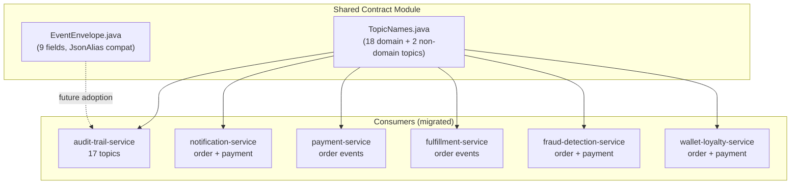
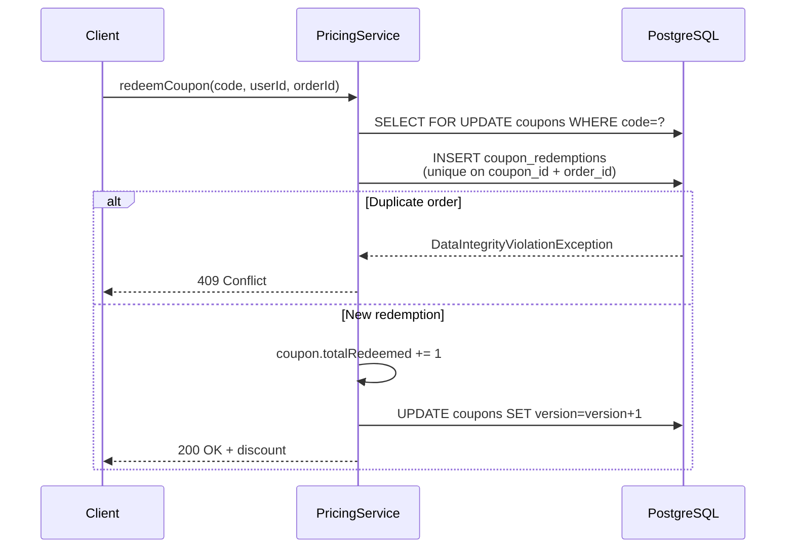
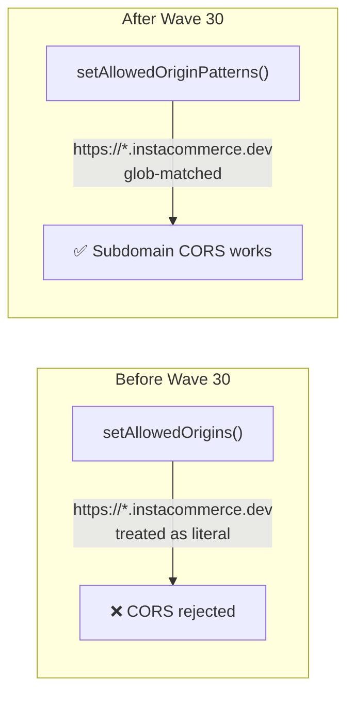

# Wave 30: Contract Governance, Money-Path Safety & Production Hardening

**Date**: 2026-03-14
**Branch**: `feat/wave30-contract-governance-production-hardening`
**PR**: #184
**Scope**: 6 tracks across 22+ services, ~60 files changed

---

## Summary

Wave 30 addresses critical P0/P1 gaps identified in the Iteration 3 principal engineering review. Focus areas: eliminating hardcoded Kafka topic strings via shared constants, fixing money-path concurrency bugs, correcting CORS misconfiguration across the fleet, and removing deprecated dead code.

---

## Track A: Contract & Topic Governance (P0)

**Problem**: 9 Kafka consumers used hardcoded topic strings with inconsistent singular/plural naming (`order.events` vs `orders.events`). 7 independent `EventEnvelope` record definitions existed with no shared contract. No compile-time topic validation.

**Changes**:
- Created `contracts/src/main/java/com/instacommerce/contracts/topics/TopicNames.java` -- 18 domain event topics, 2 non-domain topics, DLT suffix constant
- Created `contracts/src/main/java/com/instacommerce/contracts/events/EventEnvelope.java` -- shared record with `@JsonAlias` for snake_case compatibility, matching `EventEnvelope.v1.json` schema
- Updated `contracts/build.gradle.kts` with Jackson annotations dependency and Java sourceSets
- Migrated 9 consumers across 6 services (audit-trail, notification, payment, fulfillment, fraud-detection, wallet-loyalty) to `TopicNames` constants
- Resolved singular/plural split: fraud-detection and wallet-loyalty now subscribe only to canonical plural forms (`orders.events`, `payments.events`)
- Added `implementation(project(":contracts"))` to 6 service build files

---

## Track B: Money-Path Safety (P0)

**Problem**: Coupon entity lacked `@Version` (no optimistic lock protection), same order could redeem a coupon twice on retry. Loyalty `redeemPoints()` used `UUID.randomUUID()` as referenceId, defeating the idempotency index. Points expiry job used `Page` (COUNT query per page, expensive at scale). Wallet `reference_type` CHECK constraint was out of sync with Java enum.

**Changes**:
- **Coupon @Version**: Added `@Version` to `Coupon` entity + DB migration V8
- **Order-unique index**: Created `idx_coupon_redemption_order` on `(coupon_id, order_id)` preventing double-redemption per order
- **Loyalty idempotency fix**: Changed `redeemPoints()` to accept `orderId` parameter as idempotency key instead of random UUID; added `DataIntegrityViolationException` catch for duplicate handling; updated `RedeemPointsRequest` DTO and `LoyaltyController`
- **LoyaltyAccount @Version**: Added `@Version` + migration V10
- **Expiry job pagination**: Changed from `Page<LoyaltyAccount>` to `Slice<LoyaltyAccount>`, added `findAllBy(Pageable)` to repository (eliminates COUNT query)
- **CHECK constraint**: Migration V11 realigns `reference_type` to include `PROMOTION` and `ADMIN_ADJUSTMENT`

---

## Track C: CORS `setAllowedOriginPatterns` Fix (P1)

**Problem**: 16 Java services used `CorsConfiguration.setAllowedOrigins()` with pattern strings like `https://*.instacommerce.dev`. Spring's `setAllowedOrigins()` does NOT support glob patterns -- it treats `*` as a literal character. Only `setAllowedOriginPatterns()` supports wildcards. This meant subdomain CORS was silently broken across the fleet.

**Changes**: Fixed `setAllowedOrigins()` → `setAllowedOriginPatterns()` in 16 SecurityConfig files.

| # | Service | Status |
|---|---------|--------|
| 1-16 | search, warehouse, inventory, rider-fleet, config-feature-flag, fraud-detection, fulfillment, catalog, notification, order, audit-trail, pricing, identity, wallet-loyalty, cart, routing-eta | Fixed |
| 17 | payment-service | Already correct |
| 18 | checkout-orchestrator | Already correct |

---

## Track D: Fulfillment Inline Dispatch Dead Code Removal (Low)

**Problem**: Deprecated inline rider assignment code existed in fulfillment-service since Wave 23. Disabled by default via `fulfillment.dispatch.inline-assignment-enabled=false`. Superseded by event-driven dispatch through rider-fleet-service.

**Changes**:
- Removed inline dispatch if/else block from `PickService.publishPacked()`
- Deleted `RiderAssignmentService.java` (entire class, @Deprecated since wave-23)
- Removed deprecated `assignRider(PickTask)` method from `DeliveryService`
- Removed `Dispatch` inner class from `FulfillmentProperties`
- Removed `dispatch:` section from `application.yml`
- Deleted `PickServiceDispatchTest.java`

---

## Track E: Rider `@Version` + Order-Service Legacy Checkout Removal (Low)

**Problem**: `Rider` and `RiderAvailability` entities lacked `@Version` for optimistic locking -- concurrent status updates from assignment, recovery job, and availability toggles could produce lost updates. Order-service still contained 22 legacy checkout files from pre-Wave-22 Temporal saga, gated behind disabled flag.

**Changes**:
- **Rider optimistic locking**: Added `@Version` to `Rider` and `RiderAvailability` entities + migration V10
- **Legacy checkout removal**: Deleted 22 files including `CheckoutController`, `CheckoutWorkflow`, `CheckoutWorkflowImpl`, `WorkerRegistration`, 8 activity interfaces/implementations, 4 model DTOs, 2 request/response DTOs, 2 exception classes, 1 test, `TemporalConfig`, `TemporalProperties`
- Cleaned up `OrderProperties` (removed `Checkout` inner class), `application.yml` (removed Temporal + direct-saga config), `OrderServiceApplication` (removed `TemporalProperties` from `@EnableConfigurationProperties`)
- Preserved `CreateOrderCommand`, `InsufficientStockException`, `PaymentDeclinedException` (used by non-deprecated production code)

---

## Track F: Feature Flag Bulk Override Cache + Miscellaneous Fixes (P1)

**Problem**: Feature flag bulk evaluation always hit the database for overrides (uncached). Reconciliation engine Dockerfile referenced nonexistent Go 1.26 and wrong EXPOSE port. AI audit events omitted required `eventId` and `schemaVersion` fields.

**Changes**:
- **Bulk override caching**: Added `@Cacheable("flag-overrides-bulk")` to `findActiveOverridesByFlagIds` with 10s TTL; added `@CacheEvict` on mutation methods; created `CacheConfig` class
- **Reconciliation Dockerfile**: Fixed `golang:1.26-alpine` → `golang:1.24-alpine`; fixed `EXPOSE 8126` → `EXPOSE 8107`
- **AI audit envelope**: Added `eventId` (UUID) and `schemaVersion` ("1.0") to audit event envelope in `audit.py`

---

## Known Remaining Gaps (Wave 31+)

| Priority | Gap | Notes |
|----------|-----|-------|
| **P0** | VirtualService port mismatch | 11 services route to wrong port in Istio |
| **P0** | Outbox relay not wired | order, payment, cart, fulfillment outbox tables written but never sent to Kafka |
| **P0** | Test coverage minimal fleet-wide | Near-zero integration/unit test coverage |
| **P1** | Payment stuck-pending recovery sweeper | No recovery for intermediate payment states |
| **P1** | Redis migration for caches | All services use JVM-local Caffeine |
| **P1** | Circuit breakers on REST clients | Most services lack Resilience4j on outbound calls |
| **P2** | Feature flag cross-replica cache invalidation | Caffeine in-process, 30s worst-case between replicas |
| **P2** | Reconciliation engine DB/CDC wiring | Still file-based JSON approach |
| **Low** | Stuck rider recovery job | Disabled by default, now safe to enable with @Version |

---

## Appendix: Audit of Wave 29 (PR #183)

Wave 29 delivered 6 tracks (A-F):
- **Track A**: CI regression fixes (Go Docker gating, checkout test, notification build)
- **Track B**: Payment webhook durable publish-before-dedupe pattern
- **Track C**: Stream processor Redis-based event-ID deduplication
- **Track D**: AI orchestrator → audit-trail-service Kafka integration
- **Track E**: GDPR erasure (notification subject/body anonymization)
- **Track F**: Inventory storeId VARCHAR → UUID alignment

All CI checks passed. Key observation: the audit event envelope from Track D omitted `eventId` and `schemaVersion` (fixed in Wave 30 Track F).
