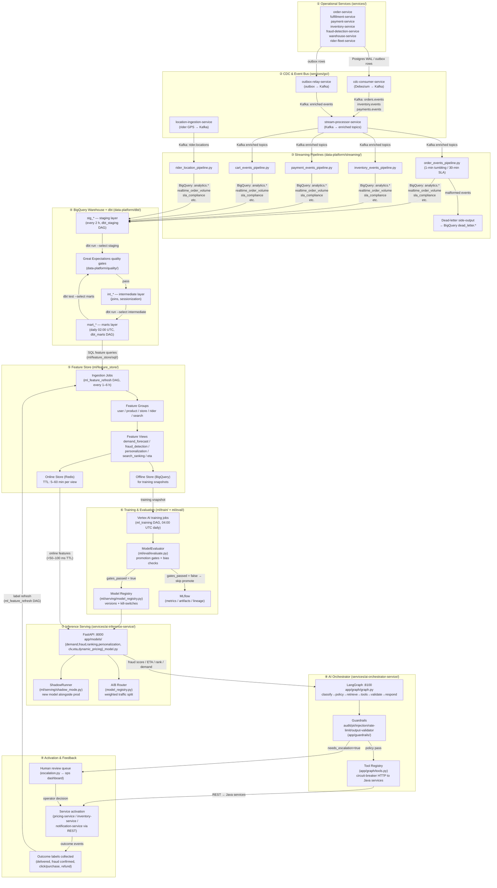
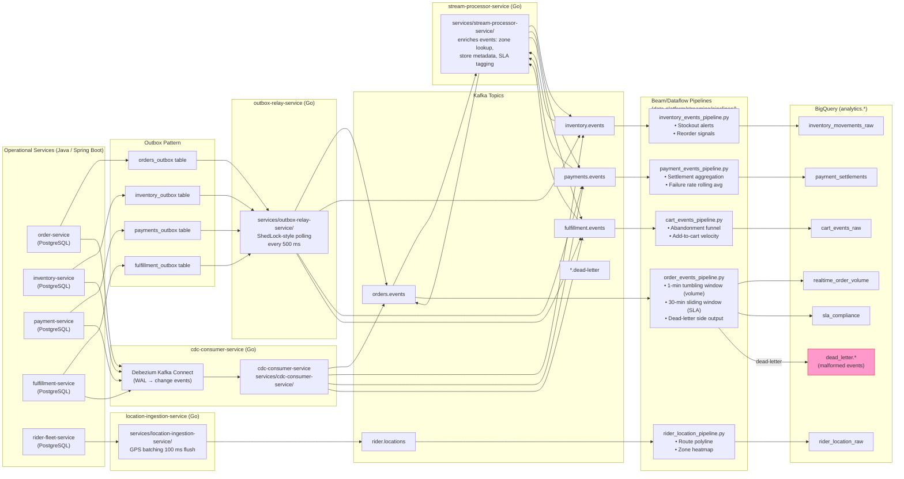
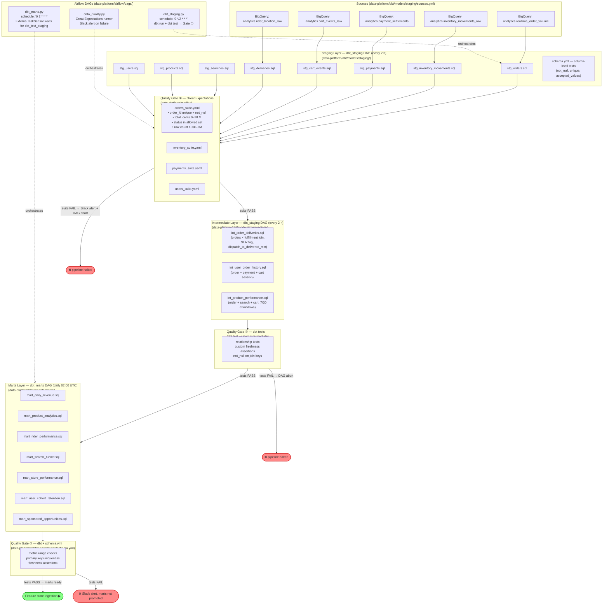
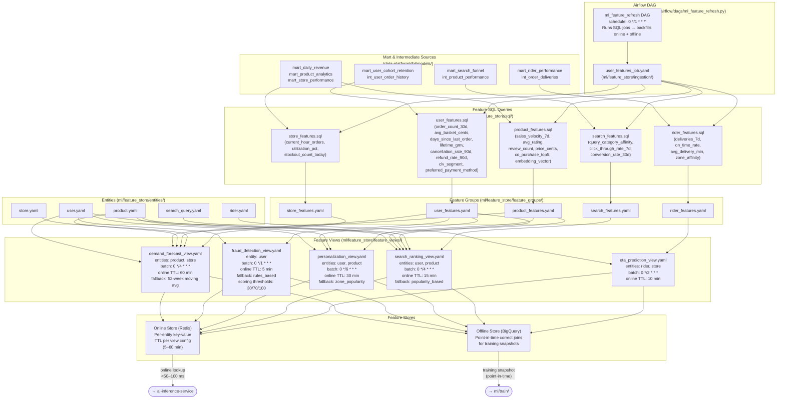
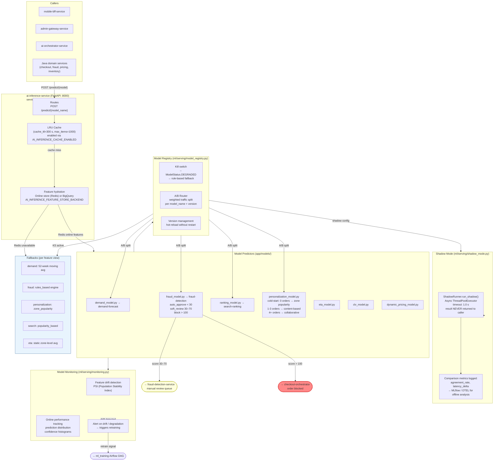
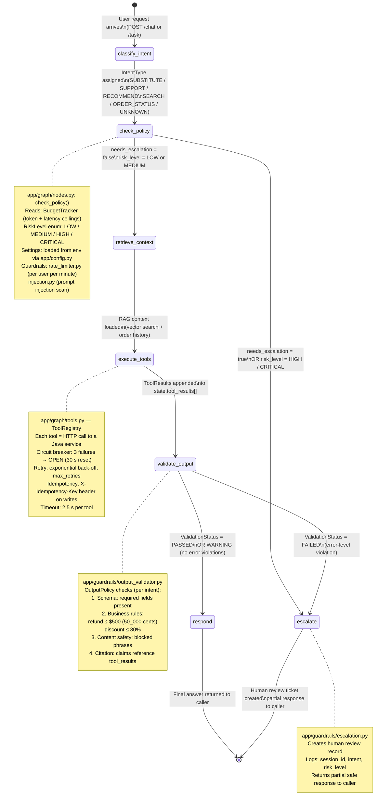
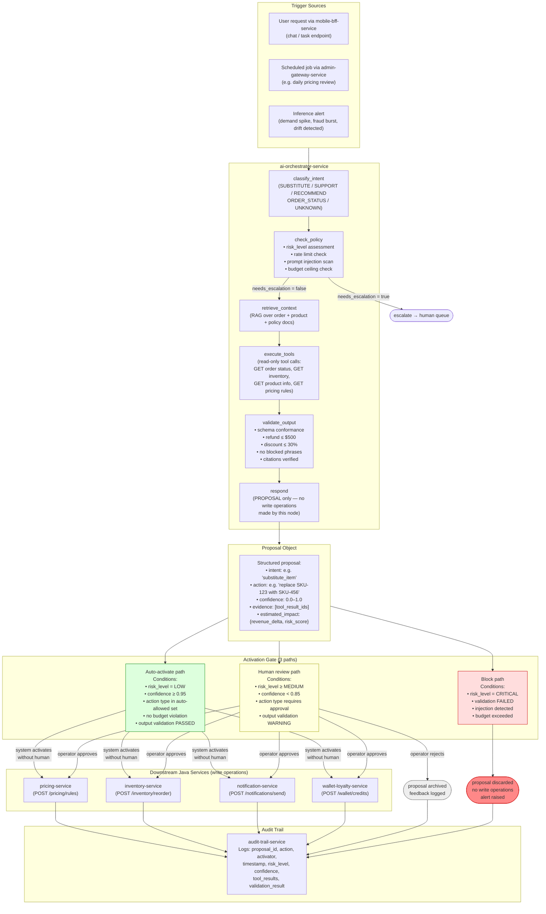
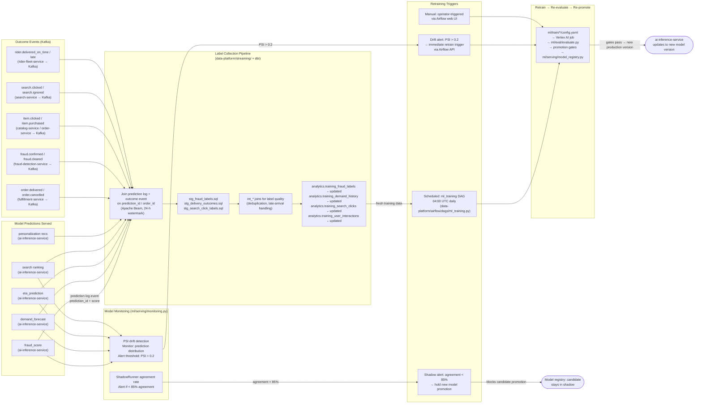
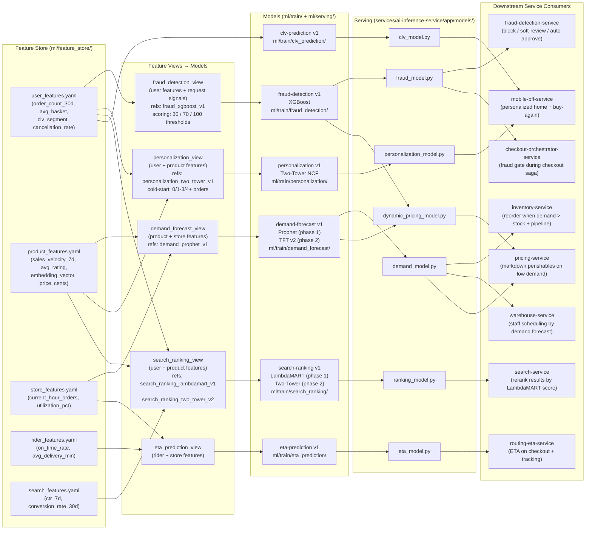

# Data → ML → AI Flow Diagrams

> **Iteration 3 · Diagram Series**  
> Scope: Operational events → BigQuery warehouse → dbt layers → feature store → model training/eval → inference serving → LangGraph AI-agent proposal loops → feedback and activation.  
> All folder references are relative to the repo root. All service names match `settings.gradle.kts` and `.github/workflows/ci.yml`.

---

## Contents

1. [Master End-to-End Flow](#1-master-end-to-end-flow)
2. [Event Ingestion and Streaming Pipeline](#2-event-ingestion-and-streaming-pipeline)
3. [dbt Warehouse Layers and Quality Gates](#3-dbt-warehouse-layers-and-quality-gates)
4. [Feature Store Pipeline](#4-feature-store-pipeline)
5. [Model Training and Evaluation Pipeline](#5-model-training-and-evaluation-pipeline)
6. [Inference Serving — Shadow Mode and A/B Routing](#6-inference-serving--shadow-mode-and-ab-routing)
7. [LangGraph AI Orchestrator State Machine](#7-langgraph-ai-orchestrator-state-machine)
8. [Safe Proposal-Only AI Loop](#8-safe-proposal-only-ai-loop)
9. [Feedback and Label Refresh Loop](#9-feedback-and-label-refresh-loop)
10. [Model and Feature Lineage Map](#10-model-and-feature-lineage-map)
11. [Control Points Summary](#11-control-points-summary)
12. [Late Data Handling Strategy](#12-late-data-handling-strategy)

---

## 1. Master End-to-End Flow

High-level view of every stage, with repo folder callouts. Subsequent sections zoom in on each numbered zone.



---

## 2. Event Ingestion and Streaming Pipeline

Shows the Go services that bridge operational databases to Kafka, and the Beam/Dataflow pipelines that land events in BigQuery.



**Control points:**
- `OrderEventParser.DEAD_LETTER` side output catches malformed events — every pipeline tags unparseable records without dropping them.
- `stream-processor-service` attaches zone / store metadata before events fan out to downstream consumers; missing metadata is logged but not blocking.
- Kafka topic names (`orders.events`, `inventory.events`, `payments.events`) are canonical in `contracts/`; changing them requires a new schema version.

**Late data handling:**
- Beam pipelines use `AfterWatermark` + `AfterProcessingTime` triggers with `ACCUMULATING` mode for the SLA window — late arrivals up to 30 minutes refire the window.
- Events older than the allowed late-data horizon land in the dead-letter table rather than mutating already-emitted aggregates.

---

## 3. dbt Warehouse Layers and Quality Gates



**Three quality gates in sequence:**

| Gate | Tool | Halts pipeline? | Notification |
|------|------|-----------------|--------------|
| ① Staging column tests | dbt schema.yml | Yes — DAG abort | Slack `data-alerts` |
| ① Row-level expectations | Great Expectations (`data_quality.py` DAG) | Yes | Slack `data-alerts` |
| ② Intermediate relationship tests | dbt test | Yes | Slack `data-alerts` |
| ③ Marts metric range + freshness | dbt schema.yml | Yes — marts not promoted | Slack `data-alerts` |

**Late data in dbt:** The `dbt_marts.py` DAG uses an `ExternalTaskSensor` with a 1-hour `timeout` and 2-minute `poke_interval`. If staging runs late, marts wait rather than running on stale data. Catchup is disabled (`catchup=False`) on all DAGs, so backfill must be triggered manually.

---

## 4. Feature Store Pipeline



**Feature lineage:** Every feature view carries `model_refs` (e.g., `demand_prophet_v1`, `fraud_xgboost_v1`) that link the serving view back to the specific trained model version. Adding a feature or changing a SQL query in `ml/feature_store/sql/` must be version-controlled alongside the consuming `config.yaml` under `ml/train/`.

**Late data handling in the feature store:**
- Each feature view defines `online_ttl_minutes` and a `fallback` strategy. If Redis data is stale or absent, inference falls back to the view-specific fallback (e.g., `52_week_moving_avg` for demand, `rules_based` for fraud).
- The `ml_feature_refresh` DAG runs hourly; if it fails, the online TTL naturally expires and the fallback activates within the TTL window — no manual intervention required for short outages.

---

## 5. Model Training and Evaluation Pipeline

```mermaid
flowchart TD
    subgraph OFFLINE_FS["Offline Feature Store\n(BigQuery, point-in-time snapshots)"]
        T1["analytics.training_demand_history\n(365 days, hourly, min 168 rows)"]
        T2["analytics.training_fraud_labels\n(180 days, label: is_fraud,\nclass_weight: auto)"]
        T3["analytics.training_search_clicks\n(90 days, group: query_id,\nlabel: relevance_label)"]
        T4["analytics.training_user_interactions\n(180 days, min 3 interactions/user)"]
        T5["analytics.training_demand_history\n(ETA variant)"]
        T6["analytics.training_user_interactions\n(CLV variant)"]
    end

    subgraph CONFIGS["Training Configs (ml/train/*/config.yaml)"]
        C1["demand_forecast/config.yaml\nmodel: demand-forecast v1\nobjective: time_series_forecast\nmetric: mape\nhyperparams: Prophet changepoint / seasonality\ngates: max_mape=0.08, min_accuracy=92%"]
        C2["fraud_detection/config.yaml\nmodel: fraud-detection v1\nobjective: binary_classification\nmetric: auc\nhyperparams: XGBoost max_depth=8, n_est=1000\ngates: min_auc_roc=0.98, max_fpr=0.05"]
        C3["search_ranking/config.yaml\nmodel: search-ranking v1\nobjective: lambdarank\nmetric: ndcg@10\nhyperparams: LightGBM LambdaMART\ngates: min_ndcg@10=0.65"]
        C4["personalization/config.yaml\nmodel: personalization v1\nobjective: recommendation\nmetric: ndcg@10\nhyperparams: Two-Tower NCF, embedding_dim=64\ngates: min_hit@10=0.30, min_ndcg@10=0.20"]
        C5["eta_prediction/config.yaml"]
        C6["clv_prediction/config.yaml"]
    end

    subgraph VERTEX["Vertex AI Training (GCP)\nOrchestrated by ml_training DAG\n(data-platform/airflow/dags/ml_training.py)\nschedule: '0 4 * * *'"]
        V1["demand-forecast training image\nn1-standard-8 + T4 GPU"]
        V2["fraud-detection training image\nn1-standard-4"]
        V3["search-ranking training image\nn1-standard-8 + T4 GPU"]
        V4["personalization training image\nn1-standard-8 + T4 GPU"]
    end

    subgraph EVAL["ModelEvaluator (ml/eval/evaluate.py)\nMlflow tracking: mlflow.instacommerce.internal"]
        EV1["compute_metrics()\nClassification: AUC-ROC, F1, precision, recall\nRegression: MAE, RMSE, MAPE, R²\nRanking: NDCG@10, MAP@10, MRR, Hit@10"]
        EV2["check_gates()\nmin_* / max_* threshold checks\nALL gates must pass"]
        EV3["bias_check()\nDemographic parity\nEqualized odds (TPR/FPR per group)\nDisparate impact ≥ 0.8 (4/5 rule)\nGroups: gender, age_bucket, city_tier, language"]
    end

    subgraph GATE{"Promotion Gate\n(BranchPythonOperator\nml_training DAG)"}
        PASS["gates_passed = true\nAND bias_check.passed = true"]
        FAIL_G["gates_passed = false\nOR bias_report.passed = false"]
    end

    subgraph REGISTRY["Model Registry (ml/serving/model_registry.py)"]
        MR["register() → clears kill switch\nA/B routing weights configured\nKill switch → forces DEGRADED\n→ rule-based fallback"]
        MLFLOW_LOG["MLflow: log_metrics()\nlog_param(execution_date, job_id)\nartifact: gs://{project}-ml-artifacts/{model}/{date}/"]
    end

    subgraph SKIP["Skip Promote Path"]
        SK["Model stays at previous version\nSlack alert: ml-alerts@instacommerce.com\nMLflow run tagged 'REJECTED'\nManual investigation required"]
    end

    T1 --> C1 --> V1
    T2 --> C2 --> V2
    T3 --> C3 --> V3
    T4 --> C4 --> V4

    V1 & V2 & V3 & V4 --> EV1 --> EV2 --> EV3 --> GATE

    GATE --> PASS --> MR --> MLFLOW_LOG
    GATE --> FAIL_G --> SKIP

    MLFLOW_LOG -->|"Vertex AI Endpoint deploy\ntraffic_percentage=100\nmin_replicas=1, max_replicas=3"| PROD_ENDPOINT(["Production Endpoint\n→ ai-inference-service"])

    style PASS fill:#8f8,stroke:#080
    style FAIL_G fill:#f88,stroke:#c00
    style SKIP fill:#ffd,stroke:#aa0
```

**Promotion gate details per model:**

| Model | Primary metric | Gate threshold | Bias groups |
|-------|---------------|----------------|-------------|
| `demand-forecast` | MAPE | ≤ 0.08 (8%) + accuracy ≥ 92% | N/A (time-series) |
| `fraud-detection` | AUC-ROC | ≥ 0.98 + FPR ≤ 0.05 | gender, age_bucket, city_tier |
| `search-ranking` | NDCG@10 | ≥ 0.65 + min improvement 2% | N/A |
| `personalization` | Hit@10 + NDCG@10 | ≥ 0.30 / 0.20 | N/A |
| `eta-prediction` | MAE (minutes) | ≤ 3.0 min | N/A |

**Minimum improvement guard:** Every config includes `min_improvement_pct` (1–3%). A new model that meets absolute thresholds but regresses versus the current production version is still rejected. This prevents silent degradation from noisy retraining runs.

---

## 6. Inference Serving — Shadow Mode and A/B Routing



**Shadow mode safety properties (`ml/serving/shadow_mode.py`):**
1. Shadow prediction runs in a background thread with a **1-second hard timeout** (`_SHADOW_TIMEOUT_S`). Timeout is silently swallowed; production result is unaffected.
2. Shadow result is **never returned** to the caller; only comparison metrics are logged.
3. Shadow thread pool is bounded (`max_workers=4`) to prevent unbounded resource consumption.
4. `ShadowRunner` tracks `agreement_rate` — if agreement drops below threshold, this surfaces in monitoring as a signal to investigate the candidate model before promotion.

---

## 7. LangGraph AI Orchestrator State Machine



**Node-to-file mapping:**

| Graph node | Source file | Key concern |
|------------|-------------|-------------|
| `classify_intent` | `app/graph/nodes.py` | IntentType enum assignment |
| `check_policy` | `app/graph/nodes.py` + `app/guardrails/rate_limiter.py`, `injection.py` | Budget, risk level, injection scan |
| `retrieve_context` | `app/graph/nodes.py` | RAG: vector search + order history fetch |
| `execute_tools` | `app/graph/nodes.py` + `app/graph/tools.py` | Circuit-broken HTTP to Java services |
| `validate_output` | `app/guardrails/output_validator.py` | Schema, business rules, content safety, citations |
| `respond` | `app/graph/nodes.py` | Assembles final response, PII scrub |
| `escalate` | `app/guardrails/escalation.py` | Human review ticket, partial response |

**Budget and cost tracking (`app/graph/budgets.py`):**  
`BudgetTracker` enforces hard ceilings on LLM token spend and total graph execution latency. If `BudgetExceededError` is raised inside any node, it is caught, appended to `state.errors`, and the graph routes to `escalate` rather than `respond`. This prevents runaway LLM costs from a single malformed request.

---

## 8. Safe Proposal-Only AI Loop

The orchestrator **never writes to production systems autonomously**. Every write action is a *proposal* that requires either automated policy validation or human activation.



**Why proposal-only is safe:**

1. **No write tools in the LangGraph:** `app/graph/tools.py` only registers read operations (GET endpoints). All write calls live outside the graph in the activation layer, which runs with explicit human or policy approval.
2. **Output validator as final check:** `OutputPolicy.validate()` in `app/guardrails/output_validator.py` catches policy violations (refund caps, discount caps, schema errors, blocked phrases) *before* the proposal reaches the activation gate.
3. **Risk-level gating:** `RiskLevel.HIGH` / `CRITICAL` always routes to `escalate`; they can never reach `respond` via the normal path.
4. **Audit trail:** Every proposal — accepted, rejected, or blocked — is logged to `audit-trail-service` with full context for forensic replay.
5. **Budget ceiling:** `BudgetTracker` prevents a single conversation from exhausting token budget and creating unbounded cost exposure.

---

## 9. Feedback and Label Refresh Loop



**Label quality controls:**
- The label-join Beam pipeline uses a **24-hour watermark** — outcomes arriving up to 24 hours after prediction are still joined. Outcomes beyond the watermark are collected in the dead-letter table for manual analysis.
- Fraud labels have a **chargeback lag** of 30–90 days. Training data covers 180 days to capture enough confirmed fraud labels; the model is retrained daily but the chargeback signal lags. This means the model lags on new fraud patterns by up to 30 days — a known limitation documented in `ml/mlops/model_card_template.md`.
- `min_interactions_per_user: 3` in `personalization/config.yaml` prevents sparse users from being included in the training dataset, reducing noise in collaborative filtering.

---

## 10. Model and Feature Lineage Map



**Lineage tracking in practice:**
- Every feature view YAML carries `model_refs` tying it to specific model versions. Changing a feature SQL file requires updating the `model_refs` to point to a new version.
- MLflow tracks `execution_date`, `job_id`, training data query, and all metrics per run. Artifact URI convention: `gs://{project}-ml-artifacts/{model_name}/{execution_date}/model`.
- `ml/mlops/model_card_template.md` defines the canonical metadata fields (intended use, training data, limitations, bias mitigations) that must be filled out at promotion time.

---

## 11. Control Points Summary

```mermaid
flowchart TD
    subgraph CP1["Control Point 1 — Event Parsing\n(data-platform/streaming/pipelines/)"]
        C1A["Dead-letter side output on parse error\nNo silent data loss"]
        C1B["Required fields checked\n(order_id not null)"]
    end

    subgraph CP2["Control Point 2 — dbt Staging Tests\n(data-platform/dbt/models/staging/schema.yml)"]
        C2A["not_null, unique, accepted_values\nPer-column assertions"]
        C2B["DAG aborts on failure\nSlack alert sent"]
    end

    subgraph CP3["Control Point 3 — Great Expectations Suites\n(data-platform/quality/expectations/)"]
        C3A["Row count bounds\nColumn range validation\nReferential integrity"]
        C3B["Blocks intermediate layer\nif suite fails"]
    end

    subgraph CP4["Control Point 4 — dbt Test (Intermediate + Marts)\n(data-platform/dbt/models/*/schema.yml)"]
        C4A["Relationship tests\nFreshness assertions\nMetric range checks"]
        C4B["Marts not promoted on test failure"]
    end

    subgraph CP5["Control Point 5 — Feature Store TTL + Fallbacks\n(ml/feature_store/feature_views/*.yaml)"]
        C5A["Online TTL: 5–60 min per view\nStale → fallback activates"]
        C5B["Fallback strategies:\ndemand: 52-week avg\nfraud: rules-based\npersonalization: zone popularity"]
    end

    subgraph CP6["Control Point 6 — Model Evaluation Gates\n(ml/eval/evaluate.py + ml/train/*/config.yaml)"]
        C6A["Primary metric threshold (per model)\nMin improvement vs current prod\nBias check (4/5 rule)"]
        C6B["Rejected models not deployed\nSlack alert, MLflow tagged REJECTED"]
    end

    subgraph CP7["Control Point 7 — Model Registry Kill Switch\n(ml/serving/model_registry.py)"]
        C7A["Per-model kill switch\nForces ModelStatus.DEGRADED\nRule-based fallback"]
        C7B["A/B routing weights\nGradual traffic shift\nShadow mode before promotion"]
    end

    subgraph CP8["Control Point 8 — Inference-Level Fraud Thresholds\n(ml/feature_store/feature_views/fraud_detection_view.yaml)"]
        C8A["Score < 30: auto-approve\nScore 30–70: soft review\nScore > 100: block"]
        C8B["Configurable via env vars\nNo code change required"]
    end

    subgraph CP9["Control Point 9 — LangGraph Policy Check\n(app/graph/nodes.py + app/guardrails/)"]
        C9A["Rate limit (per user per minute)\nPrompt injection scan\nBudget ceiling (token + latency)"]
        C9B["needs_escalation routes to human\nBudget exceeded → escalate"]
    end

    subgraph CP10["Control Point 10 — Output Validator\n(app/guardrails/output_validator.py)"]
        C10A["Schema: required fields per intent\nBusiness: refund ≤ $500, discount ≤ 30%\nContent safety: blocked phrases\nCitations: claims reference tool results"]
        C10B["FAILED → escalate\nWARNING → respond with caveat\nPASSED → respond"]
    end

    subgraph CP11["Control Point 11 — Proposal Activation Gate\n(Safe Proposal-Only Architecture)"]
        C11A["No write tools in LangGraph\nAll writes behind activation gate\nAudit trail for every action"]
        C11B["AUTO: LOW risk + high confidence\nHUMAN: MEDIUM/HIGH risk\nBLOCK: CRITICAL risk or FAILED validation"]
    end

    CP1 --> CP2 --> CP3 --> CP4 --> CP5 --> CP6 --> CP7 --> CP8 --> CP9 --> CP10 --> CP11
```



---

## 12. Late Data Handling Strategy

Late data is a first-class concern at every pipeline stage. The following table summarizes the strategy at each layer:

| Layer | Mechanism | Late window | Behavior on late data |
|-------|-----------|-------------|----------------------|
| **Beam streaming** (`data-platform/streaming/`) | `AfterWatermark` + `AfterProcessingTime`, `ACCUMULATING` mode | 30 min (SLA window) | Re-fires window; events beyond horizon → dead-letter table |
| **dbt staging** (`data-platform/dbt/models/staging/`) | `dbt_staging` DAG runs every 2 h; `catchup=False` | 2 h (next run) | Missed window not backfilled automatically; manual trigger required |
| **dbt marts** (`data-platform/dbt/models/marts/`) | `ExternalTaskSensor` waits for staging; `timeout=3600 s` | 1 h sensor wait | Marts wait for staging; if staging > 1 h late, DAG fails and alerts |
| **Feature store online** (`ml/feature_store/feature_views/`) | Redis TTL per view (5–60 min) + fallback | Per-view TTL | Stale features → per-view fallback strategy; no cascading failure |
| **Feature store offline** (`ml/feature_store/`) | Point-in-time correct joins; `ml_feature_refresh` hourly | 1 h | Training snapshot uses last-known state; late labels are excluded from current training window |
| **Fraud label join** (`data-platform/streaming/`) | Beam 24-h watermark | 24 h | Labels within 24 h joined; beyond → dead-letter for manual chargeback reconciliation |
| **Chargeback labels** (`ml/train/fraud_detection/config.yaml`) | Training data covers 180 days | 30–90 day chargeback lag | Model lags new fraud patterns by chargeback lag; documented in model card |
| **Shadow mode** (`ml/serving/shadow_mode.py`) | 1-second timeout per shadow call | 1 s | Timeout silently dropped; shadow metrics show missing comparisons but production is unaffected |
| **LangGraph tools** (`app/graph/tools.py`) | 2.5 s per-tool timeout + circuit breaker | 2.5 s / 30 s open | Timeout → tool error appended to `state.errors`; circuit opens after 3 failures; errors surface in `respond` node gracefully |

**Key design principle:** No layer silently discards late data. Every stage either re-processes (Beam accumulating windows, feature TTL fallback) or explicitly routes to a dead-letter/audit path. The combination of fallback strategies and dead-letter routing means a late-data event causes **graceful degradation** rather than incorrect predictions or missing records.

---

*Document generated for InstaCommerce Iteration 3 diagram series. Repo paths verified against `settings.gradle.kts`, `.github/workflows/ci.yml`, and source files as of this review pass.*
