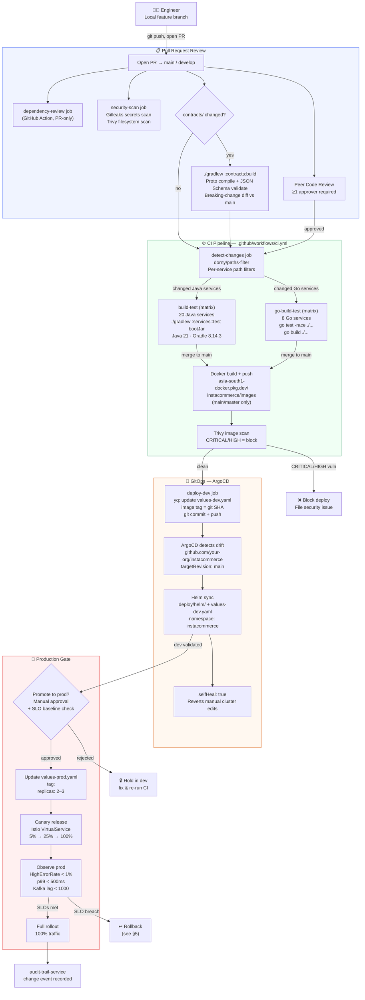
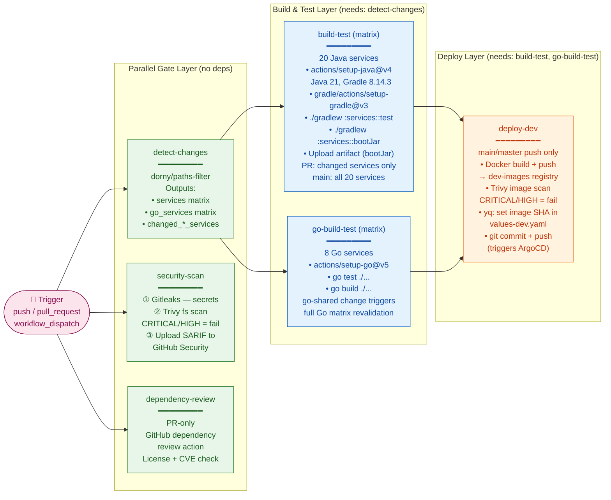
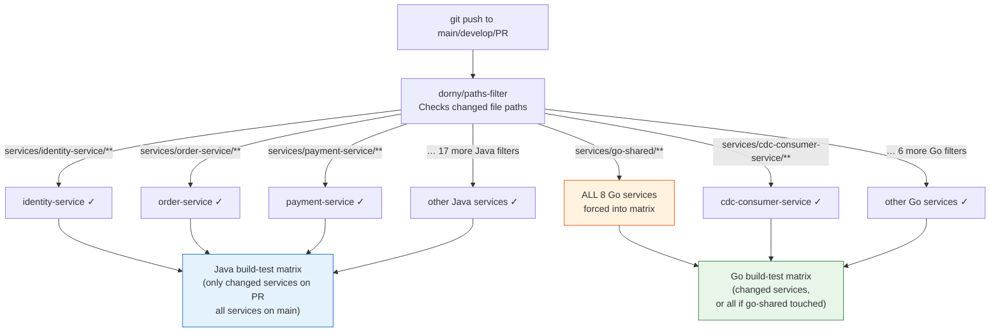
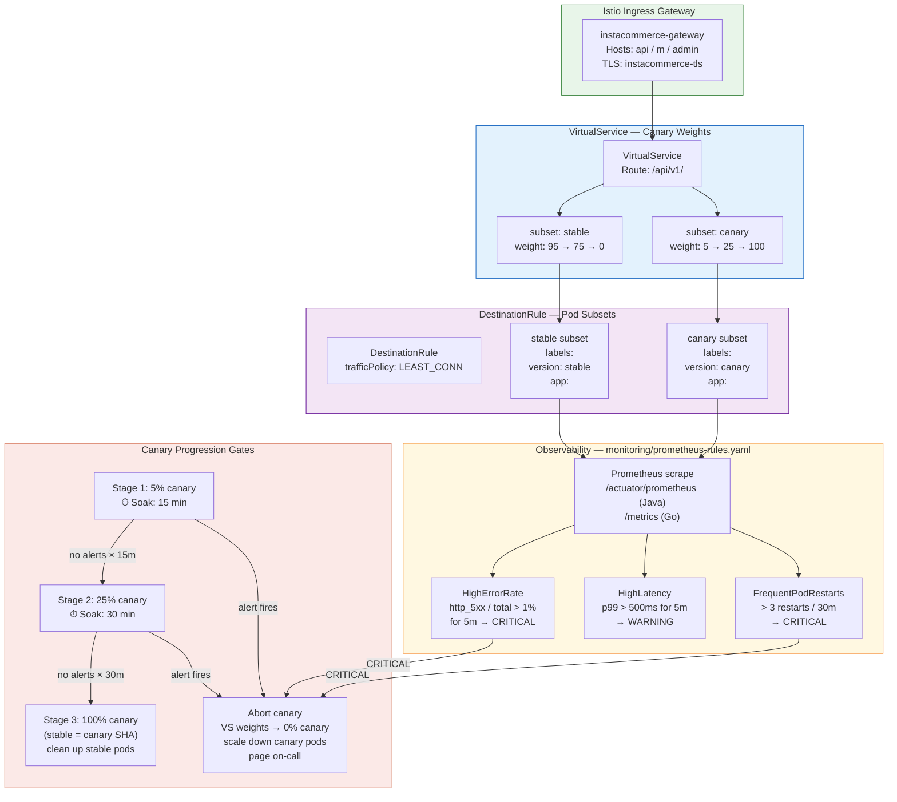
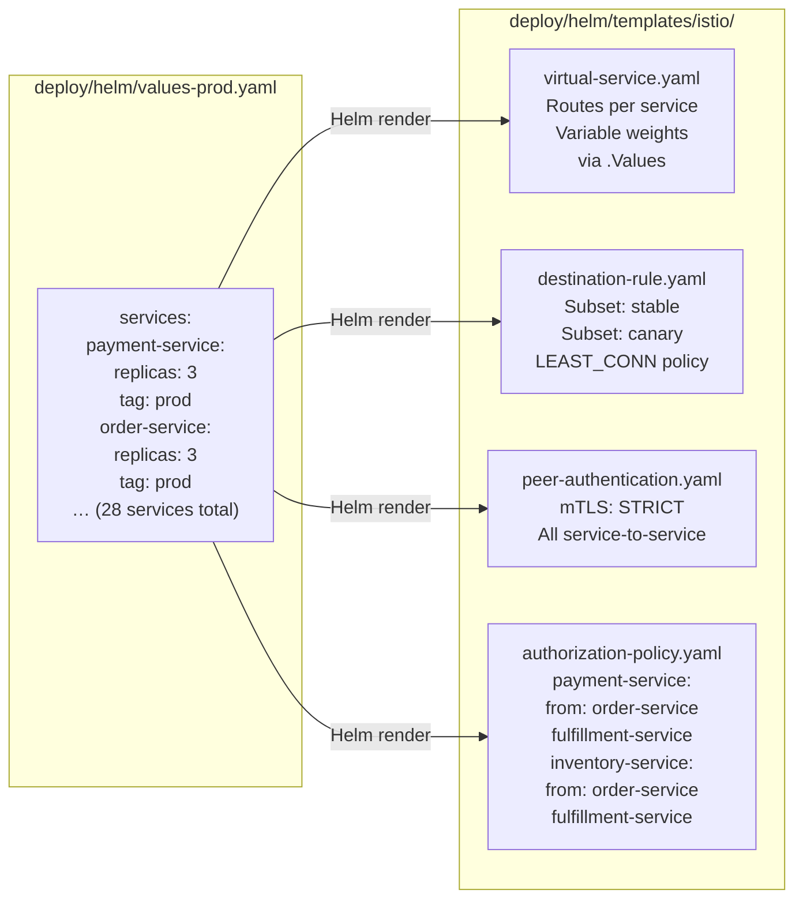
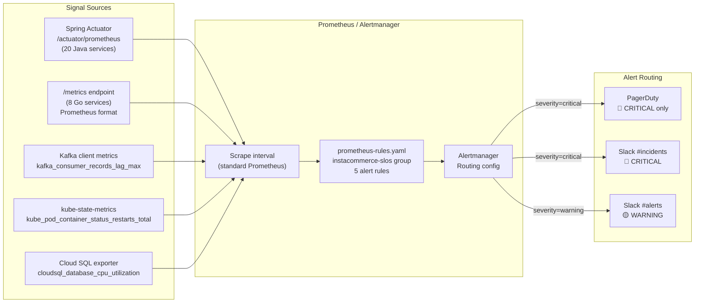
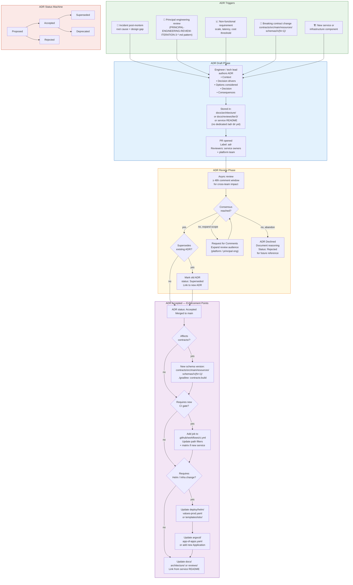
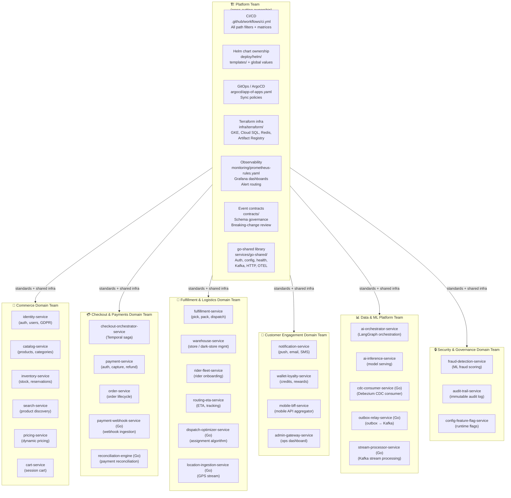
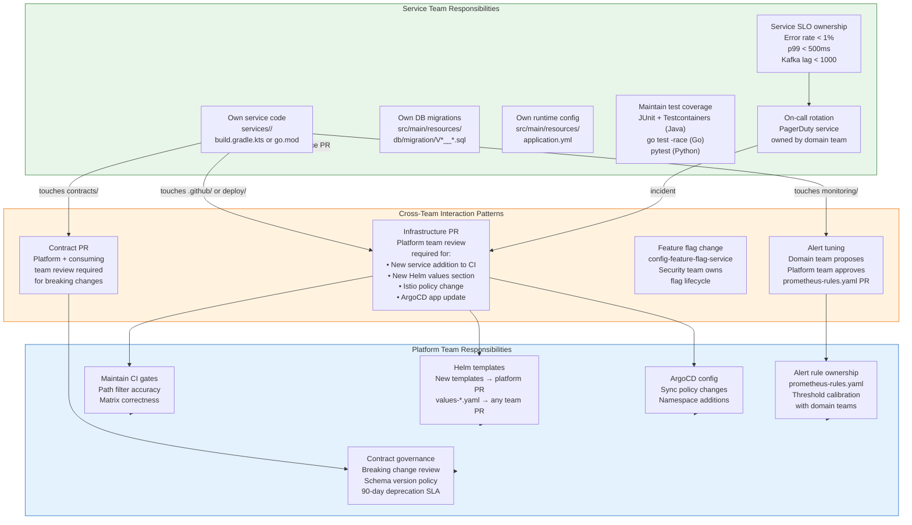

# InstaCommerce — Governance & Rollout Flow Diagrams

> **Iteration 3 · Platform Diagrams Series**
> Covers: code-to-prod governance, CI gate matrix, environment promotion, canary traffic management,
> rollback decision trees, incident feedback loops, ADR lifecycle, and platform/service ownership.
> All diagrams are grounded in the actual repo: `.github/workflows/ci.yml`, `deploy/helm/`,
> `argocd/app-of-apps.yaml`, `monitoring/prometheus-rules.yaml`, and `contracts/`.

---

## Table of Contents

1. [Code-to-Production Governance](#1-code-to-production-governance)
2. [CI Gate Matrix — GitHub Actions](#2-ci-gate-matrix--github-actions)
3. [Environment Promotion Pipeline](#3-environment-promotion-pipeline)
4. [Canary Deployment — Istio Traffic Split](#4-canary-deployment--istio-traffic-split)
5. [Rollback Decision Tree](#5-rollback-decision-tree)
6. [Incident Detection & Feedback Loop](#6-incident-detection--feedback-loop)
7. [ADR Lifecycle](#7-adr-lifecycle)
8. [Platform & Service Ownership Loops](#8-platform--service-ownership-loops)

---

## 1. Code-to-Production Governance

This end-to-end flowchart traces the complete change lifecycle from an engineer's local branch
through peer review, CI gates, GitOps promotion, and production validation. Every decision gate is
backed by a concrete artifact in this repo.



---

## 2. CI Gate Matrix — GitHub Actions

Detailed view of the six CI jobs defined in `.github/workflows/ci.yml`, their parallelism,
dependencies, and what each gate protects.



### CI Path-Filter Logic



---

## 3. Environment Promotion Pipeline

The three-environment progression with explicit handoff gates between dev (auto), staging (semi-auto),
and production (gated). All environment-specific config lives in `deploy/helm/values-{env}.yaml`.

```mermaid
flowchart TD
    subgraph SRC ["Source"]
        COMMIT["Merged commit\nto main branch\ngit SHA: abc1234"]
    end

    subgraph DEV ["🟡 Dev Environment\n(auto-deployed on every merge)"]
        DEV_IMG["Image pushed:\nasa-south1-docker.pkg.dev/\ninstacommerce/dev-images\n:<git-SHA>"]
        DEV_VALUES["values-dev.yaml updated\nby deploy-dev CI job\nAll 28 services: tag=<SHA>"]
        ARGOCD_DEV["ArgoCD sync (automated)\nnamespace: instacommerce\nselfHeal: true\nprune: true"]
        DEV_HEALTH["Health checks pass?\n/actuator/health/readiness\n(Java) · /health/ready (Go)"]
        DEV_SMOKE["Dev smoke tests\nBasic flow validation\n+ contract event emission"]
    end

    subgraph STAGING ["🟠 Staging Environment\n(promoted after dev soak)"]
        STAGING_APPROVAL["Manual approval gate\n+ dev soak period ≥ 1h\n+ zero critical alerts in dev"]
        STAGING_VALUES["values-staging.yaml\nSame SHA, prod-like replicas\nCloud SQL staging instance"]
        ARGOCD_STG["ArgoCD sync (automated)\nnamespace: instacommerce-staging"]
        STAGING_INTEG["Integration test suite\nEnd-to-end checkout flow\nPayment + inventory saga\nFulfillment pipeline"]
        STAGING_PERF["Performance baseline\nerror rate < 0.5%\np99 latency < 300ms\nKafka lag < 500"]
    end

    subgraph PROD ["🔴 Production Environment\n(gated canary rollout)"]
        PROD_APPROVAL["Production approval gate\nSenior engineer sign-off\nChange window check\n(avoid peak hours)"]
        PROD_VALUES["values-prod.yaml\nCore services: 3 replicas\nOther services: 2 replicas\nRedis: Memorystore prod"]
        CANARY_START["Canary: 5% traffic\nIstio VirtualService\nweight: 5 → canary\nweight: 95 → stable"]
        CANARY_OBS["Observe 15 min\nHighErrorRate alert\nHighLatency alert\nFrequentPodRestarts alert"]
        CANARY_25["Canary: 25% traffic"]
        CANARY_OBS2["Observe 30 min"]
        FULL_PROD["Full production\n100% traffic\nStable tag promoted\nAudit event emitted"]
    end

    COMMIT --> DEV_IMG
    DEV_IMG --> DEV_VALUES
    DEV_VALUES --> ARGOCD_DEV
    ARGOCD_DEV --> DEV_HEALTH
    DEV_HEALTH -->|"pass"| DEV_SMOKE
    DEV_HEALTH -->|"fail"| DEV_ROLLBACK["ArgoCD selfHeal\nreverts to last good SHA"]
    DEV_SMOKE -->|"pass"| STAGING_APPROVAL
    DEV_SMOKE -->|"fail"| DEV_ROLLBACK

    STAGING_APPROVAL -->|"approved"| STAGING_VALUES
    STAGING_APPROVAL -->|"blocked"| HOLD_STG["Hold in dev\nFile issue"]
    STAGING_VALUES --> ARGOCD_STG
    ARGOCD_STG --> STAGING_INTEG
    STAGING_INTEG -->|"pass"| STAGING_PERF
    STAGING_INTEG -->|"fail"| STG_ROLLBACK["Rollback staging\ngit revert SHA\nArgoCD re-sync"]
    STAGING_PERF -->|"pass"| PROD_APPROVAL
    STAGING_PERF -->|"fail"| STG_ROLLBACK

    PROD_APPROVAL -->|"approved"| PROD_VALUES
    PROD_APPROVAL -->|"blocked"| HOLD_PROD["Hold in staging\nFix & re-promote"]
    PROD_VALUES --> CANARY_START
    CANARY_START --> CANARY_OBS
    CANARY_OBS -->|"SLOs met"| CANARY_25
    CANARY_OBS -->|"SLO breach"| PROD_ROLLBACK["Immediate rollback\n(see §5)"]
    CANARY_25 --> CANARY_OBS2
    CANARY_OBS2 -->|"SLOs met"| FULL_PROD
    CANARY_OBS2 -->|"SLO breach"| PROD_ROLLBACK

    style DEV fill:#fffde7,stroke:#f9a825
    style STAGING fill:#fff3e0,stroke:#ef6c00
    style PROD fill:#ffebee,stroke:#c62828
    style SRC fill:#e8f5e9,stroke:#2e7d32
```



---

## 4. Canary Deployment — Istio Traffic Split

How canaries are managed via Istio `VirtualService` and `DestinationRule` templates in
`deploy/helm/templates/istio/`. Each service runs two `Deployment` subsets simultaneously.



### Canary Configuration in Helm Values



---

## 5. Rollback Decision Tree

Rollback paths from fastest (automatic ArgoCD selfHeal) to slowest (emergency manual override),
tied to the actual mechanisms available in this repo.

```mermaid
flowchart TD
    DETECT["🚨 Problem Detected\n(alert, smoke test, canary abort)"]

    Q1{"Where is the\nbad version?"}

    Q2_DEV{"Dev — is ArgoCD\nselfHeal active?"}
    AUTO_HEAL["✅ ArgoCD selfHeal\nReverts cluster to\nlast known good state\nin values-dev.yaml\n~2 min"]

    Q2_CANARY{"Prod canary —\nwhich stage?"]
    ABORT_CANARY["VirtualService weight\n→ 0% canary\nscale down canary pods\nNo user impact\n~1 min"]

    Q2_PROD{"Prod — is image\nthe problem?"}
    GIT_REVERT["git revert <merge-SHA>\ngit push origin main\nCI re-runs image build\nArgoCD picks up new SHA\n~10–15 min total"]

    ARGOCD_ROLLBACK["argocd app rollback\ninstacommerce <revision-id>\nRolls Helm release\nback to prev revision\n~3 min"]

    BREAK_GLASS["🔴 Break-glass\n1. argocd app set\n   instacommerce\n   --sync-policy none\n2. kubectl rollout undo\n   deployment/<svc>\n3. Validate health\n4. Re-enable auto-sync\n~5 min hands-on"]

    SCHEMA_Q{"DB migration\ninvolved?"}
    SCHEMA_REVERT["Flyway repair:\n./gradlew :services:<svc>:flywayRepair\nFor destructive migrations:\n write V{N+1}__revert_*.sql\nNever delete existing\nmigrations in place"]

    VALIDATE["✅ Validate rollback\n• /actuator/health/readiness\n• HighErrorRate < 1%\n• p99 < 500ms\n• Kafka lag stable"]
    POST_ROLLBACK["📝 Post-rollback actions\n• Open incident ticket\n• Capture timeline\n• Feed into feedback loop\n  (see §6)"]

    DETECT --> Q1
    Q1 -->|"dev"| Q2_DEV
    Q1 -->|"prod canary"| Q2_CANARY
    Q1 -->|"prod full"| Q2_PROD

    Q2_DEV -->|"yes (default)"| AUTO_HEAL
    Q2_DEV -->|"no / drift persists"| GIT_REVERT

    Q2_CANARY -->|"stage 1 or 2\n(< 25% traffic)"| ABORT_CANARY
    Q2_CANARY -->|"stage 3 / full"| Q2_PROD

    Q2_PROD -->|"ArgoCD revision\navailable"| ARGOCD_ROLLBACK
    Q2_PROD -->|"need git history\nor ArgoCD unavail"| GIT_REVERT
    Q2_PROD -->|"cluster emergency\nArgoCD broken"| BREAK_GLASS

    ARGOCD_ROLLBACK --> SCHEMA_Q
    GIT_REVERT --> SCHEMA_Q
    BREAK_GLASS --> SCHEMA_Q
    AUTO_HEAL --> VALIDATE
    ABORT_CANARY --> VALIDATE

    SCHEMA_Q -->|"yes"| SCHEMA_REVERT
    SCHEMA_Q -->|"no"| VALIDATE
    SCHEMA_REVERT --> VALIDATE
    VALIDATE --> POST_ROLLBACK

    style DETECT fill:#ffebee,stroke:#c62828
    style AUTO_HEAL fill:#e8f5e9,stroke:#2e7d32
    style ABORT_CANARY fill:#e8f5e9,stroke:#2e7d32
    style BREAK_GLASS fill:#fff3e0,stroke:#e65100
    style POST_ROLLBACK fill:#e3f2fd,stroke:#1565c0
```

---

## 6. Incident Detection & Feedback Loop

From the first alert firing through mitigation, post-mortem, and the two feedback paths back into
the codebase (hotfix) and architecture (ADR). Anchored to `monitoring/prometheus-rules.yaml` and
the `audit-trail-service`.

```mermaid
flowchart TD
    subgraph DETECT ["🔍 Detection Layer — monitoring/prometheus-rules.yaml"]
        A1["HighErrorRate\nhttp_5xx rate > 1% for 5m\nSeverity: CRITICAL"]
        A2["HighLatency\np99 > 500ms for 5m\nSeverity: WARNING"]
        A3["KafkaConsumerLag\nlag_max > 1000 for 10m\nSeverity: WARNING"]
        A4["FrequentPodRestarts\n> 3 restarts / 30m\nSeverity: CRITICAL"]
        A5["DatabaseHighCPU\nCloud SQL CPU > 80% for 10m\nSeverity: WARNING"]
    end

    subgraph TRIAGE ["📟 Triage & Escalation"]
        PAGER["CRITICAL → PagerDuty\nWARNING → Slack #alerts"]
        ONCALL["On-call engineer\nAcknowledge alert\n≤ 15 min SLA"]
        SEV{"Severity\nassessment"}
        SEV1["SEV-1: Revenue / data loss\nAll-hands bridge\nExec notification"]
        SEV2["SEV-2: Degraded service\nService team on-call\nSlack #incidents"]
        SEV3["SEV-3: Non-critical\nNext business hour"]
    end

    subgraph MITIGATE ["🛠 Mitigation"]
        ROLLBACK_M["Rollback (§5)\nArgoCD / git revert"]
        HOTFIX["Hotfix branch\nExpedited CI gates\nSecurity scan still runs\nFast-track review"]
        FF_KILL["Feature-flag kill switch\n/api/v1/flags\nconfig-feature-flag-service\nZero-deploy mitigation"]
        SCALE_M["Emergency scale-out\nkubectl scale --replicas=N\nor update values-prod.yaml\nfor HPA adjustment"]
    end

    subgraph OBSERVE ["👁 Incident Observation"]
        GRAFANA["Grafana dashboards\n• Service Overview\n• Order Pipeline\n• Kafka & Messaging\n• DB Health"]
        LOGS["Structured logs\nGCP Cloud Logging\nOTEL trace correlation\nvia correlation_id"]
        AUDIT["audit-trail-service\nImmutable change log\nAll deployment events\nAll flag changes"]
    end

    subgraph POSTMORTEM ["📝 Post-Mortem Process"]
        BLAMELESS["Blameless post-mortem\nWithin 48h of SEV-1\nWithin 1 week of SEV-2"]
        TIMELINE["Timeline reconstruction\naudit-trail-service events\nCI run history\nArgoCD revision log"]
        ROOT_CAUSE["Root cause analysis\n5 Whys / Fishbone"]
        ACTION_ITEMS["Action items\nwith owners + due dates"]
    end

    subgraph FEEDBACK ["🔄 Feedback Loops"]
        CODE_FIX["Code / config fix\n→ Feature branch\n→ Standard CI gates\n→ Canary if prod change"]
        ADR_TRIGGER{"Architecture\nchange needed?"]
        ADR_FLOW["ADR lifecycle\n(see §7)"]
        ALERT_TUNE["Alert threshold tuning\nUpdate prometheus-rules.yaml\nbacklog: reduce false positives"]
        RUNBOOK_UPDATE["Runbook update\nCapture new mitigation steps\nLink from alert annotation"]
    end

    A1 & A2 & A3 & A4 & A5 --> PAGER
    PAGER --> ONCALL
    ONCALL --> SEV
    SEV -->|"revenue/data"| SEV1
    SEV -->|"degraded"| SEV2
    SEV -->|"minor"| SEV3

    SEV1 & SEV2 --> ROLLBACK_M & FF_KILL & SCALE_M
    SEV1 & SEV2 --> GRAFANA & LOGS & AUDIT
    ROLLBACK_M -->|"if not sufficient"| HOTFIX

    GRAFANA & LOGS & AUDIT --> BLAMELESS
    BLAMELESS --> TIMELINE
    TIMELINE --> ROOT_CAUSE
    ROOT_CAUSE --> ACTION_ITEMS

    ACTION_ITEMS --> CODE_FIX
    ACTION_ITEMS --> ADR_TRIGGER
    ACTION_ITEMS --> ALERT_TUNE
    ACTION_ITEMS --> RUNBOOK_UPDATE

    ADR_TRIGGER -->|"yes"| ADR_FLOW
    ADR_TRIGGER -->|"no"| CODE_FIX

    style DETECT fill:#ffebee,stroke:#c62828
    style TRIAGE fill:#fff3e0,stroke:#ef6c00
    style MITIGATE fill:#e8eaf6,stroke:#3949ab
    style OBSERVE fill:#e8f5e9,stroke:#2e7d32
    style POSTMORTEM fill:#f3e5f5,stroke:#6a1b9a
    style FEEDBACK fill:#e3f2fd,stroke:#1565c0
```

### Observability Signal Map



---

## 7. ADR Lifecycle

Architectural Decision Records (ADRs) close the loop between incidents, platform evolution, and
documented team consensus. The flow below shows how a decision enters review, gains/loses consensus,
and becomes a binding constraint on future CI gates or contract versioning.



---

## 8. Platform & Service Ownership Loops

How responsibility is distributed across the 28-service estate, and how platform decisions flow
back to individual service teams. Tied to the domain groupings in `deploy/helm/values-prod.yaml`
and the service matrix in `.github/workflows/ci.yml`.

### 8.1 Domain Ownership Map



### 8.2 Service Ownership Accountability Loop



### 8.3 New Service Onboarding Governance Loop

```mermaid
flowchart TD
    PROPOSAL["📋 New service proposal\nADR required (see §7)\nDomain team authors"]

    subgraph PLATFORM_APPROVAL ["Platform Review Gates"]
        CHECK_SHARED{"Can reuse existing\nservice pattern?"]
        REUSE["Extend existing service\nor use go-shared lib"]
        NEW_SVC_ADR["New service ADR\napproved by platform\n+ principal engineering"]
        TECH_STACK{"Technology\nstack?"}
        JAVA_BOOT["Java/Spring Boot\nFollow structure:\nbuild.gradle.kts\napplication.yml\nFlyway migrations"]
        GO_SVC["Go service\nImport go-shared:\nauth, config, health\nKafka, HTTP, OTEL"]
        PY_SVC["Python/FastAPI\nrequirements.txt\nuvicorn entrypoint\npytest coverage"]
    end

    subgraph CI_ONBOARD ["CI Onboarding — .github/workflows/ci.yml"]
        ADD_FILTER["Add path filter:\nfilters: |\n  <service-name>:\n    'services/<service-name>/**'"]
        ADD_MATRIX_J["Java: add to all_services\narray in set-matrix step"]
        ADD_MATRIX_G["Go: add to all_go_services\narray in set-go-matrix step"]
        ADD_DEPLOY_MAP["Go only: add deploy-name\nmapping if different from\nmodule name\n(e.g. cdc-consumer-service\n→ cdc-consumer)"]
    end

    subgraph HELM_ONBOARD ["Helm Onboarding — deploy/helm/"]
        ADD_VALUES_BASE["Add to values.yaml:\nservices:\n  <name>:\n    port: <N>\n    replicas: 1"]
        ADD_VALUES_DEV["Add to values-dev.yaml:\nservices:\n  <name>:\n    tag: dev"]
        ADD_VALUES_PROD["Add to values-prod.yaml:\nservices:\n  <name>:\n    replicas: 2\n    tag: prod"]
        ADD_ISTIO_ROUTE["Add Istio VirtualService\nroute in values.yaml\nvia http[] match block"]
    end

    subgraph OBS_ONBOARD ["Observability Onboarding"]
        EXPOSE_METRICS["Expose /actuator/prometheus\n(Java) or /metrics (Go)\nOTEL instrumentation\nvia go-shared or\nspring-boot-actuator"]
        ADD_ALERT["Propose new alert rule\nif service has unique SLO\nPR to prometheus-rules.yaml\nplatform team approval"]
        ADD_DASHBOARD["Add service panel\nto Service Overview\nGrafana dashboard"]
    end

    subgraph CONTRACTS_ONBOARD ["Contracts Onboarding"]
        NEEDS_EVENT{"Service emits\nor consumes events?"}
        ADD_SCHEMA["Add JSON Schema\ncontracts/src/main/resources/\nschemas/<domain>/\n<EventType>.v1.json"]
        ADD_PROTO["gRPC proto (if needed)\ncontracts/src/main/proto/\n<domain>/v1/\n<service>.proto\n./gradlew :contracts:build"]
    end

    PROPOSAL --> CHECK_SHARED
    CHECK_SHARED -->|"yes"| REUSE
    CHECK_SHARED -->|"no"| NEW_SVC_ADR
    NEW_SVC_ADR --> TECH_STACK
    TECH_STACK -->|"Java"| JAVA_BOOT
    TECH_STACK -->|"Go"| GO_SVC
    TECH_STACK -->|"Python"| PY_SVC

    JAVA_BOOT --> ADD_FILTER --> ADD_MATRIX_J --> ADD_VALUES_BASE
    GO_SVC --> ADD_FILTER --> ADD_MATRIX_G --> ADD_DEPLOY_MAP --> ADD_VALUES_BASE
    PY_SVC --> ADD_FILTER --> ADD_VALUES_BASE

    ADD_VALUES_BASE --> ADD_VALUES_DEV --> ADD_VALUES_PROD --> ADD_ISTIO_ROUTE

    ADD_ISTIO_ROUTE --> EXPOSE_METRICS
    EXPOSE_METRICS --> ADD_ALERT
    ADD_ALERT --> ADD_DASHBOARD

    ADD_DASHBOARD --> NEEDS_EVENT
    NEEDS_EVENT -->|"yes"| ADD_SCHEMA
    ADD_SCHEMA --> ADD_PROTO
    NEEDS_EVENT -->|"no"| DONE

    ADD_PROTO --> DONE["✅ Service onboarded\nReady for first PR\nthrough CI gates"]

    style PLATFORM_APPROVAL fill:#f3e5f5,stroke:#6a1b9a
    style CI_ONBOARD fill:#e8f5e9,stroke:#2e7d32
    style HELM_ONBOARD fill:#e3f2fd,stroke:#1565c0
    style OBS_ONBOARD fill:#fff8e1,stroke:#f57f17
    style CONTRACTS_ONBOARD fill:#fbe9e7,stroke:#bf360c
```

---

## Cross-Diagram Reference Index

| Flow | Key Repo Artifacts | Primary Stakeholder |
|------|-------------------|---------------------|
| §1 Code-to-Prod Governance | `.github/workflows/ci.yml`, `deploy/helm/`, `argocd/app-of-apps.yaml` | All engineers |
| §2 CI Gate Matrix | `.github/workflows/ci.yml` jobs: detect-changes, security-scan, dependency-review, build-test, go-build-test, deploy-dev | Platform team |
| §3 Environment Promotion | `values-dev.yaml`, `values-prod.yaml`, ArgoCD sync policy | Release managers / leads |
| §4 Canary Deployment | `deploy/helm/templates/istio/virtual-service.yaml`, `destination-rule.yaml`, `monitoring/prometheus-rules.yaml` | Platform + domain teams |
| §5 Rollback | `argocd/app-of-apps.yaml` (selfHeal), `git revert`, `argocd app rollback`, Flyway | On-call engineer |
| §6 Incident Loop | `monitoring/prometheus-rules.yaml`, Grafana dashboards, `audit-trail-service` | On-call + all domain teams |
| §7 ADR Lifecycle | `docs/architecture/`, `contracts/`, `.github/workflows/ci.yml`, `deploy/helm/` | Tech leads + principal engineering |
| §8 Ownership Loops | All of the above | Platform team + domain leads |

---

## Appendix: Alert Thresholds Quick Reference

| Alert | Metric | Threshold | Duration | Severity | Channel |
|-------|--------|-----------|----------|----------|---------|
| `HighErrorRate` | `http_server_requests_seconds_count{status=~"5.."}` / total | > 1% | 5 min | CRITICAL | PagerDuty + #incidents |
| `HighLatency` | `http_server_requests_seconds` p99 | > 500ms | 5 min | WARNING | #alerts |
| `KafkaConsumerLag` | `kafka_consumer_records_lag_max` | > 1000 | 10 min | WARNING | #alerts |
| `FrequentPodRestarts` | `kube_pod_container_status_restarts_total` delta 30m | > 3 | — | CRITICAL | PagerDuty + #incidents |
| `DatabaseHighCPU` | `cloudsql_database_cpu_utilization` | > 80% | 10 min | WARNING | #alerts |

## Appendix: Service Port Map

| Port Range | Service Group |
|-----------|--------------|
| 8080 | identity, catalog, inventory, order, payment, fulfillment, notification |
| 8086–8087 | search (8086), pricing (8087) |
| 8088–8089 | cart (8088), checkout-orchestrator (8089) |
| 8090–8095 | warehouse (8090), rider-fleet (8091), routing-eta (8092), wallet-loyalty (8093), audit-trail (8094), fraud-detection (8095) |
| 8096–8099 | config-feature-flag (8096), mobile-bff (8097), admin-gateway (8099) |
| 8100–8101 | ai-orchestrator (8100), ai-inference (8101) |
| 8102–8107 | dispatch-optimizer (8102), outbox-relay (8103), cdc-consumer (8104), location-ingestion (8105), payment-webhook (8106), reconciliation-engine (8107) |

## Appendix: Go Module → Helm Deploy Key Mapping

| Go Module Directory | Helm `values-*.yaml` Key | CI Matrix Name |
|--------------------|--------------------------|----------------|
| `services/cdc-consumer-service` | `cdc-consumer` | `cdc-consumer-service` |
| `services/location-ingestion-service` | `location-ingestion` | `location-ingestion-service` |
| `services/payment-webhook-service` | `payment-webhook` | `payment-webhook-service` |
| `services/outbox-relay-service` | `outbox-relay` | `outbox-relay-service` |
| `services/dispatch-optimizer-service` | `dispatch-optimizer-service` | `dispatch-optimizer-service` |
| `services/reconciliation-engine` | `reconciliation-engine` | `reconciliation-engine` |
| `services/stream-processor-service` | `stream-processor-service` | `stream-processor-service` |
