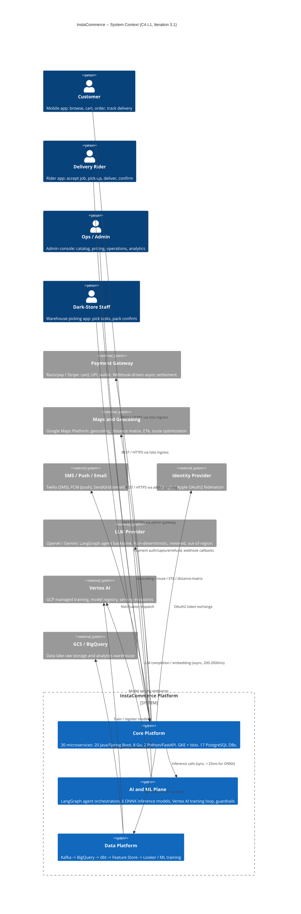
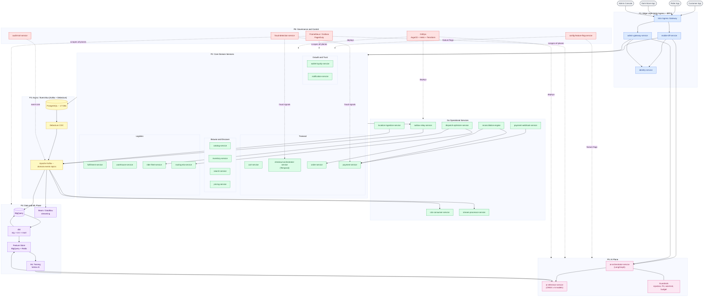
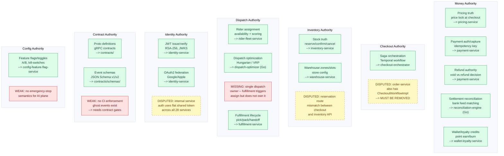
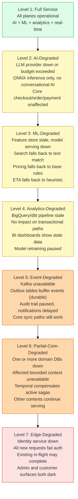
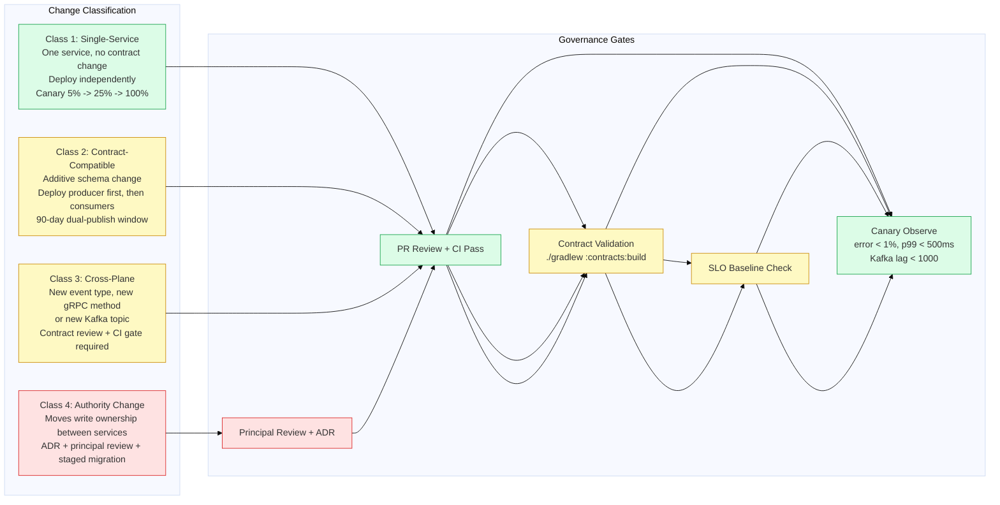
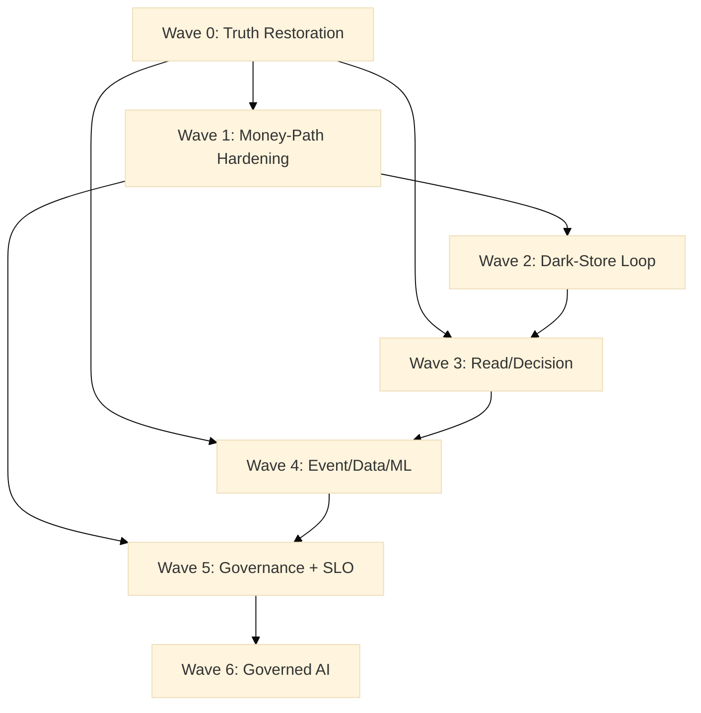

# InstaCommerce -- Iteration 3: HLD & System-Context Diagrams

> **Version:** 3.1 (Iteration 3 -- Comprehensive Rewrite)
> **Date:** 2026-03-06
> **Author:** Principal Engineering Review
> **Status:** Living Document -- Target Architecture
> **Audience:** CTO, Principal/Staff Engineers, SRE, Platform, Security, Data/ML, AI
>
> **Relationship to the iter3 corpus:** This document is the **architectural spine** of the
> iteration-3 review set. It defines the boundary map, trust zones, authority ownership, and
> failure isolation model that every other iter3 artifact references. Read it first, then
> drill into the linked docs for implementation-level detail.
>
> | Companion doc | Purpose |
> |---|---|
> | [`master-review.md`](../master-review.md) | Executive-level synthesis and issue register |
> | [`service-wise-guide.md`](../service-wise-guide.md) | Cluster-by-cluster implementation guidance |
> | [`platform-wise-guide.md`](../platform-wise-guide.md) | Cross-cutting platform hardening |
> | [`implementation-program.md`](../implementation-program.md) | Wave-based execution plan |
> | [`flow-data-ml-ai.md`](flow-data-ml-ai.md) | End-to-end data/ML/AI flow diagrams |
> | [`flow-governance-rollout.md`](flow-governance-rollout.md) | CI/CD, GitOps, rollout, rollback |
> | [`lld-edge-checkout.md`](lld-edge-checkout.md) | Detailed edge-to-checkout LLD |
> | [`lld-eventing-data.md`](lld-eventing-data.md) | Outbox, CDC, Kafka, data platform LLD |
> | [`sequence-checkout-payment.md`](sequence-checkout-payment.md) | Checkout/payment sequence diagrams |
>
> **Relationship to existing `docs/architecture/HLD.md`:** The original v1.0 HLD (2025-01-15)
> covers the foundational container view and technology decisions. This document supersedes it
> with iteration-3 precision: a refreshed system context with the AI plane; decomposed boundary
> diagrams for each of the six architectural planes; annotated inter-plane flows; a critical
> authority ownership map; runtime trust boundaries and blast-radius analysis; a failure-isolation
> and degradation model; and governance/rollout implications. Both documents should be kept in
> sync as the platform evolves.

---

## Table of Contents

1. [Executive Intent](#1-executive-intent)
2. [System Context and External Actors](#2-system-context-and-external-actors)
3. [Six-Plane Target Architecture Boundary Map](#3-six-plane-target-architecture-boundary-map)
4. [Control-Plane vs Data-Plane vs AI-Plane Separation](#4-control-plane-vs-data-plane-vs-ai-plane-separation)
5. [Critical Authority Ownership Map](#5-critical-authority-ownership-map)
6. [Runtime Trust Boundaries and Blast-Radius Notes](#6-runtime-trust-boundaries-and-blast-radius-notes)
7. [Failure-Isolation and Degradation Model](#7-failure-isolation-and-degradation-model)
8. [Rollout and Governance Implications](#8-rollout-and-governance-implications)
9. [Done vs Missing / Next-Evolution Items](#9-done-vs-missing--next-evolution-items)

---

## 1. Executive Intent

### Why this document exists

InstaCommerce is a polyglot microservice monorepo targeting the q-commerce (quick-commerce)
market segment -- a domain defined by sub-15-minute delivery SLAs, high order frequency,
real-time inventory truth, and tight coupling between digital and physical operations.

The iteration-3 review (`master-review.md`) concluded:

> *InstaCommerce has the architecture of an ambitious q-commerce platform and the implementation
> discipline of a platform that has not yet fully chosen what it wants to trust.*

This HLD document makes the trust decisions explicit. It defines:

- **Which boundary owns which truth** -- so engineers know where to look and where not to.
- **What can fail independently** -- so SREs know blast-radius before an incident.
- **What authority exists where** -- so money, inventory, dispatch, identity, and AI decisions
  are never ambiguous about who is authoritative.
- **How control, data, and AI planes relate** -- so platform engineers understand the
  dependency hierarchy and can reason about degradation.

### How this HLD relates to the iter3 corpus

This document is the **map**; the other iter3 docs are the **territory**:

```
                                    +------------------------------+
                                    |  THIS DOCUMENT               |
                                    |  (HLD / System Context)      |
                                    |  Boundaries, trust, authority |
                                    +-------------+----------------+
                                                  |
          +------------------------+--------------+------------+------------------+
          |                        |                           |                  |
   +------v------+    +-----------v---+    +------------------v---+    +---------v----+
   | Service      |    | Platform     |    | LLD + Sequence       |    | Impl         |
   | Guides (9)   |    | Guides (9)   |    | Diagrams (3)         |    | Program      |
   | e.g. trans-  |    | e.g. trust-  |    | + Data/ML/AI Flow    |    | (waves)      |
   | actional-    |    | boundaries   |    |                      |    |              |
   | core.md      |    | .md          |    |                      |    |              |
   +--------------+    +--------------+    +----------------------+    +--------------+
```

Each companion document assumes the plane boundaries and authority map defined here.
If a boundary shifts, this document must be updated first, and the downstream docs reconciled.

---

## 2. System Context and External Actors

### 2.1 C4 Level 1 -- System Context

The outermost view. InstaCommerce is one system. External actors and third-party systems are
shown with their trust, latency, and cost profiles annotated.



### 2.2 External Dependency Risk Profile

| External System | Latency Profile | Failure Impact | Idempotent? | Cost Model | Trust Zone |
|---|---|---|---|---|---|
| **Payment Gateway** (Razorpay/Stripe) | 200-800ms (auth/capture) | Money-path blocked; compensate via void/refund | Yes (idempotency key) | Per-transaction | External, webhook-verified (HMAC-SHA256) |
| **Maps and Geocoding** (Google Maps) | 50-200ms | ETA degraded; fallback to cached/heuristic ETA | Yes (deterministic) | Per-request metered | External, API-key authenticated |
| **SMS/Push/Email** (Twilio/FCM/SendGrid) | 100-500ms | Notifications delayed; non-blocking to order flow | Best-effort | Per-message | External, API-key authenticated |
| **Identity Provider** (Google/Apple OAuth) | 100-300ms | Login/registration blocked; existing sessions unaffected | Yes | Free tier | External, OAuth2 standard |
| **LLM Provider** (OpenAI/Gemini) | 200-2000ms | AI agent non-functional; fallback to ONNX-only path | No (non-deterministic) | Per-token metered | External, **highest cost risk** |
| **Vertex AI** | 50-200ms (serving), hours (training) | Model serving fallback to local ONNX; training delayed | Yes (idempotent endpoints) | Per-node-hour | GCP-managed, IAM-scoped |
| **GCS/BigQuery** | 10-100ms (GCS), 1-30s (BQ query) | Analytics delayed; no transactional impact | Yes | Storage + query | GCP-managed, IAM-scoped |

> **Key insight:** The LLM provider is the **only** out-of-region, metered, non-idempotent,
> non-deterministic external dependency. Its outage or cost exceedance is a distinct operational
> risk that requires its own circuit breaker, budget cap, and degradation path -- separate from
> the payment gateway and maps dependencies.

---

## 3. Six-Plane Target Architecture Boundary Map

### 3.1 Landscape View

This single-page overview shows how the six planes relate. Detail for each plane follows.
Every service name matches `settings.gradle.kts` and `services/*/go.mod`.



> **Reading the diagram:** Solid arrows = primary data/call flows. Dashed arrows = control-plane
> cross-cuts. The six numbered subgraphs (P1-P6) correspond to the six planes detailed below.

### 3.2 Per-Plane Service Inventory

| Plane | Technology | Service Count | Repo Path Pattern | DB Count |
|---|---|---|---|---|
| **P1 Edge** | Java/Spring Boot + Istio | 3 (BFF, admin-gw, identity) | `services/{mobile-bff,admin-gateway,identity}-service/` | 1 (identity_db) |
| **P2 Core Domains** | Java/Spring Boot | 11 | `services/{catalog,inventory,search,...}-service/` | 11 |
| **P2 Go Ops** | Go | 7 (excl. go-shared) | `services/{cdc-consumer,outbox-relay,...}-service/` | 0 (stateless) |
| **P3 Async** | Kafka, Debezium, PostgreSQL | N/A (infrastructure) | `docker-compose.yml`, `deploy/helm/` | 0 |
| **P4 Data/ML** | Python, dbt, Airflow, Beam, BigQuery, Vertex AI | 0 services; pipeline code | `data-platform/`, `ml/` | 0 (uses BigQuery) |
| **P5 AI** | Python/FastAPI | 2 | `services/ai-{orchestrator,inference}-service/` | 0 (stateless) |
| **P6 Governance** | Java/Spring Boot + Terraform + Helm | 3 services + infra-as-code | `services/{config-feature-flag,fraud-detection,audit-trail}-service/` | 3 |

### 3.3 Plane Boundary Definitions

| Plane | What It Owns | What Crosses Its Boundary | Failure Mode |
|---|---|---|---|
| **P1 Edge** | Protocol termination, JWT validation, rate limiting, BFF shaping, RBAC gating | Authenticated REST/gRPC calls inbound; webhook ingress to Go handlers | Auth outage -> 401 all; BFF crash -> surface dark |
| **P2 Core** | Business state (17 PostgreSQL DBs), synchronous gRPC contracts, Temporal saga state | Outbox events outbound; gRPC calls inbound | DB outage -> bounded context unavailable; Temporal compensates |
| **P3 Async** | Kafka topics, Debezium CDC, outbox relay, consumer group offsets | Domain events inbound; enriched data outbound | Consumer lag -> eventual inconsistency; relay crash -> outbox buffers |
| **P4 Data/ML** | BigQuery warehouse, dbt transforms, Feature Store, Vertex AI training, ONNX artefacts | Kafka events inbound; trained models outbound; marts to BI | Pipeline lag -> stale features/models; quality gate failure -> blocks downstream |
| **P5 AI** | LangGraph agent state, ONNX model serving, guardrail policies, shadow mode | BFF calls inbound; tool calls to core; LLM API outbound; features from store | LLM outage -> degrade to ONNX; ONNX failure -> feature unavailable |
| **P6 Governance** | Feature flags, fraud rules, immutable audit log, observability, GitOps state | Policy reads/pushes to all planes; event subscriptions; alert routing | Flag service down -> cached defaults; fraud timeout -> proceed with risk flag |

---

## 4. Control-Plane vs Data-Plane vs AI-Plane Separation

### 4.1 Three-Plane Relationship Diagram

This diagram isolates the three macro-planes and shows how authority, data, and intelligence
flow between them. The control plane governs both others; the data plane feeds the AI plane;
the AI plane proposes but does not mutate directly.

```mermaid
%%{init: {"theme": "base"}}%%
flowchart LR
    classDef ctrl fill:#fee2e2,stroke:#dc2626,color:#7f1d1d
    classDef data fill:#f3e8ff,stroke:#7c3aed,color:#3b0764
    classDef ai fill:#fce7f3,stroke:#db2777,color:#831843
    classDef core fill:#dcfce7,stroke:#16a34a,color:#14532d

    subgraph CONTROL["CONTROL PLANE (P6 Governance + P1 Edge)"]
        direction TB
        C1["Feature Flags\nconfig-feature-flag-service"]:::ctrl
        C2["Fraud Rules\nfraud-detection-service"]:::ctrl
        C3["Auth and Identity\nidentity-service + Istio policies"]:::ctrl
        C4["GitOps Pipeline\nGH Actions -> ArgoCD -> Helm"]:::ctrl
        C5["Observability\nPrometheus -> Grafana -> PagerDuty"]:::ctrl
        C6["Infra Lifecycle\nTerraform modules"]:::ctrl
    end

    subgraph DATAPLANE["DATA PLANE (P3 Async + P4 Data/ML)"]
        direction TB
        D1["Event Bus\nKafka + Debezium + outbox-relay"]:::data
        D2["Warehouse\nBigQuery + dbt layers"]:::data
        D3["Feature Store\nOnline: Redis / Offline: BigQuery"]:::data
        D4["ML Training\nVertex AI + MLflow"]:::data
        D5["Quality Gates\nGreat Expectations"]:::data
    end

    subgraph AIPLANE["AI PLANE (P5)"]
        direction TB
        A1["Agent Orchestration\nai-orchestrator-service / LangGraph"]:::ai
        A2["Model Inference\nai-inference-service / ONNX x 6"]:::ai
        A3["Guardrails\nInjection + PII + Budget + Escalation"]:::ai
        A4["Shadow Mode\nChallenger scoring, no write-back"]:::ai
    end

    CORE_BOX["Core Domain Services\nP2: 18 services\nAuthoritative for business state"]:::core

    CONTROL -->|"policy, flags, identity, deploy"| CORE_BOX
    CONTROL -->|"deploy, SLO alerts, quality gates"| DATAPLANE
    CONTROL -->|"deploy, guardrail config, kill-switch"| AIPLANE

    DATAPLANE -->|"domain events (Kafka)"| CORE_BOX
    DATAPLANE -->|"features, trained models (ONNX)"| AIPLANE
    DATAPLANE -->|"BI / analytics / data exports"| CONTROL

    AIPLANE -->|"inference results (read-only)\nproposals via tool calls"| CORE_BOX
    AIPLANE -->|"shadow results, drift signals"| DATAPLANE

    CORE_BOX -->|"outbox events -> Kafka"| DATAPLANE
```



### 4.2 Key Separation Rules

| Rule | Rationale | Current Compliance |
|---|---|---|
| **Control plane can stop any data or AI flow** | Kill-switches, feature flags, and fraud rules must be able to block any pipeline or inference path | Partial -- flags exist but no emergency-stop for AI; fraud timeout fails open |
| **Data plane cannot mutate core business state** | Analytics, features, and training are derived; they do not write to operational DBs | Compliant -- no reverse data flow exists |
| **AI plane proposes, core decides** | AI inference results are advisory; the calling service decides whether to accept | Partially enforced -- LangGraph tool calls could invoke write APIs; HITL not mandatory |
| **All three planes have independent failure domains** | BigQuery outage must not block checkout; LLM outage must not block delivery | Mostly compliant -- feature-flag service in checkout path is a coupling risk |
| **Data plane owns model artefact provenance** | Model versioning, eval gates, ONNX export happen in `ml/`; AI plane consumes only | Compliant -- `ml/eval/evaluate.py` gates promotion |

### 4.3 Anti-Patterns to Avoid

- **AI writing directly to core state**: The LangGraph tool registry (`app/graph/tools.py`)
  includes write-capable tools (order cancel, inventory adjust). These must remain behind
  a human-in-the-loop (HITL) gate or a controlled feature flag until Wave 6 governance is in place.
- **Core domain depending on real-time ML inference for correctness**: Checkout must complete even if
  `ai-inference-service` is unreachable. Fraud scoring must fail-open with a risk flag, not block.
- **Data plane skipping quality gates**: dbt marts must not be consumed by ML or BI if Great
  Expectations checks fail. The current Airflow DAGs treat quality checks as advisory -- they must
  become blocking.

---

## 5. Critical Authority Ownership Map

### 5.1 Authority Map Diagram

This diagram shows which service is the **single authoritative owner** for each critical
business decision. Solid borders = authority established. Dashed borders = authority disputed
or unclear (iter3 finding).



### 5.2 Authority Resolution Register

| Domain | Current Authority | Dispute / Gap | Resolution (per iter3) | ADR |
|---|---|---|---|---|
| **Checkout orchestration** | `checkout-orchestrator-service` (Temporal) | `order-service` has duplicate `CheckoutWorkflowImpl` bypassing pricing validation | Remove checkout from order-service; single Temporal workflow | ADR-001 (proposed) |
| **Pricing lock** | `pricing-service` | order-service inline pricing trusts client-supplied price | All pricing through pricing-service; checkout-orchestrator holds lock | Part of ADR-001 |
| **Payment idempotency** | `payment-service` | Incomplete pending-state recovery; webhook closure gap | Idempotency key = `workflowId + activityId`; webhook-service updates terminal state | ADR (needed) |
| **Dispatch ownership** | Split across fulfillment, rider-fleet, dispatch-optimizer | No single owner of assign-dispatch-deliver loop | Designate `fulfillment-service` as dispatch orchestrator | ADR-004 (proposed) |
| **Internal service auth** | Shared flat `INTERNAL_SERVICE_TOKEN` | Any service can call any endpoint with ROLE_ADMIN | Migrate to Istio `AuthorizationPolicy` + per-service SPIFFE identities | ADR-002 (proposed) |
| **Contract enforcement** | `contracts/` directory (proto + JSON Schema) | No CI gate; ghost events exist | Add `./gradlew :contracts:build` + schema validation to CI required checks | ADR-003 (proposed) |
| **Search indexing** | `search-service` (Elasticsearch) | Catalog -> search indexing path non-functional | Fix indexing pipeline; add inventory availability to ranking | Wave 3 |
| **AI write authority** | None (proposal-only) | LangGraph tool registry includes write-capable tools without HITL | Gate behind feature flag + HITL until Wave 6 | ADR-005 (proposed) |

---

## 6. Runtime Trust Boundaries and Blast-Radius Notes

### 6.1 Trust Boundary Map

```
INTERNET (untrusted)
   |
   | HTTPS/TLS (Istio SIMPLE termination)
   v
+------------------------------------------------------------------+
| BOUNDARY 1: Istio Ingress Gateway                                 |
| Cloud Armor (DDoS) -> TLS termination -> rate limiting            |
| Hosts: api.instacommerce.dev, admin.instacommerce.dev            |
+------------------------------------------------------------------+
   |                                      |
   | VirtualService routing               | Signed webhooks (HMAC-SHA256)
   v                                      v
+-----------------------------------+   +------------------------------+
| BOUNDARY 2a: BFF Zone             |   | BOUNDARY 2b: Webhook Zone    |
| mobile-bff-service (no app auth!) |   | payment-webhook-service (Go) |
| admin-gateway-service (no RBAC!)  |   | HMAC verify + replay guard   |
+-----------------------------------+   +------------------------------+
   |
   | JWT validated (identity-service JWKS)
   v
+------------------------------------------------------------------+
| BOUNDARY 3: Internal Mesh (Istio mTLS STRICT, SPIFFE identities) |
|                                                                    |
| 3a. Java Domain Services (20 services)                            |
|     JWT + shared-token dual auth (timing-unsafe String.equals!)   |
|     InternalServiceAuthFilter grants ROLE_ADMIN to all callers!   |
|                                                                    |
| 3b. Go Pipeline Services (7 services)                             |
|     shared-token only; no JWT validation                          |
|                                                                    |
| 3c. Python AI Services (2 services)                               |
|     NO auth currently; reachable from any mesh pod                |
+------------------------------------------------------------------+
   |
   v
+------------------------------------------------------------------+
| BOUNDARY 4: Data Layer (GCP-managed, private IP only)             |
| CloudSQL PostgreSQL (private IP, no public endpoint)              |
| Memorystore Redis (plaintext port 6379 -- no TLS!)               |
| Kafka (mTLS within GKE)                                          |
| BigQuery (IAM-scoped, Workload Identity)                         |
| GCP Secret Manager (Workload Identity)                           |
+------------------------------------------------------------------+
```

### 6.2 Blast-Radius Analysis

| Failure Scenario | Blast Radius | Affected Planes | Mitigation (current) | Mitigation (target) |
|---|---|---|---|---|
| **identity-service crash** | All authenticated requests fail (401) | P1 Edge, all downstream | None -- single point of failure | Read replicas; Istio caches JWKS short TTL |
| **payment-service DB outage** | Checkout blocked; callbacks fail | P2 Transact | Temporal retries with backoff | Circuit breaker; queue webhooks in Kafka |
| **Kafka cluster unavailable** | All event propagation stops | P3 Async, P4 Data, P6 Audit | Outbox tables durable (events not lost) | Multi-AZ Kafka; outbox replay on recovery |
| **BigQuery quota/outage** | Analytics stale; ML training blocked | P4 Data/ML | None | Feature store Redis serves cached; training skips cycle |
| **LLM provider outage** | AI agent non-functional | P5 AI | Guardrails fallback to human | Degrade to ONNX-only; feature-flag kill-switch |
| **config-feature-flag crash** | Flag evaluations fail | P6, all using flags | Should use cached defaults | Local flag cache + circuit breaker |
| **INTERNAL_SERVICE_TOKEN leak** | Full lateral movement all 28 services | P2, P5, P6 | Istio mTLS limits external | Per-service SPIFFE + deny-default AuthzPolicy |
| **admin-gateway compromise** | Admin operations fully exposed | P1, P2 admin surface | mTLS limits to mesh | Add RBAC filter before downstream calls |
| **Single service DB outage** | That bounded context unavailable | P2 (one sub-domain) | Temporal compensation | Already well-isolated; add health-based drain |

### 6.3 Critical Security Gaps (from trust boundary analysis)

Full detail in [`../platform/security-trust-boundaries.md`](../platform/security-trust-boundaries.md).

| # | Gap | Severity | Architectural Impact |
|---|---|---|---|
| G1 | Single flat `INTERNAL_SERVICE_TOKEN` shared across 28 services | CRITICAL | Token compromise = full mesh access |
| G2 | `InternalServiceAuthFilter` uses `String.equals()` (timing attack) | CRITICAL | Auth bypass via timing oracle |
| G3 | `InternalServiceAuthFilter` grants `ROLE_ADMIN` to all internal callers | CRITICAL | Any service can invoke admin endpoints |
| G4 | No namespace-wide Istio `DENY` default; only 2 services have `AuthorizationPolicy` | CRITICAL | Flat internal network post-mTLS |
| G5 | `admin-gateway-service` has zero application-layer auth | CRITICAL | Admin routes exposed to mesh |
| G10 | `mobile-bff-service` has no Security config class | MEDIUM | BFF forwards unauthenticated requests |
| G12 | AI services not covered by any `AuthorizationPolicy` | MEDIUM | LLM endpoints reachable from any pod |

---

## 7. Failure-Isolation and Degradation Model

### 7.1 Degradation Hierarchy

The platform must degrade gracefully along a defined hierarchy. Each level represents a wider
failure scope, and the strategy must preserve the functions above it.



### 7.2 Per-Path Degradation Contracts

| Hot Path | SLA | Dependencies | Degradation if dependency fails |
|---|---|---|---|
| **Checkout** | p99 < 3s end-to-end | identity, cart, pricing, inventory, payment, order (Temporal) | Temporal retries; fraud timeout -> fail-open with risk flag |
| **Search** | p99 < 200ms | search-service, ES, (optional) ai-inference for ranking | Inference down -> BM25 text ranking; serve stale index if ES degraded |
| **Browse** | p99 < 150ms | catalog, (optional) pricing for display price | Cached catalog; omit dynamic pricing if unavailable |
| **Order tracking** | p99 < 500ms | order, fulfillment, location-ingestion (GPS) | Last-known state; stale GPS with "last updated" |
| **Rider assignment** | p99 < 2s | fulfillment, rider-fleet, dispatch-optimizer | Optimizer down -> nearest-available heuristic |
| **Payment webhook** | Process within 30s | payment-webhook-service, payment-service | Independent Go service; PSP retries on failure |
| **AI agent** | p99 < 5s (conversational) | ai-orchestrator, LLM, ai-inference | LLM down -> escalate to human; inference down -> partial agent |

### 7.3 Circuit Breaker and Timeout Budget

All inter-service calls within the checkout hot path must respect a global latency budget.

```
Checkout Latency Budget (3000ms total)
======================================
cart.validateCart()         200ms  (cart-service REST)
pricing.calculatePrice()   300ms  (pricing-service REST)
inventory.reserveStock()   300ms  (inventory-service gRPC)
fraud.score()              100ms  (fraud-detection-service, fail-open at 100ms)
payment.authorize()        800ms  (payment-service gRPC -> PSP round-trip)
order.create()             200ms  (order-service REST)
inventory.confirmStock()   200ms  (inventory-service gRPC)
payment.capture()          600ms  (payment-service gRPC -> PSP round-trip)
cart.clearCart()            100ms  (best-effort, no-fail)
----------------------------------------------------------
Temporal overhead           200ms  (workflow scheduling, activity dispatch)
```

> **Note:** Payment auth and capture dominate the budget because they involve external PSP
> round-trips. These are the hardest to optimize and the most important to make idempotent.
> Circuit breakers (Resilience4j in Java, `go-shared/pkg/resilience` in Go) must be configured
> per activity with these budgets.

---

## 8. Rollout and Governance Implications

### 8.1 Change Classification and Governance Gates

Deployments flow through a governance pipeline documented in detail in
[`flow-governance-rollout.md`](flow-governance-rollout.md). The key architectural constraint
is that **every plane can be deployed independently** but some changes require coordinated
rollout across planes.



### 8.2 Wave-Based Implementation Program (Summary)

The full program is in [`../implementation-program.md`](../implementation-program.md).

| Wave | Name | Primary Objective | Exit Condition |
|---|---|---|---|
| **Wave 0** | Truth Restoration | Make docs, CI, deploy, and ownership truthful | Repo becomes an honest control plane |
| **Wave 1** | Money-Path Hardening | Make checkout, payment, and auth trustworthy | No open CRITICAL money-path issues |
| **Wave 2** | Dark-Store Loop Closure | Close the reserve-pack-assign-deliver loop | Closed operational loop with SLA metrics |
| **Wave 3** | Read/Decision Hardening | Fix search, browse, cart, pricing surfaces | User-visible decisioning stops lying |
| **Wave 4** | Event/Data/ML Hardening | Make eventing, analytics, features, and ML reliable | Contracts and data become enforceable |
| **Wave 5** | Governance and SLO Maturity | Error-budget-driven delivery | Measurable reliability governance |
| **Wave 6** | Governed AI Rollout | Expand AI with policy, rollback, and HITL | AI moves from advisory to governed capability |



### 8.3 Governance Boundaries

| Governance Domain | Owner | Mechanism | Enforcement Point |
|---|---|---|---|
| **Service ownership** | CODEOWNERS (per-service) | GitHub CODEOWNERS file | PR approval gate |
| **Contract changes** | Contract owners (per event/proto) | `./gradlew :contracts:build` in CI | CI required check |
| **Deploy promotion** | SRE + service owner | ArgoCD app-of-apps, manual prod gate | GitOps + SLO check |
| **Infrastructure changes** | Platform team | Terraform plan/apply with review | `infra/terraform/` PR review |
| **Feature flag lifecycle** | Service owner + product | config-feature-flag-service | Runtime config, audited |
| **AI capability expansion** | AI/ML team + principal review | Feature flag + HITL gate | Wave 6 governance model |
| **Data schema changes** | Data team + domain owner | dbt model ownership (`meta.owner`) | dbt CI checks (target) |
| **Security policy** | Security lead | Istio AuthorizationPolicy + Terraform IAM | Mesh-level enforcement |

---

## 9. Done vs Missing / Next-Evolution Items

### 9.1 Completed (in this document)

| Item | Status |
|---|---|
| System context diagram (C4 L1) with AI plane, dark-store staff, and dependency risk profile | Done |
| Six-plane boundary map with service inventory and boundary definitions | Done |
| Control-plane vs data-plane vs AI-plane separation diagram with anti-patterns | Done |
| Critical authority ownership map with dispute register and proposed ADRs | Done |
| Runtime trust boundary map with blast-radius analysis and security gap summary | Done |
| Failure-isolation and degradation model with per-path contracts and latency budgets | Done |
| Rollout governance: change classification, gate matrix, wave summary | Done |
| Cross-cutting concerns: mTLS, OTEL, secrets, schema ownership | Done |

### 9.2 Needs More Work

| Item | Gap | Next Step | Owner |
|---|---|---|---|
| **Temporal saga detail** | Compensation paths (inventory release, payment void, rider unassign) not diagrammed | Add saga state-machine diagram to `sequence-checkout-payment.md` | Transactional core |
| **gRPC dependency graph** | Which services call which synchronously is prose, not visual | Generate dependency graph from Helm/config | Platform |
| **Data mesh ownership** | dbt models lack `meta.owner`; data product contracts not formalized | Add ownership to mart models; document SLAs | Data team |
| **GDPR erasure pipeline** | `UserErased` event defined; per-service purge not verified for all 17 DBs | Audit each service erasure handler; create runbook | Security + domain |
| **LLM cost/budget control** | Token budget tracker exists but no infra-level spend alert | Wire GCP billing alert + kill-switch | AI/ML + Platform |
| **Rider location topic SLA** | `rider.location` retention, compaction, consumer lag SLO undocumented | Add Kafka topic config to contracts README | Logistics + Platform |
| **Reconciliation flow** | `reconciliation-engine` (Go) external settlement interaction not diagrammed | Add flow to payment ops diagram | Payments |
| **Per-service DB user isolation** | No per-service PostgreSQL user with least-privilege | Create per-service users with schema-scoped grants | Platform + Security |
| **Redis TLS** | Memorystore on plaintext port 6379 | Enable in-transit encryption | Platform |
| **Istio AuthorizationPolicy** | Only 2 of 28 services have explicit policies | Roll out deny-default + allow-list | Security + Platform |

### 9.3 Blockers / Questions for Principal Review

1. **Dual outbox relay path**: Both `outbox-relay-service` (Go, poll-based) and Debezium CDC
   forward outbox rows to Kafka. This creates at-least-once delivery with potential duplicates.
   **Decision needed:** designate primary path; enforce consumer idempotency (DB unique on `event_id`).

2. **Checkout ownership ambiguity**: `checkout-orchestrator-service` and `order-service` both
   have `CheckoutWorkflowImpl`. The order-service version bypasses pricing validation.
   **Decision needed:** ADR-001 to remove checkout from order-service. Live correctness defect.

3. **LLM provider dependency governance**: No SLA, fallback provider, or budget hard-stop.
   **Decision needed:** codify "degrade to ONNX-only" policy in guardrails config.

4. **Feature flag in critical path**: If queried synchronously on every checkout, p99 must be
   < 5ms or cached with circuit breaker. Code shows no explicit local caching.
   **Decision needed:** add local flag cache with TTL + circuit breaker.

5. **AI service mesh coverage**: `ai-inference-service` (8000) and `ai-orchestrator-service`
   (8100) have no `AuthorizationPolicy`. **Decision needed:** confirm sidecar injection;
   add deny-default + allow-list.

6. **Dispatch authority**: No single service owns assign-dispatch-deliver.
   **Decision needed:** ADR-004 to designate single dispatch orchestrator.

---

## Cross-Cutting Concerns (Apply to All Planes)

| Concern | Mechanism | Repo Evidence |
|---|---|---|
| **mTLS everywhere** | Istio `PeerAuthentication` STRICT mode namespace-wide | `deploy/helm/`, Istio config |
| **OTEL trace propagation** | `go-shared` + Spring OTEL auto-instrumentation; single trace ID across Java, Go, Python | `services/go-shared/pkg/`, Spring deps |
| **Secret management** | GCP Secret Manager (`sm://` prefix); Workload Identity; no secrets in Helm values | `infra/terraform/modules/secret-manager/` |
| **Schema ownership** | Each event type owned by one source service; no cross-service topic writes | `contracts/README.md` |
| **Health endpoints** | Java: `/actuator/health/readiness`, `/actuator/prometheus`; Go: `/health`, `/health/ready`, `/metrics` | Per-service config |
| **Database-per-service** | 17 PostgreSQL databases; Flyway migrations | `scripts/init-dbs.sql`, `db/migration/V*__*.sql` |
| **Outbox pattern** | All async side-effects via transactional outbox; `outbox-relay-service` forwards to Kafka | Per-service outbox migrations |

---

*Generated by: Iteration 3 -- Principal Engineering Review (v3.1 comprehensive rewrite)*
*Repo evidence: `settings.gradle.kts`, `docker-compose.yml`, `scripts/init-dbs.sql`,
`contracts/README.md`, `deploy/helm/values-dev.yaml`, `ml/README.md`,
`data-platform/README.md`, `monitoring/README.md`, `services/ai-orchestrator-service/app/`,
`services/ai-inference-service/app/`, `services/go-shared/go.mod`,
`infra/terraform/modules/`, `.github/workflows/ci.yml`*
