# LLD: Customer Edge → Checkout Path

**Scope:** Identity · Mobile-BFF · Admin-Gateway → Catalog · Cart · Pricing → Checkout Orchestrator → Order · Payment · Inventory  
**Iteration:** 3 | **Updated:** 2026-03-06  
**Source truth:** `services/*/src/main/java`, `services/*/src/main/resources`, `contracts/`

---

## Contents

1. [System Context](#1-system-context)
2. [Auth & Edge Layer — Identity / Mobile-BFF / Admin-Gateway](#2-auth--edge-layer)
3. [JWT Validation Detail](#3-jwt-validation-detail)
4. [Pre-Checkout Layer — Catalog · Cart · Pricing](#4-pre-checkout-layer)
5. [Checkout Initiation & Idempotency Gate](#5-checkout-initiation--idempotency-gate)
6. [Temporal Checkout Workflow — Happy Path](#6-temporal-checkout-workflow--happy-path)
7. [Workflow State Machine](#7-workflow-state-machine)
8. [Downstream Services — Order · Payment · Inventory](#8-downstream-services)
9. [Saga Compensation — Failure Branches](#9-saga-compensation--failure-branches)
10. [Async Event Flow — Outbox · Debezium · Kafka](#10-async-event-flow)
11. [End-to-End Sequence (Full)](#11-end-to-end-sequence-full)
12. [Idempotency & Failure Surface Map](#12-idempotency--failure-surface-map)
13. [Implementation Notes](#13-implementation-notes)

---

## 1. System Context

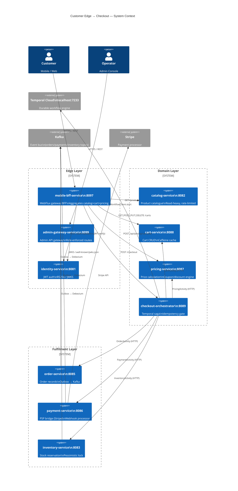
```mermaid
C4Context
  title Customer Edge → Checkout — System Context

  Person(customer, "Customer", "Mobile / Web")
  Person(admin, "Operator", "Admin Console")

  System_Boundary(edge, "Edge Layer") {
    System(bff, "mobile-bff-service\n:8097", "WebFlux gateway BFF\nAggregates catalog+cart+pricing")
    System(agw, "admin-gateway-service\n:8099", "Admin API gateway\nRole-enforced routes")
    System(identity, "identity-service\n:8081", "JWT auth\nRS256 / JWKS")
  }

  System_Boundary(domain, "Domain Layer") {
    System(catalog, "catalog-service\n:8082", "Product catalogue\nRead-heavy, rate-limited")
    System(cart, "cart-service\n:8088", "Cart CRUD\nCaffeine cache")
    System(pricing, "pricing-service\n:8087", "Price calculation\nCoupon/discount engine")
    System(checkout, "checkout-orchestrator\n:8089", "Temporal saga\nIdempotency gate")
  }

  System_Boundary(fulfillment, "Fulfilment Layer") {
    System(order, "order-service\n:8085", "Order records\nOutbox → Kafka")
    System(payment, "payment-service\n:8086", "PSP bridge (Stripe)\nWebhook processor")
    System(inventory, "inventory-service\n:8083", "Stock reservation\nPessimistic lock")
  }

  System_Ext(temporal, "Temporal Cloud\nlocalhost:7233", "Durable workflow engine")
  System_Ext(kafka, "Kafka", "Event bus\n(orders/payments/inventory topics)")
  System_Ext(stripe, "Stripe", "Payment processor")

  Rel(customer, bff, "HTTPS / REST")
  Rel(admin, agw, "HTTPS / REST")
  Rel(bff, identity, "POST /auth/validate\n(JWT verify)")
  Rel(agw, identity, "JWKS /.well-known/jwks.json")
  Rel(bff, catalog, "GET /products")
  Rel(bff, cart, "GET|POST|PUT|DELETE /carts")
  Rel(bff, pricing, "POST /api/pricing/calculate")
  Rel(bff, checkout, "POST /checkout")
  Rel(checkout, temporal, "WorkflowClient.start")
  Rel(checkout, cart, "CartActivity (HTTP)")
  Rel(checkout, pricing, "PricingActivity (HTTP)")
  Rel(checkout, inventory, "InventoryActivity (HTTP)")
  Rel(checkout, payment, "PaymentActivity (HTTP)")
  Rel(checkout, order, "OrderActivity (HTTP)")
  Rel(payment, stripe, "Stripe API")
  Rel(order, kafka, "Outbox → Debezium")
  Rel(payment, kafka, "Outbox → Debezium")
  Rel(inventory, kafka, "Outbox → Debezium")
```

---

## 2. Auth & Edge Layer

### 2a. Customer Login & Token Issuance

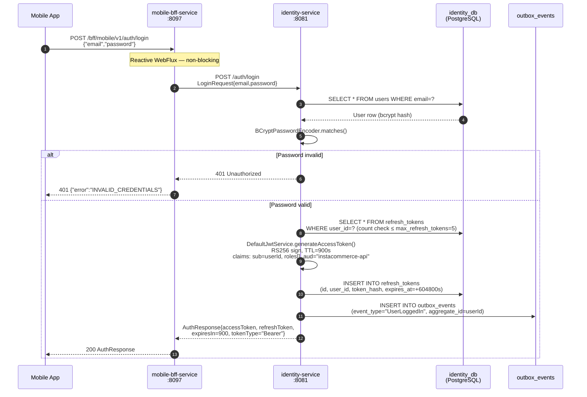
```mermaid
sequenceDiagram
  autonumber
  participant App as Mobile App
  participant BFF as mobile-bff-service<br/>:8097
  participant ID as identity-service<br/>:8081
  participant DB as identity_db<br/>(PostgreSQL)
  participant OB as outbox_events

  App->>BFF: POST /bff/mobile/v1/auth/login<br/>{"email","password"}
  Note over BFF: Reactive WebFlux — non-blocking
  BFF->>ID: POST /auth/login<br/>LoginRequest{email,password}
  ID->>DB: SELECT * FROM users WHERE email=?
  DB-->>ID: User row (bcrypt hash)
  ID->>ID: BCryptPasswordEncoder.matches()
  alt Password invalid
    ID-->>BFF: 401 Unauthorized
    BFF-->>App: 401 {"error":"INVALID_CREDENTIALS"}
  else Password valid
    ID->>DB: SELECT * FROM refresh_tokens<br/>WHERE user_id=? (count check ≤ max_refresh_tokens=5)
    ID->>ID: DefaultJwtService.generateAccessToken()<br/>RS256 sign, TTL=900s<br/>claims: sub=userId, roles[], aud="instacommerce-api"
    ID->>DB: INSERT INTO refresh_tokens<br/>(id, user_id, token_hash, expires_at=+604800s)
    ID->>OB: INSERT INTO outbox_events<br/>(event_type="UserLoggedIn", aggregate_id=userId)
    ID-->>BFF: AuthResponse{accessToken, refreshToken,<br/>expiresIn=900, tokenType="Bearer"}
    BFF-->>App: 200 AuthResponse
  end
```

### 2b. Token Refresh

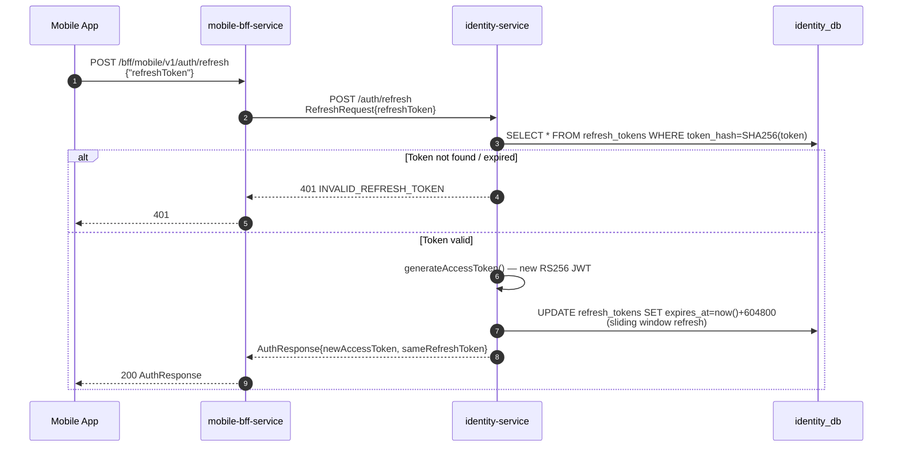
```mermaid
sequenceDiagram
  autonumber
  participant App as Mobile App
  participant BFF as mobile-bff-service
  participant ID as identity-service
  participant DB as identity_db

  App->>BFF: POST /bff/mobile/v1/auth/refresh<br/>{"refreshToken"}
  BFF->>ID: POST /auth/refresh<br/>RefreshRequest{refreshToken}
  ID->>DB: SELECT * FROM refresh_tokens WHERE token_hash=SHA256(token)
  alt Token not found / expired
    ID-->>BFF: 401 INVALID_REFRESH_TOKEN
    BFF-->>App: 401
  else Token valid
    ID->>ID: generateAccessToken() — new RS256 JWT
    ID->>DB: UPDATE refresh_tokens SET expires_at=now()+604800<br/>(sliding window refresh)
    ID-->>BFF: AuthResponse{newAccessToken, sameRefreshToken}
    BFF-->>App: 200 AuthResponse
  end
```

### 2c. Admin Gateway Auth Enforcement

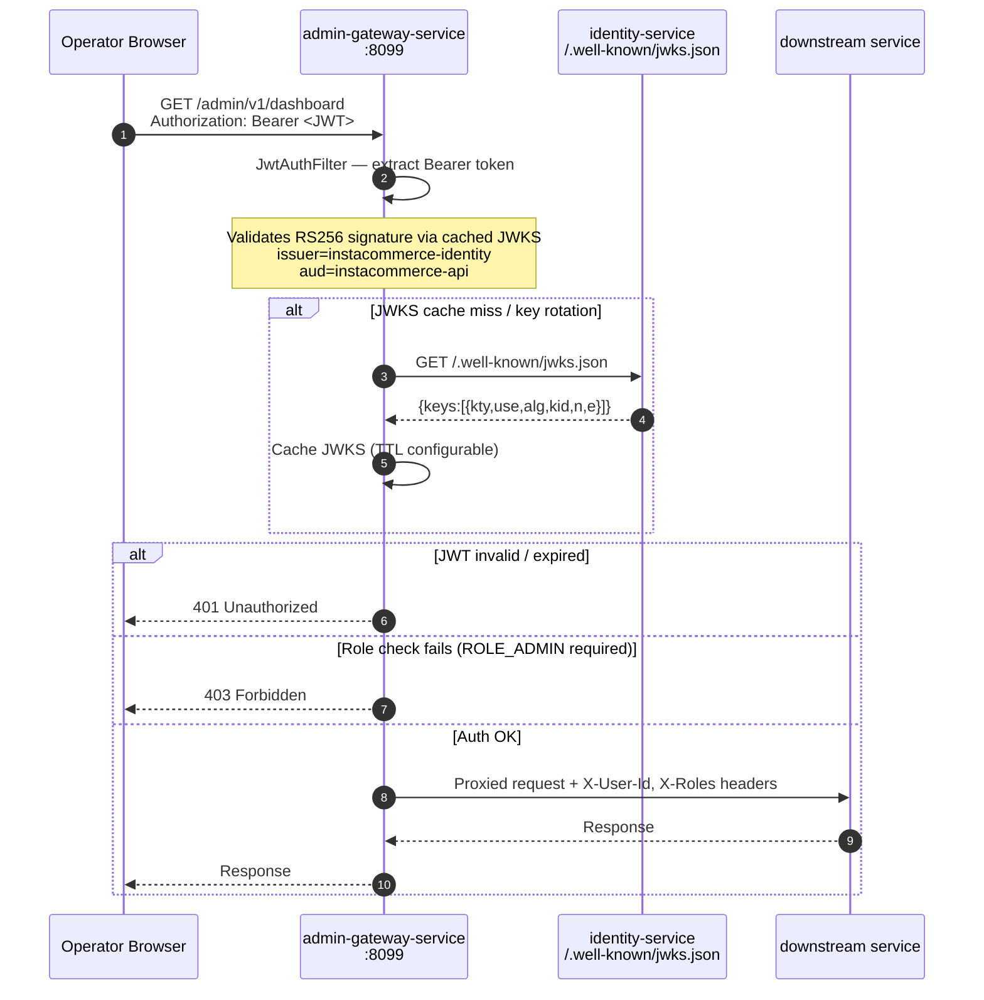
```mermaid
sequenceDiagram
  autonumber
  participant Ops as Operator Browser
  participant AGW as admin-gateway-service<br/>:8099
  participant ID as identity-service<br/>/.well-known/jwks.json
  participant SVC as downstream service

  Ops->>AGW: GET /admin/v1/dashboard<br/>Authorization: Bearer <JWT>
  AGW->>AGW: JwtAuthFilter — extract Bearer token
  Note over AGW: Validates RS256 signature via cached JWKS<br/>issuer=instacommerce-identity<br/>aud=instacommerce-api
  alt JWKS cache miss / key rotation
    AGW->>ID: GET /.well-known/jwks.json
    ID-->>AGW: {keys:[{kty,use,alg,kid,n,e}]}
    AGW->>AGW: Cache JWKS (TTL configurable)
  end
  alt JWT invalid / expired
    AGW-->>Ops: 401 Unauthorized
  else Role check fails (ROLE_ADMIN required)
    AGW-->>Ops: 403 Forbidden
  else Auth OK
    AGW->>SVC: Proxied request + X-User-Id, X-Roles headers
    SVC-->>AGW: Response
    AGW-->>Ops: Response
  end
```

---

## 3. JWT Validation Detail

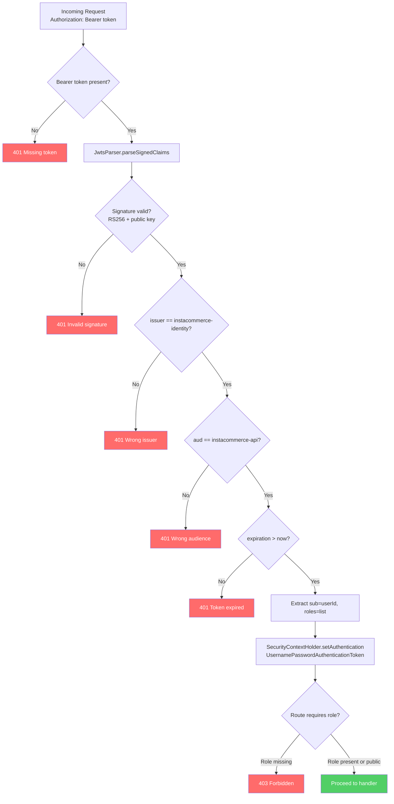
```mermaid
flowchart TD
  A[Incoming Request<br/>Authorization: Bearer token] --> B{Bearer token present?}
  B -- No --> ERR1[401 Missing token]
  B -- Yes --> C[JwtsParser.parseSignedClaims]
  C --> D{Signature valid?\nRS256 + public key}
  D -- No --> ERR2[401 Invalid signature]
  D -- Yes --> E{issuer == instacommerce-identity?}
  E -- No --> ERR3[401 Wrong issuer]
  E -- Yes --> F{aud == instacommerce-api?}
  F -- No --> ERR4[401 Wrong audience]
  F -- Yes --> G{expiration > now?}
  G -- No --> ERR5[401 Token expired]
  G -- Yes --> H[Extract sub=userId, roles=list]
  H --> I[SecurityContextHolder.setAuthentication<br/>UsernamePasswordAuthenticationToken]
  I --> J{Route requires role?}
  J -- Role missing --> ERR6[403 Forbidden]
  J -- Role present or public --> K[Proceed to handler]

  style ERR1 fill:#ff6b6b,color:#fff
  style ERR2 fill:#ff6b6b,color:#fff
  style ERR3 fill:#ff6b6b,color:#fff
  style ERR4 fill:#ff6b6b,color:#fff
  style ERR5 fill:#ff6b6b,color:#fff
  style ERR6 fill:#ff6b6b,color:#fff
  style K fill:#51cf66,color:#fff
```

**Key implementation facts:**
- `DefaultJwtService.validateAccessToken()` — `Jwts.parser().verifyWith(RSAPublicKey).requireIssuer().requireAudience()`
- `JwksController` exposes `GET /.well-known/jwks.json` — RSA public key as JWK Set
- Access token TTL: 900 s (`IDENTITY_ACCESS_TTL`); Refresh token TTL: 604 800 s (7 d)
- Rate limits: login = 5 req/60 s; register = 3 req/60 s (Resilience4j `loginLimiter`)

---

## 4. Pre-Checkout Layer

### 4a. Catalog Browsing

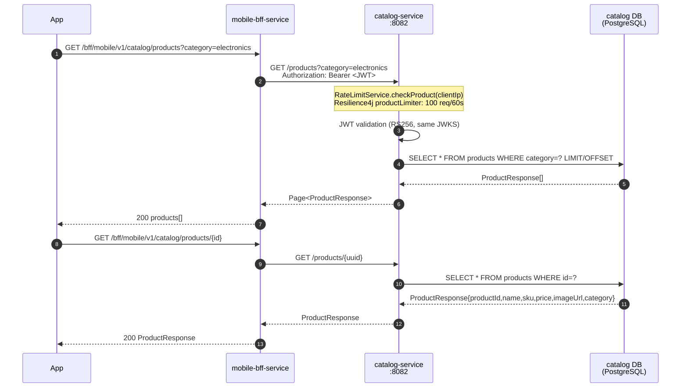
```mermaid
sequenceDiagram
  autonumber
  participant App
  participant BFF as mobile-bff-service
  participant CAT as catalog-service<br/>:8082
  participant CATDB as catalog DB<br/>(PostgreSQL)

  App->>BFF: GET /bff/mobile/v1/catalog/products?category=electronics
  BFF->>CAT: GET /products?category=electronics<br/>Authorization: Bearer <JWT>
  Note over CAT: RateLimitService.checkProduct(clientIp)<br/>Resilience4j productLimiter: 100 req/60s
  CAT->>CAT: JWT validation (RS256, same JWKS)
  CAT->>CATDB: SELECT * FROM products WHERE category=? LIMIT/OFFSET
  CATDB-->>CAT: ProductResponse[]
  CAT-->>BFF: Page<ProductResponse>
  BFF-->>App: 200 products[]

  App->>BFF: GET /bff/mobile/v1/catalog/products/{id}
  BFF->>CAT: GET /products/{uuid}
  CAT->>CATDB: SELECT * FROM products WHERE id=?
  CATDB-->>CAT: ProductResponse{productId,name,sku,price,imageUrl,category}
  CAT-->>BFF: ProductResponse
  BFF-->>App: 200 ProductResponse
```

### 4b. Cart Operations

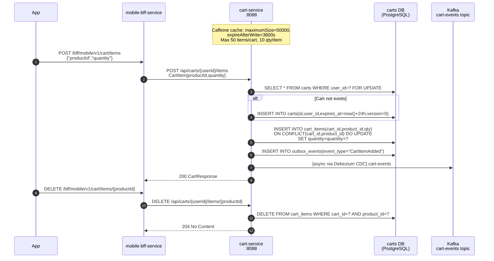
```mermaid
sequenceDiagram
  autonumber
  participant App
  participant BFF as mobile-bff-service
  participant CART as cart-service<br/>:8088
  participant CARTDB as carts DB<br/>(PostgreSQL)
  participant KAFKA as Kafka<br/>cart-events topic

  Note over CART: Caffeine cache: maximumSize=50000,<br/>expireAfterWrite=3600s<br/>Max 50 items/cart, 10 qty/item

  App->>BFF: POST /bff/mobile/v1/cart/items<br/>{"productId","quantity"}
  BFF->>CART: POST /api/carts/{userId}/items<br/>CartItem{productId,quantity}
  CART->>CARTDB: SELECT * FROM carts WHERE user_id=? FOR UPDATE
  alt Cart not exists
    CART->>CARTDB: INSERT INTO carts(id,user_id,expires_at=now()+24h,version=0)
  end
  CART->>CARTDB: INSERT INTO cart_items(cart_id,product_id,qty)<br/>ON CONFLICT(cart_id,product_id) DO UPDATE<br/>SET quantity=quantity+?
  CART->>CARTDB: INSERT INTO outbox_events(event_type="CartItemAdded")
  CART->>KAFKA: [async via Debezium CDC] cart-events
  CART-->>BFF: 200 CartResponse

  App->>BFF: DELETE /bff/mobile/v1/cart/items/{productId}
  BFF->>CART: DELETE /api/carts/{userId}/items/{productId}
  CART->>CARTDB: DELETE FROM cart_items WHERE cart_id=? AND product_id=?
  CART-->>BFF: 204 No Content
```

### 4c. Pricing Calculation

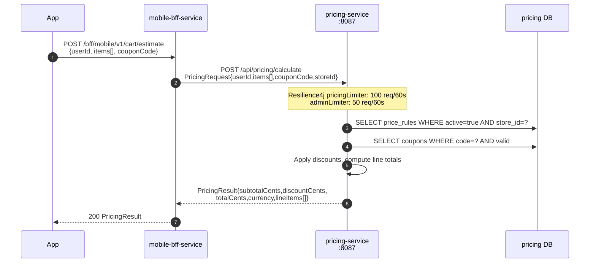
```mermaid
sequenceDiagram
  autonumber
  participant App
  participant BFF as mobile-bff-service
  participant PRICE as pricing-service<br/>:8087
  participant PRICEDB as pricing DB

  App->>BFF: POST /bff/mobile/v1/cart/estimate<br/>{userId, items[], couponCode}
  BFF->>PRICE: POST /api/pricing/calculate<br/>PricingRequest{userId,items[],couponCode,storeId}
  Note over PRICE: Resilience4j pricingLimiter: 100 req/60s<br/>adminLimiter: 50 req/60s
  PRICE->>PRICEDB: SELECT price_rules WHERE active=true AND store_id=?
  PRICE->>PRICEDB: SELECT coupons WHERE code=? AND valid
  PRICE->>PRICE: Apply discounts, compute line totals
  PRICE-->>BFF: PricingResult{subtotalCents,discountCents,<br/>totalCents,currency,lineItems[]}
  BFF-->>App: 200 PricingResult
```

---

## 5. Checkout Initiation & Idempotency Gate

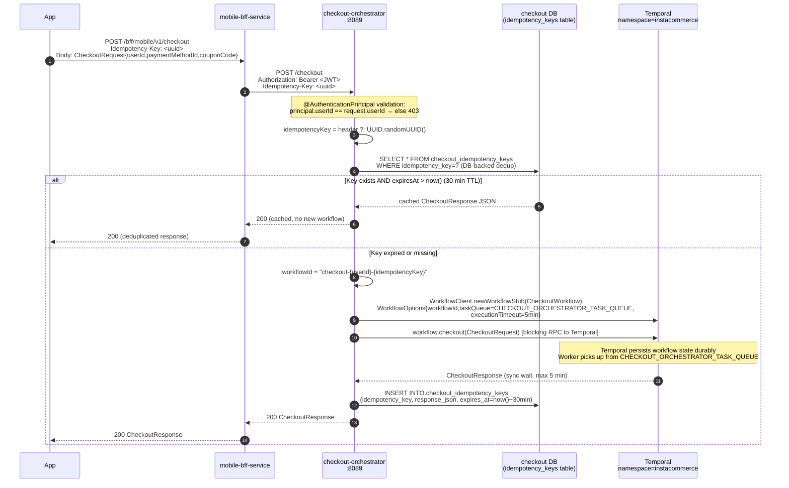
```mermaid
sequenceDiagram
  autonumber
  participant App
  participant BFF as mobile-bff-service
  participant CO as checkout-orchestrator<br/>:8089
  participant CODB as checkout DB<br/>(idempotency_keys table)
  participant TMP as Temporal<br/>namespace=instacommerce

  App->>BFF: POST /bff/mobile/v1/checkout<br/>Idempotency-Key: <uuid><br/>Body: CheckoutRequest{userId,paymentMethodId,couponCode}
  BFF->>CO: POST /checkout<br/>Authorization: Bearer <JWT><br/>Idempotency-Key: <uuid>

  Note over CO: @AuthenticationPrincipal validation:<br/>principal.userId == request.userId → else 403

  CO->>CO: idempotencyKey = header ?: UUID.randomUUID()
  CO->>CODB: SELECT * FROM checkout_idempotency_keys<br/>WHERE idempotency_key=? (DB-backed dedup)
  
  alt Key exists AND expiresAt > now() (30 min TTL)
    CODB-->>CO: cached CheckoutResponse JSON
    CO-->>BFF: 200 (cached, no new workflow)
    BFF-->>App: 200 (deduplicated response)
  else Key expired or missing
    CO->>CO: workflowId = "checkout-{userId}-{idempotencyKey}"
    CO->>TMP: WorkflowClient.newWorkflowStub(CheckoutWorkflow)<br/>WorkflowOptions{workflowId,taskQueue=CHECKOUT_ORCHESTRATOR_TASK_QUEUE,<br/>executionTimeout=5min}
    CO->>TMP: workflow.checkout(CheckoutRequest) [blocking RPC to Temporal]
    Note over TMP: Temporal persists workflow state durably<br/>Worker picks up from CHECKOUT_ORCHESTRATOR_TASK_QUEUE
    TMP-->>CO: CheckoutResponse (sync wait, max 5 min)
    CO->>CODB: INSERT INTO checkout_idempotency_keys<br/>(idempotency_key, response_json, expires_at=now()+30min)
    CO-->>BFF: 200 CheckoutResponse
    BFF-->>App: 200 CheckoutResponse
  end
```

**Idempotency key table schema:**
```sql
-- checkout_idempotency_keys
id               UUID PRIMARY KEY
idempotency_key  VARCHAR(64) UNIQUE NOT NULL
checkout_response TEXT NOT NULL        -- serialized JSON
expires_at       TIMESTAMPTZ NOT NULL  -- TTL = 30 minutes
created_at       TIMESTAMPTZ DEFAULT now()
```

---

## 6. Temporal Checkout Workflow — Happy Path

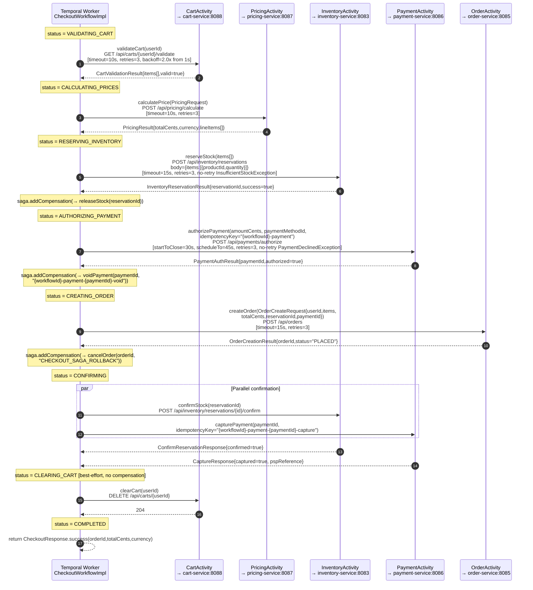
```mermaid
sequenceDiagram
  autonumber
  participant TMP as Temporal Worker<br/>CheckoutWorkflowImpl
  participant CART as CartActivity<br/>→ cart-service:8088
  participant PRICE as PricingActivity<br/>→ pricing-service:8087
  participant INV as InventoryActivity<br/>→ inventory-service:8083
  participant PAY as PaymentActivity<br/>→ payment-service:8086
  participant ORD as OrderActivity<br/>→ order-service:8085

  Note over TMP: status = VALIDATING_CART
  TMP->>CART: validateCart(userId)<br/>GET /api/carts/{userId}/validate<br/>[timeout=10s, retries=3, backoff=2.0x from 1s]
  CART-->>TMP: CartValidationResult{items[],valid=true}
  
  Note over TMP: status = CALCULATING_PRICES
  TMP->>PRICE: calculatePrice(PricingRequest)<br/>POST /api/pricing/calculate<br/>[timeout=10s, retries=3]
  PRICE-->>TMP: PricingResult{totalCents,currency,lineItems[]}

  Note over TMP: status = RESERVING_INVENTORY
  TMP->>INV: reserveStock(items[])<br/>POST /api/inventory/reservations<br/>body={items:[{productId,quantity}]}<br/>[timeout=15s, retries=3, no-retry InsufficientStockException]
  INV-->>TMP: InventoryReservationResult{reservationId,success=true}
  Note over TMP: saga.addCompensation(→ releaseStock(reservationId))

  Note over TMP: status = AUTHORIZING_PAYMENT
  TMP->>PAY: authorizePayment(amountCents, paymentMethodId,<br/>idempotencyKey="{workflowId}-payment")<br/>POST /api/payments/authorize<br/>[startToClose=30s, scheduleTo=45s, retries=3, no-retry PaymentDeclinedException]
  PAY-->>TMP: PaymentAuthResult{paymentId,authorized=true}
  Note over TMP: saga.addCompensation(→ voidPayment(paymentId,<br/>"{workflowId}-payment-{paymentId}-void"))

  Note over TMP: status = CREATING_ORDER
  TMP->>ORD: createOrder(OrderCreateRequest{userId,items,<br/>totalCents,reservationId,paymentId})<br/>POST /api/orders<br/>[timeout=15s, retries=3]
  ORD-->>TMP: OrderCreationResult{orderId,status="PLACED"}
  Note over TMP: saga.addCompensation(→ cancelOrder(orderId,<br/>"CHECKOUT_SAGA_ROLLBACK"))

  Note over TMP: status = CONFIRMING
  par Parallel confirmation
    TMP->>INV: confirmStock(reservationId)<br/>POST /api/inventory/reservations/{id}/confirm
    TMP->>PAY: capturePayment(paymentId,<br/>idempotencyKey="{workflowId}-payment-{paymentId}-capture")
  end
  INV-->>TMP: ConfirmReservationResponse{confirmed=true}
  PAY-->>TMP: CaptureResponse{captured=true, pspReference}

  Note over TMP: status = CLEARING_CART  [best-effort, no compensation]
  TMP->>CART: clearCart(userId)<br/>DELETE /api/carts/{userId}
  CART-->>TMP: 204

  Note over TMP: status = COMPLETED
  TMP-->>TMP: return CheckoutResponse.success(orderId,totalCents,currency)
```

---

## 7. Workflow State Machine

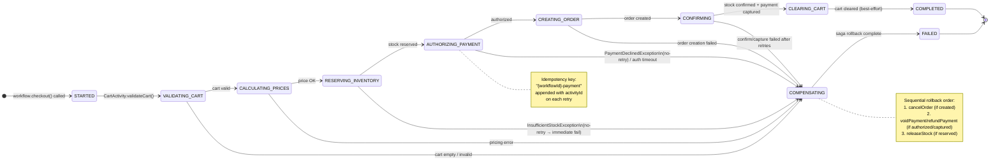
```mermaid
stateDiagram-v2
  direction LR
  [*] --> STARTED : workflow.checkout() called
  STARTED --> VALIDATING_CART : CartActivity.validateCart()
  VALIDATING_CART --> CALCULATING_PRICES : cart valid
  VALIDATING_CART --> COMPENSATING : cart empty / invalid
  CALCULATING_PRICES --> RESERVING_INVENTORY : price OK
  CALCULATING_PRICES --> COMPENSATING : pricing error
  RESERVING_INVENTORY --> AUTHORIZING_PAYMENT : stock reserved
  RESERVING_INVENTORY --> COMPENSATING : InsufficientStockException\n(no-retry → immediate fail)
  AUTHORIZING_PAYMENT --> CREATING_ORDER : authorized
  AUTHORIZING_PAYMENT --> COMPENSATING : PaymentDeclinedException\n(no-retry) / auth timeout
  CREATING_ORDER --> CONFIRMING : order created
  CREATING_ORDER --> COMPENSATING : order creation failed
  CONFIRMING --> CLEARING_CART : stock confirmed + payment captured
  CONFIRMING --> COMPENSATING : confirm/capture failed after retries
  CLEARING_CART --> COMPLETED : cart cleared (best-effort)
  COMPLETED --> [*]
  COMPENSATING --> FAILED : saga rollback complete
  FAILED --> [*]

  note right of COMPENSATING
    Sequential rollback order:
    1. cancelOrder (if created)
    2. voidPayment/refundPayment (if authorized/captured)
    3. releaseStock (if reserved)
  end note
  note right of AUTHORIZING_PAYMENT
    Idempotency key:
    "{workflowId}-payment"
    appended with activityId
    on each retry
  end note
```

**`@QueryMethod getStatus()` returns current state string — queryable at any point during execution.**

---

## 8. Downstream Services

### 8a. Order Service — Create Order

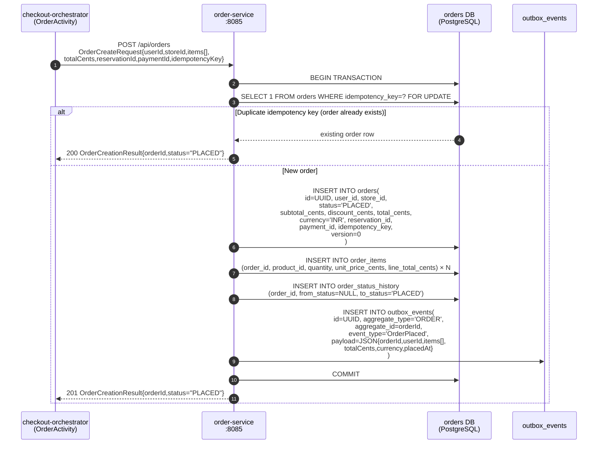
```mermaid
sequenceDiagram
  autonumber
  participant CO as checkout-orchestrator<br/>(OrderActivity)
  participant OS as order-service<br/>:8085
  participant OSDB as orders DB<br/>(PostgreSQL)
  participant OB as outbox_events

  CO->>OS: POST /api/orders<br/>OrderCreateRequest{userId,storeId,items[],<br/>totalCents,reservationId,paymentId,idempotencyKey}
  
  OS->>OSDB: BEGIN TRANSACTION
  OS->>OSDB: SELECT 1 FROM orders WHERE idempotency_key=? FOR UPDATE
  alt Duplicate idempotency key (order already exists)
    OSDB-->>OS: existing order row
    OS-->>CO: 200 OrderCreationResult{orderId,status="PLACED"}
  else New order
    OS->>OSDB: INSERT INTO orders(<br/>  id=UUID, user_id, store_id,<br/>  status='PLACED',<br/>  subtotal_cents, discount_cents, total_cents,<br/>  currency='INR', reservation_id,<br/>  payment_id, idempotency_key,<br/>  version=0<br/>)
    OS->>OSDB: INSERT INTO order_items<br/>(order_id, product_id, quantity, unit_price_cents, line_total_cents) × N
    OS->>OSDB: INSERT INTO order_status_history<br/>(order_id, from_status=NULL, to_status='PLACED')
    OS->>OB: INSERT INTO outbox_events(<br/>  id=UUID, aggregate_type='ORDER',<br/>  aggregate_id=orderId,<br/>  event_type='OrderPlaced',<br/>  payload=JSON{orderId,userId,items[],<br/>  totalCents,currency,placedAt}<br/>)
    OS->>OSDB: COMMIT
    OS-->>CO: 201 OrderCreationResult{orderId,status="PLACED"}
  end
```

### 8b. Payment Service — Authorize & Capture

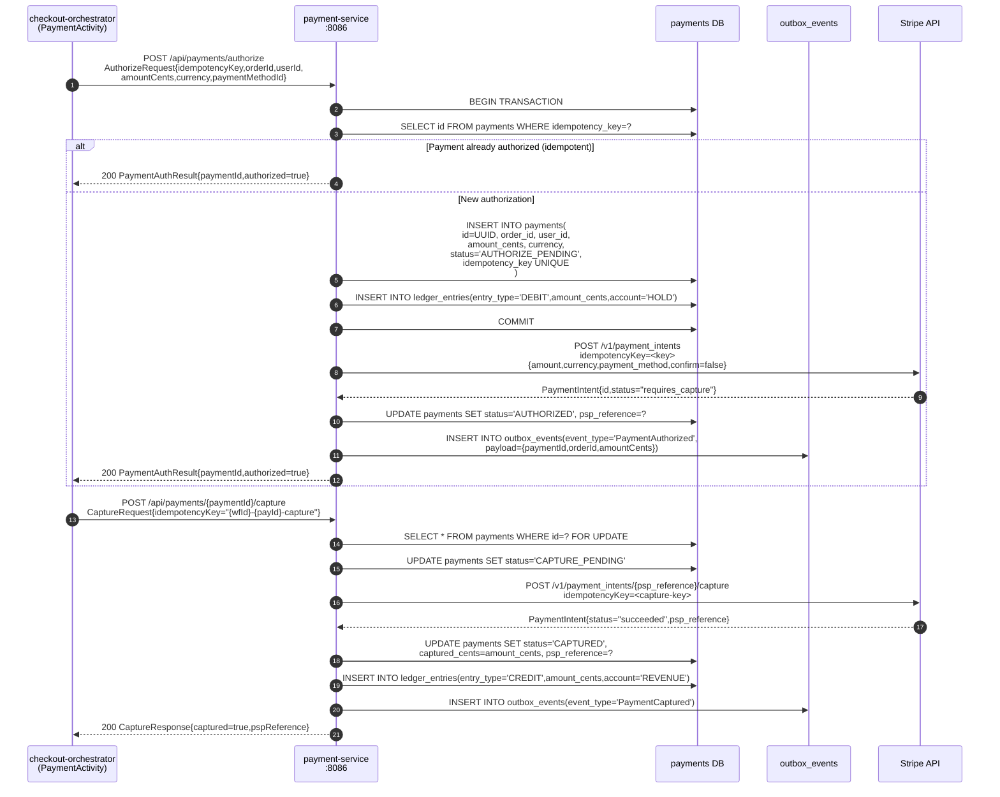
```mermaid
sequenceDiagram
  autonumber
  participant CO as checkout-orchestrator<br/>(PaymentActivity)
  participant PS as payment-service<br/>:8086
  participant PSDB as payments DB
  participant OB as outbox_events
  participant STRIPE as Stripe API

  %% ── AUTHORIZE ──────────────────────────────────
  CO->>PS: POST /api/payments/authorize<br/>AuthorizeRequest{idempotencyKey,orderId,userId,<br/>amountCents,currency,paymentMethodId}

  PS->>PSDB: BEGIN TRANSACTION
  PS->>PSDB: SELECT id FROM payments WHERE idempotency_key=?
  alt Payment already authorized (idempotent)
    PS-->>CO: 200 PaymentAuthResult{paymentId,authorized=true}
  else New authorization
    PS->>PSDB: INSERT INTO payments(<br/>  id=UUID, order_id, user_id,<br/>  amount_cents, currency,<br/>  status='AUTHORIZE_PENDING',<br/>  idempotency_key UNIQUE<br/>)
    PS->>PSDB: INSERT INTO ledger_entries(entry_type='DEBIT',amount_cents,account='HOLD')
    PS->>PSDB: COMMIT
    PS->>STRIPE: POST /v1/payment_intents<br/>idempotencyKey=<key><br/>{amount,currency,payment_method,confirm=false}
    STRIPE-->>PS: PaymentIntent{id,status="requires_capture"}
    PS->>PSDB: UPDATE payments SET status='AUTHORIZED', psp_reference=?
    PS->>OB: INSERT INTO outbox_events(event_type='PaymentAuthorized',<br/>payload={paymentId,orderId,amountCents})
    PS-->>CO: 200 PaymentAuthResult{paymentId,authorized=true}
  end

  %% ── CAPTURE ──────────────────────────────────
  CO->>PS: POST /api/payments/{paymentId}/capture<br/>CaptureRequest{idempotencyKey="{wfId}-{payId}-capture"}
  PS->>PSDB: SELECT * FROM payments WHERE id=? FOR UPDATE
  PS->>PSDB: UPDATE payments SET status='CAPTURE_PENDING'
  PS->>STRIPE: POST /v1/payment_intents/{psp_reference}/capture<br/>idempotencyKey=<capture-key>
  STRIPE-->>PS: PaymentIntent{status="succeeded",psp_reference}
  PS->>PSDB: UPDATE payments SET status='CAPTURED',<br/>captured_cents=amount_cents, psp_reference=?
  PS->>PSDB: INSERT INTO ledger_entries(entry_type='CREDIT',amount_cents,account='REVENUE')
  PS->>OB: INSERT INTO outbox_events(event_type='PaymentCaptured')
  PS-->>CO: 200 CaptureResponse{captured=true,pspReference}
```

### 8c. Inventory Service — Reserve & Confirm

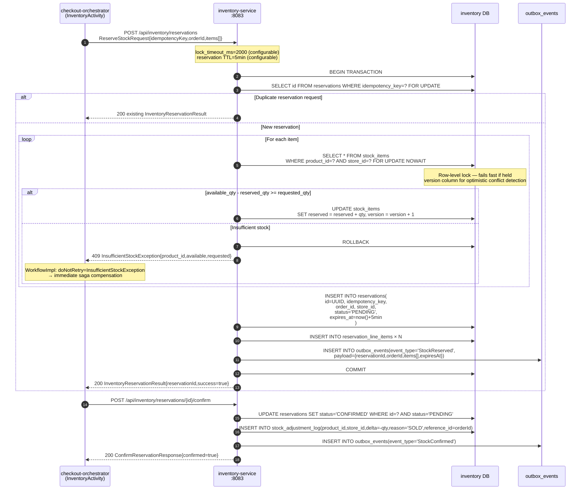
```mermaid
sequenceDiagram
  autonumber
  participant CO as checkout-orchestrator<br/>(InventoryActivity)
  participant IS as inventory-service<br/>:8083
  participant ISDB as inventory DB
  participant OB as outbox_events

  %% ── RESERVE ──────────────────────────────────
  CO->>IS: POST /api/inventory/reservations<br/>ReserveStockRequest{idempotencyKey,orderId,items[]}
  Note over IS: lock_timeout_ms=2000 (configurable)<br/>reservation TTL=5min (configurable)

  IS->>ISDB: BEGIN TRANSACTION
  IS->>ISDB: SELECT id FROM reservations WHERE idempotency_key=? FOR UPDATE
  alt Duplicate reservation request
    IS-->>CO: 200 existing InventoryReservationResult
  else New reservation
    loop For each item
      IS->>ISDB: SELECT * FROM stock_items<br/>WHERE product_id=? AND store_id=? FOR UPDATE NOWAIT
      Note over ISDB: Row-level lock — fails fast if held<br/>version column for optimistic conflict detection
      alt available_qty - reserved_qty >= requested_qty
        IS->>ISDB: UPDATE stock_items<br/>SET reserved = reserved + qty, version = version + 1
      else Insufficient stock
        IS->>ISDB: ROLLBACK
        IS-->>CO: 409 InsufficientStockException{product_id,available,requested}
        Note over CO: WorkflowImpl: doNotRetry=InsufficientStockException<br/>→ immediate saga compensation
      end
    end
    IS->>ISDB: INSERT INTO reservations(<br/>  id=UUID, idempotency_key,<br/>  order_id, store_id,<br/>  status='PENDING',<br/>  expires_at=now()+5min<br/>)
    IS->>ISDB: INSERT INTO reservation_line_items × N
    IS->>OB: INSERT INTO outbox_events(event_type='StockReserved',<br/>payload={reservationId,orderId,items[],expiresAt})
    IS->>ISDB: COMMIT
    IS-->>CO: 200 InventoryReservationResult{reservationId,success=true}
  end

  %% ── CONFIRM ──────────────────────────────────
  CO->>IS: POST /api/inventory/reservations/{id}/confirm
  IS->>ISDB: UPDATE reservations SET status='CONFIRMED' WHERE id=? AND status='PENDING'
  IS->>ISDB: INSERT INTO stock_adjustment_log(product_id,store_id,delta=-qty,reason='SOLD',reference_id=orderId)
  IS->>OB: INSERT INTO outbox_events(event_type='StockConfirmed')
  IS-->>CO: 200 ConfirmReservationResponse{confirmed=true}
```

---

## 9. Saga Compensation — Failure Branches

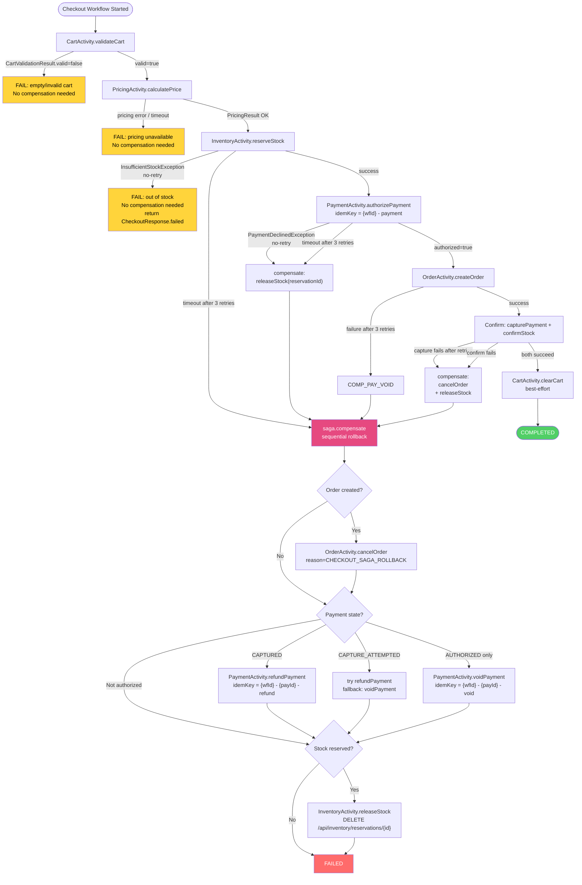
```mermaid
flowchart TD
  START([Checkout Workflow Started]) --> VC[CartActivity.validateCart]
  VC -->|CartValidationResult.valid=false| FAIL_CART[FAIL: empty/invalid cart\nNo compensation needed]
  VC -->|valid=true| CP[PricingActivity.calculatePrice]
  CP -->|pricing error / timeout| FAIL_PRICE[FAIL: pricing unavailable\nNo compensation needed]
  CP -->|PricingResult OK| RS[InventoryActivity.reserveStock]
  
  RS -->|InsufficientStockException\nno-retry| FAIL_INV[FAIL: out of stock\nNo compensation needed\nreturn CheckoutResponse.failed]
  RS -->|timeout after 3 retries| COMP_START
  RS -->|success| AP["PaymentActivity.authorizePayment<br />idemKey = {wfId} - payment"]
  
  AP -->|PaymentDeclinedException\nno-retry| COMP_INV["compensate:\nreleaseStock(reservationId)"]
  AP -->|timeout after 3 retries| COMP_INV
  AP -->|authorized=true| CO[OrderActivity.createOrder]
  
  CO -->|failure after 3 retries| COMP_PAY_VOID
  CO -->|success| CONFIRM[Confirm: capturePayment + confirmStock]
  
  CONFIRM -->|capture fails after retries| COMP_ORD[compensate:\ncancelOrder\n+ releaseStock]
  CONFIRM -->|confirm fails| COMP_ORD
  CONFIRM -->|both succeed| CLEAR[CartActivity.clearCart\nbest-effort]
  CLEAR --> DONE([COMPLETED])

  COMP_INV --> COMP_START[saga.compensate\nsequential rollback]
  COMP_PAY_VOID --> COMP_START
  COMP_ORD --> COMP_START

  COMP_START --> C1{Order created?}
  C1 -->|Yes| CANCEL_ORD[OrderActivity.cancelOrder\nreason=CHECKOUT_SAGA_ROLLBACK]
  C1 -->|No| C2{Payment state?}
  CANCEL_ORD --> C2

  C2 -->|CAPTURED| REFUND["PaymentActivity.refundPayment\nidemKey = {wfId} - {payId} - refund"]
  C2 -->|CAPTURE_ATTEMPTED| TRY_REFUND[try refundPayment\nfallback: voidPayment]
  C2 -->|AUTHORIZED only| VOID["PaymentActivity.voidPayment\nidemKey = {wfId} - {payId} - void"]
  C2 -->|Not authorized| C3{Stock reserved?}

  REFUND --> C3
  TRY_REFUND --> C3
  VOID --> C3

  C3 -->|Yes| RELEASE["InventoryActivity.releaseStock\nDELETE /api/inventory/reservations/{id}"]
  C3 -->|No| FAILED_END[FAILED]
  RELEASE --> FAILED_END

  style FAIL_CART fill:#ffd43b,color:#000
  style FAIL_PRICE fill:#ffd43b,color:#000
  style FAIL_INV fill:#ffd43b,color:#000
  style DONE fill:#51cf66,color:#fff
  style FAILED_END fill:#ff6b6b,color:#fff
  style COMP_START fill:#e64980,color:#fff
```

### Compensation — Idempotency Keys Matrix

| Operation | Idempotency Key Pattern | Notes |
|---|---|---|
| Authorize payment | `{workflowId}-payment` | Set before call; appended with `activityId` on retry |
| Capture payment | `{workflowId}-payment-{paymentId}-capture` | Per-payment, per-operation |
| Void authorization | `{workflowId}-payment-{paymentId}-void` | Safe to retry; PSP deduplicates |
| Refund payment | `{workflowId}-payment-{paymentId}-refund` | Per-payment; partial refund unsafe without amount lock |
| Create order | `idempotency_key UNIQUE` column in `orders` table | Service-level dedup via DB constraint |
| Reserve stock | `idempotency_key UNIQUE` column in `reservations` table | Service-level dedup |

---

## 10. Async Event Flow

### 10a. Outbox → Debezium → Kafka Pipeline

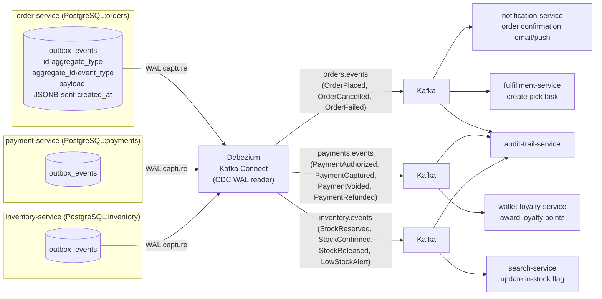
```mermaid
flowchart LR
  subgraph order_svc["order-service (PostgreSQL:orders)"]
    OT[(outbox_events\nid·aggregate_type\naggregate_id·event_type\npayload JSONB·sent·created_at)]
  end
  subgraph payment_svc["payment-service (PostgreSQL:payments)"]
    PT[(outbox_events)]
  end
  subgraph inventory_svc["inventory-service (PostgreSQL:inventory)"]
    IT[(outbox_events)]
  end

  DEB["Debezium\nKafka Connect\n(CDC WAL reader)"]

  OT -->|WAL capture| DEB
  PT -->|WAL capture| DEB
  IT -->|WAL capture| DEB

  DEB -->|"orders.events\n(OrderPlaced, OrderCancelled, OrderFailed)"| KO[Kafka]
  DEB -->|"payments.events\n(PaymentAuthorized, PaymentCaptured,\nPaymentVoided, PaymentRefunded)"| KP[Kafka]
  DEB -->|"inventory.events\n(StockReserved, StockConfirmed,\nStockReleased, LowStockAlert)"| KI[Kafka]

  KO --> NOTIF[notification-service\norder confirmation email/push]
  KO --> FULFIL[fulfillment-service\ncreate pick task]
  KO --> AUDIT[audit-trail-service]
  KP --> WALLET[wallet-loyalty-service\naward loyalty points]
  KP --> AUDIT
  KI --> AUDIT
  KI --> SEARCH[search-service\nupdate in-stock flag]
```

### 10b. Event Envelope Format (contracts/EventEnvelope.v1.json)

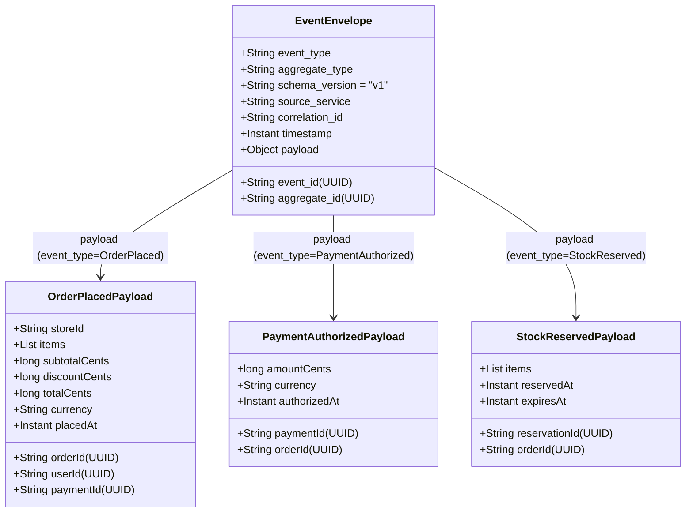
```mermaid
classDiagram
  class EventEnvelope {
    +String event_id (UUID)
    +String event_type
    +String aggregate_type
    +String aggregate_id (UUID)
    +String schema_version = "v1"
    +String source_service
    +String correlation_id
    +Instant timestamp
    +Object payload
  }
  class OrderPlacedPayload {
    +String orderId (UUID)
    +String userId (UUID)
    +String storeId
    +String paymentId (UUID)
    +List items
    +long subtotalCents
    +long discountCents
    +long totalCents
    +String currency
    +Instant placedAt
  }
  class PaymentAuthorizedPayload {
    +String paymentId (UUID)
    +String orderId (UUID)
    +long amountCents
    +String currency
    +Instant authorizedAt
  }
  class StockReservedPayload {
    +String reservationId (UUID)
    +String orderId (UUID)
    +List items
    +Instant reservedAt
    +Instant expiresAt
  }
  EventEnvelope --> OrderPlacedPayload : payload (event_type=OrderPlaced)
  EventEnvelope --> PaymentAuthorizedPayload : payload (event_type=PaymentAuthorized)
  EventEnvelope --> StockReservedPayload : payload (event_type=StockReserved)
```

### 10c. ShedLock — Outbox Relay Job

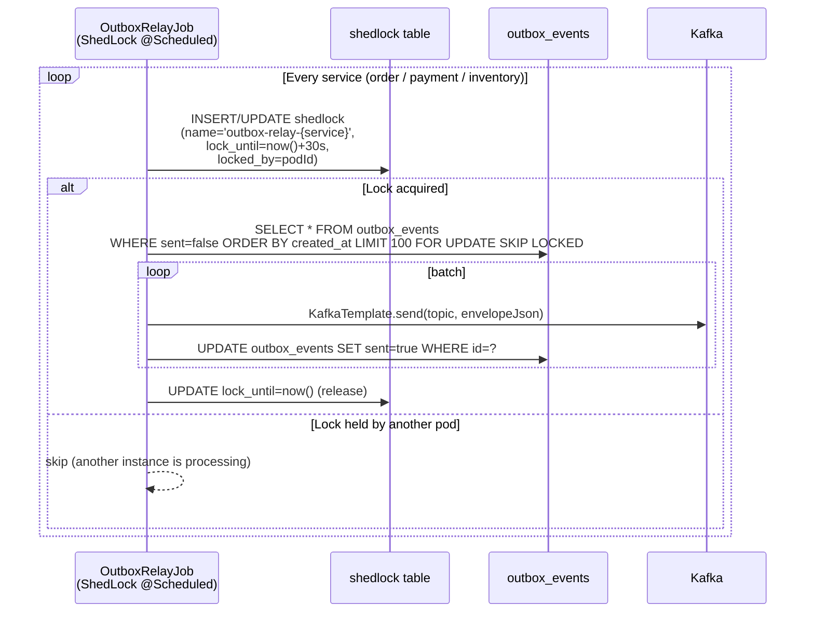
```mermaid
sequenceDiagram
  participant JOB as OutboxRelayJob<br/>(ShedLock @Scheduled)
  participant SHEDLOCK as shedlock table
  participant OB as outbox_events
  participant KAFKA as Kafka

  loop Every service (order / payment / inventory)
    JOB->>SHEDLOCK: INSERT/UPDATE shedlock<br/>(name='outbox-relay-{service}',<br/>lock_until=now()+30s,<br/>locked_by=podId)
    alt Lock acquired
      JOB->>OB: SELECT * FROM outbox_events<br/>WHERE sent=false ORDER BY created_at LIMIT 100 FOR UPDATE SKIP LOCKED
      loop batch
        JOB->>KAFKA: KafkaTemplate.send(topic, envelopeJson)
        JOB->>OB: UPDATE outbox_events SET sent=true WHERE id=?
      end
      JOB->>SHEDLOCK: UPDATE lock_until=now() (release)
    else Lock held by another pod
      JOB-->>JOB: skip (another instance is processing)
    end
  end
```

---

## 11. End-to-End Sequence (Full)

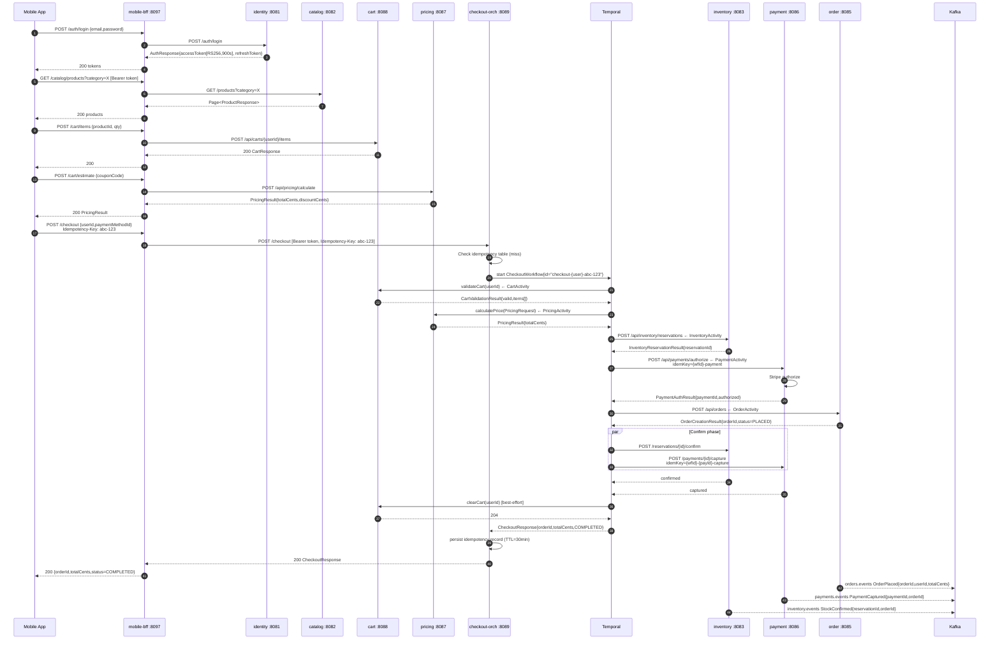
```mermaid
sequenceDiagram
  autonumber
  participant App as Mobile App
  participant BFF as mobile-bff :8097
  participant ID as identity :8081
  participant CAT as catalog :8082
  participant CART as cart :8088
  participant PRICE as pricing :8087
  participant CO as checkout-orch :8089
  participant TMP as Temporal
  participant INV as inventory :8083
  participant PAY as payment :8086
  participant ORD as order :8085
  participant KFK as Kafka

  %% ── Auth ────────────────────────────────────────────
  App->>BFF: POST /auth/login {email,password}
  BFF->>ID: POST /auth/login
  ID-->>BFF: AuthResponse{accessToken[RS256,900s], refreshToken}
  BFF-->>App: 200 tokens

  %% ── Browse ──────────────────────────────────────────
  App->>BFF: GET /catalog/products?category=X [Bearer token]
  BFF->>CAT: GET /products?category=X
  CAT-->>BFF: Page<ProductResponse>
  BFF-->>App: 200 products

  %% ── Cart ────────────────────────────────────────────
  App->>BFF: POST /cart/items {productId, qty}
  BFF->>CART: POST /api/carts/{userId}/items
  CART-->>BFF: 200 CartResponse
  BFF-->>App: 200

  %% ── Price estimate ──────────────────────────────────
  App->>BFF: POST /cart/estimate {couponCode}
  BFF->>PRICE: POST /api/pricing/calculate
  PRICE-->>BFF: PricingResult{totalCents,discountCents}
  BFF-->>App: 200 PricingResult

  %% ── Checkout ────────────────────────────────────────
  App->>BFF: POST /checkout {userId,paymentMethodId}<br/>Idempotency-Key: abc-123
  BFF->>CO: POST /checkout [Bearer token, Idempotency-Key: abc-123]
  CO->>CO: Check idempotency table (miss)
  CO->>TMP: start CheckoutWorkflow{id="checkout-{user}-abc-123"}

  TMP->>CART: validateCart(userId) ← CartActivity
  CART-->>TMP: CartValidationResult{valid,items[]}

  TMP->>PRICE: calculatePrice(PricingRequest) ← PricingActivity
  PRICE-->>TMP: PricingResult{totalCents}

  TMP->>INV: POST /api/inventory/reservations ← InventoryActivity
  INV-->>TMP: InventoryReservationResult{reservationId}

  TMP->>PAY: POST /api/payments/authorize ← PaymentActivity<br/>idemKey={wfId}-payment
  PAY->>PAY: Stripe authorize
  PAY-->>TMP: PaymentAuthResult{paymentId,authorized}

  TMP->>ORD: POST /api/orders ← OrderActivity
  ORD-->>TMP: OrderCreationResult{orderId,status=PLACED}

  par Confirm phase
    TMP->>INV: POST /reservations/{id}/confirm
    TMP->>PAY: POST /payments/{id}/capture<br/>idemKey={wfId}-{payId}-capture
  end
  INV-->>TMP: confirmed
  PAY-->>TMP: captured

  TMP->>CART: clearCart(userId) [best-effort]
  CART-->>TMP: 204

  TMP-->>CO: CheckoutResponse{orderId,totalCents,COMPLETED}
  CO->>CO: persist idempotency record (TTL=30min)
  CO-->>BFF: 200 CheckoutResponse
  BFF-->>App: 200 {orderId,totalCents,status=COMPLETED}

  %% ── Async events ────────────────────────────────────
  ORD-->>KFK: orders.events OrderPlaced{orderId,userId,totalCents}
  PAY-->>KFK: payments.events PaymentCaptured{paymentId,orderId}
  INV-->>KFK: inventory.events StockConfirmed{reservationId,orderId}
```

---

## 12. Idempotency & Failure Surface Map

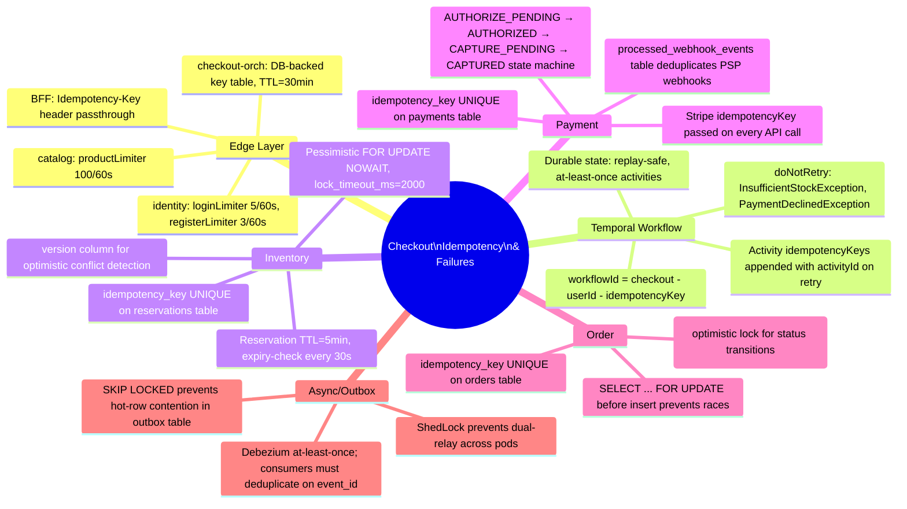
```mermaid
mindmap
  root((Checkout\nIdempotency\n& Failures))
    Edge Layer
      BFF: Idempotency-Key header passthrough
      identity: loginLimiter 5/60s, registerLimiter 3/60s
      catalog: productLimiter 100/60s
      checkout-orch: DB-backed key table, TTL=30min
    Temporal Workflow
      Durable state: replay-safe, at-least-once activities
      workflowId = checkout - userId - idempotencyKey
      Activity idempotencyKeys appended with activityId on retry
      doNotRetry: InsufficientStockException, PaymentDeclinedException
    Inventory
      idempotency_key UNIQUE on reservations table
      Pessimistic FOR UPDATE NOWAIT, lock_timeout_ms=2000
      Reservation TTL=5min, expiry-check every 30s
      version column for optimistic conflict detection
    Payment
      idempotency_key UNIQUE on payments table
      processed_webhook_events table deduplicates PSP webhooks
      Stripe idempotencyKey passed on every API call
      AUTHORIZE_PENDING → AUTHORIZED → CAPTURE_PENDING → CAPTURED state machine
    Order
      idempotency_key UNIQUE on orders table
      SELECT ... FOR UPDATE before insert prevents races
      version column (optimistic lock for status transitions)
    Async/Outbox
      ShedLock prevents dual-relay across pods
      SKIP LOCKED prevents hot-row contention in outbox table
      Debezium at-least-once; consumers must deduplicate on event_id
```

---

## 13. Implementation Notes

### Service Ports (local / compose)

| Service | Port | DB | Temporal Task Queue |
|---|---|---|---|
| identity-service | 8081 | identity_db | — |
| catalog-service | 8082 | catalog | — |
| inventory-service | 8083 | inventory | — |
| cart-service | 8088 | carts | — |
| order-service | 8085 | orders | — |
| payment-service | 8086 | payments | — |
| pricing-service | 8087 | pricing | — |
| checkout-orchestrator | 8089 | checkout | `CHECKOUT_ORCHESTRATOR_TASK_QUEUE` |
| mobile-bff-service | 8097 | — | — |
| admin-gateway-service | 8099 | — | — |

### Key Resilience Config

| Service | Rate Limiter | Connection Pool | Notes |
|---|---|---|---|
| identity | login=5/60s, register=3/60s | 20 max | loginLimiter, registerLimiter |
| catalog | product=100/60s | 20 max | productLimiter |
| pricing | pricing=100/60s, admin=50/60s | default | pricingLimiter |
| order | checkout=10/60s | default | checkoutLimiter |
| inventory | — | 60 max, 15 min-idle | lock_timeout=2s, leak-detection=30s |
| payment | — | 50 max | Higher pool for PSP I/O |

### Temporal Activity Retry Configuration

| Activity | Start-to-Close | Sched-to-Close | Max Attempts | No-Retry Exceptions |
|---|---|---|---|---|
| CartActivity | 10 s | default | 3 | — |
| PricingActivity | 10 s | default | 3 | — |
| InventoryActivity | 15 s | default | 3 | `InsufficientStockException` |
| PaymentActivity | 30 s | 45 s | 3 | `PaymentDeclinedException` |
| OrderActivity | 15 s | default | 3 | — |

### Payment Compensation Decision Tree (Code Reference)

```java
// CheckoutWorkflowImpl.compensatePayment()
if (paymentCaptured) {
    paymentActivity.refundPayment(paymentId, amountCents,
        operationKeyPrefix + "-refund");
} else if (paymentCaptureAttempted) {
    try { paymentActivity.refundPayment(...); }
    catch (Exception e) { paymentActivity.voidPayment(...); }
} else if (paymentAuthorized) {
    paymentActivity.voidPayment(paymentId,
        operationKeyPrefix + "-void");
}
// else: nothing authorized, no compensation needed
```

### Outbox Event Topics

| Topic | Produced By | Key Events |
|---|---|---|
| `orders.events` | order-service | `OrderPlaced`, `OrderCancelled`, `OrderFailed`, `OrderPacked`, `OrderDispatched`, `OrderDelivered` |
| `payments.events` | payment-service | `PaymentAuthorized`, `PaymentCaptured`, `PaymentVoided`, `PaymentRefunded`, `PaymentFailed` |
| `inventory.events` | inventory-service | `StockReserved`, `StockConfirmed`, `StockReleased`, `LowStockAlert` |
| `cart-events` | cart-service | `CartItemAdded` (topic: `CART_EVENTS_TOPIC`) |

### Schema Versioning Rules (contracts/)

- **Additive** changes (optional fields, new event types): same `vN` file, no deprecation window required.  
- **Breaking** changes: new file `OrderPlaced.v2.json`; both versions served during **90-day deprecation window**.  
- `./gradlew :contracts:build` after any proto / JSON schema edit.

### Observability Hooks

All services export to OpenTelemetry Collector (`http://otel-collector.monitoring:4318/v1/traces`) and Prometheus (`/actuator/prometheus`).  
Temporal workflow traces propagate `correlation_id` from the `CheckoutRequest` through all activities.  
Health endpoints: `/actuator/health/readiness`, `/actuator/health/liveness`.

---

*Generated from repo source: `services/*/src/main/java`, `services/*/src/main/resources/application.yml`, `services/*/src/main/resources/db/migration/`, `contracts/`.*
