# LLD: Eventing & Data Pipeline
**Iteration 3 · Low-Level Design · InstaCommerce**

---

## Table of Contents

1. [System-Level Overview](#1-system-level-overview)
2. [Outbox Pattern — per Java Service](#2-outbox-pattern--per-java-service)
3. [Outbox Relay Service — Exactly-Once Delivery](#3-outbox-relay-service--exactly-once-delivery)
4. [Debezium CDC Pipeline — Canonical Topics to BigQuery](#4-debezium-cdc-pipeline--canonical-topics-to-bigquery)
5. [Contract Checkpoints — Event Envelope & Schema Versioning](#5-contract-checkpoints--event-envelope--schema-versioning)
6. [Kafka Topic Map & Consumer Group Registry](#6-kafka-topic-map--consumer-group-registry)
7. [Stream Processor Service — Real-Time Aggregations](#7-stream-processor-service--real-time-aggregations)
8. [Location Ingestion Service — GPS Ingest to Kafka](#8-location-ingestion-service--gps-ingest-to-kafka)
9. [Payment Webhook Service — PSP Ingest with Dedup](#9-payment-webhook-service--psp-ingest-with-dedup)
10. [Reconciliation Engine — Scheduled Financial Reconciliation](#10-reconciliation-engine--scheduled-financial-reconciliation)
11. [DLQ Semantics, Replay, and Failure Recovery](#11-dlq-semantics-replay-and-failure-recovery)
12. [Idempotency & Exactly-Once Caveats](#12-idempotency--exactly-once-caveats)
13. [Data Platform — Beam Streaming Ingestion](#13-data-platform--beam-streaming-ingestion)
14. [Data Platform — dbt Transformation Layers](#14-data-platform--dbt-transformation-layers)
15. [Data Platform — Airflow Orchestration & Quality Gates](#15-data-platform--airflow-orchestration--quality-gates)
16. [Late-Data Handling & Watermarks](#16-late-data-handling--watermarks)
17. [ML/AI — Feature Store & Model Training Loop](#17-mlai--feature-store--model-training-loop)
18. [ML/AI — Online Inference & Feedback Loop](#18-mlai--online-inference--feedback-loop)
19. [End-to-End Order Event Flow (Trace Walk)](#19-end-to-end-order-event-flow-trace-walk)
20. [Operational Ownership Map](#20-operational-ownership-map)

---

## 1. System-Level Overview

The InstaCommerce event and data pipeline is a four-layer system: **producers** (Java services writing to PostgreSQL outbox tables), **transport** (Debezium CDC + Kafka + Go relay/ingestion services), **processing** (Go stream processors + Apache Beam/Dataflow), and **consumption** (BigQuery/dbt/Airflow + Feature Store + ML/AI services).

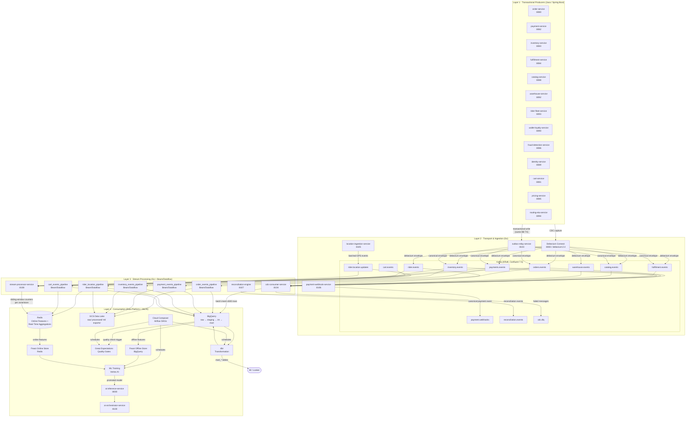
```mermaid
flowchart TB
    subgraph Producers["Layer 1 · Transactional Producers (Java / Spring Boot)"]
        direction LR
        OS[order-service\n:8080] 
        PS[payment-service\n:8082]
        IS[inventory-service\n:8083]
        FS[fulfillment-service\n:8084]
        CS[catalog-service\n:8088]
        WS[warehouse-service\n:8092]
        RS[rider-fleet-service\n:8093]
        WLS[wallet-loyalty-service\n:8090]
        FDS[fraud-detection-service\n:8086]
        IDS[identity-service\n:8089]
        CART[cart-service\n:8081]
        PRIC[pricing-service\n:8085]
        RES[routing-eta-service\n:8094]
    end

    subgraph Transport["Layer 2 · Transport & Ingestion (Go)"]
        direction LR
        ORS[outbox-relay-service\n:8103]
        DEB[Debezium Connect\n:8083 / debezium:2.4]
        PWS[payment-webhook-service\n:8106]
        LIS[location-ingestion-service\n:8105]

        subgraph KafkaCluster["Kafka (KRaft, Confluent 7.5)"]
            K_OE[orders.events]
            K_PE[payments.events]
            K_IE[inventory.events]
            K_FE[fulfillment.events]
            K_CE[catalog.events]
            K_WE[warehouse.events]
            K_RE[rider.events]
            K_RL[rider.location.updates]
            K_CART[cart.events]
            K_PW[payment.webhooks]
            K_REC[reconciliation.events]
            K_DLQ[cdc.dlq]
        end
    end

    subgraph Processing["Layer 3 · Stream Processing (Go + Beam/Dataflow)"]
        SPS[stream-processor-service\n:8108]
        CDC[cdc-consumer-service\n:8104]
        REC[reconciliation-engine\n:8107]
        BEAM_O[order_events_pipeline\nBeam/Dataflow]
        BEAM_P[payment_events_pipeline\nBeam/Dataflow]
        BEAM_I[inventory_events_pipeline\nBeam/Dataflow]
        BEAM_R[rider_location_pipeline\nBeam/Dataflow]
        BEAM_C[cart_events_pipeline\nBeam/Dataflow]
    end

    subgraph Consumption["Layer 4 · Consumption (Data Platform + ML/AI)"]
        direction LR
        BQ[BigQuery\nraw → staging → int → mart]
        GCS[GCS Data Lake\nraw/ processed/ ml/ exports/]
        REDIS[(Redis\nOnline Features +\nReal-Time Aggregations)]
        DBT[dbt\nTransformation]
        AIRFLOW[Cloud Composer\nAirflow DAGs]
        GE[Great Expectations\nQuality Gates]
        FS_OFF[Feast Offline Store\nBigQuery]
        FS_ON[Feast Online Store\nRedis]
        ML[ML Training\nVertex AI]
        AI_INF[ai-inference-service\n:8000]
        AI_ORC[ai-orchestrator-service\n:8100]
    end

    Producers -->|"transactional write\n(same DB TX)"| ORS
    Producers -->|"CDC capture"| DEB
    DEB -->|"debezium envelope"| K_OE & K_PE & K_IE & K_FE & K_CE & K_WE & K_RE
    ORS -->|"canonical envelope"| K_OE & K_PE & K_IE & K_FE & K_CE
    PWS -->|"canonical payment event"| K_PW
    LIS -->|"batched GPS events"| K_RL
    REC -->|"reconciliation events"| K_REC

    K_OE & K_PE & K_IE --> SPS
    K_RE & K_RL --> SPS
    K_OE & K_PE & K_IE & K_FE & K_CE & K_WE & K_RE --> CDC

    K_OE --> BEAM_O
    K_PE --> BEAM_P
    K_IE --> BEAM_I
    K_RL --> BEAM_R
    K_CART --> BEAM_C

    CDC -->|"batch insert ≤500 rows"| BQ
    CDC -->|"failed messages"| K_DLQ
    BEAM_O & BEAM_P & BEAM_I & BEAM_R & BEAM_C --> BQ
    BEAM_O & BEAM_P & BEAM_I & BEAM_R --> GCS
    BEAM_R --> REDIS
    BEAM_C --> REDIS

    SPS -->|"sliding-window counters\nper zone/store"| REDIS
    BQ --> DBT --> BQ
    DBT -->|"mart_* tables"| BI([BI / Looker])
    BQ -->|"quality check trigger"| GE
    AIRFLOW -->|"schedules"| DBT & GE & ML
    BQ -->|"offline features"| FS_OFF
    REDIS -->|"online features"| FS_ON
    FS_OFF & FS_ON --> ML
    ML -->|"promoted model"| AI_INF
    AI_INF --> AI_ORC
```

---

## 2. Outbox Pattern — per Java Service

Thirteen Java services write domain state changes and outbox rows **inside a single database transaction**, guaranteeing that a Kafka message is produced if and only if the domain mutation commits.

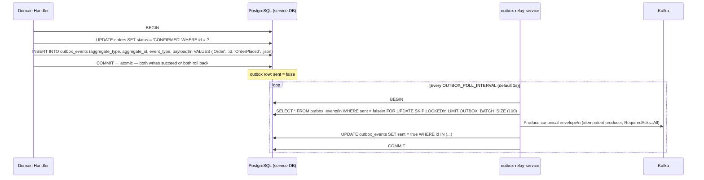
```mermaid
sequenceDiagram
    participant App as Domain Handler
    participant DB as PostgreSQL (service DB)
    participant ORS as outbox-relay-service

    App->>DB: BEGIN
    App->>DB: UPDATE orders SET status = 'CONFIRMED' WHERE id = ?
    App->>DB: INSERT INTO outbox_events (aggregate_type, aggregate_id, event_type, payload)\n VALUES ('Order', :id, 'OrderPlaced', :json)
    App->>DB: COMMIT  ← atomic — both writes succeed or both roll back

    Note over DB: outbox row: sent = false

    loop Every OUTBOX_POLL_INTERVAL (default 1s)
        ORS->>DB: BEGIN
        ORS->>DB: SELECT * FROM outbox_events\n WHERE sent = false\n FOR UPDATE SKIP LOCKED\n LIMIT OUTBOX_BATCH_SIZE (100)
        ORS->>Kafka: Produce canonical envelope\n (idempotent producer, RequiredAcks=All)
        ORS->>DB: UPDATE outbox_events SET sent = true WHERE id IN (...)
        ORS->>DB: COMMIT
    end
```

**Services with outbox tables** (Flyway migration `V*__create_outbox*.sql`):

| Service | Port | Aggregate Types Relayed |
|---------|------|------------------------|
| `order-service` | 8080 | `Order` → `orders.events` |
| `payment-service` | 8082 | `Payment` → `payments.events` |
| `inventory-service` | 8083 | `Inventory` → `inventory.events` |
| `fulfillment-service` | 8084 | `Fulfillment` → `fulfillment.events` |
| `catalog-service` | 8088 | `Product` → `catalog.events` |
| `warehouse-service` | 8092 | `Store` → `warehouse.events` |
| `rider-fleet-service` | 8093 | `Rider` → `rider.events` |
| `wallet-loyalty-service` | 8090 | `Wallet` → wallet events |
| `fraud-detection-service` | 8086 | `FraudSignal` → fraud events |
| `identity-service` | 8089 | `User` → `identity.events` |
| `cart-service` | 8081 | `Cart` → `cart.events` |
| `pricing-service` | 8085 | `PriceRule` → pricing events |
| `routing-eta-service` | 8094 | `Delivery` → routing events |

> **ShedLock** is present on `rider-fleet-service`, `routing-eta-service`, `audit-trail-service`, `wallet-loyalty-service`, and `payment-service` to prevent concurrent outbox sweep when multiple replicas are running.

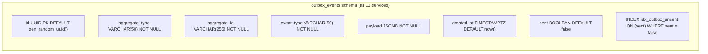
```mermaid
flowchart LR
    subgraph "outbox_events schema (all 13 services)"
        direction TB
        I["id UUID PK DEFAULT gen_random_uuid()"]
        AT["aggregate_type VARCHAR(50) NOT NULL"]
        AI["aggregate_id VARCHAR(255) NOT NULL"]
        ET["event_type VARCHAR(50) NOT NULL"]
        PL["payload JSONB NOT NULL"]
        CA["created_at TIMESTAMPTZ DEFAULT now()"]
        SE["sent BOOLEAN DEFAULT false"]
        IX["INDEX idx_outbox_unsent ON (sent) WHERE sent = false"]
    end
```

---

## 3. Outbox Relay Service — Exactly-Once Delivery

`outbox-relay-service` (`:8103`) provides the transactional bridge between PostgreSQL outbox tables and Kafka, using an idempotent Kafka producer configuration.

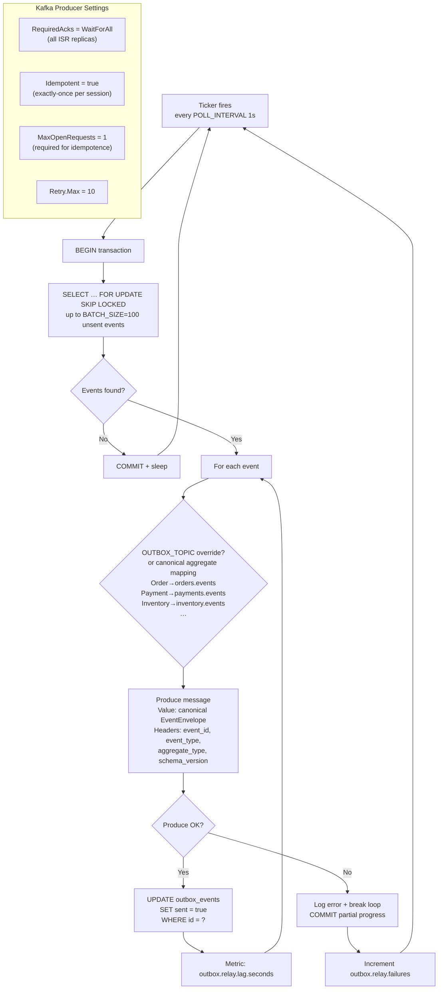
```mermaid
flowchart TD
    A[Ticker fires\nevery POLL_INTERVAL 1s] --> B[BEGIN transaction]
    B --> C["SELECT … FOR UPDATE SKIP LOCKED\nup to BATCH_SIZE=100 unsent events"]
    C --> D{Events found?}
    D -->|No| E[COMMIT + sleep]
    D -->|Yes| F[For each event]
    F --> G{"OUTBOX_TOPIC override?\nor canonical aggregate mapping\nOrder→orders.events\nPayment→payments.events\nInventory→inventory.events\n…"}
    G --> H["Produce message\nValue: canonical EventEnvelope\nHeaders: event_id, event_type,\naggregate_type, schema_version"]
    H --> I{Produce OK?}
    I -->|Yes| J["UPDATE outbox_events\nSET sent = true\nWHERE id = ?"]
    I -->|No| K["Log error + break loop\nCOMMIT partial progress"]
    J --> L[Metric: outbox.relay.lag.seconds]
    L --> F
    K --> M[Increment outbox.relay.failures]
    M --> A
    E --> A

    subgraph "Kafka Producer Settings"
        P1["RequiredAcks = WaitForAll\n(all ISR replicas)"]
        P2["Idempotent = true\n(exactly-once per session)"]
        P3["MaxOpenRequests = 1\n(required for idempotence)"]
        P4["Retry.Max = 10"]
    end
```

**Exactly-once guarantee boundary:** The combination of `SELECT FOR UPDATE SKIP LOCKED` + idempotent producer + `UPDATE sent=true` in the same transaction means a message is produced **at most once per outbox row per relay session**. On relay-process crash after Kafka ACK but before DB COMMIT, the row remains `sent=false` and will be re-produced after restart — idempotence at the producer level prevents broker-side duplication. Consumers must still implement their own deduplication on `event_id` for full end-to-end exactly-once.

---

## 4. Debezium CDC Pipeline — Canonical Topics to BigQuery

Debezium (`debezium/connect:2.4`) captures WAL changes from all PostgreSQL service databases and publishes raw Debezium-envelope messages to CDC topics, independently of the outbox relay path.

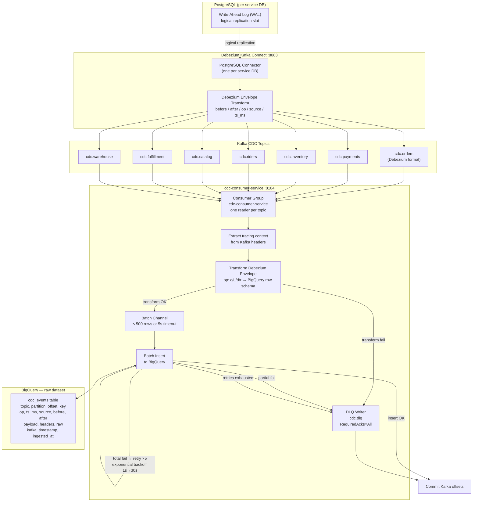
```mermaid
flowchart TD
    subgraph PostgreSQL["PostgreSQL (per service DB)"]
        WAL["Write-Ahead Log (WAL)\nlogical replication slot"]
    end

    subgraph DebeziumConnect["Debezium Kafka Connect :8083"]
        PG_CONN["PostgreSQL Connector\n(one per service DB)"]
        TRANS["Debezium Envelope Transform\nbefore / after / op / source / ts_ms"]
    end

    subgraph KafkaCDC["Kafka CDC Topics"]
        CDC_ORDERS["cdc.orders\n(Debezium format)"]
        CDC_PAYMENTS["cdc.payments"]
        CDC_INVENTORY["cdc.inventory"]
        CDC_RIDERS["cdc.riders"]
        CDC_CATALOG["cdc.catalog"]
        CDC_FULFILL["cdc.fulfillment"]
        CDC_WAREHOUSE["cdc.warehouse"]
    end

    subgraph CDCConsumer["cdc-consumer-service :8104"]
        CG["Consumer Group\ncdc-consumer-service\none reader per topic"]
        EXTRACT["Extract tracing context\nfrom Kafka headers"]
        TRANSFORM["Transform Debezium Envelope\nop: c/u/d/r → BigQuery row schema"]
        BATCH["Batch Channel\n≤ 500 rows or 5s timeout"]
        BQ_INSERT["Batch Insert\nto BigQuery"]
        DLQ_WRITE["DLQ Writer\ncdc.dlq\nRequiredAcks=All"]
    end

    subgraph BigQuery["BigQuery — raw dataset"]
        BQ_TABLE["cdc_events table\ntopic, partition, offset, key\nop, ts_ms, source, before, after\npayload, headers, raw\nkafka_timestamp, ingested_at"]
    end

    WAL -->|"logical replication"| PG_CONN
    PG_CONN --> TRANS --> CDC_ORDERS & CDC_PAYMENTS & CDC_INVENTORY & CDC_RIDERS & CDC_CATALOG & CDC_FULFILL & CDC_WAREHOUSE
    CDC_ORDERS & CDC_PAYMENTS & CDC_INVENTORY & CDC_RIDERS & CDC_CATALOG & CDC_FULFILL & CDC_WAREHOUSE --> CG
    CG --> EXTRACT --> TRANSFORM
    TRANSFORM -->|"transform OK"| BATCH --> BQ_INSERT
    TRANSFORM -->|"transform fail"| DLQ_WRITE
    BQ_INSERT -->|"insert OK"| CommitOffsets["Commit Kafka offsets"]
    BQ_INSERT -->|"partial fail"| DLQ_WRITE
    BQ_INSERT -->|"total fail → retry ×5\nexponential backoff 1s→30s"| BQ_INSERT
    BQ_INSERT -->|"retries exhausted"| DLQ_WRITE
    DLQ_WRITE --> CommitOffsets
    BQ_INSERT --> BQ_TABLE
```

**Note:** The CDC path and the outbox relay path are **complementary, not redundant**. The outbox relay produces canonical domain events with validated JSON Schema payloads. The CDC consumer captures every row mutation (including schema migration side effects) as raw Debezium envelopes for full audit, replay, and data-lineage purposes.

---

## 5. Contract Checkpoints — Event Envelope & Schema Versioning

All domain events flowing through Kafka carry the standard `EventEnvelope.v1.json` shape defined in `contracts/src/main/resources/schemas/common/EventEnvelope.v1.json`.

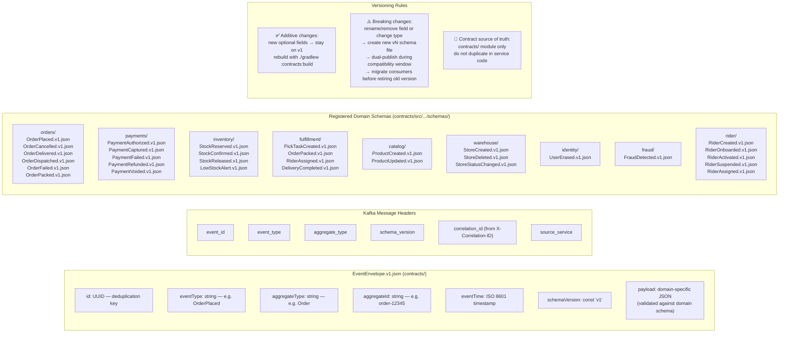
```mermaid
flowchart LR
    subgraph "EventEnvelope.v1.json (contracts/)"
        direction TB
        F1["id: UUID — deduplication key"]
        F2["eventType: string — e.g. OrderPlaced"]
        F3["aggregateType: string — e.g. Order"]
        F4["aggregateId: string — e.g. order-12345"]
        F5["eventTime: ISO 8601 timestamp"]
        F6["schemaVersion: const 'v1'"]
        F7["payload: domain-specific JSON\n(validated against domain schema)"]
    end

    subgraph "Kafka Message Headers"
        H1["event_id"]
        H2["event_type"]
        H3["aggregate_type"]
        H4["schema_version"]
        H5["correlation_id (from X-Correlation-ID)"]
        H6["source_service"]
    end

    subgraph "Registered Domain Schemas (contracts/src/.../schemas/)"
        direction TB
        S_ORD["orders/\nOrderPlaced.v1.json\nOrderCancelled.v1.json\nOrderDelivered.v1.json\nOrderDispatched.v1.json\nOrderFailed.v1.json\nOrderPacked.v1.json"]
        S_PAY["payments/\nPaymentAuthorized.v1.json\nPaymentCaptured.v1.json\nPaymentFailed.v1.json\nPaymentRefunded.v1.json\nPaymentVoided.v1.json"]
        S_INV["inventory/\nStockReserved.v1.json\nStockConfirmed.v1.json\nStockReleased.v1.json\nLowStockAlert.v1.json"]
        S_FUL["fulfillment/\nPickTaskCreated.v1.json\nOrderPacked.v1.json\nRiderAssigned.v1.json\nDeliveryCompleted.v1.json"]
        S_CAT["catalog/\nProductCreated.v1.json\nProductUpdated.v1.json"]
        S_WHS["warehouse/\nStoreCreated.v1.json\nStoreDeleted.v1.json\nStoreStatusChanged.v1.json"]
        S_ID["identity/\nUserErased.v1.json"]
        S_FRD["fraud/\nFraudDetected.v1.json"]
        S_RDR["rider/\nRiderCreated.v1.json\nRiderOnboarded.v1.json\nRiderActivated.v1.json\nRiderSuspended.v1.json\nRiderAssigned.v1.json"]
    end

    subgraph "Versioning Rules"
        direction TB
        VR1["✅ Additive changes:\nnew optional fields → stay on v1\nrebuild with ./gradlew :contracts:build"]
        VR2["⚠️ Breaking changes:\nrename/remove field or change type\n→ create new vN schema file\n→ dual-publish during compatibility window\n→ migrate consumers before retiring old version"]
        VR3["🔑 Contract source of truth:\ncontracts/ module only\ndo not duplicate in service code"]
    end
```

**Rebuild after schema changes:**
```bash
./gradlew :contracts:build   # regenerates Protobuf stubs + validates JSON schemas
```

**Proto definitions** (gRPC, request/response only — not used for async events):
- `common/v1/money.proto` — shared Money type
- `catalog/v1/catalog_service.proto` — GetProductDetails, GetProductsBatch
- `inventory/v1/inventory_service.proto` — CheckAvailability, ReserveStock, ConfirmReservation, CancelReservation
- `payment/v1/payment_service.proto` — payment gRPC operations

---

## 6. Kafka Topic Map & Consumer Group Registry

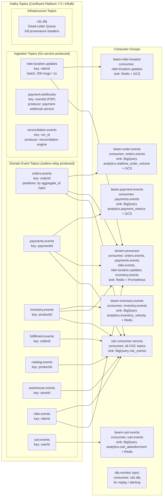
```mermaid
flowchart LR
    subgraph "Kafka Topics (Confluent Platform 7.5 / KRaft)"
        direction TB

        subgraph "Domain Event Topics (outbox-relay produced)"
            OE["orders.events\nkey: orderId\npartitions: by aggregate_id hash"]
            PE["payments.events\nkey: paymentId"]
            IE["inventory.events\nkey: productId"]
            FE["fulfillment.events\nkey: orderId"]
            CE["catalog.events\nkey: productId"]
            WE["warehouse.events\nkey: storeId"]
            RE["rider.events\nkey: riderId"]
            CART["cart.events\nkey: userId"]
        end

        subgraph "Ingestion Topics (Go service produced)"
            RL["rider.location.updates\nkey: riderId\nbatch: 200 msgs / 1s"]
            PW["payment.webhooks\nkey: eventId (PSP)\nproducer: payment-webhook-service"]
            RCN["reconciliation.events\nkey: run_id\nproducer: reconciliation-engine"]
        end

        subgraph "Infrastructure Topics"
            DLQ["cdc.dlq\nDead-Letter Queue\nfull provenance headers"]
        end
    end

    subgraph "Consumer Groups"
        CG_CDC["cdc-consumer-service\nconsumes: all CDC topics\nsink: BigQuery cdc_events"]
        CG_SPS["stream-processor\nconsumes: orders.events, payments.events\nrider.events, rider.location.updates, inventory.events\nsink: Redis + Prometheus"]
        CG_BEAM_O["beam-order-events\nconsumes: orders.events\nsink: BigQuery analytics.realtime_order_volume + GCS"]
        CG_BEAM_P["beam-payment-events\nconsumes: payments.events\nsink: BigQuery analytics.payment_metrics + GCS"]
        CG_BEAM_I["beam-inventory-events\nconsumes: inventory.events\nsink: BigQuery analytics.inventory_velocity + Redis"]
        CG_BEAM_R["beam-rider-location\nconsumes: rider.location.updates\nsink: Redis + GCS"]
        CG_BEAM_C["beam-cart-events\nconsumes: cart.events\nsink: BigQuery analytics.cart_abandonment + Redis"]
        CG_DLQ["dlq-monitor (ops)\nconsumes: cdc.dlq\nfor replay / alerting"]
    end

    OE --> CG_BEAM_O & CG_SPS & CG_CDC
    PE --> CG_BEAM_P & CG_SPS & CG_CDC
    IE --> CG_BEAM_I & CG_SPS & CG_CDC
    FE & CE & WE & RE --> CG_CDC
    CART --> CG_BEAM_C
    RL --> CG_BEAM_R & CG_SPS
    RE --> CG_SPS
```

---

## 7. Stream Processor Service — Real-Time Aggregations

`stream-processor-service` (`:8108`) runs five concurrent consumer goroutines to compute sliding-window business metrics into Redis and expose them as Prometheus gauges.


```mermaid
flowchart TD
    subgraph "Kafka Consumer Group: stream-processor"
        C1["order.events consumer\n→ OrderProcessor"]
        C2["rider.events consumer\n→ RiderProcessor"]
        C3["rider.location.updates consumer\n→ RiderProcessor"]
        C4["payment.events consumer\n→ PaymentProcessor"]
        C5["inventory.events consumer\n→ InventoryProcessor"]
    end

    subgraph "Order Processor (processor/order_processor.go)"
        OP1["orders:count:{minute} — per store/zone"]
        OP2["gmv:total:{date} — running total"]
        OP3["delivery:time:{zoneId}:{minute} — histogram"]
        OP4["orders:cancelled:{zoneId}:{minute}"]
    end

    subgraph "Payment Processor (processor/payment_processor.go)"
        PP1["payments:success_rate:{method} — 5-min window"]
        PP2["payments:revenue:{date}"]
        PP3["payment failure code breakdown"]
    end

    subgraph "Rider Processor (processor/rider_processor.go)"
        RP1["riders:zone:{zoneId}:status — active/idle/offline"]
        RP2["riders:earnings:{riderId}:{date}"]
        RP3["location heatmap data"]
    end

    subgraph "Inventory Processor (processor/inventory_processor.go)"
        IP1["inventory:velocity:{storeId}:{skuId} — 1hr window"]
        IP2["inventory:stockouts:{storeId}"]
        IP3["cascade alert: >10 SKUs at zero"]
    end

    subgraph "SLA Monitor (processor/sla_monitor.go)"
        SLA["30-min sliding window per zone\ncalculate: delivered ≤ 10min / total"]
        SLA_B["SLA breach if % < threshold\nand ≥ 5 orders in window"]
        SLA_M["Prometheus: sla_compliance_ratio\nsla_alerts_total"]
    end

    subgraph Redis["Redis (Aggregated Counters)"]
        R_KEYS["orders:count:*\ngmv:total:*\ndelivery:time:*\nriders:zone:*:status\npayments:success_rate:*\ninventory:velocity:*"]
    end

    C1 --> OP1 & OP2 & OP3 & OP4 & SLA
    C2 --> RP1 & RP2
    C3 --> RP3
    C4 --> PP1 & PP2 & PP3
    C5 --> IP1 & IP2 & IP3
    OP1 & OP2 & OP3 & OP4 --> Redis
    PP1 & PP2 & PP3 --> Redis
    RP1 & RP2 & RP3 --> Redis
    IP1 & IP2 & IP3 --> Redis
    SLA --> SLA_B --> SLA_M
```

---

## 8. Location Ingestion Service — GPS Ingest to Kafka

`location-ingestion-service` (`:8105`) accepts high-frequency GPS pings over HTTP POST and WebSocket, enriches them with H3 geofence data, stores latest position in Redis, and batches to `rider.location.updates`.

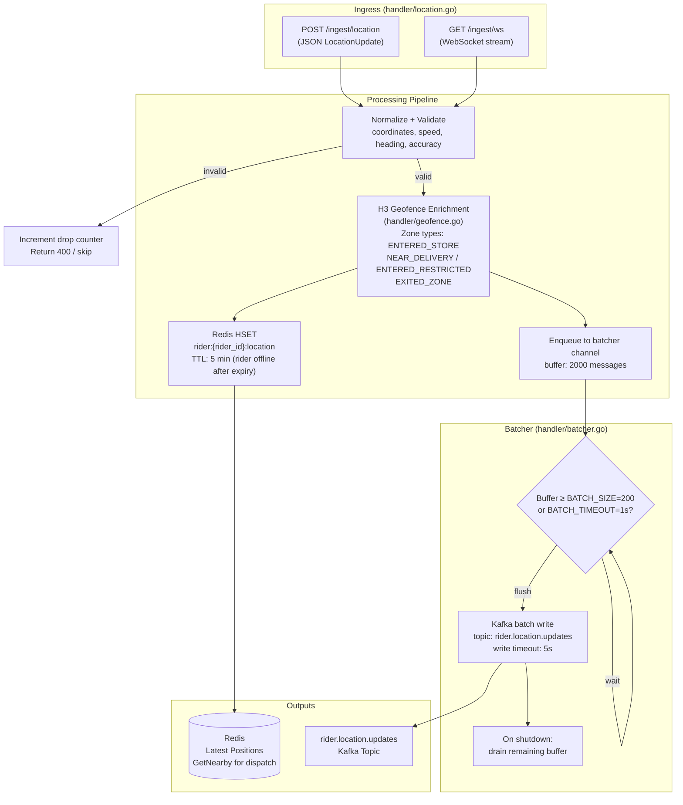
```mermaid
flowchart TD
    subgraph "Ingress (handler/location.go)"
        HTTP["POST /ingest/location\n(JSON LocationUpdate)"]
        WS["GET /ingest/ws\n(WebSocket stream)"]
    end

    subgraph "Processing Pipeline"
        NORM["Normalize + Validate\ncoordinates, speed, heading, accuracy"]
        GEO["H3 Geofence Enrichment\n(handler/geofence.go)\nZone types: ENTERED_STORE\nNEAR_DELIVERY / ENTERED_RESTRICTED\nEXITED_ZONE"]
        REDIS_W["Redis HSET\nrider:{rider_id}:location\nTTL: 5 min (rider offline after expiry)"]
        ENQUEUE["Enqueue to batcher channel\nbuffer: 2000 messages"]
    end

    subgraph "Batcher (handler/batcher.go)"
        BATCH_CHK{"Buffer ≥ BATCH_SIZE=200\nor BATCH_TIMEOUT=1s?"}
        KAFKA_W["Kafka batch write\ntopic: rider.location.updates\nwrite timeout: 5s"]
        DRAIN["On shutdown:\ndrain remaining buffer"]
    end

    subgraph "Outputs"
        REDIS[(Redis\nLatest Positions\nGetNearby for dispatch)]
        KF_RL[rider.location.updates\nKafka Topic]
    end

    HTTP & WS --> NORM
    NORM -->|"invalid"| DROP["Increment drop counter\nReturn 400 / skip"]
    NORM -->|"valid"| GEO --> REDIS_W & ENQUEUE
    REDIS_W --> REDIS
    ENQUEUE --> BATCH_CHK
    BATCH_CHK -->|"flush"| KAFKA_W --> KF_RL
    BATCH_CHK -->|"wait"| BATCH_CHK
    KAFKA_W --> DRAIN
```

---

## 9. Payment Webhook Service — PSP Ingest with Dedup

`payment-webhook-service` (`:8106`) receives callbacks from Stripe, Razorpay, and PhonePe, verifies signatures, deduplicates via Redis or in-memory TTL map, and publishes to `payment.webhooks`.

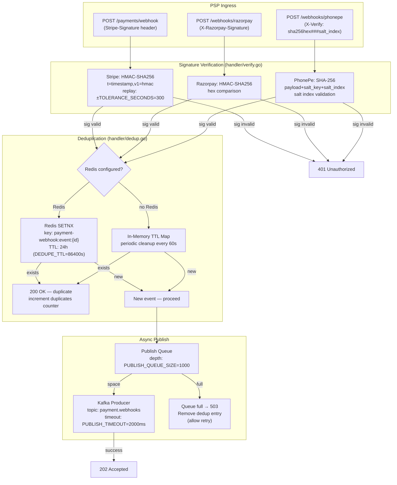
```mermaid
flowchart TD
    subgraph "PSP Ingress"
        STRIPE["POST /payments/webhook\n(Stripe-Signature header)"]
        RAZORPAY["POST /webhooks/razorpay\n(X-Razorpay-Signature)"]
        PHONEPE["POST /webhooks/phonepe\n(X-Verify: sha256hex###salt_index)"]
    end

    subgraph "Signature Verification (handler/verify.go)"
        V_S["Stripe: HMAC-SHA256\nt=timestamp,v1=hmac\nreplay: ±TOLERANCE_SECONDS=300"]
        V_R["Razorpay: HMAC-SHA256\nhex comparison"]
        V_P["PhonePe: SHA-256\npayload+salt_key+salt_index\nsalt index validation"]
    end

    subgraph "Deduplication (handler/dedup.go)"
        DEDUP_CHK{"Redis configured?"}
        REDIS_SETNX["Redis SETNX\nkey: payment-webhook:event:{id}\nTTL: 24h (DEDUPE_TTL=86400s)"]
        MEM_MAP["In-Memory TTL Map\nperiodic cleanup every 60s"]
        DUP["200 OK — duplicate\nincrement duplicates counter"]
        NEW["New event — proceed"]
    end

    subgraph "Async Publish"
        QUEUE["Publish Queue\ndepth: PUBLISH_QUEUE_SIZE=1000"]
        KAFKA_P["Kafka Producer\ntopic: payment.webhooks\ntimeout: PUBLISH_TIMEOUT=2000ms"]
        OVERFLOW["Queue full → 503\nRemove dedup entry\n(allow retry)"]
    end

    STRIPE --> V_S
    RAZORPAY --> V_R
    PHONEPE --> V_P
    V_S & V_R & V_P -->|"sig invalid"| REJECT["401 Unauthorized"]
    V_S & V_R & V_P -->|"sig valid"| DEDUP_CHK
    DEDUP_CHK -->|"Redis"| REDIS_SETNX
    DEDUP_CHK -->|"no Redis"| MEM_MAP
    REDIS_SETNX & MEM_MAP -->|"exists"| DUP
    REDIS_SETNX & MEM_MAP -->|"new"| NEW
    NEW --> QUEUE
    QUEUE -->|"space"| KAFKA_P
    QUEUE -->|"full"| OVERFLOW
    KAFKA_P -->|"success"| ACK["202 Accepted"]
```

---

## 10. Reconciliation Engine — Scheduled Financial Reconciliation

`reconciliation-engine` (`:8107`) runs on a configurable schedule (cron or interval, default 5 min) comparing PSP exports against the internal ledger and publishing reconciliation events.

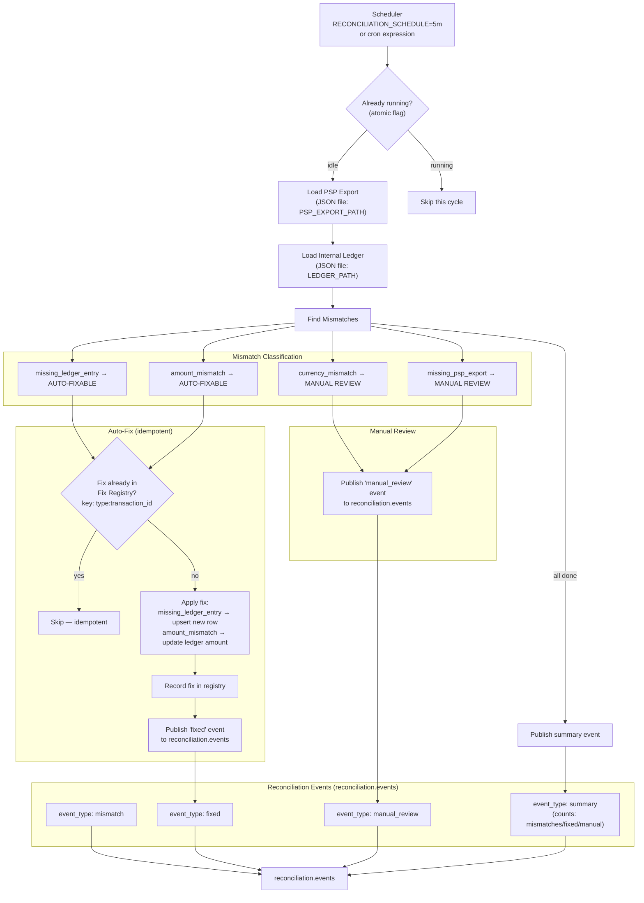
```mermaid
flowchart TD
    SCHED["Scheduler\nRECONCILIATION_SCHEDULE=5m\nor cron expression"]
    GUARD{"Already running?\n(atomic flag)"}
    LOAD_PSP["Load PSP Export\n(JSON file: PSP_EXPORT_PATH)"]
    LOAD_LED["Load Internal Ledger\n(JSON file: LEDGER_PATH)"]
    COMPARE["Find Mismatches"]

    subgraph "Mismatch Classification"
        M1["missing_ledger_entry → AUTO-FIXABLE"]
        M2["amount_mismatch → AUTO-FIXABLE"]
        M3["currency_mismatch → MANUAL REVIEW"]
        M4["missing_psp_export → MANUAL REVIEW"]
    end

    subgraph "Auto-Fix (idempotent)"
        FIX_CHK{"Fix already in\nFix Registry?\nkey: type:transaction_id"}
        FIX_SKIP["Skip — idempotent"]
        FIX_APPLY["Apply fix:\nmissing_ledger_entry → upsert new row\namount_mismatch → update ledger amount"]
        FIX_REG["Record fix in registry"]
        PUB_FIXED["Publish 'fixed' event\nto reconciliation.events"]
    end

    subgraph "Manual Review"
        PUB_MAN["Publish 'manual_review' event\nto reconciliation.events"]
    end

    subgraph "Reconciliation Events (reconciliation.events)"
        E_MISMATCH["event_type: mismatch"]
        E_FIXED["event_type: fixed"]
        E_MANUAL["event_type: manual_review"]
        E_SUMMARY["event_type: summary\n(counts: mismatches/fixed/manual)"]
    end

    SCHED --> GUARD
    GUARD -->|"running"| SKIP_RUN["Skip this cycle"]
    GUARD -->|"idle"| LOAD_PSP --> LOAD_LED --> COMPARE
    COMPARE --> M1 & M2 & M3 & M4
    M3 & M4 --> PUB_MAN --> E_MANUAL
    M1 & M2 --> FIX_CHK
    FIX_CHK -->|"yes"| FIX_SKIP
    FIX_CHK -->|"no"| FIX_APPLY --> FIX_REG --> PUB_FIXED --> E_FIXED
    COMPARE -->|"all done"| PUB_SUM["Publish summary event"] --> E_SUMMARY
    E_MISMATCH & E_FIXED & E_MANUAL & E_SUMMARY --> KF_REC[reconciliation.events]
```

---

## 11. DLQ Semantics, Replay, and Failure Recovery

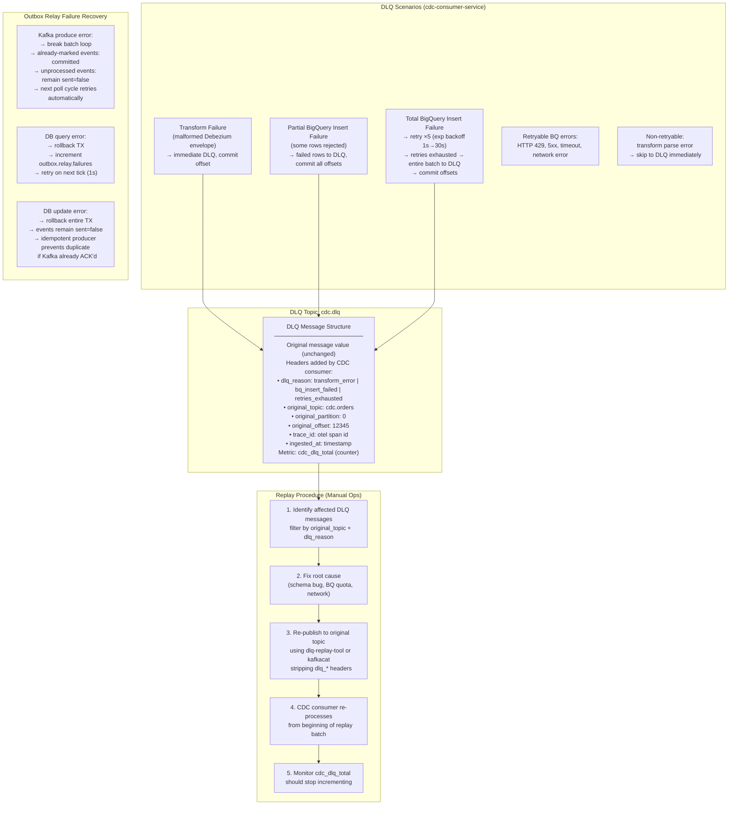
```mermaid
flowchart TD
    subgraph "DLQ Topic: cdc.dlq"
        DLQ_MSG["DLQ Message Structure\n─────────────────────\nOriginal message value (unchanged)\nHeaders added by CDC consumer:\n• dlq_reason: transform_error | bq_insert_failed | retries_exhausted\n• original_topic: cdc.orders\n• original_partition: 0\n• original_offset: 12345\n• trace_id: otel span id\n• ingested_at: timestamp\nMetric: cdc_dlq_total (counter)"]
    end

    subgraph "DLQ Scenarios (cdc-consumer-service)"
        D1["Transform Failure\n(malformed Debezium envelope)\n→ immediate DLQ, commit offset"]
        D2["Partial BigQuery Insert Failure\n(some rows rejected)\n→ failed rows to DLQ, commit all offsets"]
        D3["Total BigQuery Insert Failure\n→ retry ×5 (exp backoff 1s→30s)\n→ retries exhausted → entire batch to DLQ\n→ commit offsets"]
        D4["Retryable BQ errors:\nHTTP 429, 5xx, timeout, network error"]
        D5["Non-retryable:\ntransform parse error\n→ skip to DLQ immediately"]
    end

    subgraph "Replay Procedure (Manual Ops)"
        R1["1. Identify affected DLQ messages\n   filter by original_topic + dlq_reason"]
        R2["2. Fix root cause\n   (schema bug, BQ quota, network)"]
        R3["3. Re-publish to original topic\n   using dlq-replay-tool or kafkacat\n   stripping dlq_* headers"]
        R4["4. CDC consumer re-processes\n   from beginning of replay batch"]
        R5["5. Monitor cdc_dlq_total\n   should stop incrementing"]
    end

    subgraph "Outbox Relay Failure Recovery"
        O1["Kafka produce error:\n→ break batch loop\n→ already-marked events: committed\n→ unprocessed events: remain sent=false\n→ next poll cycle retries automatically"]
        O2["DB query error:\n→ rollback TX\n→ increment outbox.relay.failures\n→ retry on next tick (1s)"]
        O3["DB update error:\n→ rollback entire TX\n→ events remain sent=false\n→ idempotent producer prevents duplicate\n  if Kafka already ACK'd"]
    end

    D1 & D2 & D3 --> DLQ_MSG
    DLQ_MSG --> R1 --> R2 --> R3 --> R4 --> R5
```

---

## 12. Idempotency & Exactly-Once Caveats

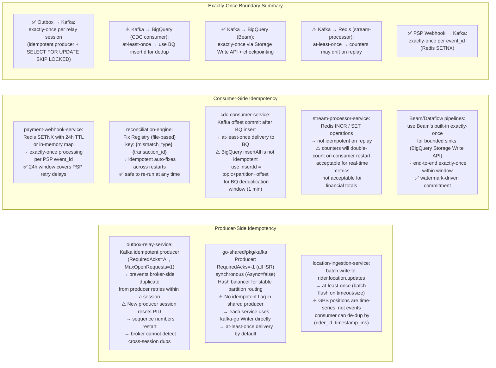
```mermaid
flowchart LR
    subgraph "Producer-Side Idempotency"
        P1["outbox-relay-service:\nKafka idempotent producer\n(RequiredAcks=All, MaxOpenRequests=1)\n→ prevents broker-side duplicate\nfrom producer retries within a session\n⚠️ New producer session resets PID\n  → sequence numbers restart\n  → broker cannot detect cross-session dups"]
        P2["go-shared/pkg/kafka Producer:\nRequiredAcks=-1 (all ISR)\nsynchronous (Async=false)\nHash balancer for stable partition routing\n⚠️ No idempotent flag in shared producer\n  → each service uses kafka-go Writer directly\n  → at-least-once delivery by default"]
        P3["location-ingestion-service:\nbatch write to rider.location.updates\n→ at-least-once (batch flush on timeout/size)\n⚠️ GPS positions are time-series, not events\n  consumer can de-dup by (rider_id, timestamp_ms)"]
    end

    subgraph "Consumer-Side Idempotency"
        C1["payment-webhook-service:\nRedis SETNX with 24h TTL\nor in-memory map\n→ exactly-once processing per PSP event_id\n✅ 24h window covers PSP retry delays"]
        C2["reconciliation-engine:\nFix Registry (file-based)\nkey: {mismatch_type}:{transaction_id}\n→ idempotent auto-fixes across restarts\n✅ safe to re-run at any time"]
        C3["cdc-consumer-service:\nKafka offset commit after BQ insert\n→ at-least-once delivery to BQ\n⚠️ BigQuery insertAll is not idempotent\n  use insertId = topic+partition+offset\n  for BQ deduplication window (1 min)"]
        C4["stream-processor-service:\nRedis INCR / SET operations\n→ not idempotent on replay\n⚠️ counters will double-count on consumer restart\n  acceptable for real-time metrics\n  not acceptable for financial totals"]
        C5["Beam/Dataflow pipelines:\nuse Beam's built-in exactly-once\nfor bounded sinks (BigQuery Storage Write API)\n→ end-to-end exactly-once within window\n✅ watermark-driven commitment"]
    end

    subgraph "Exactly-Once Boundary Summary"
        EO1["✅ Outbox → Kafka:\nexactly-once per relay session\n(idempotent producer + SELECT FOR UPDATE SKIP LOCKED)"]
        EO2["⚠️ Kafka → BigQuery (CDC consumer):\nat-least-once → use BQ insertId for dedup"]
        EO3["✅ Kafka → BigQuery (Beam):\nexactly-once via Storage Write API + checkpointing"]
        EO4["⚠️ Kafka → Redis (stream-processor):\nat-least-once → counters may drift on replay"]
        EO5["✅ PSP Webhook → Kafka:\nexactly-once per event_id (Redis SETNX)"]
    end
```

---

## 13. Data Platform — Beam Streaming Ingestion

Five Apache Beam pipelines run on Google Cloud Dataflow, each with a dedicated Kafka consumer group and windowed aggregations.

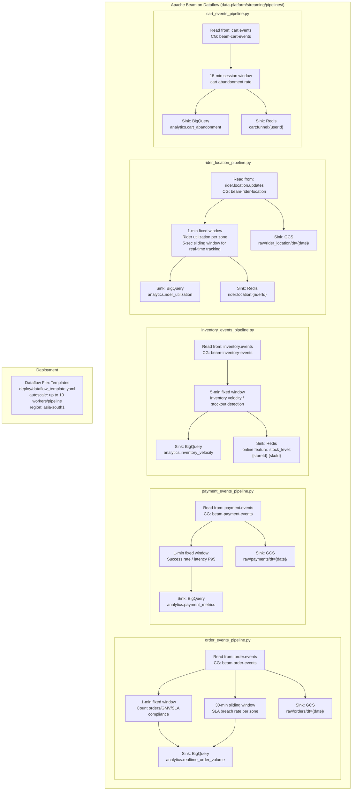
```mermaid
flowchart TD
    subgraph "Apache Beam on Dataflow (data-platform/streaming/pipelines/)"
        subgraph "order_events_pipeline.py"
            OP_SRC["Read from: order.events\nCG: beam-order-events"]
            OP_W1["1-min fixed window\nCount orders/GMV/SLA compliance"]
            OP_W2["30-min sliding window\nSLA breach rate per zone"]
            OP_BQ["Sink: BigQuery\nanalytics.realtime_order_volume"]
            OP_GCS["Sink: GCS\nraw/orders/dt={date}/"]
            OP_SRC --> OP_W1 & OP_W2 --> OP_BQ
            OP_SRC --> OP_GCS
        end

        subgraph "payment_events_pipeline.py"
            PP_SRC["Read from: payment.events\nCG: beam-payment-events"]
            PP_W["1-min fixed window\nSuccess rate / latency P95"]
            PP_BQ["Sink: BigQuery\nanalytics.payment_metrics"]
            PP_GCS["Sink: GCS\nraw/payments/dt={date}/"]
            PP_SRC --> PP_W --> PP_BQ
            PP_SRC --> PP_GCS
        end

        subgraph "inventory_events_pipeline.py"
            IP_SRC["Read from: inventory.events\nCG: beam-inventory-events"]
            IP_W["5-min fixed window\nInventory velocity / stockout detection"]
            IP_BQ["Sink: BigQuery\nanalytics.inventory_velocity"]
            IP_REDIS["Sink: Redis\nonline feature: stock_level:{storeId}:{skuId}"]
            IP_SRC --> IP_W --> IP_BQ & IP_REDIS
        end

        subgraph "rider_location_pipeline.py"
            RL_SRC["Read from: rider.location.updates\nCG: beam-rider-location"]
            RL_W["1-min fixed window\nRider utilization per zone\n5-sec sliding window for real-time tracking"]
            RL_BQ["Sink: BigQuery\nanalytics.rider_utilization"]
            RL_REDIS["Sink: Redis\nrider:location:{riderId}"]
            RL_GCS["Sink: GCS\nraw/rider_location/dt={date}/"]
            RL_SRC --> RL_W --> RL_BQ & RL_REDIS
            RL_SRC --> RL_GCS
        end

        subgraph "cart_events_pipeline.py"
            CP_SRC["Read from: cart.events\nCG: beam-cart-events"]
            CP_W["15-min session window\ncart abandonment rate"]
            CP_BQ["Sink: BigQuery\nanalytics.cart_abandonment"]
            CP_REDIS["Sink: Redis\ncart:funnel:{userId}"]
            CP_SRC --> CP_W --> CP_BQ & CP_REDIS
        end
    end

    subgraph "Deployment"
        DF["Dataflow Flex Templates\ndeploy/dataflow_template.yaml\nautoscale: up to 10 workers/pipeline\nregion: asia-south1"]
    end
```

---

## 14. Data Platform — dbt Transformation Layers

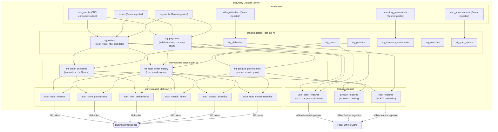
```mermaid
flowchart TD
    subgraph "BigQuery Dataset Layers"
        direction LR

        subgraph "raw dataset"
            R1["cdc_events (CDC consumer output)"]
            R2["orders (Beam ingested)"]
            R3["payments (Beam ingested)"]
            R4["inventory_movements (Beam ingested)"]
            R5["rider_utilization (Beam ingested)"]
            R6["cart_abandonment (Beam ingested)"]
        end

        subgraph "staging dataset (dbt stg_*)"
            ST1["stg_orders\n(clean types, filter test data)"]
            ST2["stg_payments\n(valid amounts, currency enum)"]
            ST3["stg_users"]
            ST4["stg_products"]
            ST5["stg_deliveries"]
            ST6["stg_inventory_movements"]
            ST7["stg_searches"]
            ST8["stg_cart_events"]
        end

        subgraph "intermediate dataset (dbt int_*)"
            I1["int_order_deliveries\n(join orders + fulfillment)"]
            I2["int_user_order_history\n(user × order grain)"]
            I3["int_product_performance\n(product × order grain)"]
        end

        subgraph "marts dataset (dbt mart_*)"
            M1["mart_daily_revenue"]
            M2["mart_store_performance"]
            M3["mart_rider_performance"]
            M4["mart_search_funnel"]
            M5["mart_product_analytics"]
            M6["mart_user_cohort_retention"]
        end

        subgraph "features dataset"
            F1["user_order_features\n(for CLV + personalization)"]
            F2["product_features\n(for search ranking)"]
            F3["rider_features\n(for ETA prediction)"]
        end
    end

    R1 & R2 & R3 --> ST1 & ST2
    R4 --> ST6
    R5 --> ST5
    R6 --> ST8
    ST1 & ST5 --> I1
    ST1 & ST2 & ST3 --> I2
    ST4 & ST1 --> I3
    I1 & I2 --> M1 & M2 & M3
    I2 & I3 --> M4 & M5 & M6
    ST1 & ST2 & ST3 --> F1
    ST4 & I3 --> F2
    I1 & ST5 --> F3

    M1 & M2 & M3 & M4 & M5 & M6 -->|"BI/Looker"| BI([Business Intelligence])
    F1 & F2 & F3 -->|"offline feature ingestion"| FEAST_OFF[Feast Offline Store]
```

---

## 15. Data Platform — Airflow Orchestration & Quality Gates

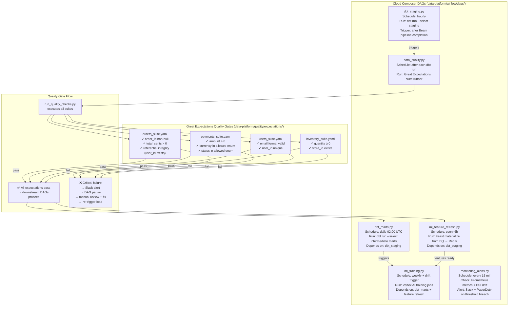
```mermaid
flowchart TD
    subgraph "Cloud Composer DAGs (data-platform/airflow/dags/)"
        DAG_STG["dbt_staging.py\nSchedule: hourly\nRun: dbt run --select staging\nTrigger: after Beam pipeline completion"]
        DAG_MART["dbt_marts.py\nSchedule: daily 02:00 UTC\nRun: dbt run --select intermediate marts\nDepends on: dbt_staging"]
        DAG_QA["data_quality.py\nSchedule: after each dbt run\nRun: Great Expectations suite runner"]
        DAG_FEAT["ml_feature_refresh.py\nSchedule: every 6h\nRun: Feast materialize from BQ → Redis\nDepends on: dbt_staging"]
        DAG_TRAIN["ml_training.py\nSchedule: weekly + drift trigger\nRun: Vertex AI training jobs\nDepends on: dbt_marts + feature refresh"]
        DAG_MON["monitoring_alerts.py\nSchedule: every 15 min\nCheck: Prometheus metrics + PSI drift\nAlert: Slack + PagerDuty on threshold breach"]
    end

    subgraph "Great Expectations Quality Gates (data-platform/quality/expectations/)"
        GE_ORD["orders_suite.yaml\n✓ order_id non-null\n✓ total_cents > 0\n✓ referential integrity (user_id exists)"]
        GE_PAY["payments_suite.yaml\n✓ amount > 0\n✓ currency in allowed enum\n✓ status in allowed enum"]
        GE_USR["users_suite.yaml\n✓ email format valid\n✓ user_id unique"]
        GE_INV["inventory_suite.yaml\n✓ quantity ≥ 0\n✓ store_id exists"]
    end

    subgraph "Quality Gate Flow"
        QG_RUN["run_quality_checks.py\nexecutes all suites"]
        QG_PASS["✅ All expectations pass\n→ downstream DAGs proceed"]
        QG_FAIL["❌ Critical failure\n→ Slack alert\n→ DAG pause\n→ manual review + fix\n→ re-trigger load"]
    end

    DAG_STG -->|"triggers"| DAG_QA
    DAG_QA --> QG_RUN
    QG_RUN --> GE_ORD & GE_PAY & GE_USR & GE_INV
    GE_ORD & GE_PAY & GE_USR & GE_INV -->|"pass"| QG_PASS --> DAG_MART & DAG_FEAT
    GE_ORD & GE_PAY & GE_USR & GE_INV -->|"fail"| QG_FAIL
    DAG_MART -->|"triggers"| DAG_TRAIN
    DAG_FEAT -->|"features ready"| DAG_TRAIN
```

---

## 16. Late-Data Handling & Watermarks

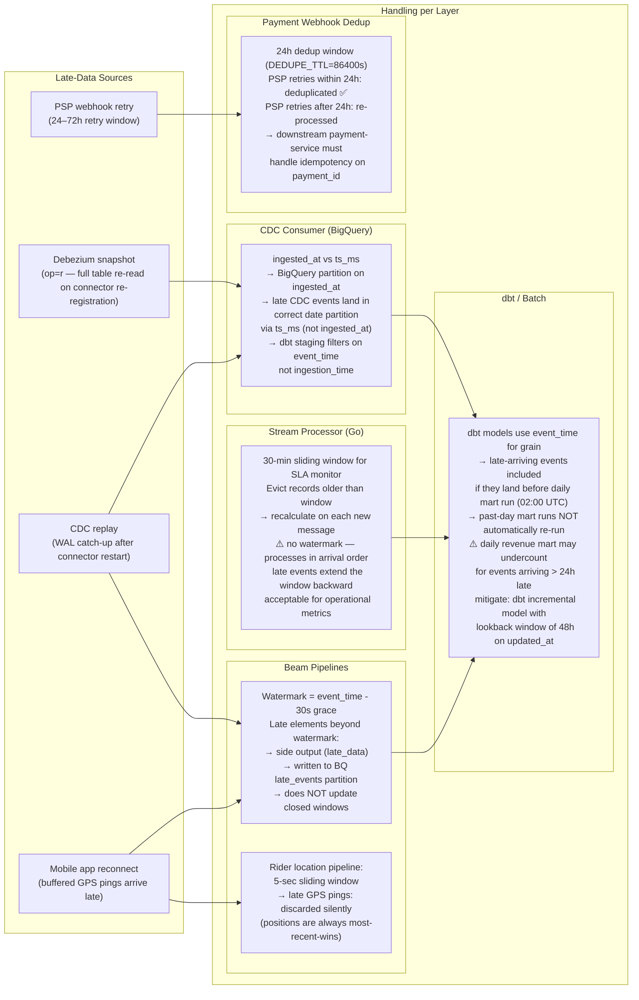
```mermaid
flowchart LR
    subgraph "Late-Data Sources"
        L1["Mobile app reconnect\n(buffered GPS pings arrive late)"]
        L2["PSP webhook retry\n(24–72h retry window)"]
        L3["CDC replay\n(WAL catch-up after connector restart)"]
        L4["Debezium snapshot\n(op=r — full table re-read on connector re-registration)"]
    end

    subgraph "Handling per Layer"
        subgraph "Beam Pipelines"
            BW1["Watermark = event_time - 30s grace\nLate elements beyond watermark:\n→ side output (late_data)\n→ written to BQ late_events partition\n→ does NOT update closed windows"]
            BW2["Rider location pipeline:\n5-sec sliding window\n→ late GPS pings: discarded silently\n(positions are always most-recent-wins)"]
        end

        subgraph "Stream Processor (Go)"
            SW1["30-min sliding window for SLA monitor\nEvict records older than window\n→ recalculate on each new message\n⚠️ no watermark — processes in arrival order\n  late events extend the window backward\n  acceptable for operational metrics"]
        end

        subgraph "CDC Consumer (BigQuery)"
            CDW1["ingested_at vs ts_ms\n→ BigQuery partition on ingested_at\n→ late CDC events land in correct date partition\nvia ts_ms (not ingested_at)\n→ dbt staging filters on event_time\nnot ingestion_time"]
        end

        subgraph "dbt / Batch"
            DBW1["dbt models use event_time for grain\n→ late-arriving events included\nif they land before daily mart run (02:00 UTC)\n→ past-day mart runs NOT automatically re-run\n⚠️ daily revenue mart may undercount\n  for events arriving > 24h late\n  mitigate: dbt incremental model with\n  lookback window of 48h on updated_at"]
        end

        subgraph "Payment Webhook Dedup"
            PWW1["24h dedup window (DEDUPE_TTL=86400s)\nPSP retries within 24h: deduplicated ✅\nPSP retries after 24h: re-processed\n→ downstream payment-service must\n  handle idempotency on payment_id"]
        end
    end

    L1 --> BW2
    L2 --> PWW1
    L3 --> CDW1
    L4 --> CDW1
    L1 & L3 --> BW1
    BW1 & SW1 & CDW1 --> DBW1
```

---

## 17. ML/AI — Feature Store & Model Training Loop

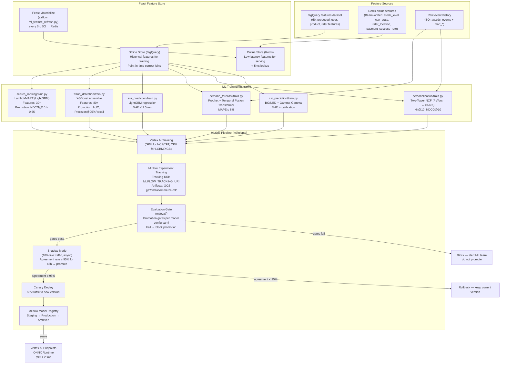
```mermaid
flowchart TD
    subgraph "Feature Sources"
        FS1["BigQuery features dataset\n(dbt-produced: user, product, rider features)"]
        FS2["Redis online features\n(Beam-written: stock_level, cart_state,\nrider_location, payment_success_rate)"]
        FS3["Raw event history\n(BQ raw.cdc_events + mart_*)"]
    end

    subgraph "Feast Feature Store"
        FEAST_OFF["Offline Store (BigQuery)\nHistorical features for training\nPoint-in-time correct joins"]
        FEAST_ON["Online Store (Redis)\nLow-latency features for serving\n< 5ms lookup"]
        FEAST_MAT["Feast Materialize\n(airflow: ml_feature_refresh.py)\nevery 6h: BQ → Redis"]
    end

    subgraph "ML Training (ml/train/)"
        TR_SR["search_ranking/train.py\nLambdaMART (LightGBM)\nFeatures: 30+\nPromotion: NDCG@10 ≥ 0.65"]
        TR_FD["fraud_detection/train.py\nXGBoost ensemble\nFeatures: 80+\nPromotion: AUC, Precision@95%Recall"]
        TR_ETA["eta_prediction/train.py\nLightGBM regression\nMAE ≤ 1.5 min"]
        TR_DF["demand_forecast/train.py\nProphet + Temporal Fusion Transformer\nMAPE ≤ 8%"]
        TR_PERS["personalization/train.py\nTwo-Tower NCF (PyTorch → ONNX)\nHit@10, NDCG@10"]
        TR_CLV["clv_prediction/train.py\nBG/NBD + Gamma-Gamma\nMAE + calibration"]
    end

    subgraph "MLOps Pipeline (ml/mlops/)"
        VTRAIN["Vertex AI Training\n(GPU for NCF/TFT, CPU for LGBM/XGB)"]
        MLFLOW["MLflow Experiment Tracking\nTracking URI: MLFLOW_TRACKING_URI\nArtifacts: GCS gs://instacommerce-ml/"]
        EVAL["Evaluation Gate\n(ml/eval/)\nPromotion gates per model config.yaml\nFail → block promotion"]
        SHADOW["Shadow Mode\n(10% live traffic, async)\nAgreement rate ≥ 95% for 48h → promote"]
        CANARY["Canary Deploy\n5% traffic to new version"]
        REGISTRY["MLflow Model Registry\nStaging → Production → Archived"]
    end

    FS1 --> FEAST_OFF
    FS2 & FEAST_MAT --> FEAST_ON
    FEAST_OFF --> TR_SR & TR_FD & TR_ETA & TR_DF & TR_PERS & TR_CLV
    FS3 --> TR_DF & TR_PERS
    TR_SR & TR_FD & TR_ETA & TR_DF & TR_PERS & TR_CLV --> VTRAIN
    VTRAIN --> MLFLOW --> EVAL
    EVAL -->|"gates pass"| SHADOW
    EVAL -->|"gates fail"| BLOCKED["Block — alert ML team\ndo not promote"]
    SHADOW -->|"agreement ≥ 95%"| CANARY
    SHADOW -->|"agreement < 95%"| ROLLBACK["Rollback — keep current version"]
    CANARY --> REGISTRY
    REGISTRY -->|"serve"| VERTEX["Vertex AI Endpoints\nONNX Runtime\np99 < 25ms"]
```

---

## 18. ML/AI — Online Inference & Feedback Loop

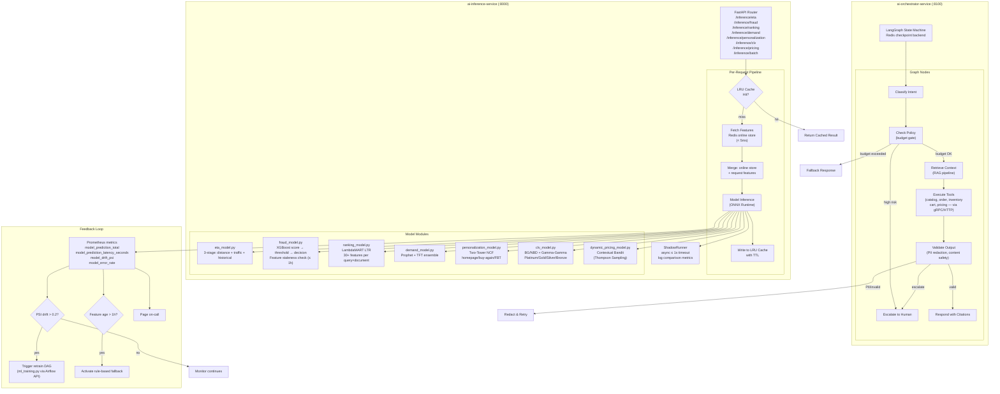
```mermaid
flowchart TD
    subgraph "ai-inference-service (:8000)"
        INF_ROUTE["FastAPI Router\n/inference/eta\n/inference/fraud\n/inference/ranking\n/inference/demand\n/inference/personalization\n/inference/clv\n/inference/pricing\n/inference/batch"]

        subgraph "Per-Request Pipeline"
            CACHE_CHK{"LRU Cache\nHit?"}
            FS_FETCH["Fetch Features\nRedis online store\n(< 5ms)"]
            MERGE["Merge: online store\n+ request features"]
            MODEL_INF["Model Inference\n(ONNX Runtime)"]
            CACHE_W["Write to LRU Cache\nwith TTL"]
        end

        subgraph "Model Modules"
            ETA_M["eta_model.py\n3-stage: distance + traffic + historical"]
            FRAUD_M["fraud_model.py\nXGBoost score → threshold → decision\nFeature staleness check (≤ 1h)"]
            RANK_M["ranking_model.py\nLambdaMART LTR\n30+ features per query×document"]
            DEMAND_M["demand_model.py\nProphet + TFT ensemble"]
            PERS_M["personalization_model.py\nTwo-Tower NCF\nhomepage/buy-again/FBT"]
            CLV_M["clv_model.py\nBG/NBD + Gamma-Gamma\nPlatinum/Gold/Silver/Bronze"]
            PRICE_M["dynamic_pricing_model.py\nContextual Bandit\n(Thompson Sampling)"]
        end

        SHADOW_R["ShadowRunner\nasync ≤ 1s timeout\nlog comparison metrics"]
    end

    subgraph "ai-orchestrator-service (:8100)"
        LANG["LangGraph State Machine\nRedis checkpoint backend"]
        subgraph "Graph Nodes"
            CI["Classify Intent"]
            CP["Check Policy\n(budget gate)"]
            RAG["Retrieve Context\n(RAG pipeline)"]
            ET["Execute Tools\n(catalog, order, inventory\ncart, pricing — via gRPC/HTTP)"]
            VO["Validate Output\n(PII redaction, content safety)"]
            ESC["Escalate to Human"]
            RESP["Respond with Citations"]
        end
    end

    subgraph "Feedback Loop"
        PROM_INF["Prometheus metrics\nmodel_prediction_total\nmodel_prediction_latency_seconds\nmodel_drift_psi\nmodel_error_rate"]
        PSI_CHK{"PSI drift > 0.2?"}
        RETRAIN["Trigger retrain DAG\n(ml_training.py via Airflow API)"]
        STALE_CHK{"Feature age > 1h?"}
        FALLBACK["Activate rule-based fallback"]
        PAGE["Page on-call"]
    end

    INF_ROUTE --> CACHE_CHK
    CACHE_CHK -->|"hit"| RETURN_CACHE["Return Cached Result"]
    CACHE_CHK -->|"miss"| FS_FETCH --> MERGE --> MODEL_INF --> CACHE_W
    MODEL_INF --> ETA_M & FRAUD_M & RANK_M & DEMAND_M & PERS_M & CLV_M & PRICE_M
    MODEL_INF --> SHADOW_R

    LANG --> CI --> CP
    CP -->|"budget OK"| RAG --> ET --> VO
    CP -->|"budget exceeded"| FALLBACK_RESP["Fallback Response"]
    CP -->|"high risk"| ESC
    VO -->|"valid"| RESP
    VO -->|"PII/invalid"| REDACT["Redact & Retry"]
    VO -->|"escalate"| ESC

    MODEL_INF --> PROM_INF
    PROM_INF --> PSI_CHK
    PSI_CHK -->|"yes"| RETRAIN
    PSI_CHK -->|"no"| OK["Monitor continues"]
    PROM_INF --> STALE_CHK
    STALE_CHK -->|"yes"| FALLBACK
    PROM_INF --> PAGE
```

---

## 19. End-to-End Order Event Flow (Trace Walk)

This traces a single `OrderPlaced` event from API request to ML feature update, showing each hop and the contracts checkpoint at each boundary.


```mermaid
sequenceDiagram
    participant Client
    participant Temporal as checkout-orchestrator-service<br/>(Temporal Saga)
    participant OrderSvc as order-service (:8080)
    participant PG as PostgreSQL (order DB)
    participant ORS as outbox-relay-service (:8103)
    participant Kafka as Kafka: orders.events
    participant SPS as stream-processor-service (:8108)
    participant Redis as Redis
    participant CDC as cdc-consumer-service (:8104)
    participant BQ as BigQuery: raw.cdc_events
    participant Beam as Beam: order_events_pipeline
    participant BQ2 as BigQuery: analytics.realtime_order_volume
    participant dbt as dbt (Airflow-triggered)
    participant BQ3 as BigQuery: mart_daily_revenue
    participant Feast as Feast Materialize
    participant AIInf as ai-inference-service (:8000)

    Client->>Temporal: POST /checkout
    Temporal->>OrderSvc: createOrder(request, idempotencyKey)

    Note over OrderSvc,PG: Single DB transaction
    OrderSvc->>PG: INSERT INTO orders (...) 
    OrderSvc->>PG: INSERT INTO outbox_events (aggregate_type='Order', event_type='OrderPlaced', payload={OrderPlaced.v1.json})
    OrderSvc->>PG: COMMIT

    Note over ORS,Kafka: CONTRACT CHECKPOINT 1<br/>EventEnvelope.v1.json validated
    ORS->>PG: SELECT FROM outbox_events WHERE sent=false FOR UPDATE SKIP LOCKED
    ORS->>Kafka: Produce (key=orderId, value=EventEnvelope{OrderPlaced.v1}, headers={event_id, event_type, schema_version=v1})
    ORS->>PG: UPDATE outbox_events SET sent=true COMMIT

    par Real-time stream processing
        Kafka->>SPS: Consume orders.events
        SPS->>Redis: INCR orders:count:{minute}<br/>INCRBYFLOAT gmv:total:{date} totalCents<br/>Recalculate SLA window
    and Debezium CDC path
        PG->>CDC: WAL change (op=c, after={order row})
        Note over CDC,BQ: CONTRACT CHECKPOINT 2<br/>Debezium envelope preserved
        CDC->>BQ: Batch insert (≤500 rows / 5s) to raw.cdc_events
    and Beam streaming
        Kafka->>Beam: Consume orders.events (beam-order-events CG)
        Note over Beam,BQ2: CONTRACT CHECKPOINT 3<br/>1-min fixed window
        Beam->>BQ2: Write analytics.realtime_order_volume
    end

    Note over dbt: Hourly Airflow trigger (dbt_staging.py)
    dbt->>BQ: dbt run --select staging → stg_orders
    dbt->>BQ: dbt test → Great Expectations orders_suite
    dbt->>BQ: dbt run --select intermediate marts → mart_daily_revenue

    Note over dbt,BQ3: CONTRACT CHECKPOINT 4<br/>Quality gate: order_id non-null,<br/>total_cents > 0, referential integrity

    Feast->>BQ3: Materialize user_order_features → Redis online store
    AIInf->>Redis: Fetch user features for personalization
    AIInf->>AIInf: Two-Tower NCF inference → homepage recommendations
```

---

## 20. Operational Ownership Map

```mermaid
flowchart TB
    subgraph "Service Registry & Health Endpoints"
        direction TB

        subgraph "Go Services (Operational)"
            G1["outbox-relay-service :8103\n/health /health/live /health/ready\n/metrics\nOwner: Platform Engineering"]
            G2["cdc-consumer-service :8104\n/health /health/live /ready /health/ready\n/metrics\nOwner: Data Engineering"]
            G3["stream-processor-service :8108\n/health\n/metrics\nOwner: Realtime Analytics"]
            G4["location-ingestion-service :8105\n/health /health/live /ready /health/ready\n/metrics\nOwner: Rider Ops"]
            G5["payment-webhook-service :8106\n/health /health/live /ready /health/ready\n/metrics\nOwner: Payments"]
            G6["reconciliation-engine :8107\n/health /health/live /ready /health/ready\n/metrics\nOwner: Finance"]
            G7["dispatch-optimizer-service :8102\n/health /health/ready /health/live\n/metrics\nOwner: Dispatch"]
        end

        subgraph "Data Platform (Operational)"
            D1["Dataflow Pipelines\nConsole: GCP Dataflow\nAlert: pipeline lag, error rate\nOwner: Data Engineering"]
            D2["dbt / Cloud Composer\nAirflow UI: Cloud Composer\nDAG failure → Slack + PagerDuty\nOwner: Analytics Engineering"]
            D3["Great Expectations\nQuality dashboard\nCritical failure → DAG pause\nOwner: Data Quality"]
            D4["BigQuery\nSlot utilization + query cost\nOwner: Data Engineering"]
        end

        subgraph "ML/AI (Operational)"
            M1["ai-inference-service :8000\n/health /metrics\nDrift alert: PSI > 0.2 → retrain\nFeature stale > 1h → fallback\nOwner: ML Platform"]
            M2["ai-orchestrator-service :8100\n/health\nLangGraph checkpoint: Redis\nOwner: AI Engineering"]
            M3["Vertex AI Endpoints\nModel latency p99 < 25ms\nAuto-scale on RPS\nOwner: ML Platform"]
            M4["MLflow Model Registry\nPromotion gates enforced in eval\nOwner: ML Platform"]
        end
    end

    subgraph "Key Operational Runbooks"
        R1["DLQ spike (cdc_dlq_total rises):\n1. Check original_topic + dlq_reason headers\n2. Fix root cause (schema/quota/network)\n3. Replay from cdc.dlq to original topic\n4. Monitor cdc_dlq_total stops incrementing"]
        R2["Outbox lag (outbox.relay.lag.seconds rises):\n1. Check Kafka broker health\n2. Check PostgreSQL replication lag\n3. Scale outbox-relay replicas\n(ShedLock ensures one active sweeper)"]
        R3["Beam pipeline lag (Dataflow console):\n1. Check consumer group lag on Kafka topic\n2. Increase Dataflow workers (max 10)\n3. Check BQ quota / slot availability"]
        R4["ML drift alert (PSI > 0.2):\n1. Check model_drift_psi gauge per model\n2. Inspect feature distribution shift\n3. Airflow ml_training.py auto-triggered\n4. Shadow → Canary → promote or rollback"]
        R5["Reconciliation mismatch manual_review:\n1. Check reconciliation.events topic\n2. PSP export vs ledger investigation\n3. Manual ledger correction\n4. Re-trigger reconciliation run"]
    end
```

---

## Appendix — Topic Naming & Partition Key Conventions

| Topic | Producer | Key | Partitions | Consumers |
|-------|----------|-----|------------|-----------|
| `orders.events` | outbox-relay → order-service outbox | `orderId` | 12 (suggested) | stream-processor, cdc-consumer, beam-order-events |
| `payments.events` | outbox-relay → payment-service outbox | `paymentId` | 12 | stream-processor, cdc-consumer, beam-payment-events |
| `inventory.events` | outbox-relay → inventory-service outbox | `productId` | 8 | stream-processor, cdc-consumer, beam-inventory-events |
| `fulfillment.events` | outbox-relay → fulfillment-service outbox | `orderId` | 8 | cdc-consumer |
| `catalog.events` | outbox-relay → catalog-service outbox | `productId` | 4 | cdc-consumer |
| `warehouse.events` | outbox-relay → warehouse-service outbox | `storeId` | 4 | cdc-consumer |
| `rider.events` | outbox-relay → rider-fleet-service outbox | `riderId` | 8 | stream-processor, cdc-consumer |
| `cart.events` | outbox-relay → cart-service outbox | `userId` | 8 | beam-cart-events |
| `rider.location.updates` | location-ingestion-service | `riderId` | 16 (high throughput) | stream-processor, beam-rider-location |
| `payment.webhooks` | payment-webhook-service | `eventId` (PSP) | 4 | payment-service (downstream) |
| `reconciliation.events` | reconciliation-engine | `run_id` | 2 | finance tooling |
| `cdc.dlq` | cdc-consumer-service (failure path) | `original_topic:offset` | 4 | dlq-monitor (ops) |

---

*Document generated for Iteration 3 LLD review. Tied to real services and contracts in this repository. Update when: new services add outbox tables, contract schemas change version, new Beam pipelines are added, or ML models are onboarded.*
