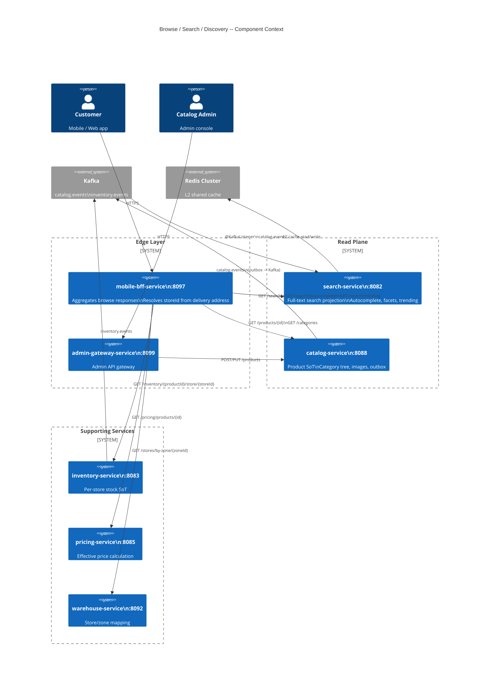
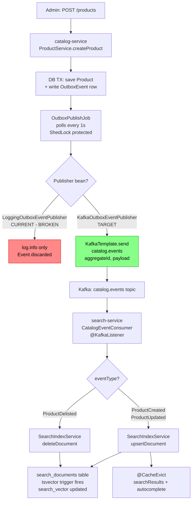
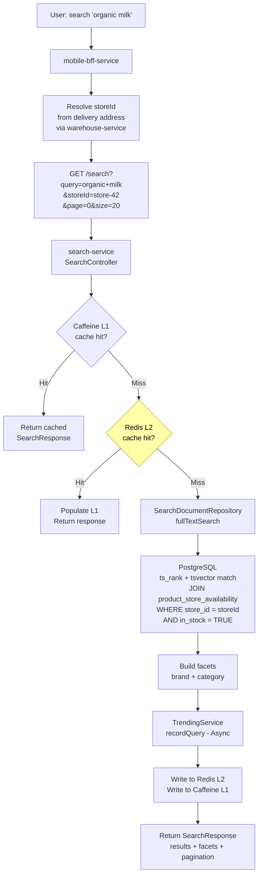
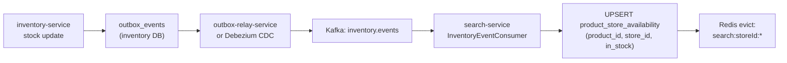

# LLD: Browse / Search / Discovery

**Scope:** catalog-service - search-service - mobile-bff-service (browse aggregation) - inventory-service (availability feed) - pricing-service (price projection)
**Iteration:** 3 | **Updated:** 2026-03-07
**Source truth:** `services/catalog-service/src/`, `services/search-service/src/`, `contracts/src/main/resources/schemas/catalog/`

---

## Contents

1. [Scope and User Journeys](#1-scope-and-user-journeys)
2. [Read/Write Ownership and Source-of-Truth Map](#2-readwrite-ownership-and-source-of-truth-map)
3. [Indexing and Projection Lifecycle](#3-indexing-and-projection-lifecycle)
4. [Cache Layers and Invalidation Semantics](#4-cache-layers-and-invalidation-semantics)
5. [Search Relevance, Ranking, and Fallback Behavior](#5-search-relevance-ranking-and-fallback-behavior)
6. [Failure Modes, Stale-Read Risks, and Degradation Strategy](#6-failure-modes-stale-read-risks-and-degradation-strategy)
7. [Observability and Rollout Controls](#7-observability-and-rollout-controls)
8. [Diagrams](#8-diagrams)
9. [Concrete Remediation and Implementation Sequencing](#9-concrete-remediation-and-implementation-sequencing)

---

## 1. Scope and User Journeys

### 1.1 Bounded context

This LLD covers the **read-hot browse and discovery surface** of InstaCommerce. The
target latency budget is p99 < 150 ms for browse and p99 < 200 ms for search -- the
q-commerce contract where a stale index or a mis-ranked result directly translates
to lost baskets.

Services in scope:

| Service | Role | Port |
|---------|------|------|
| `catalog-service` | System-of-record for products, categories, images, local pricing rules | :8088 |
| `search-service` | Dedicated full-text search projection, autocomplete, facets, trending | :8082 |
| `mobile-bff-service` | Aggregates catalog + search + pricing + inventory into mobile responses | :8097 |
| `inventory-service` | Source-of-truth for per-store stock quantities | :8083 |
| `pricing-service` | Active price rules, promotions, coupon evaluation | :8085 |

### 1.2 User journeys

| # | Journey | Primary service path | Latency target |
|---|---------|---------------------|---------------|
| J1 | **Home browse** -- user opens app, sees categories + curated products | BFF -> catalog-service `GET /categories`, `GET /products?category=` | p99 < 100 ms |
| J2 | **Category drill-down** -- tap category, paginated product list with in-stock filter | BFF -> search-service `GET /search?category=&storeId=` | p99 < 150 ms |
| J3 | **Keyword search** -- type query, see ranked results with facets | BFF -> search-service `GET /search?query=` | p99 < 200 ms |
| J4 | **Autocomplete** -- character-by-character prefix suggestions | BFF -> search-service `GET /search/autocomplete?prefix=` | p99 < 80 ms |
| J5 | **Trending** -- show popular queries before user types | BFF -> search-service `GET /search/trending` | p99 < 50 ms |
| J6 | **Product detail** -- full product card with live price and availability | BFF -> catalog-service `GET /products/{id}` + pricing-service + inventory-service | p99 < 150 ms |
| J7 | **Admin catalog mutation** -- create/update/deactivate product | admin-gateway -> catalog-service `POST/PUT /products` | p99 < 500 ms |

### 1.3 Out of scope

- Cart, checkout, payment (covered in `lld-edge-checkout.md`)
- Coupon redemption mechanics (covered in `read-decision-plane.md` section 4)
- ML-based personalized ranking (covered in `flow-data-ml-ai.md`)
- CDC-to-BigQuery analytics pipeline (covered in `lld-eventing-data.md`)

---

## 2. Read/Write Ownership and Source-of-Truth Map

### 2.1 Data domains and their owners

```
+--------------------+---------------------+-------------------+---------------------+
| Data domain        | Write owner (SoT)   | Read projections  | Event topic         |
+--------------------+---------------------+-------------------+---------------------+
| Product master     | catalog-service      | search-service    | catalog.events      |
|   (name, SKU,      |   products table     |   search_documents|                     |
|    slug, desc,     |                      |                   |                     |
|    brand, images)  |                      | pricing-service   |                     |
|                    |                      |   price_rules     |                     |
+--------------------+---------------------+-------------------+---------------------+
| Category tree      | catalog-service      | search-service    | catalog.events      |
|                    |   categories table   |   (category col)  |                     |
+--------------------+---------------------+-------------------+---------------------+
| Base price         | catalog-service      | pricing-service   | catalog.events      |
|                    |   products.          |   price_rules.    |                     |
|                    |   base_price_cents   |   base_price_cents|                     |
+--------------------+---------------------+-------------------+---------------------+
| Effective price    | pricing-service      | cart-service      | (sync HTTP call)    |
|   (promotions,     |   price_rules +      | BFF (display)     |                     |
|    zone overrides) |   promotions tables  |                   |                     |
+--------------------+---------------------+-------------------+---------------------+
| Stock availability | inventory-service    | search-service    | inventory.events    |
|                    |   inventory_items    |   product_store_  |                     |
|                    |                      |   availability*   |                     |
+--------------------+---------------------+-------------------+---------------------+
| Trending queries   | search-service       | (self -- read own | N/A (local)         |
|                    |   trending_queries   |    table)         |                     |
+--------------------+---------------------+-------------------+---------------------+
```

*`product_store_availability` does not yet exist -- it is a required addition (see section 3.3).

### 2.2 Current state: broken outbox pipeline

**Critical finding (P0):** The catalog -> search indexing pipeline is non-functional.

```
catalog-service
  OutboxService.recordProductEvent() --> outbox_events table (OK)
  OutboxPublishJob polls every 1s --> calls publish() (OK)
  LoggingOutboxEventPublisher.publish() --> log.info() only (BROKEN)
                                           No KafkaTemplate, no Kafka dependency
```

Evidence: `LoggingOutboxEventPublisher.java` is the only `OutboxEventPublisher` bean.
It logs and discards every event. `build.gradle.kts` has no `spring-kafka` dependency.
The `search_documents` table in search-service is unpopulated in practice.

**Critical finding (P0):** `ProductChangedEvent` payload mismatch.

| Field | catalog-service publishes | search-service expects |
|-------|-------------------------|----------------------|
| productId | YES | YES |
| sku | YES | -- |
| name | YES | YES |
| slug | YES | -- |
| categoryId | YES (UUID) | -- |
| category | -- | YES (name string) |
| active | YES | -- |
| description | -- | YES |
| brand | -- | YES |
| priceCents | -- | YES |
| imageUrl | -- | YES |
| inStock | -- | YES |

Seven fields expected by `CatalogEventConsumer.handleProductUpsert()` are absent.
Even if Kafka were wired, every event would NPE and crash-loop the consumer.

### 2.3 Dual search surfaces (tech debt)

`catalog-service` has its own `SearchService` and `SearchController` (`/search`) backed
by `PostgresSearchProvider` using the `products.search_vector` column. This is the
prototype path (TODO comment: "migrate to OpenSearch"). `search-service` is the intended
production path but is non-functional due to the broken pipeline.

There are **two independent tsvector search implementations** -- one in the write
database (catalog) and one in the read projection (search-service). The catalog path
cannot be store-scoped because `products` has no per-store availability. The search
path can be, once the availability sidecar table is added.

---

## 3. Indexing and Projection Lifecycle

### 3.1 Target indexing flow (after fixes)

```
Admin/API mutation
       |
       v
catalog-service
  ProductService.createProduct() / updateProduct() / deleteProduct()
    |-- productRepository.save(product)
    |-- outboxService.recordProductEvent(product, "ProductCreated/Updated/Deactivated")
    |      |-- writes OutboxEvent row (same DB TX as product write)
    v
  OutboxPublishJob (ShedLock, polls every catalog.outbox.publish-delay-ms = 1000ms)
    |-- SELECT unsent events FOR UPDATE SKIP LOCKED
    |-- KafkaOutboxEventPublisher.publish(event)  <-- REQUIRES FIX: replace LoggingStub
    |      |-- KafkaTemplate.send("catalog.events", aggregateId, payload)
    |      |-- acks=all, idempotent=true
    |-- UPDATE outbox_events SET sent = true
    v
Kafka topic: catalog.events
    |
    v
search-service CatalogEventConsumer
    |-- @KafkaListener(topics="catalog.events", groupId="search-service")
    |-- handleCatalogEvent(Map<String,Object> event)
    |      |-- switch on eventType: ProductCreated/ProductUpdated -> upsert
    |      |                        ProductDelisted -> delete
    |-- SearchIndexService.upsertDocument(productId, name, desc, brand, category,
    |      priceCents, imageUrl, inStock)
    |      |-- findByProductId -> update or insert SearchDocument
    |      |-- @CacheEvict({"searchResults","autocomplete"}, allEntries=true)
    v
search_documents table (PostgreSQL, tsvector auto-updated by trigger)
```

### 3.2 search_documents schema (current -- V1 migration)

```sql
search_documents (
    id            UUID PRIMARY KEY DEFAULT gen_random_uuid(),
    product_id    UUID NOT NULL UNIQUE,
    name          VARCHAR(512) NOT NULL,
    description   TEXT,
    brand         VARCHAR(255),
    category      VARCHAR(255),
    price_cents   BIGINT NOT NULL DEFAULT 0,
    image_url     VARCHAR(2048),
    in_stock      BOOLEAN NOT NULL DEFAULT TRUE,
    search_vector TSVECTOR,       -- auto-populated by trigger
    created_at    TIMESTAMP NOT NULL DEFAULT now(),
    updated_at    TIMESTAMP NOT NULL DEFAULT now()
)
```

Trigger: `trg_search_documents_vector` computes weighted tsvector:
- Weight A: `name`
- Weight B: `brand`, `category`
- Weight C: `description`

Indexes:
- GIN on `search_vector` (full-text)
- B-tree on `category`, `brand`, `price_cents`, `in_stock`
- `text_pattern_ops` on `name` (autocomplete prefix search -- V4 migration)

### 3.3 Missing projection: per-store availability

**Current:** `in_stock` on `search_documents` is a single boolean derived from the
catalog event. It has no store or zone dimension. All users see the same availability
regardless of delivery zone.

**Required:** A `product_store_availability` sidecar table fed by `inventory.events`:

```sql
-- V5__create_product_store_availability.sql (search-service, proposed)
CREATE TABLE product_store_availability (
    product_id UUID        NOT NULL,
    store_id   VARCHAR(50) NOT NULL,
    in_stock   BOOLEAN     NOT NULL DEFAULT true,
    updated_at TIMESTAMPTZ NOT NULL DEFAULT now(),
    PRIMARY KEY (product_id, store_id)
);
CREATE INDEX idx_psa_store_in_stock
    ON product_store_availability (store_id, in_stock)
    WHERE in_stock = true;
```

Search query becomes a JOIN with `WHERE psa.store_id = :storeId AND psa.in_stock = TRUE`,
replacing the current hard-coded `WHERE sd.in_stock = TRUE`. The `storeId` is resolved
from the user's delivery address at the BFF layer via `warehouse-service`.

### 3.4 Bulk reindex (cold-start and recovery)

search-service currently has **no reindex mechanism**. After fixing the Kafka pipeline,
a one-time backfill is needed plus a weekly scheduled reindex for drift repair:

- Admin endpoint: `POST /admin/reindex` (ShedLock-protected)
- Scheduled job: weekly at 03:00 Sunday (`ReindexJob`)
- Mechanism: paginated `GET /products` from catalog-service internal HTTP, upsert each
  document into `search_documents`

### 3.5 trending_queries projection

`TrendingService.recordQuery()` is called on every search via `@Async`. It upserts
a row in `trending_queries(query, hit_count, last_searched_at)`. Cleanup runs at
03:00 daily (ShedLock), evicting entries older than 30 days.

---

## 4. Cache Layers and Invalidation Semantics

### 4.1 Current cache topology

Both services use JVM-local Caffeine. No Redis. N pods = N independent caches.

**catalog-service caches:**

| Cache name | Max size | TTL | Eviction trigger |
|-----------|----------|-----|------------------|
| `products` | 5,000 | 5 min | `@CacheEvict` on create/update/delete (local pod only) |
| `categories` | 500 | 10 min | None (TTL only) |
| `search` | 2,000 | 30 sec | None (TTL only) |

**search-service caches:**

| Cache name | Max size | TTL | Eviction trigger |
|-----------|----------|-----|------------------|
| `searchResults` | 10,000 | 5 min | `@CacheEvict(allEntries=true)` on any index upsert |
| `autocomplete` | 5,000 | 2 min | `@CacheEvict(allEntries=true)` on any index upsert |
| `trending` | 100 | 1 min | `@CacheEvict(allEntries=true)` on daily cleanup |

### 4.2 Cache problems

**Problem 1 -- Cross-pod inconsistency.** An update to product X invalidates the cache
on the pod that processed the Kafka event. The other N-1 pods serve stale data for up
to TTL. With 3 replicas and 5-min TTL on `searchResults`, users on 2 of 3 pods see
stale search results for up to 5 minutes after a product update.

**Problem 2 -- Stampede on `allEntries=true`.** Every single product upsert flushes
the *entire* `searchResults` and `autocomplete` caches (10k + 5k entries). During a
flash sale where hundreds of products toggle `inStock`, this produces a sustained
cache stampede: all pods lose their caches simultaneously and each independently
re-queries PostgreSQL.

**Problem 3 -- Cache key does not include `storeId`.** The `searchResults` cache key
is `query + brand + category + minPrice + maxPrice + page + size`. Once store-scoped
search is added, the key must include `storeId` to avoid cross-store leakage.

### 4.3 Target cache architecture

```
+------------------------------------------------------------------+
|                        Redis Cluster                              |
|  Key pattern                 TTL        Eviction trigger          |
|  -------------------------   --------   -----------------------   |
|  search:{storeId}:{hash}     120s       catalog.events consumer   |
|  autocomplete:{prefix}       120s       catalog.events consumer   |
|  trending:top:{limit}        60s        TTL only                  |
|  product:{productId}         5m         catalog.events consumer   |
|  category:tree               10m        catalog.events consumer   |
+------------------------------------------------------------------+
        ^                          ^
        | write-through            | event-driven invalidation
        |                          |
   +----+------+             +-----+------+
   | Caffeine  |             | Kafka      |
   | L1 (pod)  |             | consumer   |
   | 1k items  |             | on catalog |
   | 15s TTL   |             | .events    |
   +-----------+             +------------+
```

**Layer 1 (L1) -- Caffeine per-pod:** Small, very short TTL (15s). Purpose: absorb
repeated identical requests within a single pod across a brief window.

**Layer 2 (L2) -- Redis shared:** Cross-pod consistent cache. Event-driven invalidation
on `catalog.events` with TTL jitter (base TTL +/- 10%) to avoid synchronized expiry.

**Invalidation strategy:**
- `catalog.events` consumer evicts the affected product's Redis keys (product detail,
  category tree if category changed) within Kafka consumer lag (<100ms typical)
- For `searchResults`, compound key (storeId+query+filters+page) cannot be efficiently
  targeted per-productId; use short TTL (120s) + Redis SCAN pattern eviction on
  `search:{storeId}:*` for store-level inventory changes
- `autocomplete` uses short TTL (120s); no per-product eviction needed

**Redis failure mode:** All caches are optional acceleration. `CacheErrorHandler` logs
warnings and allows the method to execute normally (cache miss fallback). Redis outage
degrades latency but does not break correctness.

---

## 5. Search Relevance, Ranking, and Fallback Behavior

### 5.1 Current ranking model

The search query uses PostgreSQL `ts_rank()` over the tsvector:

```sql
SELECT sd.*, ts_rank(sd.search_vector, plainto_tsquery('english', :query)) AS rank
FROM search_documents sd
WHERE sd.search_vector @@ plainto_tsquery('english', :query)
  AND sd.in_stock = TRUE
  AND (:brand IS NULL OR sd.brand = :brand)
  AND (:category IS NULL OR sd.category = :category)
  AND (:minPrice IS NULL OR sd.price_cents >= :minPrice)
  AND (:maxPrice IS NULL OR sd.price_cents <= :maxPrice)
ORDER BY rank DESC
```

Ranking is purely text-relevance-weighted (A=name, B=brand/category, C=description).
No signals for: availability, recency, conversion rate, trending, personalization.

### 5.2 Ranking improvements (phased)

**Phase 1 -- Hybrid trending signal (low cost, high impact):**

```sql
SELECT sd.*,
    ts_rank(sd.search_vector, plainto_tsquery('english', :query)) * 0.7 +
    COALESCE(tq.normalized_hit_count, 0) * 0.3 AS rank
FROM search_documents sd
LEFT JOIN (
    SELECT query, hit_count::float / MAX(hit_count) OVER () AS normalized_hit_count
    FROM trending_queries
    WHERE query ILIKE :query || '%'
    LIMIT 10
) tq ON TRUE
WHERE ...
ORDER BY rank DESC
```

**Phase 2 -- Availability boost:** Prefer in-stock items at the user's nearest store.
After `product_store_availability` is added, apply a 1.2x multiplier to products
confirmed in-stock at the user's resolved `storeId`.

**Phase 3 -- Conversion and freshness signals (ML feature store):**
- Purchase conversion rate per product (from `orders.events` via data platform)
- Freshness decay (newer products score slightly higher)
- User's historical category affinity (from ML feature store online features in Redis)

Phase 3 requires the ML inference pipeline (`ai-inference-service`) and is out of
scope for Wave 3 implementation.

### 5.3 Faceting

Current implementation computes brand and category facets via two additional SQL
queries per search (`facetByBrand`, `facetByCategory`). These execute the full
tsvector match again per facet dimension. At scale, this is 3x the query cost.

Target: compute facets in a single pass using `GROUP BY` with `FILTER` or move to
a dedicated facet-aware engine (OpenSearch) once SKU count exceeds ~50k.

### 5.4 Autocomplete behavior

```sql
SELECT sd.name AS suggestion, sd.category, sd.product_id
FROM search_documents sd
WHERE sd.name ILIKE :prefix || '%' ESCAPE '\\'
  AND sd.in_stock = TRUE
ORDER BY sd.name
LIMIT :limit
```

Uses `text_pattern_ops` index (V4 migration). Case-insensitive prefix match.
No fuzzy matching, no typo tolerance, no phonetic matching. Adequate for MVP;
should migrate to OpenSearch `completion` suggester when SKU count grows.

### 5.5 Fallback behavior

| Scenario | Current behavior | Target behavior |
|----------|-----------------|-----------------|
| Empty search results | Returns empty list, 200 OK | Return trending products as fallback |
| Kafka consumer down (search index stale) | Stale results served from index | Serve stale + alert on `search.index.lag` SLO breach |
| Redis unavailable | N/A (no Redis yet) | Fall through to L1 Caffeine then DB |
| PostgreSQL query timeout | 5s `statement_timeout` then 500 | Reduce to 2s; return cached results if available |
| Malformed Kafka event | Consumer throws, retries infinitely | 3 retries then DLQ (`catalog.events.DLT`) |

---

## 6. Failure Modes, Stale-Read Risks, and Degradation Strategy

### 6.1 Failure surface map

```
+-----------------------------+----------+----------------------------------+---------------------+
| Failure                     | Severity | User-visible impact              | Degradation action  |
+-----------------------------+----------+----------------------------------+---------------------+
| catalog-service DB down     | P0       | No product detail, no mutations  | Return L2 Redis     |
|                             |          |                                  | cached products;    |
|                             |          |                                  | block admin writes  |
+-----------------------------+----------+----------------------------------+---------------------+
| search-service DB down      | P0       | Search returns errors            | Fall back to        |
|                             |          |                                  | catalog-service     |
|                             |          |                                  | /search endpoint    |
+-----------------------------+----------+----------------------------------+---------------------+
| Kafka broker down           | P1       | Search index stops updating;     | Serve stale results;|
|                             |          | outbox rows accumulate in        | outbox retries when |
|                             |          | catalog DB (no data loss)        | Kafka recovers      |
+-----------------------------+----------+----------------------------------+---------------------+
| LoggingOutboxEventPublisher | P0       | Index never populated (CURRENT)  | FIX: wire Kafka     |
| active (current state)      |          |                                  | publisher           |
+-----------------------------+----------+----------------------------------+---------------------+
| Event payload mismatch      | P0       | Consumer NPE -> partition stuck  | FIX: expand payload;|
| (7 missing fields)          |          | (CURRENT STATE)                  | add DLQ             |
+-----------------------------+----------+----------------------------------+---------------------+
| Redis cluster down          | P2       | Elevated latency (L1 miss -> DB) | CacheErrorHandler   |
|                             |          |                                  | logs + bypasses     |
+-----------------------------+----------+----------------------------------+---------------------+
| Caffeine L1 stampede        | P2       | Burst DB load after flash sale   | Short TTL + jitter; |
| (allEntries=true eviction)  |          | product toggles                  | move to targeted    |
|                             |          |                                  | eviction            |
+-----------------------------+----------+----------------------------------+---------------------+
| Reindex job failure         | P3       | Gradual index drift (weekly)     | Alert + manual      |
|                             |          |                                  | POST /admin/reindex |
+-----------------------------+----------+----------------------------------+---------------------+
```

### 6.2 Stale-read risk matrix

| Data type | Staleness window (current) | Staleness window (target) | Business impact |
|-----------|---------------------------|--------------------------|-----------------|
| Product name/desc in search | Infinite (pipeline broken) | < 30s (Kafka lag) | User sees wrong product info |
| Price in search results | Infinite (pipeline broken) | < 30s (Kafka lag) | Misleading price on listing |
| In-stock flag in search | Infinite (pipeline broken); also no store scope | < 10s (inventory.events) | User tries to buy OOS item |
| Category tree | 10 min (Caffeine TTL) | < 2 min (Redis + event invalidation) | Stale nav, low severity |
| Trending queries | 1 min (Caffeine TTL) | 1 min (acceptable) | Mildly stale trending, low severity |

### 6.3 Degradation tiers

**Tier 1 -- Normal operation:**
All caches warm. Kafka lag < 5s. search-service and catalog-service healthy.

**Tier 2 -- Elevated latency (Redis down or cold):**
All requests fall through to Caffeine L1 (15s TTL) then PostgreSQL. Search p99 rises
to ~300ms. No correctness impact. Alert: `redis.connection.errors > 0`.

**Tier 3 -- Search-service degraded (DB timeout or high lag):**
BFF falls back to catalog-service `/search` endpoint (prototype tsvector search on
the write database). This path has no store-scoping but returns results. Feature flag:
`search.fallback-to-catalog=true`.

**Tier 4 -- Catalog-service degraded:**
BFF returns cached product listings from Redis L2. Admin mutations are rejected (fail
closed). Alert: `catalog.health.ready = false`.

---

## 7. Observability and Rollout Controls

### 7.1 Key metrics

| Metric | Service | Purpose | Alert threshold |
|--------|---------|---------|-----------------|
| `search.query.latency` (timer) | search-service | Search p50/p99 | p99 > 200ms for 5 min |
| `search.query.no_results_rate` (counter) | search-service | Relevance quality | > 15% of queries |
| `search.index.lag_seconds` (timer) | search-service | Index freshness SLO | p95 > 60s for 5 min |
| `search.cache.hit_ratio` (gauge) | search-service | Cache effectiveness | < 60% sustained |
| `catalog.outbox.unsent_count` (gauge) | catalog-service | Pipeline health | > 100 unsent rows |
| `catalog.outbox.publish.errors` (counter) | catalog-service | Kafka publish failures | > 0 for 5 min |
| `search.autocomplete.latency` (timer) | search-service | Autocomplete p99 | p99 > 80ms |
| `search.consumer.dlq.count` (counter) | search-service | Malformed events | > 0 |
| `search.reindex.last_success` (gauge) | search-service | Reindex health | > 8 days ago |

### 7.2 Index freshness SLO

**SLO:** 95% of catalog events are reflected in search_documents within 30 seconds.

Measurement: `SearchIndexService.upsertDocument()` records the lag between
`eventTime` (from Kafka message timestamp) and `Instant.now()` as
`search.index.lag_seconds`. Alert fires if p95 > 60s for 5 consecutive minutes.

### 7.3 Feature flags (via config-feature-flag-service)

| Flag | Default | Purpose |
|------|---------|---------|
| `c3.kafka-outbox-enabled` | true | Gate KafkaOutboxEventPublisher (fallback: LoggingOutboxEventPublisher) |
| `c3.search-store-scoped` | false | Gate store-scoped availability JOIN in search query |
| `c3.search-redis-cache` | false | Gate Redis L2 cache for search-service |
| `c3.search-trending-boost` | false | Gate hybrid trending signal in ranking query |
| `search.fallback-to-catalog` | false | Gate BFF fallback to catalog-service /search |
| `c3.search-reindex-enabled` | true | Gate weekly scheduled reindex job |

### 7.4 Rollout strategy

1. **Canary deploy**: 1 search-service pod with new code, remaining pods on old version
2. **Shadow indexing**: New Kafka consumer runs alongside old (both write to search_documents;
   old is the LoggingOutboxEventPublisher stub which does nothing, so new is additive)
3. **Flag-gated features**: Store-scoped search, Redis cache, ranking boost all behind
   flags -- enable per-flag in staging -> production
4. **Bulk reindex before flip**: Run `POST /admin/reindex` before enabling any search
   feature flag to ensure the index has baseline data

---

## 8. Diagrams

### 8.1 Component diagram -- Browse/Search/Discovery



### 8.2 Indexing flow -- Catalog to Search projection



### 8.3 Query path -- Search request lifecycle



### 8.4 Inventory availability projection flow (future)



---

## 9. Concrete Remediation and Implementation Sequencing

### 9.1 Phase plan

All phases are assigned to **Wave 3** of Iteration 3. Dependencies on Wave 0/1
(Edge and Identity) are satisfied before Wave 3 begins.

| Phase | ID | Deliverable | Risk | Dependencies |
|-------|----|-------------|------|--------------|
| 1 | W3-SEARCH-1 | Wire `KafkaOutboxEventPublisher` in catalog-service | Medium | Kafka infra available |
| 2 | W3-SEARCH-2 | Expand `ProductChangedEvent` payload (7 missing fields) | Low | None (additive) |
| 3 | W3-SEARCH-3 | Update `ProductCreated.v1.json` / `ProductUpdated.v1.json` schemas | Low | W3-SEARCH-2 |
| 4 | W3-SEARCH-4 | Add DLQ to search-service `CatalogEventConsumer` | Low | W3-SEARCH-1 |
| 5 | W3-SEARCH-5 | Run bulk reindex to populate `search_documents` | Low | W3-SEARCH-1..4 |
| 6 | W3-SEARCH-6 | Add `product_store_availability` table + inventory consumer | High | inventory.events working |
| 7 | W3-SEARCH-7 | Modify search query for store-scoped availability JOIN | High | W3-SEARCH-6 |
| 8 | W3-SEARCH-8 | Replace `allEntries=true` cache eviction + add Redis L2 | High | Redis infra |
| 9 | W3-SEARCH-9 | Add trending boost to ranking query | Low | W3-SEARCH-5 |
| 10 | W3-SEARCH-10 | Deprecate catalog-service `/search` endpoint | Low | W3-SEARCH-5 |
| 11 | W3-SEARCH-11 | Add observability metrics + lag SLO alerts | Low | W3-SEARCH-1 |
| 12 | W3-SEARCH-12 | Add composite indexes for browse patterns | Low | W3-SEARCH-6 |

### 9.2 Implementation details per phase

**W3-SEARCH-1: Wire Kafka publisher**
- Add `org.springframework.kafka:spring-kafka` to `services/catalog-service/build.gradle.kts`
- Add Kafka producer config to `application.yml` (bootstrap-servers, acks=all, idempotent=true)
- Implement `KafkaOutboxEventPublisher` with `@ConditionalOnProperty(name="spring.kafka.bootstrap-servers")`
- Keep `LoggingOutboxEventPublisher` with `@ConditionalOnMissingBean` for test environments
- Validation: `./gradlew :services:catalog-service:test` + staging deploy -> observe events in Kafka UI

**W3-SEARCH-2: Expand ProductChangedEvent**
- Expand record to include: `categoryName`, `brand`, `description`, `basePriceCents`, `currency`, `imageUrl`, `inStock`
- Update `OutboxService.recordProductEvent()` to populate all fields
- `inStock` defaults to `product.isActive()` until inventory feed is wired
- Validation: create product -> inspect outbox row payload contains all fields

**W3-SEARCH-3: Update contract schemas**
- Add optional fields to `ProductCreated.v1.json` and `ProductUpdated.v1.json`
- Additive change, no version bump required
- Rebuild: `./gradlew :contracts:build`

**W3-SEARCH-4: DLQ configuration**
- Add `DefaultErrorHandler` with `DeadLetterPublishingRecoverer` to search-service `KafkaConfig`
- 3 retries, 1s fixed backoff, then publish to `catalog.events.DLT`
- Validation: send malformed event to `catalog.events` -> appears in DLT topic

**W3-SEARCH-5: Bulk reindex**
- Implement `ReindexJob` with paginated catalog-service HTTP calls
- Add `POST /admin/reindex` endpoint (ADMIN role required)
- Add `@Scheduled(cron="0 0 3 * * SUN")` weekly reindex
- Run once in staging and production after W3-SEARCH-1..4 deploy

**W3-SEARCH-6: Store-scoped availability**
- Add V5 migration for `product_store_availability` table
- Implement `InventoryEventConsumer` on `inventory.events` topic
- UPSERT availability rows on `InventoryReserved`, `InventoryReleased`, `StockAdjusted` events
- Feature flag: `c3.search-store-scoped`

**W3-SEARCH-7: Store-scoped search query**
- Modify `SearchDocumentRepository.fullTextSearch()` to JOIN `product_store_availability`
- Add `storeId` parameter to `SearchService.search()` and `SearchController`
- Update cache key to include `storeId`
- Feature flag gated: when off, use existing global `in_stock` filter

**W3-SEARCH-8: Cache architecture upgrade**
- Add `spring-boot-starter-data-redis` dependency to search-service
- Implement `RedisCacheManager` for L2, keep Caffeine for L1 (reduced to 1k items, 15s TTL)
- Implement `CacheErrorHandler` for graceful Redis failure degradation
- Replace `@CacheEvict(allEntries=true)` with TTL-based expiry (120s with 10% jitter)
- Feature flag: `c3.search-redis-cache`

**W3-SEARCH-9: Trending ranking boost**
- Modify search SQL to incorporate normalized `trending_queries.hit_count`
- Weight: 0.7 * ts_rank + 0.3 * trending_score
- Feature flag: `c3.search-trending-boost`

**W3-SEARCH-10: Deprecate catalog-service /search**
- Add deprecation header to catalog-service `SearchController` response
- Update BFF to route all search traffic to search-service
- Remove after 2 release cycles

**W3-SEARCH-11: Observability**
- Add Micrometer metrics: `search.query.latency`, `search.query.no_results_rate`,
  `search.index.lag_seconds`, `search.cache.hit_ratio`, `catalog.outbox.unsent_count`
- Configure Prometheus scrape + Grafana dashboard
- Set up PagerDuty alerts per thresholds in section 7.1

**W3-SEARCH-12: Composite indexes**
- V5/V6 migrations for: `idx_sd_category_stock`, `idx_sd_brand_stock`,
  `idx_sd_price_stock`, `idx_sd_autocomplete_covering`
- All partial indexes with `WHERE in_stock = true`

### 9.3 Rollback matrix

| Phase | Rollback trigger | Action |
|-------|-----------------|--------|
| W3-SEARCH-1 | > 1% error rate on catalog mutations | Redeploy previous catalog-service; outbox rows accumulate safely |
| W3-SEARCH-6 | inventory.events consumer errors > 0.5% | Disable consumer via flag; availability data goes stale |
| W3-SEARCH-7 | Search result count drops > 20% | Flip `c3.search-store-scoped=false`; revert to global `in_stock` |
| W3-SEARCH-8 | Redis error rate > 0.1% | Flip `c3.search-redis-cache=false`; Caffeine-only reactivates |
| W3-SEARCH-9 | Relevance complaints increase | Flip `c3.search-trending-boost=false` |

### 9.4 Validation gates

**W3-SEARCH-1+2 (Pipeline wired):**
- Create product via admin API -> event appears in `catalog.events` topic within 5s
- search-service consumer processes event -> `search_documents` row created
- No `NullPointerException` in search-service logs

**W3-SEARCH-5 (Bulk reindex):**
- `search_documents` row count matches `products WHERE is_active = true` count (+/- 1%)
- Search query "milk" returns results (previously empty)

**W3-SEARCH-7 (Store-scoped search):**
- Product in stock at Store A only -> search from Store A zone returns it
- Same search from Store B zone -> product absent
- `search.index.lag` metric p95 < 30s

**W3-SEARCH-8 (Redis L2):**
- `search.cache.hit_ratio` > 80% after warm-up
- Redis outage -> search still returns results (Caffeine + DB fallback)
- Latency p99 < 200ms under normal load

---

## Appendix A -- Contract Schema Alignment

The catalog event envelope must conform to `EventEnvelope.v1.json`:

| Envelope field | Required | Source |
|---------------|----------|--------|
| `id` / `eventId` | YES | `outbox_events.id` |
| `eventType` | YES | `outbox_events.event_type` |
| `aggregateId` | YES | `outbox_events.aggregate_id` |
| `aggregateType` | YES | `outbox_events.aggregate_type` |
| `schemaVersion` | YES | "1" (hardcoded until v2 needed) |
| `eventTime` | YES | `outbox_events.created_at` |
| `payload` | YES | `outbox_events.payload` (JSON string) |
| `sourceService` | MISSING | Must add: "catalog-service" |
| `correlationId` | MISSING | Must add: from request context / MDC |

Both `sourceService` and `correlationId` are absent from the current outbox relay
(see `contracts-event-governance.md` P0 finding). This LLD assumes they will be
fixed as part of the platform contracts remediation track.

## Appendix B -- File Reference Map

| Concern | File(s) |
|---------|---------|
| Product entity (SoT) | `services/catalog-service/src/.../domain/model/Product.java` |
| Product schema (DB) | `services/catalog-service/src/.../db/migration/V2__create_products.sql` |
| Outbox event writing | `services/catalog-service/src/.../service/OutboxService.java` |
| Outbox publisher (stub) | `services/catalog-service/src/.../service/LoggingOutboxEventPublisher.java` |
| Product event payload | `services/catalog-service/src/.../event/ProductChangedEvent.java` |
| Catalog search (prototype) | `services/catalog-service/src/.../service/SearchService.java` |
| Catalog search controller | `services/catalog-service/src/.../controller/SearchController.java` |
| Catalog cache config | `services/catalog-service/src/.../config/CacheConfig.java` |
| Search document entity | `services/search-service/src/.../domain/model/SearchDocument.java` |
| Search document schema (DB) | `services/search-service/src/.../db/migration/V1__create_search_documents.sql` |
| Trending queries schema | `services/search-service/src/.../db/migration/V2__create_trending_queries.sql` |
| Kafka event consumer | `services/search-service/src/.../kafka/CatalogEventConsumer.java` |
| Search indexing service | `services/search-service/src/.../service/SearchIndexService.java` |
| Search query service | `services/search-service/src/.../service/SearchService.java` |
| Search repository (SQL) | `services/search-service/src/.../repository/SearchDocumentRepository.java` |
| Search controller | `services/search-service/src/.../controller/SearchController.java` |
| Search cache config | `services/search-service/src/.../config/CacheConfig.java` |
| Trending service | `services/search-service/src/.../service/TrendingService.java` |
| Contract: ProductCreated | `contracts/src/main/resources/schemas/catalog/ProductCreated.v1.json` |
| Contract: ProductUpdated | `contracts/src/main/resources/schemas/catalog/ProductUpdated.v1.json` |
| Contract: EventEnvelope | `contracts/src/main/resources/schemas/common/EventEnvelope.v1.json` |
