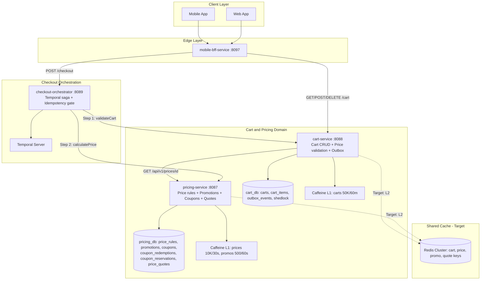
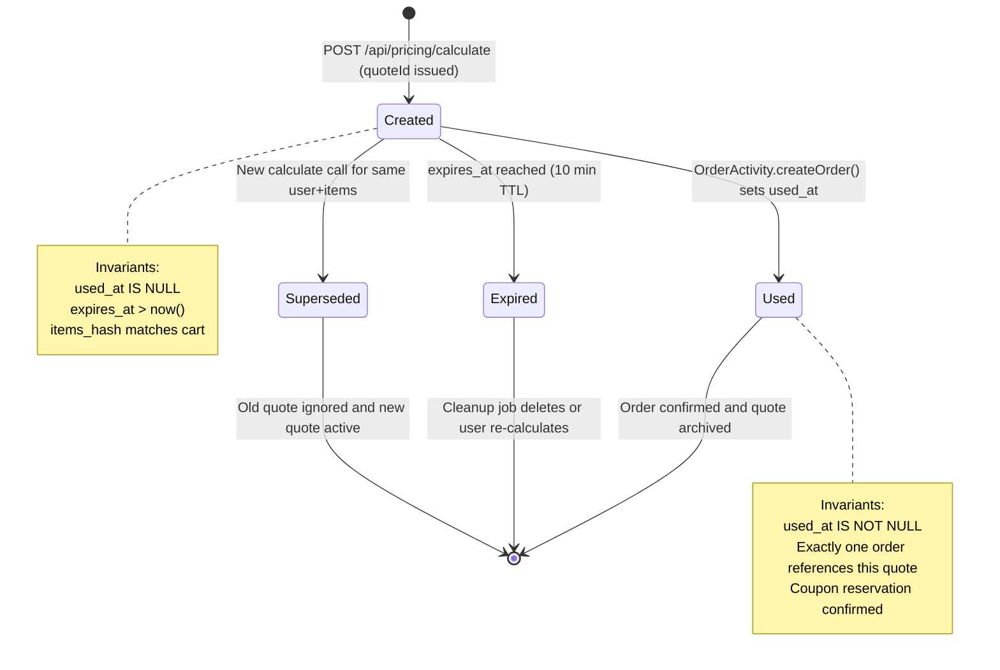
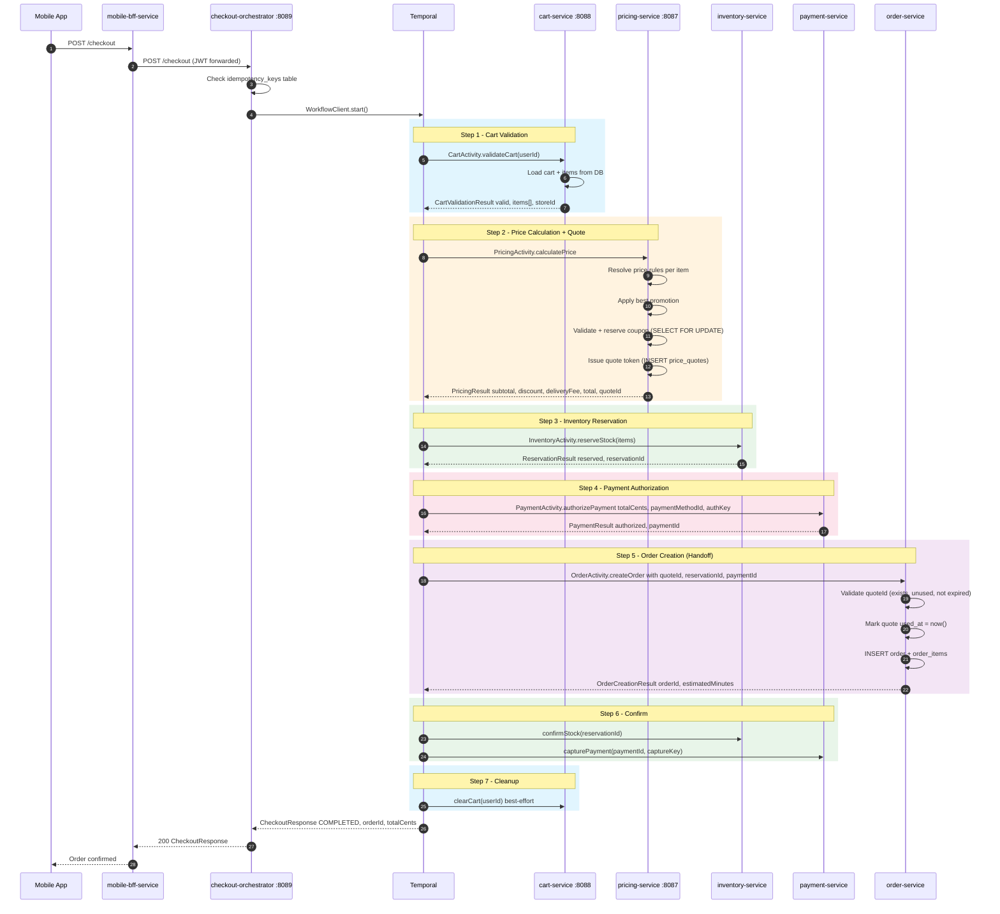
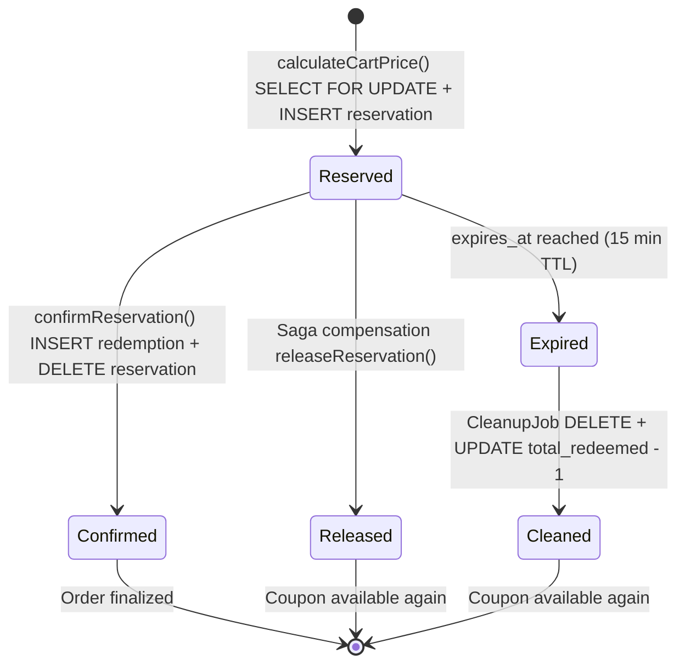

# LLD: Cart State, Pricing Engine, Promotions & Checkout Handoff

**Scope:** `cart-service` . `pricing-service` . checkout-orchestrator integration
**Iteration:** 3 | **Updated:** 2026-03-07
**Source truth:** `services/cart-service/src/`, `services/pricing-service/src/`, `services/checkout-orchestrator-service/src/`, `contracts/`
**Classification:** Principal Engineering -- Money-Path Safety

---

## Contents

1. [Scope and Key Customer Journeys](#1-scope-and-key-customer-journeys)
2. [Cart Authority, Price Authority, and Quote Binding Model](#2-cart-authority-price-authority-and-quote-binding-model)
3. [Promotion/Coupon Evaluation and Override Rules](#3-promotioncoupon-evaluation-and-override-rules)
4. [Cache/TTL Behavior and Consistency Risks](#4-cachettl-behavior-and-consistency-risks)
5. [Checkout Handoff Contract and Anti-Corruption Boundary](#5-checkout-handoff-contract-and-anti-corruption-boundary)
6. [Failure Modes, Fraud/Abuse Surfaces, and Degradation Behavior](#6-failure-modes-fraudabuse-surfaces-and-degradation-behavior)
7. [Observability, Experimentation, and Rollout Rules](#7-observability-experimentation-and-rollout-rules)
8. [Diagrams](#8-diagrams)
9. [Concrete Implementation Guidance and Next Fixes](#9-concrete-implementation-guidance-and-next-fixes)

---

## 1. Scope and Key Customer Journeys

### 1.1 Services in Scope

| Service | Port | DB | Cache | Role |
|---------|------|----|-------|------|
| `cart-service` | `:8088` | PostgreSQL (`carts`, `cart_items`, `outbox_events`, `shedlock`) | Caffeine 50K/60m | Cart CRUD, server-side price validation |
| `pricing-service` | `:8087` | PostgreSQL (`price_rules`, `promotions`, `coupons`, `coupon_redemptions`) | Caffeine 10K/30s (prices), 500/60s (promos) | Price calculation, coupon validation, discount engine |
| `checkout-orchestrator-service` | `:8089` | PostgreSQL (`checkout_idempotency_keys`) | None | Temporal saga; calls cart + pricing as activities |

### 1.2 Customer Journeys Covered

**J1 -- Browse-to-Cart:**
Customer opens product page, taps "Add to Cart". `mobile-bff-service` calls
`POST /cart/items`. `cart-service` calls `pricing-service` to fetch
server-authoritative `unitPriceCents`, ignores any client-submitted price, and
persists the item. Response includes line totals.

**J2 -- Cart Review:**
Customer opens cart drawer. `GET /cart` returns all items with cached prices.
No price revalidation on read -- prices may be up to 60 minutes stale (Caffeine
TTL on `carts` cache).

**J3 -- Apply Coupon:**
Customer enters coupon code at checkout initiation. The coupon is not applied at
the cart layer; it is passed to `pricing-service` via the checkout orchestrator
at `POST /api/pricing/calculate`.

**J4 -- Checkout:**
`POST /checkout` hits `checkout-orchestrator-service`. The Temporal saga:
1. `CartActivity.validateCart(userId)` -- fetches cart, validates non-empty
2. `PricingActivity.calculatePrice(request)` -- full cart re-pricing with promotions + coupon
3. `InventoryActivity.reserveStock(items)` -- warehouse hold
4. `PaymentActivity.authorizePayment(totalCents, ...)` -- PSP auth
5. `OrderActivity.createOrder(...)` -- handoff to order-service
6. Confirm inventory + capture payment
7. `CartActivity.clearCart(userId)` -- best effort

**J5 -- Abandoned Cart Cleanup:**
`CartCleanupJob` runs every 15 minutes (ShedLock-guarded) and deletes carts
past their 24-hour `expires_at`. Outbox events for `CART_CLEARED` are written
but never reach Kafka (publisher is a logging stub -- see Section 6).

**J6 -- Admin Promotion Management:**
Ops creates/modifies promotions and coupons via `pricing-service` admin
endpoints. Changes take effect after Caffeine TTL expiry (up to 60s for
promotions, 30s for price rules).

---

## 2. Cart Authority, Price Authority, and Quote Binding Model

### 2.1 Cart Authority -- `cart-service`

`cart-service` is the system-of-record for cart state. Key design decisions:

| Aspect | Implementation | File |
|--------|----------------|------|
| One cart per user | `UNIQUE(user_id)` on `carts` table | `V1__create_carts.sql` |
| Optimistic locking | `@Version long version` on `Cart` entity | `Cart.java` |
| Max items | 50 items per cart (configurable via `CartProperties`) | `CartService.java` |
| Max quantity | 10 per line item (`@Max(10)` on `UpdateQuantityRequest`) | `UpdateQuantityRequest.java` |
| Expiry | 24 hours from last mutation; extended on each write | `JpaCartStore.addItem()` |
| Price at add-time | `unitPriceCents` fetched from pricing-service on every `addItem` | `CartService.addItem()` |
| Cache eviction | `@CacheEvict("carts")` on every write; `@Cacheable("carts")` on read | `JpaCartStore.java` |

**Cart entity fields:**
```
carts(id UUID PK, user_id UUID UNIQUE, created_at, updated_at, expires_at, version BIGINT)
cart_items(id UUID PK, cart_id FK, product_id UUID, product_name VARCHAR,
           unit_price_cents BIGINT, quantity INT, added_at TIMESTAMP,
           UNIQUE(cart_id, product_id))
```

**Price validation on add-to-cart:**
```
Client POSTs AddItemRequest{productId, productName, unitPriceCents, quantity}
  |
  v
CartService.addItem()
  |-- pricingClient.getPrice(productId)  --> GET /api/v1/prices/{productId}
  |   returns PriceResponse{productId, unitPriceCents, currency}
  |
  |-- if client unitPriceCents != server unitPriceCents:
  |     log.warn("Price mismatch ... possible fraud attempt")
  |
  |-- override: use server price unconditionally
  |-- persist CartItem with server-authoritative unitPriceCents
```

**Critical gap -- no `store_id` on cart:** The `Cart` entity has no `store_id`
or `dark_store_id` field. Inventory reservation at checkout cannot be scoped to
the correct fulfillment location. This must be resolved before multi-store
rollout (see Section 9).

### 2.2 Price Authority -- `pricing-service`

`pricing-service` owns the pricing truth. Two distinct price paths exist:

**Path A -- Single-Item Price (cart add-time):**
```
GET /api/v1/prices/{productId}
  --> PricingService.calculatePrice(productId)
  --> finds active PriceRule for product
  --> applies basePriceCents * multiplier
  --> returns { productId, priceCents, currency }
```

**Path B -- Full Cart Price (checkout-time):**
```
POST /api/pricing/calculate
  body: { userId, items[], storeId, couponCode, deliveryAddressId }
  --> PricingService.calculateCartPrice()
  --> for each item: resolve PriceRule, compute line total
  --> find active Promotions where minOrderCents <= subtotal
  --> if couponCode: CouponService.validateCoupon(code, userId)
  --> sum: subtotalCents - promotionDiscountCents - couponDiscountCents + deliveryFeeCents = totalCents
  --> return PriceCalculationResponse
```

**Field name mismatch (P0):** `PricingClient.PriceResponse` in cart-service
uses `unitPriceCents`. The pricing-service API returns `priceCents`. The
`PricingClient` record maps this incorrectly -- any Jackson deserialization
silently returns 0 for the mismatched field, meaning all items are added to
cart with `unitPriceCents = 0` unless a manual mapping or `@JsonAlias` is
added. This is documented in the C3 review as a P0.

### 2.3 Quote Binding Model -- Current and Target

**Current state -- no quote binding:**

There is no `price_quotes` table. The checkout saga calls
`PricingActivity.calculatePrice()`, receives a `PricingResult`, and passes the
`totalCents` to `PaymentActivity.authorizePayment()` and
`OrderActivity.createOrder()`. Between the pricing call and order creation
(100-200ms under normal load, seconds under flash-sale contention), prices may
change. The order records `subtotalCents`/`discountCents`/`totalCents` as
denormalized fields but has no `quote_id` or `locked_price_version` to prove
price agreement.

**Target state -- Quote Token Pattern:**

```
pricing-service DB:
  price_quotes(
    quote_id        UUID PK DEFAULT gen_random_uuid(),
    user_id         UUID NOT NULL,
    store_id        VARCHAR(50) NOT NULL,
    items_hash      VARCHAR(64) NOT NULL,  -- SHA-256 of sorted item IDs + qtys
    subtotal_cents  BIGINT NOT NULL,
    discount_cents  BIGINT NOT NULL,
    delivery_fee_cents BIGINT NOT NULL,
    total_cents     BIGINT NOT NULL,
    currency        VARCHAR(3) NOT NULL DEFAULT 'INR',
    expires_at      TIMESTAMPTZ NOT NULL,  -- now() + 10 minutes
    used_at         TIMESTAMPTZ,
    created_at      TIMESTAMPTZ NOT NULL DEFAULT now()
  )
  UNIQUE INDEX idx_price_quotes_unused ON price_quotes(quote_id) WHERE used_at IS NULL
```

`POST /api/pricing/calculate` returns `PricingResult` with `quoteId`.
`OrderCreateRequest` carries `quoteId`. `order-service` validates:
1. Quote exists and `used_at IS NULL`
2. Quote `expires_at > now()`
3. `items_hash` matches the items being ordered
4. Mark `used_at = now()` atomically

This closes the TOCTOU window between pricing and order creation.

---

## 3. Promotion/Coupon Evaluation and Override Rules

### 3.1 Promotion Engine

**Schema:**
```
promotions(
  id UUID PK, name VARCHAR, description TEXT,
  discount_type VARCHAR,       -- 'PERCENTAGE' | 'FIXED_AMOUNT'
  discount_value BIGINT,       -- percentage (0-100) or cents
  min_order_cents BIGINT,      -- minimum subtotal to qualify
  max_discount_cents BIGINT,   -- cap for percentage discounts
  max_uses INTEGER,            -- global limit (nullable = unlimited)
  current_uses INTEGER DEFAULT 0,
  start_date TIMESTAMPTZ, end_date TIMESTAMPTZ,
  active BOOLEAN DEFAULT true,
  created_at, updated_at
)
```

**Evaluation logic in `PricingService.calculateCartPrice()`:**
```
1. Compute subtotalCents = SUM(item.priceCents * item.quantity)
2. Query activePromotions where:
     active = true
     AND start_date <= now() <= end_date
     AND min_order_cents <= subtotalCents
3. For each qualifying promotion:
     if PERCENTAGE: discount = subtotalCents * discount_value / 100
       cap at max_discount_cents if set
     if FIXED_AMOUNT: discount = discount_value
4. Apply the BEST single promotion (highest discount wins)
```

**P0 bug -- `max_uses` never checked:**
The current code checks `min_order_cents` but does NOT check
`current_uses >= max_uses`. A promotion with `max_uses = 1000` and
`current_uses = 1000` is still applied. Additionally, `current_uses` is never
incremented in the pricing path.

**Fix:** Add guard before applying promotion:
```java
if (promotion.getMaxUses() != null
        && promotion.getCurrentUses() >= promotion.getMaxUses()) {
    continue;  // promotion exhausted
}
```
Increment `current_uses` atomically with:
```sql
UPDATE promotions SET current_uses = current_uses + 1
WHERE id = :promoId
  AND (max_uses IS NULL OR current_uses < max_uses);
-- affected_rows = 0 means exhausted (race-safe)
```

### 3.2 Coupon Validation and Redemption

**Schema:**
```
coupons(
  id UUID PK, code VARCHAR UNIQUE, description TEXT,
  discount_type VARCHAR,       -- 'PERCENTAGE' | 'FIXED_AMOUNT'
  discount_value BIGINT,
  min_order_cents BIGINT,
  max_discount_cents BIGINT,
  total_limit INTEGER,         -- global redemption cap
  total_redeemed INTEGER DEFAULT 0,
  per_user_limit INTEGER DEFAULT 1,
  start_date TIMESTAMPTZ, end_date TIMESTAMPTZ,
  active BOOLEAN DEFAULT true,
  created_at, updated_at
)

coupon_redemptions(
  id UUID PK, coupon_id FK, user_id UUID, order_id UUID,
  discount_cents BIGINT, redeemed_at TIMESTAMPTZ
)
```

**Current flow (broken):**
```
1. calculateCartPrice() calls CouponService.validateCoupon(code, userId)
   - @Transactional(readOnly=true) -- no lock, no write
   - checks: active, date range, total_redeemed < total_limit, per-user limit
   - returns discount amount
2. PricingResult is returned to checkout-orchestrator with discountCents
3. Order is created with the discount baked in
4. CouponService.redeemCoupon() is NEVER called from the pricing/checkout path
```

**Three P0 defects in this flow:**

**(a) TOCTOU gap -- validate without reserve:**
Between `validateCoupon` (readOnly) and order creation, another checkout can
validate the same coupon. With N concurrent checkouts, all N see
`total_redeemed < total_limit` and all N get the discount.

**(b) Lost update on `redeemCoupon`:**
Even if `redeemCoupon` were called, it uses app-level read-check-write:
```java
coupon.setTotalRedeemed(coupon.getTotalRedeemed() + 1);  // lost update
```
Two transactions read `totalRedeemed = 99`, both write `100`. Result: 101
actual redemptions, counter shows 100.

**(c) `redeemCoupon` never called:**
No caller in the checkout saga invokes `redeemCoupon`. Coupons are validated
but never deducted. A single coupon code can be applied to unlimited orders.

**Target fix -- Two-Phase Coupon Reservation:**

Phase 1 (at `calculateCartPrice` time):
```sql
CREATE TABLE coupon_reservations (
    id              UUID PRIMARY KEY DEFAULT gen_random_uuid(),
    coupon_id       UUID NOT NULL REFERENCES coupons(id),
    user_id         UUID NOT NULL,
    checkout_id     UUID NOT NULL UNIQUE,
    discount_cents  BIGINT NOT NULL,
    reserved_at     TIMESTAMPTZ NOT NULL DEFAULT now(),
    expires_at      TIMESTAMPTZ NOT NULL DEFAULT now() + INTERVAL '15 minutes'
);
```
`calculateCartPrice` performs `SELECT ... FOR UPDATE` on the coupon row,
checks limits, inserts a reservation, and decrements available count atomically.
Returns `reservationId` in `PricingResult`.

Phase 2 (at order confirmation):
Checkout saga calls `CouponService.confirmReservation(reservationId, orderId)`.
Reservation is converted to a `coupon_redemptions` row.

Cleanup (abandoned checkouts):
`CouponReservationCleanupJob` (ShedLock, every 5 minutes) deletes expired
reservations and restores available count.

Atomic SQL for reservation:
```sql
UPDATE coupons SET total_redeemed = total_redeemed + 1
WHERE id = :couponId
  AND active = true
  AND (total_limit IS NULL OR total_redeemed < total_limit)
  AND start_date <= now() AND end_date >= now();
-- affected_rows = 0 --> coupon exhausted or invalid; reject
```

### 3.3 Override and Stacking Rules

**Current behavior:** Promotions and coupons stack. The code applies the best
promotion discount AND a coupon discount independently. There is no explicit
stacking policy.

**Recommended policy (to be configurable via `pricing-service` config):**

| Rule | Description |
|------|-------------|
| Best-single-promotion | Only the highest-value promotion applies |
| Coupon stacks with promotion | Coupon discount applies after promotion discount |
| Floor at zero | `totalCents` cannot go below `deliveryFeeCents` (items cannot be negative) |
| Admin override | Ops can flag a coupon as `exclusive = true` to prevent stacking with promotions |

---

## 4. Cache/TTL Behavior and Consistency Risks

### 4.1 Current Cache Topology

| Service | Cache | Backend | Max Size | TTL | Eviction Trigger |
|---------|-------|---------|----------|-----|------------------|
| `cart-service` | `carts` | Caffeine (JVM-local) | 50,000 | 60 min | `@CacheEvict` on writes |
| `pricing-service` | `productPrices` | Caffeine (JVM-local) | 10,000 | 30 sec | TTL expiry only |
| `pricing-service` | `activePromotions` | Caffeine (JVM-local) | 500 | 60 sec | TTL expiry only |
| `pricing-service` | `priceRules` | Caffeine (JVM-local) | 10,000 | 30 sec | TTL expiry only |

### 4.2 Consistency Risks

**Risk 1 -- Multi-pod cache divergence (P1):**
All caches are JVM-local. With N pods, N independent caches exist. A price
change (new promotion, price rule edit) invalidates one pod's cache at write
time but leaves N-1 pods serving stale data until TTL expiry. During flash
sales (price INR 499 to INR 99), some users see the old price and others the
new price depending on which pod handles the request.

**Risk 2 -- Cart price staleness (P0):**
`unitPriceCents` is written to `cart_items` at add-time and never refreshed.
A cart item added at 10:00 AM still shows the 10:00 AM price at 10:00 PM.
`validateCart()` calls `cartStore.validateCart()` but does NOT re-fetch prices
from pricing-service. If a promotion starts or ends during the cart lifetime,
the user sees a stale line total.

**Risk 3 -- Promotion activation delay:**
When ops activates a new promotion, it takes up to 60 seconds
(`activePromotions` TTL) for all pricing pods to see it. During this window,
some checkout requests get the discount and others do not, depending on pod
affinity.

### 4.3 Target Cache Architecture

```
Layer 1: Caffeine (L1, per-pod, ultra-hot)
  productPrices   -- 10K entries, 10s TTL (reduced from 30s)
  priceRules      -- 10K entries, 10s TTL
  activePromotions -- 500 entries, 15s TTL (reduced from 60s)

Layer 2: Redis Cluster (L2, shared)
  cart:{userId}           -- 5 min TTL, write-through from cart-service
  price:{productId}       -- 30s TTL, populated on miss
  promo:active            -- 60s TTL, invalidated on admin write
  quote:{quoteId}         -- 10 min TTL, set at quote creation

Layer 3: PostgreSQL (source of truth)
  All tables as defined above
```

**Event-driven invalidation path:**
```
Admin updates promotion via API
  --> pricing-service writes to DB
  --> pricing-service publishes invalidation to Redis pub/sub channel "pricing:invalidate"
  --> all pricing pods subscribe, evict L1 Caffeine entries for affected keys
  --> Redis L2 entry evicted immediately
```

**Redis failure degradation:**
All services must tolerate Redis unavailability:
```
CacheErrorHandler: log.warn + allow method execution (cache-miss fallback)
Circuit breaker on Redis client: 50% failure rate -> open for 30s
When open: Caffeine-only mode, effectively current behavior
```

---

## 5. Checkout Handoff Contract and Anti-Corruption Boundary

### 5.1 Authoritative Checkout Flow

The checkout-orchestrator-service owns the checkout saga. The Temporal workflow
is the single authority for transitioning a cart into an order.

**Saga steps and their service boundaries:**

```
Step  Activity                    Service              Compensation
----  --------                    -------              ------------
  1   validateCart(userId)        cart-service          (none -- read-only)
  2   calculatePrice(request)     pricing-service       (none -- read + reserve)
  3   reserveStock(items)         inventory-service     releaseStock(reservationId)
  4   authorizePayment(...)       payment-service       voidPayment(paymentId) or refundPayment(...)
  5   createOrder(request)        order-service         cancelOrder(orderId)
  6   confirmStock(resId)         inventory-service     (none -- already compensated at step 3)
      capturePayment(payId, key)  payment-service       (compensated at step 4)
  7   clearCart(userId)           cart-service          (best-effort, no failure)
```

### 5.2 Handoff Contract -- `OrderCreateRequest`

```java
public record OrderCreateRequest(
    String userId,
    String storeId,
    List<CartItem> items,         // product IDs, quantities, names
    long subtotalCents,           // from pricing snapshot
    long discountCents,           // promotion + coupon combined
    long deliveryFeeCents,        // distance/zone-based
    long totalCents,              // subtotal - discount + deliveryFee
    String currency,              // "INR"
    String couponCode,            // audit trail (nullable)
    String reservationId,         // inventory hold token
    String paymentId,             // PSP authorization token
    String deliveryAddressId,
    String paymentMethodId
)
```

**Anti-corruption rules:**

| Field | Authority | Receiver Trust Level |
|-------|-----------|---------------------|
| `subtotalCents`, `discountCents`, `totalCents` | pricing-service (via checkout-orchestrator) | order-service records but does NOT recompute |
| `reservationId` | inventory-service | order-service records; inventory-service owns confirm/release |
| `paymentId` | payment-service | order-service records; payment-service owns capture/void/refund |
| `items` | cart-service snapshot | order-service persists as `order_items`; no back-reference to cart |
| `couponCode` | client-supplied, validated by pricing-service | order-service stores for audit; does NOT validate |

**Target improvement -- add `quoteId`:**
When the quote token pattern (Section 2.3) is implemented, `OrderCreateRequest`
gains `quoteId`. Order-service validates the quote before accepting the order:
```
if quote does not exist OR quote.used_at IS NOT NULL OR quote.expires_at < now():
    reject OrderCreateRequest with 409 CONFLICT
else:
    UPDATE price_quotes SET used_at = now() WHERE quote_id = :quoteId AND used_at IS NULL
    if affected_rows = 0: reject (concurrent use)
```

### 5.3 Dual Saga Problem (P0)

**Critical finding:** Two independent Temporal checkout workflows exist.

| Attribute | checkout-orchestrator-service | order-service |
|-----------|-------------------------------|---------------|
| Task queue | `CHECKOUT_ORCHESTRATOR_TASK_QUEUE` | `CHECKOUT_TASK_QUEUE` |
| Pricing source | Calls pricing-service | Inline from `item.unitPriceCents()` |
| Coupon applied | Yes (via pricing-service) | No |
| Pricing lock | Yes (pricing snapshot) | Trusts client-supplied price |

A caller hitting the order-service endpoint bypasses pricing validation and
coupon application. This is an active correctness defect.

**Fix:** Remove checkout from order-service behind feature flag
`order.checkout.direct-saga.enabled` (Phase 1: default false, Phase 2: delete
code, Phase 3: remove task queue). See `transactional-core.md` Section 1.3.

### 5.4 Activity Timeout Configuration

| Activity | Start-to-Close | Max Attempts | Backoff | Non-Retryable |
|----------|---------------|--------------|---------|----------------|
| CartActivity | 10s | 3 | 2.0x from 1s | -- |
| PricingActivity | 10s | 3 | 2.0x from 1s | -- |
| InventoryActivity | 10s | 3 | 2.0x from 1s | -- |
| PaymentActivity | 30s | 3 | 2.0x from 2s | `PaymentDeclinedException` |
| OrderActivity | 10s | 3 | 2.0x from 1s | -- |

---

## 6. Failure Modes, Fraud/Abuse Surfaces, and Degradation Behavior

### 6.1 Failure Mode Map

| Failure | Impact | Current Behavior | Target Behavior |
|---------|--------|------------------|-----------------|
| pricing-service down | Add-to-cart fails | `ApiException(SERVICE_UNAVAILABLE)` with 3s timeout; no CB; pool starvation | Resilience4j CB: 50% threshold, 30s open, fallback to cached price |
| pricing-service slow (>3s) | Tomcat thread exhaustion | Blocks until 3s read timeout per request | CB opens after 5 consecutive timeouts; returns cached price |
| Stale price in cart at checkout | User sees wrong amount | Checkout re-prices (correct total) but UI showed old price | Staleness check in `validateCart()`: re-fetch prices, flag discrepancies |
| Coupon over-redemption | Revenue loss | Unlimited concurrent validations pass (readOnly) | Two-phase reservation (Section 3.2) |
| Promotion over-application | Revenue loss | `max_uses` not checked, `current_uses` not incremented | Atomic SQL guard (Section 3.1) |
| Zero-price bug | Free orders | `CatalogEventConsumer` creates PriceRule with `basePriceCents = 0` | Use price from expanded catalog event payload |
| Cart outbox not published | No abandoned cart analytics | Kafka publisher is a logging stub | Wire `KafkaTemplate` into `OutboxEventPublisher` |
| Redis unavailable | Cache miss on every request | N/A (Redis not yet deployed) | `CacheErrorHandler` logs + cache-miss fallback |
| Quote expired at order creation | Checkout fails late | N/A (no quote system) | Return 409; saga compensates inventory + payment |

### 6.2 Fraud and Abuse Surfaces

| Surface | Attack Vector | Current Mitigation | Required Fix |
|---------|---------------|-------------------|--------------|
| Client-supplied price | Sends `unitPriceCents: 1` | Server overrides with pricing-service price | Sufficient -- server is authoritative |
| Coupon brute-force | Automated code enumeration | None | Rate-limit coupon validation to 5/min per user |
| Coupon replay | Same coupon, concurrent checkouts | `readOnly` validation passes for all | Two-phase reservation with `SELECT FOR UPDATE` |
| Promotion stacking | Reduce price below cost | No stacking policy enforced | Floor-at-zero: `totalCents >= deliveryFeeCents` |
| Cart bomb | 50 items x 10 qty = exhaust inventory | Cart limits: 50 items, 10 qty/item | Add per-user checkout rate limit (3/hour) |
| Price change race | Checkout at old price | Checkout re-prices (user pays current) | With quote tokens, user pays quoted price (bounded window) |
| Order-service bypass | Skip pricing via order-service checkout | Both endpoints reachable | Remove order-service checkout (Section 5.3) |

### 6.3 Degradation Priority

1. **Cart reads always succeed** -- serve from Caffeine/Redis even if DB is slow
2. **Add-to-cart degrades to cached price** -- if pricing-service down, use last-known price with `priceStale: true`
3. **Checkout blocks on pricing** -- must NOT proceed without fresh pricing; return 503 if unreachable
4. **Coupon validation degrades to rejection** -- if reservation fails, reject coupon (never grant untracked discount)
5. **Cart clear is best-effort** -- saga completes even if cart-service unavailable after order creation

---

## 7. Observability, Experimentation, and Rollout Rules

### 7.1 Key Metrics

| Metric | Type | Service | Alert Threshold |
|--------|------|---------|-----------------|
| `cart.add_item.duration_ms` | Histogram | cart-service | p99 > 200ms |
| `cart.add_item.pricing_fetch.duration_ms` | Histogram | cart-service | p99 > 150ms |
| `cart.add_item.pricing_fetch.errors` | Counter | cart-service | > 5/min |
| `cart.validate.price_mismatch` | Counter | cart-service | > 0 (fraud signal) |
| `pricing.calculate.duration_ms` | Histogram | pricing-service | p99 > 100ms |
| `pricing.promotion.applied` | Counter | pricing-service | (business metric) |
| `pricing.promotion.exhausted` | Counter | pricing-service | (alert if unexpected) |
| `pricing.coupon.validated` | Counter | pricing-service | (business metric) |
| `pricing.coupon.rejected` | Counter | pricing-service | (business metric) |
| `pricing.coupon.reservation.created` | Counter | pricing-service | (post-fix) |
| `pricing.coupon.reservation.expired` | Counter | pricing-service | > 50/hour |
| `pricing.quote.created` | Counter | pricing-service | (post-fix) |
| `pricing.quote.expired_unused` | Counter | pricing-service | > 20% of created |
| `checkout.saga.step.duration_ms` | Histogram (per step) | checkout-orchestrator | Step 2 p99 > 500ms |
| `checkout.saga.compensation.triggered` | Counter | checkout-orchestrator | > 5/min |
| `cart.cache.hit_rate` | Gauge | cart-service | < 80% |
| `pricing.cache.hit_rate` | Gauge | pricing-service | < 70% |

### 7.2 Distributed Tracing

All three services use OTEL/Micrometer. Trace context propagation:
```
mobile-bff --> cart-service --> pricing-service  (add-to-cart)
mobile-bff --> checkout-orchestrator --> cart-service     (step 1)
                                    --> pricing-service   (step 2)
                                    --> inventory-service  (step 3)
                                    --> payment-service    (step 4)
                                    --> order-service      (step 5)
```
Temporal activities inherit the workflow trace context. Ensure `W3C traceparent`
header is propagated in all `RestTemplate` calls (configured via
`RestTemplateBuilder` + OTEL auto-instrumentation).

### 7.3 Feature Flags

| Flag | Scope | Purpose | Default |
|------|-------|---------|---------|
| `pricing.quote-token.enabled` | pricing-service | Enable quote token issuance | `false` |
| `pricing.coupon-reservation.enabled` | pricing-service | Enable two-phase coupon reservation | `false` |
| `cart.price-staleness-check.enabled` | cart-service | Re-fetch prices in `validateCart()` | `false` |
| `order.checkout.direct-saga.enabled` | order-service | Keep/remove duplicate checkout | `false` in prod |
| `pricing.redis-cache.enabled` | pricing-service | Use Redis L2 cache | `false` |
| `cart.redis-cache.enabled` | cart-service | Use Redis L2 cache | `false` |

### 7.4 Rollout Sequence

```
Phase 1 (Week 1-2): Fix P0 field-name mismatch + hardcoded URL + max_uses guard
  --> Deploy behind existing feature flags
  --> Validate: cart add-to-cart returns non-zero prices; promotions respect limits

Phase 2 (Week 3-4): Coupon reservation + quote token
  --> New migrations: coupon_reservations, price_quotes
  --> Feature-flagged; shadow-mode first (log reservation without enforcing)
  --> Validate: no coupon over-redemption in shadow logs

Phase 3 (Week 5-6): Redis L2 + event-driven invalidation
  --> Add Redis dependency, configure CacheErrorHandler
  --> Canary: 10% traffic, monitor cache hit rates and latency
  --> Validate: p99 latency improves; no stale-price incidents

Phase 4 (Week 7-8): Remove order-service checkout + enforce quote tokens
  --> Verify zero traffic on order-service checkout endpoint
  --> Delete dead code
  --> Make quote_id NOT NULL on orders table
```

---

## 8. Diagrams

### 8.1 Component Diagram -- Cart, Pricing, and Checkout



### 8.2 Quote Lifecycle State Machine



### 8.3 Checkout Handoff Sequence



### 8.4 Coupon Reservation Lifecycle



---

## 9. Concrete Implementation Guidance and Next Fixes

### 9.1 P0 Fixes (Must-ship before next release)

**Fix 1 -- PricingClient field name mismatch:**
```
File: services/cart-service/src/.../client/PricingClient.java
Problem: PriceResponse uses unitPriceCents; pricing-service returns priceCents
Fix: Add @JsonAlias("priceCents") or rename field to match API contract
Validation: ./gradlew :services:cart-service:test
```

**Fix 2 -- PricingClient hardcoded base URL:**
```
File: services/cart-service/src/.../client/PricingClient.java line 31
Problem: rootUri("http://pricing-service:8087") ignores application.yml
Fix: Inject @Value("${pricing-service.base-url:http://pricing-service:8087}")
Validation: Boot with overridden property; verify calls hit new URL
```

**Fix 3 -- Add Resilience4j circuit breaker to PricingClient:**
```
File: services/cart-service/build.gradle.kts (add resilience4j-spring-boot3)
File: services/cart-service/src/.../client/PricingClient.java
Fix: @CircuitBreaker(name = "pricingService", fallbackMethod = "getPriceFallback")
Config: 50% failure threshold, 30s wait, 10 calls in sliding window
Fallback: return cached price from Caffeine with priceStale=true flag
Validation: ./gradlew :services:cart-service:test + manual chaos test
```

**Fix 4 -- Promotion max_uses guard:**
```
File: services/pricing-service/src/.../service/PricingService.java
Problem: max_uses never checked in calculateCartPrice()
Fix: Add guard (Section 3.1) + atomic SQL increment
Validation: ./gradlew :services:pricing-service:test
```

**Fix 5 -- Coupon lost update:**
```
File: services/pricing-service/src/.../service/CouponService.java
Problem: App-level read-check-write on totalRedeemed
Fix: Replace with atomic SQL (Section 3.2)
Validation: Concurrent test with 10 threads redeeming same coupon
```

**Fix 6 -- Remove order-service duplicate checkout:**
```
File: services/order-service/src/.../controller/CheckoutController.java (delete)
File: services/order-service/src/.../workflow/CheckoutWorkflowImpl.java (delete)
Phase: Feature flag first, traffic verification, then delete
Validation: Zero traffic on order-service /checkout endpoint for 1 week
```

### 9.2 P1 Fixes (Next sprint)

**Fix 7 -- Add price staleness check to validateCart():**
```
File: services/cart-service/src/.../service/CartService.java
Fix: In validateCart(), re-fetch prices for all items from pricing-service.
     Compare with stored unitPriceCents. If any differ, update cart_items and
     return CartResponse with priceChanged=true and per-item old/new prices.
Feature flag: cart.price-staleness-check.enabled
```

**Fix 8 -- Quote token implementation:**
```
New migration: services/pricing-service/src/.../db/migration/V7__create_price_quotes.sql
New field in PricingResult: quoteId (String)
New field in OrderCreateRequest: quoteId (String)
New validation in order-service: reject if quote expired/used
Feature flag: pricing.quote-token.enabled
```

**Fix 9 -- Coupon reservation system:**
```
New migration: services/pricing-service/src/.../db/migration/V6__create_coupon_reservations.sql
New class: CouponReservationService
New cleanup job: CouponReservationCleanupJob (ShedLock, every 5 min)
Feature flag: pricing.coupon-reservation.enabled
```

**Fix 10 -- Zero-price bug in CatalogEventConsumer:**
```
File: services/pricing-service/src/.../consumer/CatalogEventConsumer.java
Problem: New products get basePriceCents = 0
Fix: Use basePriceCents from expanded catalog event payload
Depends on: Catalog event payload expansion (separate fix)
```

**Fix 11 -- Add store_id to Cart:**
```
New migration: services/cart-service/src/.../db/migration/V5__add_store_id_to_carts.sql
  ALTER TABLE carts ADD COLUMN store_id VARCHAR(50);
Update CartService to accept and store storeId
Depends on: Store resolution logic in BFF
```

### 9.3 Dependency Graph

```
Fix 1 (field mismatch) ─────────────> Fix 7 (staleness check)
Fix 2 (hardcoded URL)  ─────────────> Fix 3 (circuit breaker)
Fix 4 (max_uses)       ─────────────> (standalone)
Fix 5 (coupon lost update) ─────────> Fix 9 (coupon reservation)
Fix 6 (dual saga removal) ─────────-> Fix 8 (quote token)
Fix 10 (zero-price) depends on ─────> Catalog event expansion (external)
Fix 11 (store_id) depends on ──────-> Store resolution (external)
```

### 9.4 Validation Checklist

| Fix | Unit Test | Integration Test | Manual Validation |
|-----|-----------|------------------|-------------------|
| Fix 1 | `PricingClientTest`: assert `unitPriceCents > 0` | Cart add-to-cart e2e with pricing-service | Add item, verify non-zero price in DB |
| Fix 2 | Property injection test | Boot with custom base-url | Check RestTemplate base URI in debug logs |
| Fix 3 | WireMock: simulate timeout, verify CB opens | Chaos test: kill pricing-service | Monitor `resilience4j.circuitbreaker.state` |
| Fix 4 | Promo with `maxUses=1`, verify not applied after 1 use | Concurrent test: 10 threads | Check `promotions.current_uses` |
| Fix 5 | 10 concurrent `redeemCoupon` calls | Testcontainers + threads | `total_redeemed <= total_limit` |
| Fix 6 | N/A (deletion) | order-service boots without Temporal config | `/checkout` traffic = 0 |
| Fix 8 | Create, use, expire, reuse-rejection | Checkout e2e with quote | `price_quotes.used_at` set |
| Fix 9 | Reserve, confirm, expire, cleanup | 10 concurrent checkouts | Exactly `total_limit` redemptions |

---

## Appendix A: Database Schema Summary

### cart-service migrations

```sql
-- V1__create_carts.sql
CREATE TABLE carts (
    id UUID PRIMARY KEY DEFAULT gen_random_uuid(),
    user_id UUID NOT NULL UNIQUE,
    created_at TIMESTAMPTZ NOT NULL DEFAULT now(),
    updated_at TIMESTAMPTZ NOT NULL DEFAULT now(),
    expires_at TIMESTAMPTZ NOT NULL,
    version BIGINT NOT NULL DEFAULT 0
);

-- V2__create_cart_items.sql
CREATE TABLE cart_items (
    id UUID PRIMARY KEY DEFAULT gen_random_uuid(),
    cart_id UUID NOT NULL REFERENCES carts(id) ON DELETE CASCADE,
    product_id UUID NOT NULL,
    product_name VARCHAR(255) NOT NULL,
    unit_price_cents BIGINT NOT NULL,
    quantity INTEGER NOT NULL CHECK (quantity > 0),
    added_at TIMESTAMPTZ NOT NULL DEFAULT now(),
    UNIQUE(cart_id, product_id)
);

-- V3__create_shedlock.sql
CREATE TABLE shedlock (
    name VARCHAR(64) NOT NULL PRIMARY KEY,
    lock_until TIMESTAMPTZ NOT NULL,
    locked_at TIMESTAMPTZ NOT NULL,
    locked_by VARCHAR(255) NOT NULL
);

-- V4__create_outbox_events.sql
CREATE TABLE outbox_events (
    id UUID PRIMARY KEY DEFAULT gen_random_uuid(),
    aggregate_type VARCHAR(100) NOT NULL,
    aggregate_id VARCHAR(100) NOT NULL,
    event_type VARCHAR(100) NOT NULL,
    payload JSONB,
    created_at TIMESTAMPTZ NOT NULL DEFAULT now(),
    sent BOOLEAN NOT NULL DEFAULT false
);
```

### pricing-service key tables

```sql
-- price_rules: per-product pricing
-- promotions: time-bound, min-order, percentage/fixed discounts
-- coupons: code-based, per-user limits, global limits
-- coupon_redemptions: audit trail of used coupons
-- coupon_reservations*: two-phase coupon hold (proposed)
-- price_quotes*: quote token for checkout binding (proposed)
```

Tables marked with `*` are proposed additions.

---

## Appendix B: Configuration Reference

### cart-service application.yml (key entries)

```yaml
server:
  port: 8088

spring:
  application:
    name: cart-service
  datasource:
    url: jdbc:postgresql://${DB_HOST:localhost}:${DB_PORT:5432}/${DB_NAME:cart_db}
  cache:
    type: caffeine
    caffeine:
      spec: maximumSize=50000,expireAfterWrite=3600s

cart:
  max-items: 50
  max-quantity-per-item: 10
  expiry-hours: 24

pricing-service:
  base-url: http://pricing-service:8087  # NOTE: currently ignored by PricingClient
```

### pricing-service application.yml (key entries)

```yaml
server:
  port: 8087

spring:
  application:
    name: pricing-service
  cache:
    type: caffeine
    cache-names: productPrices,activePromotions,priceRules
    caffeine:
      spec: maximumSize=10000,expireAfterWrite=30s
```
