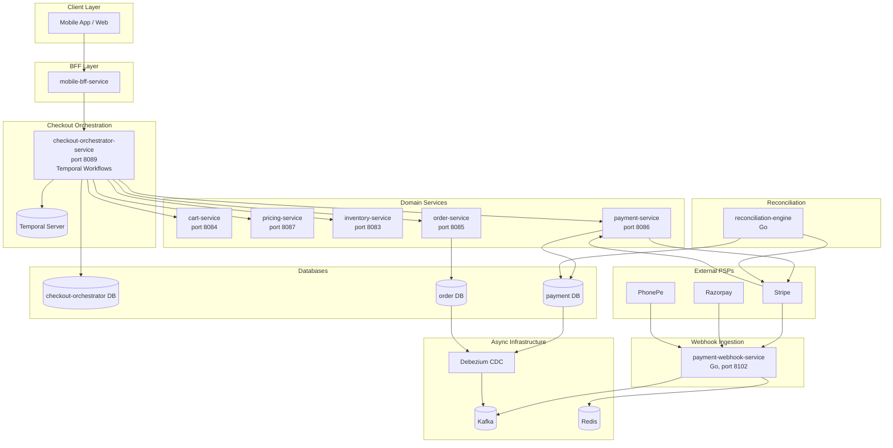
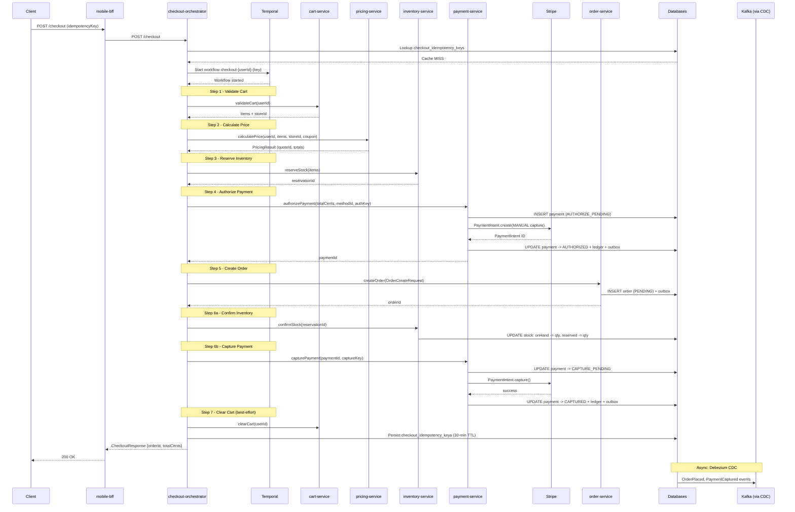
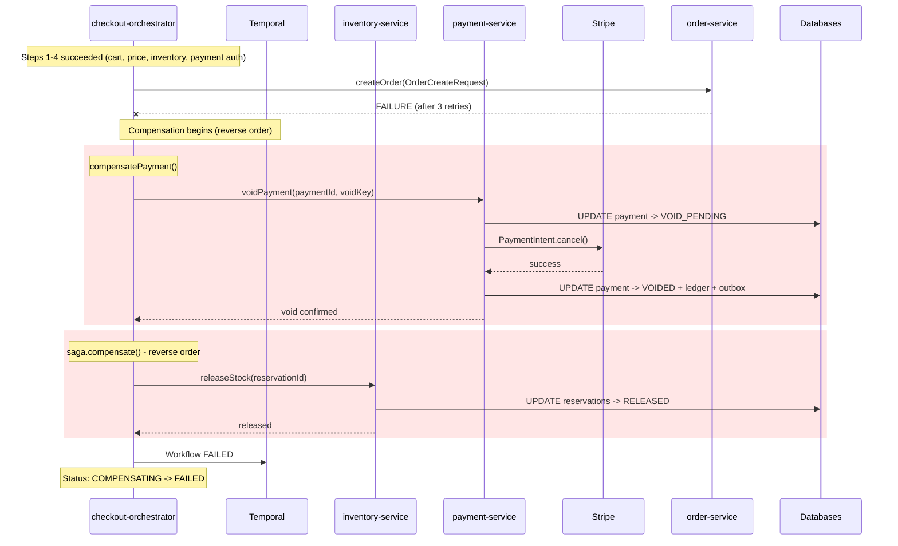
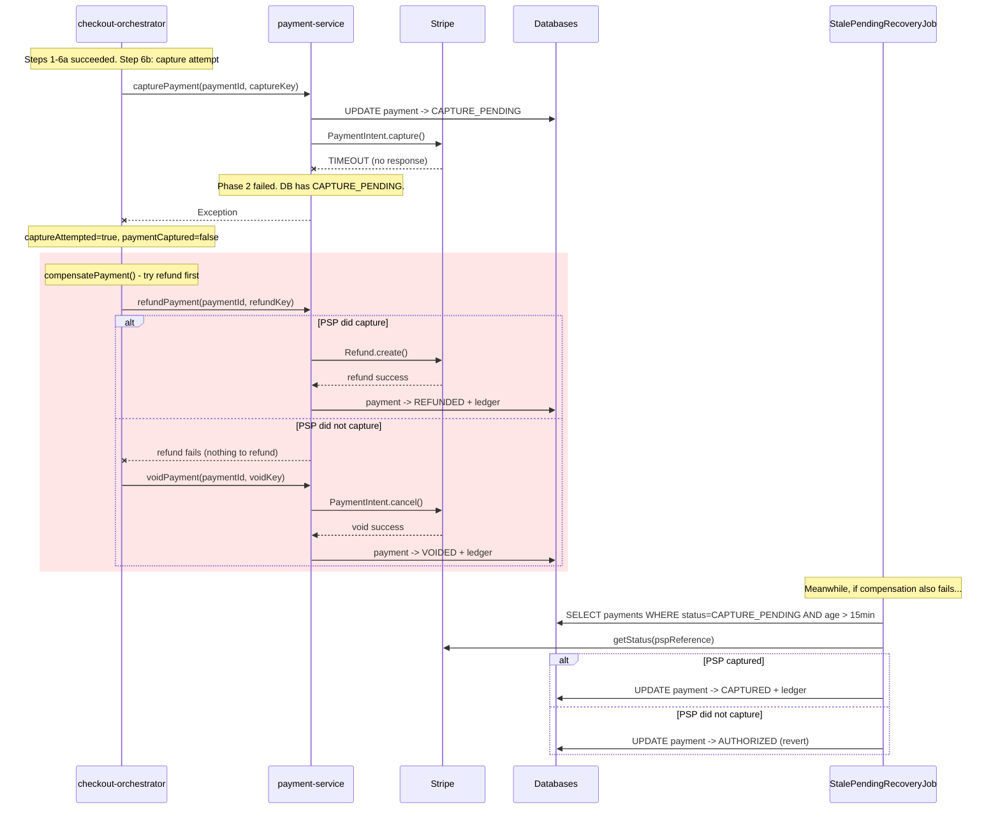

# Low-Level Design: Checkout Orchestration, Order State & Payment Gateway

> **Iteration 3 -- Functionality-Level LLD**
> Covers checkout saga lifecycle, order state machine, payment gateway
> interaction, webhook durability, refunds, reconciliation, and fraud hooks.
>
> Grounded in repo code: `checkout-orchestrator-service` (port 8089),
> `order-service` (port 8085), `payment-service` (port 8086),
> `payment-webhook-service` (Go, port 8102), `contracts/`, and
> `reconciliation-engine` (Go).

---

## Table of Contents

1. [Scope and Authority Boundaries](#1-scope-and-authority-boundaries)
2. [Checkout Saga Lifecycle and State Transitions](#2-checkout-saga-lifecycle-and-state-transitions)
3. [Order/Payment Contract and Idempotency Model](#3-orderpayment-contract-and-idempotency-model)
4. [Webhook Durability, Replay, and Reconciliation Loop](#4-webhook-durability-replay-and-reconciliation-loop)
5. [Timeout, Partial-Failure, and Compensation Paths](#5-timeout-partial-failure-and-compensation-paths)
6. [Fraud/Manual Review Hooks](#6-fraudmanual-review-hooks)
7. [Observability, Rollback, and Money-Path Release Rules](#7-observability-rollback-and-money-path-release-rules)
8. [Diagrams](#8-diagrams)
9. [Implementation Guidance and Unresolved Risks](#9-implementation-guidance-and-unresolved-risks)

---

## 1. Scope and Authority Boundaries

### 1.1 Services in Scope

| Service | Language | Port | Responsibility |
|---------|----------|------|----------------|
| checkout-orchestrator-service | Java/Spring Boot + Temporal | 8089 | **Authoritative** checkout saga orchestrator |
| order-service | Java/Spring Boot + Temporal + Kafka | 8085 | Order lifecycle, state machine, event publishing |
| payment-service | Java/Spring Boot + Stripe SDK | 8086 | Payment auth/capture/void/refund, ledger, webhooks (direct) |
| payment-webhook-service | Go | 8102 | Multi-PSP webhook ingestion, signature verification, Kafka publish |
| reconciliation-engine | Go | -- | Batch reconciliation of PSP exports vs internal ledger |

### 1.2 Authority Boundaries

```
+---------------------------+     +-----------------------+     +------------------------+
| checkout-orchestrator     |     | order-service         |     | payment-service        |
| OWNS:                     |     | OWNS:                 |     | OWNS:                  |
|  - Saga step ordering     |     |  - Order state machine|     |  - Payment state       |
|  - Compensation decisions |     |  - Order persistence  |     |    machine             |
|  - Idempotency-key cache  |     |  - Order events       |     |  - PSP gateway calls   |
|  - Workflow lifecycle     |     |  - Status history     |     |  - Ledger entries      |
|                           |     |  - Audit log          |     |  - Webhook processing  |
| CALLS:                    |     |                       |     |  - Refund lifecycle    |
|  - cart, pricing,         |     | RECEIVES:             |     |                        |
|    inventory, payment,    |     |  - CreateOrderCommand  |     | RECEIVES:              |
|    order activities       |     |    from orchestrator   |     |  - authorize/capture/  |
+---------------------------+     +-----------------------+     |    void/refund from    |
                                                                |    orchestrator        |
                                                                +------------------------+
```

**Critical rule:** `checkout-orchestrator-service` is the **single authority** for
checkout flow. `order-service` contains a legacy `CheckoutWorkflowImpl` that must
be deprecated (see Risk R1). That path accepts client-supplied prices, bypassing
`pricing-service` validation -- a P1 correctness defect.

### 1.3 Deprecation: order-service Checkout Path

| Phase | Action | Gate |
|-------|--------|------|
| P1 (1 sprint) | Feature flag `order.checkout.direct-saga.enabled=false` | API gateway routes old callers to orchestrator |
| P2 (1 sprint) | Verify zero traffic on order-service checkout endpoint for 7 days | Grafana dashboard confirmation |
| P3 | Delete `CheckoutWorkflowImpl`, activities, `CHECKOUT_TASK_QUEUE` registration | Zero PENDING orders from old path |

---

## 2. Checkout Saga Lifecycle and State Transitions

### 2.1 Saga Steps (Temporal Workflow)

The authoritative checkout lives in `CheckoutWorkflowImpl` inside
`checkout-orchestrator-service`. The Temporal workflow ID is:

```
workflowId = "checkout-" + userId + "-" + idempotencyKey
```

| Step | Activity | Timeout | Retries | Non-Retriable Exceptions | Compensation |
|------|----------|---------|---------|--------------------------|--------------|
| 1 | CartActivity.validateCart(userId) | 10 s | 3 (1s/2s/4s backoff) | -- | -- |
| 2 | PricingActivity.calculatePrice(request) | 10 s | 3 (1s/2s/4s backoff) | -- | -- |
| 3 | InventoryActivity.reserveStock(items) | 15 s | 3 (no retry on InsufficientStockException) | InsufficientStockException | releaseStock(reservationId) |
| 4 | PaymentActivity.authorizePayment(amount, methodId, authKey) | 30 s start-to-close / 45 s schedule-to-close | 3 (2s/4s/8s backoff) | PaymentDeclinedException | compensatePayment() |
| 5 | OrderActivity.createOrder(OrderCreateRequest) | 15 s | 3 (1s/2s/4s backoff) | -- | cancelOrder(orderId) |
| 6a | InventoryActivity.confirmStock(reservationId) | implicit | implicit | -- | -- |
| 6b | PaymentActivity.capturePayment(paymentId, captureKey) | implicit | implicit | -- | refundPayment() or voidPayment() |
| 7 | CartActivity.clearCart(userId) | 10 s | -- | -- | Best-effort; failures logged, not propagated |

**OrderCreateRequest** payload carries: `reservationId`, `paymentId`, pricing
snapshot (subtotalCents, discountCents, totalCents, currency), `deliveryAddressId`,
`quoteId`, `couponCode`.

### 2.2 Checkout Status Progression

```
STARTED
  |
  v
VALIDATING_CART
  |
  v
CALCULATING_PRICES
  |
  v
RESERVING_INVENTORY ---[InsufficientStockException]--> COMPENSATING --> FAILED
  |
  v
AUTHORIZING_PAYMENT ---[PaymentDeclinedException]----> COMPENSATING --> FAILED
  |
  v
CREATING_ORDER ---------[any failure after retries]--> COMPENSATING --> FAILED
  |
  v
CONFIRMING (confirmStock + capturePayment)
  |
  v
CLEARING_CART (best-effort)
  |
  v
COMPLETED
```

### 2.3 Idempotent Checkout Entry Point

```
POST /checkout
  --> CheckoutController.initiateCheckout(request, idempotencyKey)
       |
       +--> DB lookup: checkout_idempotency_keys WHERE idempotency_key = ?
       |     |
       |     +--> Cache HIT (not expired): return cached CheckoutResponse
       |     |
       |     +--> Cache MISS or expired: proceed
       |
       +--> Build workflowId = "checkout-{userId}-{idempotencyKey}"
       |
       +--> Start Temporal workflow (REJECT_DUPLICATE reuse policy)
       |     |
       |     +--> WorkflowExecutionAlreadyStarted: query existing workflow for result
       |
       +--> On success: persist response in checkout_idempotency_keys (30-min TTL)
       |
       +--> Return CheckoutResponse { orderId, totalCents, estimatedDeliveryMinutes }
```

**Database table:**

```sql
CREATE TABLE checkout_idempotency_keys (
    id               UUID PRIMARY KEY,
    idempotency_key  VARCHAR(255) UNIQUE NOT NULL,
    checkout_response TEXT,          -- JSON-serialized CheckoutResponse
    expires_at       TIMESTAMPTZ NOT NULL,
    created_at       TIMESTAMPTZ NOT NULL DEFAULT now()
);
```

---

## 3. Order/Payment Contract and Idempotency Model

### 3.1 Order State Machine

```
PENDING ---> PLACED ---> PACKING ---> PACKED ---> OUT_FOR_DELIVERY ---> DELIVERED (terminal)
  |            |           |            |               |
  +-------+----+-----+-----+------+-----+               |
          |          |            |                      |
          v          v            v                      v
       CANCELLED  CANCELLED   CANCELLED              (terminal)
          |
          v
       FAILED (terminal)
```

**Order entity (key fields):**

```java
UUID id, UUID userId, String storeId, OrderStatus status
long subtotalCents, discountCents, totalCents, String currency
UUID reservationId, UUID paymentId
String idempotencyKey     // UNIQUE constraint
long version              // optimistic locking
String deliveryAddress, String couponCode, String cancellationReason
```

**Status history** tracked in `order_status_history` table (fromStatus, toStatus,
changedBy, note, createdAt) for full audit trail.

### 3.2 Payment State Machine

```
AUTHORIZE_PENDING ---(PSP success)---> AUTHORIZED ---(capture start)---> CAPTURE_PENDING
       |                                    |                                   |
  (PSP decline/error)                 (void start)                       (PSP success)
       |                                    |                                   |
       v                                    v                                   v
    FAILED                           VOID_PENDING                           CAPTURED
                                          |                                   |
                                    (PSP void ok)                      (refund issued)
                                          |                                   |
                                          v                                   v
                                       VOIDED                    PARTIALLY_REFUNDED / REFUNDED
```

**Payment entity (key fields):**

```java
UUID id, UUID orderId
long amountCents, long capturedCents, long refundedCents
String currency, PaymentStatus status
String pspReference        // Stripe PaymentIntent ID
String idempotencyKey      // UNIQUE constraint
String paymentMethod
Map<String,Object> metadata  // JSONB
long version               // optimistic locking
```

**Refund entity:**

```java
UUID id, UUID paymentId
long amountCents, String reason
String pspRefundId         // Stripe Refund ID
String idempotencyKey      // UNIQUE constraint
RefundStatus status        // PENDING -> COMPLETED | FAILED
```

### 3.3 Three-Phase Payment Operation Pattern

Every payment operation (authorize, capture, void, refund) follows a crash-safe
three-phase pattern:

```
Phase 1 (TX):      Save PENDING state to DB (e.g., AUTHORIZE_PENDING)
                    -- crash here is safe: recovery job picks up stale PENDING rows

Phase 2 (no TX):   Call PSP (Stripe PaymentIntent API)
                    -- crash here: DB has PENDING, PSP may or may not have processed

Phase 3 (TX):      Update DB to final state (e.g., AUTHORIZED)
                    + write ledger entry + write outbox event
                    -- crash here: recovery job reconciles with PSP
```

### 3.4 Three-Layer Idempotency Key Model

```
Layer 1 -- Checkout Orchestrator (workflow-level)
  workflowId  = "checkout-{userId}-{idempotencyKey}"
  authKey     = workflowId + "-payment"
  captureKey  = authKey + "-" + paymentId + "-capture"
  voidKey     = authKey + "-" + paymentId + "-void"
  refundKey   = authKey + "-" + paymentId + "-refund"

Layer 2 -- Temporal Activity (retry-stable)
  PaymentActivityImpl.resolveIdempotencyKey(providedKey):
    return providedKey + "-" + activityId
  // activityId is stable across retries of the same activity invocation

Layer 3 -- Payment-Service Database (last line of defense)
  UNIQUE (idempotency_key) on payments table
  If idempotency_key already exists -> return existing payment (no PSP call)
```

**Known defects:**

| Defect | Severity | Fix |
|--------|----------|-----|
| Workflow reset generates new activityId, allowing second authorization | High | Use `Workflow.randomUUID()` (deterministic across resets) as payment nonce |
| Compound key can exceed VARCHAR(64), causing truncation collisions | Critical | Apply SHA-256 normalization: `raw.length() > 60 ? sha256Hex(raw).substring(0,64) : raw` |
| `savePendingAuthorization()` returns null on idempotent hit | Medium | Return `IdempotentPaymentResult(payment, isNew)` instead |

### 3.5 Double-Entry Ledger

Every money movement creates a pair of ledger entries:

| Operation | Debit Account | Credit Account |
|-----------|---------------|----------------|
| AUTHORIZE | authorization_hold | -- (memo entry) |
| CAPTURE | authorization_hold | merchant_payable |
| VOID | customer_receivable | authorization_hold |
| REFUND | merchant_payable | customer_receivable |

**Ledger entity:**

```java
Long id, UUID paymentId
LedgerEntryType type       // DEBIT or CREDIT
long amountCents
String account             // authorization_hold, merchant_payable, customer_receivable
String referenceType       // AUTHORIZE, CAPTURE, VOID, REFUND
String referenceId, String description
```

All amounts stored as `BIGINT` (integer cents). No floating-point in money path.

### 3.6 Event Contract (Outbox + CDC)

Events are written transactionally to the `outbox_events` table and relayed to
Kafka via Debezium CDC. Standard envelope per `contracts/README.md`:

```json
{
  "event_id":       "<uuid>",
  "event_type":     "PaymentCaptured | PaymentRefunded | OrderPlaced | OrderCancelled",
  "aggregate_id":   "<payment-uuid | order-uuid>",
  "schema_version": "v1",
  "source_service": "payment-service | order-service",
  "correlation_id": "<temporal-workflow-id>",
  "timestamp":      "2026-03-07T00:00:00Z",
  "payload":        { ... }
}
```

**Proto contracts** (in `contracts/src/main/proto/payment/v1/payment_service.proto`):

```
AuthorizeRequest  { idempotency_key, order_id, user_id, payment_method_id, Money amount }
AuthorizeResponse { payment_id, decline_code, authorized }
CaptureRequest    { payment_id }
CaptureResponse   { psp_reference, captured }
VoidRequest       { payment_id }
VoidResponse      { voided }
RefundRequest     { payment_id, Money amount, reason }
RefundResponse    { refund_id, refunded }
```

`Money` = `{ int64 amount_cents, string currency }` (ISO 4217).

---

## 4. Webhook Durability, Replay, and Reconciliation Loop

### 4.1 Two-Path Webhook Architecture (Current State)

```
PSP (Stripe / Razorpay / PhonePe)
      |
      +----------+---------------------------+
      |          |                           |
      v          v                           v
  Path A:    Path B:                   (Razorpay/PhonePe
  Go service  payment-service           only through
  (port 8102)  directly                  Go service)
      |          |
      v          v
  Kafka:     DB dedup:
  payment-    processed_webhook_events
  webhook-      |
  events        v
      |       State machine update
      v       + ledger + outbox
  [NO CONSUMER -- EVENTS DROPPED]
```

**Critical gap:** Kafka topic `payment-webhook-events` published by the Go service
has **no consumer** in `payment-service`. Stripe events arriving at the Go service
are silently dropped. Path B (direct to payment-service) works for Stripe only.

**Target state (recommended):** Consolidate to a single path:

1. All PSPs --> Go webhook service (signature verification + Redis dedup + normalization)
2. Go service --> Kafka `payment-webhook-events`
3. payment-service Kafka consumer reads, applies DB dedup, processes state transitions

### 4.2 Go Webhook Service Detail

**Endpoints:**

| Route | Handler |
|-------|---------|
| POST /stripe | HandleStripe() |
| POST /razorpay | HandleRazorpay() |
| POST /phonepe | HandlePhonePe() |

**Signature verification per PSP:**

| PSP | Header | Algorithm |
|-----|--------|-----------|
| Stripe | `Stripe-Signature: t=<ts>,v1=<sig>` | HMAC-SHA256 over `<ts>.<body>` + replay tolerance |
| Razorpay | `X-Razorpay-Signature: <hex>` | HMAC-SHA256 over raw body |
| PhonePe | `X-Verify: <sha256>###<salt_index>` | SHA256(body + saltKey + saltIndex) |

**Canonical event after normalization:**

```go
type WebhookEvent struct {
    ID          string    // PSP event ID
    PSP         PSPType   // stripe, razorpay, phonepe
    EventType   string    // e.g., payment.captured
    PaymentID   string    // PSP payment reference
    OrderID     string    // from metadata
    AmountCents int64
    Currency    string    // ISO 4217
    Status      string
    ReceivedAt  time.Time
    RawPayload  []byte    // original, not re-serialized
}
```

**Idempotency store:** Currently in-memory LRU with TTL. Not durable across
restarts; duplicates in multi-instance deployments. **Fix:** replace with Redis
SET-EX pattern (`webhook:seen:<eventID>`, TTL = 24h).

**Response codes:**

| Status | Meaning |
|--------|---------|
| 200 | Duplicate (already seen) |
| 202 | Accepted, published to Kafka |
| 400 | Parse / validation error |
| 401 | Signature verification failed |
| 413 | Payload > 1 MiB |
| 503 | Kafka publish failure (PSP will retry) |

### 4.3 Payment-Service Webhook Processing (Path B -- Stripe Direct)

```
WebhookController.handleWebhook(payload, stripeSignature)
  --> Verify HMAC-SHA256 (Stripe endpoint secret)
  --> Parse Stripe Event object
  --> WebhookEventHandler.handle(event)
       |
       +--> DB dedup check: SELECT 1 FROM processed_webhook_events WHERE event_id = ?
       |     HIT  --> return silently (200)
       |     MISS --> proceed
       |
       +--> Route by event type:
       |     payment_intent.succeeded  --> handleCaptured()
       |     payment_intent.canceled   --> handleVoided()
       |     payment_intent.payment_failed --> handleFailed()
       |     charge.refunded           --> handleRefunded()
       |
       +--> State update with optimistic lock (3 retries, 100ms backoff)
       |
       +--> Record ledger entry (double-entry)
       |
       +--> Insert into processed_webhook_events
       |
       +--> Publish outbox event
```

**Out-of-order handling:** If `charge.refunded` arrives before
`payment_intent.succeeded`, the payment is still in AUTHORIZED/AUTHORIZE_PENDING
state. Current code does not guard against this. **Fix:** queue unprocessable
events to a retry/dead-letter topic.

### 4.4 Reconciliation Engine (Go)

**Current architecture:** File-based batch. Reads PSP export JSON and internal
ledger JSON from mounted files, compares, generates mismatch reports and auto-fix
files.

```
Config {
    PSPExportPath    string   // mounted PSP settlement file
    LedgerPath       string   // mounted internal ledger export
    LedgerOutputPath string   // corrected ledger output
    FixStatePath     string   // idempotent fix registry
}
```

**Mismatch categories:**

| Type | Auto-fixable? | Action |
|------|--------------|--------|
| missing_ledger_entry | Yes | Create ledger entry from PSP data |
| amount_mismatch | Yes | Update ledger entry amount |
| currency_mismatch | No | Flag for manual review |
| missing_psp_export | No | Flag for manual review (possible orphan) |

**Target state (multi-tier):**

| Tier | Frequency | Data Source | Scope |
|------|-----------|-------------|-------|
| Real-time | Continuous | Webhook events | Ledger updated on every webhook |
| Intraday | Every 30 min | HTTP ledger endpoint on payment-service | Detect missing webhooks |
| Settlement | T+1 | PSP settlement file download | Strict amount + fee matching |

**Target live-DB integration:**

```
GET /internal/reconciliation/ledger?since=<ts>&until=<ts>
  --> NDJSON stream of ledger entries
  --> Secured by INTERNAL_SERVICE_TOKEN header
```

Reconciliation engine replaces file-based `LedgerStore` with HTTP client. Fixes
applied via HTTP POST to payment-service. Mismatch events fire PagerDuty alerts.

---

## 5. Timeout, Partial-Failure, and Compensation Paths

### 5.1 Compensation Chain (Reverse Order)

When any saga step fails after step 2, compensation runs in **reverse order**:

```
compensatePayment() --> runs FIRST
  |
  +--> If paymentCaptured == true:
  |      refundPayment(paymentId, refundKey)
  |
  +--> If paymentAuthorized == true AND paymentCaptured == false:
  |      voidPayment(paymentId, voidKey)
  |
  +--> If captureAttempted == true AND paymentCaptured == false:
  |      TRY refundPayment(); if fails, FALLBACK voidPayment()
  |
  +--> If not authorized: skip

saga.compensate() --> runs SECOND (reverse registration order)
  |
  +--> cancelOrder(orderId)    // if order was created
  +--> releaseStock(reservationId)  // if inventory was reserved
```

**Key nuance:** Compensation failures are **logged but not thrown**. The workflow
completes in FAILED state regardless. Uncompensated money-path failures are picked
up by the pending-recovery job and reconciliation engine.

### 5.2 Failure Path: Payment Declined

```
Step 4: authorizePayment() throws PaymentDeclinedException (non-retriable)
  |
  +--> Temporal marks activity as failed (no retry -- DoNotRetry annotation)
  |
  +--> Workflow catch block:
  |      compensatePayment(): paymentAuthorized=false --> SKIP
  |      saga.compensate():
  |        releaseStock(reservationId)  // undo step 3
  |
  +--> Set checkout status: COMPENSATING --> FAILED
  |
  +--> Return CheckoutResponse with failure reason
```

### 5.3 Failure Path: Order Creation Fails After Payment Auth

```
Step 5: createOrder() fails after 3 retries (15s each)
  |
  +--> Workflow catch block:
  |      compensatePayment():
  |        paymentAuthorized=true, paymentCaptured=false
  |        --> voidPayment(paymentId, voidKey)
  |              Phase 1 TX: status --> VOID_PENDING
  |              Phase 2:    Stripe PaymentIntent.cancel()
  |              Phase 3 TX: status --> VOIDED + ledger + outbox
  |      saga.compensate():
  |        releaseStock(reservationId)
  |
  +--> Set checkout status: COMPENSATING --> FAILED
```

### 5.4 Failure Path: Capture Uncertain (Network Timeout)

```
Step 6b: capturePayment() -- PSP returns ambiguously (timeout / 5xx)
  |
  +--> Phase 2 fails; Phase 3 never runs
  |    DB has: CAPTURE_PENDING (Phase 1 committed)
  |    PSP may have captured (unknown)
  |
  +--> Workflow revert: captureAttempted=true, paymentCaptured=false
  |
  +--> compensatePayment():
  |      TRY refundPayment() first
  |        -- if PSP did capture, refund succeeds
  |      CATCH: FALLBACK voidPayment()
  |        -- if PSP did not capture, void succeeds
  |
  +--> Recovery job picks up CAPTURE_PENDING rows older than 15 minutes
  |    and queries PSP for ground truth
```

### 5.5 Pending-State Recovery Job (MISSING -- Must Implement)

Currently **no recovery job exists** for stale PENDING states. This is a P1 gap.

**Required implementation: `StalePendingRecoveryJob`**

```
@Scheduled(fixedDelay = 5 min)
@SchedulerLock(name = "stalePendingRecovery", lockAtLeastFor = 2 min, lockAtMostFor = 10 min)

1. Query: payments WHERE status = AUTHORIZE_PENDING AND created_at < (now - 15 min)
   --> For each: call PaymentGateway.getStatus(pspReference)
       If authorized --> completeAuthorization()
       If failed/null --> markAuthorizationFailed()

2. Query: payments WHERE status = CAPTURE_PENDING AND updated_at < (now - 15 min)
   --> For each: call PaymentGateway.getStatus(pspReference)
       If captured --> completeCaptured() + ledger + outbox
       If still authorized --> revert to AUTHORIZED
       If failed --> revert to AUTHORIZED + alert

3. Query: payments WHERE status = VOID_PENDING AND updated_at < (now - 15 min)
   --> Similar PSP status check
```

**Required DB index:**

```sql
CREATE INDEX idx_payments_status_created ON payments (status, created_at)
    WHERE status IN ('AUTHORIZE_PENDING', 'CAPTURE_PENDING', 'VOID_PENDING');
```

**Required gateway extension:**

```java
GatewayStatusResult getStatus(String pspReference);
```

### 5.6 Stale Order Recovery

Orders stuck in PENDING (checkout-orchestrator crashed between step 5 and step 6):

```
Query: orders WHERE status = PENDING AND created_at < (now - 30 min) AND payment_id IS NOT NULL
  --> Reconstruct workflow ID, query Temporal
      If workflow COMPLETED --> update order to PLACED
      If workflow FAILED    --> update order to CANCELLED
      If workflow RUNNING   --> alert (stuck workflow)
  --> Alert on any PENDING order older than 1 hour
```

---

## 6. Fraud/Manual Review Hooks

### 6.1 Current State

No fraud check exists in the checkout saga. The Temporal workflow versioning
mechanism is designed to support adding a fraud gate:

```java
int version = Workflow.getVersion("fraud-check-v1", Workflow.DEFAULT_VERSION, 1);
if (version >= 1) {
    FraudCheckResult result = fraudActivity.check(request.userId(), items, totalCents);
    if (result.blocked()) {
        return CheckoutResponse.failed("Order blocked by fraud prevention");
    }
    if (result.requiresReview()) {
        // Signal-based manual review hold
        Workflow.await(Duration.ofMinutes(30), () -> manualReviewDecision != null);
        if (manualReviewDecision == REJECTED) {
            return CheckoutResponse.failed("Order rejected after review");
        }
    }
}
```

### 6.2 Recommended Insertion Point

Fraud check should execute **after pricing (step 2) and before inventory
reservation (step 3)** to avoid holding inventory for blocked orders:

```
Step 1: validateCart
Step 2: calculatePrice
Step 2.5: fraudCheck  <-- NEW (between pricing and inventory)
Step 3: reserveStock
...
```

### 6.3 Manual Review Flow

For orders flagged for manual review (high-value, new user, unusual pattern):

```
Temporal signal: "manual-review-decision"
  |
  +--> Workflow.await(30 min timeout, () -> decision != null)
  |     |
  |     +--> APPROVED: continue to step 3
  |     +--> REJECTED: return failed response
  |     +--> TIMEOUT:  auto-reject, publish FraudReviewTimeout event
  |
  +--> Admin UI sends signal via Temporal client
```

### 6.4 Webhook Fraud Signals

The Go webhook service can detect PSP-level fraud signals from webhook payloads:

- Stripe: `payment_intent.payment_failed` with `decline_code = "fraudulent"`
- Razorpay: `payment.failed` with `error_code = "BAD_REQUEST_FRAUD"`

These should be normalized and forwarded to a fraud-signal Kafka topic for
ML-model training and pattern detection.

---

## 7. Observability, Rollback, and Money-Path Release Rules

### 7.1 SLI/SLO Targets

| SLO ID | Service | SLI | Target | 30-day Error Budget |
|--------|---------|-----|--------|-------------------|
| SLO-03 | checkout-orchestrator | HTTP availability | 99.9% | 43.2 min |
| SLO-04 | checkout-orchestrator | p99 latency <= 2s | 99.5% | 3.6 h |
| SLO-06 | payment-service | HTTP availability | 99.95% | 21.6 min |

### 7.2 Key Metrics

**checkout-orchestrator-service:**

```
checkout_started_total{status="success|failure"}
checkout_step_duration_seconds{step="validate_cart|calculate_price|reserve_inventory|authorize_payment|create_order|confirm|clear_cart"}
checkout_compensation_total{step="inventory|payment|order"}
checkout_idempotency_hit_total{reason="cache_hit|expired_key"}
checkout_workflow_stuck_total{step="*"}
```

**payment-service:**

```
payment_authorizations_total{result="success|declined|failed"}
payment_captures_total{result="success|failed"}
payment_voids_total{result="success|failed"}
payment_refunds_total{result="success|failed"}
payment_pending_state_age_seconds{status="AUTHORIZE_PENDING|CAPTURE_PENDING|VOID_PENDING"}
payment_recovery_total{status="*",outcome="resolved|manual"}
webhook_events_processed_total{psp="*",event_type="*"}
webhook_events_failed_total{psp="*",reason="*"}
webhook_duplicate_total{psp="*"}
```

**payment-webhook-service (Go):**

```
webhook_events_received{psp,event_type}
webhook_events_processed{psp,event_type}
webhook_events_duplicate{psp,event_type}
webhook_events_failed{psp,failure_reason}
webhook_verify_latency{psp}
webhook_process_latency{psp}
```

### 7.3 Burn-Rate Alerts (Multi-Window)

```yaml
# Budget exhausted in ~2 hours if sustained
SLOBurnRateCritical:
  expr: (1 - sli:http_availability:rate1h) > (14.4 * 0.001)
    AND (1 - sli:http_availability:rate5m) > (14.4 * 0.001)
  severity: page

# Budget exhausted in ~5 hours if sustained
SLOBurnRateHigh:
  expr: (1 - sli:http_availability:rate1h) > (6 * 0.001)
    AND (1 - sli:http_availability:rate30m) > (6 * 0.001)
  severity: page

# Budget exhausted in ~10 hours if sustained
SLOBurnRateMedium:
  expr: (1 - sli:http_availability:rate6h) > (3 * 0.001)
    AND (1 - sli:http_availability:rate30m) > (3 * 0.001)
  severity: warning
```

### 7.4 Distributed Tracing Gaps

| Layer | Status | Gap |
|-------|--------|-----|
| Java services (Spring Boot OTEL) | OK | No Kafka span propagation; MDC not injected via filter |
| Go services (go-shared) | OK | dispatch-optimizer uses gRPC (inconsistent with HTTP) |
| Temporal workflows | Partial | No MicrometerClientStatsReporter wired |
| Kafka messages | Missing | No trace context in headers |
| Python AI services | Missing | No OTEL initialized |

### 7.5 Money-Path Release Rules

#### Risk Classification

| Tier | Examples | Required Gates |
|------|----------|---------------|
| CRITICAL | Idempotency key construction, PSP call params, compensation logic, payments/orders schema | Dark launch + load test + manual audit + staged rollout with 15-min canary hold |
| HIGH | Webhook handlers, ledger logic, reconciliation rules | Feature flag + shadow mode + reconciliation diff test |
| MEDIUM | Retry policies, timeout values, logging additions | Standard PR + integration test + canary |

#### Canary Hold Gate (15 min)

Before promoting past 1% traffic:

- Zero increase in `payment_failed_total`
- Zero `AUTHORIZE_PENDING` / `CAPTURE_PENDING` entries older than 5 min
- Reconciliation engine reports no new mismatches
- `processed_webhook_events` count progressing normally

#### Rollback Decision Matrix

| Signal | Action | Time Budget |
|--------|--------|-------------|
| P99 authorize latency > 5s | Rollback immediately | 2 min |
| Double-charge detected | Stop traffic + rollback + manual review + customer credit | Immediate |
| AUTHORIZE_PENDING count rising | Investigate; rollback if recovery job cannot keep up | 5 min |
| Reconciliation mismatch rate > 0.01% | Investigate; flag disable; rollback if unresolved | 30 min |
| Webhook error rate > 1% | Investigate; rollback if signature verification broken | 10 min |
| Idempotency key collision | Stop deploy + rollback | Immediate |

#### Feature Flag Discipline

All money-path changes behind feature flags:

- Default: `false` (new behavior off)
- Scoped by percentage: 0% --> 1% --> 10% --> 50% --> 100%
- Observable: every evaluation emits a counter metric
- Example: `payment.partial-capture.enabled`, `checkout.fraud-check.enabled`

#### Schema Migration Safety

**Non-breaking (single deploy):**
- Add nullable column
- Add new index (CONCURRENTLY)
- Add new ENUM value (ADD VALUE IF NOT EXISTS)
- Add new table

**Breaking (3-deploy sequence):**
- Rename column: add new + backfill + remove old
- Remove column: mark deprecated + dual-write + remove

#### Idempotency Key Migration

If key construction changes (e.g., SHA-256 normalization):

1. Extend `findByIdempotencyKey()` to query both old and new formats
2. Add `legacy_idempotency_key VARCHAR(255)` column (nullable)
3. Write new format to primary, old format to legacy
4. After all in-flight payments resolved, remove legacy lookups

#### Temporal Workflow Versioning

```java
int version = Workflow.getVersion("fraud-check-v1", Workflow.DEFAULT_VERSION, 1);
if (version >= 1) { /* new behavior */ }
// Old code path retained until all in-flight workflows complete
```

---

## 8. Diagrams

### 8.1 Component Diagram



### 8.2 Happy-Path Checkout Sequence



### 8.3 Failure-Path Sequence: Post-Auth Order Failure + Void



### 8.4 Failure-Path Sequence: Capture Uncertain + Refund Fallback



---

## 9. Implementation Guidance and Unresolved Risks

### 9.1 Prioritized Migration Sequence

| Phase | Change | Service | Risk |
|-------|--------|---------|------|
| P1 | Add SHA-256 normalization for idempotency keys > 60 chars | checkout-orchestrator, payment-service | CRITICAL |
| P1 | Add `idx_payments_status_created` partial index | payment-service (V9 migration) | Low |
| P1 | Implement `StalePendingRecoveryJob` behind feature flag | payment-service | High |
| P1 | Add `getStatus()` to `PaymentGateway` interface | payment-service | Medium |
| P1 | Handle `WorkflowExecutionAlreadyStarted` in checkout controller | checkout-orchestrator | Medium |
| P2 | Replace in-memory dedup with Redis in Go webhook service | payment-webhook-service | Medium |
| P2 | Add Kafka consumer for `payment-webhook-events` in payment-service | payment-service | High |
| P2 | Add `OrderCancelled` Kafka consumer for auto-refund | payment-service | High |
| P2 | Feature-flag order-service checkout, route to orchestrator | order-service, API gateway | High |
| P3 | Implement `price_quotes` table + quote token endpoint | pricing-service | Medium |
| P3 | Thread `quoteId` through checkout to order creation | checkout-orchestrator, order-service | Medium |
| P3 | Add standard event envelope to `OutboxService.publish()` | order-service, payment-service | Medium |
| P3 | Implement async checkout (202 + polling) | checkout-orchestrator | Medium |
| P4 | Delete order-service checkout workflow | order-service | Low |
| P4 | Connect reconciliation-engine to live DB via HTTP | payment-service, reconciliation-engine | Medium |

### 9.2 Unresolved Risks

| # | Risk | Severity | Current State | Required Action |
|---|------|----------|---------------|-----------------|
| R1 | Dual checkout saga: order-service accepts client-supplied prices | CRITICAL | Active in production | Feature-flag off immediately; deprecate in P2 |
| R2 | No `StalePendingRecoveryJob`: stuck AUTHORIZE_PENDING = customer charged, no order | CRITICAL | Missing entirely | Implement in P1 with PSP status query |
| R3 | No `OrderCancelled` Kafka consumer: cancelled orders not auto-refunded | CRITICAL | Missing entirely | Add consumer in P2 |
| R4 | Idempotency key > 64 chars truncation: potential double-charge | CRITICAL | Active defect | SHA-256 normalization in P1 |
| R5 | Go webhook in-memory dedup: multi-instance = duplicate Kafka messages | HIGH | Active in code | Redis-backed store in P2 |
| R6 | Kafka `payment-webhook-events` has no consumer: Go-path events dropped | HIGH | Active in code | Add consumer in P2 |
| R7 | Temporal workflow reset generates new activityId: second PSP authorization | HIGH | Latent defect | Use `Workflow.randomUUID()` nonce in P1 |
| R8 | Out-of-order webhooks can corrupt payment state | HIGH | No guards | Add state guards + DLQ in P2 |
| R9 | Reconciliation reads files, not live DB | HIGH | Working but limited | HTTP integration in P4 |
| R10 | No pricing lock (quote token): price can change mid-checkout | MEDIUM | No protection | Implement in P3 |
| R11 | `OutboxService.publish()` missing standard envelope fields | MEDIUM | Partial compliance | Add correlation_id, schema_version in P3 |
| R12 | No Kafka span propagation: traces break at message boundaries | MEDIUM | Gap confirmed | Add header injection in P1 |
| R13 | Temporal not wired with `MicrometerClientStatsReporter` | MEDIUM | No workflow metrics | Wire in P2 |

### 9.3 Database Migration Summary

| Service | Current Max | Next Migration | Purpose |
|---------|-------------|---------------|---------|
| payment-service | V8 (shedlock) | V9 | Add partial index on status + created_at for recovery job |
| order-service | V7+ (delivery_address) | V10 | Add nullable `quote_id UUID` column |
| checkout-orchestrator | V2 (shedlock) | V3 | (none pending) |

### 9.4 Validation Checklist

**Before any P1 deploy:**
- Run `./gradlew :services:payment-service:test` -- all pass
- Run `./gradlew :services:checkout-orchestrator-service:test` -- all pass
- Verify `AUTHORIZE_PENDING` count in prod = 0 before enabling recovery job
- Load test: 1k checkouts/s for 5 min, compensation rate < 0.01%

**Before any P2 deploy:**
- Verify Kafka consumer group `payment-webhook-consumer` at zero lag
- Shadow-test: replay 1000 Stripe events, compare state changes between paths
- Verify Razorpay/PhonePe signature tests pass with production samples

**Before P3 deploy:**
- Quote token TTL >= 5 min (max checkout step-2-to-step-5 duration)
- Pricing-service sustains 2x current quote issuance rate
- Test coupon exhaustion: two users with single-use coupon, only one succeeds

**Before P4 (order-service cleanup):**
- Zero traffic on `CHECKOUT_TASK_QUEUE` for 7 consecutive days
- All PENDING orders from old path older than 30 min resolved

---

## Appendix: Key Source Files

| File | Service | Role |
|------|---------|------|
| `CheckoutWorkflowImpl.java` | checkout-orchestrator | Authoritative saga workflow |
| `CheckoutController.java` | checkout-orchestrator | HTTP entry point + idempotency cache |
| `PaymentActivityImpl.java` | checkout-orchestrator | Payment activity with key resolution |
| `OrderService.java` | order-service | Order creation, cancellation, status transitions |
| `OrderStateMachine.java` | order-service | Validates allowed state transitions |
| `PaymentService.java` | payment-service | Authorize, capture, void orchestration |
| `RefundService.java` | payment-service | Refund lifecycle |
| `PaymentTransactionHelper.java` | payment-service | Three-phase TX helpers |
| `StripePaymentGateway.java` | payment-service | PSP adapter |
| `WebhookEventHandler.java` | payment-service | Webhook state machine |
| `LedgerService.java` | payment-service | Double-entry accounting |
| `handler.go` | payment-webhook-service | Multi-PSP webhook routing |
| `verifier.go` | payment-webhook-service | Signature verification |
| `idempotency.go` | payment-webhook-service | In-memory dedup store |
| `reconciler.go` | reconciliation-engine | Mismatch detection + auto-fix |
| `payment_service.proto` | contracts | gRPC payment contract |
