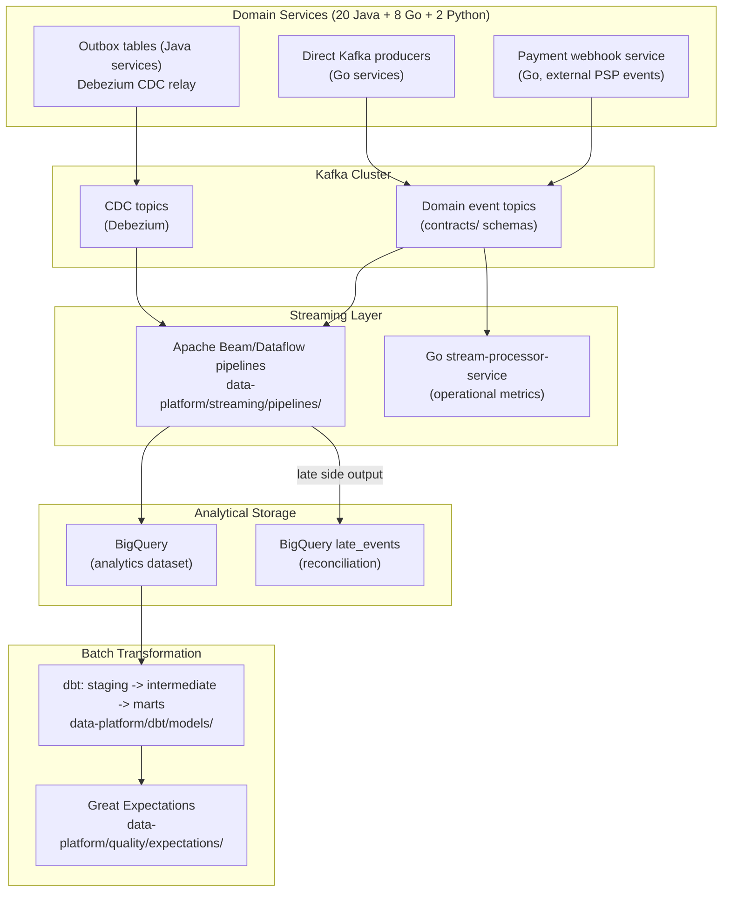
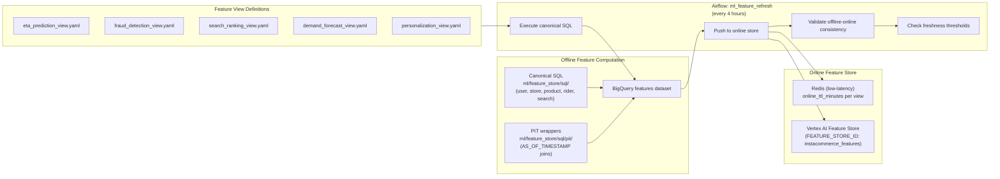
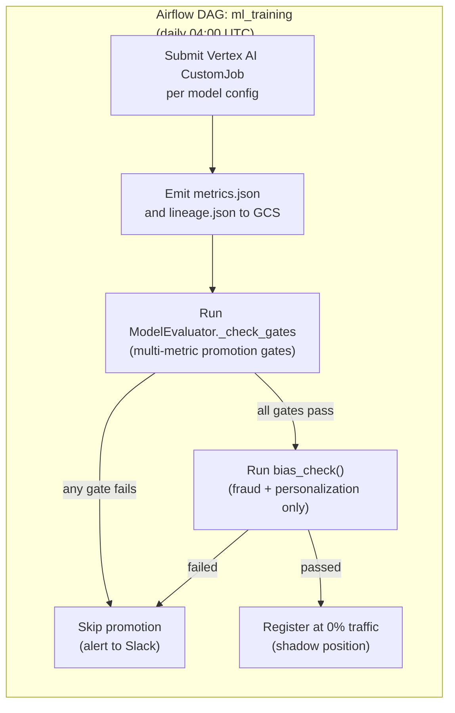
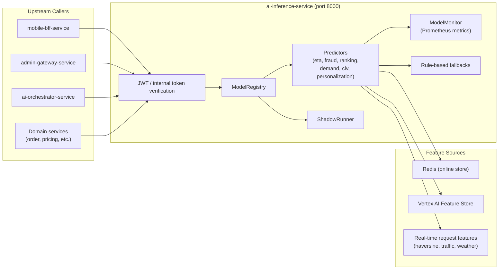
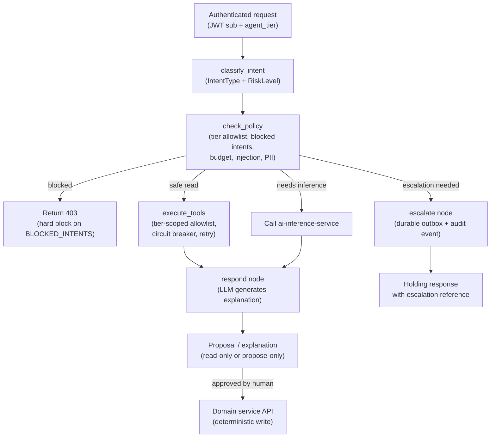
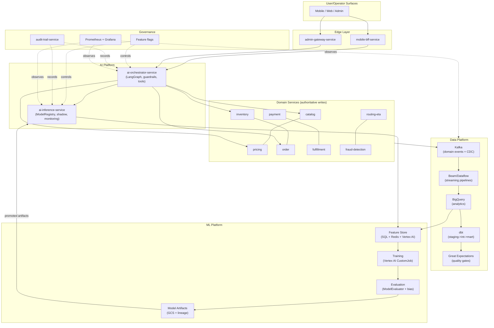
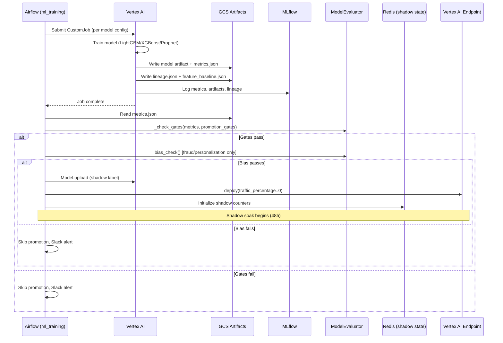
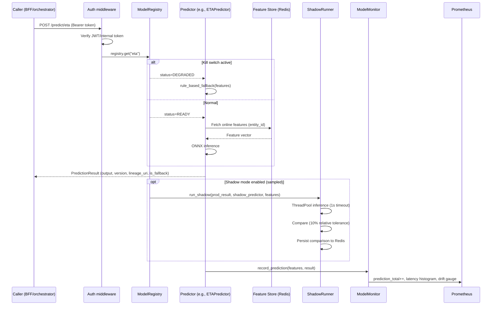
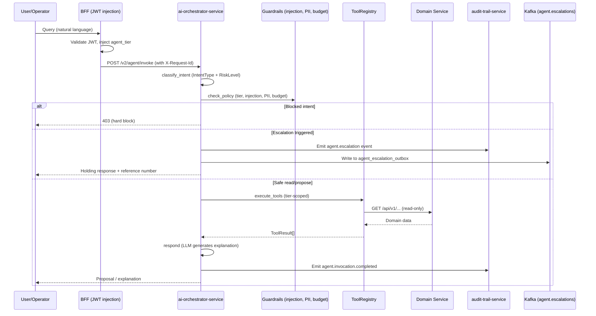

# Data, ML, and AI Control Loops -- Low-Level Design

**Iteration:** 3
**Audience:** Principal Engineers, Staff Engineers, ML Platform, Data Platform, AI Platform, SRE, Security
**Status:** Implementation-ready LLD
**Scope:** Analytics ingestion, feature computation, training/evaluation, model promotion, online inference, AI-agent proposal flows, and auditability across `data-platform/`, `ml/`, `services/ai-inference-service/`, `services/ai-orchestrator-service/`, and their integration with domain services.

**Companion documents:**
- `docs/reviews/iter3/services/ai-ml-platform.md` -- Cluster-level implementation guide
- `docs/reviews/iter3/platform/data-platform-correctness.md` -- Event-time correctness
- `docs/reviews/iter3/platform/ml-platform-productionization.md` -- Feature/model lineage, shadow, promotion
- `docs/reviews/iter3/platform/ai-agent-governance.md` -- Agent safety, auth, audit
- `docs/reviews/iter3/diagrams/flow-data-ml-ai.md` -- End-to-end data/ML/AI flow
- `docs/reviews/iter3/diagrams/lld-eventing-data.md` -- Eventing and data pipeline LLD

---

## 1. Scope and Authority Model

### 1.1 What this document governs

This LLD defines the control loops that move data from domain events through analytics, feature computation, model training, evaluation, promotion, online inference, and AI-agent proposal execution back to domain services. It covers the full lifecycle from Kafka topic to customer-facing prediction, and from LLM invocation to operator-approved action.

### 1.2 Authority boundaries

| Layer | Authority | What it does NOT own |
|---|---|---|
| `data-platform/` | Event-time correctness, dbt layer semantics (`stg_` -> `int_` -> `mart_`), feature SQL, quality gates, Airflow DAG scheduling | Model training decisions, serving behavior |
| `ml/` | Training configs, evaluation gates, feature view definitions, model registry semantics, shadow mode, drift monitoring | Domain event schemas, online store infrastructure |
| `services/ai-inference-service` | Online model serving, fallback behavior, shadow execution, prediction result envelope | Training, feature computation, domain writes |
| `services/ai-orchestrator-service` | LangGraph agent orchestration, tool routing, guardrails, escalation | Domain state mutations (propose-only), model training |
| Domain services (order, payment, inventory, etc.) | Authoritative transactional writes, state transitions | Inference, feature computation, AI orchestration |
| `contracts/` | Canonical event schemas, topic naming, envelope fields | Computation logic, serving behavior |
| `config-feature-flag-service` | Rollout gates, emergency disable, A/B routing | Model artifacts, data pipelines |

**Governing principle:** AI and ML are advisory and inference planes. Domain services remain the single authorities for transactional writes. AI may propose; domain owners decide what becomes authoritative state.

### 1.3 Service identity and trust propagation

```
Client -> Istio Ingress -> mobile-bff-service/admin-gateway-service
                                  |
                                  | JWT with sub, exp, agent_tier claims
                                  v
                          ai-orchestrator-service (port 8100)
                                  |
                                  | Internal service token (Bearer)
                                  v
                          ai-inference-service (port 8000)
                                  |
                                  | Feature retrieval (Redis / Vertex AI)
                                  v
                          Online feature store
```

Trust tier (`AgentTier`) is derived from the verified JWT `agent_tier` claim injected by the BFF, never from client-supplied headers. Four tiers exist: `ANONYMOUS`, `VERIFIED`, `OPERATOR`, `SYSTEM`. Each tier maps to a strict tool allowlist subset defined in `app/policy/agent_policy.py`.

---

## 2. Data Ingestion and Event-Time Correctness Path

### 2.1 Ingestion topology



### 2.2 Beam pipeline inventory

| Pipeline | File | Window | Late-data strategy |
|---|---|---|---|
| Order events | `order_events_pipeline.py` | 1-min fixed, 5-min grace | Late side output -> `analytics.late_order_events` |
| Payment events | `payment_events_pipeline.py` | 1-min fixed, 5-min grace | Late side output -> `analytics.late_payment_events` |
| Inventory events | `inventory_events_pipeline.py` | 1-min fixed, 5-min grace | Late side output -> `analytics.late_inventory_events` |
| Cart events | `cart_events_pipeline.py` | 1-min fixed, 5-min grace | Late side output -> `analytics.late_cart_events` |
| Rider location | `rider_location_pipeline.py` | 5-sec sliding | Most-recent-wins; no side output (GPS semantics) |

### 2.3 Late-data scenarios and mitigations

| Scenario | Source | Lateness window | Mitigation |
|---|---|---|---|
| Mobile app reconnect | Rider GPS pings | 5-30 min | Beam late side output; rider pipeline uses most-recent-wins |
| PSP webhook retry | Stripe/Razorpay | 24-72 hours | Redis dedup (extend to 72h TTL), DB-backed dedup for audit |
| CDC replay | Debezium restart | Variable | BQ partition on `ingested_at`, dbt staging filters on `event_time` |
| dbt late incorporation | Mart runs at 02:00 UTC | >24h events missed | Incremental models with 48h lookback on `_cdc_updated_at` |

### 2.4 dbt layer semantics

```
data-platform/dbt/models/
  staging/       -- 1:1 mapping from source tables, light cleaning, event_time filtering
  intermediate/  -- Business logic joins, deduplication, enrichment
  marts/         -- Aggregated business metrics (revenue, SLA, rider performance)
```

Critical marts requiring incremental + 48h lookback: `mart_daily_revenue`, `mart_store_performance`, `mart_rider_performance`. Non-critical marts (e.g., `mart_user_cohort_retention`) remain daily snapshots.

### 2.5 Quality gates

Great Expectations suites under `data-platform/quality/expectations/` enforce:
- Schema validation on staging models
- Null-rate thresholds on critical columns
- Row-count anomaly detection (day-over-day)
- Revenue reconciliation between mart totals and source sums

Airflow DAG `data_quality.py` orchestrates these checks after each dbt run.

---

## 3. Feature Store / Training / Evaluation Lifecycle

### 3.1 Feature store architecture



### 3.2 Feature view inventory

| Feature view | File | Entity types | Owner | Online TTL | Refresh |
|---|---|---|---|---|---|
| ETA prediction | `eta_prediction_view.yaml` | store, rider | routing-team | 5 min | Every 5 min |
| Fraud detection | `fraud_detection_view.yaml` | user, order | fraud-team | 15 min | Every 4h |
| Search ranking | `search_ranking_view.yaml` | product, user | search-team | 30 min | Every 4h |
| Demand forecast | `demand_forecast_view.yaml` | store, zone | supply-team | 1h | Every 4h |
| Personalization | `personalization_view.yaml` | user | growth-team | 30 min | Every 4h |

### 3.3 Single-source SQL principle

The canonical feature computation lives in one place per feature family under `ml/feature_store/sql/`:
- `user_features.sql` -- user-level behavioral aggregates
- `store_features.sql` -- store operational metrics
- `product_features.sql` -- product catalog signals
- `rider_features.sql` -- rider performance and availability
- `search_features.sql` -- search query and interaction signals

PIT wrappers under `ml/feature_store/sql/pit/` add `WHERE event_time <= :as_of_ts` predicates for training without duplicating aggregation logic. Online refresh calls the canonical SQL with `WHERE event_time <= CURRENT_TIMESTAMP()`.

### 3.4 Feature view versioning protocol

| Change type | Version bump | Required action |
|---|---|---|
| Add new optional feature | minor (1.x.0 -> 1.x+1.0) | Retrain within 30 days |
| Remove or rename feature | major (1.x.0 -> 2.0.0) | Immediate retrain; old version archived as `*_view.v1.yaml` |
| Change feature dtype | major | Same as remove |
| Change SQL computation logic (same name) | minor | Retrain; skew check against old values |
| Change TTL or serving config only | patch | No retrain needed |

### 3.5 Offline-online consistency enforcement

After each `ml_feature_refresh` run, a validation task samples 500 entity IDs and compares BigQuery (offline) values against the Vertex AI online store:
- Continuous features: fail if Mean Absolute Relative Error (MARE) > 1%
- Categorical features: fail if exact-match rate < 99%

Feature hash pinning: at training time, a SHA256 hash of the feature SQL files is stored in the lineage record. At serving time, if the current SQL hash diverges from the model's lineage hash, `ml_feature_sql_hash_mismatch_total` counter increments.

### 3.6 Training pipeline



### 3.7 Model inventory and training configs

| Model | Config path | Primary metric | Key gates |
|---|---|---|---|
| Demand forecast | `ml/train/demand_forecast/config.yaml` | RMSE | rmse <= 0.15 |
| Delivery ETA | `ml/train/eta_prediction/config.yaml` | MAE (min) | mae <= 1.5, within_2min >= 85%, p95_latency <= 10ms |
| Search ranking | `ml/train/search_ranking/config.yaml` | NDCG@10 | ndcg@10 >= 0.65, mrr >= 0.45, null_result_rate <= 5% |
| Fraud detection | `ml/train/fraud_detection/config.yaml` | AUC-ROC | auc_roc >= 0.98, precision@95recall >= 0.70, FPR <= 5%, bias gate |
| Personalization | `ml/train/personalization/config.yaml` | Engagement rate | Model-specific gates + bias gate |
| CLV prediction | `ml/train/clv_prediction/config.yaml` | Correlation | Model-specific gates |

### 3.8 Lineage record structure

Every training run emits `lineage.json` to GCS alongside the model artifact:

```
gs://instacommerce-ml-artifacts/<model_name>/<version>/
  model/              -- ONNX or framework-specific artifact
  metrics.json        -- evaluation metrics
  lineage.json        -- provenance record
  feature_baseline.json -- per-feature distribution baseline for drift
  config.yaml         -- training config snapshot
```

Lineage fields: `model_name`, `version`, `feature_view` (path), `feature_view_version`, `feature_sha` (SHA256 of view YAML), `training_dataset_table`, `snapshot_strategy`, `training_run_id` (MLflow), `training_dag_run_id` (Airflow), `artifact_gcs_uri`, `trained_at`.

### 3.9 Evaluation gates (ModelEvaluator)

`ml/eval/evaluate.py` provides `ModelEvaluator` with:
- `_check_gates(metrics, promotion_gates)` -- multi-metric threshold enforcement
- `bias_check(model, test_data, protected_attributes)` -- demographic parity, equalized odds, disparate impact (4/5 rule)
- `EvalReport` and `BiasReport` dataclasses for structured reporting

The Airflow DAG `ml_training.py` wires `ModelEvaluator._check_gates` into the gate task (replacing the prior single-metric `_check_promotion_gate`). Bias gates are mandatory for fraud and personalization models.

---

## 4. Model Registry, Promotion, and Rollback Path

### 4.1 Model registry architecture

```
ml/serving/model_registry.py -- ModelRegistry
  _models: Dict[str, BasePredictor]     -- active production predictors
  _shadow: Dict[str, BasePredictor]     -- shadow/challenger predictors
  _ab_routing: Dict[str, Dict[str, float]]  -- weighted A/B traffic splits
  _kill_switches: Dict[str, bool]       -- emergency kill per model
```

`ModelRegistry` is an in-process registry loaded at `ai-inference-service` startup. It manages six predictors: `eta`, `fraud`, `ranking`, `demand`, `clv`, `personalization`. Each extends `BasePredictor` (ONNX Runtime + rule-based fallback).

### 4.2 Promotion stages

```
Offline gates pass
    |
    v
Shadow registration (0% serving traffic)
    |
    v  48h soak, >= 95% agreement, >= 1000 comparisons
    |
Canary (5% traffic)
    |
    v  4h soak, SLOs green (latency, error rate, drift)
    |
50% traffic
    |
    v  2h soak
    |
Full promotion (100%)
    |
    v  Archive previous champion pointer
    |
Done (new champion)
```

### 4.3 Shadow mode mechanics

`ml/serving/shadow_mode.py` -- `ShadowRunner`:
- Runs challenger predictor in a `ThreadPoolExecutor` (4 workers) with 1s timeout
- Compares production vs. shadow output using 10% relative tolerance for numeric keys
- Agreement state persisted to Redis (`shadow:<model>:<version>:total`, `shadow:<model>:<version>:agreed`, `shadow:<model>:<version>:timeline` sorted set)
- `get_windowed_agreement_rate(model, version, window_hours=48)` queries Redis for time-bounded rate

Shadow sample rates (to limit CPU overhead at peak):

| Model | Shadow sample rate | Rationale |
|---|---|---|
| ETA | 10% | High volume (~50K req/min peak); 10% gives >300K comparisons/day |
| Fraud | 100% | Lower volume; safety-critical; must see every case |
| Search Ranking | 5% | Very high volume; 5% still gives statistical power |
| Demand Forecast | N/A | Offline batch; shadow via offline replay |
| Personalization | 10% | High volume; 10% sufficient |
| CLV | N/A | Offline batch; shadow via offline replay |

### 4.4 Promotion automation

Airflow sensor task `_check_shadow_agreement` (polling every 6h):
1. Query Redis `shadow:<model>:<version>:timeline` for 48h window
2. Require >= 1000 comparisons and >= 95% agreement rate
3. On pass: proceed to `_canary_promote` (5% traffic via `endpoint.update_traffic_split`)
4. On fail: skip promotion, alert Slack

Canary-to-full gate additionally requires:
- `ml_prediction_latency_seconds{model=X, quantile="0.95"} < SLA_MS / 1000`
- `ml_error_rate{model=X} < 0.005`
- `ml_drift_psi{model=X} < 0.1`

### 4.5 Rollback tiers

| Tier | Trigger | Action | Owner | RTO |
|---|---|---|---|---|
| T1 -- Instant kill | p99 latency > 2x SLA OR error rate > 5% | `registry.kill(model_name)` -> rule-based fallback | On-call (automated) | < 30s |
| T2 -- Version rollback | Champion underperforms vs. previous champion | Re-deploy previous champion artifact to 100% traffic (GCS pointer) | ML Platform on-call | < 5 min |
| T3 -- Feature rollback | Feature SQL bug | Revert git change, re-run `ml_feature_refresh` DAG | Data + ML on-call | < 30 min |

Rollback mechanics:
- T1: `ModelRegistry.kill()` forces `ModelStatus.DEGRADED`, predictor delegates to `rule_based_fallback()`
- T2: `scripts/ml_rollback.py --model <name> --env prod` reads `previous-champion/pointer.json` from GCS and shifts 100% traffic back
- T2 in-process: `ModelRegistry.rollback_to_version(model_name, version)` loads previous artifact; falls through to T1 kill switch on load failure

---

## 5. Online Inference and AI Proposal-Loop Boundaries

### 5.1 Online inference architecture



### 5.2 Prediction result envelope

Every prediction returns a `PredictionResult`:

```
PredictionResult:
  output: Dict[str, Any]          -- model-specific prediction payload
  model_version: str              -- active artifact version
  model_name: str                 -- registered model name
  latency_ms: float               -- inference time
  is_fallback: bool               -- True if rule-based fallback was used
  feature_importance: Optional    -- SHAP or feature contribution scores
  lineage_uri: Optional[str]      -- gs:// path to lineage.json
  feature_view_version: Optional  -- feature view semantic version
```

### 5.3 AI orchestrator proposal-loop



### 5.4 Strict propose-only boundary

AI may: read, summarize, recommend, triage, retrieve, classify, prepare proposals.

AI must NOT autonomously execute:
- Payment authorization, capture, refund, or dispute resolution
- Inventory mutation or reservation
- Rider dispatch assignment
- Order state transitions
- Bulk pricing or promotional override
- Account, identity, or compliance actions

Write-capable tools (e.g., `order.refund`, `order.cancel`) require:
1. `AgentTier.OPERATOR` verified from JWT
2. An approved `escalation_id` from the durable approval loop
3. Intersection of tier allowlist AND config allowlist (most restrictive wins)
4. Audit event emitted on every tool call

### 5.5 Tool permission matrix (target state)

| Tool | Anonymous | Verified | Operator | Notes |
|---|---|---|---|---|
| `catalog.search` | Yes | Yes | Yes | Read-only |
| `catalog.get_product` | Yes | Yes | Yes | Read-only |
| `catalog.list_products` | Yes | Yes | Yes | Read-only |
| `pricing.get_product` | Yes | Yes | Yes | Read-only |
| `pricing.calculate` | No | Yes | Yes | User-specific pricing |
| `inventory.check` | Yes | Yes | Yes | Read-only |
| `cart.get` | No | Yes | Yes | Scoped to authenticated user |
| `order.get` | No | Yes | Yes | Scoped to authenticated user |
| `order.refund` | No | No | Yes + approval | Write; requires escalation_id |
| `order.cancel` | No | No | Yes + approval | Write; requires escalation_id |

### 5.6 Escalation and approval flow

```
1. Agent identifies write intent + escalation trigger
   (high_value_refund > 50000 cents, low_confidence < 0.5,
    safety_concern, payment_dispute, repeated_failure, user_requested)
2. check_policy fires escalation
3. escalate node writes to agent_escalation_outbox (status=pending)
   + emits audit event to audit-trail-service
   + returns holding response with reference number
4. ShedLock job scans outbox every 60s; publishes to Kafka agent.escalations
5. Support UI consumes topic; operator approves/rejects with resolution JSON
6. Resolution published to agent.escalation.resolved topic
7. ShedLock job updates outbox row (status=resolved)
8. If approved: orchestrator re-invokes execute_tools with write tool for this session only
9. Audit event emitted on every state transition
```

---

## 6. Auditability, Privacy, and Trust Controls

### 6.1 Audit event schema

Defined in `contracts/events/ai-agent/v1/agent_invocation_completed.json`:

```
Standard envelope: event_id, event_type, aggregate_id, schema_version,
                   source_service, correlation_id, timestamp

Payload:
  user_id, intent, intent_confidence, risk_level, escalated,
  escalation_reason, tool_calls[], total_cost_usd, total_tokens,
  elapsed_ms, injection_blocked, pii_redacted, policy_version
```

Emitted at the end of every `/v2/agent/invoke` call via async fire-and-forget to `audit-trail-service`, with dead-letter counter for delivery failures.

### 6.2 Request correlation

`AgentState.correlation_id` maps to the upstream `X-Request-Id` header propagated from the BFF, enabling end-to-end distributed tracing across edge -> orchestrator -> inference -> domain services.

### 6.3 PII protection

- `PIIVault` (`app/guardrails/pii.py`) -- HMAC-based tokenization with mandatory `PII_VAULT_SECRET` (startup assertion blocks launch if unset with PII redaction enabled)
- PII vault mapping stored in `AgentState.pii_vault_mapping` for multi-turn consistency
- `pii_vault_mapping` excluded from all audit events and Kafka payloads
- Redis checkpoint TTL reduced to 30 min (from 1h) to limit PII exposure window
- Checkpoint cleared on escalation to prevent PII sitting in Redis during human review

### 6.4 Injection detection

`InjectionDetector` (`app/guardrails/injection.py`) -- multi-layer detection (regex patterns, entropy analysis, semantic similarity). **Fails closed**: if the detector itself errors, the request is blocked (`detection_error_fail_closed`), not allowed through.

### 6.5 Budget enforcement

`BudgetTracker` (`app/graph/budgets.py`) -- per-request token and cost budget. Raises `BudgetExceededError` which terminates the graph. Budget metadata included in every audit event.

### 6.6 Model artifact integrity

- Promoted artifacts should be signed or pinned to GCS URIs
- Serving startup must fail loudly when expected artifact version cannot be loaded
- Active model version, lineage URI, and feature-view version exported in metrics and logs
- `WEIGHTS_PATH` in `ai-inference-service` requires integrity verification (P0 gap: currently loaded with `json.load()` and no signature check)

### 6.7 Privacy controls summary

| Control | Component | Implementation |
|---|---|---|
| PII tokenization | `PIIVault` | HMAC with mandatory secret |
| PII in checkpoints | Redis TTL 30min + clear-on-escalation | Limits exposure window |
| PII in audit events | Field exclusion | `pii_vault_mapping` never serialized |
| Training data access | BigQuery IAM | Column-level security on PII columns; row-level projection checks |
| Agent query content | `query_hash` in audit events | SHA-256 hash, not raw text |
| LLM API key | `config.py` exclusion list | Never in logs; injected from sealed secret |

---

## 7. Failure Modes and Degradation Strategy

### 7.1 Failure mode catalog

| Failure | Blast radius | Detection | Degradation path |
|---|---|---|---|
| Model artifact missing at startup | Single model | Startup health check fails | `ModelStatus.DEGRADED` -> `rule_based_fallback()` |
| Feature store stale (>1h) | All models using stale features | `feature_refresh_staleness_seconds` gauge | Continue serving with stale features + alert |
| Feature store unreachable | Single prediction | Redis/Vertex timeout | Return fallback with `is_fallback=True` |
| Shadow predictor timeout (>1s) | Shadow only (never affects production) | Shadow timeout counter | Shadow result discarded; production result served |
| Inference p99 > 2x SLA | All users of that model | Prometheus alert | T1 kill switch -> rule-based fallback |
| LLM provider outage | AI orchestrator | Circuit breaker on LLM calls | Return escalation to human + deterministic response |
| Tool downstream failure | Single tool call | Circuit breaker (5 consecutive 5xx) | Tool result empty + escalation if critical |
| Injection detector error | Single request | `injection_detection_errors_total` | Fail closed (block request) |
| Kafka lag on audit events | Audit completeness | Consumer lag metric | Alert; does NOT block serving |
| Feature SQL hash mismatch | Prediction quality | `ml_feature_sql_hash_mismatch_total` | Alert; does NOT block serving (lagging indicator) |
| CDC replay / duplicate events | Data correctness | Dedup checks, row-count anomaly | Beam dedup via `insertId`; dbt incremental merge |
| PSP webhook beyond 24h Redis TTL | Payment reconciliation | Downstream idempotency | DB-backed dedup log (90-day retention) |

### 7.2 Fallback hierarchy

```
For each model predictor:
  1. Primary: ML model prediction (ONNX Runtime)
  2. Fallback: rule_based_fallback() (deterministic heuristic per model)
  3. Emergency: kill switch -> all traffic to rule_based_fallback()
  4. Full outage: service returns 503; upstream uses cached/default values

For AI orchestrator:
  1. Primary: LangGraph graph execution with LLM
  2. Fallback: escalate to human (deterministic holding response)
  3. Emergency: feature flag disables /v2/agent/invoke entirely
  4. Full outage: BFF returns static help content
```

### 7.3 Circuit breaker configuration

Tool-level circuit breaker in `app/graph/tools.py`:
- Opens after 5 consecutive failures
- Half-open probe after 30s
- Reset on successful probe

Service mesh level (Istio `DestinationRule`):
- `consecutive5xxErrors: 5`, `interval: 10s`, `baseEjectionTime: 30s`

Total tool execution timeout: `tool_total_timeout_seconds=6.0` enforced end-to-end across all sequential tool calls (not per-call).

---

## 8. Observability and Rollout Controls

### 8.1 Key metrics

| Metric | Source | Alert threshold | Purpose |
|---|---|---|---|
| `ml_model_prediction_total` | `monitoring.py` | N/A (rate) | Traffic volume per model/version/fallback |
| `ml_model_prediction_latency_seconds` | `monitoring.py` | p95 > model SLA | Latency budget |
| `ml_model_drift_psi` | `monitoring.py` | > 0.1 warn, > 0.2 alert | Feature drift |
| `ml_model_shadow_agreement_rate` | `monitoring.py` | < 95% blocks promotion | Shadow evaluation |
| `ml_model_shadow_latency_overhead_ms` | `monitoring.py` | p99 > 500ms | Shadow CPU overhead |
| `ai_inference_request_latency_ms` | `ai-inference-service` | p95 > per-model SLA | User-facing latency |
| `ai_inference_fallback_rate` | `ai-inference-service` | > 5% sustained | Silent degradation |
| `ai_agent_requests_total` | `ai-orchestrator-service` | By tier and intent | Trust and abuse |
| `ai_agent_escalations_total` | `ai-orchestrator-service` | Rate spike | Approval workload |
| `ai_agent_blocked_requests_total` | `ai-orchestrator-service` | Rate spike | Safety effectiveness |
| `feature_refresh_staleness_seconds` | `ml_feature_refresh` DAG | > 3600s | Feature freshness |
| `model_version_active` | `model_registry.py` | Label drift | Rollout and rollback visibility |
| `audit_event_delivery_failures_total` | `ai-orchestrator-service` | > 0 sustained | Compliance risk |
| `injection_detection_errors_total` | `injection.py` | > 0 | Detector health |
| `ml_feature_sql_hash_mismatch_total` | `predictor.py` | > 0 | Training-serving SQL drift |

### 8.2 Rollout controls

| Control surface | Mechanism | Granularity |
|---|---|---|
| Model version traffic split | Vertex AI `update_traffic_split` | Per-model, percentage-based |
| Model kill switch | `ModelRegistry.kill()` | Per-model, instant |
| AI graph version | Feature flag on `/v2/agent/invoke` vs legacy | Per-endpoint |
| Tool allowlist | `config.py` `tool_allowlist` + tier intersection | Per-tool, per-tier |
| Shadow mode enable/disable | `ModelRegistry.set_shadow()` / `remove_shadow()` | Per-model |
| Feature refresh | Airflow DAG enable/disable | Per-feature-family |
| Agent rate limits | Redis-backed `RedisRateLimiter` | Per-user, per-IP |
| Inference rate limits | Per-endpoint limits | Per-service |
| Istio circuit breakers | `DestinationRule` outlier detection | Per-downstream-service |

### 8.3 Structured logging

Both AI services use JSON-formatted structured logs with:
- `timestamp`, `level`, `logger`, `message`
- `model`, `version`, `latency_ms`, `is_fallback` (inference service)
- `request_id`, `correlation_id`, `user_id`, `intent`, `risk_level`, `policy_version` (orchestrator)

All logs are indexed for distributed tracing via `correlation_id` (upstream `X-Request-Id`).

---

## 9. Diagrams

### 9.1 End-to-end component diagram



### 9.2 Training pipeline sequence



### 9.3 Online inference request flow



### 9.4 AI agent proposal-loop sequence



---

## 10. Concrete Implementation Guidance and Sequencing

### 10.1 Wave A -- Truth and authentication (Week 1-2)

| # | Task | Files | Owner |
|---|---|---|---|
| A1 | Add JWT verification middleware to `ai-orchestrator-service` | `app/api/auth.py`, `app/api/handlers.py` | AI Platform |
| A2 | Add internal token verification to `ai-inference-service` | `app/main.py` | AI Platform |
| A3 | Override client-supplied `user_id` with JWT `sub` claim | `app/api/handlers.py` | AI Platform |
| A4 | Propagate `X-Request-Id` as `correlation_id` in `AgentState` | `app/graph/state.py`, `app/api/handlers.py` | AI Platform |
| A5 | Fix injection detector to fail closed | `app/guardrails/injection.py:138-140` | Security |
| A6 | Add `PII_VAULT_SECRET` startup assertion | `app/main.py` | Security |
| A7 | Ensure deployed model artifacts match promoted truth (startup validation) | `ml/serving/predictor.py` | ML Platform |

### 10.2 Wave B -- Serving governance (Week 2-4)

| # | Task | Files | Owner |
|---|---|---|---|
| B1 | Add Redis-backed shadow agreement persistence | `ml/serving/shadow_mode.py` | ML Platform |
| B2 | Add shadow sample rate per model | `ml/serving/shadow_mode.py` | ML Platform |
| B3 | Wire `ModelEvaluator` into Airflow `ml_training.py` gate task | `data-platform/airflow/dags/ml_training.py` | ML Platform |
| B4 | Add bias gate for fraud and personalization models | `data-platform/airflow/dags/ml_training.py` | ML Platform |
| B5 | Implement 3-stage promotion (shadow -> canary -> full) | `data-platform/airflow/dags/ml_training.py` | ML Platform |
| B6 | Add rollback script + `ModelRegistry.rollback_to_version()` | `scripts/ml_rollback.py`, `ml/serving/model_registry.py` | ML Platform |
| B7 | Expose shadow agreement rate + latency overhead in Prometheus | `ml/serving/monitoring.py` | ML Platform |
| B8 | Replace in-process rate limiter with Redis-backed `RedisRateLimiter` | `app/guardrails/rate_limiter.py` | AI Platform |

### 10.3 Wave C -- Feature and data correctness (Week 4-6)

| # | Task | Files | Owner |
|---|---|---|---|
| C1 | Extend Beam watermarks to 5-min grace period + late side output | `data-platform/streaming/pipelines/order_events_pipeline.py` + others | Data Platform |
| C2 | Convert critical dbt marts to incremental with 48h lookback | `data-platform/dbt/models/marts/mart_daily_revenue.sql` + others | Data Platform |
| C3 | Extend payment webhook dedup to 72h + DB-backed dedup log | `services/payment-webhook-service/main.go` | Platform |
| C4 | Add offline-online consistency validation to `ml_feature_refresh` | `data-platform/airflow/dags/ml_feature_refresh.py` | Data + ML |
| C5 | Implement feature hash pinning at training and serving time | `ml/train/*/train.py`, `ml/serving/predictor.py` | ML Platform |
| C6 | Store per-feature baseline distributions at training time | `ml/train/*/train.py` | ML Platform |
| C7 | Add serving-time PSI with stored baseline | `ml/serving/monitoring.py` | ML Platform |
| C8 | Add streaming feature annotations to feature group YAMLs | `ml/feature_store/feature_groups/*.yaml` | ML Platform |

### 10.4 Wave D -- Governance and agent safety (Week 6-8)

| # | Task | Files | Owner |
|---|---|---|---|
| D1 | Implement `AgentTier` + `TIER_TOOL_ALLOWLIST` enforcement | `app/policy/agent_policy.py`, `app/graph/tools.py` | AI Platform |
| D2 | Add path parameter sanitization in ToolRegistry | `app/graph/tools.py` | Security |
| D3 | Implement durable escalation outbox + resolution flow | `app/graph/nodes.py`, migration `V3__create_escalation_outbox.sql` | AI Platform |
| D4 | Write audit events to `audit-trail-service` (agent invocations + escalations) | `app/api/handlers.py`, `app/graph/nodes.py` | AI Platform |
| D5 | Define `agent_invocation_completed.json` schema in contracts | `contracts/events/ai-agent/v1/` | AI Platform |
| D6 | Add structured JSON logging to `ai-inference-service` | `services/ai-inference-service/app/main.py` | ML Platform |
| D7 | Enforce total tool execution timeout end-to-end | `app/graph/nodes.py` | AI Platform |
| D8 | Reduce Redis checkpoint TTL + clear-on-escalation | `app/graph/checkpoints.py` | AI Platform |

### 10.5 Wave E -- Observability and continuous validation (Week 8-10)

| # | Task | Files | Owner |
|---|---|---|---|
| E1 | Add inference rate limiting (per-endpoint) | `services/ai-inference-service/app/main.py` | AI + SRE |
| E2 | Add Grafana dashboards for all key metrics (Section 8.1) | `monitoring/grafana/` | SRE |
| E3 | Define SLO documents per model (latency, fallback rate, drift) | `docs/slos/` | ML Platform + SRE |
| E4 | Add Istio `DestinationRule` for AI service circuit breakers | `deploy/helm/ai-orchestrator-service/values.yaml` | Platform |
| E5 | Create red-team adversarial test suite for LangGraph | `tests/ai-red-team/` | Security |
| E6 | Add `CODEOWNERS` entries for model ownership enforcement | `.github/CODEOWNERS` | ML Platform |
| E7 | Pilot low-blast-radius operator-assist workflows (support triage) | `app/graph/tools.py` (new tools) | AI Platform |

### 10.6 Validation criteria per wave

| Wave | Validation |
|---|---|
| A | Auth-less requests to both AI services return 401; `correlation_id` appears in all logs; injection detector blocks on error |
| B | Shadow agreement persists across pod restarts; promotion requires 48h soak; rollback script restores previous champion in < 5 min |
| C | Late payment events incorporated in mart within 48h; offline-online MARE < 1% for sampled entities; feature hash mismatch counter is zero for fresh models |
| D | Anonymous user cannot call `order.get`; write tools require approved escalation_id; audit events appear in audit-trail-service within 5s |
| E | Grafana dashboard shows all metrics from 8.1; Istio circuit breaker ejects after 5 consecutive 5xx; red-team suite runs in CI |

---

## Appendix A: Ownership Map

| Area | Primary owner | Key dependencies |
|---|---|---|
| AI orchestrator safety | AI Platform + Security | Edge auth, audit trail, feature flags |
| Online inference truth | ML Platform | Data platform, SRE, feature refresh |
| Offline training and eval | ML Platform | Data platform, domain event quality |
| Feature freshness and data semantics | Data Platform | Contracts, event/data plane, service owners |
| Rollout controls | Platform / SRE | Helm, ArgoCD, observability |
| Domain action boundaries | Service owners | AI Platform, Security, Audit |

## Appendix B: Key File Reference

| Purpose | Path |
|---|---|
| Model registry | `ml/serving/model_registry.py` |
| Shadow mode | `ml/serving/shadow_mode.py` |
| Base predictor | `ml/serving/predictor.py` |
| Model monitoring | `ml/serving/monitoring.py` |
| Evaluation framework | `ml/eval/evaluate.py` |
| Feature views | `ml/feature_store/feature_views/*.yaml` |
| Canonical feature SQL | `ml/feature_store/sql/*.sql` |
| Training configs | `ml/train/*/config.yaml` |
| ML training DAG | `data-platform/airflow/dags/ml_training.py` |
| Feature refresh DAG | `data-platform/airflow/dags/ml_feature_refresh.py` |
| Data quality DAG | `data-platform/airflow/dags/data_quality.py` |
| Streaming pipelines | `data-platform/streaming/pipelines/*.py` |
| Quality expectations | `data-platform/quality/expectations/` |
| dbt models | `data-platform/dbt/models/{staging,intermediate,marts}/` |
| AI orchestrator graph | `services/ai-orchestrator-service/app/graph/graph.py` |
| Tool registry | `services/ai-orchestrator-service/app/graph/tools.py` |
| Guardrails | `services/ai-orchestrator-service/app/guardrails/` |
| AI agent API | `services/ai-orchestrator-service/app/api/handlers.py` |
| AI inference API | `services/ai-inference-service/app/main.py` |
| Event schemas | `contracts/events/ai-agent/v1/` |
