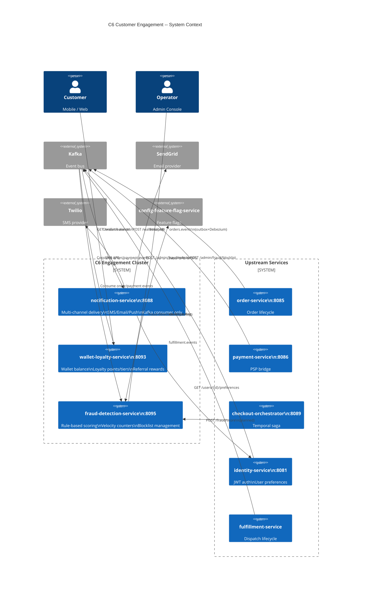
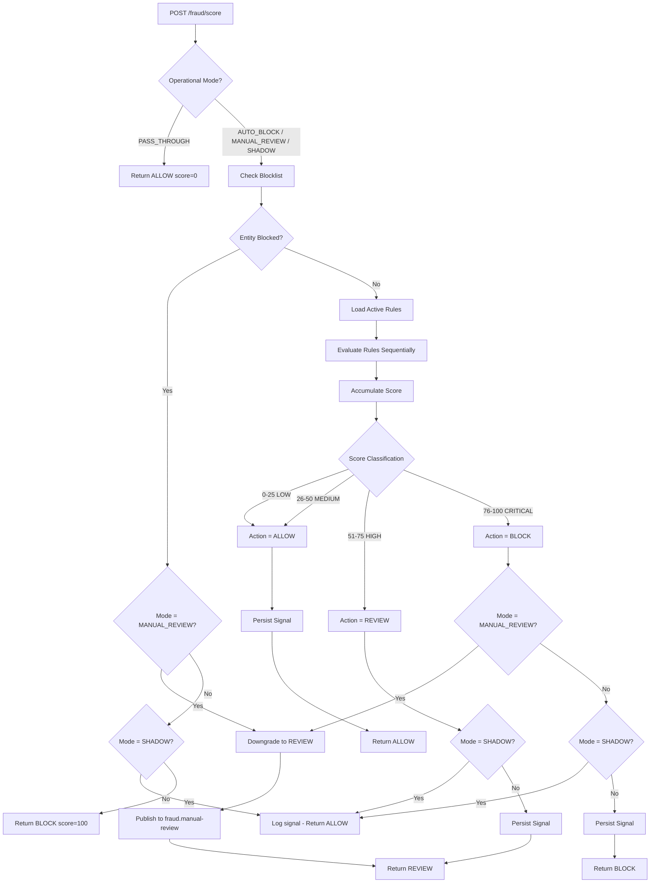
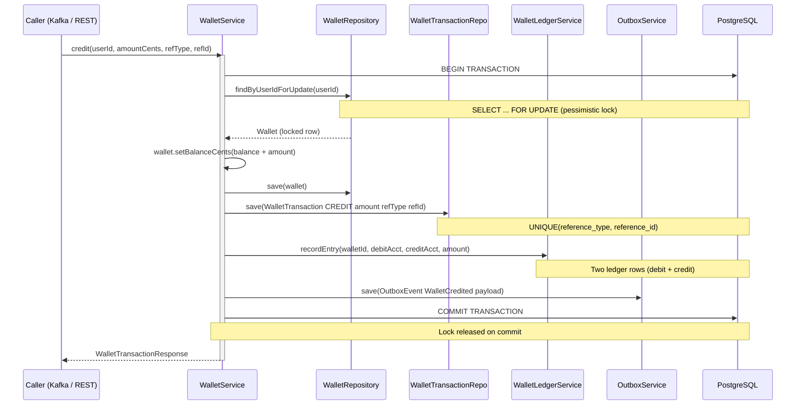
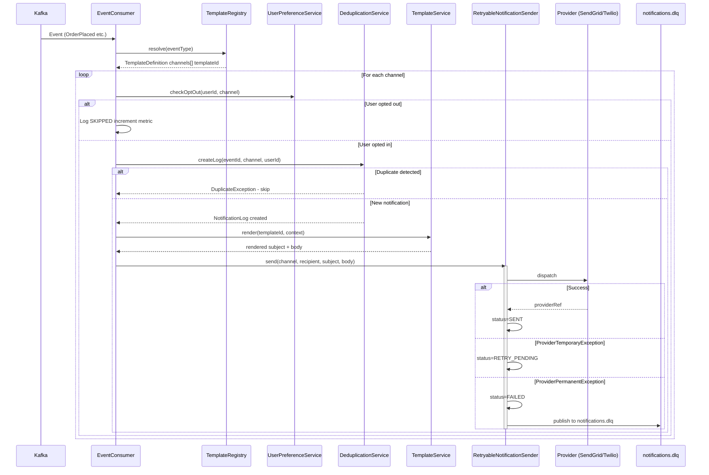
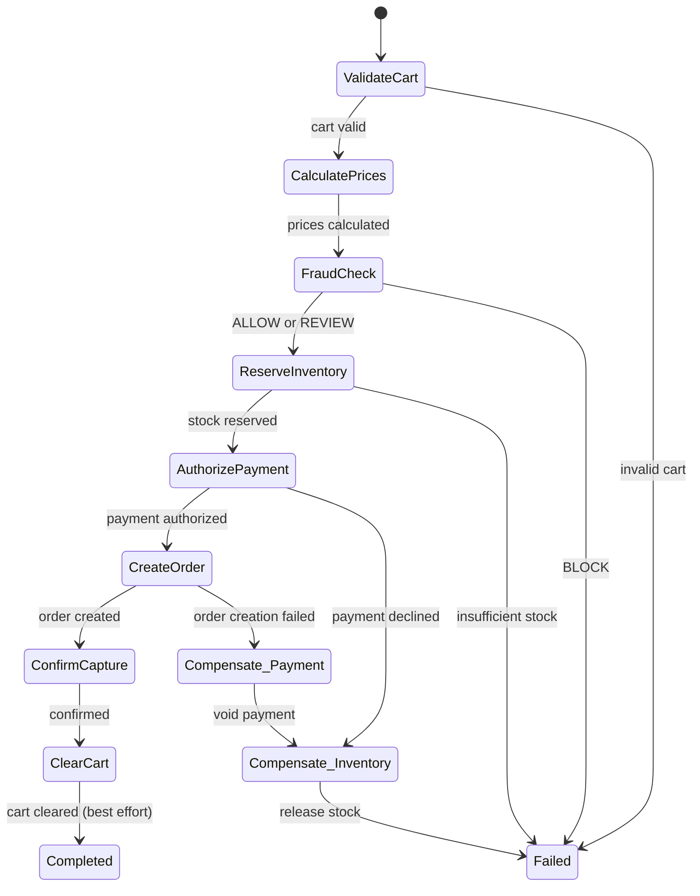
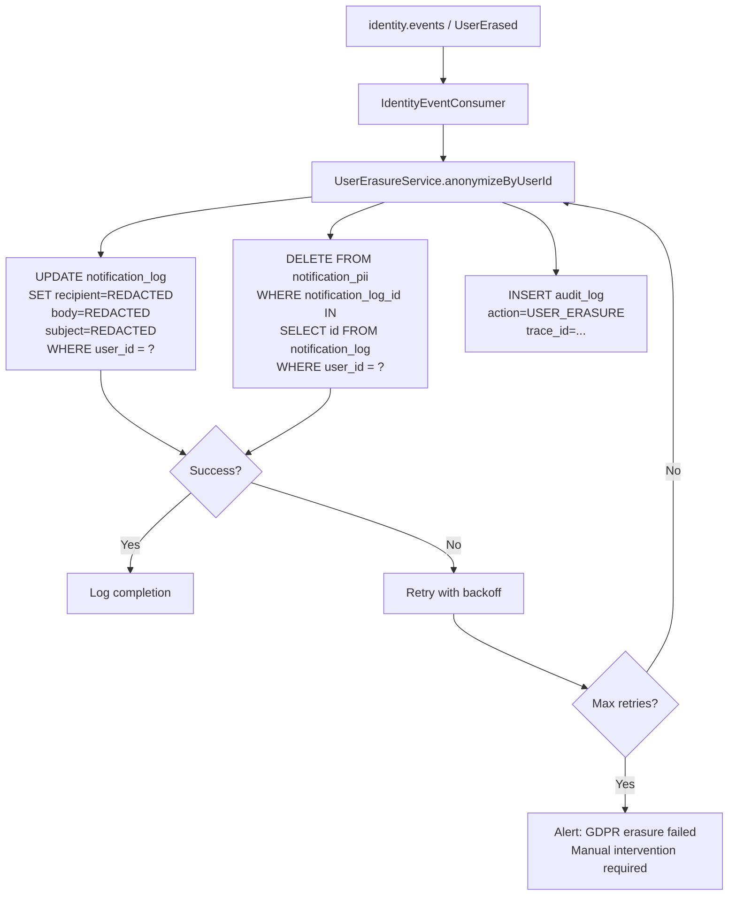

# LLD: Customer Engagement, Wallet/Loyalty & Fraud Controls

**Scope:** notification-service - wallet-loyalty-service - fraud-detection-service  
**Iteration:** 3 | **Updated:** 2026-03-08  
**Cluster:** C6 -- Customer & Engagement (Wave 3)  
**Source truth:** `services/*/src/main/java`, `services/*/src/main/resources`, `contracts/`, `docs/reviews/iter3/services/customer-engagement.md`, `docs/reviews/iter3/platform/security-trust-boundaries.md`

---

## Contents

1.  [Scope and Business Flows](#1-scope-and-business-flows)
2.  [Wallet/Loyalty Authority and Accounting Integrity Model](#2-walletloyalty-authority-and-accounting-integrity-model)
3.  [Fraud Signal Ingestion, Scoring, and Decision Hooks](#3-fraud-signal-ingestion-scoring-and-decision-hooks)
4.  [Notification Orchestration and Preference/Privacy Boundaries](#4-notification-orchestration-and-preferenceprivacy-boundaries)
5.  [Human Review, Admin Override, and Auditability](#5-human-review-admin-override-and-auditability)
6.  [Failure Modes and Safe Degradation](#6-failure-modes-and-safe-degradation)
7.  [Observability, Rollout, and Policy-Change Controls](#7-observability-rollout-and-policy-change-controls)
8.  [Diagrams](#8-diagrams)
9.  [Concrete Implementation Guidance and Sequencing](#9-concrete-implementation-guidance-and-sequencing)

---

## 1. Scope and Business Flows

### 1.1 Services in Scope

| Service | Port | Stack | Database | Primary Responsibility |
|---|---|---|---|---|
| `notification-service` | 8088 | Spring Boot 3 / Java 21 | PostgreSQL `notification` | Multi-channel delivery (SMS, Email, Push), deduplication, GDPR erasure |
| `wallet-loyalty-service` | 8093 | Spring Boot 3 / Java 21 | PostgreSQL `wallets` | Wallet balance (INR), loyalty points + tiers, referral rewards, double-entry ledger |
| `fraud-detection-service` | 8095 | Spring Boot 3 / Java 21 | PostgreSQL `fraud` | Rule-based scoring, velocity counters, blocklist management, admin overrides |

All three are Gradle subprojects registered in `settings.gradle.kts` and validated via the Java service matrix in `.github/workflows/ci.yml`.

### 1.2 End-to-End Business Flows

**Flow A -- Order-Triggered Engagement (happy path):**

```
Order placed --> [orders.events] --> notification-service  (order confirmation SMS/Email/Push)
                                 --> fraud-detection-service (increment velocity counters)
Order delivered --> [orders.events] --> wallet-loyalty-service (earn loyalty points + 2% cashback)
                                    --> notification-service  (delivery notification)
```

**Flow B -- Payment Refund Cascade:**

```
Refund issued --> [payments.events] --> wallet-loyalty-service (credit refund to wallet)
                                    --> notification-service  (refund confirmation)
```

**Flow C -- Fraud Detection (current: reactive only):**

```
Order placed --> [orders.events] --> fraud-detection-service (update velocity counters)
Payment failed --> [payments.events] --> fraud-detection-service (track failed payment)
Manual check --> POST /fraud/score --> FraudScoringService (blocklist + rules + velocity)
```

> **Critical gap (C6-F3):** Fraud scoring is NOT integrated into the checkout saga.
> The checkout-orchestrator-service executes 7 saga steps (cart -> pricing -> inventory ->
> payment -> order -> confirm -> clear-cart) without a fraud-check activity.
> See [Section 9](#9-concrete-implementation-guidance-and-sequencing) for integration guidance.

**Flow D -- GDPR Erasure:**

```
User deletion --> [identity.events / UserErased] --> notification-service (anonymize PII in logs)
```

**Flow E -- Fraud Admin Operations:**

```
Admin --> POST /admin/fraud/rules      (CRUD rules, ROLE_ADMIN required)
      --> POST /admin/fraud/blocklist  (block/unblock entities)
      --> GET  /admin/fraud/signals    (query scoring history)
```

### 1.3 Kafka Topic Map

| Topic | Publisher | Consumers in C6 | Event Types |
|---|---|---|---|
| `orders.events` | order-service (outbox + Debezium) | notification, wallet-loyalty, fraud | OrderPlaced, OrderPacked, OrderDelivered |
| `payments.events` | payment-service (outbox + Debezium) | notification, wallet-loyalty, fraud | PaymentRefunded, PaymentFailed |
| `fulfillment.events` | fulfillment-service (outbox + Debezium) | notification | OrderDispatched |
| `identity.events` | identity-service (outbox + Debezium) | notification | UserErased |
| `notifications.dlq` | notification-service | ops alerting | Failed notifications (terminal) |
| `wallet.events` | wallet-loyalty-service (outbox + Debezium) | data-platform, analytics | WalletCredited, WalletDebited, LoyaltyPointsEarned |
| `fraud.events` | fraud-detection-service (outbox + Debezium) | order-service (planned) | FraudDetected |
| `fraud.manual-review` | fraud-detection-service (planned) | admin dashboard | Flagged transactions requiring human review |

---

## 2. Wallet/Loyalty Authority and Accounting Integrity Model

### 2.1 Wallet Data Model

```
wallets                              wallet_transactions
+------------------+                 +---------------------------+
| id         UUID PK|                | id            UUID PK     |
| user_id    UUID UQ|----<           | wallet_id     UUID FK     |
| balance_cents BIGINT >= 0|         | type          CREDIT|DEBIT|
| currency   VARCHAR(3) INR|         | amount_cents  BIGINT > 0  |
| version    BIGINT @Version|        | balance_after_cents BIGINT|
| created_at TIMESTAMPTZ|            | reference_type VARCHAR    |
| updated_at TIMESTAMPTZ|            | reference_id   VARCHAR    |
+------------------+                 | description    TEXT       |
                                     | UQ(reference_type, reference_id) |
                                     +---------------------------+

wallet_ledger_entries (double-entry)
+---------------------------+
| id            UUID PK     |
| wallet_id     UUID FK     |
| debit_account  VARCHAR    |
| credit_account VARCHAR    |
| amount_cents   BIGINT     |
| transaction_type VARCHAR  |
| reference_id   VARCHAR    |
| created_at    TIMESTAMPTZ |
+---------------------------+

reference_type enum: ORDER | REFUND | TOPUP | CASHBACK | REFERRAL | PROMOTION | ADMIN_ADJUSTMENT
```

### 2.2 Loyalty Data Model

```
loyalty_accounts                     loyalty_transactions
+------------------------+          +---------------------------+
| id           UUID PK   |          | id            UUID PK     |
| user_id      UUID UQ   |----<     | account_id    UUID FK     |
| points_balance INT     |          | type     EARN|REDEEM|EXPIRE|
| lifetime_points INT    |          | points         INT        |
| tier  BRONZE|SILVER|   |          | reference_type VARCHAR    |
|       GOLD|PLATINUM    |          | reference_id   VARCHAR    |
| created_at TIMESTAMPTZ |          | UQ(ref_type, ref_id) (V8) |
| updated_at TIMESTAMPTZ |          | created_at    TIMESTAMPTZ |
+------------------------+          +---------------------------+

Tier thresholds (lifetime_points): BRONZE 0 | SILVER 5000 | GOLD 25000 | PLATINUM 100000
```

### 2.3 Concurrency and Locking Strategy

**Wallet mutations:** Pessimistic lock via `WalletRepository.findByUserIdForUpdate()` (`SELECT ... FOR UPDATE`). Every credit/debit acquires row lock, mutates `balance_cents`, writes `wallet_transactions` + `wallet_ledger_entries` + `outbox_events` in a single `@Transactional` boundary.

**Loyalty mutations (C6-F2 -- CRITICAL BUG):** `LoyaltyService.earnPoints()` currently has NO lock. Concurrent `OrderDelivered` events (Kafka retry + rebalance) can race:

```
Thread A: read balance=1000, write balance=1000+500=1500
Thread B: read balance=1000, write balance=1000+500=1500  <-- lost update
```

**Target fix:** Add pessimistic lock to `LoyaltyAccountRepository.findByUserIdForUpdate()` and enforce idempotency via the `UNIQUE(account_id, reference_type, reference_id)` constraint added in migration V8. Duplicate `earnPoints` for the same order raises `DataIntegrityViolationException` and is caught gracefully.

### 2.4 Double-Entry Ledger Integrity

Every wallet mutation creates TWO ledger rows (debit from source, credit to destination):

| Operation | Debit Account | Credit Account |
|---|---|---|
| Top-up | PAYMENT_GATEWAY | USER_WALLET |
| Purchase | USER_WALLET | MERCHANT |
| Refund | MERCHANT | USER_WALLET |
| Cashback | PROMOTION_POOL | USER_WALLET |
| Referral | REFERRAL_POOL | USER_WALLET |

**Integrity invariant:** `SUM(credit entries) - SUM(debit entries) == wallet.balance_cents` for each wallet.

**Gap (C6-F7):** No runtime verification exists. Balance can drift undetected.

**Target:** `WalletIntegrityJob` (ShedLock, daily 04:00) scans all wallets active in last 7 days, compares ledger sum to balance, logs discrepancies, increments `wallet_ledger_integrity_errors_total` Prometheus gauge, and alerts SRE on any mismatch > 0.

### 2.5 Idempotency Model

| Layer | Key | Mechanism |
|---|---|---|
| Wallet transactions | `UNIQUE(reference_type, reference_id)` | DB constraint; duplicate insert raises exception |
| Loyalty transactions | `UNIQUE(account_id, reference_type, reference_id)` (V8) | Same pattern |
| Referral redemptions | `UNIQUE(code_id, referred_user_id)` | Prevents same user redeeming same code twice |
| Outbox events | `id UUID` (generated per domain event) | Debezium dedup via outbox ID |

### 2.6 Referral Fraud Prevention

Current: `ReferralService.redeemReferral()` checks `code.active && uses < maxUses && referredUserId != code.userId`.

Gaps:
- No device/IP tracking -- one person creates N accounts, redeems own code N times.
- No integration with fraud scoring.

Target:
1. Store `ip_address` and `device_fingerprint` in `referral_redemptions`.
2. Alert if same device redeems same code > 1 time.
3. Score referral redemption via fraud-detection-service; hold reward if risk > threshold.

---

## 3. Fraud Signal Ingestion, Scoring, and Decision Hooks

### 3.1 Fraud Data Model

```
fraud_rules                              fraud_signals
+-----------------------------+          +-------------------------------+
| id          UUID PK         |          | id             UUID PK       |
| name        VARCHAR UQ      |          | user_id        UUID          |
| rule_type   VELOCITY|AMOUNT |          | order_id       UUID          |
|             |DEVICE|GEO     |          | device_fingerprint VARCHAR   |
|             |PATTERN        |          | ip_address     VARCHAR       |
| condition_json JSONB        |          | score          INT 0-100     |
| score_impact INT 0-100      |          | risk_level     LOW|MED|      |
| action ALLOW|FLAG|REVIEW    |          |                HIGH|CRITICAL |
|        |BLOCK               |          | rules_triggered JSONB[]      |
| active BOOLEAN              |          | action_taken   ALLOW|FLAG|   |
| priority INT                |          |                REVIEW|BLOCK  |
+-----------------------------+          | created_at     TIMESTAMPTZ   |
                                         +-------------------------------+

velocity_counters                        blocked_entities
+-----------------------------+          +-----------------------------+
| id          UUID PK         |          | id          UUID PK         |
| entity_type USER|DEVICE|IP  |          | entity_type USER|DEVICE|    |
| entity_id   VARCHAR         |          |             IP|PHONE        |
| counter_type ORDERS_1H|     |          | entity_value VARCHAR        |
|   ORDERS_24H|AMOUNT_24H|    |          | reason       TEXT           |
|   FAILED_PAYMENTS_1H        |          | blocked_by   VARCHAR        |
| counter_value BIGINT        |          | blocked_at   TIMESTAMPTZ    |
| window_start TIMESTAMPTZ    |          | expires_at   TIMESTAMPTZ    |
| window_end   TIMESTAMPTZ    |          | active       BOOLEAN        |
| UQ(entity_type, entity_id,  |          | UQ(entity_type, entity_value)|
|    counter_type, window_start)|        |   WHERE active = true       |
+-----------------------------+          +-----------------------------+
```

### 3.2 Scoring Pipeline

The `FraudScoringService.scoreTransaction()` executes in this order:

```
1. BLOCKLIST CHECK (fast path)
   - Query blocked_entities for user_id, device_fingerprint, ip_address
   - If ANY entity is blocked AND active AND (expires_at IS NULL OR expires_at > NOW()):
     -> Return BLOCK immediately (score=100, risk=CRITICAL)
   - Cached via Caffeine (max size default, TTL from config)

2. RULE EVALUATION (sequential, priority-ordered)
   - Load active fraud_rules sorted by priority ASC
   - For each rule, evaluate condition_json against request context:
     - VELOCITY: check velocity_counters >= threshold
     - AMOUNT: check order_amount_cents > maxCents
     - DEVICE: fingerprint anomaly patterns
     - GEO: IP geolocation mismatch
     - PATTERN: regex/behavioral patterns
   - Accumulate score_impact for each triggered rule (additive, capped at 100)

3. RISK CLASSIFICATION
   - score 0-25   -> LOW
   - score 26-50  -> MEDIUM
   - score 51-75  -> HIGH
   - score 76-100 -> CRITICAL

4. ACTION DETERMINATION
   - LOW/MEDIUM   -> ALLOW
   - HIGH         -> REVIEW (flag for manual review)
   - CRITICAL     -> BLOCK

5. PERSIST
   - Insert fraud_signal with score, risk_level, rules_triggered, action_taken
   - Insert outbox_event (FraudDetected) for downstream consumers
```

### 3.3 Velocity Counter Mechanics

Counters use UPSERT on `(entity_type, entity_id, counter_type, window_start)`:

| Counter Type | Window | Incremented On | Typical Threshold |
|---|---|---|---|
| ORDERS_1H | 1 hour | OrderPlaced event | 5 orders/hour |
| ORDERS_24H | 24 hours | OrderPlaced event | 20 orders/day |
| AMOUNT_24H | 24 hours | OrderPlaced event | 50000 cents/day |
| FAILED_PAYMENTS_1H | 1 hour | PaymentFailed event | 3 failures/hour |

**Gap (C6-F6):** No cleanup job removes expired windows. Table grows unbounded.

**Target:** `VelocityCounterCleanupJob` runs hourly, deletes rows where `window_end < NOW()`. Requires index on `window_end`.

### 3.4 Fraud Operational Modes (C6-F3 fix)

| Mode | Behavior | Use Case |
|---|---|---|
| `AUTO_BLOCK` | Full automated pipeline; BLOCK actions enforced | Normal production |
| `MANUAL_REVIEW` | Scoring runs but BLOCK downgraded to REVIEW; routed to `fraud.manual-review` topic | Model quality concerns; human oversight |
| `SHADOW` | Scoring runs, signals logged, but response always ALLOW | A/B testing new rules/models |
| `PASS_THROUGH` | No scoring; all transactions return ALLOW, score=0 | Emergency kill switch for total model failure |

Controlled via `fraud-detection-mode` feature flag in `config-feature-flag-service`. Must propagate within 1 second for kill-switch effectiveness (ADR-010 dependency).

### 3.5 Checkout Integration (planned)

Target: Insert `FraudCheckActivity` into the Temporal checkout saga between pricing and inventory reservation:

```
1. Validate Cart        (CartActivity)
2. Calculate Prices     (PricingActivity)
3. **Fraud Check**      (FraudCheckActivity) <-- NEW
4. Reserve Inventory    (InventoryActivity)
5. Authorize Payment    (PaymentActivity)
6. Create Order         (OrderActivity)
7. Confirm + Capture
8. Clear Cart
```

`FraudCheckActivity` calls `POST /fraud/score` with:
- userId, orderId, totalCents
- deviceFingerprint, ipAddress, userAgent (from checkout request context)

Response handling:
- ALLOW -> continue saga
- REVIEW -> continue saga but flag order (downstream notification to ops)
- BLOCK -> throw `FraudBlockedException` (non-retryable); saga compensates; user sees "order could not be processed"
- CHALLENGE -> (future) require additional verification step

---

## 4. Notification Orchestration and Preference/Privacy Boundaries

### 4.1 Architecture Overview

notification-service is a **consumer-only service** -- it exposes no REST API. All triggers arrive via Kafka events.

```
Kafka topics          notification-service internals
+-----------+    +----------------------------------------------+
|orders     |--->| OrderEventConsumer                           |
|.events    |    |   |                                          |
+-----------+    |   v                                          |
|payments   |--->| PaymentEventConsumer --> NotificationService |
|.events    |    |   |                        |                 |
+-----------+    |   v                        v                 |
|fulfillment|--->| FulfillmentEventConsumer  TemplateRegistry   |
|.events    |    |   |                        |                 |
+-----------+    |   v                        v                 |
|identity   |--->| IdentityEventConsumer    TemplateService     |
|.events    |    |                          (Mustache render)   |
+-----------+    |                            |                 |
                 |   DeduplicationService <---+                 |
                 |   UserPreferenceService    |                 |
                 |   (REST -> identity-svc)   |                 |
                 |                            v                 |
                 |   RetryableNotificationSender (@Async)       |
                 |     |          |           |                 |
                 |     v          v           v                 |
                 |  SendGrid   Twilio    LoggingProvider        |
                 |  (Email)    (SMS)     (dev fallback)         |
                 |                                              |
                 |   NotificationRetryJob (5s poll)             |
                 |   NotificationDlqPublisher -> notifications.dlq|
                 +----------------------------------------------+
```

### 4.2 Notification Processing Pipeline

```
1. EVENT RECEIVED (Kafka consumer deserializes EventEnvelope)
2. TEMPLATE RESOLUTION
   - TemplateRegistry maps eventType -> TemplateDefinition
   - TemplateDefinition declares: channels[] (EMAIL, SMS, PUSH), templateId, subject
3. USER PREFERENCE CHECK
   - UserPreferenceService calls identity-service REST: GET /users/{id}/notification-preferences
   - Respects emailOptOut, smsOptOut, pushOptOut, marketingOptOut flags
   - If user opted out of channel -> status=SKIPPED, logged, metric incremented
4. DEDUPLICATION
   - DeduplicationService.createLog() inserts notification_log row
   - UNIQUE(event_id, channel) constraint prevents duplicate sends
   - event_id extraction: envelope.id -> aggregateId:eventType -> eventType:partition:offset
     (fallback chain)
5. TEMPLATE RENDERING
   - TemplateService renders Mustache template with event payload context
   - Caches compiled templates
6. ASYNC DISPATCH
   - RetryableNotificationSender sends via @Async("notificationExecutor")
   - Routes to provider: SendGridEmailProvider | TwilioSmsProvider | LoggingProvider
7. RESULT HANDLING
   - Success: status=SENT, provider_ref stored
   - ProviderTemporaryException: status=RETRY_PENDING, next_retry_at computed
   - ProviderPermanentException: status=FAILED, published to notifications.dlq
8. RETRY LOOP
   - NotificationRetryJob polls RETRY_PENDING every 5 seconds (batch size 100)
   - Backoff: attempt 1=5s, attempt 2=30s, attempt 3=5min
   - Max 3 retries; after that -> FAILED + DLQ
9. AUDIT
   - AuditLogService records every action with trace_id for GDPR compliance
```

### 4.3 Privacy Boundaries

**PII in notification_log (C6-F8 gap):**

| Column | Current | Target |
|---|---|---|
| `recipient` | Plaintext email/phone | SHA-256 hash (`recipient_hash`) |
| `body` | Plaintext message | Encrypted (AES-256-GCM, key in GCP SM) or moved to PII vault |
| `subject` | Plaintext | Same as body |

**PII Vault Architecture (target):**

```
notification_log                  notification_pii (NEW, TTL 90 days)
+----------------------+         +---------------------------+
| id          UUID PK  |<--FK-- | id            UUID PK     |
| user_id     UUID     |         | notification_log_id UUID FK|
| event_id    VARCHAR  |         | recipient      VARCHAR    |
| channel     VARCHAR  |         | body           TEXT       |
| status      VARCHAR  |         | subject        VARCHAR    |
| recipient_hash VARCHAR|        | created_at     TIMESTAMPTZ|
| template_id VARCHAR  |         +---------------------------+
| provider_ref VARCHAR |
| retry_count  INT     |         Partition-pruned by created_at.
| created_at TIMESTAMPTZ|        GDPR erasure: DELETE FROM notification_pii
+----------------------+         WHERE notification_log_id IN (SELECT id FROM
                                 notification_log WHERE user_id = ?).
```

**GDPR Erasure Flow:**

```
identity.events / UserErased --> IdentityEventConsumer
  --> UserErasureService.anonymizeByUserId(userId)
      1. UPDATE notification_log SET recipient='[REDACTED]', body='[REDACTED]',
         subject='[REDACTED]' WHERE user_id = ?
      2. (target) DELETE FROM notification_pii WHERE notification_log_id IN (...)
      3. Log audit entry with trace_id
```

### 4.4 Rate-Limit Abuse Protection (planned)

Per-user send rate limit via `notification_rate_limiter` table:

| user_id | channel | window_start | send_count |
|---|---|---|---|
| u_xyz | SMS | 2026-03-08T10:00Z | 7 |

Threshold: 10 SMS/hour, 50 Email/hour, 100 Push/hour. Exceeded -> SKIPPED + alert.

### 4.5 Event ID Deduplication Semantics (C6-F1)

**Current fallback chain (risky):**

```
1. record.key()           -- Kafka message key (producer-dependent)
2. envelope.id            -- Standard event envelope ID
3. aggregateId:eventType  -- Composite key
4. eventType:partition:offset -- Kafka coordinates (non-idempotent across rebalance)
```

**Target:** Enforce `event_id` (UUID) in all event envelopes per `contracts/README.md` standard. Log warning + metric on fallback usage. CI contract validation rejects schemas without `event_id`.

---

## 5. Human Review, Admin Override, and Auditability

### 5.1 Fraud Manual Review Queue

**Current:** All fraud decisions automated. No human recourse for false positives.

**Target architecture:**

```
FraudScoringService
  |
  |- score >= REVIEW threshold AND mode != PASS_THROUGH
  |    |
  |    v
  |  Publish to Kafka topic: fraud.manual-review
  |    {
  |      signalId, userId, orderId, score, riskLevel,
  |      rulesTriggered, ruleDetails (explainability),
  |      deviceFingerprint, ipAddress, timestamp
  |    }
  |
  v
Admin Dashboard (consumer)
  |
  |- Human reviewer evaluates context
  |- Decision: APPROVE | REJECT | ESCALATE
  |
  v
Publish to Kafka topic: fraud.review-decisions
  {
    signalId, decision, reviewerId, reason, timestamp
  }
  |
  v
FraudDecisionConsumer (fraud-detection-service)
  |- APPROVE: update fraud_signal.action_taken = ALLOW
  |- REJECT:  update fraud_signal.action_taken = BLOCK, add to blocklist
  |- ESCALATE: notify security team
```

**SLA:** Manual reviews must complete within 30 minutes for REVIEW-flagged orders. Alert if `fraud_manual_review_queue_size > 100`.

### 5.2 Fraud Admin Endpoints

| Method | Path | Auth | Purpose |
|---|---|---|---|
| GET | `/admin/fraud/rules` | ROLE_ADMIN | List all fraud rules |
| POST | `/admin/fraud/rules` | ROLE_ADMIN | Create rule |
| PUT | `/admin/fraud/rules/{id}` | ROLE_ADMIN | Update rule |
| DELETE | `/admin/fraud/rules/{id}` | ROLE_ADMIN | Deactivate rule |
| GET | `/admin/fraud/blocklist` | ROLE_ADMIN | List blocked entities |
| POST | `/admin/fraud/blocklist` | ROLE_ADMIN | Block entity |
| DELETE | `/admin/fraud/blocklist/{id}` | ROLE_ADMIN | Unblock entity |
| GET | `/admin/fraud/signals` | ROLE_ADMIN | Query scoring history |
| GET | `/admin/fraud/signals/{id}/explain` | ROLE_ADMIN | Human-readable explanation (planned) |
| POST | `/admin/fraud/rules/export` | ROLE_ADMIN | Export rule snapshot to GCS (planned) |
| POST | `/admin/fraud/rules/import` | ROLE_ADMIN | Import rule snapshot (planned) |

**Security concern (security-trust-boundaries.md G3):** `InternalServiceAuthFilter` currently grants `ROLE_ADMIN` to all internal callers via the shared `INTERNAL_SERVICE_TOKEN`. Any internal service can call these admin endpoints.

**Target:** (a) Remove `ROLE_ADMIN` from internal service principal (grant only `ROLE_INTERNAL_SERVICE`). (b) Add `@PreAuthorize("hasRole('ADMIN') and @fraudAuthz.isHumanUser(authentication)")` to ensure only human admins modify rules/blocklist. (c) Two-person approval for high-impact changes (block user, delete rule).

### 5.3 Wallet Admin Operations

| Method | Path | Auth | Purpose |
|---|---|---|---|
| POST | `/wallet/topup` | USER (JWT) | Self-service top-up |
| POST | `/wallet/debit` | USER (JWT) | Self-service debit (purchase) |
| (planned) | `/admin/wallet/adjust` | ROLE_ADMIN | Admin balance adjustment |
| (planned) | `/admin/wallet/freeze` | ROLE_ADMIN | Freeze wallet (fraud hold) |

Admin adjustments must include `reference_type=ADMIN_ADJUSTMENT`, `reference_id=<ticket-id>`, and full audit trail.

### 5.4 Audit Trail Integration

All C6 services publish audit events via outbox:

| Service | Auditable Actions | Audit Mechanism |
|---|---|---|
| notification-service | Every send/skip/fail | `audit_log` table (JSONB details, trace_id) |
| wallet-loyalty-service | Every credit/debit/redeem | `outbox_events` -> `wallet.events` topic |
| fraud-detection-service | Every score/block/rule-change | `fraud_signals` table + `outbox_events` -> `fraud.events` |

Target: All BLOCK, ADMIN_ADJUSTMENT, and rule modification actions additionally publish to `audit.events` topic consumed by `audit-trail-service` with `actor`, `action`, `entity_type`, `entity_id`, `old_value`, `new_value`.

---

## 6. Failure Modes and Safe Degradation

### 6.1 Failure Matrix

| Failure | Service | Impact | Detection | Mitigation |
|---|---|---|---|---|
| SendGrid outage | notification | Email stops | `notification_failed_total` spike; CB opens | Resilience4j CB: open after 10 failures, half-open 60s. Retry queue absorbs. DLQ for terminal. |
| Twilio outage | notification | SMS stops | Same pattern | Same circuit breaker. Order confirmation SMS delayed but retried. |
| Identity-svc down | notification | No preferences | Latency spike on lookup | Cache preferences (Caffeine 60s). On miss + unavailable: default opt-in transactional, skip marketing. |
| Kafka consumer lag | all C6 | Delayed processing | Consumer lag metric | Auto-scaling consumers. Alert if lag > 5 min. |
| PostgreSQL slow | wallet-loyalty | Queries/mutations fail | Readiness probe fails | Caffeine cache serves stale reads. Mutations fail-fast 503. Checkout compensates. |
| Lock timeout | wallet-loyalty | Mutation hangs | Lock retry counter | 5s timeout -> 503, client retries. |
| Concurrent earn | wallet-loyalty | Double-credit (C6-F2) | Points anomaly | Pessimistic lock + idempotency constraint (target fix). |
| Model over-trigger | fraud | Orders blocked | `fraud_score{action=BLOCK}` spike | Switch to MANUAL_REVIEW or PASS_THROUGH via feature flag. |
| Fraud svc down | fraud + checkout | No fraud check | Health check failure | FraudCheckActivity timeout 10s -> default ALLOW (fail-open). |
| Velocity bloat | fraud | Query perf degrades | `pg_stat_user_tables` | Hourly cleanup job. Index on `window_end`. |
| Outbox relay lag | wallet-loyalty | Downstream misses events | `MAX(created_at) - MAX(sent_at)` | Alert if lag > 1h. Cleanup respects `sent_at`. |
| DLQ depth | notification | Failures accumulate | Topic depth | Alert if > 50/hour. Manual review + replay. |

### 6.2 Degradation Hierarchy

```
NORMAL ---------> DEGRADED -----------> EMERGENCY
(all systems ok)  (partial failures)    (critical failures)

Notification:
  NORMAL: All channels active, circuit breakers closed
  DEGRADED: One provider circuit open; retries absorbing; DLQ growing
  EMERGENCY: All providers down; all notifications queuing; switch to log-only

Wallet-Loyalty:
  NORMAL: All mutations succeed, ledger integrity verified
  DEGRADED: High lock contention; cache serving stale reads; outbox lag > 1h
  EMERGENCY: Ledger integrity error detected; halt mutations; SRE paged

Fraud:
  NORMAL: AUTO_BLOCK mode; scoring < 200ms p99
  DEGRADED: Scoring latency > 500ms; manual review queue backlog > 100
  EMERGENCY: Model failure; switch to PASS_THROUGH; all transactions allowed
```

---

## 7. Observability, Rollout, and Policy-Change Controls

### 7.1 Key Metrics

#### Notification Service

| Metric | Type | Labels | Alert Threshold |
|---|---|---|---|
| `notification_sent_total` | Counter | channel, event_type | -- |
| `notification_failed_total` | Counter | channel, event_type, failure_reason | > 5% of sent (5 min) |
| `notification_skipped_total` | Counter | channel, reason | -- |
| `notification_retry_attempts_total` | Counter | channel, attempt | -- |
| `notification_provider_latency_seconds` | Histogram | channel, provider | p99 < 5s |
| `notification_deduplication_hits_total` | Counter | channel | -- |
| `notification_circuit_breaker_state` | Gauge | provider, state | Alert on OPEN |

#### Wallet-Loyalty Service

| Metric | Type | Labels | Alert Threshold |
|---|---|---|---|
| `wallet_credit_total` | Counter | reference_type | -- |
| `wallet_debit_total` | Counter | reference_type | -- |
| `wallet_insufficient_balance_total` | Counter | -- | -- |
| `wallet_optimistic_lock_retries_total` | Counter | -- | > 1% of mutations |
| `wallet_ledger_integrity_errors_total` | Counter | -- | > 0 (CRITICAL) |
| `loyalty_points_earned_total` | Counter | tier | 0 for 1h -> alert |
| `loyalty_points_redeemed_total` | Counter | tier | -- |
| `loyalty_tier_upgrades_total` | Counter | from_tier, to_tier | -- |

#### Fraud Detection Service

| Metric | Type | Labels | Alert Threshold |
|---|---|---|---|
| `fraud_score_total` | Counter | risk_level, action | -- |
| `fraud_rule_triggered_total` | Counter | rule_name | > 10x baseline |
| `fraud_blocklist_hits_total` | Counter | entity_type | -- |
| `fraud_scoring_latency_seconds` | Histogram | -- | p99 < 200ms |
| `fraud_manual_review_queue_size` | Gauge | -- | > 100 warn, > 500 crit |
| `fraud_operational_mode` | Gauge | mode | Non-AUTO_BLOCK -> alert |

### 7.2 SLIs and SLOs

| Service | SLI | SLO | Window |
|---|---|---|---|
| notification-service | Delivery success rate | >= 99.5% | 7 days |
| notification-service | Event-to-send latency | p99 < 10s | 7 days |
| wallet-loyalty-service | Mutation success rate | >= 99.9% | 7 days |
| wallet-loyalty-service | Balance read latency | p99 < 100ms | 7 days |
| fraud-detection-service | Scoring availability | >= 99.95% | 30 days |
| fraud-detection-service | Scoring latency | p99 < 200ms | 7 days |

### 7.3 Alerting Rules

**Critical (PagerDuty):**
- `notification_failed_total / notification_sent_total > 0.05` for 5 min
- `wallet_ledger_integrity_errors_total > 0`
- `fraud_scoring_latency_seconds p99 > 500ms` for 10 min
- `fraud_manual_review_queue_size > 500`

**Warning (Slack):**
- `notification_circuit_breaker_state == OPEN`
- `wallet_optimistic_lock_retries_total > 1%`
- `fraud_rule_triggered_total` for specific rule > 10x baseline
- `loyalty_points_earned_total == 0` for 1 hour
- `fraud_operational_mode != AUTO_BLOCK`

### 7.4 Policy-Change Controls

| Change Type | Mechanism | Propagation | Rollback |
|---|---|---|---|
| Fraud rule CRUD | REST admin API + DB | Immediate (Caffeine cache) | Rule export/import snapshot |
| Fraud operational mode | Feature flag (config-feature-flag-service) | < 1s (ADR-010) | Toggle flag |
| Notification template | TemplateRegistry code change | Deploy | Helm rollback |
| Loyalty tier thresholds | application.yml config | Deploy | Helm rollback |
| Blocklist entity | REST admin API + DB | Immediate (Caffeine cache) | DELETE via admin API |

### 7.5 Canary Rollout Strategy

All C6 services follow:
1. **Pre-deploy:** `./gradlew :services:<service-name>:test` -- all tests must pass.
2. **Canary (10%):** Deploy, monitor key metrics for 1 hour.
3. **Full rollout (100%):** After 24-hour canary soak with no regression.
4. **Rollback:** `helm rollback <service> -n instacommerce --revision <prev>` or flag toggle.

---

## 8. Diagrams

### 8.1 C6 Component Context



### 8.2 Fraud Scoring Decision Flow



### 8.3 Wallet Credit/Debit Sequence



### 8.4 Notification Processing Sequence



### 8.5 Checkout Saga with Fraud Integration (target state)



### 8.6 GDPR Erasure Exception Path



---

## 9. Concrete Implementation Guidance and Sequencing

### 9.1 Phase 1: Safety Fixes (P0, blocking for Wave 3)

**Estimated effort: 1 sprint (2 weeks)**

#### 9.1.1 Loyalty Points Concurrency Fix (C6-F2)

**Files to change:**
- `services/wallet-loyalty-service/src/main/java/com/instacommerce/wallet/repository/LoyaltyAccountRepository.java`
- `services/wallet-loyalty-service/src/main/java/com/instacommerce/wallet/service/LoyaltyService.java`

**Changes:**
1. Add `@Lock(LockModeType.PESSIMISTIC_WRITE)` to `findByUserIdForUpdate()` in `LoyaltyAccountRepository`.
2. Use `findByUserIdForUpdate()` in `LoyaltyService.earnPoints()` instead of plain `findByUserId()`.
3. Wrap in `@Transactional` if not already.
4. V8 migration already adds `UNIQUE(reference_type, reference_id)` on `loyalty_transactions`.
5. Catch `DataIntegrityViolationException` for duplicate earns; return existing transaction.

**Validation:**
```
./gradlew :services:wallet-loyalty-service:test --tests "*.LoyaltyServiceConcurrencyTest"
```

#### 9.1.2 Fraud Operational Mode Feature Flag (C6-F3)

**Files to change:**
- `services/fraud-detection-service/src/main/java/com/instacommerce/fraud/service/FraudScoringService.java`
- `services/fraud-detection-service/src/main/resources/application.yml`

**Changes:**
1. Add `FraudOperationalMode` enum: `AUTO_BLOCK`, `MANUAL_REVIEW`, `SHADOW`, `PASS_THROUGH`.
2. Read mode from feature flag service (REST with Caffeine cache, 1s TTL).
3. In `scoreTransaction()`, check mode before action decision per Section 3.4 logic.

**Validation:**
```
./gradlew :services:fraud-detection-service:test --tests "*.FraudOperationalModeTest"
```

#### 9.1.3 Wallet Ledger Integrity Check (C6-F7)

**Files to create:**
- `services/wallet-loyalty-service/src/main/java/com/instacommerce/wallet/service/WalletIntegrityJob.java`

**Changes:**
1. ShedLock-protected scheduled job at `0 0 4 * * *` (daily 04:00).
2. Compare `wallet.balance_cents` vs ledger sum for each active wallet.
3. Phase 1: log-only. Phase 2 (7 days clean): promote to blocking.

#### 9.1.4 Notification Circuit Breaker (C6-F5)

**Files to change:**
- `services/notification-service/build.gradle.kts` (add Resilience4j)
- `services/notification-service/src/main/java/.../RetryableNotificationSender.java`

**Config:** `failure-rate-threshold: 50%`, `wait-duration-in-open-state: 60s`, `permitted-calls-in-half-open-state: 3`.

#### 9.1.5 Velocity Counter Cleanup (C6-F6)

**File:** `services/fraud-detection-service/src/main/java/.../VelocityCounterCleanupJob.java`

Verify hourly schedule. Add `DELETE WHERE window_end < NOW()` with batch limit. Add index migration.

### 9.2 Phase 2: Privacy (P1, before GDPR audit)

**Estimated effort: 1 sprint**

1. Migration `V4__add_notification_pii_vault.sql`: create `notification_pii`, add `recipient_hash`.
2. Dual-write: new notifications write to both tables.
3. Backfill: `NotificationPiiBackfillJob` (one-time, off-peak).
4. Update `UserErasureService` to delete from vault.
5. After 7-day soak: drop plaintext columns.

### 9.3 Phase 3: Governance (P1, before ML rollout)

**Estimated effort: 1 sprint**

1. Fraud rule export/import endpoints with GCS snapshot storage.
2. `rule_details` JSONB column in `fraud_signals` for explainability.
3. `GET /admin/fraud/signals/{id}/explain` endpoint.
4. `fraud.manual-review` Kafka topic + producer integration.
5. `fraud.review-decisions` Kafka topic + consumer.

### 9.4 Phase 4: Hardening (P2, post-launch)

**Estimated effort: 2 sprints**

1. Wallet outbox lag monitoring (`sent_at` column, lag alert).
2. Referral fraud prevention (device fingerprint, fraud-service integration).
3. Adaptive fraud thresholds (`user_fraud_profile` table, profile-deviation rules).
4. Two-person approval for high-impact fraud admin actions.
5. Notification rate limiting (`notification_rate_limiter` table).
6. Checkout saga fraud integration (`FraudCheckActivity` in `CheckoutWorkflowImpl`).

### 9.5 Migration Sequencing

| Order | Migration | Service | Reversible? |
|---|---|---|---|
| 1 | V8 (exists) `add_loyalty_txn_idempotency` | wallet-loyalty | Yes (drop constraint) |
| 2 | V8 `create_velocity_counter_index` | fraud-detection | Yes (drop index) |
| 3 | V4 `add_notification_pii_vault` | notification | Yes (drop table + column) |
| 4 | V8 `add_fraud_rule_details` | fraud-detection | Yes (drop column) |
| 5 | V9 `add_notification_rate_limiter` | notification | Yes (drop table) |

All migrations are additive (new columns nullable, new tables). Old code ignores new columns. Safe rollback: drop new artifacts, deploy previous code version.

### 9.6 Cross-Cluster Dependencies

| Dependency | Required From | Required For | ADR |
|---|---|---|---|
| `config-feature-flag-service` | C7 | Fraud mode kill switch | ADR-010 (TTL < 1s) |
| Event envelope `event_id` standard | C8 (contracts) | Notification dedup correctness | ADR-004 |
| Idempotency key standard | C8 | Wallet/loyalty idempotency | ADR-005 |
| Workload identity | C1 (identity) | Fraud admin endpoint protection | security-trust-boundaries.md |
| `outbox-relay-service` reliability | C8 (Go pipeline) | Wallet/notification event delivery | -- |

### 9.7 Validation Checkpoints

After each phase deployment:

1. **Smoke:** `POST /wallet/topup` (200), `POST /fraud/score` (200), publish test order event.
2. **Load:** 1000 req/s for 5 min; verify p99 within SLO.
3. **Concurrency:** 10 concurrent `earnPoints` for same order; verify single credit.
4. **GDPR:** Trigger `UserErased`; verify PII removed from all stores.
5. **Financial integrity:** Run `WalletIntegrityJob`; verify zero discrepancies.
6. **Fraud modes:** Toggle each mode; verify behavior per Section 3.4.
7. **Circuit breaker:** Mock provider 503 for 2 min; verify open, retry, recover.

---

## Appendix A: Scheduled Jobs Summary

| Service | Job | Schedule | Lock | Purpose |
|---|---|---|---|---|
| notification | `NotificationRetryJob` | fixedDelay 5000ms | None | Retry RETRY_PENDING notifications |
| notification | `NotificationLogCleanupJob` | `0 0 3 * * *` | None | Delete logs > 90 days |
| wallet-loyalty | `PointsExpiryJob` | `0 0 2 * * *` | ShedLock | Expire EARN txns > 12 months |
| wallet-loyalty | `OutboxCleanupJob` | `0 0 */6 * * *` | ShedLock | Delete sent outbox > 7 days |
| wallet-loyalty | `WalletIntegrityJob` (planned) | `0 0 4 * * *` | ShedLock | Verify ledger-balance consistency |
| fraud | `VelocityCounterCleanupJob` | `0 15 * * * *` | ShedLock | Delete expired velocity windows |

## Appendix B: API Surface Summary

### Wallet-Loyalty Service (REST, port 8093)

| Method | Path | Auth | Purpose |
|---|---|---|---|
| GET | `/wallet/balance` | USER JWT | Current wallet balance |
| POST | `/wallet/topup` | USER JWT | Add funds |
| POST | `/wallet/debit` | USER JWT | Deduct funds |
| GET | `/wallet/transactions` | USER JWT | Transaction history (paginated) |
| GET | `/loyalty/points` | USER JWT | Points balance, tier, lifetime |
| POST | `/loyalty/redeem` | USER JWT | Redeem points |
| GET | `/referral/code` | USER JWT | Get/generate referral code |
| POST | `/referral/redeem` | USER JWT | Redeem referral code |

### Fraud Detection Service (REST, port 8095)

| Method | Path | Auth | Purpose |
|---|---|---|---|
| POST | `/fraud/score` | USER/SERVICE | Synchronous fraud check |
| POST | `/fraud/report` | USER | Report suspicious activity |
| GET | `/admin/fraud/rules` | ROLE_ADMIN | List fraud rules |
| POST | `/admin/fraud/rules` | ROLE_ADMIN | Create rule |
| PUT | `/admin/fraud/rules/{id}` | ROLE_ADMIN | Update rule |
| DELETE | `/admin/fraud/rules/{id}` | ROLE_ADMIN | Deactivate rule |
| GET | `/admin/fraud/blocklist` | ROLE_ADMIN | List blocked entities |
| POST | `/admin/fraud/blocklist` | ROLE_ADMIN | Block entity |
| DELETE | `/admin/fraud/blocklist/{id}` | ROLE_ADMIN | Unblock entity |

### Notification Service (Kafka consumer only -- no REST API)

| Consumed Topic | Events | Actions |
|---|---|---|
| `orders.events` | OrderPlaced, OrderPacked, OrderDelivered | Order lifecycle notifications |
| `payments.events` | PaymentRefunded | Refund confirmation |
| `fulfillment.events` | OrderDispatched | Dispatch update |
| `identity.events` | UserErased | Anonymize notification logs |

---

**End of C6 -- Customer Engagement, Wallet/Loyalty & Fraud Controls LLD**
