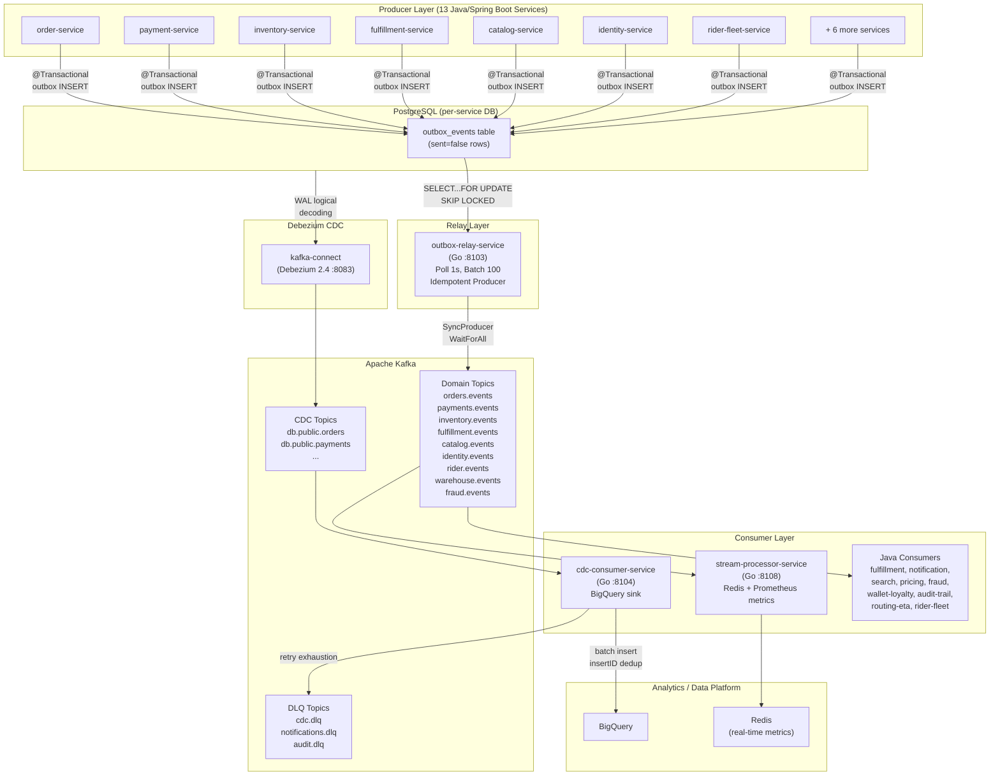
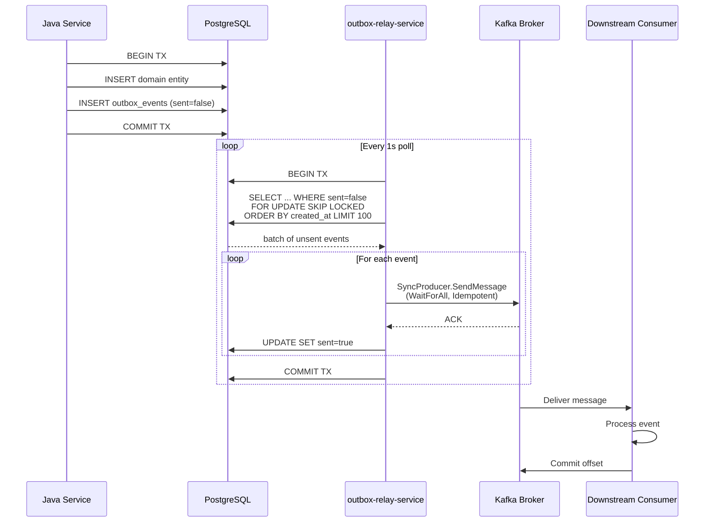
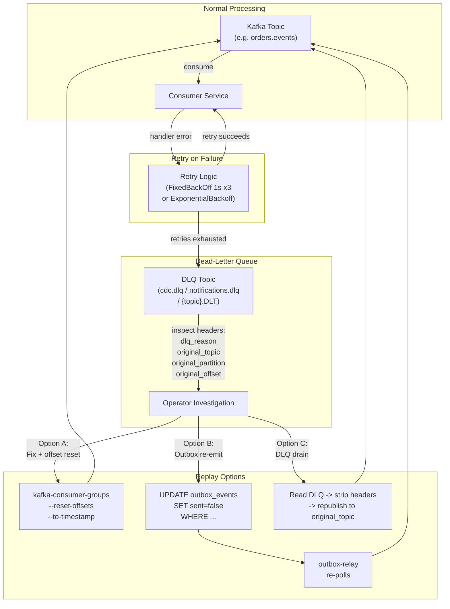
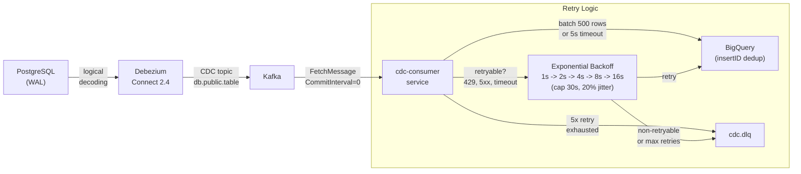

# Eventing, Outbox & Replay -- Low-Level Design

**Scope:** Outbox emission, Debezium CDC, Kafka topics, consumer behaviour,
DLQ, replay, ordering, idempotency, and contract governance across the
InstaCommerce event data plane.

**Services in scope:** `outbox-relay-service` (Go :8103),
`cdc-consumer-service` (Go :8104), `stream-processor-service` (Go :8108),
13 Java/Spring Boot producer services, `services/go-shared/pkg/kafka`,
`contracts/`

**Companion documents:**
- `docs/reviews/iter3/services/event-data-plane.md`
- `docs/reviews/iter3/platform/contracts-event-governance.md`
- `docs/reviews/iter3/platform/data-platform-correctness.md`

**Date:** 2026-03-08
**Status:** Low-level design -- implementation-ready

---

## Table of Contents

1. [Scope and Truth Model](#1-scope-and-truth-model)
2. [Outbox and CDC Lifecycle](#2-outbox-and-cdc-lifecycle)
3. [Topic, Schema, and Envelope Governance](#3-topic-schema-and-envelope-governance)
4. [Consumer Semantics, Retries, and DLQ/Replay Design](#4-consumer-semantics-retries-and-dlqreplay-design)
5. [Ordering, Idempotency, and Dedupe Controls](#5-ordering-idempotency-and-dedupe-controls)
6. [Failure Modes and Incident Playbooks](#6-failure-modes-and-incident-playbooks)
7. [Observability and Release Controls](#7-observability-and-release-controls)
8. [Diagrams](#8-diagrams)
9. [Implementation Guidance and Sequencing](#9-implementation-guidance-and-sequencing)

---

## 1. Scope and Truth Model

### 1.1 Authoritative state ownership

InstaCommerce follows a **database-is-truth, Kafka-is-projection** model.
No service publishes directly to Kafka from business logic. Every domain
state change is first written to a relational `outbox_events` row inside
the same database transaction that mutates the domain aggregate.

```
 Domain mutation  -->  outbox_events INSERT  (same PostgreSQL TX)
                           |
                           v
                   outbox-relay-service polls (1s)
                           |
                           v
                   Kafka topic (async projection)
```

**Invariant:** If the business transaction rolls back, the outbox row is
never written. If the transaction commits, the outbox row is durable and
the relay will eventually publish it.

### 1.2 Two parallel data paths

| Path | Source | Sink | Owner | Purpose |
|------|--------|------|-------|---------|
| **Outbox relay** (primary) | `outbox_events` table (poll) | Domain Kafka topics (`orders.events`, etc.) | Platform | Authoritative domain events for service-to-service consumption |
| **Debezium CDC** (secondary) | PostgreSQL WAL (logical decoding) | CDC Kafka topics (`db.public.table`) | Data Platform | Raw table change capture for BigQuery analytics |

Both paths run in parallel. The outbox relay is the authoritative event
publisher for downstream services; Debezium CDC is the authoritative
data pipeline for the analytics warehouse.

### 1.3 Services and ports

| Service | Language | Port | Role |
|---------|----------|------|------|
| outbox-relay-service | Go | 8103 | Polls outbox tables, produces to Kafka |
| cdc-consumer-service | Go | 8104 | Consumes Debezium CDC topics, sinks to BigQuery |
| stream-processor-service | Go | 8108 | Consumes domain events, computes real-time metrics |
| 13 Java/Spring Boot services | Java | various | Write outbox rows in business transactions |
| kafka-connect (Debezium 2.4) | JVM | 8083 | WAL-based CDC from PostgreSQL to Kafka |

---

## 2. Outbox and CDC Lifecycle

### 2.1 Outbox table schema (canonical)

All 13 Java producer services share this schema with minor column-width
variations:

```sql
CREATE TABLE outbox_events (
    id             UUID PRIMARY KEY DEFAULT gen_random_uuid(),
    aggregate_type VARCHAR(50)  NOT NULL,
    aggregate_id   VARCHAR(255) NOT NULL,
    event_type     VARCHAR(50)  NOT NULL,
    payload        JSONB        NOT NULL,
    created_at     TIMESTAMPTZ  NOT NULL DEFAULT now(),
    sent           BOOLEAN      NOT NULL DEFAULT false
);
-- Recommended index (inventory-service pattern; aligned with relay ORDER BY):
CREATE INDEX idx_outbox_events_unsent
    ON outbox_events (created_at) WHERE sent = false;
```

**Known inconsistency:** Most services index on `(sent) WHERE sent = false`,
but the relay queries `ORDER BY created_at`. The `(created_at) WHERE
sent = false` partial index is better aligned with the actual query plan.

### 2.2 Java producer write path

```java
// services/order-service/.../service/OutboxService.java
@Service
public class OutboxService {
    @Transactional(propagation = Propagation.MANDATORY)
    public void publish(String aggregateType, String aggregateId,
                        String eventType, Object payload) {
        OutboxEvent evt = new OutboxEvent();
        evt.setAggregateType(aggregateType);
        evt.setAggregateId(aggregateId);
        evt.setEventType(eventType);
        evt.setPayload(objectMapper.writeValueAsString(payload));
        outboxEventRepository.save(evt);
    }
}
```

`Propagation.MANDATORY` is the critical invariant: the publish call must
join the caller's existing transaction. If no transaction is active,
Spring throws `IllegalTransactionStateException`, preventing silent
event loss.

**Caller pattern:**

```java
@Transactional
public void createOrder(CreateOrderRequest req) {
    Order saved = orderRepository.save(order);
    outboxService.publish("Order", saved.getId().toString(),
        "OrderPlaced", Map.of(
            "orderId", saved.getId(),
            "userId",  saved.getUserId(),
            "totalCents", saved.getTotalCents()));
    // Both or neither commit
}
```

### 2.3 Go relay poll loop

```
outbox-relay-service/main.go -- relayBatch (simplified)

1. BEGIN transaction
2. SELECT id, aggregate_type, aggregate_id, event_type, payload, created_at
   FROM outbox_events
   WHERE sent = false
   ORDER BY created_at
   LIMIT $batch_size                   -- default 100
   FOR UPDATE SKIP LOCKED              -- concurrent relay instances safe
3. For each row:
   a. Resolve Kafka topic from aggregate_type (e.g. "Order" -> "orders.events")
   b. Build EventEnvelope (id, eventId, eventType, aggregateType,
      aggregateId, eventTime, schemaVersion, payload)
   c. Set Kafka headers: event_id, event_type, aggregate_type, schema_version
   d. SyncProducer.SendMessage (blocks until broker ACK)
   e. UPDATE outbox_events SET sent = true WHERE id = $id
   f. On produce error: break loop, fall through to COMMIT
4. COMMIT transaction (partial progress committed)
```

**Producer configuration:**

| Setting | Value | Rationale |
|---------|-------|-----------|
| `RequiredAcks` | `WaitForAll` | All ISR must acknowledge |
| `Idempotent` | `true` | PID + sequence dedup at broker (session-scoped) |
| `MaxOpenRequests` | `1` | Required for idempotent producer |
| `Retry.Max` | `10` | Transient broker failures |

**`FOR UPDATE SKIP LOCKED`** enables safe concurrent relay instances:
each instance locks a distinct batch of rows without contention.

### 2.4 Aggregate-to-topic routing

```
outbox-relay-service/main.go -- resolveKafkaTopic

Order       -> orders.events
Payment     -> payments.events
Inventory   -> inventory.events
Fulfillment -> fulfillment.events
Catalog     -> catalog.events
Identity    -> identity.events
Rider       -> rider.events
Warehouse   -> warehouse.events
Pricing     -> pricing.events
Wallet      -> wallet.events
Fraud       -> fraud.events
```

If `OUTBOX_TOPIC` env var is set, all events route to that single topic
(override mode for testing or migration).

### 2.5 Outbox cleanup (ShedLock-guarded)

Only `order-service` has an outbox cleanup job today:

```java
// order-service/.../service/OutboxCleanupJob.java
@Scheduled(cron = "0 0 3 * * *")          // 3 AM daily
@SchedulerLock(name = "order-outbox-cleanup",
               lockAtMostFor = "30m", lockAtLeastFor = "5m")
@Transactional
public void cleanupSentEvents() {
    Instant cutoff = Instant.now().minus(30, ChronoUnit.DAYS);
    int deleted = outboxEventRepository.deleteSentEventsBefore(cutoff);
}
```

**Gap:** 12 of 13 producer services have no cleanup. Sent rows
accumulate indefinitely, causing table bloat, slower queries, and longer
pg_dump times.

### 2.6 Debezium CDC path

```
PostgreSQL WAL  -->  Debezium Connect (2.4)  -->  Kafka CDC topics
                                                       |
                                                       v
                                              cdc-consumer-service
                                                       |
                                           +-----------+-----------+
                                           v                       v
                                       BigQuery                 cdc.dlq
```

**Debezium topics:** `{database}.public.{tablename}` (e.g.,
`orders_db.public.orders`)

**CDC consumer batch flow:**
1. FetchMessage from Kafka (manual commit, `CommitInterval: 0`)
2. Extract tracing context from headers
3. Transform Debezium envelope (parse op, ts_ms, before, after)
4. Enqueue to batch channel
5. On batch full (>=500 rows) or timeout (5s): flush to BigQuery
6. BigQuery dedup via `insertID = topic-partition-offset`
7. On retry exhaustion (5x exponential backoff, 1s-30s): send to DLQ
8. Commit offsets after flush or DLQ write

---

## 3. Topic, Schema, and Envelope Governance

### 3.1 Topic inventory

| Topic | Producer | Key Consumers | Partition Key |
|-------|----------|---------------|---------------|
| `orders.events` | outbox-relay (Order) | fulfillment, notification, wallet-loyalty, fraud-detection, audit-trail, stream-processor | `aggregateId` (orderId) |
| `payments.events` | outbox-relay (Payment) | notification, wallet-loyalty, fraud-detection, audit-trail, stream-processor | `aggregateId` (paymentId) |
| `inventory.events` | outbox-relay (Inventory) | cart, pricing, audit-trail, stream-processor | `aggregateId` |
| `fulfillment.events` | outbox-relay (Fulfillment) | notification, rider-fleet, audit-trail | `aggregateId` |
| `catalog.events` | outbox-relay (Catalog) | search, pricing, audit-trail | `aggregateId` |
| `identity.events` | outbox-relay (Identity) | order (erasure), fulfillment (erasure), notification, audit-trail | `aggregateId` (userId) |
| `rider.events` | outbox-relay (Rider) | routing-eta, audit-trail, stream-processor | `aggregateId` |
| `warehouse.events` | outbox-relay (Warehouse) | audit-trail | `aggregateId` |
| `fraud.events` | outbox-relay (Fraud) | audit-trail | `aggregateId` |
| `rider.location.updates` | location-ingestion-service | stream-processor | riderId |
| `cdc.dlq` | cdc-consumer-service | operators (replay) | original key |
| `notifications.dlq` | notification-service | operators | eventId |
| `audit.dlq` | audit-trail-service | operators | eventId |

**Known issue -- singular/plural topic drift:** Several consumers
(fraud-detection, wallet-loyalty, stream-processor) subscribe to both
`order.events` AND `orders.events` as a compensating control. This
doubles consumer group complexity and masks routing misconfigurations.

### 3.2 Consumer group mapping

| Service | Consumer Group | Topics |
|---------|---------------|--------|
| fulfillment-service | `fulfillment-service` | `orders.events` |
| fulfillment-service | `fulfillment-service-erasure` | `identity.events` |
| notification-service | `notification-service` | identity, fulfillment, payments, orders (concurrency=3) |
| search-service | `search-service` | `catalog.events` |
| pricing-service | `pricing-service-catalog` | `catalog.events` |
| audit-trail-service | `audit-trail-service` | 7 domain topics (concurrency=3) |
| fraud-detection-service | `fraud-detection-payments` | payments.events, payment.events |
| fraud-detection-service | `fraud-detection-orders` | orders.events, order.events |
| wallet-loyalty-service | `wallet-loyalty-service` | orders + payments (both singular/plural) |
| rider-fleet-service | `rider-fleet-service` | `fulfillment.events` |
| routing-eta-service | `routing-eta-service` | `rider.events`, `rider.location.updates` |
| order-service | `order-service-erasure` | `identity.events` |
| stream-processor | `stream-processor` | orders, payments, inventory, rider (both singular/plural) |
| cdc-consumer-service | `cdc-consumer-service` | Debezium CDC topics |

### 3.3 Event envelope (canonical)

The outbox-relay-service builds this envelope for every event:

```json
{
  "id":            "550e8400-e29b-41d4-a716-446655440000",
  "eventId":       "550e8400-e29b-41d4-a716-446655440000",
  "eventType":     "OrderPlaced",
  "aggregateType": "Order",
  "aggregateId":   "order-12345",
  "eventTime":     "2024-01-15T10:30:00.000000000Z",
  "schemaVersion": "v1",
  "payload":       { "orderId": "...", "userId": "...", "totalCents": 4990 }
}
```

**Kafka headers** (set by relay):

| Header | Value | Purpose |
|--------|-------|---------|
| `event_id` | UUID | Infrastructure dedup |
| `event_type` | String | Routing, filtering |
| `aggregate_type` | String | Log aggregation |
| `schema_version` | `v1` | Version discrimination |

**Envelope body is the authoritative contract.** Headers are for
infrastructure/observability only.

### 3.4 Known envelope gaps

| Gap | Status | Impact |
|-----|--------|--------|
| `source_service` absent from body | P0 | Audit, GDPR erasure, tracing rely on reverse-engineering from topic name |
| `correlation_id` absent from body | P0 | No distributed trace continuity across async boundary |
| Both `id` and `eventId` emitted (redundant) | P1 | Consumer confusion on canonical ID field |
| `schema_version` hardcoded to `"v1"` | P1 | Silent version mismatch when v2 schemas deploy |
| Payload fields hoisted to top-level envelope | P1 | Two divergent consumer deserialization patterns |

### 3.5 Schema versioning rules

Event schemas live in `contracts/src/main/resources/schemas/` as JSON
Schema (draft-07) files with version-encoded filenames (e.g.,
`OrderPlaced.v1.json`).

| Change class | Examples | Compatibility window |
|---|---|---|
| C0 -- Additive | Add optional field, new event type | None (backward-compatible) |
| C1 -- New required field | Add required field to existing event | 14 days dual-publish |
| C2 -- Rename/remove field | Rename `totalCents` -> `totalAmountMinor` | 90 days, new vN file |
| C3 -- New schema version | `OrderPlaced.v2.json` (breaking shape) | 90 days, v1+v2 live |
| C4 -- Topic rename | `orders.events` -> `order-lifecycle.events` | 90 days dual-publish |
| C5 -- Envelope change | Add/remove top-level envelope field | 180 days |

**CI enforcement gap:** `./gradlew :contracts:build` validates JSON
Schema syntax but does NOT detect breaking changes against the base
branch. No `buf breaking` for protos. No consumer contract tests.

---

## 4. Consumer Semantics, Retries, and DLQ/Replay Design

### 4.1 Consumer semantics by service layer

| Service | Commit Mode | Offset Reset | Delivery Guarantee |
|---------|-------------|--------------|-------------------|
| Java domain consumers (`@KafkaListener`) | Auto (Spring default) | `earliest` | At-least-once |
| cdc-consumer-service | Manual (`CommitInterval: 0`) | `LastOffset` | At-least-once (DLQ-safe) |
| stream-processor-service | Async (`CommitInterval: 1s`) | `LastOffset` | Best-effort at-least-once |
| go-shared consumer | Async (`CommitInterval: 1s`) | `LastOffset` | At-least-once |

**All Java services use `auto-offset-reset: earliest`**, meaning a new
consumer group or lost offset replays all historical events from
partition start.

### 4.2 Java consumer error handling patterns

**search-service** (most explicit DLQ config):

```java
// search-service/.../config/KafkaConfig.java
factory.setCommonErrorHandler(new DefaultErrorHandler(
    new DeadLetterPublishingRecoverer(kafkaTemplate),
    new FixedBackOff(1000L, 3)     // 1s delay, 3 retries -> DLT topic
));
```

Spring's `DeadLetterPublishingRecoverer` writes to `{topic}.DLT` after
retry exhaustion.

**notification-service** (custom DLQ publisher):

```java
// notification-service/.../retry/NotificationDlqPublisher.java
public void publish(NotificationRequest request, String reason) {
    // Writes to notifications.dlq with masked recipient + failure reason
}
```

### 4.3 DLQ inventory

| DLQ Topic | Producer | Trigger | Retention | Headers |
|-----------|----------|---------|-----------|---------|
| `cdc.dlq` | cdc-consumer-service | BQ insert failure after 5 retries | 30 days | `dlq_reason`, `original_topic`, `original_partition`, `original_offset`, `trace_id` |
| `notifications.dlq` | notification-service | Notification send failure | 30 days | `eventId`, `eventType`, `channel`, `reason` |
| `audit.dlq` | audit-trail-service | Audit write failure | 30 days | Standard |
| `{topic}.DLT` | search-service (Spring) | Consumer handler failure after 3 retries | Default | Spring DLT headers |

**Gap -- no relay DLQ:** `outbox-relay-service` has no DLQ. A persistent
produce error stalls the entire outbox for that aggregate type. The relay
retries the same failing event every 1s indefinitely.

**Gap -- no stream-processor DLQ:** Failed events are logged and
silently dropped after the next successful message commits the offset.

### 4.4 Retry strategies

| Service | Strategy | Base | Max | Cap | Jitter |
|---------|----------|------|-----|-----|--------|
| cdc-consumer BQ insert | Exponential backoff | 1s | 5 retries | 30s | 20% |
| search-service consumer | Fixed backoff | 1s | 3 retries | N/A | None |
| notification-service | Application-level | Configurable | Configurable | N/A | N/A |
| outbox-relay produce | Linear (1s poll) | 1s | Infinite | None | None |

### 4.5 Replay design

**Current state:** No dedicated replay endpoint or tool exists. Replay
is manual:

1. **Consumer group offset reset** (Kafka CLI):
   ```
   kafka-consumer-groups --bootstrap-server kafka:9092 \
     --group search-service \
     --reset-offsets --to-earliest --topic catalog.events --execute
   ```

2. **Outbox re-publication** (DB intervention):
   ```sql
   UPDATE outbox_events SET sent = false
   WHERE aggregate_type = 'Order'
     AND created_at BETWEEN '2024-01-15' AND '2024-01-16';
   ```
   The relay will re-poll and re-publish these events.

3. **DLQ replay** (for cdc.dlq):
   Inspect `original_topic`, `original_partition`, `original_offset`
   headers, then seek to the exact source position and reprocess.

**Recommended replay architecture:**

```
Replay trigger (operator/API)
    |
    v
Replay Controller (new component or admin endpoint)
    |
    +-- Option A: Reset consumer group offsets via Kafka AdminClient
    |   (for consumer-side replay)
    |
    +-- Option B: UPDATE outbox_events SET sent = false WHERE ...
    |   (for producer-side re-emission)
    |
    +-- Option C: Read from DLQ topic, re-publish to source topic
        (for DLQ drain)
```

---

## 5. Ordering, Idempotency, and Dedupe Controls

### 5.1 Ordering guarantees

| Layer | Guarantee | Mechanism |
|-------|-----------|-----------|
| Outbox write | Causal order per transaction | PostgreSQL serialisable within TX |
| Outbox relay poll | `ORDER BY created_at` | Preserves write order within single relay batch |
| Kafka topic | Per-partition order | Relay uses `aggregateId` as message key -> same aggregate always in same partition |
| Consumer | Per-partition order | Single-threaded per partition (except concurrency=3 services) |

**Ordering risk with concurrency=3:** notification-service and
audit-trail-service use `concurrency="3"` on `@KafkaListener`. With 3
concurrent consumer threads, messages from different partitions are
processed in parallel, but messages within the same partition remain
ordered. If a topic has fewer partitions than concurrency threads, some
threads idle (safe). If the topic has more, ordering across aggregates is
maintained because the same aggregate always maps to the same partition.

**Cross-aggregate ordering is NOT guaranteed** and should not be relied
upon. Event consumers must be designed for out-of-order delivery across
different aggregates.

### 5.2 Idempotency controls

| Layer | Mechanism | Scope | Gap |
|-------|-----------|-------|-----|
| Kafka producer (relay) | Idempotent producer (PID + sequence) | Per-session only | Resets on restart; cross-session duplicates possible |
| BigQuery (CDC consumer) | `insertID = topic-partition-offset` | ~1 minute dedup window | Replays after 1 min may create duplicates |
| Stream-processor Redis | `INCR` / `INCRBY` | **Not idempotent** | Redelivery double-counts |
| Java domain consumers | **None enforced** | N/A | No `event_id` dedup at platform level |

### 5.3 Deduplication recommendations

**Platform-level dedup for Java consumers (recommended pattern):**

```java
@Component
public class EventIdempotencyFilter {
    private final RedisTemplate<String, String> redis;
    private static final Duration TTL = Duration.ofHours(24);

    public boolean isDuplicate(String eventId) {
        Boolean wasAbsent = redis.opsForValue()
            .setIfAbsent("evt:" + eventId, "1", TTL);
        return !Boolean.TRUE.equals(wasAbsent);
    }
}
```

**Stream-processor dedup via Redis Lua script:**

```lua
-- Idempotent INCR: only increment if event not seen
local seen = redis.call('SETNX', KEYS[1], 1)
if seen == 1 then
    redis.call('EXPIRE', KEYS[1], 7200)   -- 2h TTL
    redis.call('INCR', KEYS[2])
    return 1
end
return 0
```

**Go-shared consumer dedup (recommended addition):**

Add `event_id` dedup to `services/go-shared/pkg/kafka/consumer.go` using
Redis SETNX with configurable TTL, applied as middleware before the
`MessageHandler` callback.

---

## 6. Failure Modes and Incident Playbooks

### 6.1 Failure mode catalogue

| # | Failure | Detection | Impact | Recovery |
|---|---------|-----------|--------|----------|
| F1 | Kafka broker down | `outbox.relay.failures` rate > 0 | Outbox lag grows; no events published | Auto-recovery on broker restore; relay retries every 1s |
| F2 | Relay DB connection lost | Relay health check fails, pod restart | Outbox lag grows | Kubernetes restarts pod; relay reconnects |
| F3 | Relay produce error (persistent, e.g., invalid topic) | `outbox.relay.failures` growing, same event_id in logs | Entire outbox stalled on one bad event | **Manual:** skip event via `UPDATE sent=true` or add relay DLQ |
| F4 | Outbox table bloat | Slow query logs, `pg_stat_user_tables` dead tuple count | Relay poll latency increases | Run cleanup: `DELETE FROM outbox_events WHERE sent=true AND created_at < cutoff` |
| F5 | CDC consumer BigQuery failure | `cdc_dlq_total` counter grows | Events land in DLQ, not BigQuery | Replay from DLQ after BQ recovery |
| F6 | Consumer group rebalance storm | Kafka consumer lag spikes across all partitions | Processing pauses during rebalance | Tune `max.poll.interval.ms`, `session.timeout.ms` |
| F7 | Schema mismatch (v2 payload with v1 header) | Consumer deserialization errors | Events processed with wrong schema | Fix `schema_version` in outbox_events; redeploy relay |
| F8 | Duplicate events from relay restart | No immediate detection (no dedup) | Double-counted metrics, duplicate side effects | Add consumer-side `event_id` dedup |
| F9 | Stream-processor cold start with `LastOffset` | Metric gap after pod restart | Missing events between last commit and restart | Change to `FirstOffset` or document as known limitation |
| F10 | DLQ topic full / not created | DLQ produce error logged | Failed events lost permanently | Pre-create DLQ topics with adequate retention |

### 6.2 Incident playbooks

**Playbook: Outbox lag exceeding SLA (>10s P99)**

```
1. Check outbox.relay.lag.seconds metric in Grafana
2. Check outbox.relay.failures -- if non-zero, a produce error is blocking
3. Identify stuck event:
   SELECT id, aggregate_type, event_type, created_at
   FROM outbox_events WHERE sent = false ORDER BY created_at LIMIT 5;
4. If event is malformed/stuck:
   UPDATE outbox_events SET sent = true WHERE id = '<stuck-id>';
   -- Optionally re-queue via DLQ for manual investigation
5. If Kafka broker is down:
   Check kafka broker health, wait for auto-recovery
   Monitor relay.failures rate for recovery signal
6. Verify recovery: outbox.relay.lag.seconds returns to <5s
```

**Playbook: CDC DLQ growing**

```
1. Check cdc_dlq_total rate in Prometheus
2. Consume sample messages from cdc.dlq:
   kafka-console-consumer --bootstrap-server kafka:9092 \
     --topic cdc.dlq --from-beginning --max-messages 5 \
     --property print.headers=true
3. Inspect dlq_reason header for root cause:
   - "BigQuery 400" -> schema mismatch, fix BQ table schema
   - "BigQuery 429" -> rate limit, increase BQ quota
   - "BigQuery 5xx" -> transient, events will auto-recover on replay
4. After root cause resolved, replay DLQ:
   - Read from cdc.dlq, strip DLQ headers, republish to original_topic
   - Or: re-process directly into BigQuery using batch loader
5. Verify: cdc_dlq_total rate returns to 0
```

**Playbook: Consumer processing duplicate events**

```
1. Identify duplicate event_ids in downstream state
2. Check outbox.relay.failures for relay restart scenario
3. Short-term: manually deduplicate downstream state
4. Long-term: deploy EventIdempotencyFilter to affected consumer
5. For BigQuery: add DEDUP view or use MERGE for replay operations
```

---

## 7. Observability and Release Controls

### 7.1 Metrics inventory

| Metric | Type | Service | Alert Threshold |
|--------|------|---------|-----------------|
| `outbox.relay.count` | Counter | outbox-relay | N/A (throughput) |
| `outbox.relay.failures` | Counter | outbox-relay | rate > 0 for 2m -> Alert |
| `outbox.relay.lag.seconds` | Histogram | outbox-relay | P99 > 10s for 5m -> Page |
| `cdc_consumer_lag` | Gauge | cdc-consumer | > 5000 for 10m -> Alert |
| `cdc_dlq_total` | Counter | cdc-consumer | rate > 1/min -> Alert |
| `cdc_batch_latency_seconds` | Histogram | cdc-consumer | P99 > 10s -> Alert |
| `kafka_consumer_records_lag_max` | Gauge | All consumers | > 1000 for 10m -> Warning |
| `order_processing_errors_total` | Counter | stream-processor | rate > 5/min -> Alert |
| `payment_processing_errors_total` | Counter | stream-processor | rate > 5/min -> Page |
| `sla_alerts_total` | Counter | stream-processor | rate > 0 -> Alert |
| `inventory_cascade_alerts_total` | Counter | stream-processor | rate > 0 -> Page |

### 7.2 Health endpoints

| Endpoint | outbox-relay | cdc-consumer | stream-processor |
|----------|-------------|--------------|-----------------|
| `/health` | OK | OK | OK |
| `/health/live` | OK | OK | **Missing** |
| `/health/ready` | Checks DB + Kafka | Checks readiness flag | **Missing** |
| `/metrics` | **Missing** (OTLP only) | Prometheus | Prometheus |

**Gaps:**
- outbox-relay has no `/metrics` Prometheus endpoint (breaks PodMonitor)
- stream-processor has no liveness/readiness probes (K8s considers it
  ready immediately, before Kafka connection)

### 7.3 Tracing

All Go services are configured with OpenTelemetry:
- Exporter: `OTEL_EXPORTER_OTLP_ENDPOINT` (HTTP, default port 4318)
- cdc-consumer-service extracts trace context from Kafka message headers
- outbox-relay-service sets trace headers on produced messages

Java services use Spring Boot Actuator + Micrometer + OTEL auto-instrumentation.

### 7.4 Alert rules (prometheus-rules.yaml)

```yaml
groups:
  - name: instacommerce-slos
    rules:
      - alert: KafkaConsumerLag
        expr: kafka_consumer_records_lag_max > 1000
        for: 10m
        labels:
          severity: warning
        annotations:
          summary: "Kafka consumer lag exceeds 1000 records"
```

**Severity routing:**
- critical -> PagerDuty + Slack #incidents (<15 min response)
- warning  -> Slack #alerts (<1 hour response)

### 7.5 Release controls

No event-emission feature flags exist today. Recommended controls:

| Control | Mechanism | Scope |
|---------|-----------|-------|
| Consumer pause | Set consumer group to inactive via Kafka AdminClient | Per-consumer-group |
| Producer circuit breaker | `@ConditionalOnProperty` on OutboxService | Per-service |
| Topic routing override | `OUTBOX_TOPIC` env var | Per-relay instance |
| Replay gate | Feature flag gating replay controller | Platform-wide |

---

## 8. Diagrams

### 8.1 Component topology



### 8.2 Outbox publish flow (sequence)



### 8.3 DLQ and replay flow



### 8.4 CDC to BigQuery flow



---

## 9. Implementation Guidance and Sequencing

### 9.1 Priority matrix

| Priority | Item | Effort | Risk Addressed |
|----------|------|--------|----------------|
| P0-1 | Add relay DLQ (`outbox.relay.dlq`) | 2 days | Outbox stall on persistent produce error (F3) |
| P0-2 | Add `source_service` + `correlation_id` to outbox table and envelope | 3 days | Traceability gap, GDPR compliance |
| P0-3 | Fix `schema_version` hardcoding (read from outbox row) | 1 day | Silent version mismatch |
| P0-4 | Consolidate topic naming (canonical plural only) | 2 weeks | Dual-subscription complexity |
| P1-1 | Add outbox cleanup to 12 remaining services | 2 days | Table bloat (F4) |
| P1-2 | Add consumer `event_id` dedup (Redis SETNX) | 3 days | Duplicate processing (F8) |
| P1-3 | Add stream-processor idempotent INCR | 2 days | Double-counted metrics |
| P1-4 | Fix stream-processor `StartOffset: LastOffset` | 1 day | Cold-start event loss (F9) |
| P1-5 | Add `/metrics` to outbox-relay, `/health/ready` to stream-processor | 1 day | Observability gaps |
| P2-1 | Add CI breaking-change detection (`buf breaking` + JSON Schema diff) | 3 days | Silent schema breakage |
| P2-2 | Build replay controller (admin API or CLI) | 1 week | Manual replay burden |
| P2-3 | Add consumer contract tests | 1 week | Deserialization drift |
| P3-1 | Evaluate Debezium Outbox Event Router as relay replacement | 2 weeks | Latency, exactly-once |

### 9.2 Phase 1: Harden current relay (Month 1)

**Outbox relay DLQ:**

```go
// outbox-relay-service -- add DLQ writer
dlqWriter := &kafka.Writer{
    Addr:         kafka.TCP(cfg.KafkaBrokers...),
    Topic:        "outbox.relay.dlq",
    RequiredAcks: kafka.RequireAll,
    Async:        false,
}

// In relayBatch, on produce error:
if _, _, err := s.producer.SendMessage(message); err != nil {
    dlqWriter.WriteMessages(ctx, kafka.Message{
        Key:   []byte(evt.ID),
        Value: value,
        Headers: []kafka.Header{
            {Key: "relay_error", Value: []byte(err.Error())},
            {Key: "event_type", Value: []byte(evt.EventType)},
            {Key: "aggregate_type", Value: []byte(evt.AggregateType)},
        },
    })
    // Mark sent=true to prevent infinite retry; DLQ handles replay
}
```

**Outbox table migration (all 13 services):**

```sql
ALTER TABLE outbox_events
    ADD COLUMN source_service  TEXT NOT NULL DEFAULT 'unknown',
    ADD COLUMN correlation_id  TEXT,
    ADD COLUMN schema_version  VARCHAR(10) NOT NULL DEFAULT 'v1';
```

**Outbox cleanup (shared pattern for 12 services):**

```java
@Scheduled(cron = "0 0 */4 * * *")  // every 4 hours
@SchedulerLock(name = "${spring.application.name}-outbox-cleanup",
               lockAtMostFor = "PT10M")
@Transactional
public void cleanup() {
    Instant cutoff = Instant.now().minus(Duration.ofDays(7));
    int deleted = outboxEventRepository.deleteSentEventsBefore(cutoff);
    log.info("outbox cleanup deleted {} events", deleted);
}
```

### 9.3 Phase 2: Consumer hardening (Month 2)

1. Deploy `EventIdempotencyFilter` (Redis SETNX) to all Java consumers
2. Add Redis dedup Lua script to stream-processor for financial counters
3. Change stream-processor `StartOffset` from `LastOffset` to `FirstOffset`
4. Add `/health/ready` and `/health/live` to stream-processor
5. Add `/metrics` (Prometheus) endpoint to outbox-relay-service
6. Begin topic naming consolidation (migrate producers to canonical plural)

### 9.4 Phase 3: Contract governance (Month 3)

1. Add `buf breaking` CI job for proto backward-compatibility
2. Add JSON Schema compatibility diff script to CI
3. Add consumer contract tests to fulfillment, notification, fraud, wallet
4. Add `CODEOWNERS` for `contracts/` directory tree
5. Remove payload field hoisting from relay `buildEventMessage`
6. Tighten `EventEnvelope.v1.json` (`additionalProperties: false`)

### 9.5 Phase 4: Platform evolution (Quarter 2)

1. Evaluate Debezium Outbox Event Router for 2 pilot services
2. Build replay controller (admin API with audit trail)
3. Evaluate Confluent Schema Registry or Apicurio for runtime validation
4. Move financial aggregates from stream-processor to BigQuery materialized view

### 9.6 Configuration reference

**outbox-relay-service:**

| Variable | Default | Notes |
|----------|---------|-------|
| `OUTBOX_POLL_INTERVAL` | `1s` | Reduce to 500ms for sub-second latency |
| `OUTBOX_BATCH_SIZE` | `100` | Increase to 500 for high-throughput |
| `OUTBOX_TABLE` | `outbox_events` | |
| `OUTBOX_TOPIC` | *(empty)* | Override: routes all to single topic |
| `KAFKA_BROKERS` | *required* | |
| `SHUTDOWN_TIMEOUT` | `20s` | |

**cdc-consumer-service:**

| Variable | Default | Notes |
|----------|---------|-------|
| `KAFKA_TOPICS` | *required* | Comma-separated CDC topics |
| `KAFKA_GROUP_ID` | `cdc-consumer-service` | |
| `KAFKA_DLQ_TOPIC` | `cdc.dlq` | Ensure topic pre-created with replication >= 3 |
| `BQ_BATCH_SIZE` | `500` | Larger = fewer BQ API calls |
| `BQ_BATCH_TIMEOUT` | `5s` | Max wait before flushing partial batch |
| `BQ_MAX_RETRIES` | `5` | |

**stream-processor-service:**

| Variable | Default | Notes |
|----------|---------|-------|
| `KAFKA_BROKERS` | `localhost:9092` | |
| `CONSUMER_GROUP_ID` | `stream-processor` | |
| `REDIS_ADDR` | `localhost:6379` | |
| `HTTP_PORT` | `8108` | |

---

## Appendix A: Event Schema Samples

**OrderPlaced.v1.json** (abridged):
```json
{
  "title": "OrderPlaced",
  "required": ["orderId", "userId", "items", "totalCents", "currency", "placedAt"],
  "properties": {
    "orderId":      { "type": "string", "format": "uuid" },
    "userId":       { "type": "string", "format": "uuid" },
    "storeId":      { "type": "string" },
    "items":        { "type": "array" },
    "totalCents":   { "type": "integer" },
    "currency":     { "type": "string" },
    "placedAt":     { "type": "string", "format": "date-time" }
  }
}
```

**Domain event types by topic:**

| Topic | Event Types |
|-------|-------------|
| `orders.events` | OrderPlaced, OrderPacked, OrderDispatched, OrderDelivered, OrderCancelled, OrderFailed |
| `payments.events` | PaymentAuthorized, PaymentCaptured, PaymentFailed, PaymentRefunded, PaymentVoided |
| `inventory.events` | StockReserved, StockConfirmed, StockReleased, LowStockAlert |
| `fulfillment.events` | PickTaskCreated, OrderPacked, RiderAssigned, DeliveryCompleted |
| `catalog.events` | ProductCreated, ProductUpdated |
| `identity.events` | UserErased |
| `fraud.events` | FraudDetected |
| `rider.events` | RiderCreated, RiderOnboarded, RiderActivated, RiderAssigned, RiderSuspended |
| `warehouse.events` | StoreCreated, StoreStatusChanged, StoreDeleted |

## Appendix B: BigQuery CDC Row Schema

| Column | Type | Description |
|--------|------|-------------|
| `topic` | STRING | Source Kafka topic |
| `partition` | INTEGER | Kafka partition |
| `offset` | INTEGER | Kafka offset |
| `key` | STRING | Message key |
| `op` | STRING | Debezium operation (c/u/d/r) |
| `ts_ms` | INTEGER | Debezium timestamp (ms) |
| `source` | STRING | Debezium source metadata (JSON) |
| `before` | STRING | Pre-change state (JSON) |
| `after` | STRING | Post-change state (JSON) |
| `payload` | STRING | Full Debezium envelope (JSON) |
| `headers` | STRING | Kafka headers (JSON) |
| `raw` | STRING | Raw message value |
| `kafka_timestamp` | TIMESTAMP | Kafka timestamp |
| `ingested_at` | TIMESTAMP | Ingestion timestamp |
