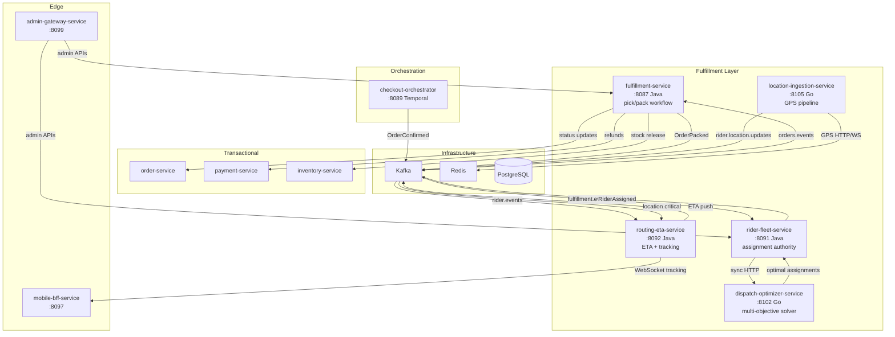
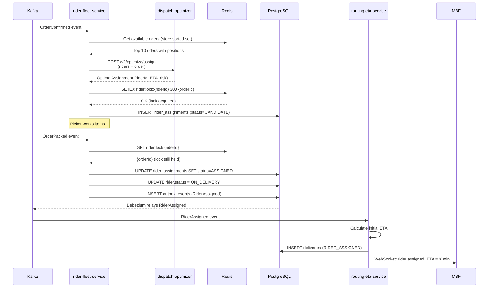
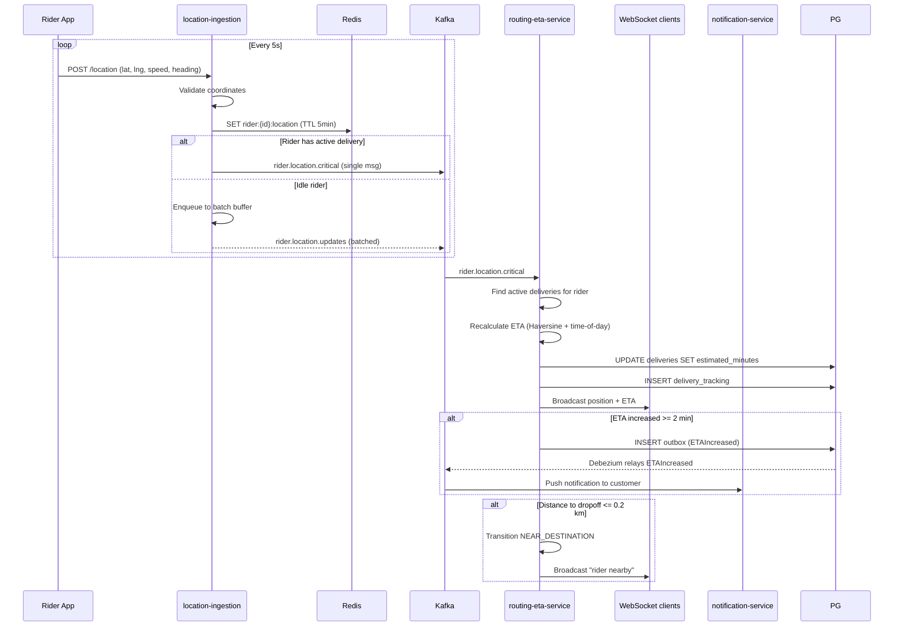
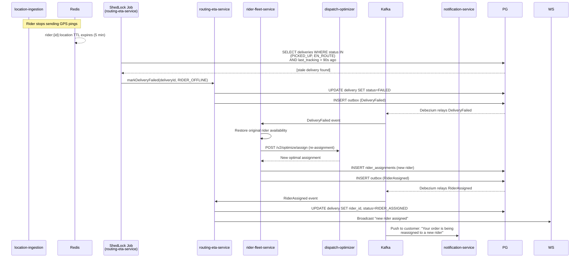
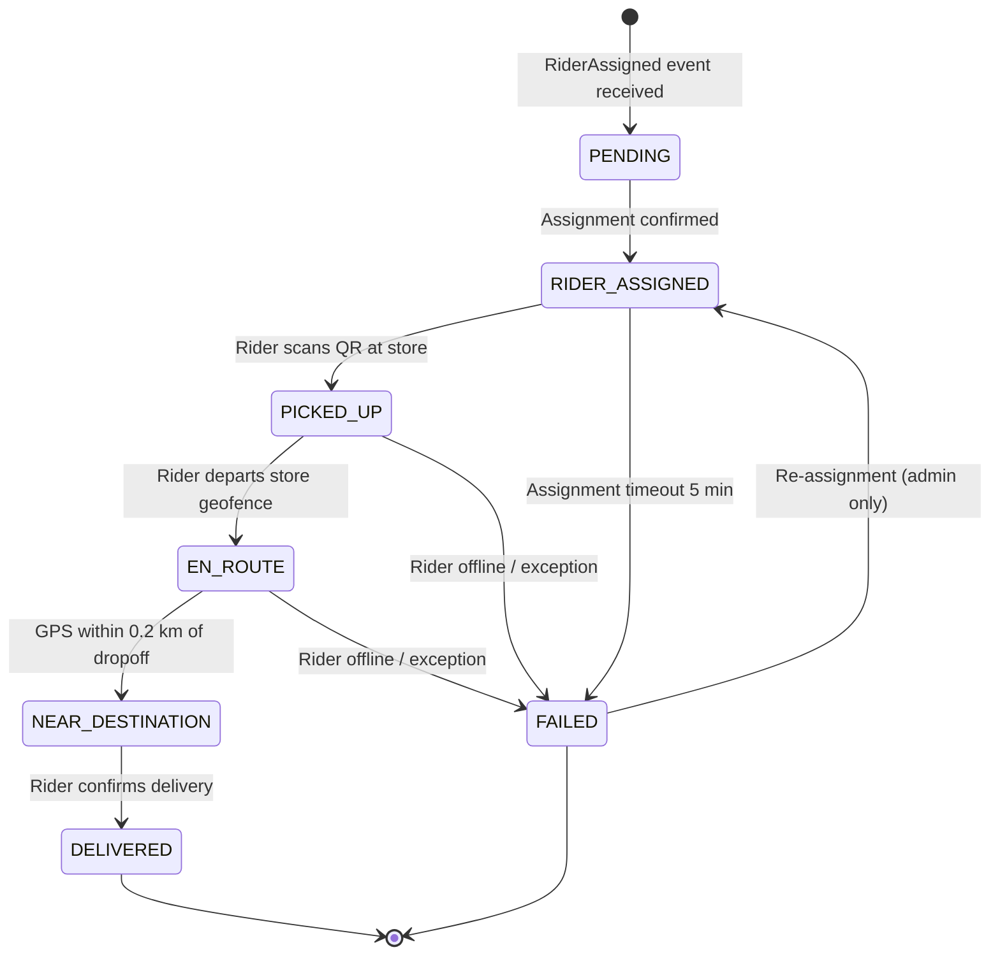
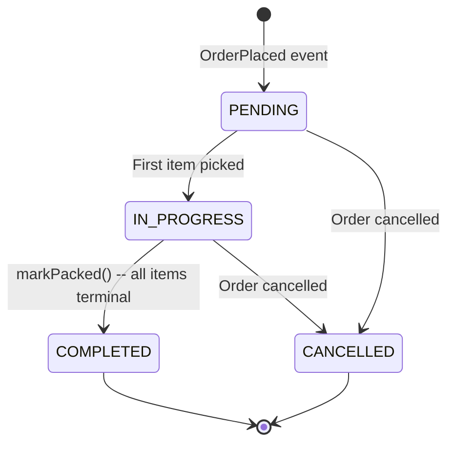

# LLD: Fulfillment, Dispatch & ETA -- Closed-Loop Execution

**Scope:** fulfillment-service . rider-fleet-service . dispatch-optimizer-service . location-ingestion-service . routing-eta-service
**Iteration:** 3 | **Updated:** 2026-03-07
**Source truth:** `services/*/src/main/java`, `services/*/go.mod`, `contracts/`, `docs/reviews/iter3/services/fulfillment-logistics.md`
**Audience:** Staff / Principal Engineers, SRE, CTO

---

## Contents

1. [Scope and SLA-Sensitive Journeys](#1-scope-and-sla-sensitive-journeys)
2. [Dispatch Authority and Assignment Lifecycle](#2-dispatch-authority-and-assignment-lifecycle)
3. [Location/Event Ingestion and ETA Recomputation Loop](#3-locationevent-ingestion-and-eta-recomputation-loop)
4. [Rider State Model and Operational Overrides](#4-rider-state-model-and-operational-overrides)
5. [Failure Modes, Stale-Location Risks, and Manual Fallback](#5-failure-modes-stale-location-risks-and-manual-fallback)
6. [Capacity, Surge, and Policy Interactions](#6-capacity-surge-and-policy-interactions)
7. [Observability, Rollback, and Release Safety](#7-observability-rollback-and-release-safety)
8. [Mermaid Diagrams](#8-mermaid-diagrams)
9. [Concrete Implementation Guidance and Sequencing](#9-concrete-implementation-guidance-and-sequencing)

---

## 1. Scope and SLA-Sensitive Journeys

### 1.1 Service Inventory

| Service | Language | Port | State Ownership | Event Authority |
|---------|----------|------|-----------------|-----------------|
| `fulfillment-service` | Java/Spring Boot | 8087 | `pick_tasks`, `pick_items`, `outbox_events` | `OrderPacked`, `OrderModified` |
| `rider-fleet-service` | Java/Spring Boot | 8091 | `riders`, `rider_availability`, `rider_assignments`, `rider_shifts`, `rider_earnings` | `RiderAssigned`, `RiderReleased` |
| `dispatch-optimizer-service` | Go | 8102 | Stateless (request-scoped) | None -- consulted via sync HTTP |
| `location-ingestion-service` | Go | 8105 | Redis `rider:{riderId}:location` (TTL 5 min) | `rider.location.updates` (Kafka batch) |
| `routing-eta-service` | Java/Spring Boot | 8092 | `deliveries`, `delivery_tracking` (partitioned) | Delivery lifecycle events via outbox |

### 1.2 SLA Segments and Budgets

Every order traverses four time-segments. Breaching any one degrades the <=30-minute door-to-door promise.

| Segment | Start Event | End Event | Budget (India benchmark) | Owner Service |
|---------|-------------|-----------|--------------------------|---------------|
| `confirm_to_pick` | `OrderConfirmed` | First item picked | 4 min | fulfillment-service |
| `pick_to_pack` | First item picked | `OrderPacked` | 3 min | fulfillment-service |
| `pack_to_dispatch` | `OrderPacked` | Rider departs store | 1 min (pre-assign) / 4-7 min (post-assign) | rider-fleet-service |
| `dispatch_to_deliver` | Rider departs store | `OrderDelivered` | 5 min | routing-eta-service |

**Critical insight:** The `pack_to_dispatch` segment is where InstaCommerce loses 3-6 minutes versus Blinkit/Zepto because rider assignment is triggered post-pack (`OrderPacked`) rather than pre-pack (`OrderConfirmed`). Pre-assignment reduces this to ~1 minute by staging riders before pack completes.

### 1.3 End-to-End Data-Flow Summary

```
OrderConfirmed (Kafka: orders.events)
  --> fulfillment-service: create PickTask (PENDING)
  --> [recommended] rider-fleet-service: pre-assign rider (CANDIDATE)

Picker works items --> PickTask IN_PROGRESS

markPacked() --> OrderPacked (Kafka: fulfillment.events)
  --> rider-fleet-service: promote CANDIDATE -> ASSIGNED (or assign fresh)
  --> rider-fleet-service publishes RiderAssigned (Kafka: rider.events)

RiderAssigned
  --> routing-eta-service: create Delivery (RIDER_ASSIGNED), compute initial ETA

GPS pings (HTTP/WS) --> location-ingestion-service
  --> Redis latest position + Kafka rider.location.updates (batch)
  --> [recommended] Kafka rider.location.critical (single-msg, active deliveries)

routing-eta-service consumes location updates:
  --> recalculate ETA, persist delivery_tracking, broadcast via WebSocket
  --> geofence: 0.2 km from dropoff -> NEAR_DESTINATION auto-transition
  --> ETA delta >= 2 min -> publish ETAIncreased for push notification

Rider confirms delivery -> DELIVERED, compute actual_minutes
```

---

## 2. Dispatch Authority and Assignment Lifecycle

### 2.1 Authority Model

`rider-fleet-service` is the **single assignment authority**. It owns rider state, availability, and the `rider_assignments` table. `fulfillment-service` has a legacy `RiderAssignmentService` (FIFO greedy) that must be deprecated in favor of delegating to `rider-fleet-service`.

`dispatch-optimizer-service` is a **stateless advisor** -- called synchronously via HTTP `/v2/optimize/assign` to compute optimal assignments but never mutates state.

### 2.2 Current Assignment Flow (Post-Pack)

```
FulfillmentEventConsumer (rider-fleet-service)
  listens: fulfillment.events
  trigger: event.type == "OrderPacked"
  |
  v
RiderAssignmentService.assignRider(orderId, storeId, pickupLat, pickupLng)
  1. Check duplicate: rider_assignments WHERE order_id = ? (unique constraint)
  2. Find nearest: rider_availability WHERE is_available=true AND store_id=?
     ORDER BY haversine_distance ASC LIMIT 1 FOR UPDATE SKIP LOCKED
  3. Set rider.status = ON_DELIVERY, availability.isAvailable = false
  4. Insert rider_assignments row
  5. Publish outbox: RiderAssigned
```

**Concurrency guard:** `FOR UPDATE SKIP LOCKED` on `rider_availability` prevents two concurrent assignments from claiming the same rider row. The unique constraint on `rider_assignments.order_id` prevents double-assignment for the same order.

### 2.3 Target Assignment Flow (Pre-Assignment + Optimizer)

**Phase 1 -- Pre-assignment on OrderConfirmed:**

```
FulfillmentEventConsumer reacts to BOTH OrderConfirmed AND OrderPacked:

On OrderConfirmed:
  1. Call dispatch-optimizer-service /v2/optimize/assign with available riders
  2. Acquire Redis lock: SETEX rider:lock:{riderId} 300 {orderId}
  3. Insert rider_assignments with status = CANDIDATE
  4. Notify rider app (informational, not committed)

On OrderPacked:
  1. Check if CANDIDATE assignment exists for order
  2. If CANDIDATE rider still available (Redis lock held):
       promote CANDIDATE -> ASSIGNED
  3. If CANDIDATE released/expired:
       run fresh assignment (call optimizer again)
  4. Publish RiderAssigned event

On OrderCancelled:
  1. Release Redis lock
  2. Set rider_assignments.status = RELEASED
  3. Restore rider availability
```

**Phase 2 -- Optimizer integration with circuit breaker:**

```java
@CircuitBreaker(name = "dispatch-optimizer", fallbackMethod = "fallbackToGreedy")
public OptimizerResponse callOptimizer(OptimizerRequest request) {
    return restTemplate.postForObject(
        dispatchOptimizerUrl + "/v2/optimize/assign", request, OptimizerResponse.class);
}

public OptimizerResponse fallbackToGreedy(OptimizerRequest request, Throwable t) {
    // Degrade to nearest-available within 5 km radius
    return greedyFirstAvailableAssignment(request);
}
```

### 2.4 Assignment Status State Machine

```
rider_assignments.status:

  CANDIDATE ----+----> ASSIGNED -----> (terminal, delivery in progress)
                |
                +----> RELEASED       (order cancelled or candidate expired)
```

| From | To | Trigger | Side Effects |
|------|----|---------|--------------|
| -- | `CANDIDATE` | `OrderConfirmed` processed | Redis lock acquired, rider notified |
| `CANDIDATE` | `ASSIGNED` | `OrderPacked` processed, lock still held | Rider committed, `RiderAssigned` event |
| `CANDIDATE` | `RELEASED` | Order cancelled OR lock expired OR rider went offline | Redis lock deleted, rider availability restored |

### 2.5 Optimizer Cost Function (dispatch-optimizer-service v2)

```
cost(rider, order) = w1 * delivery_time_minutes
                   + w2 * rider_idle_time_minutes
                   + w3 * sla_breach_probability * 100
                   - w4 * batch_bonus_if_paired
```

Default weights: `w1=0.5, w2=0.2, w3=0.3, w4=0.1` (configurable per store via `config-feature-flag-service`).

**Hard constraints (infeasible if violated):**

| Constraint | Rule | Source |
|------------|------|--------|
| Capacity | `active_orders <= max_orders_per_rider` (default 2) | SolverConfig |
| Zone match | `rider.zone == order.zone` | Request metadata |
| Battery | `battery_pct >= 15` for e-vehicles | RiderState |
| Consecutive limit | `consecutive_deliveries <= 8` before mandatory break | RiderState |
| New-rider distance | `distance <= 3 km` if `total_deliveries < 50` | RiderState |
| Vehicle suitability | Bicycle max 8 kg | RiderState + OrderRequest |

**Batching:** Two orders are batch-compatible when `Haversine(dropoff1, dropoff2) <= 1 km`, combined weight fits vehicle, and neither order is `is_express_order=true`.

---

## 3. Location/Event Ingestion and ETA Recomputation Loop

### 3.1 Location Ingestion Pipeline (location-ingestion-service, Go)

```
Rider App (GPS every 5s)
  |
  +--[HTTP POST /location]--> Handler (validate, enrich)
  +--[WebSocket /ws/location]--/
  |
  v
Validation: lat in [-90,90], lng in [-180,180], speed in [0,200], accuracy >= 0
  |
  v
Parallel fan-out:
  (a) Redis HSET rider:{riderId}:location (TTL 5 min) -- latest position
  (b) Kafka batcher (200 msg/batch OR 1s timeout) --> rider.location.updates
  (c) [recommended] Kafka single-msg write --> rider.location.critical (active deliveries only)
  (d) H3 geofence check --> rider.geofence.events on boundary crossing
```

**Throughput:** 5000 msg/s tested (Go benchmark). p99 < 5ms for HTTP path.

**Redis data model:**

```json
Key: rider:{riderId}:location
Value: {
  "lat": 12.9716,
  "lng": 77.5946,
  "timestamp_ms": 1704067200000,
  "speed": 25.5,
  "heading": 180.0,
  "accuracy": 5.0,
  "h3_index": "89283082993ffff"
}
TTL: 300s (configurable via LOCATION_TTL_MINUTES)
```

### 3.2 Dual Kafka Path (Recommended)

| Topic | Write Mode | Consumers | Purpose |
|-------|-----------|-----------|---------|
| `rider.location.updates` | Batched (200 msg / 1s) | Analytics, stream-processor | High-volume, relaxed latency |
| `rider.location.critical` | Single-msg, no batching | routing-eta-service | Low-latency ETA recalc for active deliveries |
| `rider.geofence.events` | Single-msg on boundary | routing-eta-service, fulfillment-service | Auto-transition delivery status |

Selection logic in location-ingestion-service:

```go
if riderHasActiveDelivery(riderID) {  // Redis check: rider:active:{riderID}
    kafkaProducer.Produce("rider.location.critical", riderID, locationJSON)
} else {
    batcher.Enqueue(locationUpdate)  // batch path
}
```

### 3.3 ETA Computation Model (routing-eta-service)

**Algorithm (current):**

```
straightLineKm = Haversine(fromLat, fromLng, toLat, toLng)
roadDistanceKm = straightLineKm * 1.4        // road-distance multiplier
avgSpeedKmh    = adjustForTimeOfDay(25)       // base 25 km/h
  peak (7-10 AM, 5-8 PM):  25 * 0.6 = 15 km/h
  night (10 PM - 5 AM):    25 * 1.2 = 30 km/h
  floor:                   5 km/h
travelMinutes  = (roadDistanceKm / avgSpeedKmh) * 60
etaMinutes     = ceil(travelMinutes) + 3      // +3 min prep time
```

**Caching:** Caffeine, 100k entries, 10s TTL. Key = coordinates rounded to 4 decimal places (~11m precision).

**Configuration (`application.yml`):**

```yaml
routing:
  eta:
    average-speed-kmh: 25
    preparation-time-minutes: 3
    road-distance-multiplier: 1.4
    peak-speed-multiplier: 0.6
    night-speed-multiplier: 1.2
```

### 3.4 ETA Recomputation on GPS Ping (Recommended Closed Loop)

```
routing-eta-service consumes rider.location.critical (concurrency=5):

  1. Parse LocationUpdate (riderId, lat, lng, timestamp)
  2. Find active deliveries: WHERE rider_id = ? AND status IN (PICKED_UP, EN_ROUTE)
  3. For each active delivery:
       newEta = etaService.calculateETA(update.lat, update.lng, delivery.dropoffLat, delivery.dropoffLng)
       delta  = newEta - delivery.estimatedMinutes
       if |delta| >= 1 min:
         delivery.estimatedMinutes = newEta
         deliveryRepository.save(delivery)
       if delta >= 2 min:
         publish ETAIncreased via outbox -> notification-service sends push
  4. Persist delivery_tracking row (partitioned by recorded_at)
  5. Broadcast to WebSocket /topic/tracking/{deliveryId}
  6. Geofence check: if distance(rider, dropoff) <= 0.2 km AND status == EN_ROUTE:
       transition -> NEAR_DESTINATION
```

### 3.5 Stale-Location Window Analysis

| Scenario | Location Age | Impact | Mitigation |
|----------|-------------|--------|------------|
| Normal GPS cadence | 0-5s | None | -- |
| Rider enters tunnel/underground | 10-60s | ETA stale, geofence missed | Use last-known + speed vector for dead reckoning; surface `location.stale` metric when age > 15s |
| Redis TTL expires (5 min) | >300s | Rider treated as offline | Publish `RiderGoesOffline` event; remove from assignment scoring |
| Kafka consumer lag spike | variable | ETA recalc delayed | Monitor `kafka_consumer_records_lag_max`; auto-scale consumer group |
| Rider app crash/kill | indefinite | Silent offline | Heartbeat check via ShedLock job; if no ping in 90s, mark offline |

---

## 4. Rider State Model and Operational Overrides

### 4.1 Rider Entity State Machine

```
riders.status:

  INACTIVE -------> ACTIVE --------> ON_DELIVERY --------> ACTIVE
                      |                                       ^
                      |                                       |
                      +-------> SUSPENDED ----[admin lift]--->+
                      |
                      +-------> BLOCKED (terminal)
```

| From | To | Trigger | Guard |
|------|----|---------|-------|
| `INACTIVE` | `ACTIVE` | Admin activation | Valid license, vehicle type set |
| `ACTIVE` | `ON_DELIVERY` | `RiderAssigned` event | `isAvailable = true` |
| `ON_DELIVERY` | `ACTIVE` | Delivery completed or cancelled | Release assignment, restore availability |
| `ACTIVE` | `SUSPENDED` | Admin action (policy violation) | Audit log entry required |
| `SUSPENDED` | `ACTIVE` | Admin lift | Audit log entry required |
| `ACTIVE` | `BLOCKED` | Fraud/compliance block | Terminal -- requires new rider record |

### 4.2 Availability Model

`rider_availability` is a 1:1 companion to `riders`:

```sql
rider_availability (
  rider_id UUID UNIQUE,
  is_available BOOLEAN,
  current_lat DECIMAL(10,8),
  current_lng DECIMAL(11,8),
  store_id UUID,
  last_updated TIMESTAMPTZ
)
Index: (is_available, store_id)
```

**Current:** Caffeine-cached for 60s. **Target:** Redis-backed with 5-10s refresh from GPS pings.

### 4.3 Operational Overrides

| Override | Trigger | Effect | Recovery |
|----------|---------|--------|----------|
| Manual rider reassignment | Ops admin API | Cancel current assignment, release rider, trigger fresh assignment | Automatic via compensating flow |
| Force-complete delivery | Ops admin with audit log | Set delivery status to DELIVERED regardless of GPS | Audit record persisted, rider freed |
| Suspend rider mid-delivery | Admin suspension event | Trigger re-assignment for in-flight order, rider status -> SUSPENDED | New rider assigned; customer notified of delay |
| Bulk store-offline | Store infrastructure failure | All pending pick tasks for store set to CANCELLED; in-flight deliveries continue | Orders refunded; `StoreOffline` event consumed by checkout-orchestrator to block new orders |

---

## 5. Failure Modes, Stale-Location Risks, and Manual Fallback

### 5.1 Failure Taxonomy

| Failure | Detection | Blast Radius | Automated Recovery | Manual Fallback |
|---------|-----------|-------------|-------------------|-----------------|
| **No riders available** | `RiderNotAvailableException` | Single order | Publish `NoRiderAvailable` -> checkout-orchestrator cancels + refunds | Ops dashboard shows unassigned orders; manual rider call-out |
| **Dispatch optimizer timeout (>5s)** | Circuit breaker (Resilience4j) | Batch of assignments | Auto-fallback to greedy first-available | Disable optimizer via feature flag |
| **GPS ingestion drop** | `location_ingestion_drop_total` counter | Single rider tracking | Rider app retries; stale position persists in Redis | SRE alert if drop rate > 5% |
| **Double assignment race** | Redis lock conflict OR unique constraint violation | Two orders, one rider | Lock loser retries with next-best rider | DLT message triggers ops investigation |
| **Delivery tracking lag (Kafka)** | `kafka_consumer_records_lag_max > 10s` | All live-tracked deliveries | Auto-scale consumer concurrency 3 -> 10 | Increase partition count; restart consumer group |
| **Pick task timeout (>10 min)** | ShedLock job checks `IN_PROGRESS` duration | Single order | Publish `PackTimeoutWarning` -> ops alert | Ops reassigns picker or escalates to store manager |
| **Missing-item refund failure** | Payment-service returns 5xx | Single item refund | Exponential backoff (1s/2s/4s, 3 attempts) then DLT | Ops reconciliation from DLT entries |
| **Rider goes offline mid-delivery** | No GPS ping for 90s | Single delivery | `DeliveryFailed` event -> trigger re-assignment | Ops contacts rider; worst case: manual delivery |
| **Redis outage** | Circuit breaker on Redis calls | All assignments using Redis | Degrade to PostgreSQL `FOR UPDATE SKIP LOCKED` | SRE alert; restore Redis |
| **routing-eta-service crash** | Kubernetes liveness probe | All ETA + tracking | Pod restart (10s initial delay) | Scale replicas; Kafka consumer picks up from last committed offset |

### 5.2 Dead Letter Queue (DLT) Strategy

All Kafka consumers use Spring Kafka `DefaultErrorHandler`:
- Fixed backoff: 1000ms
- Max attempts: 3
- DLT suffix: `{topic}.DLT`

DLT monitoring consumer logs and counts messages:

```java
meterRegistry.counter("dlt.message.count",
    "original_topic", extractOriginalTopic(record)).increment();
```

Alert trigger: `dlt.message.count` > 0 fires PagerDuty page.

### 5.3 Compensating Flows

**Order cancelled after rider assigned:**

```
OrderCancelled event consumed by rider-fleet-service:
  1. Find rider_assignments WHERE order_id = ?
  2. Restore rider availability (isAvailable = true)
  3. Delete Redis lock: rider:lock:{riderId}
  4. Delete assignment record
  5. Publish RiderReleased event (reason: ORDER_CANCELLED)
```

**Rider becomes unavailable mid-delivery:**

```
routing-eta-service detects no GPS ping for 90s:
  1. Mark delivery FAILED (reason: RIDER_OFFLINE)
  2. Publish DeliveryFailed via outbox
  3. Call rider-fleet-service: requestReassignment(orderId, storeId)
  4. rider-fleet-service runs fresh assignment cycle
  5. notification-service pushes "Your order is being reassigned to a new rider"
```

---

## 6. Capacity, Surge, and Policy Interactions

### 6.1 Capacity Planning

| Resource | Steady State | Surge (3x) | Scaling Lever |
|----------|-------------|------------|---------------|
| Location ingestion throughput | ~1000 msg/s | ~3000 msg/s | Horizontal pod scaling (Go, stateless) |
| Dispatch optimizer solve time | p99 < 500ms (20 riders x 10 orders) | p99 < 3s | Timeout at 5s; fall back to greedy |
| Kafka `rider.location.updates` | 1000 msg/s, 10 partitions | 3000 msg/s | Add partitions; scale consumer group |
| routing-eta-service ETA recalc | 500/s (concurrency=5) | 1500/s | Scale consumer concurrency to 15; add pods |
| Redis `rider:*:location` keys | ~500 active riders | ~1500 | Redis cluster; memory < 100 MB even at surge |
| PostgreSQL connections (per Java service) | HikariCP pool 20 | 20 (bounded) | Read replicas for tracking queries |
| `delivery_tracking` writes | ~500 rows/min | ~1500 rows/min | Range-partitioned by `recorded_at`; drop partitions > 6 months |

### 6.2 Surge Handling

During demand surges (flash sales, meal times):

1. **Rider shortage:** Fewer riders than pending orders.
   - Dispatch optimizer returns `unassigned_orders` list.
   - Publish `RiderShortage` ops alert.
   - Config lever: increase `max_orders_per_rider` from 2 to 3 temporarily.
   - Longer term: demand-forecast-driven rider positioning from `stream-processor-service`.

2. **GPS ingestion spike:** More riders active, more pings.
   - location-ingestion-service is stateless Go; HPA scales on CPU/request rate.
   - Kafka batcher absorbs bursts (2000 channel buffer).
   - Redis writes are O(1) per rider; no contention.

3. **ETA computation spike:** More active deliveries, more recalcs.
   - Caffeine cache (10s TTL, 100k entries) absorbs repeated ETA queries for same route.
   - Consumer concurrency scales from 5 to 15 via config.

### 6.3 Policy Interactions with Other Services

| Policy | Source Service | Effect on Fulfillment Layer |
|--------|---------------|----------------------------|
| Store operating hours | config-feature-flag-service | Block pick-task creation outside hours; cancel in-flight assignments |
| Rider zone restrictions | rider-fleet-service config | Optimizer hard constraint: zone match required |
| Express order priority | order-service `is_express` flag | Express orders skip batching; assigned first in optimizer |
| Fraud hold | fraud-detection-service | Order held; pick task created but not started until cleared |
| Maximum delivery radius | config-feature-flag-service | Orders beyond radius rejected at checkout; never reach fulfillment |
| Rider break policy | `max_consecutive = 8` | Optimizer marks rider infeasible after 8 consecutive deliveries |

---

## 7. Observability, Rollback, and Release Safety

### 7.1 Key Metrics by Service

**fulfillment-service:**

| Metric | Type | Labels | Purpose |
|--------|------|--------|---------|
| `pick_task.created.count` | counter | store_id | Intake volume |
| `pick_task.completed.count` | counter | store_id | Throughput |
| `substitution.refund.count` | counter | store_id | Missing-item rate |
| `order.sla.segment` | timer | segment, store_id, result | SLA breach tracking (recommended) |

**rider-fleet-service:**

| Metric | Type | Labels | Purpose |
|--------|------|--------|---------|
| `rider.assignment.duration_seconds` | histogram | store_id | Assignment latency |
| `rider.available.count` | gauge | store_id | Supply visibility |
| `assignment.optimizer.fallback` | counter | -- | Circuit breaker fallback rate |

**dispatch-optimizer-service:**

| Metric | Type | Labels | Purpose |
|--------|------|--------|---------|
| `dispatch_optimizer_solver_solve_duration_seconds` | histogram | -- | Solve time |
| `dispatch_optimizer_solver_assigned_orders_total` | counter | -- | Assignment success |
| `dispatch_optimizer_solver_unassigned_orders_total` | counter | -- | Assignment failure |
| `dispatch_optimizer_solver_sla_breach_risk` | histogram | -- | Predicted breach |

**location-ingestion-service:**

| Metric | Type | Labels | Purpose |
|--------|------|--------|---------|
| `location_ingestion_ingest_total` | counter | source | Ingestion volume |
| `location_ingestion_drop_total` | counter | source, reason | Validation failures |
| `location_ingestion_latency_seconds` | histogram | source | Processing latency |

**routing-eta-service:**

| Metric | Type | Labels | Purpose |
|--------|------|--------|---------|
| `delivery.eta.calculation.duration_seconds` | histogram | -- | ETA compute time |
| `delivery.tracking.update.count` | counter | -- | Tracking writes |
| `delivery.eta.proactive_notification` | counter | delta_minutes | Push notification volume |
| `delivery.active_count` | gauge | store_id, status | Active delivery count |

### 7.2 SLA Segment Metrics (Critical Gap -- Must Add)

Every state transition must emit:

```java
meterRegistry.timer("order.sla.segment",
    "segment", segmentName,     // confirm_to_pick, pick_to_pack, pack_to_dispatch, dispatch_to_deliver
    "store_id", storeId,
    "result", elapsedMs > budgetMs ? "breach" : "ok"
).record(elapsedMs, MILLISECONDS);
```

Budgets from `config-feature-flag-service`:

```yaml
sla.segment.confirm_to_pick_ms: 240000    # 4 min
sla.segment.pick_to_pack_ms: 180000       # 3 min
sla.segment.pack_to_dispatch_ms: 60000    # 1 min (with pre-assignment)
sla.segment.dispatch_to_deliver_ms: 300000 # 5 min
```

### 7.3 Tracing and Correlation

All services export OTLP to `otel-collector.monitoring:4318`. Key span map:

| Service | Span | Attributes |
|---------|------|------------|
| fulfillment-service | `PickService.createPickTask` | order_id, store_id, user_id |
| rider-fleet-service | `RiderAssignmentService.assignRider` | order_id, store_id, rider_id |
| dispatch-optimizer-service | `Solver.Solve` | rider_count, order_count, solve_duration_ms, total_cost |
| routing-eta-service | `ETAService.calculateETA` | pickup/dropoff coords, eta_minutes |
| location-ingestion-service | `IngestService.HandleLocation` | rider_id, source |

Trace propagation: `mobile-bff-service` -> `checkout-orchestrator-service` -> downstream. All Kafka consumers extract `trace_id` from message headers.

### 7.4 SLO Targets (from observability-sre.md)

| SLO ID | Service | Target | Error Budget (30d) |
|--------|---------|--------|-------------------|
| SLO-09 | dispatch-optimizer-service | 99.9% HTTP availability | 43.2 min |
| SLO-10 | rider-fleet-service | 99.9% HTTP availability | 43.2 min |
| SLO-11 | routing-eta-service | p99 latency <= 500ms | 7.2 h |

### 7.5 Rollback Decision Matrix

| Incident | Severity | Trigger | Action |
|----------|----------|---------|--------|
| Pre-assignment double-assign | P0 | >1% assignments duplicated | Feature flag: `fulfillment.pre_assignment.enabled = false` |
| Optimizer timeouts | P1 | p99 > 5s for 10 min | Circuit breaker auto-fallback to greedy |
| ETA recalc CPU spike | P1 | routing-eta-service CPU > 80% for 5 min | Feature flag: `routing_eta.recalculate_on_gps_ping.enabled = false` |
| Location drops > 5% | P1 | `drop_total / ingest_total > 0.05` | Tighten validation; scale ingestion pods |
| Database deadlock | P0 | > 10 deadlocks/min in logs | `helm rollback {service}` to previous revision |
| Kafka lag > 1000 msgs | P1 | Sustained for 10 min | Scale consumer replicas: `kubectl scale deployment` |

### 7.6 Feature Flag Hierarchy

```yaml
# Global kill switches (config-feature-flag-service)
fulfillment.pre_assignment.enabled: false
fulfillment.pack_verification.enforce: false
fulfillment.dispatch_optimizer_v2.enabled: false
routing_eta.recalculate_on_gps_ping.enabled: false

# Per-store overrides
fulfillment.pre_assignment.store.{storeId}.enabled: true
dispatch.optimizer.store.{storeId}.enabled: true
dispatch.optimizer.weights.delivery_time: 0.5
dispatch.optimizer.weights.idle_time: 0.2
dispatch.optimizer.weights.sla_breach: 0.3
```

Changes propagate via Redis pub/sub + Caffeine refresh within 5 seconds.

### 7.7 Deployment Safety

**Java services** (fulfillment, rider-fleet, routing-eta):
- Helm rolling update: max surge 1, max unavailable 0.
- Readiness: `/actuator/health/readiness` must return 200.
- Liveness: `/actuator/health/liveness` (10s initial delay, 5s period).
- Kafka consumers: Spring Kafka graceful shutdown drains in-flight messages.

**Go services** (dispatch-optimizer, location-ingestion):
- Graceful shutdown: `server.Shutdown(ctx)` with 15s timeout.
- Location-ingestion: `batcher.DrainAndClose()` flushes pending Kafka batch before exit.
- Health: `/health/ready` and `/health/live` standard endpoints.

---

## 8. Mermaid Diagrams

### 8.1 Component Topology



### 8.2 Dispatch Assignment Sequence (Happy Path)



### 8.3 ETA Recomputation Closed Loop



### 8.4 Exception Path: Rider Goes Offline Mid-Delivery



### 8.5 Delivery State Machine



### 8.6 Pick Task State Machine



---

## 9. Concrete Implementation Guidance and Sequencing

### 9.1 Implementation Phases

#### Phase 1: Correctness Fixes (Weeks 1-2, P0)

| Task | Service | Files | Effort |
|------|---------|-------|--------|
| **Merge duplicate `deliveries` tables** | fulfillment-service, routing-eta-service | Delete `Delivery.java` + `DeliveryRepository.java` from fulfillment-service; routing-eta-service is single owner | 3 days |
| **Replace Caffeine with Redis for rider availability** | rider-fleet-service | `RiderAvailabilityService.java`, add `RedisConfig.java` | 2 days |
| **Add SLA segment metrics** | All 3 Java services | `PickService.java`, `RiderAssignmentService.java`, `DeliveryService.java` | 2 days |

#### Phase 2: Pre-Assignment + Optimizer (Weeks 3-4, P1)

| Task | Service | Files | Effort |
|------|---------|-------|--------|
| **Move assignment trigger to OrderConfirmed** | rider-fleet-service | `FulfillmentEventConsumer.java`, add `status` to `RiderAssignment.java` + migration | 3 days |
| **Wire dispatch-optimizer v2** | rider-fleet-service | `RiderAssignmentService.java`, add `CircuitBreakerConfig.java` | 2 days |
| **Add critical Kafka path** | location-ingestion-service | `handler/location.go`, `batcher.go` | 2 days |

#### Phase 3: Closed-Loop ETA (Weeks 5-6, P1)

| Task | Service | Files | Effort |
|------|---------|-------|--------|
| **Event-driven ETA recalculation** | routing-eta-service | Add `LocationUpdateConsumer.java` for `rider.location.critical` | 2 days |
| **Proactive ETA push notification** | routing-eta-service | `DeliveryService.java` -- publish `ETAIncreased` outbox event | 1 day |
| **Geofence event consumption** | routing-eta-service | Add `GeofenceEventConsumer.java` for `rider.geofence.events` | 1 day |

#### Phase 4: Operational Maturity (Weeks 7-8, P2)

| Task | Service | Files | Effort |
|------|---------|-------|--------|
| **Pack verification (soft mode)** | fulfillment-service | `V9__create_pack_verifications.sql`, `PickService.java` | 3 days |
| **Rider offline detection job** | routing-eta-service | ShedLock job scanning stale `delivery_tracking` | 1 day |
| **Grafana dashboards for SLA segments** | monitoring/ | Dashboard JSON provisioning | 2 days |

### 9.2 Rollout Plan

| Week | Change | Validation | Rollback Trigger |
|------|--------|------------|------------------|
| 1 | Deploy pre-assignment to 1 store (Store A, low traffic) | Compare `pack_to_dispatch_ms` vs baseline | p95 increases > 15% |
| 2 | Enable pack verification (log-only) on 10% of stores | Check `pack.verification.mismatch` rate | N/A (log-only) |
| 3 | Wire dispatch-optimizer v2 for 10% of stores | Monitor `solver_solve_duration_seconds` p99 | p99 > 3s: increase timeout or fallback |
| 4 | Enable event-driven ETA recalc for all stores | Monitor ETA recalc counter + support tickets | Complaints increase > 10%: disable |
| 5 | Add SLA segment metrics (instrumentation only) | Verify in Grafana | N/A (observability only) |
| 6 | Pre-assignment to 50% of stores | `dispatch_to_deliver_ms` p95 < 300s | Auto-rollback if p95 > 360s |
| 7 | Pre-assignment to 100% of stores | 3-day soak | Manual rollback on critical incident |

### 9.3 Validation Commands

```bash
# Java service tests
./gradlew :services:fulfillment-service:test
./gradlew :services:rider-fleet-service:test
./gradlew :services:routing-eta-service:test

# Go service tests
cd services/dispatch-optimizer-service && go test -race ./...
cd services/location-ingestion-service && go test -race ./...

# Contract validation
./gradlew :contracts:build

# Integration smoke (post-deploy)
curl -f https://fulfillment-service-dev.instacommerce.dev/actuator/health/readiness
curl -f https://rider-fleet-service-dev.instacommerce.dev/actuator/health/readiness
curl -f https://routing-eta-service-dev.instacommerce.dev/actuator/health/readiness
curl -f https://dispatch-optimizer-service-dev.instacommerce.dev/health/ready
curl -f https://location-ingestion-service-dev.instacommerce.dev/health/ready
```

### 9.4 Key Risks and Mitigations

| Risk | Likelihood | Impact | Mitigation |
|------|-----------|--------|------------|
| Pre-assignment increases rider idle time | Medium | Medium | Monitor `rider_idle_time_minutes` metric; tune CANDIDATE TTL (default 5 min) |
| Optimizer adds latency to assignment path | Low | High | 5s timeout + circuit breaker; greedy fallback is always available |
| Critical Kafka topic increases infra cost | Low | Low | Topic compaction + 24h retention; partition count = rider count / 100 |
| Duplicate deliveries table migration breaks data | Medium | High | Run migration in maintenance window; dual-read period before cutover |
| Redis failure degrades all assignments | Low | High | PostgreSQL fallback (`FOR UPDATE SKIP LOCKED`) tested and wired |

---

## Appendix A: Database Schema Summary

### fulfillment-service (PostgreSQL: fulfillment)

```
pick_tasks         (id, order_id UNIQUE, user_id, store_id, picker_id, status, version, ...)
pick_items         (id, pick_task_id FK, product_id, sku, quantity, picked_qty, status, substitute_product_id, ...)
deliveries         (id, order_id UNIQUE, rider_id, status, estimated_minutes, ...) [DEPRECATED -- migrate to routing-eta]
outbox_events      (id, aggregate_type, aggregate_id, event_type, payload JSONB, sent, ...)
shedlock           (name, lock_until, locked_at, locked_by)
```

### rider-fleet-service (PostgreSQL: rider_fleet)

```
riders             (id, name, phone UNIQUE, email, vehicle_type, status, rating_avg, total_deliveries, store_id, ...)
rider_availability (id, rider_id UNIQUE FK, is_available, current_lat, current_lng, store_id, last_updated)
rider_assignments  (id, order_id UNIQUE, rider_id FK, store_id, status, assigned_at)
rider_shifts       (id, rider_id FK, start_time, end_time, status)
rider_earnings     (id, rider_id FK, order_id UNIQUE, amount_cents, ...)
rider_ratings      (id, rider_id FK, order_id, rating, comment, ...)
outbox_events      (id, aggregate_type, aggregate_id, event_type, payload JSONB, sent, ...)
shedlock           (name, lock_until, locked_at, locked_by)
```

### routing-eta-service (PostgreSQL: routing)

```
deliveries         (id, order_id UNIQUE, rider_id, store_id, pickup_lat/lng, dropoff_lat/lng, status, estimated_minutes, actual_minutes, distance_km, version, ...)
delivery_tracking  (id, delivery_id FK, latitude, longitude, speed_kmh, heading, recorded_at) PARTITION BY RANGE (recorded_at)
outbox_events      (id, aggregate_type, aggregate_id, event_type, payload JSONB, sent, ...)
shedlock           (name, lock_until, locked_at, locked_by)
```

## Appendix B: Kafka Topic Map

| Topic | Producer | Consumers | Partitioning | Retention |
|-------|----------|-----------|-------------|-----------|
| `orders.events` | order-service (Debezium) | fulfillment-service, rider-fleet-service | order_id | 7 days |
| `fulfillment.events` | fulfillment-service (Debezium) | rider-fleet-service, notification-service | order_id | 7 days |
| `rider.events` | rider-fleet-service (Debezium) | routing-eta-service | rider_id | 7 days |
| `rider.location.updates` | location-ingestion-service | analytics, stream-processor | rider_id | 24 hours |
| `rider.location.critical` | location-ingestion-service | routing-eta-service | rider_id | 24 hours |
| `rider.geofence.events` | location-ingestion-service | routing-eta-service | rider_id | 24 hours |

## Appendix C: Redis Key Map

| Key Pattern | Owner | TTL | Purpose |
|-------------|-------|-----|---------|
| `rider:{riderId}:location` | location-ingestion-service | 5 min | Latest GPS position |
| `rider:lock:{riderId}` | rider-fleet-service | 30s | Assignment concurrency lock |
| `rider:assign:lock:{riderId}` | rider-fleet-service | 300s (5 min) | Pre-assignment candidate reservation |
| `rider:active:{riderId}` | rider-fleet-service | delivery duration | Flag for critical Kafka path selection |
| `store:{storeId}:rider:scores` | location-ingestion-service | 60s | Sorted set for assignment scoring (recommended) |
