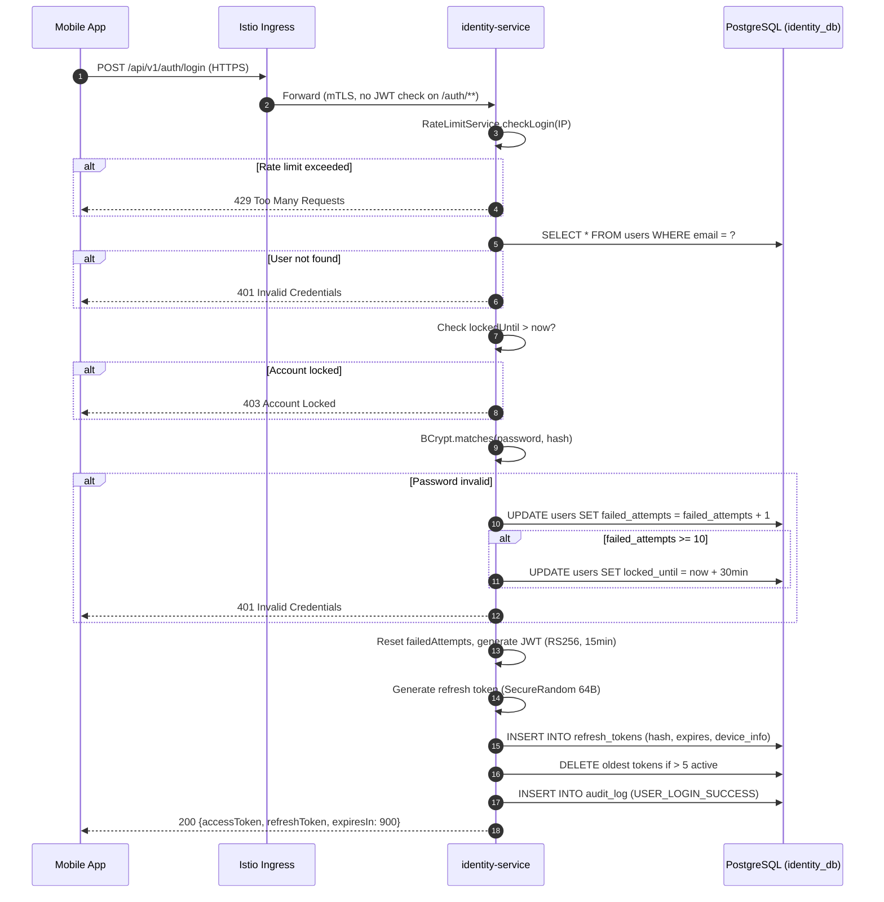
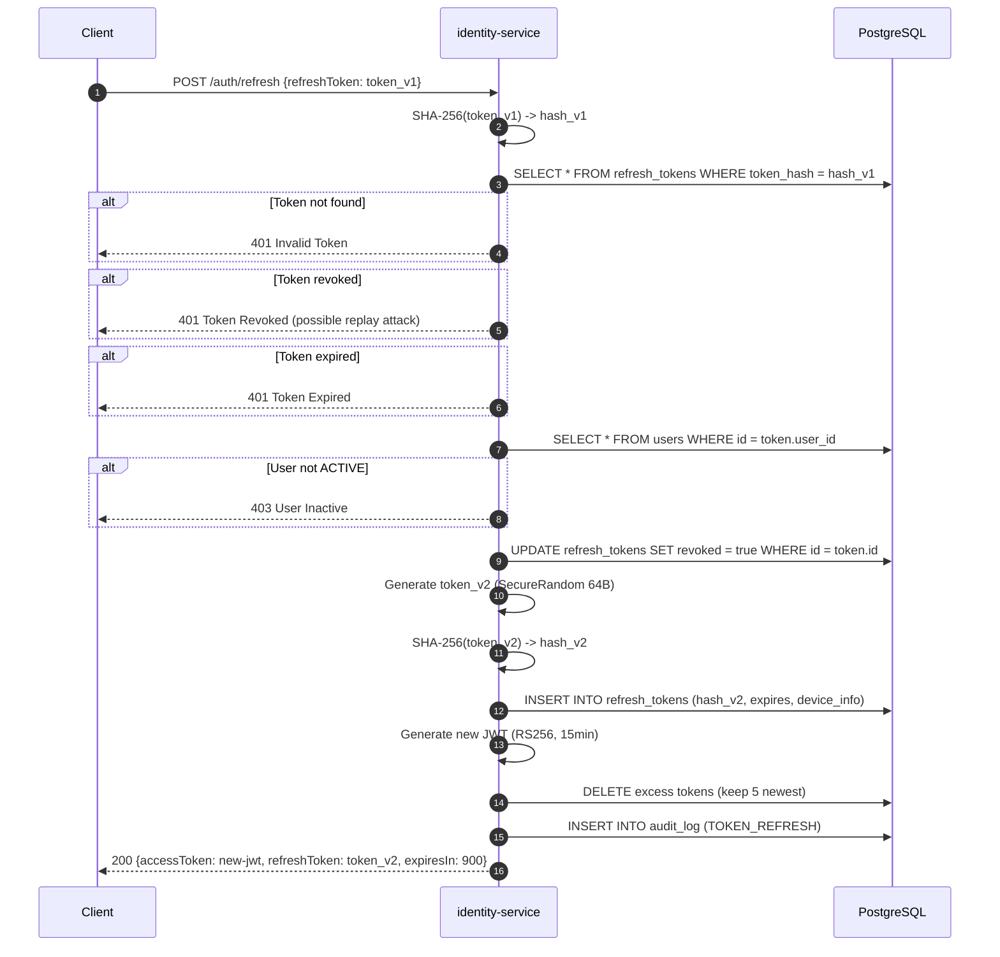
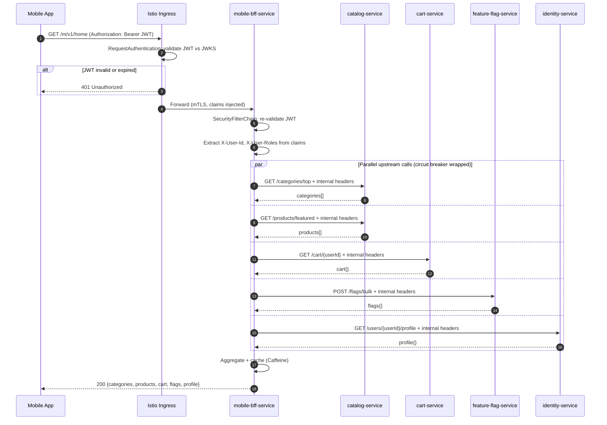
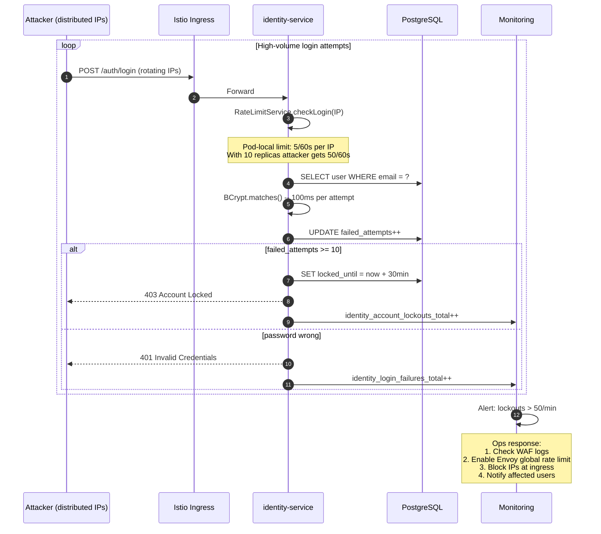
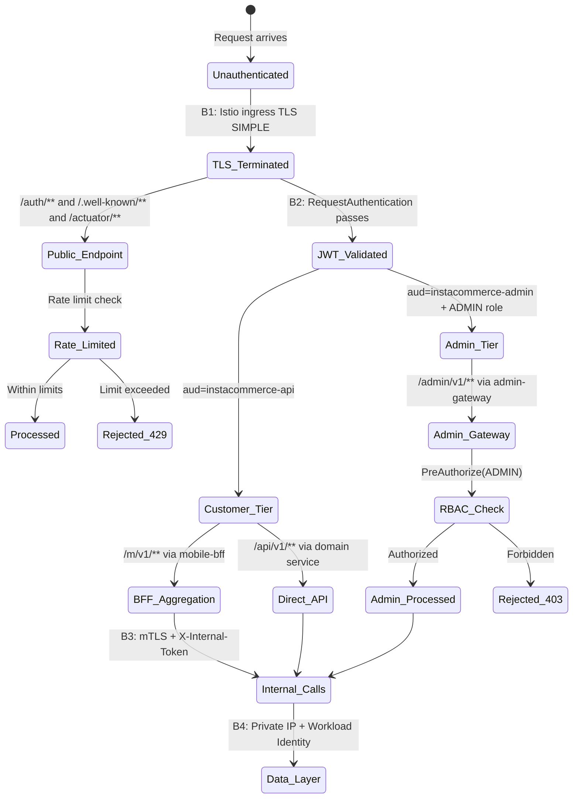
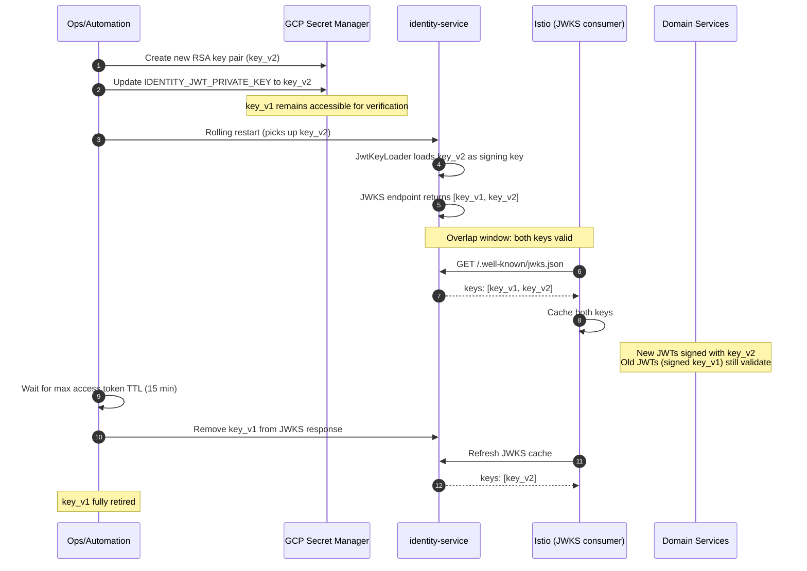

# LLD: Identity, Edge & Auth -- Ingress to Token to Trust Boundary

**Scope:** identity-service, mobile-bff-service, admin-gateway-service, Istio ingress-gateway, internal auth propagation
**Iteration:** 3 | **Updated:** 2025-07-17
**Source truth:** `services/identity-service/`, `services/mobile-bff-service/`, `services/admin-gateway-service/`, `deploy/helm/`, `contracts/`

---

## Contents

1. [Scope and Actors](#1-scope-and-actors)
2. [Runtime Components and Boundaries](#2-runtime-components-and-boundaries)
3. [Request Lifecycle](#3-request-lifecycle)
4. [Token and Session Model](#4-token-and-session-model)
5. [Internal Auth Propagation and Trust-Tier Model](#5-internal-auth-propagation-and-trust-tier-model)
6. [Failure Modes and Abuse Paths](#6-failure-modes-and-abuse-paths)
7. [Rate Limiting, Caching, and Policy Enforcement](#7-rate-limiting-caching-and-policy-enforcement)
8. [Observability and Rollout Strategy](#8-observability-and-rollout-strategy)
9. [Diagrams](#9-diagrams)
10. [Implementation Guidance and Open Issues](#10-implementation-guidance-and-open-issues)

---

## 1. Scope and Actors

### 1.1 What This Document Covers

This LLD describes the complete authentication and authorization data path
from external clients through Istio ingress to identity-service token
issuance, through BFF/gateway layers, and into internal service-to-service
trust propagation. It covers:

- TLS termination and ingress routing
- JWT issuance, validation, and refresh rotation
- Mobile BFF and admin gateway auth enforcement
- Internal service auth headers and Istio mTLS trust
- Failure modes, abuse vectors, and mitigations
- Rate limiting and policy enforcement at each tier

### 1.2 Actors

| Actor | Entry Point | Auth Method | Trust Level |
|-------|-------------|-------------|-------------|
| **Customer (mobile app)** | `m.instacommerce.dev` | Bearer JWT (RS256) | Untrusted -- full validation |
| **Customer (web app)** | `api.instacommerce.dev` | Bearer JWT (RS256) | Untrusted -- full validation |
| **Rider (delivery app)** | `api.instacommerce.dev` | Bearer JWT (RS256, role=RIDER) | Untrusted -- full validation |
| **Admin (console)** | `admin.instacommerce.dev` | Bearer JWT (RS256, aud=instacommerce-admin) | Untrusted -- full validation + RBAC |
| **Internal service** | Mesh-internal only | X-Internal-Token + Istio mTLS SPIFFE | Semi-trusted -- defense-in-depth |
| **Payment webhook (PSP)** | Webhook ingress | HMAC-SHA256 + replay protection | Untrusted -- signature verification |
| **Unauthenticated** | Public endpoints | None | Untrusted -- rate-limited only |

### 1.3 Out of Scope

- GDPR erasure pipeline internals (covered in edge-identity service guide)
- Payment PCI namespace isolation (covered in security-trust-boundaries)
- AI/ML service auth (covered in ai-agent-governance)
- OTP/phone login flow (future wave; architectural notes in Section 10)

---

## 2. Runtime Components and Boundaries

### 2.1 Component Map

```
services/identity-service/        Spring Boot 3, Java 21, PostgreSQL
  port: 8081 (dev) / 8080 (k8s)
  DB: identity_db
  Flyway: V1-V10 migrations
  Issues JWT (RS256), manages refresh tokens, audit, GDPR erasure
  JWKS endpoint: /.well-known/jwks.json

services/mobile-bff-service/      Spring Boot 3, Java 21, WebFlux (reactive)
  port: 8097
  DB: none (stateless)
  Aggregates parallel upstream calls for mobile clients
  Current status: MVP scaffold (returns {"status":"ok"})

services/admin-gateway-service/   Spring Boot 3, Java 21, Spring MVC
  port: 8099
  DB: none (stateless)
  Routes admin requests to backend services
  Current status: MVP scaffold (returns {"status":"ok"})

deploy/helm/templates/istio/      Istio ingress-gateway, VirtualService,
                                  RequestAuthentication, AuthorizationPolicy
  TLS: SIMPLE mode, cert: instacommerce-tls
  Hosts: api.instacommerce.dev, m.instacommerce.dev, admin.instacommerce.dev
```

### 2.2 Trust Boundaries

```
B1  Internet --> Istio Ingress Gateway
    TLS SIMPLE termination at port 443
    Rate limiting (target: Envoy global rate limit service)
    WAF/DDoS protection layer

B2  Istio Ingress --> Edge Services (identity, mobile-bff, admin-gateway)
    Istio sidecar injects mTLS
    RequestAuthentication validates JWT against JWKS
    VirtualService routes by path prefix

B3  Edge Services --> Domain Services (internal mesh)
    Istio mTLS STRICT (SPIFFE identity per pod)
    X-Internal-Token header (defense-in-depth, shared secret)
    AuthorizationPolicy per service (target state)

B4  Domain Services --> Data Layer
    Private IP CloudSQL (no public endpoint)
    Workload Identity binding for GCP Secret Manager
    Redis (currently plaintext -- TLS migration planned Phase 6)
```

### 2.3 Istio Routing Table

| Host | Path Prefix | Target Service | Port |
|------|-------------|----------------|------|
| `api.instacommerce.dev` | `/api/v1/auth` | identity-service | 8080 |
| `api.instacommerce.dev` | `/api/v1/users` | identity-service | 8080 |
| `api.instacommerce.dev` | `/.well-known/jwks.json` | identity-service | 8080 |
| `m.instacommerce.dev` | `/bff/mobile/v1` | mobile-bff-service | 8097 |
| `m.instacommerce.dev` | `/m/v1` | mobile-bff-service | 8097 |
| `admin.instacommerce.dev` | `/admin/v1` | admin-gateway-service | 8099 |
| `api.instacommerce.dev` | `/api/v1/products` | catalog-service | -- |
| `api.instacommerce.dev` | `/api/v1/orders` | order-service | -- |
| ... | (15+ additional routes) | ... | ... |

---

## 3. Request Lifecycle

### 3.1 Customer Request (Mobile App -- Happy Path)

```
1. Mobile app sends HTTPS request
   POST https://api.instacommerce.dev/api/v1/auth/login
   Content-Type: application/json
   {"email":"user@example.com","password":"...","deviceInfo":"iPhone/16.2"}

2. Istio Ingress Gateway
   - TLS termination (instacommerce-tls certificate)
   - VirtualService match: /api/v1/auth -> identity-service
   - No JWT validation on /auth endpoints (unauthenticated)
   - Forward to identity-service pod via mTLS

3. identity-service SecurityConfig filter chain
   a. InternalServiceAuthFilter -- no X-Internal-Token header, skip
   b. JwtAuthenticationFilter -- /auth/** is permit-all, skip auth
   c. Request reaches AuthController.login()

4. AuthService.login()
   a. RateLimitService.checkLogin(ipAddress) -- 5 req/60s per IP
      -> 429 if exceeded
   b. UserRepository.findByEmailIgnoreCase(email)
      -> 401 if not found
   c. Check account lockout: if lockedUntil > now -> 403
   d. PasswordEncoder.matches(password, user.passwordHash)
      -> BCrypt(12) verification (~100ms)
      -> If invalid: failedAttempts++, lock after 10 -> 401
   e. Check user.status == ACTIVE -> 403 if not
   f. Reset failedAttempts=0, lockedUntil=null

5. Token generation
   a. TokenService.generateAccessToken(user)
      -> RS256 JWT, 15-min TTL
      -> Claims: iss=instacommerce-identity, sub=user-uuid,
         aud=instacommerce-api, roles=[CUSTOMER], jti=random-uuid
   b. TokenService.generateRefreshToken()
      -> SecureRandom 64 bytes -> Base64-URL encode
   c. TokenService.hashRefreshToken(token) -> SHA-256 hex
   d. Save RefreshToken(hash, expiresAt=now+7d, deviceInfo, revoked=false)
   e. enforceMaxRefreshTokens(userId) -> keep only 5 active

6. AuditService.logAction(USER_LOGIN_SUCCESS, user.id, ipAddress, traceId)

7. Response: 200 OK
   {"accessToken":"eyJ...","refreshToken":"abc...","expiresIn":900,"tokenType":"Bearer"}
```

### 3.2 Authenticated Request (Post-Login)

```
1. Mobile app sends request with cached JWT
   GET https://m.instacommerce.dev/m/v1/home
   Authorization: Bearer eyJ...

2. Istio Ingress Gateway
   - TLS termination
   - VirtualService match: /m/v1 -> mobile-bff-service
   - RequestAuthentication: validate JWT against
     http://identity-service.default.svc.cluster.local/.well-known/jwks.json
   - Valid -> inject claims into request headers (X-Forwarded-*)
   - Invalid -> 401 before reaching service

3. mobile-bff-service (target state after hardening)
   a. SecurityFilterChain validates JWT (defense-in-depth)
   b. Extract X-User-Id, X-User-Roles from JWT claims
   c. MobileBffController.home() -> reactive pipeline
   d. Parallel upstream calls with circuit breaker:
      - catalog-service: GET /categories/top
      - catalog-service: GET /products/featured
      - cart-service: GET /cart/{userId}
      - config-feature-flag-service: POST /flags/bulk
      - identity-service: GET /users/{userId}/profile
   e. Each upstream call attaches:
      - X-Internal-Token: {shared-secret}
      - X-Internal-Service: mobile-bff-service
      - X-User-Id: {from JWT sub claim}
      - X-User-Roles: {from JWT roles claim}
      - X-Request-Id / traceparent: {OTEL propagation}
   f. Aggregate, cache (Caffeine), return

4. Response: 200 OK
   {"categories":[...],"featured":[...],"cart":{...},"flags":{...}}
```

### 3.3 Admin Request

```
1. Admin dashboard sends request
   GET https://admin.instacommerce.dev/admin/v1/dashboard
   Authorization: Bearer eyJ... (JWT with aud=instacommerce-admin, roles=[ADMIN])

2. Istio Ingress Gateway
   - TLS termination
   - VirtualService match: /admin/v1 -> admin-gateway-service
   - RequestAuthentication: validate JWT
   - Valid -> forward

3. admin-gateway-service (target state after hardening)
   a. SecurityFilterChain validates JWT (defense-in-depth)
   b. @PreAuthorize("hasRole('ADMIN')") on controller methods
   c. Verify JWT audience == "instacommerce-admin"
   d. AdminGatewayController routes request to backend service
   e. Attaches X-Internal-Token + X-Internal-Service headers
   f. Returns response

4. AuthorizationPolicy (Istio) blocks direct access to admin-gateway
   from any principal that is not the ingress gateway
```

### 3.4 Internal Service-to-Service Request

```
1. order-service needs to verify user exists
   GET http://identity-service.default.svc.cluster.local/admin/users/{id}

2. Istio sidecar-to-sidecar
   - mTLS STRICT (SPIFFE: spiffe://cluster.local/ns/default/sa/order-service)
   - No TLS certificate management by application

3. identity-service InternalServiceAuthFilter
   a. Check X-Internal-Service header: "order-service"
   b. Check X-Internal-Token header against expected token
      (currently: String.equals -- MUST migrate to constant-time comparison)
   c. If valid: grant ROLE_INTERNAL_SERVICE + ROLE_ADMIN
   d. Request proceeds to AdminController

4. Response returned over mTLS tunnel
```

---

## 4. Token and Session Model

### 4.1 JWT Access Token

| Field | Value | Notes |
|-------|-------|-------|
| Algorithm | RS256 | RSA 2048-bit key pair |
| Issuer (`iss`) | `instacommerce-identity` | Validated by Istio RequestAuthentication |
| Subject (`sub`) | User UUID | Primary identity claim |
| Audience (`aud`) | `instacommerce-api` or `instacommerce-admin` | Consumer vs admin separation |
| Roles (`roles`) | `[CUSTOMER]`, `[ADMIN]`, `[RIDER]`, etc. | Array claim for RBAC |
| Issued At (`iat`) | Unix timestamp | Standard |
| Expiry (`exp`) | iat + 900s (15 min) | Configurable via `identity.token.access-ttl-seconds` |
| JWT ID (`jti`) | Random UUID | For blocklist on logout/revoke |
| Key ID (`kid`) | Base64url(SHA-256(modulus + exponent)) | JWKS key rotation support |

### 4.2 Refresh Token

| Property | Value |
|----------|-------|
| Format | SecureRandom 64 bytes, Base64-URL encoded |
| Storage | SHA-256 hex digest in `refresh_tokens` table |
| TTL | 7 days (`identity.token.refresh-ttl-seconds: 604800`) |
| Rotation | On each refresh: old token revoked, new token issued |
| Max per user | 5 active tokens (`identity.token.max-refresh-tokens`) |
| Device binding | Optional `deviceInfo` field for tracking |

### 4.3 Refresh Rotation Flow

```
Client holds: refreshToken_v1 (plain text)
Server holds: SHA-256(refreshToken_v1) in DB, revoked=false

POST /auth/refresh  {"refreshToken": "refreshToken_v1"}
  |
  v
Server computes SHA-256(refreshToken_v1) -> lookup in DB
  |
  v
Validate: not revoked, not expired, user.status == ACTIVE
  |
  v
Mark refreshToken_v1 hash as revoked=true
  |
  v
Generate refreshToken_v2 (new SecureRandom 64 bytes)
Store SHA-256(refreshToken_v2) in DB, revoked=false
  |
  v
Generate new accessToken (15-min TTL)
  |
  v
enforceMaxRefreshTokens(userId) -> keep only 5 newest active
  |
  v
Response: {"accessToken": "new-jwt", "refreshToken": "refreshToken_v2", "expiresIn": 900}
```

**Replay detection:** If a revoked refresh token is presented, the server
returns 401 `TokenRevokedException`. This limits damage from token theft --
the attacker can use it once before the legitimate client's next refresh
attempt fails and triggers forced re-login.

### 4.4 JWKS Endpoint

```
GET /.well-known/jwks.json  (unauthenticated, Istio needs it)

Response:
{
  "keys": [{
    "kty": "RSA",
    "alg": "RS256",
    "use": "sig",
    "kid": "base64url(sha256(n||e))",
    "n": "base64url(modulus)",
    "e": "base64url(exponent)"
  }]
}
```

**Gap:** Currently single-key JWKS. Zero-downtime key rotation requires
multi-key JWKS with overlapping validity windows. See Section 10.

### 4.5 Token Revocation and Logout

| Action | Effect |
|--------|--------|
| `POST /auth/revoke` (single token) | Marks specific refresh token `revoked=true`; access token remains valid until expiry |
| `POST /auth/logout` (all sessions) | Revokes ALL active refresh tokens for user |
| Password change | Revokes all refresh tokens (forces re-login on all devices) |
| Account lockout | Existing JWTs remain valid until expiry; refresh will fail |
| GDPR erasure | All refresh tokens deleted, user anonymized, `UserErased` event published |

**Target state -- JWT blocklist:** Redis-backed JTI blocklist on
logout/revoke. Store JTI with TTL matching access token remaining life.
Check on every JWT validation. Not yet implemented.

### 4.6 Database Schema (Token-Related)

```sql
-- refresh_tokens
CREATE TABLE refresh_tokens (
    id UUID PRIMARY KEY DEFAULT gen_random_uuid(),
    user_id UUID NOT NULL REFERENCES users(id) ON DELETE CASCADE,
    token_hash VARCHAR(64) NOT NULL UNIQUE,  -- SHA-256 hex
    device_info VARCHAR(255),
    expires_at TIMESTAMPTZ NOT NULL,
    revoked BOOLEAN NOT NULL DEFAULT false,
    created_at TIMESTAMPTZ NOT NULL DEFAULT now()
);
CREATE INDEX idx_refresh_tokens_user ON refresh_tokens(user_id);
CREATE INDEX idx_refresh_tokens_expiry ON refresh_tokens(expires_at)
    WHERE revoked = false;

-- audit_log (token events)
CREATE TABLE audit_log (
    id BIGSERIAL PRIMARY KEY,
    user_id UUID,
    action VARCHAR(100) NOT NULL,  -- USER_LOGIN_SUCCESS, TOKEN_REFRESH, etc.
    entity_type VARCHAR(50),
    entity_id VARCHAR(255),
    details JSONB,
    ip_address VARCHAR(45),
    user_agent TEXT,
    trace_id VARCHAR(32),
    created_at TIMESTAMPTZ NOT NULL DEFAULT now()
);
```

---

## 5. Internal Auth Propagation and Trust-Tier Model

### 5.1 Current State (Flat Trust)

All services share a single `INTERNAL_SERVICE_TOKEN` environment variable.
Any service presenting this token via `X-Internal-Token` header receives
`ROLE_INTERNAL_SERVICE` + `ROLE_ADMIN` -- full administrative access.

```
identity-service InternalServiceAuthFilter:
  X-Internal-Service: {any-service-name}   -- self-declared, not verified
  X-Internal-Token: {shared-secret}        -- same token across all 28 services
  -> Grants: ROLE_INTERNAL_SERVICE, ROLE_ADMIN
```

**Critical risks:**
- **G1:** Single token compromise = full mesh lateral movement
- **G2:** `String.equals()` comparison is timing-attack vulnerable
- **G3:** `ROLE_ADMIN` grant is overly broad (order-service does not need admin)
- **G9:** Default dev token `dev-internal-token-change-in-prod` in application.yml

### 5.2 Target Trust-Tier Model

```
Tier 0 -- Public Internet (untrusted)
  No credentials or invalid credentials.
  Only public endpoints accessible: /auth/register, /auth/login,
  /auth/refresh, /.well-known/jwks.json, /actuator/health

Tier 1 -- Authenticated Customer/Rider
  Valid JWT with aud=instacommerce-api.
  Access scoped by roles claim: CUSTOMER, RIDER, PICKER, SUPPORT.
  Cannot access /admin/** endpoints.

Tier 2 -- Authenticated Admin
  Valid JWT with aud=instacommerce-admin, roles contains ADMIN.
  Access via admin-gateway-service only.
  Istio AuthorizationPolicy restricts admin-gateway callers.

Tier 3 -- Internal Service (scoped)
  Istio mTLS SPIFFE identity verified.
  Per-service internal token (Phase 5) or workload identity (Phase 7).
  Receives only the roles needed for its specific inter-service calls.
  Example: order-service gets ROLE_USER_READER, not ROLE_ADMIN.

Tier 4 -- Platform Infrastructure
  Istio control plane, otel-collector, prometheus.
  Access to /actuator/** endpoints only.
  No application-level auth.
```

### 5.3 Migration Path (from Flat to Tiered)

| Phase | Days | Change | Risk |
|-------|------|--------|------|
| 1 | 1-3 | Constant-time token comparison, remove `ROLE_ADMIN` grant, rotate dev token | Low -- behavioral no-op with security fix |
| 2 | 3-5 | Add `SecurityFilterChain` to mobile-bff + admin-gateway | Medium -- new code in scaffold services |
| 3 | 5-7 | Extend `RequestAuthentication` to all 28 services (not just 4) | Medium -- Istio config change |
| 4 | 7-14 | Deploy deny-all + per-service `AuthorizationPolicy` | **High** -- misconfiguration = outage |
| 5 | 14-28 | Per-service internal tokens (unique per caller pair) | Medium -- config management |
| 6 | 28-42 | Redis TLS, PCI namespace isolation | Medium -- infrastructure change |
| 7 | 28+ | Replace X-Internal-Token with Istio SPIFFE workload identity | Low (additive) -- remove app-layer check |

### 5.4 Header Propagation Contract

When a BFF or gateway forwards a request to a domain service, these
headers MUST be attached:

| Header | Source | Purpose |
|--------|--------|---------|
| `Authorization` | Original client JWT (passthrough) | Defense-in-depth re-validation |
| `X-Internal-Service` | BFF/gateway service name | Caller identity |
| `X-Internal-Token` | Environment variable | Service-to-service auth |
| `X-User-Id` | Extracted from JWT `sub` claim | User identity for domain logic |
| `X-User-Roles` | Extracted from JWT `roles` claim | Authorization context |
| `X-Request-Id` | Generated or propagated | Idempotency and tracing |
| `traceparent` | OTEL propagation | Distributed trace correlation |

---

## 6. Failure Modes and Abuse Paths

### 6.1 Authentication Failure Modes

| Failure | Symptom | Detection | Mitigation |
|---------|---------|-----------|------------|
| **Brute-force login** | High rate of 401s from same IP | `identity_login_failures_total` metric, rate limiter trips | 5 req/60s per IP (Resilience4j), account lockout after 10 failures (30 min) |
| **Credential stuffing** | Many IPs, low per-IP rate | Spike in login volume + high failure ratio | Wave 0: Redis-backed global rate limit; Wave 1: Envoy edge rate limit; WAF rules |
| **Stolen refresh token** | Legitimate user's refresh fails (token already rotated by attacker) | `TOKEN_REFRESH` audit with mismatched deviceInfo | Refresh rotation limits damage to one use; client must re-login |
| **Stolen access token** | Unauthorized API calls within 15-min window | Anomalous X-User-Id activity patterns | Short TTL (15 min); target: Redis JTI blocklist on logout |
| **Expired JWT at Istio** | 401 from ingress before reaching service | Istio `pilot_jwt_auth_denied` metric | Client refreshes token; refresh failure -> re-login |
| **JWKS endpoint down** | All JWT validation fails mesh-wide | identity-service health check fails | Istio caches JWKS; multiple replicas (min 2, max 10 HPA) |
| **Key compromise** | Attacker can forge any JWT | External detection / audit trail anomalies | Key rotation (requires multi-key JWKS); revoke all refresh tokens |

### 6.2 Availability Failure Modes

| Failure | Blast Radius | Detection | Mitigation |
|---------|-------------|-----------|------------|
| **identity-service down** | No new logins, no token refresh; existing JWTs work until expiry | Readiness probe fails, HPA scaling | min 2 replicas, PDB maxUnavailable=1, Istio JWKS cache |
| **identity-service DB down** | No logins, no refresh, no user lookups | Actuator DB health indicator | CloudSQL HA, connection pool (HikariCP max 20) |
| **mobile-bff-service down** | Mobile app home screen fails | Readiness probe, circuit breaker open metrics | min 2 replicas, client-side retry, degraded UX |
| **admin-gateway-service down** | Admin dashboard inaccessible | Readiness probe | min 2 replicas; admin traffic is low volume |
| **Istio ingress down** | All external traffic blocked | Istio control plane metrics | Multi-replica ingress-gateway, health checks |
| **Redis down (future)** | Rate limiting falls back to local, blocklist unavailable | Redis health metric | Caffeine fallback for rate limit; degrade gracefully on blocklist miss |

### 6.3 Abuse Paths and Security Gaps

| ID | Abuse Path | Current Exposure | Planned Fix |
|----|-----------|-----------------|-------------|
| **G1** | Compromised `INTERNAL_SERVICE_TOKEN` -> full mesh lateral movement | All 28 services share one token | Phase 5: per-service tokens; Phase 7: SPIFFE workload identity |
| **G2** | Timing attack on `String.equals()` in `InternalServiceAuthFilter` | Token bytes leaked via response-time analysis | Phase 1: `MessageDigest.isEqual()` constant-time comparison |
| **G3** | Internal services get `ROLE_ADMIN` unnecessarily | Any internal caller can access admin endpoints | Phase 1: grant only `ROLE_INTERNAL_SERVICE` |
| **G5** | admin-gateway has no app-layer auth | JWT not validated at application layer | Phase 2: add `SecurityFilterChain` with `@PreAuthorize` |
| **G9** | Default dev token in application.yml | `dev-internal-token-change-in-prod` in source code | Phase 1: remove default, require GCP Secret Manager injection |
| **G10** | mobile-bff has no security chain | Requests pass through without JWT validation | Phase 2: add WebFlux `SecurityFilterChain` |
| **A1** | Replay of revoked refresh token | Returns 401 but attacker already used it once | Refresh rotation limits to one use; target: Redis blocklist for access JTI |
| **A2** | Enumeration via `/auth/register` timing | BCrypt(12) on new user vs early return on duplicate | Normalize response time for register endpoint |
| **A3** | JWKS endpoint DoS | Public, unauthenticated, no rate limit | Istio rate limit on `/.well-known/jwks.json` path |

---

## 7. Rate Limiting, Caching, and Policy Enforcement

### 7.1 Rate Limiting Architecture

```
Layer 1: Istio Ingress (target state)
  Envoy global rate limit service (ratelimit-service)
  Per-IP and per-path limits
  Enforced BEFORE request reaches application

Layer 2: Application (current state)
  Resilience4j RateLimiter + Caffeine cache
  Per-IP limits on identity-service auth endpoints
  Pod-local (not shared across replicas -- GAP)

Layer 3: Account-level
  Account lockout after 10 failed login attempts
  30-minute lockout window
  Stored in PostgreSQL users table
```

### 7.2 Current Rate Limits

| Endpoint | Limit | Window | Scope | Enforcement |
|----------|-------|--------|-------|-------------|
| `POST /auth/login` | 5 requests | 60 seconds | Per IP | Resilience4j (pod-local) |
| `POST /auth/register` | 3 requests | 60 seconds | Per IP | Resilience4j (pod-local) |
| Login failures | 10 attempts | Until success/lockout | Per account | PostgreSQL `failed_attempts` |
| Account lockout | 1 lockout | 30 minutes | Per account | PostgreSQL `locked_until` |

**Gap:** Pod-local rate limiting via Caffeine cache means limits are
per-replica, not global. With 10 identity-service replicas, an attacker
gets 50 login attempts per 60s, not 5.

**Fix (Wave 0):** Replace Caffeine with Redis-backed rate limit store.
**Fix (Wave 1):** Envoy global rate limiting at ingress layer.

### 7.3 Caching

| Component | Cache | TTL | Purpose |
|-----------|-------|-----|---------|
| identity-service | Caffeine (10k entries, 5 min TTL) | 5 min | Rate limit counters |
| mobile-bff-service | Caffeine (spring-boot-starter-cache) | Configurable | Aggregated response caching |
| Istio | In-memory JWKS cache | Configurable (pilot) | Avoids hitting JWKS endpoint on every request |

### 7.4 Policy Enforcement Points

```
1. Istio Ingress Gateway
   - TLS termination
   - Rate limiting (target: Envoy ratelimit-service)
   - RequestAuthentication (JWT signature + expiry)
   - VirtualService routing

2. Istio Sidecar (per-pod)
   - mTLS STRICT enforcement
   - AuthorizationPolicy (target: deny-default + allow-list)
   - RequestAuthentication (target: all 28 services)

3. Application SecurityFilterChain
   - InternalServiceAuthFilter (X-Internal-Token)
   - JwtAuthenticationFilter (Bearer token re-validation)
   - @PreAuthorize annotations (RBAC)
   - Rate limiting (Resilience4j)

4. Business Logic
   - Account lockout (AuthService)
   - Refresh token ownership verification
   - User status checks (ACTIVE/SUSPENDED/DELETED)
```

---

## 8. Observability and Rollout Strategy

### 8.1 Key Metrics

| Metric | Source | Alert Threshold |
|--------|--------|-----------------|
| `identity_login_total{status=success/failure}` | identity-service Micrometer | Failure ratio > 30% for 5 min |
| `identity_token_refresh_total{status=success/failure}` | identity-service Micrometer | Failure ratio > 20% for 5 min |
| `identity_account_lockouts_total` | identity-service Micrometer | > 50/min (credential stuffing signal) |
| `istio_requests_total{response_code=401}` | Istio telemetry | Spike > 3x baseline |
| `pilot_jwt_auth_denied` | Istio Pilot | Any sustained increase |
| `resilience4j_ratelimiter_available_permissions` | identity-service Micrometer | Consistently 0 (rate limit exhaustion) |
| `http_server_requests_seconds{uri=/auth/*}` | Spring Boot Actuator | p99 > 2s |
| `mobile_bff_upstream_circuit_breaker_state` | mobile-bff Resilience4j | OPEN state > 30s |
| `admin_gateway_request_total{status=403}` | admin-gateway Micrometer | Spike (unauthorized admin attempts) |

### 8.2 Distributed Tracing

All three services export OTEL traces:

```yaml
management:
  tracing:
    sampling:
      probability: 1.0
  otlp:
    tracing:
      endpoint: http://otel-collector.monitoring:4318/v1/traces
```

Trace propagation through the auth path:

```
traceparent header -> Istio ingress -> identity-service span
  -> AuthService.login span
    -> UserRepository.findByEmail span
    -> PasswordEncoder.matches span
    -> TokenService.generateAccessToken span
    -> RefreshTokenRepository.save span
    -> AuditService.logAction span (async)
```

For BFF fan-out:

```
traceparent header -> mobile-bff-service span
  -> parallel child spans:
    -> catalog-service /categories/top
    -> catalog-service /products/featured
    -> cart-service /cart/{userId}
    -> config-feature-flag-service /flags/bulk
    -> identity-service /users/{userId}/profile
```

### 8.3 Audit Trail

identity-service writes to `audit_log` table (async, non-blocking):

| Action | Logged Fields |
|--------|--------------|
| `USER_REGISTERED` | user_id, ip_address, user_agent, trace_id |
| `USER_LOGIN_SUCCESS` | user_id, ip_address, user_agent, trace_id |
| `USER_LOGIN_FAILURE` | email (hashed), ip_address, reason, trace_id |
| `TOKEN_REFRESH` | user_id, device_info, trace_id |
| `TOKEN_REVOKE` | user_id, token_id, trace_id |
| `USER_LOGOUT` | user_id, trace_id |
| `PASSWORD_CHANGED` | user_id, trace_id |
| `USER_ERASURE_INITIATED` | user_id, trace_id |

### 8.4 Rollout Strategy for Security Hardening

```
Phase 1 (Days 1-3): Low-risk security fixes
  - Deploy constant-time comparison in InternalServiceAuthFilter
  - Remove ROLE_ADMIN from internal service grant
  - Rotate dev-internal-token-change-in-prod to Secret Manager value
  Validation: run full test suite, verify internal calls still work
  Rollback: revert Helm values, redeploy previous image

Phase 2 (Days 3-5): BFF and gateway hardening
  - Add SecurityFilterChain to mobile-bff-service (WebFlux)
  - Add SecurityFilterChain to admin-gateway-service
  - Add @PreAuthorize("hasRole('ADMIN')") to admin endpoints
  Validation: integration tests with JWT tokens, canary deploy
  Rollback: feature flag to bypass new filter chain

Phase 3 (Days 5-7): Extend RequestAuthentication
  - Apply Istio RequestAuthentication to all 28 services
  - Verify JWKS caching works under load
  Validation: smoke test every service endpoint with valid/invalid JWT
  Rollback: remove RequestAuthentication CRDs

Phase 4 (Days 7-14): HIGHEST RISK -- deny-default AuthorizationPolicy
  - Deploy deny-all base policy
  - Deploy per-service allow-list policies
  - Test EVERY inter-service call path
  Validation: comprehensive traffic shadow / canary
  Rollback: delete deny-all policy (returns to allow-all)

Phase 5 (Days 14-28): Per-service internal tokens
  - Generate unique token per service pair
  - Rotate via GCP Secret Manager
  Validation: verify each service-to-service call
  Rollback: revert to shared token

Phase 7 (Days 28+): Workload identity (SPIFFE)
  - Remove X-Internal-Token header checks
  - Rely entirely on Istio mTLS SPIFFE principal
  - Per-service AuthorizationPolicy with principals list
  Validation: verify AuthorizationPolicy allows only expected callers
  Rollback: re-enable X-Internal-Token filter
```

---

## 9. Diagrams

### 9.1 Component Boundary Diagram

```mermaid
C4Context
    title Identity and Edge Auth -- Component Boundaries

    Person(customer, "Customer", "Mobile/Web App")
    Person(admin, "Admin", "Admin Console")
    Person(rider, "Rider", "Delivery App")

    Enterprise_Boundary(edge, "Edge Layer (B1-B2)") {
        System(ingress, "Istio Ingress Gateway", "TLS termination, JWT validation, rate limiting")
        System(identity, "identity-service :8081", "JWT issuance, refresh rotation, JWKS, audit")
        System(bff, "mobile-bff-service :8097", "Mobile BFF aggregation (WebFlux)")
        System(admingw, "admin-gateway-service :8099", "Admin request routing, RBAC")
    }

    Enterprise_Boundary(mesh, "Internal Mesh (B3)") {
        System(catalog, "catalog-service", "Product catalog")
        System(cart, "cart-service", "Shopping cart")
        System(order, "order-service", "Order management")
        System(flags, "config-feature-flag-service", "Feature flags")
        System(other, "... 24 other services", "Domain services")
    }

    Enterprise_Boundary(data, "Data Layer (B4)") {
        SystemDb(identitydb, "identity_db", "PostgreSQL -- users, refresh_tokens, audit_log")
        SystemDb(redis, "Redis", "Rate limit counters, session cache (future)")
    }

    customer --> ingress : "HTTPS (TLS SIMPLE)"
    admin --> ingress : "HTTPS (TLS SIMPLE)"
    rider --> ingress : "HTTPS (TLS SIMPLE)"

    ingress --> identity : "/api/v1/auth, /users, /.well-known/jwks.json"
    ingress --> bff : "/bff/mobile/v1, /m/v1"
    ingress --> admingw : "/admin/v1"

    bff --> catalog : "mTLS + X-Internal-Token"
    bff --> cart : "mTLS + X-Internal-Token"
    bff --> flags : "mTLS + X-Internal-Token"
    bff --> identity : "mTLS + X-Internal-Token"
    admingw --> catalog : "mTLS + X-Internal-Token"
    admingw --> order : "mTLS + X-Internal-Token"
    admingw --> identity : "mTLS + X-Internal-Token"

    identity --> identitydb : "JDBC (private IP)"
    identity --> redis : "TCP (future: TLS)"

    ingress --> identity : "JWKS fetch (/.well-known/jwks.json)"
```

### 9.2 Customer Login Sequence



### 9.3 Token Refresh with Rotation



### 9.4 BFF Fan-Out with Auth Propagation



### 9.5 Failure Path: Credential Stuffing Attack



### 9.6 Trust Boundary State Machine



### 9.7 Key Rotation Sequence (Target State)



---

## 10. Implementation Guidance and Open Issues

### 10.1 Immediate Action Items

**P0 -- Security (Phase 1, Days 1-3):**

```java
// Fix G2: Constant-time token comparison in InternalServiceAuthFilter
// BEFORE (vulnerable):
if (token.equals(expectedToken)) { ... }

// AFTER (secure):
if (MessageDigest.isEqual(
    token.getBytes(StandardCharsets.UTF_8),
    expectedToken.getBytes(StandardCharsets.UTF_8))) { ... }
```

```java
// Fix G3: Remove ROLE_ADMIN from internal service grant
// BEFORE:
List.of(new SimpleGrantedAuthority("ROLE_INTERNAL_SERVICE"),
        new SimpleGrantedAuthority("ROLE_ADMIN"));

// AFTER:
List.of(new SimpleGrantedAuthority("ROLE_INTERNAL_SERVICE"));
```

```yaml
# Fix G9: Remove default dev token from application.yml
# BEFORE:
internal:
  service:
    token: ${INTERNAL_SERVICE_TOKEN:dev-internal-token-change-in-prod}

# AFTER:
internal:
  service:
    token: ${INTERNAL_SERVICE_TOKEN}  # No default -- fails fast if not injected
```

**P0 -- BFF/Gateway Hardening (Phase 2, Days 3-5):**

```java
// mobile-bff-service: Add WebFlux SecurityFilterChain
@Configuration
@EnableWebFluxSecurity
public class SecurityConfig {
    @Bean
    public SecurityWebFilterChain securityFilterChain(ServerHttpSecurity http) {
        return http
            .csrf(ServerHttpSecurity.CsrfSpec::disable)
            .authorizeExchange(exchanges -> exchanges
                .pathMatchers("/actuator/**").permitAll()
                .anyExchange().authenticated())
            .oauth2ResourceServer(oauth2 -> oauth2
                .jwt(jwt -> jwt.jwkSetUri(
                    "http://identity-service.default.svc.cluster.local"
                    + "/.well-known/jwks.json")))
            .build();
    }
}
```

```java
// admin-gateway-service: Add MVC SecurityFilterChain
@Configuration
@EnableWebSecurity
@EnableMethodSecurity
public class SecurityConfig {
    @Bean
    public SecurityFilterChain filterChain(HttpSecurity http) throws Exception {
        return http
            .csrf(AbstractHttpConfigurer::disable)
            .authorizeHttpRequests(auth -> auth
                .requestMatchers("/actuator/**").permitAll()
                .anyRequest().hasRole("ADMIN"))
            .oauth2ResourceServer(oauth2 -> oauth2
                .jwt(jwt -> jwt.jwkSetUri(
                    "http://identity-service.default.svc.cluster.local"
                    + "/.well-known/jwks.json")))
            .build();
    }
}
```

### 10.2 Redis-Backed Rate Limiting (Wave 0)

Replace Caffeine with Redis for globally consistent rate limiting:

```
Target: RateLimitService backed by Redis
Key pattern: ratelimit:{endpoint}:{ip}
TTL: matches rate limit window (60s)
Increment: INCR + EXPIRE (atomic via Lua script or MULTI)
Fallback: if Redis unreachable, fall back to Caffeine (degraded)
```

### 10.3 JWT Blocklist (Target State)

```
On logout/revoke:
  1. Extract JTI from access token
  2. Compute remaining TTL: token.exp - now
  3. Redis SET blocklist:{jti} "" EX {remaining_ttl}

On every JWT validation:
  1. Extract JTI from token
  2. Redis EXISTS blocklist:{jti}
  3. If exists -> reject (401)
  4. If Redis unreachable -> allow (fail-open, log warning)
```

### 10.4 OTP/Phone Login (Future Wave)

Architectural notes for Q-commerce phone login:

```sql
-- New table: login_otps
CREATE TABLE login_otps (
    id UUID PRIMARY KEY DEFAULT gen_random_uuid(),
    phone VARCHAR(30) NOT NULL,
    otp_hash VARCHAR(64) NOT NULL,  -- SHA-256 of 6-digit OTP
    expires_at TIMESTAMPTZ NOT NULL,  -- now + 5 min
    attempts INTEGER NOT NULL DEFAULT 0,
    verified BOOLEAN NOT NULL DEFAULT false,
    created_at TIMESTAMPTZ NOT NULL DEFAULT now()
);
CREATE INDEX idx_login_otps_phone ON login_otps(phone, created_at);
```

Rate limits: 3 OTP requests/min per phone, 5 verification attempts/15 min.
SMS gateway: interface for Msg91/Twilio with circuit breaker.

### 10.5 Multi-Key JWKS for Zero-Downtime Rotation

Current gap: single key in JWKS response means key rotation requires
downtime or a window where some JWTs fail validation.

Target: `JwtKeyLoader` loads multiple key pairs. JWKS endpoint returns all
active keys. New tokens signed with latest key. Old keys retained for
verification until all tokens signed with them expire (max 15 min).

### 10.6 Open Issues

| ID | Issue | Owner | Priority | Status |
|----|-------|-------|----------|--------|
| **OI-1** | Pod-local rate limiting bypassed under multi-replica | identity-service team | P0 | Open -- Wave 0 Redis migration |
| **OI-2** | `String.equals()` timing attack in InternalServiceAuthFilter | identity-service team | P0 | Open -- Phase 1 |
| **OI-3** | Flat INTERNAL_SERVICE_TOKEN shared across all services | Platform team | P1 | Open -- Phase 5 |
| **OI-4** | No JWT blocklist (access tokens valid until expiry after logout) | identity-service team | P1 | Open -- Redis blocklist |
| **OI-5** | Single-key JWKS (no zero-downtime rotation) | identity-service team | P1 | Open -- multi-key JWKS |
| **OI-6** | mobile-bff-service has no SecurityFilterChain | mobile-bff team | P0 | Open -- Phase 2 |
| **OI-7** | admin-gateway-service has no app-layer auth | admin-gateway team | P0 | Open -- Phase 2 |
| **OI-8** | RequestAuthentication only on 4 of 28 services | Platform team | P1 | Open -- Phase 3 |
| **OI-9** | No deny-default AuthorizationPolicy | Platform team | P1 | Open -- Phase 4 (highest risk) |
| **OI-10** | Redis plaintext (no TLS) | Platform/Infra team | P2 | Open -- Phase 6 |
| **OI-11** | JWKS endpoint has no dedicated rate limit | identity-service team | P2 | Open |
| **OI-12** | Register endpoint timing side-channel (user enumeration) | identity-service team | P2 | Open |

### 10.7 Service Configuration Reference

| Service | Port (dev) | Port (k8s) | DB | Replicas | HPA Max | CPU Req | Mem Req |
|---------|-----------|-----------|------|----------|---------|---------|---------|
| identity-service | 8081 | 8080 | identity_db (PostgreSQL) | 2 | 10 | 500m | 768Mi |
| mobile-bff-service | 8097 | 8097 | none | 2 | 8 | 250m | 384Mi |
| admin-gateway-service | 8099 | 8099 | none | 2 | 6 | 250m | 384Mi |

### 10.8 File Reference

```
services/identity-service/
  src/main/java/com/instacommerce/identity/
    controller/AuthController.java          -- /auth endpoints
    controller/UserController.java          -- /users endpoints
    controller/AdminController.java         -- /admin endpoints (ADMIN role)
    security/SecurityConfig.java            -- Spring Security filter chain
    security/JwtAuthenticationFilter.java   -- Bearer token extraction
    security/InternalServiceAuthFilter.java -- X-Internal-Token check
    security/JwtKeyLoader.java              -- RSA key management
    security/DefaultJwtService.java         -- RS256 sign/verify (JJWT 0.12)
    security/JwksController.java            -- /.well-known/jwks.json
    service/AuthService.java                -- Login, register, refresh, revoke
    service/TokenService.java               -- Token generation + SHA-256 hashing
    service/RateLimitService.java           -- Resilience4j + Caffeine
    service/UserDeletionService.java        -- GDPR erasure
    service/AuditService.java               -- Async audit logging
    service/OutboxService.java              -- Kafka outbox pattern
    domain/model/User.java                  -- User entity (lockout fields)
    domain/model/RefreshToken.java          -- Refresh token (hash, revoked)
    domain/model/Role.java                  -- CUSTOMER, ADMIN, PICKER, RIDER, SUPPORT
  src/main/resources/application.yml        -- Port, JWT, rate limit config
  src/main/resources/db/migration/V1-V10    -- Flyway migrations

services/mobile-bff-service/
  src/.../MobileBffController.java          -- /bff/mobile/v1, /m/v1
  src/main/resources/application.yml        -- Port 8097, OTEL, cache config

services/admin-gateway-service/
  src/.../AdminGatewayController.java       -- /admin/v1
  src/main/resources/application.yml        -- Port 8099, OTEL config

deploy/helm/
  templates/istio/gateway.yaml              -- Istio Gateway (TLS SIMPLE)
  templates/istio/virtual-service.yaml      -- Path-based routing
  templates/istio/request-authentication.yaml -- JWT validation CRDs
  templates/istio/authorization-policy.yaml -- mTLS principal policies
  values.yaml                               -- Service configs, HPA, Istio settings
```
