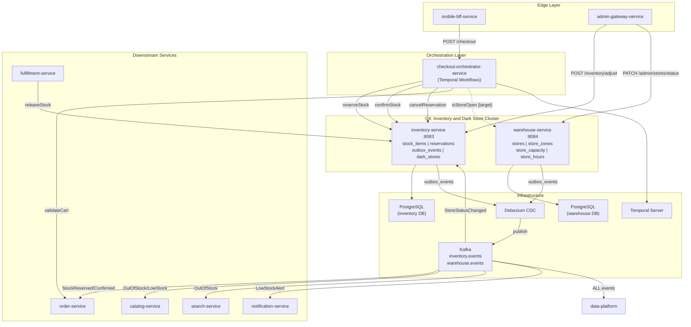
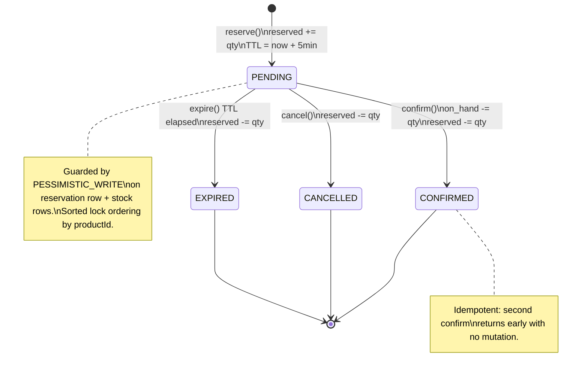
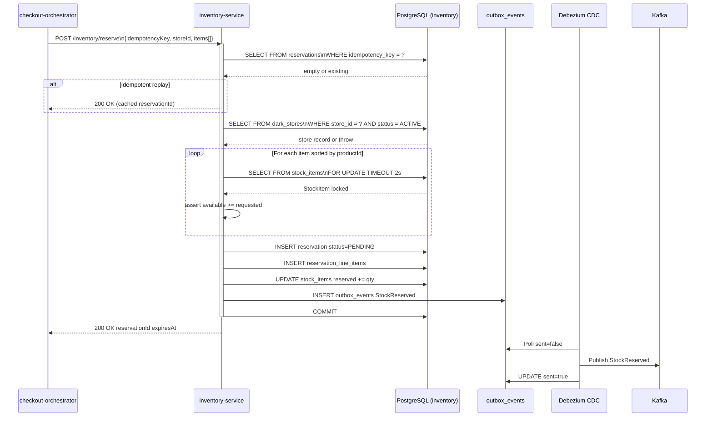
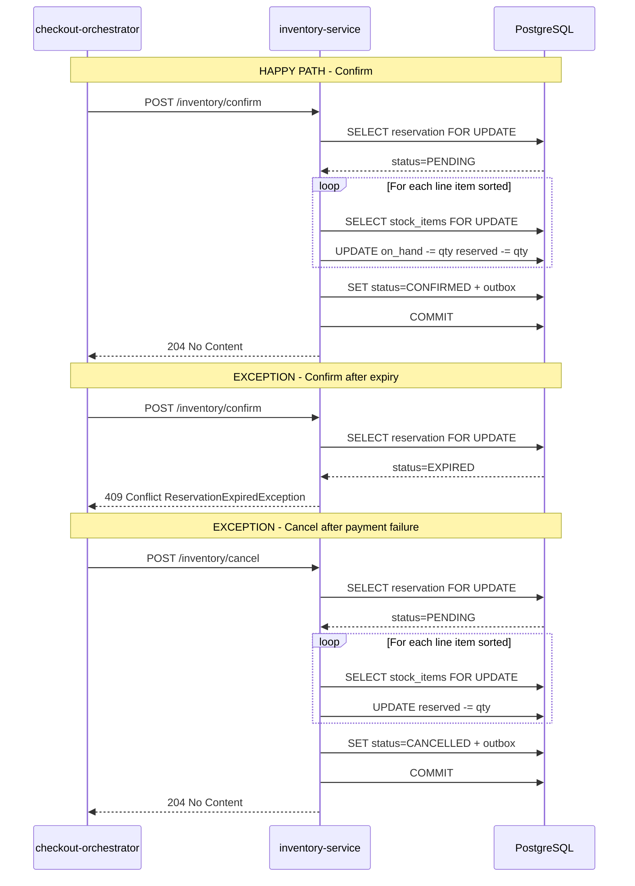
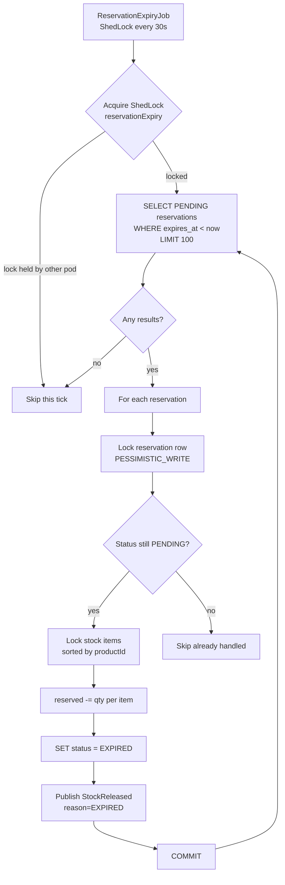

# LLD: Inventory, Warehouse, and Reservation Control

```
Document type:      Low-Level Design (LLD)
Cluster:            C4 -- Inventory & Dark Store
Services:           inventory-service, warehouse-service
Upstream callers:   checkout-orchestrator-service, order-service, fulfillment-service
Downstream:         catalog-service, search-service, data-platform (CDC)
Contracts:          contracts/src/main/resources/schemas/inventory/
Last updated:       2026-03-07
Status:             DRAFT
```

---

## Table of Contents

1. [Scope and Actors](#1-scope-and-actors)
2. [Inventory Truth and Warehouse/Store Ownership Map](#2-inventory-truth-and-warehousestore-ownership-map)
3. [Reserve/Confirm/Cancel/Expire Lifecycle](#3-reserveconfirmcancelexpire-lifecycle)
4. [Pick/Pack/Substitution and Stock-Adjustment Paths](#4-pickpacksubstitution-and-stock-adjustment-paths)
5. [Concurrency, Oversell Prevention, and Stale-State Risks](#5-concurrency-oversell-prevention-and-stale-state-risks)
6. [Eventing and Read-Model Propagation](#6-eventing-and-read-model-propagation)
7. [Observability, Rollback, and Incident Response](#7-observability-rollback-and-incident-response)
8. [Diagrams](#8-diagrams)
9. [Concrete Implementation Guidance and Sequencing](#9-concrete-implementation-guidance-and-sequencing)

---

## 1. Scope and Actors

### 1.1 What This Document Covers

This LLD defines the low-level mechanics of:

- **Stock truth:** How per-SKU per-store inventory is modeled, mutated, and protected.
- **Dark-store semantics:** How the warehouse-service store registry maps to inventory-service stock partitions, including operating hours, zones, and capacity.
- **Reservation lifecycle:** The PENDING -> CONFIRMED | CANCELLED | EXPIRED state machine, including TTL expiry, idempotency, and saga compensation.
- **Pick/pack/substitution:** How fulfillment interacts with reserved stock when items are unavailable during picking.
- **Concurrency control:** Pessimistic locking, lock ordering, TOCTOU windows, and database constraints that prevent oversell.
- **Event propagation:** Outbox-based event publishing to Kafka for downstream consumers (catalog hide/show, data-platform analytics, search re-indexing).

### 1.2 Actors

| Actor | Role | Interaction |
|-------|------|-------------|
| **checkout-orchestrator-service** | Temporal saga caller | Calls reserve, confirm, cancel via REST during checkout |
| **order-service** | Secondary saga caller (deprecated path) | Also has a Temporal checkout workflow; to be retired |
| **fulfillment-service** | Picker/packer | Calls releaseStock on damaged/missing items during pick |
| **admin / dark-store ops** | Manual override | Calls adjustStock, adjustStockBatch, reconcile via ADMIN JWT |
| **warehouse-service** | Store registry owner | Publishes StoreStatusChanged events consumed by inventory-service |
| **ReservationExpiryJob** | Scheduled ShedLock job | Expires stale PENDING reservations every 30 seconds |
| **OutboxCleanupJob** | Scheduled ShedLock job | Cleans processed outbox entries daily |
| **CDC / Debezium** | Event relay | Reads outbox_events and publishes to Kafka |
| **catalog-service / search-service** | Downstream consumers | Consume OutOfStock / LowStockAlert to hide/show products |
| **data-platform** | Analytics pipeline | Consumes all inventory events via CDC for dbt models |

### 1.3 Service Coordinates

| Service | Module path | Port | Database | Kafka topics |
|---------|-------------|------|----------|--------------|
| inventory-service | `services/inventory-service` | 8083 | `inventory` | `inventory.events` |
| warehouse-service | `services/warehouse-service` | 8084 | `warehouse` | `warehouse.events` |

Both are Spring Boot 3 apps with Flyway migrations, JPA/Hibernate, Resilience4j, and OTEL/Micrometer instrumentation. See `settings.gradle.kts` for canonical module paths.

---

## 2. Inventory Truth and Warehouse/Store Ownership Map

### 2.1 Stock Model

The fundamental stock truth lives in `stock_items`:

```
+-----------+-------------+---------+----------+------------+---------+
| id (UUID) | product_id  | store_id| on_hand  | reserved   | version |
|           | (UUID, FK)  | (VARCHAR| (INT>=0) | (INT>=0)   | (BIGINT)|
|           |             |  50)    |          | <= on_hand |         |
+-----------+-------------+---------+----------+------------+---------+

available = on_hand - reserved   (computed, never persisted)

UNIQUE (product_id, store_id)
CHECK  (on_hand >= 0)
CHECK  (reserved >= 0)
CHECK  (reserved <= on_hand)
```

- `on_hand` = physical stock the store believes it has.
- `reserved` = stock held by PENDING reservations not yet confirmed or released.
- `available` = what can be offered to new checkout attempts.

Key invariant: `reserved` is the SUM of all quantities in `reservation_line_items` where the parent `reservation.status = PENDING` and `reservation.expires_at > now()`. If this invariant breaks (e.g., due to a double-release race), stock drift occurs. See Section 5 for the protection mechanisms and Section 7 for the repair query.

### 2.2 Warehouse Store Registry

The warehouse-service owns the authoritative store entity:

```
+----------+--------+----------+----------+----------+-----------+----------+
| id (UUID)| name   | city     | latitude | longitude| status    | timezone |
|          |        |          | DECIMAL  | DECIMAL  | (enum)    | (VARCHAR)|
+----------+--------+----------+----------+----------+-----------+----------+

StoreStatus: ACTIVE | INACTIVE | MAINTENANCE | TEMPORARILY_CLOSED
```

Supporting tables:

- `store_zones` -- pincode-to-store delivery mapping with radius
- `store_hours` -- day-of-week operating hours (opens_at, closes_at) with holiday flag and timezone-aware open-status checks
- `store_capacity` -- per-store per-date per-hour order capacity tracking with UPSERT semantics (composite unique: store_id, date, hour)

### 2.3 The storeId Identity Gap (Critical)

**Current state:** inventory-service `store_id` is VARCHAR(50) with no referential link to warehouse-service `stores.id` (UUID). Any arbitrary string is accepted as a valid store ID.

**Consequence:** Reservations can be created against non-existent, inactive, or maintenance stores. A customer can complete checkout for an order the dark store physically cannot fulfill.

**Target state:** inventory-service maintains a local `dark_stores` table populated via Kafka `StoreStatusChanged` events from warehouse-service. Reserve checks this local table before locking stock. Validation modes are gated by feature flag:

```
inventory.store-validation.mode:
  NONE             -- no check (backward compatible default)
  LOG              -- log mismatches, do not block
  ALLOWLIST        -- check against config property list
  DARK_STORE_TABLE -- check against local dark_stores table
```

This avoids synchronous cross-service coupling on the checkout hot path. See Wave 4 in Section 9 for implementation details.

### 2.4 Zone-to-Store Lookup

Customer pincode -> serving store resolution flow:

```
  Customer address (pincode)
        |
        v
  warehouse-service: GET /stores/by-pincode?pincode={pincode}
        |
        v
  List<Store> candidates (UUID IDs, filtered by ACTIVE status)
        |
        +---> for each candidate:
        |       warehouse: GET /stores/{id}/open         (timezone-aware)
        |       warehouse: GET /stores/{id}/capacity     (hourly order cap)
        |       inventory: POST /inventory/check         (stock availability)
        |
        v
  Best store = nearest + open + has capacity + has stock
```

**Gap:** No unified "which store serves this cart" API exists today. The checkout-orchestrator must orchestrate across both services. Target state is a `StoreSelector` activity that encapsulates zone + capacity + stock lookup in one Temporal activity step.

### 2.5 Capacity Integration

warehouse-service tracks hourly order capacity per store. inventory-service tracks stock quantities. Neither informs the other. A store can run out of picker capacity before running out of stock. The checkout-orchestrator workflow should add a warehouse capacity check before inventory reservation to prevent reserving stock for an order the store cannot physically fulfill.

---

## 3. Reserve/Confirm/Cancel/Expire Lifecycle

### 3.1 State Machine

```
                 +-------------------+
                 |     PENDING       |
                 |  (reserved++)     |
                 +---+-----+-----+--+
                     |     |     |
              confirm|     |cancel|expire (TTL)
                     v     v     v
              +------+ +------+ +-------+
              |CONFIR| |CANCEL| |EXPIRED|
              |MED   | |LED   | |       |
              |on_hand| |reserv-| |reserv-|
              |-- re- | |ed--  | |ed--   |
              |served-| |      | |       |
              |--     | |      | |       |
              +-------+ +------+ +-------+

Terminal states: CONFIRMED, CANCELLED, EXPIRED. No re-entry.
```

### 3.2 Reserve Operation

**Endpoint:** `POST /inventory/reserve`

**Request/Response:**

```
Request:  { idempotencyKey, storeId, items: [{ productId, quantity }] }
Response: { reservationId (UUID), expiresAt, items: [{ productId, quantity }] }
```

**Algorithm (within a single @Transactional):**

```
1. IDEMPOTENCY CHECK
   - findByIdempotencyKey(key)
   - If exists: return cached response (no mutation)

2. STORE VALIDATION (when mode != NONE)
   - Check dark_stores.status == 'ACTIVE' for request.storeId
   - If invalid: throw StoreUnavailableException (HTTP 409)

3. SORT items by productId (deterministic lock ordering)

4. LOCK & VALIDATE (per item, sorted order)
   - SELECT s FROM StockItem s
     WHERE s.productId = :pid AND s.storeId = :sid
     FOR UPDATE [TIMEOUT 2000ms]
   - available = on_hand - reserved
   - If available < requested: throw InsufficientStockException

5. CREATE RESERVATION entity
   - status = PENDING
   - expiresAt = now() + TTL (default 5 minutes)
   - idempotencyKey = request.idempotencyKey

6. UPDATE STOCK: reserved += quantity (per item)

7. OUTBOX: publish StockReserved event transactionally

8. LOW STOCK CHECK: if available <= threshold, publish LowStockAlert
```

**Idempotency guarantees:**

- Application-level: `findByIdempotencyKey()` returns cached result.
- Database-level: UNIQUE constraint on `idempotency_key` catches concurrent duplicates that both miss the application check (TOCTOU in read-then-write).
- Gap: `DataIntegrityViolationException` on the unique constraint currently surfaces as HTTP 500; must be caught and mapped to re-fetch-and-return.

### 3.3 Confirm Operation

**Endpoint:** `POST /inventory/confirm`

**Algorithm:**

```
1. LOCK reservation row (PESSIMISTIC_WRITE) [*required fix*]
   - Current code uses findById() without lock (TOCTOU risk)

2. STATUS GUARD
   - If CONFIRMED: return early (idempotent)
   - If not PENDING: throw ReservationStateException

3. EXPIRY GUARD
   - If expiresAt < now(): call expireReservation(), throw ReservationExpiredException

4. SORT line items by productId

5. LOCK & DEDUCT STOCK (per item)
   - stock.onHand -= quantity
   - stock.reserved -= quantity
   - (available stays constant: this is the commit of sold stock)

6. SET status = CONFIRMED

7. OUTBOX: publish StockConfirmed event

8. LOW STOCK CHECK per item
```

**Algebraic correctness:** `available = on_hand - reserved`. During confirm, both `on_hand` and `reserved` decrease by the same `quantity`, so `available` does not change. The confirmed stock is "consumed" -- it leaves both counters.

### 3.4 Cancel Operation

**Endpoint:** `POST /inventory/cancel`

**Algorithm:**

```
1. LOCK reservation row (PESSIMISTIC_WRITE) [*required fix*]

2. STATUS GUARD
   - If CANCELLED or EXPIRED: return early (idempotent)
   - If CONFIRMED: throw ReservationStateException (cannot un-sell)

3. EXPIRY GUARD
   - If expired: call expireReservation(), return

4. RELEASE STOCK: reserved -= quantity (per item, sorted, locked)

5. SET status = CANCELLED

6. OUTBOX: publish StockReleased event (reason: CANCELLED)
```

### 3.5 Expire Operation (Scheduled)

**Job:** `ReservationExpiryJob` (ShedLock, 30s interval)

```
1. ShedLock: acquire distributed lock "reservationExpiry"
   - lockAtLeast: 30s, lockAtMost: 5m

2. BATCH FETCH: SELECT PENDING reservations WHERE expires_at < now()
   - Page size: 100
   - Repeat until page < 100

3. PER RESERVATION: call expireReservation(reservationId)
   - Lock reservation row
   - Guard: status == PENDING (else skip)
   - Release stock: reserved -= quantity per item
   - Set status = EXPIRED
   - Publish StockReleased (reason: EXPIRED)
```

**Performance concern:** Current implementation processes one reservation per transaction (no batch lock acquisition). Under backlog of 10,000 expired reservations, this takes O(n) DB roundtrips. See Wave 5 in Section 9 for batch optimization.

### 3.6 Checkout Saga Integration

The checkout-orchestrator-service uses Temporal for durable saga execution:

```
POST /checkout (JWT-authenticated)
  |
  +-- [1] CartActivity.validateCart(userId)
  |       -> items[], storeId
  |
  +-- [2] PricingActivity.calculatePrice(items, storeId, coupon)
  |       -> locked price snapshot (subtotal, discount, deliveryFee, total)
  |
  +-- [3] InventoryActivity.reserveStock(items)
  |       -> reservationId, expiresAt
  |       compensation: cancelReservation(reservationId)
  |
  +-- [4] PaymentActivity.authorizePayment(totalCents, paymentMethodId)
  |       -> paymentId
  |       compensation: voidPayment(paymentId)
  |
  +-- [5] OrderActivity.createOrder(reservationId, paymentId, pricing)
  |       -> orderId
  |       compensation: cancelOrder(orderId, "SAGA_ROLLBACK")
  |
  +-- [6] InventoryActivity.confirmStock(reservationId)
  |       PaymentActivity.capturePayment(paymentId)
  |
  +-- [7] CartActivity.clearCart(userId)  [best-effort]

On failure at any step: Saga.compensate() runs registered compensations
in reverse order (parallelCompensation=false for financial safety).
```

**Activity retry configuration:**

| Activity | Timeout | Max Retries | Do-Not-Retry |
|----------|---------|-------------|--------------|
| Inventory | 15s start-to-close | 3 | InsufficientStockException |
| Payment | 30s schedule-to-close | 3 | PaymentDeclinedException |
| Order | 15s | 3 | -- |
| Cart | 10s | 3 | -- |
| Pricing | 10s | 3 | -- |

**Critical gap:** If `confirmStock()` succeeds but `capturePayment()` fails, the saga compensation calls `cancelReservation()` on an already-CONFIRMED reservation, which throws `ReservationStateException`. The compensation must distinguish void (pre-capture) from refund (post-capture) for payment, and must NOT attempt to release already-confirmed inventory. Instead, a reverse stock adjustment or return-to-stock flow is needed.

### 3.7 Temporal Workflow ID and Idempotency

```
Workflow ID pattern: "checkout-{userId}-{idempotencyKey}"
```

- Temporal enforces `WORKFLOW_ID_REUSE_POLICY_REJECT_DUPLICATE` or equivalent.
- checkout-orchestrator-service also has a DB-backed `checkout_idempotency_keys` table with 30-minute TTL for application-level dedup.
- inventory-service reservation idempotency key = caller-provided string (typically the Temporal workflow run ID or order ID).

---

## 4. Pick/Pack/Substitution and Stock-Adjustment Paths

### 4.1 Order Lifecycle After Reservation Confirm

```
Order Status Flow:
  PENDING -> PLACED -> PACKING -> PACKED -> OUT_FOR_DELIVERY -> DELIVERED
                    |
                    +-> CANCELLED (at any point before OUT_FOR_DELIVERY)

Order entity carries: reservationId (UUID), linking back to the inventory
reservation for traceability.
```

### 4.2 Pick/Pack Flow and Short-Pick Handling

When a dark-store picker begins packing an order (status: PACKING):

```
Picker attempts to locate each OrderItem in the physical store.

Case 1: Item found
  -> Add to pick list. No inventory change needed
     (stock was already decremented during confirm).

Case 2: Item NOT found (short-pick)
  -> Picker marks item as UNAVAILABLE in fulfillment-service.
     fulfillment-service calls:
       POST /inventory/adjust
       {
         "productId": "<uuid>",
         "storeId": "<store-id>",
         "delta": 0,
         "reason": "DAMAGE_WRITEOFF",
         "referenceId": "order-{orderId}-shortpick"
       }
     If item exists but is damaged:
       fulfillment-service calls releaseStock to
       adjust on_hand downward to reflect reality.

Case 3: Substitution offered
  -> Picker proposes a substitute product.
     If customer accepts (via push notification):
       - Original item: no stock change (already consumed at confirm)
       - Substitute item: fulfillment-service reserves the substitute
         via POST /inventory/adjust with negative delta
       - Pricing difference handled at payment layer (partial refund
         or additional charge)
```

### 4.3 Substitution Lifecycle

```
  Order in PACKING state
       |
       v
  Picker finds item unavailable
       |
       v
  fulfillment-service proposes substitute
       |
       +---> Customer accepts
       |       - Adjust original item: writeoff reason if on_hand wrong
       |       - Adjust substitute: on_hand -= 1 (direct adjustment,
       |         not a reservation since order is already confirmed)
       |       - Update OrderItem to reflect substitution
       |       - Publish SubstitutionApplied event
       |
       +---> Customer rejects
       |       - Remove item from order
       |       - Issue partial refund for item value
       |       - Publish ItemRemovedFromOrder event
       |
       +---> Customer unreachable (timeout)
               - Auto-remove item (configurable policy)
               - Partial refund
```

**Current gap:** There is no substitution workflow implemented in the codebase today. fulfillment-service has an `InventoryClient` interface with `releaseStock()` but no substitution-specific methods. This flow must be designed as a new Temporal workflow or inline fulfillment activity.

### 4.4 Stock Adjustment Paths

**Admin-driven adjustments:**

| Endpoint | Caller | Use case |
|----------|--------|----------|
| `POST /inventory/adjust` | ADMIN JWT | Single-SKU manual correction |
| `POST /inventory/adjust-batch` | ADMIN JWT | Receiving, cycle count, bulk writeoff |

**Adjustment reasons (target taxonomy):**

```
RECEIVING          -- goods received from supplier/hub
CYCLE_COUNT        -- physical count correction
DAMAGE_WRITEOFF    -- damaged goods removal
EXPIRY_WRITEOFF    -- expired goods removal
RETURN_TO_STOCK    -- customer return re-stocked
TRANSFER_IN        -- inter-store transfer received
TRANSFER_OUT       -- inter-store transfer dispatched
ADMIN_CORRECTION   -- manual override by ops
```

Current state: `reason` is a free-text VARCHAR(100). Target: enum type with strict application-layer validation gated by feature flag.

**Adjustment guard:** `adjustStock()` validates that the resulting `on_hand` does not drop below `reserved`. If `delta` would cause `on_hand < reserved`, the adjustment is rejected with `INVALID_STOCK_ADJUSTMENT`. This prevents admin corrections from creating phantom availability.

**Audit trail:** All adjustments logged to `stock_adjustment_log` with `actor_id`, `delta`, `reason`, `reference_id`, and timestamps. Indexed for querying by store, product, actor, and date range.

### 4.5 Reconciliation (Cycle Count) Flow

**Proposed endpoint:** `POST /inventory/reconcile` (ADMIN role)

```
Request:
  { storeId, referenceId, counts: [{ productId, physicalCount }] }

Response:
  { referenceId, variances: [{ productId, systemOnHand, physicalCount, delta }],
    pendingApproval: true }
```

The reconciliation creates pending variance records in `stock_reconciliations` and `stock_reconciliation_items`. A second approver must APPROVE before adjustStock mutations are applied. This dual-approval pattern prevents a single operator from silently corrupting stock.

### 4.6 Bulk Receiving Workflow

```
WMS / mobile app creates receiving note
  |
  v
On confirm: POST /inventory/adjust-batch
  { reason: RECEIVING, referenceId: receiving-note-{id}, items: [...] }
  |
  v
stock_adjustment_log entries linked to receiving note via reference_id
  |
  v
StockAdjusted events published per SKU (via outbox)
  + aggregate ReceivingCompleted event (target state)
```

---

## 5. Concurrency, Oversell Prevention, and Stale-State Risks

### 5.1 Locking Strategy

All stock mutations use `PESSIMISTIC_WRITE` (PostgreSQL `SELECT ... FOR UPDATE`):

```sql
SELECT s FROM StockItem s
WHERE s.productId = :pid AND s.storeId = :sid
FOR UPDATE
-- lock timeout: 2000ms (configurable via INVENTORY_LOCK_TIMEOUT_MS)
```

PostgreSQL row-level locks ensure:

- Only one transaction holds the write lock on a given (productId, storeId) pair at a time.
- Other writers wait up to lock-timeout-ms, then throw LockTimeoutException.
- Readers with READ_COMMITTED see committed values after lock release.

### 5.2 Deadlock Prevention via Lock Ordering

All code paths that touch multiple StockItem rows sort by productId before locking:

```java
List<InventoryItemRequest> sortedItems = request.items().stream()
    .sorted(Comparator.comparing(InventoryItemRequest::productId))
    .toList();
```

**INVARIANT:** Every future code path that touches multiple StockItem rows in a single transaction MUST sort by productId before locking. This includes batch-reserve, transfer, reconciliation, and any new adjustment paths.

With the reservation-row-lock fix (Wave 2), the lock order becomes:

1. Reservation row (PESSIMISTIC_WRITE)
2. StockItem rows (PESSIMISTIC_WRITE, sorted by productId)

This is consistent across confirm, cancel, and expire paths.

### 5.3 Database Constraints as Safety Net

```sql
CONSTRAINT chk_on_hand_non_negative   CHECK (on_hand >= 0)
CONSTRAINT chk_reserved_non_negative  CHECK (reserved >= 0)
CONSTRAINT chk_reserved_le_on_hand    CHECK (reserved <= on_hand)
CONSTRAINT uq_stock_product_store     UNIQUE (product_id, store_id)
CONSTRAINT uq_reservation_idempotency UNIQUE (idempotency_key)
CONSTRAINT chk_qty_positive           CHECK (quantity > 0)
```

These constraints are the last line of defense. If application-level guards fail, the DB rejects the mutation with a constraint violation (surfaces as `DataIntegrityViolationException` in Spring). The exception handler must map these to appropriate HTTP status codes rather than raw 500s.

### 5.4 Known TOCTOU Risks and Mitigations

**Risk 1: Concurrent confirm + cancel/expire on same reservation**

```
Thread A (confirm):  reads status=PENDING, proceeds to lock stock
Thread B (cancel):   reads status=PENDING, proceeds to lock stock
Both succeed in releasing reserved, causing double-decrement.
```

Root cause: `reservation.status` is read via `findById()` without a lock. The stock-level `PESSIMISTIC_WRITE` serializes stock mutations but not the reservation status check.

Mitigation: Lock the reservation row itself at the start of confirm, cancel, and expire operations (Wave 2 fix). After locking, re-read status under the lock. Second thread sees CONFIRMED/CANCELLED and exits cleanly.

**Risk 2: Concurrent duplicate reserve requests**

```
Thread A: findByIdempotencyKey() -> empty
Thread B: findByIdempotencyKey() -> empty
Both insert reservation with same idempotency_key.
Second insert fails on UNIQUE constraint -> DataIntegrityViolationException.
```

Mitigation: Catch `DataIntegrityViolationException`, re-fetch by idempotency key, return the winner's result. Maps to HTTP 200 (idempotent replay), not 500 (Wave 1 fix).

**Risk 3: Expiry job races with client cancel**

Expiry job calls `expireReservation()` while a cancel HTTP request is in flight for the same reservation. Both read status=PENDING. First to lock stock succeeds; second double-decrements reserved.

Mitigation: Same as Risk 1 -- lock reservation row first.

### 5.5 @Version Field on StockItem

`StockItem` has a `@Version` annotation (optimistic lock) alongside PESSIMISTIC_WRITE usage. Since all mutations acquire the row lock, the version increment is a side effect only -- it never triggers `OptimisticLockException` in practice.

Recommendation: Remove `@Version` from StockItem to avoid confusion, or explicitly document it as "tracked for CDC/audit, not used for conflict detection."

### 5.6 Lock Timeout Behavior Under Load

At peak load on a hot SKU (viral product, 50+ concurrent checkouts), threads queue on the row lock. Some timeout after 2 seconds.

`LockTimeoutException` is currently unmapped -> HTTP 500.

Target: Map to HTTP 503 with `Retry-After` header or HTTP 409 with error code `STOCK_LOCK_TIMEOUT`. Upstream Temporal activities will retry automatically (up to 3 times with backoff).

### 5.7 Sequential Lock Acquisition Overhead

Reserve path acquires locks in a for-loop: one `SELECT FOR UPDATE` per item. For a 10-item cart at p99 DB latency of 5ms, that is 50ms in lock acquisition alone.

Target: Batch `SELECT FOR UPDATE` with `IN (:productIds) ORDER BY productId`:

```sql
SELECT s FROM StockItem s
WHERE s.storeId = :sid AND s.productId IN :pids
ORDER BY s.productId
FOR UPDATE [TIMEOUT 2000ms]
```

Reduces 10 roundtrips to 1. Deploy after correctness fixes are stable (Wave 5).

---

## 6. Eventing and Read-Model Propagation

### 6.1 Outbox Pattern

All inventory events use transactional outbox:

```
BEGIN TX
  UPDATE stock_items SET reserved = ...
  INSERT INTO outbox_events (
    aggregate_type, aggregate_id, event_type, payload, sent=false
  )
COMMIT

-- Debezium CDC (or polling job) reads outbox_events where sent=false
-- Publishes to Kafka topic: inventory.events
-- Marks sent=true
```

Outbox table schema:

```
outbox_events:
  id             UUID PRIMARY KEY
  aggregate_type VARCHAR(100)   -- "Reservation", "StockItem"
  aggregate_id   VARCHAR(100)   -- reservation ID or product ID
  event_type     VARCHAR(100)   -- "StockReserved", "StockConfirmed", etc.
  payload        JSONB          -- event body
  created_at     TIMESTAMPTZ
  sent           BOOLEAN        -- false until published to Kafka
```

This guarantees at-least-once delivery: the event is in the same transaction as the business mutation. CDC relay may duplicate; consumers must be idempotent.

### 6.2 Event Catalog

| Event | Published when | Key fields |
|-------|---------------|------------|
| **StockReserved** | reserve() succeeds | reservationId, orderId, storeId, items[], reservedAt, expiresAt |
| **StockConfirmed** | confirm() succeeds | reservationId, orderId, storeId, items[], confirmedAt |
| **StockReleased** | cancel() or expire() | reservationId, orderId, storeId, items[], releasedAt, reason (CANCELLED/EXPIRED) |
| **LowStockAlert** | available <= threshold | productId, storeId, currentQuantity, threshold, detectedAt |
| **OutOfStock** | available == 0 | productId, storeId, detectedAt |
| **StockAdjusted** | adjustStock() | productId, storeId, delta, newOnHand, reason, referenceId, actorId |
| **StoreStatusChanged** | warehouse status update | storeId, oldStatus, newStatus, changedAt (published by warehouse-service) |

**Schema gaps (to fix):**

- StockConfirmed currently omits `items[]` and `storeId`
- StockReleased currently omits `items[]`, `storeId`, and `reason`
- StockReserved currently omits `storeId`
- OutOfStock event does not exist yet

These are additive changes (new optional fields) and do not require a schema version bump.

### 6.3 Downstream Consumer Map

```
inventory.events topic
  |
  +---> catalog-service
  |       Consumes: OutOfStock, LowStockAlert
  |       Action:   hide/flag product in browse APIs
  |
  +---> search-service
  |       Consumes: OutOfStock, StockAdjusted
  |       Action:   demote/remove from search index
  |
  +---> data-platform (CDC consumer / cdc-consumer-service)
  |       Consumes: ALL events
  |       Action:   lands in raw layer for dbt staging models
  |
  +---> notification-service
  |       Consumes: LowStockAlert
  |       Action:   alert dark-store ops for replenishment
  |
  +---> order-service
          Consumes: StockConfirmed, StockReleased
          Action:   updates order status tracking

warehouse.events topic
  |
  +---> inventory-service
  |       Consumes: StoreStatusChanged
  |       Action:   updates local dark_stores table
  |
  +---> data-platform
          Consumes: ALL warehouse events
```

### 6.4 Read-Model Freshness

Stock availability as seen by customers flows through:

```
stock_items (source of truth)
    |
    v (outbox -> CDC -> Kafka)
inventory.events topic
    |
    v (consumer)
catalog-service / search-service read model
    |
    v (API / cache)
mobile-bff-service -> customer app
```

Latency budget:

- Outbox to Kafka: < 5 seconds (CDC polling interval)
- Kafka to consumer: < 2 seconds (consumer group lag SLA)
- Consumer to read model: < 1 second (in-process update)
- Total: < 10 seconds from stock mutation to customer visibility

This means a product can appear available for up to 10 seconds after stock reaches zero. Checkout will catch this at reserve time (fails with InsufficientStockException), which is the correct safety net.

---

## 7. Observability, Rollback, and Incident Response

### 7.1 Critical Alerts (Page On-Call Immediately)

| Alert | Condition | Root Cause |
|-------|-----------|------------|
| `inventory_reserved_gt_on_hand` | Any stock_items row: reserved > on_hand | Concurrency bug or constraint bypass |
| `inventory_on_hand_negative` | Any stock_items row: on_hand < 0 | Constraint bypass or raw SQL mutation |
| `inventory_lock_timeout_rate` | LockTimeoutException > 10/min | Lock contention spike, possible deadlock |
| `reservation_expiry_job_stalled` | ShedLock heartbeat missing > 90s | Job crashed; PENDING reservations accumulating |
| `outbox_backlog_critical` | outbox_events WHERE sent=false AND age > 2min: count > 1000 | CDC relay broken; events not flowing |

### 7.2 Warning Alerts (Investigate Within 30 Minutes)

| Alert | Condition | Root Cause |
|-------|-----------|------------|
| `reserve_p99_high` | p99 > 300ms for /inventory/reserve | DB contention or pool exhaustion |
| `pending_reservation_backlog` | PENDING reservations older than TTL + 5min > 500 | Expiry job backlog |
| `dark_store_consumer_lag` | Kafka consumer lag > 60s | StoreStatusChanged not flowing |
| `hikari_pool_near_exhaustion` | Active connections > 50 (of 60 max) | Slow queries holding connections |

### 7.3 Metrics to Instrument

```
# Reservation outcomes (counter)
inventory.reservation.reserve{outcome=success|insufficient_stock|idempotent_replay|store_unavailable}
inventory.reservation.confirm{outcome=success|expired|already_confirmed|state_error}
inventory.reservation.cancel{outcome=success|already_cancelled|state_error}
inventory.reservation.expire{outcome=success|already_expired}

# State transitions (counter)
inventory.reservation.state_transition{from=PENDING,to=CONFIRMED|CANCELLED|EXPIRED}

# Lock contention (counter + timer)
inventory.stock_lock.timeout{store_id=...}
inventory.stock_lock.wait_time (histogram, milliseconds)

# Stock health (gauge, sampled via scheduled job)
inventory.stock_items.reserved_gt_on_hand_count
inventory.stock_items.out_of_stock_count{store_id=...}

# Expiry job (timer + counter)
inventory.expiry_job.duration_ms
inventory.expiry_job.reservations_expired
```

### 7.4 Structured Log Fields

All ReservationService log events must include:

```
traceId, reservationId, storeId, idempotencyKey,
operation (reserve|confirm|cancel|expire),
outcome (success|insufficient_stock|expired|idempotent|error),
itemCount, durationMs
```

### 7.5 Rollback Strategies

| Scenario | Rollback | Risk |
|----------|----------|------|
| New code causes reservation double-release | Revert container image; stock repair query | MEDIUM |
| Store validation blocks legitimate orders | Set mode=NONE via ConfigMap hot-reload | LOW |
| Batch lock query causes deadlocks | Revert to per-item loop (no schema change) | LOW |
| orderId migration fails | DROP COLUMN order_id (additive, nullable) | LOW |
| Kafka consumer for StoreStatusChanged buggy | Disable via spring.kafka.listener.auto-startup=false | MEDIUM |

All schema changes use additive migrations (no column drops or renames) so old code can run against new schema. Feature flags gate new behavior without redeploy.

### 7.6 Stock Repair Queries

**Detect drift:**

```sql
-- Rows where reserved > on_hand (should never happen)
SELECT * FROM stock_items WHERE reserved > on_hand;

-- Rows where on_hand < 0 (should never happen)
SELECT * FROM stock_items WHERE on_hand < 0;

-- Pending expired but not cleaned up (expiry job backlog)
SELECT COUNT(*) FROM reservations
WHERE status = 'PENDING' AND expires_at < now() - INTERVAL '1 minute';
```

**Repair reserved from first principles:**

```sql
-- Recompute reserved as sum of active PENDING reservation quantities
-- RUN DURING OFF-PEAK; acquire advisory lock first
UPDATE stock_items si
SET reserved = (
    SELECT COALESCE(SUM(rli.quantity), 0)
    FROM reservation_line_items rli
    JOIN reservations r ON r.id = rli.reservation_id
    WHERE r.status = 'PENDING'
      AND r.store_id = si.store_id
      AND rli.product_id = si.product_id
      AND r.expires_at > now()
)
WHERE si.store_id = :target_store_id;
```

### 7.7 Incident Response Playbook

**Scenario: Mass oversell detected (orders placed, stock negative)**

```
1. CONTAIN: POST /admin/inventory/stores/{storeId}/override
   { "action": "PAUSE_RESERVATIONS", "reason": "oversell-incident" }

2. ASSESS: Run drift detection queries above.

3. REPAIR: Run reserved recomputation for affected store(s).

4. NOTIFY: Alert fulfillment ops about affected orders.

5. RESUME: POST /admin/inventory/stores/{storeId}/override
   { "action": "RESUME_RESERVATIONS" }

6. RCA: Check for concurrent confirm races (traceId correlation),
   expiry job failures (ShedLock logs), or raw SQL mutations.
```

**Scenario: Expiry job stalled, PENDING reservations piling up**

```
1. CHECK: SELECT * FROM shedlock WHERE name = 'reservationExpiry';
   - Is locked_until in the future? (job still holding lock)
   - Is locked_at stale? (pod crashed while holding lock)

2. IF stale lock: DELETE FROM shedlock WHERE name = 'reservationExpiry';
   (ShedLock will re-acquire on next tick)

3. VERIFY: Watch reservation count decrease over next 60 seconds.

4. IF job itself is broken: manually expire via SQL as last resort:
   UPDATE reservations SET status = 'EXPIRED', updated_at = now()
   WHERE status = 'PENDING' AND expires_at < now();
   -- THEN recompute reserved for affected stores
```

---

## 8. Diagrams

### 8.1 Component Diagram



### 8.2 Reservation Lifecycle State Diagram



### 8.3 Reserve Operation Sequence Diagram



### 8.4 Confirm/Cancel Exception Path Diagram



### 8.5 Expiry Job Flow Diagram



---

## 9. Concrete Implementation Guidance and Sequencing

### 9.1 Pre-conditions (Wave 0)

Before any code changes:

- [ ] All tests green: `./gradlew :services:inventory-service:test :services:warehouse-service:test`
- [ ] Baseline latency captured: p50/p99 for /inventory/reserve, /confirm, /cancel
- [ ] PostgreSQL slow query log enabled for inventory and warehouse databases
- [ ] ShedLock confirmed: only one pod runs reservationExpiry in multi-replica deploy
- [ ] HikariCP pool size (60) is adequate for current pod count x connection usage

### 9.2 Wave 1 -- Error Handling Hardening (Zero Behavior Change)

**Scope:** inventory-service only. No schema changes.

| Change | File | Description |
|--------|------|-------------|
| Map LockTimeoutException | GlobalExceptionHandler.java | Return HTTP 503 instead of 500 |
| Map DataIntegrityViolationException on idempotency | ReservationService.java or GlobalExceptionHandler.java | Catch, re-fetch by key, return cached response |
| Add on_hand guard in confirm | ReservationService.confirm() | Defensive check: on_hand >= item.quantity before decrement |
| Add admin adjust rate limit | StockController.java | Rate-limit ADMIN adjust endpoints per actor |

**Validation:** `./gradlew :services:inventory-service:test`

**Rollback:** Revert PR. No schema change.

### 9.3 Wave 2 -- Lock Reservation Row During Confirm/Cancel/Expire

**Scope:** inventory-service only. No schema changes.

Add `lockReservation(UUID)` helper that uses PESSIMISTIC_WRITE on the Reservation entity. Replace `reservationRepository.findById()` with `lockReservation()` in confirm(), cancel(), and expireReservation().

```java
private Reservation lockReservation(UUID reservationId) {
    return entityManager.createQuery(
            "SELECT r FROM Reservation r WHERE r.id = :id", Reservation.class)
        .setParameter("id", reservationId)
        .setLockMode(LockModeType.PESSIMISTIC_WRITE)
        .setHint(LOCK_TIMEOUT_HINT, inventoryProperties.getLockTimeoutMs())
        .getSingleResult();
}
```

**Lock ordering after this fix:**

1. Reservation row (first)
2. StockItem rows (sorted by productId)

No deadlock risk: reserve does not lock reservation rows (it creates them), and confirm/cancel/expire always lock reservation first, then stock.

**Validation:**

- Load test: 50 concurrent confirms for same reservationId -> exactly one succeeds
- `./gradlew :services:inventory-service:test`

**Rollback:** Revert to findById(). Low risk.

### 9.4 Wave 3 -- Schema and Contract Fixes

**Scope:** inventory-service schema + contracts/

| Change | Detail |
|--------|--------|
| V9 migration: add order_id to reservations | `ALTER TABLE reservations ADD COLUMN order_id UUID;` |
| Update ReserveRequest DTO | Accept optional orderId field |
| Update event schemas | Add storeId, items[], reason to StockConfirmed/StockReleased |
| Add OutOfStock.v1.json | New schema in contracts/ |
| Implement OutOfStock publishing | In checkLowStock() when available == 0 |

**Validation:**

- `./gradlew :contracts:build`
- `./gradlew :services:inventory-service:test`
- Verify Flyway migration runs cleanly

**Rollback:** Column is nullable; DROP COLUMN if needed. Schema additions are backward-compatible.

### 9.5 Wave 4 -- Dark-Store Local Registry (Highest Blast Radius)

**Scope:** inventory-service + warehouse-service coordination

**Step 4a:** Deploy migration + Kafka consumer, feature flag = NONE

```sql
-- V10__create_dark_stores.sql
CREATE TABLE dark_stores (
    store_id   VARCHAR(50) PRIMARY KEY,
    status     VARCHAR(30) NOT NULL DEFAULT 'ACTIVE',
    synced_at  TIMESTAMPTZ NOT NULL DEFAULT now(),
    created_at TIMESTAMPTZ NOT NULL DEFAULT now()
);
INSERT INTO dark_stores (store_id)
SELECT DISTINCT store_id FROM stock_items ON CONFLICT DO NOTHING;
```

**Step 4b:** Validate in staging -- StoreStatusChanged events flow correctly.

**Step 4c:** Enable LOG mode -- log mismatches, do not block. Monitor for false positives.

**Step 4d:** Enable DARK_STORE_TABLE mode (gradual rollout by store ID or traffic percentage).

**Validation:**

- Simulate StoreStatusChanged(MAINTENANCE) -> reserve returns 409
- Simulate StoreStatusChanged(ACTIVE) -> reserve succeeds
- `./gradlew :services:inventory-service:test`

**Rollback:** Set mode=NONE via ConfigMap. No schema revert needed.

### 9.6 Wave 5 -- Performance Optimization (Post-Stabilization)

Deploy after Waves 1-4 stable for at least one release cycle.

| Change | Detail |
|--------|--------|
| Batch SELECT FOR UPDATE | Replace per-item lock loop with single batch query |
| Batch expiry processing | Lock + expire multiple reservations per transaction |
| Per-SKU low-stock threshold | Add low_stock_threshold column to stock_items |
| Adjustment reason enum | Create stock_adjustment_reason PostgreSQL enum |

**Validation:**

- Benchmark: p99 of /inventory/reserve for 5-item and 10-item carts
- Deadlock rate should remain zero
- `./gradlew :services:inventory-service:test`

**Rollback:** Revert to per-item patterns. No schema dependency.

### 9.7 Post-Wave Items (Future Iterations)

| Item | Priority | Effort |
|------|----------|--------|
| Stock reconciliation endpoint (POST /inventory/reconcile) | HIGH | 3 days |
| Substitution Temporal workflow in fulfillment-service | HIGH | 5 days |
| StoreSelector unified activity (zone + capacity + stock) | HIGH | 3 days |
| Multi-tier stock model (available, damaged, safety_stock) | MEDIUM | 3 days |
| Checkout capacity check before reserve | HIGH | 2 days |
| Operating-hours check before reserve | HIGH | 1 day |
| Warehouse overnight-hours bug fix | HIGH | 0.5 day |
| Nearest-store bounding-box pre-filter | HIGH | 1 day |
| OutOfStock consumption in catalog/search | MEDIUM | 2 days |

### 9.8 Finding Register Cross-Reference

| Finding ID | Title | Wave | Section |
|------------|-------|------|---------|
| C4-F1 | Reservation row not locked (TOCTOU) | 2 | 5.4 |
| C4-F2 | Idempotency constraint -> HTTP 500 | 1 | 5.4 |
| C4-F3 | storeId unvalidated | 4 | 2.3 |
| C4-F4 | Event schemas missing items[]/storeId | 3 | 6.2 |
| C4-F5 | No OutOfStock event | 3 | 6.2 |
| C4-F6 | orderId/idempotencyKey conflation | 3 | 3.2 |
| C4-F7 | LockTimeoutException unmapped | 1 | 5.6 |
| C4-F8 | No multi-tier stock model | Post-5 | 9.7 |
| C4-F9 | No reconciliation endpoint | Post-4 | 4.5 |
| C4-F10 | Expiry job single-row processing | 5 | 3.5 |
| C4-F11 | Per-item lock loop overhead | 5 | 5.7 |
| C4-F12 | Global low-stock threshold only | Post-4 | 9.6 |
| C4-F14 | @Version misleading on StockItem | 1 | 5.5 |
| C4-F15 | Overnight hours bug | 4 | 2.4 |
| C4-F19 | No admin adjust rate limiting | 1 | 9.2 |
| C4-F20 | No capacity/hours check before reserve | Post-5 | 9.7 |

---

*Grounded in: `services/inventory-service` (Flyway V1-V8, ReservationService.java, InventoryService.java, ReservationExpiryJob.java), `services/warehouse-service` (Flyway V1-V7, StoreService.java, CapacityService.java, ZoneService.java), `services/checkout-orchestrator-service` (CheckoutWorkflowImpl.java), `services/order-service` (CheckoutWorkflowImpl.java, RestInventoryClient.java), `contracts/src/main/proto/inventory_service.proto`, `docs/reviews/iter3/services/inventory-dark-store.md`, `docs/reviews/iter3/services/transactional-core.md`.*
