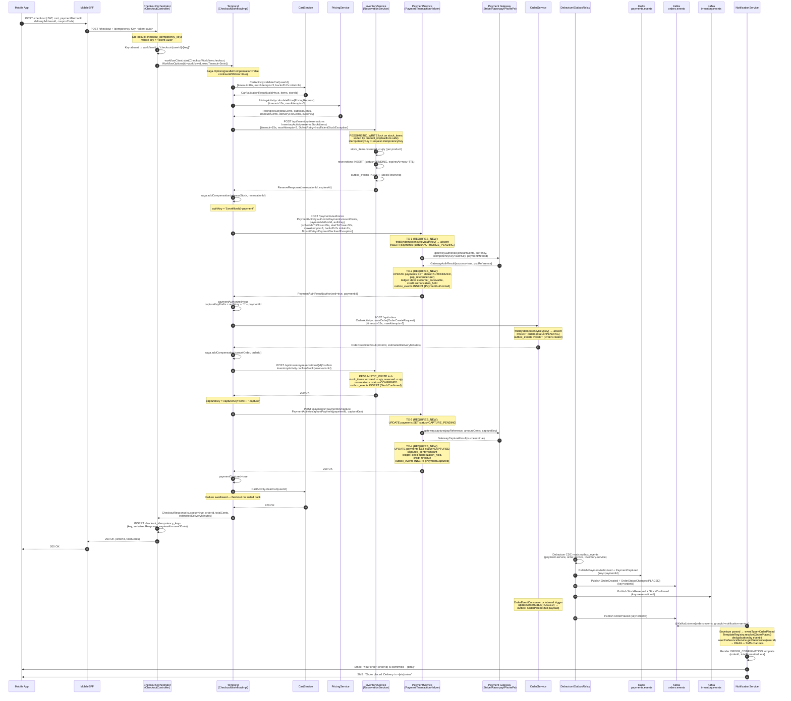
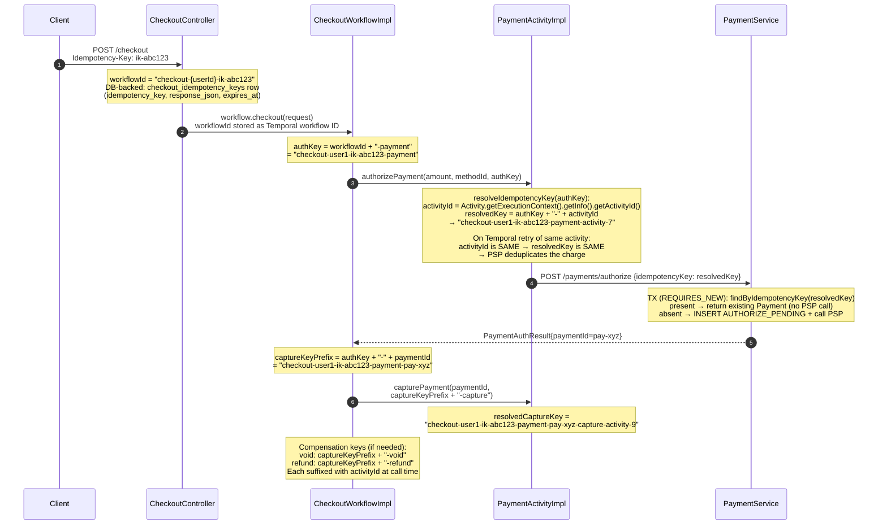
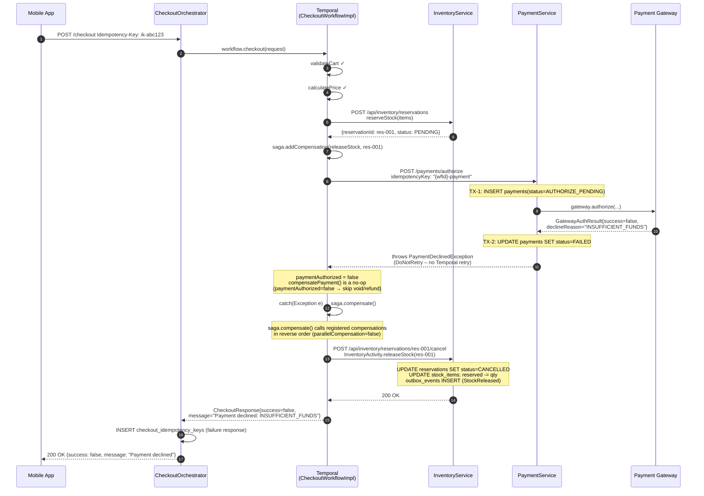
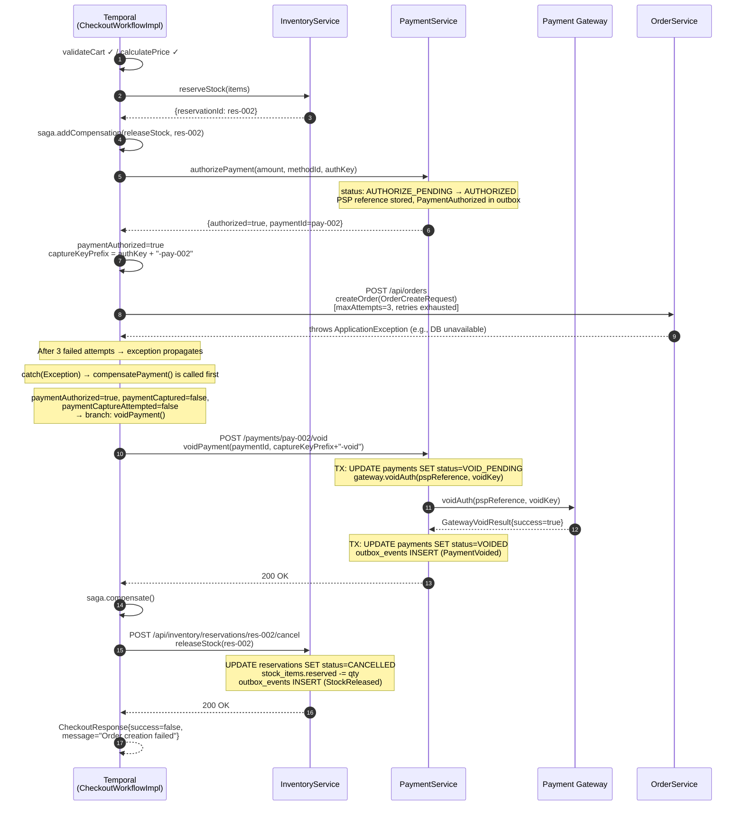
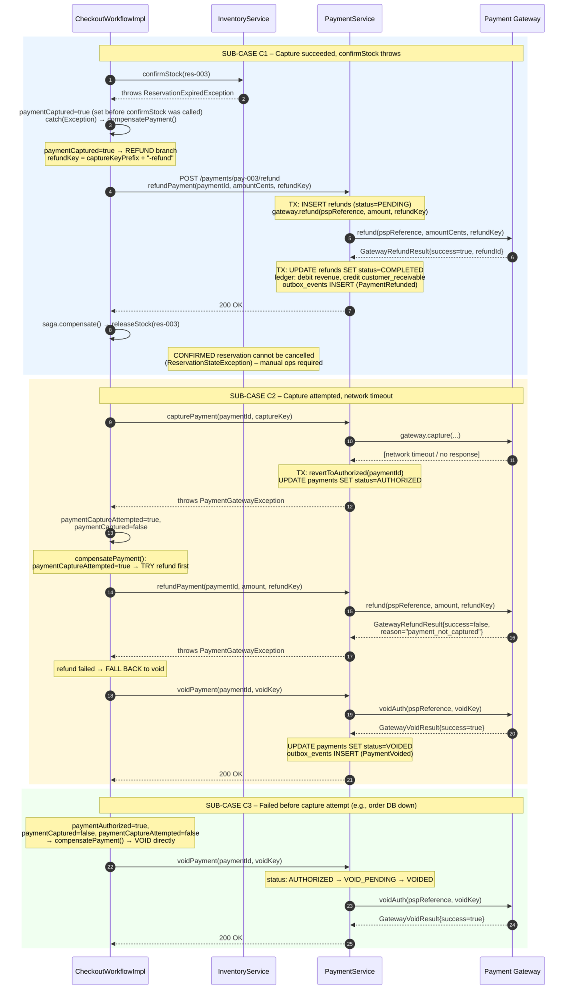
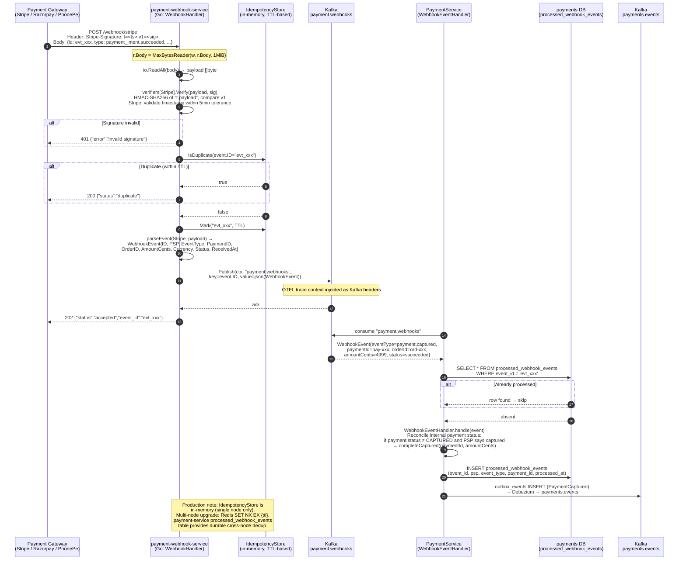
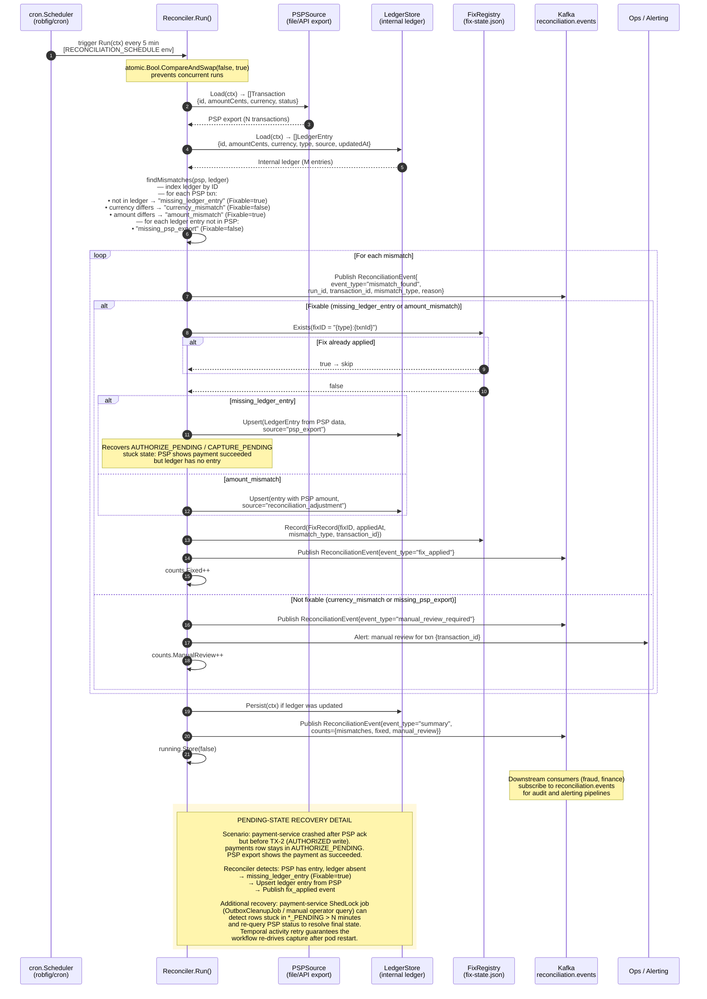
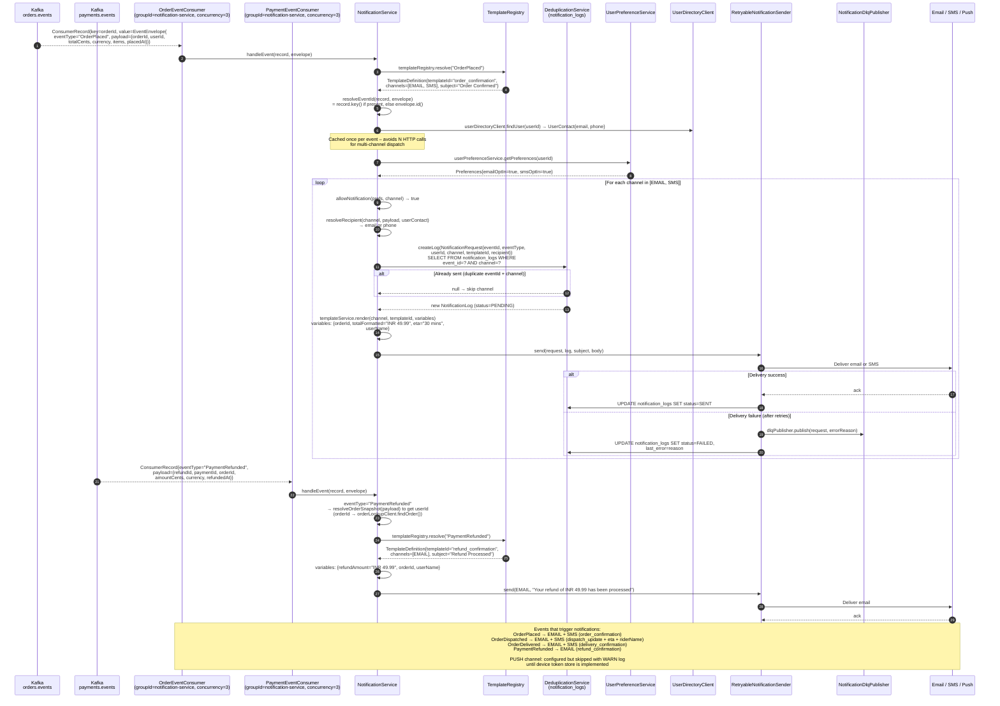

# Sequence Diagrams: Checkout, Payment, Webhook, Reconciliation & Notifications

> **Scope** – Covers the full checkout saga (happy path + rollback paths), payment
> auth/capture lifecycle, PSP webhook ingestion, reconciliation-engine cycle,
> inventory reservation/confirm, and customer notification dispatch.
>
> **Implementation grounding** – All participant names, method calls, state
> transitions, idempotency key formats, Kafka topic names, HTTP endpoints, and
> Temporal workflow/activity config are taken directly from the source code in
> `services/checkout-orchestrator-service`, `services/payment-service`,
> `services/payment-webhook-service`, `services/reconciliation-engine`,
> `services/inventory-service`, `services/order-service`, and
> `services/notification-service`.

---

## Table of Contents

1. [Happy Path – End-to-End Checkout](#1-happy-path--end-to-end-checkout)
2. [Idempotency Key Lineage](#2-idempotency-key-lineage)
3. [Failure Path A – Payment Declined (no capture)](#3-failure-path-a--payment-declined-no-capture)
4. [Failure Path B – Order Creation Fails After Payment Auth](#4-failure-path-b--order-creation-fails-after-payment-auth)
5. [Failure Path C – Capture Uncertain / Post-Capture Compensation](#5-failure-path-c--capture-uncertain--post-capture-compensation)
6. [PSP Webhook Ingestion](#6-psp-webhook-ingestion)
7. [Reconciliation Cycle & Pending-State Recovery](#7-reconciliation-cycle--pending-state-recovery)
8. [Customer Notification Dispatch](#8-customer-notification-dispatch)

---

## Single-Authority Rules

| Concern | Single Authority |
|---------|-----------------|
| Idempotency of the checkout request | `CheckoutController` – DB row in `checkout_idempotency_keys` (TTL 30 min) |
| Workflow state & saga compensation | Temporal `CheckoutWorkflow` (durable, replayed on crash) |
| Payment status transitions | `PaymentService` via `PaymentTransactionHelper` – pending states written inside a `REQUIRES_NEW` TX before any PSP call |
| Inventory count | `ReservationService` – `PESSIMISTIC_WRITE` lock on `stock_items` sorted by `product_id` (consistent lock order prevents deadlock) |
| Idempotency at the PSP boundary | Per-operation key: `{workflowId}-payment[-{paymentId}]-{op}[-{activityId}]` |
| Webhook dedup (single node) | Go `IdempotencyStore` (in-memory TTL map; production upgrade: Redis `SET NX EX`) |
| Ledger truth for reconciliation | `reconciliation-engine` `LedgerStore` (file-backed; production upgrade: DB) vs PSP export |

---

## 1. Happy Path – End-to-End Checkout

Covers: cart validation → pricing → inventory reservation → payment auth →
order creation → inventory confirm → payment capture → cart clear → outbox →
Kafka → order placed event → customer notification.



---

## 2. Idempotency Key Lineage

Illustrates how a single client `Idempotency-Key` header propagates through all
layers and how sub-keys prevent double-charges on Temporal retries.



---

## 3. Failure Path A – Payment Declined (No Capture)

The PSP hard-declines the authorization. `PaymentDeclinedException` is marked
`DoNotRetry` – Temporal does not retry. The saga compensates: inventory
reservation is released.



---

## 4. Failure Path B – Order Creation Fails After Payment Auth

Payment is fully authorized but `OrderActivity.createOrder` fails after 3
Temporal retries. Compensation must void the authorized payment (not yet
captured) and release the inventory reservation.



---

## 5. Failure Path C – Capture Uncertain / Post-Capture Compensation

Captures the three sub-cases Temporal handles in `compensatePayment()`:

- **C1** Capture succeeded → post-capture failure (e.g., confirm inventory
  throws) → full refund issued.
- **C2** Capture was *attempted* but outcome is unknown (network timeout) →
  refund attempted first; if refund fails, fall back to void.
- **C3** Capture not yet attempted → void.



---

## 6. PSP Webhook Ingestion

The `payment-webhook-service` (Go) is the single ingestion point for all PSP
callbacks. It is **stateless and disposable** – durability is delegated to
Kafka. The `PaymentService` also has a `ProcessedWebhookEvent` table
(`processed_webhook_events`) for downstream dedup after Kafka consumption.



---

## 7. Reconciliation Cycle & Pending-State Recovery

The `reconciliation-engine` (Go) runs on a cron schedule (default every 5
minutes, configurable via `SCHEDULE` env). It detects three mismatch types and
surfaces CAPTURE_PENDING / AUTHORIZE_PENDING stuck states as
`missing_ledger_entry` mismatches (PSP shows `succeeded` but ledger is absent
or stale).



---

## 8. Customer Notification Dispatch

`NotificationService` consumes `orders.events` and `payments.events` via
dedicated `@KafkaListener` components. Each event type is matched to a
template; deduplication prevents duplicate sends across pod restarts.



---

## Key Operational Notes

### Retry Budgets (Temporal Activities)

| Activity | `startToCloseTimeout` | `scheduleToCloseTimeout` | `maxAttempts` | Backoff | `doNotRetry` |
|---|---|---|---|---|---|
| `CartActivity.validateCart` | 10 s | — | 3 | 2×, init=1 s | — |
| `PricingActivity.calculatePrice` | 10 s | — | 3 | 2×, init=1 s | — |
| `InventoryActivity.reserveStock` | 15 s | — | 3 | 2×, init=1 s | `InsufficientStockException` |
| `PaymentActivity.authorizePayment` | 30 s | **45 s** | 3 | 2×, init=2 s | `PaymentDeclinedException` |
| `OrderActivity.createOrder` | 15 s | — | 3 | 2×, init=1 s | — |

### Payment Status State Machine

```
AUTHORIZE_PENDING ──(PSP success)──► AUTHORIZED ──(capture start)──► CAPTURE_PENDING
        │                                │                                    │
  (PSP decline/error)              (void start)                       (PSP success)
        │                                │                                    │
        ▼                                ▼                                    ▼
     FAILED                        VOID_PENDING                          CAPTURED
                                        │                                    │
                                  (PSP void ok)                      (refund issued)
                                        │                                    │
                                        ▼                                    ▼
                                     VOIDED                      PARTIALLY_REFUNDED / REFUNDED
```

`AUTHORIZE_PENDING` and `CAPTURE_PENDING` are written in a `REQUIRES_NEW`
transaction **before** the PSP call. If the service crashes after PSP ack but
before the completion transaction, the pending state is the durable signal for
recovery via the reconciliation engine or operator-driven PSP status query.

### Kafka Topic Ownership

| Topic | Producer | Key Consumers |
|---|---|---|
| `payments.events` | payment-service (Debezium outbox) | notification-service, wallet-loyalty-service, fraud-detection-service |
| `orders.events` | order-service (Debezium outbox) | notification-service, fulfillment-service, fraud-detection-service |
| `inventory.events` | inventory-service (Debezium outbox) | cdc-consumer-service, data-platform |
| `payment.webhooks` | payment-webhook-service | payment-service (WebhookEventHandler) |
| `reconciliation.events` | reconciliation-engine | finance/ops alerting, data-platform |
