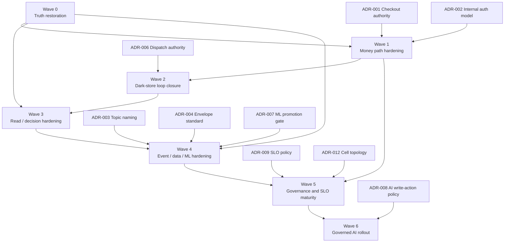

# InstaCommerce Principal Engineering Implementation Program

**Date:** 2026-03-06  
**Audience:** CTO, Principal Engineers, Staff Engineers, EMs, SRE, Platform, Data/ML, Security  
**Purpose:** Turn the iteration-2 and iteration-3 review findings into an execution program that is safe for a low-latency, high-scale q-commerce backend. This copy is placed inside `docs/reviews/iter3/` so the implementation program lives alongside the regenerated iteration-3 service, platform, benchmark, diagram, and appendix docs.

> **Recommended reading order:** `master-review.md` → `service-wise-guide.md` / `platform-wise-guide.md` → the cluster/platform subdocs referenced throughout this program.

---

## 1. Executive summary

InstaCommerce does not need another architecture narrative first; it needs a disciplined implementation program that restores truth, closes correctness gaps, and makes the existing service topology trustworthy.

The sequence matters:

1. **restore truth and control** before adding capability
2. **fix money-path correctness** before optimizing conversion
3. **close the dark-store loop** before promising faster SLAs
4. **harden contracts, data, and ML** before scaling automation
5. **govern AI explicitly** before allowing it anywhere near production mutations

The highest-priority program-level conclusion from iteration 3 is that the repo already contains enough components to look like a serious q-commerce platform, but too many of them are disconnected, stubbed, or under-governed. The implementation program therefore optimizes for **authority clarity, contract discipline, idempotency, rollout safety, and observability** before it optimizes for sophistication.

---

## 2. Program principles

### 2.1 Engineering principles

- **One write-path owner per critical decision.** Checkout authority, dispatch authority, and contract ownership cannot be shared.
- **At-least-once plus durable idempotency beats fake exactly-once.** The program explicitly removes misleading semantics and standardizes deduplication.
- **Hot paths stay short.** Anything with user-facing latency impact must avoid long synchronous chains or blocking request threads.
- **Contracts are product surfaces.** Event schemas, gRPC/proto contracts, and external API shapes are governed like code, not comments.
- **All waves must be reversible.** Every phase needs rollback triggers, rollback mechanics, and observable safety checks.
- **Operational trust is a prerequisite for AI.** No governed platform, no autonomous write actions.

### 2.2 Program anti-patterns to avoid

- shipping new features while known P0 contract mismatches remain unresolved
- introducing more caches before durable correctness is in place
- performing schema rewrites without compatibility windows
- broadening AI capabilities before HITL and fail-safe controls exist
- adding infra complexity (multi-region, progressive delivery, cells) before image, CI, and ownership truth is fixed

---

## 3. Workstream map

| Wave | Name | Primary objective | Dominant owners | Exit condition |
|---|---|---|---|---|
| Wave 0 | Truth restoration | Make docs, CI, deploy, and ownership truthful | Platform + Principals | Repo becomes an honest control plane |
| Wave 1 | Money path hardening | Make checkout, payment, and auth trustworthy | Transactional core + Security + SRE | No open CRITICAL money-path issues |
| Wave 2 | Dark-store loop closure | Make inventory, warehouse, dispatch, ETA, and rider loop operable | Logistics + Inventory | Closed reserve-pack-assign-deliver loop |
| Wave 3 | Read/decision hardening | Fix browse/search/cart/pricing and customer engagement surfaces | Search/Catalog + Growth | User-visible decisioning stops lying |
| Wave 4 | Event/data/ML hardening | Make eventing, analytics, feature pipelines, and ML reliable | Platform data + ML | Contracts and data become enforceable |
| Wave 5 | Governance and SLO maturity | Add measurable reliability and controlled rollout policy | SRE + Platform + Principals | Error-budget-driven delivery becomes real |
| Wave 6 | Governed AI rollout | Expand AI with policy, rollback, and HITL | AI/ML + Platform + Security | AI moves from advisory to governed production capability |

---

## 4. Dependency map

**Interpretation:** Wave 0 is non-negotiable. Waves 1, 3, and 4 can overlap only after Wave 0 delivers truth, CI, and ownership. Wave 6 should not start just because AI code exists; it should start only after governance, contracts, and SLO controls are real.

---

## 5. Wave 0 — Truth restoration

### 5.1 Objective

Make the repository trustworthy enough to drive engineering decisions.

### 5.2 Must-ship changes

| Area | Change | Why it is Wave 0 |
|---|---|---|
| CI truth | Fix broken CI references such as `actions/checkout@v6`; add coverage for Python AI services, contracts, data-platform, and data-platform-jobs | A broken CI pipeline invalidates all downstream quality claims |
| Deploy truth | Fix registry mismatch between `images/`, `dev-images/`, and `prod-images/` | Progressive delivery is meaningless if CI-built images are not deployable |
| Ownership | Add `.github/CODEOWNERS`; define service and platform owners | No owner means no accountable rollout or review gate |
| Contract governance | Wire proto/schema validation and breaking-change detection into CI | Contract drift is currently silent |
| Docs truth | Remove fabricated Avro/Schema Registry narratives that are not reflected in code; explicitly mark stubs and scaffolds | New engineers are otherwise misled into designing against non-existent infrastructure |
| Edge safety | Deny `admin-gateway-service` at Istio until real auth exists; fix edge path rewrite truth | Prevents accidental exposure of unauthenticated admin surfaces |

### 5.3 Entry gate

- leadership signs off that Wave 0 blocks all feature work except incident fixes
- platform team is assigned as DRI for CI/GitOps correction
- principal review findings are accepted as the current baseline truth source

### 5.4 Exit gate

- all repo-managed services have named CODEOWNERS
- CI validates every changed runtime surface that can ship from this repo
- docs/README clearly indexes the current principal review, implementation guides, and supporting diagram docs
- no critical doc-to-code mismatch remains untracked

### 5.5 Rollback and safety

Wave 0 is configuration and governance heavy. Rollback is straightforward:

- revert CI path-filter or matrix changes if they block merges incorrectly
- revert documentation/index updates if links are wrong
- temporarily disable new required reviewers only if they stop incident response

### 5.6 Metrics

- `% of changed directories covered by CI`
- `% of services with explicit CODEOWNERS`
- `# of contract files protected by compatibility gates`
- `# of doc claims marked verified vs unverified`

---

## 6. Wave 1 — Money path hardening

### 6.1 Objective

Make checkout, payment, internal auth, and reconciliation correct under retry, timeout, replay, and partial failure.

### 6.2 Must-fix items

| Track | Change | Source findings |
|---|---|---|
| Checkout authority | Consolidate on `checkout-orchestrator-service` as the sole orchestrator; remove checkout workflow path from `order-service` | `iter3-checkout-order` |
| Payment idempotency | Persist all payment operation idempotency keys durably before authorization/capture/void/refund | `iter3-checkout-order`, `iter3-payment-webhook-reconciliation` |
| Recovery | Add stuck-pending recovery job for `CAPTURE_PENDING` and related intermediate states | `iter3-payment-webhook-reconciliation`, `iter3-diagram-sequence-payment` |
| Webhook durability | Make webhook ingestion durable before publish; add outbox writes and reliable Kafka publish semantics | `iter3-payment-webhook-reconciliation`, `iter3-go-data-plane` |
| Internal auth | Remove shared-token admin overreach; move toward workload identity and per-service authz | `iter3-edge-identity-bff-admin`, `iter3-security-trust-boundaries` |
| Reconciliation | Replace file-based reconciliation source with authoritative payment DB / ledger path | `iter3-payment-webhook-reconciliation` |

### 6.3 Entry gate

- Wave 0 complete
- ADR-001 (checkout authority) and ADR-002 (internal auth model) approved
- payment and checkout owners assigned

### 6.4 Exit gate

- one checkout entry path is authoritative
- every payment mutation is idempotent across retries and deploys
- webhook replay is safe
- PSP reconciliation closes open holds and mismatched states
- no service can obtain transitive admin privileges via the shared internal token

### 6.5 Rollout controls

- shadow or dual-run checkout logic behind a routing flag before deleting the old path
- add synthetic payment replay tests in staging
- canary webhook-service changes before broad rollout
- freeze unrelated order/payment feature work during migration windows

### 6.6 Rollback triggers

- duplicate charge / duplicate refund / stuck authorization count rises above baseline threshold
- checkout failure rate exceeds 2x steady-state baseline
- reconciliation divergence grows after deploy

---

## 7. Wave 2 — Dark-store loop closure

### 7.1 Objective

Make the reserve-pack-assign-deliver loop closed, authoritative, and measurable.

### 7.2 Must-fix items

| Track | Change | Source findings |
|---|---|---|
| Inventory API correctness | Fix reservation path mismatches and payload drift | `iter3-inventory-warehouse`, `iter3-diagram-sequence-checkout` |
| Inventory concurrency | Add optimistic locking/versioning on reservation confirmation/cancel | `iter3-inventory-warehouse` |
| Schema correctness | Add `orderId` and correct `storeId` fields to inventory events | `iter3-inventory-warehouse` |
| Dispatch ownership | Make `dispatch-optimizer-service` the single dispatch decision owner | `iter3-routing-dispatch-location`, ADR-006 |
| Rider safety | Enforce rider identity on delivery completion and add stuck-state recovery | `iter3-fulfillment-rider` |
| Handoff correctness | Complete `OrderPacked` payload and make fulfillment/rider contracts closed-loop | `iter3-fulfillment-rider` |
| ETA realism | Add dynamic prep-time and continuous breach prediction | `iter3-routing-dispatch-location`, `iter3-competitor-india` |

### 7.3 Exit gate

- checkout reservation succeeds against real inventory APIs
- dispatch has one decision authority
- rider lifecycle has timeout/recovery mechanics
- ETA updates from live location and predicts breach risk before failure becomes customer-visible

### 7.4 Rollout controls

- run dispatch decisions in observe-only mode before making them authoritative
- compare predicted ETA vs actual delivery time distribution
- alert on DLT volume for logistics topics during rollout

---

## 8. Wave 3 — Read and decision plane hardening

### 8.1 Objective

Stop browse, search, cart, pricing, and engagement surfaces from making promises the backend cannot keep.

### 8.2 Must-fix items

| Track | Change | Source findings |
|---|---|---|
| Catalog→search pipeline | Replace logging stub event publisher, align event payloads, and restore indexing | `iter3-catalog-search` |
| Search relevance | Add store-scoped availability and at least `pg_trgm` / similarity-based typo tolerance as the first uplift | `iter3-catalog-search`, `iter3-comparison-approaches-matrix` |
| Cart/pricing contracts | Fix P0 URL/method mismatches and promotion `maxUses` bug | `iter3-cart-pricing` |
| Quote authority | Add quote / quote-lock tokens for price validation at checkout | `iter3-cart-pricing`, outline C3 target state |
| Loyalty correctness | Add locking/versioning and stable deduplication references | `iter3-notification-wallet-loyalty` |
| Notification privacy | Honor masking settings and complete GDPR erasure of rendered bodies | `iter3-notification-wallet-loyalty` |
| Fraud operator controls | Add fraud-rule audit, cache refresh, and override path | `iter3-fraud-audit-config` |

### 8.3 Exit gate

- search freshness works end to end
- search ranking is availability-aware for critical SKUs
- add-to-cart and checkout use correct pricing contracts
- promotions respect bounded usage
- loyalty operations are retry-safe and concurrency-safe

---

## 9. Wave 4 — Event, data, and ML hardening

### 9.1 Objective

Make contracts, event delivery, analytics semantics, feature pipelines, and ML serving trustworthy.

### 9.2 Must-fix items

| Track | Change | Source findings |
|---|---|---|
| Contracts | Standardize envelope/body semantics, eliminate ghost events, and add CI breaking checks | `iter3-contracts-events` |
| Go event plane | Fix commit semantics bug, webhook data-loss path, and DLQ/metrics gaps | `iter3-go-data-plane` |
| Data correctness | Convert Beam pipelines to event-time semantics with lateness handling; remove restart loss | `iter3-data-platform` |
| dbt/data quality | fix missing SQL paths, incrementalize key models, add CI parse/test gates | `iter3-data-platform` |
| ML serving truth | replace inference stubs with actual ONNX artifacts | `iter3-ml-platform` |
| Shadow visibility | persist shadow agreement metrics across pods and wire them to alerts/reviews | `iter3-ml-platform`, `iter3-diagram-dataflow-platform` |
| Stream processor deployability | make stream processor deployable and observable like other services | iteration 2 + C8 outline |

### 9.3 Exit gate

- contracts are CI-enforced
- event consumers do not lose correctness on retry/restart
- warehouse and feature data are time-correct and deduplicated
- production inference runs the actual promoted artifacts
- shadow and drift metrics are operationally visible

---

## 10. Wave 5 — Governance and SLO maturity

### 10.1 Objective

Move from threshold-based intuition to governed, measurable operations.

### 10.2 Must-fix items

| Track | Change | Source findings |
|---|---|---|
| SLOs | Add multi-window burn-rate alerts and commit Alertmanager config to repo | `iter3-observability-sre` |
| Resilience | Add Java client circuit breakers and explicit timeout budgets | `iter3-observability-sre`, `iter3-diagram-lld-edge-checkout` |
| Feature flag fast path | Add low-latency cached evaluation and real emergency-stop semantics | `iter3-fraud-audit-config`, outline C7 |
| Audit integrity | Add tamper-evident chaining / verification path | outline C7 + iteration 2 |
| Review cadence | stand up weekly ownership, biweekly contract, monthly reliability, monthly AI governance forums | service/platform outlines, governance diagrams |
| Cell preparation | draft and approve cell-topology ADR only after prior waves stabilize | best-practice references + ADR-012 |

### 10.3 Exit gate

- all critical clusters have explicit SLOs with alert routing in repo
- deploy freeze / error-budget policy is real
- on-call responders have runbooks linked from alerts
- ownership forums are active and recorded

---

## 11. Wave 6 — Governed AI rollout

### 11.1 Objective

Use AI where it is defensible, reversible, and observable.

### 11.2 Allowed scope progression

| Stage | Allowed AI role | Not allowed yet |
|---|---|---|
| Stage A | read-only support, recommendation, summary, ops assist | direct payment, inventory, order, or dispatch mutations |
| Stage B | proposal generation with human approval | autonomous money-path actions |
| Stage C | bounded automation with fail-safe controls and full audit | open-ended tool use |

### 11.3 Must-fix items before Stage B

- LangGraph checkpointer and tool registry must be durable and policy-enforced
- every write-capable tool must go through risk-tier policy and explicit human approval
- AI sessions need budget caps, PII redaction, and output validation
- model rollback and shadow agreement gates must be automated
- AI audit trail must be immutable and searchable

### 11.4 Exit gate

- no undocumented AI capability exists in production
- every write-capable tool path has human approval and emergency-stop controls
- rollback of any promoted model or agent capability is scriptable and tested

---

## 12. ADR backlog

| ADR | Title | Priority | Needed for |
|---|---|---|---|
| ADR-001 | Checkout authority | P0 | Wave 1 |
| ADR-002 | Internal service auth / workload identity | P0 | Wave 1 |
| ADR-003 | Kafka topic naming convention | P0 | Wave 4 |
| ADR-004 | Event envelope standard | P0 | Wave 4 |
| ADR-005 | Durable idempotency standard | P1 | Waves 1 and 3 |
| ADR-006 | Dispatch authority | P1 | Wave 2 |
| ADR-007 | ML promotion gate standard | P1 | Wave 4 |
| ADR-008 | AI write-action risk tiers and emergency-stop protocol | P1 | Wave 6 |
| ADR-009 | SLO and error-budget policy | P1 | Wave 5 |
| ADR-010 | Feature-flag fast-path and TTL policy | P2 | Waves 3 and 5 |
| ADR-011 | Contract versioning / compatibility window | P2 | Wave 4 |
| ADR-012 | Cell-based deployment topology | P3 | Wave 5+ |

---

## 13. Governance model

### 13.1 Standing forums

| Forum | Frequency | Mandatory attendees | Decision rights |
|---|---|---|---|
| Service ownership review | Weekly | EMs, tech leads, SRE owners | operational readiness, release go/no-go |
| Contract review | Biweekly | principals, service owners, data/ML | schema approval, compatibility windows |
| Reliability review | Monthly | SRE + principals + service owners | SLO breaches, burn policy, runbook quality |
| AI governance review | Monthly | AI/ML leads, security, SRE, principals | tool-risk approval, model rollout approval |
| Architecture review board | Quarterly | CTO + principals | ADR ratification, topology changes |

### 13.2 Approval classes

| Change class | Examples | Minimum approvers |
|---|---|---|
| Local implementation | single-service internal refactor | service owner |
| Contract change | event schema, proto, public API field | service owner + known consumers + principal |
| Money-path change | checkout, payment, refund, ledger | service owner + SRE + principal |
| Dispatch/logistics authority | assignment logic, ETA semantics | logistics owner + SRE + principal |
| AI write action | any tool with production mutation | AI owner + security + principal |
| Cross-platform change | CI, Helm, Argo, Terraform, auth model | platform owner + principal |

---

## 14. Rollout playbooks by change type

### 14.1 Money-path playbook

1. add durable idempotency first
2. add dual-read or shadow metrics second
3. canary at tiny percentage with replay validation
4. freeze non-essential product releases during rollout
5. pre-stage rollback commands and dashboards before merge

### 14.2 Event / contract playbook

1. add new version before removing old version
2. dual-publish during compatibility window
3. alert on consumer lag and deserialization errors
4. only cut over after known consumers are green

### 14.3 Data / ML playbook

1. preserve offline/online parity document before rollout
2. validate schema and freshness in CI and pre-prod
3. use shadow or backfill comparison before promotion
4. keep rollback artifact and prior champion live

### 14.4 AI playbook

1. default to read-only or propose-only modes
2. enforce risk tier and budget before enablement
3. audit every tool call and approval decision
4. keep degrade-to-non-LLM path explicit

---

## 15. Program scorecard

| Metric | Baseline direction | Target by Wave 6 |
|---|---|---|
| Critical doc-to-code mismatches | High | Near zero, with remainder tracked explicitly |
| Critical checkout/payment defects | High | Zero open P0 |
| Contract changes covered by CI compatibility checks | Near zero | 100% |
| Services with named CODEOWNERS | Low | 100% |
| Critical user journeys with real integration tests | Near zero | 100% money path, 80% dark-store path |
| SLOs with burn-rate alerts | Low | All production-critical clusters |
| AI write-capable actions under human approval or emergency-stop control | Low | 100% |

---

## 16. Open questions that still require human decisions

1. Which schema-registry / compatibility-enforcement tool is the long-term standard for JSON schemas?
2. What is the exact organizational owner map for the nine service clusters?
3. Will workload identity be rolled out centrally via Terraform module or per-chart annotation strategy first?
4. What is the canary standard for model promotion: shadow agreement only, or shadow plus percentage traffic shift?
5. What is the acceptable maintenance window for BigQuery schema migrations required by event-time fixes?
6. Which external LLM provider(s) are allowed for production and what is the fail-closed policy?

---

## 17. Bottom-line recommendation

Do **not** treat this as one long refactor program. Treat it as a series of gated hardening waves where each wave buys the right to start the next one.

If leadership wants the shortest list of non-negotiables:

- Wave 0 must complete before new platform claims are trusted
- Wave 1 must complete before growth or AI touches the money path
- Wave 2 must complete before the business promises more aggressive delivery SLAs
- Wave 4 and Wave 5 must complete before AI automation expands beyond advisory roles
