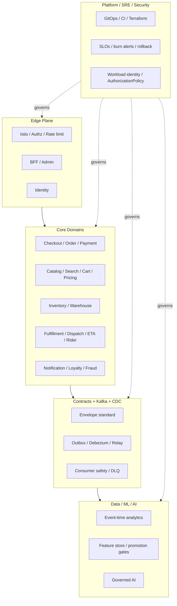

# InstaCommerce Principal Engineering Review — Iteration 3

**Date:** 2026-03-06  
**Audience:** CTO, Principal Engineers, Staff Engineers, EMs, SRE, Platform, Security, Data/ML, AI  
**Scope:** Third-pass repo review with deeper implementation focus, service-wise and platform-wise remediation guidance, additional diagrams, competitor benchmarking, and a production-safe execution model. This copy is placed inside `docs/reviews/iter3/` so the top-level review sits beside the regenerated iteration-3 subdocuments.  
**Builds on:**  
- `docs/reviews/PRINCIPAL-ENGINEERING-REVIEW-2026-03-06.md`  
- `docs/reviews/PRINCIPAL-ENGINEERING-REVIEW-ITERATION-2-2026-03-06.md`  
- `docs/reviews/iter3/service-wise-guide.md`  
- `docs/reviews/iter3/platform-wise-guide.md`  
- `docs/reviews/iter3/implementation-program.md`  
- `docs/reviews/iter3/diagrams/hld-system-context.md`  
- `docs/reviews/iter3/diagrams/flow-data-ml-ai.md`

---

## 1. Executive verdict

The third iteration confirms the same high-level conclusion as iteration 2, but with sharper implementation evidence:

> **InstaCommerce has the architecture of an ambitious q-commerce platform and the implementation discipline of a platform that has not yet fully chosen what it wants to trust.**

The service count, technology selection, and repo breadth are not the problem. The problem is that too many critical loops are only partially closed:

- checkout exists in two authorities
- event contracts exist without enough enforcement
- search exists without truthful indexing
- inventory exists without trustworthy confirmation semantics
- logistics exists without one assignment owner
- AI exists faster than the governance around it

The right response is not another grand redesign. The right response is a **gated implementation program** that restores truth, hardens correctness, and only then expands sophistication.

---

## 2. What iteration 3 added beyond iteration 2

Iteration 2 proved that the repo had structural weaknesses. Iteration 3 focused on **how to implement the fixes**.

### New depth added in iteration 3

- 30+ parallel workstreams across service clusters, platform concerns, benchmarking, and diagrams
- service-wise implementation guidance
- platform-wise implementation guidance
- additional mermaid diagrams across HLD, LLD, dataflow, and sequence flows
- explicit wave-based implementation program
- approach comparisons rather than one-track recommendations
- more concrete rollout, validation, rollback, and governance notes

### Most important change in emphasis

Iteration 2 was a review. Iteration 3 is a **delivery program disguised as a review**.

---

## 3. Supporting deliverables created in iteration 3

| Deliverable | Purpose |
|---|---|
| `PRINCIPAL-ENGINEERING-IMPLEMENTATION-GUIDE-SERVICE-WISE-2026-03-06.md` | cluster-by-cluster implementation guidance |
| `PRINCIPAL-ENGINEERING-IMPLEMENTATION-GUIDE-PLATFORM-WISE-2026-03-06.md` | cross-cutting platform guidance |
| `PRINCIPAL-ENGINEERING-IMPLEMENTATION-PROGRAM-2026-03-06.md` | wave plan, governance, and rollout controls |
| `docs/architecture/ITER3-HLD-DIAGRAMS.md` | refreshed HLD / system context / plane boundaries |
| `docs/reviews/ITER3-DATAFLOW-PLATFORM-DIAGRAMS-2026.md` | deep data/ML/AI dataflow diagrams |
| `PRINCIPAL-ENGINEERING-REVIEW-ITERATION-3-SERVICE-GUIDE-OUTLINE.md` | reusable chapter template and governance map |

---

## 4. The seven defining truths of the repo

### 4.1 The macro-architecture is still directionally right

The repo still points in the right direction:

- domain-oriented microservices
- database-per-service boundaries
- Temporal for orchestration
- outbox/Kafka eventing
- separate data and AI planes
- GitOps and infra-as-code intent

That matters. It means the implementation program can harden and reconnect the current topology instead of replacing it wholesale.

### 4.2 Truth drift is still a first-class problem

Iteration 3 added stronger evidence that documentation, CI, deploy, and contract claims still diverge in meaningful ways:

- broken or misleading CI details
- deploy artifact lineage mismatch
- stub or scaffold services described as production-ready
- contract technology narratives not reflected in code

### 4.3 The money path is still the most dangerous implementation gap

The deepest service-level risk remains the transactional core:

- duplicated checkout authority
- incomplete payment idempotency and recovery
- webhook durability gaps
- reconciliation not yet truly authoritative

### 4.4 Search and browse are less mature than the repo narrative implies

This is not merely about relevance quality. The repo evidence shows that the indexing path itself is broken, and ranking still lacks truthful store-scoped availability.

### 4.5 The dark-store loop is the biggest gap versus top operators

The platform has components for inventory, warehouse, fulfillment, rider fleet, dispatch, ETA, and location ingestion—but not yet a cleanly governed, closed operational loop.

### 4.6 Data and ML are promising but semantically unsafe in key places

The biggest issue is not model sophistication. It is that event-time correctness, feature truth, and serving/provenance alignment are not yet strong enough to support deeper automation safely.

### 4.7 AI is valuable, but only under a narrow operating envelope right now

Iteration 3 reinforces a conservative AI recommendation:

- use AI for retrieval, support, recommendation, summarization, triage, and investigation
- do not grant it authoritative write control over money, inventory, dispatch, or order state yet

---

## 5. Top issue register

### P0 / must-fix immediately

| Area | Issue |
|---|---|
| C1 | `admin-gateway-service` must not receive production admin traffic as-is |
| C1 | shared internal token grants overbroad privilege |
| C2 | duplicate checkout authority across orchestrator and order-service |
| C2 | incomplete payment idempotency and pending-state recovery |
| C3 | catalog→search indexing path is non-functional |
| C3 | cart/pricing API mismatches and promotion-bound bug |
| C4 | checkout→inventory route mismatch and reservation concurrency bug |
| C5 | dispatch owner absent and logistics Kafka failure handling weak |
| C8 | contracts are not CI-enforced and ghost events exist |
| Infra | image registry mismatch breaks deploy lineage |
| Testing | effective absence of test coverage across the fleet |

### P1 / next-wave critical

| Area | Issue |
|---|---|
| C5 | no ETA breach-prediction / continuous optimization loop |
| C6 | loyalty retries and concurrency are unsafe |
| C7 | feature-flag emergency-stop semantics are too weak |
| C8 | event envelope/body semantics are inconsistent |
| Data | Beam pipelines use processing time instead of event time |
| ML | production inference truth and shadow visibility are incomplete |
| SRE | no burn-rate alerting and incomplete Java resilience posture |

---

## 6. Architecture view of the target state

The core insight of the target state is simple:

- **Edge** becomes authoritative for entry control  
- **Core** becomes authoritative for business truth  
- **Async** becomes authoritative for propagation truth  
- **Platform** becomes authoritative for control truth  
- **Data/ML/AI** become authoritative only within explicitly governed boundaries

---

## 7. Benchmark position versus top q-commerce operators

### 7.1 What top operators do better today

From public Instacart, Blinkit, Zepto, Swiggy Instamart, Grab, and thinner DoorDash evidence, the clearest pattern is that leading operators are stronger in:

1. **closed operational loops** — inventory→dispatch→delivery is real, not implied  
2. **contract discipline** — fewer ghost interfaces, better shared semantics  
3. **latency ownership** — explicit hot-path budgets and separation of sync vs async  
4. **governance maturity** — owners, ADRs, test gates, change classes  
5. **search and decision truth** — availability-aware ranking and faster freshness  

### 7.2 Where InstaCommerce is directionally competitive

- service decomposition breadth
- event-driven architecture intent
- separation of data and AI planes
- willingness to invest in ML/AI infrastructure early

### 7.3 Where InstaCommerce is not yet competitive

- money-path rigor
- dark-store operational closure
- production truthfulness of docs/CI/contracts
- measurable reliability governance
- governed AI rollout

---

## 8. Recommended implementation order

The detailed program lives in `PRINCIPAL-ENGINEERING-IMPLEMENTATION-PROGRAM-2026-03-06.md`. At the executive level, the order is:

### Wave 0 — truth restoration

- CODEOWNERS
- CI coverage fixes
- registry/deploy lineage fix
- contract gates
- edge truth and admin denial

### Wave 1 — money path hardening

- single checkout authority
- durable payment idempotency
- webhook durability
- recovery and reconciliation
- workload identity rollout begins

### Wave 2 — dark-store loop

- inventory API and concurrency fixes
- dispatch ownership
- rider recovery
- ETA breach loop

### Wave 3 — read and decision truth

- search indexing repair
- availability-aware ranking
- cart/pricing contract repair
- quote tokens
- notification/loyalty/fraud fixes

### Wave 4 — event, data, and ML truth

- envelope and contract enforcement
- Go data-plane hardening
- event-time analytics
- ML serving and promotion truth

### Wave 5 — SLO and governance maturity

- burn-rate alerts
- circuit breakers and timeout budgets
- feature-flag fast path
- audit integrity

### Wave 6 — governed AI rollout

- read-only and propose-only capabilities first
- HITL for write actions
- model rollback and tool-risk governance

---

## 9. Service-wise vs platform-wise responsibilities

One reason platforms stall is that they confuse service fixes with platform fixes.

### Service-wise ownership

Service teams own:

- domain correctness
- direct API and event contract behavior
- business rollback logic
- cluster-level integration tests

### Platform-wise ownership

Platform, security, and SRE teams own:

- CI, CODEOWNERS, contract gates
- authn/authz foundations
- deploy lineage and GitOps controls
- SLO policy, alert routing, and rollback standards
- model/AI governance rails

### Joint ownership

Some topics are inherently joint:

- checkout authority ADR
- dispatch authority ADR
- envelope standard
- idempotency standard
- AI write-action policy

---

## 10. AI agent guidance for InstaCommerce

Iteration 3 sharpened the AI recommendation into a concrete operating model.

### Good near-term AI use cases

- customer support summarization
- substitution recommendation
- search query rewriting and classification
- operations triage and incident assistance
- fraud and ETA decision support
- internal engineering copilots for runbook retrieval and schema lookup

### Bad near-term AI use cases

- direct refund execution
- direct stock reservation or release
- direct dispatch reassignment
- direct order state transition
- autonomous experiment rollout

### Required governance before wider AI use

- tool-risk classification
- PII redaction and budget controls
- HITL approval for mutations
- audit trail and replayability
- explicit degrade-to-non-LLM behavior

---

## 11. What leadership should fund next

If leadership wants the shortest high-ROI list, it is:

1. **Wave 0 truth restoration** — because everything else depends on it  
2. **money-path hardening** — because it is the trust core of the business  
3. **dispatch/inventory closure** — because q-commerce without closed loops is only theory  
4. **contract and CI governance** — because hidden breakage destroys velocity later  
5. **data/ML correctness** — because AI and optimization cannot stand on poisoned data  

What leadership should **not** fund first:

- new AI surfaces without governance
- multi-region or cell work before deploy lineage, contracts, and SLO policy are real
- aggressive search-stack replacement before basic indexing correctness is restored

---

## 12. Final principal judgment

Iteration 3 does not change the architectural verdict. It changes the **execution verdict**.

The repo is no longer short on insight. It is short on **implemented control**.

That is good news in one sense: the problems are concrete and knowable. The next step is not more review. The next step is to execute the wave program, produce ADRs, add owners, and move the platform from “architecturally promising” to “operationally trustworthy.”
