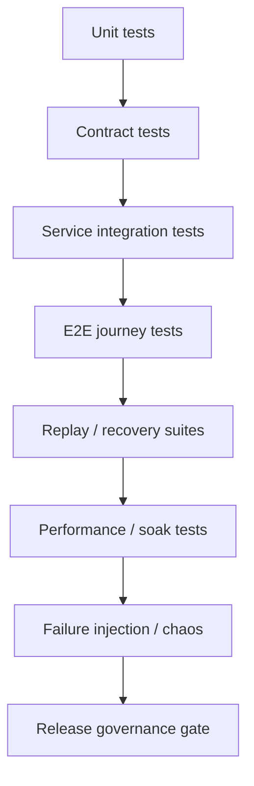
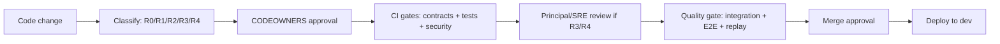
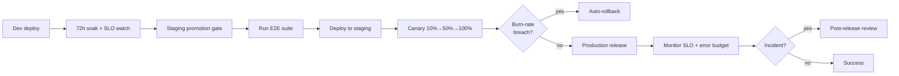
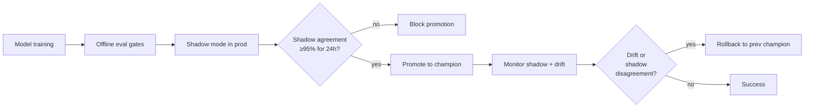
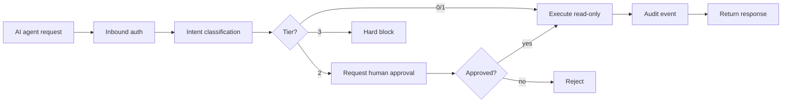

# InstaCommerce — Platform-Wise Implementation Guide (Iteration 3 Synthesis)

**Date:** 2026-03-07  
**Iteration:** 3  
**Audience:** CTO, Principal Engineers, Staff Engineers, Platform Leads, SRE, Security, Data/ML Leads, AI Platform  
**Scope:** Unified platform implementation roadmap synthesizing contracts, security, infra/GitOps, observability, testing governance, data correctness, ML productionization, and AI governance from the Iteration 3 review set.

**Companion documents:**
- `docs/reviews/PRINCIPAL-ENGINEERING-IMPLEMENTATION-GUIDE-PLATFORM-WISE-2026-03-06.md` (root-level platform guide)
- `docs/reviews/iter3/platform/*.md` (nine deep-dive platform docs)
- `docs/reviews/iter3/diagrams/*.md` (HLD, flows, sequences)
- `docs/reviews/iter3/benchmarks/*.md` (best practices, operator patterns)
- `docs/reviews/iter3/appendices/validation-rollout-playbooks.md` (rollout procedures)

---

## 0. Executive summary

Iteration 3 delivered a blunt verdict: **InstaCommerce has many of the right platform primitives, but they are not yet enforcing truth.**

The repo includes:
- Istio mTLS and authorization policies
- GitOps with Helm and ArgoCD
- centralized contracts with JSON Schema and Protobuf
- outbox + Debezium + Kafka eventing
- dbt/Airflow data platform
- ML training and serving scaffolding
- AI orchestration with LangGraph and policy stubs

But these primitives remain **under-governed**:
- shared tokens bypass trust boundaries
- contract drift escapes into production
- CI and deploy paths reference mismatched artifacts
- SLOs and error budgets are not enforced as release gates
- event-time correctness gaps poison downstream data and ML
- AI governance is documented but not yet wired into runtime controls

**The platform program is therefore not "add more tooling." It is: make the existing guardrails strong enough to make the rest of the repo trustworthy.**

This guide synthesizes nine platform domains—truth/ownership, contracts, security, infra/GitOps, observability, testing governance, data correctness, ML productionization, and AI governance—into a **unified implementation sequence** with explicit dependencies, blocking conditions, and references back to the underlying Iteration 3 documentation.

---

## 1. The platform control model

```mermaid
flowchart TD
    subgraph "Platform Control Loop"
        T[Truth & Ownership<br/>CODEOWNERS + ADRs] --> C[Contracts & Events<br/>Schema + Topics]
        C --> S[Security & Trust<br/>mTLS + Authz]
        S --> I[Infra & GitOps<br/>CI → ArgoCD]
        I --> O[Observability<br/>SLO + Burn Alerts]
        O --> Q[Quality Gates<br/>Contract + E2E + Replay]
        Q --> D[Data Correctness<br/>Event-Time + Idempotency]
        D --> M[ML Productionization<br/>Lineage + Shadow + Rollback]
        M --> A[AI Governance<br/>Policy + Audit + HITL]
        A --> Release[Release Decision]
        Release --> Monitor[Monitor in Production]
        Monitor --> Learn[Post-Release Review]
        Learn --> T
    end
```



**Interpretation:** Each platform domain enforces the one before it. Security cannot work without truthful contracts. Observability cannot protect you without real security boundaries. Data correctness depends on all of the above. AI governance requires every prior layer to be production-grade first.

---

## 2. Platform priorities and dependencies

| Priority | Platform Domain | Must-Have Before | Blocking Condition | Primary Iter3 Reference |
|---|---|---|---|---|
| **P0** | Truth & Ownership | nothing | no blocking CI/deploy without this | `platform/repo-truth-ownership.md` |
| **P1** | Contracts & Events | truth + ownership | schema drift blocks all integrations | `platform/contracts-event-governance.md` |
| **P1** | Security & Trust | contracts | shared-token bypass blocks trust model | `platform/security-trust-boundaries.md` |
| **P1** | Infra & GitOps | truth + security | CI/deploy drift blocks promotion safety | `platform/infra-gitops-release.md` |
| **P1** | Observability & SRE | infra + security | no SLO/rollback blocks safe change | `platform/observability-sre.md` |
| **P2** | Testing Governance | contracts + observability | unsafe money/dispatch paths block scale | `platform/testing-quality-governance.md` |
| **P2** | Data Correctness | contracts + infra | event-time errors poison all downstream | `platform/data-platform-correctness.md` |
| **P2** | ML Productionization | data correctness + observability | drift and shadow gaps block trust | `platform/ml-platform-productionization.md` |
| **P3** | AI Governance | all of the above | autonomy without controls is liability | `platform/ai-agent-governance.md` |

**Critical interpretation:** You cannot skip P0 and P1. Data, ML, and AI governance are real platform needs, but they presume the earlier layers are production-grade. If the platform still has shared-token bypass, contract drift, and broken deploy lineage, then adding more ML gates will not make the system safer.

---

## 3. Truth, ownership, and documentation governance

### 3.1 The control problem

**Source:** `docs/reviews/iter3/platform/repo-truth-ownership.md`

The repo already has many sources of truth, but they contradict each other:
- `settings.gradle.kts` lists services that CI does not validate
- Helm values reference services absent from CI filters
- `actions/checkout@v6` does not exist; CI uses a nonexistent GitHub Action version
- some Go module names differ from their Helm deploy keys without documented mapping
- no `CODEOWNERS` file exists
- no ADR directory or change-class policy exists
- docs maturity and ownership are implicit

### 3.2 Canonical truth sources (definitive table)

| Domain | Canonical Source | Enforcement Point | Who Approves Changes |
|---|---|---|---|
| Service inventory | `settings.gradle.kts` (Java), `services/*/go.mod` (Go), `services/ai-*/requirements.txt` (Python) | CI path filters + Helm values | Platform + Service Owner |
| Event schemas | `contracts/schemas/*.json`, `contracts/protos/*.proto` | CI contract validation job | Platform + Domain Owner |
| Deployment artifacts | Helm `values-{env}.yaml` + ArgoCD apps | ArgoCD sync + image provenance | Platform + SRE |
| Security policy | Istio AuthorizationPolicy + `INTERNAL_SERVICE_TOKEN` | Mesh runtime + service auth filters | Security + Platform |
| Data semantics | `data-platform/dbt/models/*.sql`, feature definitions in `ml/feature_store/` | dbt test + feature freshness | Data Platform + ML Owner |
| Operational thresholds | SLO definitions in `monitoring/prometheus/*.yaml` | Prometheus recording rules + alerts | SRE + Service Owner |
| AI/ML behavior | Model registry, shadow agreement, AI policy code in `ai-orchestrator-service/app/policy/` | Airflow promotion gates + runtime policy | ML Platform + AI Platform |
| Architecture decisions | `docs/adrs/ADR-NNN-<title>.md` | CODEOWNERS review | Principal + relevant domain owner |

### 3.3 Implementation sequence

#### Wave 0.1: Fix broken CI and deploy references
- replace `actions/checkout@v6` with `@v4` in `.github/workflows/ci.yml`
- add missing Python AI service path filters and build/test jobs
- add `contracts` path filter and validation job
- add Go-to-Helm deploy key mapping table to CI or `deploy/helm/README.md`
- validate every Helm service exists in CI service matrix

**Exit criteria:** CI completes without errors; every service in Helm is validated by CI or explicitly marked as unmanaged.

**Reference:** `repo-truth-ownership.md` § 6 (CI path coverage remediation)

#### Wave 0.2: Establish ownership
- create `.github/CODEOWNERS` with platform, service, data/ML, AI, and docs owners
- require CODEOWNERS approval for platform and contract changes via branch protection
- create `docs/adrs/` directory with `README.md` index
- define change classes: R0 (docs/refactor), R1 (additive service change), R2 (contract/cross-service), R3 (money/dispatch/auth), R4 (data/ML/AI semantics)

**Exit criteria:** every PR touching platform surfaces requires CODEOWNERS approval; change class is explicit in PR template or label.

**Reference:** `repo-truth-ownership.md` § 4, 5

#### Wave 0.3: Align documentation governance
- update `docs/README.md` to reference `docs/reviews/iter3/` as the authoritative review set
- annotate immature or aspirational architecture claims in existing docs
- treat unverified architecture claims as defects, not style issues

**Exit criteria:** `docs/README.md` becomes the canonical engineering doc index; no doc claims features not yet in code without explicit "planned" or "aspirational" labels.

**Reference:** `repo-truth-ownership.md` § 3.7, 3.8

---

## 4. Contracts and event governance

### 4.1 The control problem

**Source:** `docs/reviews/iter3/platform/contracts-event-governance.md`

The repo has three incompatible event envelope definitions:
1. `contracts/schemas/EventEnvelope.v1.json` (8 fields)
2. some outbox tables have 11+ columns with inconsistent naming
3. some Kafka consumers expect different headers vs. body structure

Schema changes are not compatibility-tested. Producers and consumers can drift silently. Topic names are sometimes string literals instead of constants.

### 4.2 Canonical envelope standard

All events must use this envelope:

```json
{
  "event_id": "uuid",
  "event_type": "domain.EntityAction",
  "aggregate_id": "entity-uuid",
  "schema_version": "1",
  "source_service": "service-name",
  "correlation_id": "trace-id",
  "timestamp": "ISO8601 event-time",
  "payload": { "domain-specific": "data" }
}
```

**Kafka strategy:** envelope fields go in message body (not headers) because Kafka Streams, dbt event parsing, and cross-language consumers all need uniform deserialization. Headers remain for tracing (`trace-id`, `span-id`, `user-id`).

**Outbox table standard:** every outbox table must have exactly these columns:
- `id` (PK)
- `aggregate_type`, `aggregate_id`
- `event_type`, `event_id`
- `payload` (JSONB)
- `correlation_id`
- `timestamp` (event time)
- `created_at` (outbox insertion time)
- `processed` (boolean)

**Reference:** `contracts-event-governance.md` § Part 2

### 4.3 Compatibility policy

| Artifact Type | Allowed Changes | Prohibited Changes | Versioning Rule |
|---|---|---|---|
| JSON Schema event | add optional field, widen enum | remove field, change type, require existing optional field | additive = same version; breaking = new `vN` schema |
| Protobuf message | add optional field, add new oneof arm | remove field, change wire type, reuse field number | same: consumers tolerate; breaking = new package |
| Topic name | none | rename topic, change partition key semantic | treat as immutable; dual-publish during migration |

**Schema version validation:** consumers must check `schemaVersion` field and reject or DLT events from unsupported versions. Do not rely on silent forward compatibility.

**Reference:** `contracts-event-governance.md` § Part 3

### 4.4 CI validation gates

Add four CI jobs triggered by changes to `contracts/**`:

1. **Proto breaking-change check** (buf breaking)
2. **JSON Schema compatibility diff** (Python script compares current vs. `main`)
3. **Contract consumer tests** (producer fixtures must deserialize in all known consumers)
4. **Topic name constant validation** (grep enforces `TopicNames.FOO` instead of string literals)

**Blocking condition:** no contract change ships without passing all four gates + CODEOWNERS approval.

**Reference:** `contracts-event-governance.md` § Part 4

### 4.5 Implementation sequence

#### Wave 1.1: Unify envelope standard
- update `contracts/schemas/EventEnvelope.v1.json` to canonical 8-field version
- audit all outbox tables; add missing envelope columns
- audit all Kafka producers; align to canonical envelope
- audit all consumers; enforce envelope presence

**Exit criteria:** zero producers or consumers use non-canonical envelopes.

#### Wave 1.2: Wire CI validation
- add four contract CI jobs
- gate merges on passing contract suite
- add CODEOWNERS requirement for `contracts/**`

**Exit criteria:** contract drift blocked at CI time, not runtime.

#### Wave 1.3: Add consumer schema-version checks
- every consumer checks `schemaVersion` field
- unsupported versions go to DLT, not silent failure

**Exit criteria:** schema version mismatch is observable and non-blocking to other events.

**Reference:** `contracts-event-governance.md` § Part 4.2, 4.3

---

## 5. Security and trust boundaries

### 5.1 The control problem

**Source:** `docs/reviews/iter3/platform/security-trust-boundaries.md`

The repo has mTLS `STRICT` mode and Istio AuthorizationPolicies, but:
- **shared `INTERNAL_SERVICE_TOKEN`** bypasses all service-to-service trust boundaries
- `INTERNAL_SERVICE_TOKEN` carries `ROLE_ADMIN`, allowing any internal service to act as admin
- no default-deny AuthorizationPolicy exists
- JWKS endpoint caching creates rotation risk
- some admin routes lack separate auth beyond standard user JWT

### 5.2 Trust boundary map

| Boundary | Inbound Identity | Enforcement Point | Current Gap |
|---|---|---|---|
| External → mobile-bff | User JWT from identity-service | Spring Security filter + Istio Authz | weak: no rate limit per user |
| External → admin-gateway | Admin JWT from identity-service | filter + Authz | weak: no separate admin RBAC |
| Service → Service (Java) | `INTERNAL_SERVICE_TOKEN` | `InternalServiceAuthFilter` | **critical: shared token + ROLE_ADMIN** |
| Service → Service (Go) | `INTERNAL_SERVICE_TOKEN` | `InternalAuthMiddleware` | **critical: shared token** |
| Temporal workflow → service | `INTERNAL_SERVICE_TOKEN` | same filters | **critical: no workflow-scoped principal** |
| Kafka consumer → service | none (async) | no auth enforced | acceptable for now if Kafka is internal-only |
| AI orchestrator → tools | no tool permission check | missing | **high: any intent can call any tool** |

### 5.3 Implementation sequence

#### Wave 1.1: Harden shared-token usage (immediate)
- replace `String.equals()` with constant-time comparison in Java `InternalServiceAuthFilter`
- replace `==` with `subtle.ConstantTimeCompare()` in Go `InternalAuthMiddleware`
- remove `ROLE_ADMIN` from internal service principal; create separate `ROLE_INTERNAL_SERVICE`
- audit and restrict admin-only endpoints to require explicit admin JWT

**Exit criteria:** timing attacks against shared token mitigated; admin authority separated from service-to-service authority.

**Reference:** `security-trust-boundaries.md` § 6

#### Wave 1.2: Add default-deny Istio policy
- create `deploy/helm/templates/istio/authz-deny-default.yaml`:
  ```yaml
  apiVersion: security.istio.io/v1beta1
  kind: AuthorizationPolicy
  metadata:
    name: deny-all-default
    namespace: instacommerce
  spec:
    action: DENY
    rules:
    - {} # deny all traffic not explicitly allowed
  ```
- add per-service allow policies for known ingress paths

**Exit criteria:** zero service-to-service traffic succeeds without explicit AuthorizationPolicy allow rule.

**Reference:** `security-trust-boundaries.md` § 5

#### Wave 1.3: Fix JWKS caching and rotation
- reduce JWKS cache TTL to 5 minutes
- implement key rotation procedure: publish new key, dual-sign for 10 minutes, retire old key
- add Prometheus metric for JWT signature failures

**Exit criteria:** key rotation does not cause service disruption.

**Reference:** `security-trust-boundaries.md` § 3

#### Wave 2.1: Replace shared token with per-service tokens (medium-term)
- mint per-service tokens with service name in claims
- update filters to validate calling service identity matches expected caller
- store per-service tokens in Kubernetes secrets, rotate monthly

**Exit criteria:** service A cannot impersonate service B with a single shared credential.

**Reference:** `security-trust-boundaries.md` § 6.3

#### Wave 3.1: Adopt SPIFFE/SPIRE (long-term)
- replace JWT-based service auth with SPIFFE SVIDs
- use Istio + SPIRE integration for automatic workload identity
- retire `INTERNAL_SERVICE_TOKEN` entirely

**Exit criteria:** zero services use static shared tokens; all service identity is cryptographically bound to workload.

**Reference:** `security-trust-boundaries.md` § 6.4

---

## 6. Infra, GitOps, and release engineering

### 6.1 The control problem

**Source:** `docs/reviews/iter3/platform/infra-gitops-release.md`

CI and deployment paths reference mismatched artifacts:
- Go services are tested but not always built into images on `main` push
- `deploy-dev` job updates image tags in `deploy/helm/values-dev.yaml` but commits are not always signed or traceable
- no image provenance attestation exists
- environment promotion gates are manual and undocumented
- canary config exists in Helm but is not wired into progressive delivery

### 6.2 Canonical delivery pipeline

```mermaid
flowchart LR
    Commit[Git commit] --> CI[CI: build + test + scan]
    CI --> Image[Push image with SHA tag]
    Image --> Attest[Sign + attest provenance]
    Attest --> DevTag[Update values-dev.yaml]
    DevTag --> ArgoCD[ArgoCD auto-sync dev]
    ArgoCD --> Soak[72h soak + SLO watch]
    Soak --> Promote[Manual promote to staging]
    Promote --> Canary[Canary 10% → 50% → 100%]
    Canary --> Prod[Production release]
```



### 6.3 Implementation sequence

#### Wave 1.1: Fix Go image build gap
- add Docker build step to `go-build-test` job on `main` push
- push Go images with commit SHA tag to `gcr.io/instacommerce`

**Exit criteria:** every Go service has a built and pushed image for every `main` commit.

**Reference:** `infra-gitops-release.md` § 2.3

#### Wave 1.2: Add image provenance and signing
- use `cosign` to sign images after push
- attach SLSA provenance with build metadata (commit SHA, workflow run ID, timestamp)
- add Trivy scan job gated on HIGH/CRITICAL CVE threshold

**Exit criteria:** only signed images with passing scans can be deployed to staging and prod.

**Reference:** `infra-gitops-release.md` § 3

#### Wave 1.3: Improve deploy-dev commit hygiene
- sign `deploy-dev` commits with `GIT_AUTHOR_NAME="InstaCommerce CI"` and GPG key
- include workflow run URL in commit message

**Exit criteria:** every dev image tag update is traceable to a specific CI run.

**Reference:** `infra-gitops-release.md` § 2.4

#### Wave 2.1: Wire staging promotion gate
- create GitHub Actions workflow `promote-to-staging.yml` (manual trigger)
- require passing E2E test suite + SLO review sign-off
- copy image tag from `values-dev.yaml` to `values-staging.yaml`

**Exit criteria:** no staging promotion without explicit gate approval.

**Reference:** `infra-gitops-release.md` § 4

#### Wave 2.2: Wire canary deployment
- enable Istio `VirtualService` + `DestinationRule` canary config for Tier 0 services (checkout, payment, order, inventory)
- add Flagger or Argo Rollouts for automated canary progression (10% → 50% → 100% over 30 minutes)
- add rollback trigger on burn-rate breach

**Exit criteria:** money-path services always deploy via canary; instant rollback on SLO breach.

**Reference:** `infra-gitops-release.md` § 6

#### Wave 3.1: Split monolithic Helm chart (optional, reduces blast radius)
- create per-service Helm charts under `deploy/helm/services/<service-name>/`
- use ArgoCD ApplicationSet to manage all services
- preserve shared `values-common.yaml` for platform config

**Exit criteria:** one service's Helm change does not require re-rendering all other services.

**Reference:** `infra-gitops-release.md` § 5.2

---

## 7. Observability and SRE

### 7.1 The control problem

**Source:** `docs/reviews/iter3/platform/observability-sre.md`

The repo has metrics and logs, but:
- no formal SLO definitions exist
- no error budgets or burn-rate alerts exist
- trace context is not propagated through Kafka
- Python AI services do not emit OTLP traces
- no SLO-based release governance exists

### 7.2 SLI and SLO table

| Service Tier | SLI | Target SLO | Measurement Window | Burn-Rate Alert |
|---|---|---|---|---|
| Tier 0 (checkout, payment, order, inventory) | availability: `1 - (5xx / total)` | 99.9% | 30 days | 1h: 14.4x burn<br/>6h: 6x burn |
| Tier 0 | latency: `p99 ≤ 2s` | 99% | 30 days | same |
| Tier 1 (dispatch, fulfillment, wallet, fraud) | availability | 99.5% | 30 days | 1h: 7.2x burn |
| Kafka consumers | lag: `offset_lag < 500` | 99% | 7 days | 1h: 14.4x burn |
| Temporal checkout workflow | success: `completed_ok / started` | 99.5% | 30 days | 1h: 7.2x burn |
| Data pipeline (dbt) | freshness: `time_since_last_run < 3600s` | 99% | 7 days | 2h: 7x burn |

**Reference:** `observability-sre.md` § 2, 3

### 7.3 Implementation sequence

#### Wave 1.1: Define and record SLIs
- add Prometheus recording rules for each SLI (availability, latency, lag, freshness)
- validate recording rules produce correct time series

**Exit criteria:** every Tier 0 and Tier 1 service has queryable SLI metrics in Prometheus.

**Reference:** `observability-sre.md` § 3.2

#### Wave 1.2: Wire burn-rate alerts
- create multi-window burn-rate alert rules (1h fast burn + 6h slow burn)
- route to PagerDuty for Tier 0 services
- require alert acknowledgment before promotion to next environment

**Exit criteria:** SLO breach triggers page; no staging promotion while alerts are firing.

**Reference:** `observability-sre.md` § 4

#### Wave 1.3: Fix trace context propagation
- add Kafka trace context propagation in Java producers (inject `traceparent` header)
- extract `traceparent` in consumers and continue trace
- enable OTLP in Python AI services (OpenTelemetry SDK)

**Exit criteria:** end-to-end trace spans cross Kafka topic boundaries and include AI inference.

**Reference:** `observability-sre.md` § 5

#### Wave 2.1: Deploy OTEL Collector
- add `deploy/helm/templates/otel-collector.yaml` as DaemonSet
- configure tail-based sampling (100% for errors, 1% for success in low-value paths)
- export to Tempo or Cloud Trace

**Exit criteria:** distributed traces available in trace backend without overwhelming ingest cost.

**Reference:** `observability-sre.md` § 6

#### Wave 2.2: Implement error budget policy
- calculate 30-day error budget remaining per service
- freeze low-priority releases when error budget < 10%
- require Principal/SRE approval for any release when budget < 5%

**Exit criteria:** error budget becomes a first-class release governance input.

**Reference:** `observability-sre.md` § 3.3

---

## 8. Testing and quality governance

### 8.1 The control problem

**Source:** `docs/reviews/iter3/platform/testing-quality-governance.md`

Many of the most serious Iteration 3 defects were not subtle architecture problems—they were **defects that good quality governance should have caught**:
- dual checkout authority survived into production
- payment pending-state recovery gaps lacked replay tests
- catalog-to-search indexing truth broke without a blocking signal

The testing problem is not "add more unit tests." It is: **define what must never break, and wire those guarantees into blocking gates.**

### 8.2 Quality stack by layer



**Interpretation:** the layers are cumulative, not substitutable. Strong unit coverage does not excuse missing contract or replay tests.

### 8.3 Change classes and required gates

| Change Class | Examples | Required Gates | Approval |
|---|---|---|---|
| **R0** | docs-only, low-risk internal refactor | local tests + code review | standard reviewer |
| **R1** | additive service logic | unit + targeted integration | service owner |
| **R2** | contract or cross-service change | contract + integration + replay | CODEOWNERS |
| **R3** | money path, dispatch, inventory, auth | contract + integration + E2E + replay + performance + canary | Principal/SRE + CODEOWNERS |
| **R4** | data semantics, model promotion, AI behavior | quality gates + shadow/canary + governance approval | Principal + Data/ML/AI owner |

**Reference:** `testing-quality-governance.md` § 10

### 8.4 Implementation sequence

#### Wave 0: Wire contract tests (dependency for all later work)
- see § 4.4 (CI validation gates)

#### Wave 1.1: Money-path integration suites
- add integration tests for:
  - checkout submit with deterministic idempotency key
  - payment authorize + capture + compensate on failure
  - inventory reserve + confirm + cancel
  - reconciliation with mismatch repair
- require passing suite for any R3 change

**Exit criteria:** no money-path change ships without integration test coverage.

**Reference:** `testing-quality-governance.md` § 6

#### Wave 1.2: Webhook and outbox replay tests
- add replay suite for payment webhook duplicates (expect zero duplicate ledger mutations)
- add replay suite for outbox resend (expect consumer deduplication)

**Exit criteria:** replay safety is proven before production, not discovered in production.

**Reference:** `testing-quality-governance.md` § 7

#### Wave 2.1: E2E critical-flow tests
- add E2E tests for:
  - browse → cart → checkout → payment → order confirmation
  - pick → pack → dispatch → ETA → delivery
- run on every staging promotion

**Exit criteria:** no staging promotion without passing E2E suite.

**Reference:** `testing-quality-governance.md` § 6

#### Wave 2.2: Performance gates for checkout and payment
- add load test asserting p95 checkout latency ≤ 1.5s, p99 ≤ 2s under 100 concurrent users
- gate R3 changes on passing performance suite

**Exit criteria:** latency regressions are blocked at CI time, not discovered in production.

**Reference:** `testing-quality-governance.md` § 8

#### Wave 3: Failure-injection discipline
- add chaos tests for:
  - PSP timeout during capture
  - Redis unavailable during feature flag lookup
  - Kafka consumer poison message
- require at least one injected failure path proven for Tier 0 releases

**Exit criteria:** rollback and resilience assumptions are tested, not assumed.

**Reference:** `testing-quality-governance.md` § 7.2

---

## 9. Data platform correctness

### 9.1 The control problem

**Source:** `docs/reviews/iter3/platform/data-platform-correctness.md`

Event-time and idempotency errors in the data platform poison all downstream decisions:
- Beam pipelines use processing time instead of event time
- no watermarks or allowed lateness exist
- BigQuery writes are append-only, not idempotent
- dbt models do not reconcile late data
- no data quality gates exist in Airflow

### 9.2 Event-time correctness strategy

| Layer | Current Behavior | Required Fix | Implementation |
|---|---|---|---|
| Beam ingestion | processing time | use event timestamp from Kafka message | `.withTimestampFn(ctx -> parseTimestamp(ctx.element().get("timestamp")))` |
| Beam windowing | tumbling with no lateness | add watermark + allowed lateness | `.withAllowedLateness(Duration.standardMinutes(15))` + side output for late data |
| BigQuery write | append-only | idempotent MERGE | write to staging table with `(partition_date, event_id)` PK; MERGE into final table |
| dbt incremental | static lookback | late-data reconciliation | add 2-day lookback window + explicit late-data reconciliation step |

**Reference:** `data-platform-correctness.md` § 1

### 9.3 Implementation sequence

#### Wave 1.1: Fix event-time semantics in Beam
- assign event timestamps from `timestamp` field in Kafka message
- add watermark with 5-minute delay
- add allowed lateness of 15 minutes
- route late data to side output → separate BigQuery table `*_late`

**Exit criteria:** late events are observable and reconcilable, not silently dropped.

**Reference:** `data-platform-correctness.md` § 1.3

#### Wave 1.2: Add BigQuery write idempotency
- change Beam BigQuery sink to write to staging table with Kafka offset metadata
- add dbt post-processing step (or scheduled query) to MERGE staging → final table on `(partition_date, event_id)` PK
- add late-data reconciliation dbt model to MERGE `*_late` tables back into final tables

**Exit criteria:** replaying Kafka does not create duplicate rows in BigQuery.

**Reference:** `data-platform-correctness.md` § 3

#### Wave 2.1: Add dbt quality gates
- add dbt tests for:
  - event-time gap detection (no 5-minute gaps in `order_created_at` sequence)
  - cross-table consistency (order revenue matches payment capture totals within 1%)
  - freshness SLA (block dbt run if source freshness > 2 hours)
- wire dbt test failures into Airflow task failure

**Exit criteria:** data quality regressions block pipeline progression.

**Reference:** `data-platform-correctness.md` § 4

#### Wave 2.2: Add reconciliation engine
- create `data-platform-jobs/reconciliation-service` (batch job)
- compare order totals from operational DB vs. data warehouse vs. payment ledger
- emit discrepancies to Slack + create Jira tickets
- run daily

**Exit criteria:** financial correctness gaps are detected within 24 hours.

**Reference:** `data-platform-correctness.md` § 5

---

## 10. ML platform productionization

### 10.1 The control problem

**Source:** `docs/reviews/iter3/platform/ml-platform-productionization.md`

The ML platform has training pipelines and shadow mode, but:
- promoted artifacts are not always the ones actually serving
- shadow agreement is not durable or queryable
- no rollback-to-previous-champion mechanism exists
- offline-online feature skew is not validated

### 10.2 ML productionization checklist

| Capability | Current State | Required State | Implementation |
|---|---|---|---|
| Model artifacts | training outputs to GCS, but serving may load stale | immutable GCS path pinned by version | `gs://instacommerce-ml-models/eta-prediction/v1.2.3/model.onnx` |
| Shadow mode | in-memory, ephemeral | durable Redis state + Prometheus metrics | persist shadow routing % and agreement metrics |
| Promotion gate | manual or offline-metric-only | offline + shadow agreement + lineage | Airflow sensor waits for 95% shadow agreement over 24h |
| Rollback | unclear | one-command rollback to previous champion | update `ml/serving/model_registry.yaml` → redeploy predictor |
| Feature consistency | no validation | hash-based offline-online consistency check | compare feature hash from training vs. online store |

**Reference:** `ml-platform-productionization.md` § 0

### 10.3 Implementation sequence

#### Wave 1.1: Fix model artifact serving
- update `ml/serving/predictor.py` to load ONNX from versioned GCS path in `model_registry.yaml`
- validate loaded model hash matches training output

**Exit criteria:** serving always loads the intended model version.

**Reference:** `ml-platform-productionization.md` § 0

#### Wave 1.2: Make shadow mode durable
- persist shadow routing config in Redis (`shadow:eta-prediction:enabled`, `shadow:eta-prediction:sample_rate`)
- emit Prometheus metrics: `ml_shadow_agreement_rate`, `ml_shadow_latency_diff`
- add Grafana dashboard for shadow metrics

**Exit criteria:** shadow agreement is queryable and survives predictor restarts.

**Reference:** `ml-platform-productionization.md` § 4.2, 4.3

#### Wave 2.1: Wire promotion gate
- add Airflow sensor in `ml_training.py` DAG:
  - wait for shadow agreement ≥ 95% over 24 hours
  - wait for offline AUC ≥ 0.85
  - wait for bias metric ≤ threshold (if applicable)
- on passing gate, promote model by updating `model_registry.yaml` and triggering predictor redeploy

**Exit criteria:** no model promotion without durable shadow validation.

**Reference:** `ml-platform-productionization.md` § 3.2, 4.5

#### Wave 2.2: Add rollback mechanism
- maintain `previous_champion` pointer in `model_registry.yaml`
- create runbook script `scripts/rollback-ml-model.sh` that updates registry and redeploys

**Exit criteria:** rollback takes < 5 minutes and is scriptable, not manual.

**Reference:** `ml-platform-productionization.md` (implied in § 0)

#### Wave 3.1: Validate offline-online feature consistency
- add Airflow task after online feature store push: sample 1000 entities, compare feature values from offline (BigQuery) vs. online (Redis/Firestore)
- fail if feature hash mismatch rate > 1%

**Exit criteria:** feature skew is detected before model training, not after deployment.

**Reference:** `ml-platform-productionization.md` § 2.3

---

## 11. AI agent governance

### 11.1 The control problem

**Source:** `docs/reviews/iter3/platform/ai-agent-governance.md`

The AI orchestration layer exists but lacks production controls:
- no inbound authentication on `ai-orchestrator-service` or `ai-inference-service`
- tool permissions are not enforced (any intent can call any tool)
- no durable approval workflow exists for high-risk intents
- prompt injection detection is not fail-closed
- audit trail is incomplete

### 11.2 AI governance policy (target state)

| Tier | Autonomy Level | Tool Allowlist | Approval Required | Examples |
|---|---|---|---|---|
| **Tier 0** | fully autonomous | read-only: search, retrieve, rank | none | support agent answering FAQ, retrieval assistant |
| **Tier 1** | propose-only | Tier 0 + analyze, summarize | none | incident investigation, log analysis |
| **Tier 2** | human-in-loop | Tier 1 + config read, non-prod write | required before execution | staging deploy suggestion, test case generation |
| **Tier 3** | not allowed yet | any production write, payment, inventory, dispatch | always blocked | order creation, refund issuance |

**Hard-block intents** (never serve autonomously, regardless of tier):
- issue refund
- modify payment
- update inventory authority
- change dispatch assignment

**Reference:** `ai-agent-governance.md` § 3.2

### 11.3 Implementation sequence

#### Wave 1.1: Add inbound authentication (P0 — currently missing)
- add JWT validation to `ai-orchestrator-service/app/api/handlers.py` (validate against identity-service JWKS)
- add `INTERNAL_SERVICE_TOKEN` validation to `ai-inference-service/app/main.py`
- require `Authorization` header on all endpoints

**Exit criteria:** zero unauthenticated requests can reach AI services.

**Reference:** `ai-agent-governance.md` § 7

#### Wave 1.2: Wire tool permission enforcement
- implement `app/policy/agent_policy.py` with tier-to-tool mapping
- update `ToolRegistry.is_allowed()` to check policy before tool invocation
- add audit event on tool permission denial

**Exit criteria:** Tier 0 agents cannot call write tools; Tier 3 tools are always blocked.

**Reference:** `ai-agent-governance.md` § 5

#### Wave 1.3: Fail-closed prompt injection detection (P0)
- add injection pattern detection before LLM call (check for `SYSTEM:`, `</s>`, role confusion)
- reject requests with detected patterns (do not pass to LLM)
- log rejection as security event

**Exit criteria:** known injection patterns are blocked, not tolerated.

**Reference:** `ai-agent-governance.md` § 8.1

#### Wave 2.1: Implement durable approval workflow
- replace in-memory approval stub with Redis-backed state machine
- add approval request API: `POST /approvals/{request_id}/approve`
- require approval for Tier 2+ intents before emitting side effects

**Exit criteria:** high-risk intents wait for human approval; approval decisions are durable.

**Reference:** `ai-agent-governance.md` § 4.2

#### Wave 2.2: Complete audit trail
- log every agent invocation to structured log with: user, intent, tier, tools called, approval decision, outcome
- forward audit events to BigQuery for compliance queries
- add Grafana dashboard for AI usage metrics (requests/day, approval rate, tool call distribution)

**Exit criteria:** every AI action is auditable; compliance queries are answerable.

**Reference:** `ai-agent-governance.md` § 6

#### Wave 3.1: Add PII vault lifecycle (P1)
- redact PII (email, phone, address) before LLM calls
- store redacted values in short-TTL Redis vault
- rehydrate PII in response before returning to user

**Exit criteria:** LLM never sees raw PII; PII is not logged.

**Reference:** `ai-agent-governance.md` § 8.2

---

## 12. Implementation wave summary

This table synthesizes the wave recommendations from all nine platform domains:

| Wave | Outcome | Platform Domains Addressed | Exit Criteria | Blocking Dependencies |
|---|---|---|---|---|
| **Wave 0** | Truthful CI, ownership, deploy lineage | Truth, Contracts, Infra | CI completes without errors; CODEOWNERS enforced; every service in Helm validated by CI | none |
| **Wave 1** | Secure trust boundaries and money-path rollout safety | Security, Contracts, Observability, Testing, Infra, AI (P0 gaps) | Shared-token timing attack fixed; default-deny Authz policy; contract CI gates; burn-rate alerts; money-path integration tests; AI inbound auth | Wave 0 |
| **Wave 2** | Logistics correctness, data event-time, ML shadow gates | Testing, Data, ML, Infra, Observability | Replay tests; DLT for poison messages; event-time watermarks; BigQuery idempotency; durable shadow mode; canary deployments | Wave 1 |
| **Wave 3** | Customer-facing decision surfaces hardened | Security, Testing, Data, ML, AI | Per-service tokens; E2E tests; dbt quality gates; offline-online feature consistency; AI approval workflow | Wave 2 |
| **Wave 4** | Contracts, eventing, data, ML become fully governable | Contracts, Data, ML | Schema-version checks in consumers; late-data reconciliation; ML lineage; rollback-to-previous-champion | Wave 3 |
| **Wave 5** | SLOs and error budgets become operating language | Observability, Testing | Error budget policy; performance gates; failure injection; trace context through Kafka | Wave 4 |
| **Wave 6** | AI expands under enforced policy | AI | PII vault; tier-based autonomy limits; Tier 2+ only after all prior controls proven | Wave 5 |

**Critical sequencing rule:** You cannot skip Wave 0 and Wave 1. Wave 2+ may be partially parallelized within platform teams, but no Wave N depends only on Wave N-1; many dependencies reach back to Wave 0 and Wave 1 foundations.

---

## 13. Cross-domain governance loops

### 13.1 Change submission loop



### 13.2 Release promotion loop



### 13.3 Data/ML promotion loop



### 13.4 AI governance loop



**Interpretation:** Every high-risk change traverses multiple governance loops. A money-path service change must pass change submission, release promotion, and observability feedback loops. An ML promotion must pass data quality, ML shadow, and observability loops. AI changes must pass security, audit, and policy loops.

---

## 14. Observability and rollback matrix

| Domain | Primary Metric | Rollback Trigger | Rollback Mechanism | Rollback SLA |
|---|---|---|---|---|
| **Services (Java/Go)** | SLO burn rate | 1h 14.4x burn or 6h 6x burn | Helm rollback to previous image tag + ArgoCD sync | < 5 min |
| **Kafka consumers** | Consumer lag | lag > 1000 for 15 min | rollback consumer deployment + rewind offset if needed | < 10 min |
| **Temporal workflows** | Workflow success rate | success rate < 95% for 1h | deploy previous workflow version; in-flight workflows complete on old version | < 10 min |
| **Data pipelines** | dbt freshness + quality tests | freshness > 2h or test failure | revert dbt code + re-run affected models | < 30 min |
| **ML models** | Shadow agreement rate | agreement < 90% for 2h | update `model_registry.yaml` to `previous_champion` + redeploy predictor | < 5 min |
| **AI agents** | Tool permission denial rate | denial rate > 10% or PII leak detected | disable affected intent tier + rollback orchestrator image | < 5 min |

**Reference:** `appendices/validation-rollout-playbooks.md`, `observability-sre.md` § 0, `testing-quality-governance.md` § 10

---

## 15. Ownership and accountability

### 15.1 Platform domain owners

| Platform Domain | Primary Owner | Escalation Path | CODEOWNERS Path |
|---|---|---|---|
| Truth & CI | Platform Lead | Principal Engineer | `.github/**`, `settings.gradle.kts` |
| Contracts & Events | Platform Lead | Principal + Domain Owners | `contracts/**` |
| Security & Trust | Security Lead | Principal + CTO | `deploy/helm/templates/istio/**`, auth filters |
| Infra & GitOps | SRE Lead | Platform Lead | `.github/workflows/**`, `infra/**`, `argocd/**` |
| Observability | SRE Lead | Principal Engineer | `monitoring/**`, `deploy/helm/templates/otel-collector.yaml` |
| Testing Governance | Platform Lead + SRE | Principal Engineer | test frameworks, CI test gates |
| Data Platform | Data Platform Lead | Principal + Data Architect | `data-platform/**` |
| ML Platform | ML Platform Lead | Principal + ML Architect | `ml/**` |
| AI Governance | AI Platform Lead | Principal + CTO | `services/ai-*/**`, AI policy code |

### 15.2 Change class approval matrix

| Change Class | Service Owner | Platform | Principal/SRE | CTO | Notes |
|---|---|---|---|---|---|
| R0 | approve | — | — | — | docs, refactors |
| R1 | approve | review | — | — | additive service logic |
| R2 | approve | approve | — | — | contracts, cross-service |
| R3 | consult | approve | approve | — | money path, auth, dispatch |
| R4 | consult | approve | approve | notify | data semantics, ML/AI behavior |

**Reference:** `repo-truth-ownership.md` § 4.2

---

## 16. Relationship to service-level reviews

This platform-wise guide governs the **horizontal concerns** (contracts, security, infra, observability, testing, data, ML, AI). The **vertical concerns** (domain logic, state machines, transaction boundaries) are covered in the service-level reviews:

- `docs/reviews/iter3/services/transactional-core.md` (order, payment, inventory, pricing, cart)
- `docs/reviews/iter3/services/fulfillment-logistics.md` (dispatch, rider, warehouse, ETA)
- `docs/reviews/iter3/services/edge-identity.md` (mobile-bff, admin-gateway, identity)
- `docs/reviews/iter3/services/customer-engagement.md` (notification, loyalty, wallet)
- `docs/reviews/iter3/services/read-decision-plane.md` (search, catalog, recommendation)
- `docs/reviews/iter3/services/event-data-plane.md` (CDC, outbox relay, stream processing)
- `docs/reviews/iter3/services/platform-foundations.md` (config, feature flags, fraud, audit)
- `docs/reviews/iter3/services/ai-ml-platform.md` (AI orchestration, inference, training)
- `docs/reviews/iter3/services/inventory-dark-store.md` (dark store ops, replenishment)

**Integration rule:** A service change must satisfy both its service-level review requirements (domain correctness) and this platform guide's requirements (governance, security, observability, testing).

---

## 17. Relationship to diagrams and benchmarks

### 17.1 Diagram references

- **HLD and system context:** `docs/reviews/iter3/diagrams/hld-system-context.md` (six-plane architecture: edge, core domain, async/event, data/ML, AI, governance)
- **Governance and rollout flow:** `docs/reviews/iter3/diagrams/flow-governance-rollout.md` (CI gates, promotion pipeline, rollback decision tree, ADR lifecycle)
- **Data/ML/AI flow:** `docs/reviews/iter3/diagrams/flow-data-ml-ai.md` (event ingestion → data platform → feature store → training → serving → AI orchestration)
- **Edge and checkout detail:** `docs/reviews/iter3/diagrams/lld-edge-checkout.md` (API gateway, BFF, identity, checkout orchestration)
- **Eventing and data detail:** `docs/reviews/iter3/diagrams/lld-eventing-data.md` (outbox, Debezium, Kafka, consumers, Beam, dbt)
- **Checkout-payment sequence:** `docs/reviews/iter3/diagrams/sequence-checkout-payment.md` (order → inventory → payment → reconciliation flows)

### 17.2 Benchmark and pattern references

- **Public best practices:** `docs/reviews/iter3/benchmarks/public-best-practices.md` (Stripe, Shopify, Uber Eats, DoorDash patterns for payment, dispatch, ML, AI governance)
- **Global operator patterns:** `docs/reviews/iter3/benchmarks/global-operator-patterns.md` (DoorDash, Uber Eats, Deliveroo, Glovo)
- **India operator patterns:** `docs/reviews/iter3/benchmarks/india-operator-patterns.md` (Swiggy Instamart, Zepto, Blinkit, Dunzo)
- **AI agent use cases:** `docs/reviews/iter3/benchmarks/ai-agent-use-cases.md` (support automation, ops assistance, incident investigation)

**Usage:** When implementing a platform control (e.g., payment webhook replay, ML shadow mode), consult the benchmark docs to validate against industry patterns. When a pattern deviates from benchmarks, document the rationale in an ADR.

---

## 18. Final platform recommendation

The platform work should be judged by one standard: **does it make the rest of the repo safer to change?**

Right now, the most important platform deliverables are:

1. **Truthful CI and ownership** (Wave 0) — without this, every later control is performative
2. **Enforced contracts and trust boundaries** (Wave 1) — silent drift and shared-token bypass are the two highest-risk platform gaps
3. **Deploy lineage and rollout safety** (Wave 1-2) — CI and deploy must reference the same artifacts; rollback must be fast and scriptable
4. **Burn-rate-based operational control** (Wave 1-2) — SLO breach must block promotion, not just create noise
5. **Event-time and data correctness** (Wave 2-4) — late data and idempotency errors poison all downstream ML and business decisions
6. **Production ML/AI governance** (Wave 2-6) — narrower and stricter than the product ambition; no autonomy without rollback + audit + approval

If these are implemented, the service-level improvements become sustainable. If they are not, the repo will continue to look more mature in architecture diagrams than in production behavior.

---

## 19. Appendices and further reading

### 19.1 Detailed platform implementation docs

All nine platform domains have full implementation guides in `docs/reviews/iter3/platform/`:

- `repo-truth-ownership.md` (39.2 KB) — CODEOWNERS, ADRs, CI repair, doc governance
- `contracts-event-governance.md` (59.7 KB) — envelope standard, compatibility policy, CI validation
- `security-trust-boundaries.md` (51.0 KB) — trust boundary map, shared-token fix, mTLS + Authz, SPIFFE migration
- `infra-gitops-release.md` (58.2 KB) — CI/deploy lineage, image provenance, promotion gates, canary config
- `observability-sre.md` (53.0 KB) — SLI/SLO definitions, burn-rate alerts, trace propagation, OTEL collector
- `testing-quality-governance.md` (410 lines) — change classes, contract/integration/E2E/replay/performance/chaos tests
- `data-platform-correctness.md` (60.5 KB) — event-time correctness, late-data handling, BigQuery idempotency, dbt quality gates, reconciliation
- `ml-platform-productionization.md` (57.8 KB) — lineage, offline-online consistency, training gates, shadow mode, promotion, rollback
- `ai-agent-governance.md` (54.0 KB) — policy, approval workflows, tool permissions, auditability, inbound auth, prompt injection detection, PII vault

### 19.2 Rollout playbooks and validation procedures

- `docs/reviews/iter3/appendices/validation-rollout-playbooks.md` — step-by-step procedures for canary deployments, rollback, incident response, and emergency hotfix processes

### 19.3 Cross-cutting comparison

- `docs/reviews/iter3/appendices/approach-comparison-matrix.md` — trade-off analysis for platform choices (outbox vs. CDC, mTLS vs. JWT, Helm monolith vs. per-service charts, etc.)

### 19.4 Issue register

- `docs/reviews/iter3/appendices/issue-register.md` — structured list of all identified defects, gaps, and risks across the nine platform domains and service clusters, with severity, ownership, and recommended remediation

---

## Document control

| Attribute | Value |
|---|---|
| **Status** | Draft for Principal/Staff review |
| **Iteration** | 3 |
| **Owner** | Platform Lead + Principal Engineer |
| **Reviewers** | CTO, Staff Engineers, SRE Lead, Security Lead, Data/ML Leads, AI Platform Lead |
| **Approval required from** | Principal Engineer, CTO (for Wave 0-1 sequencing) |
| **Next review** | After Wave 0 implementation (CODEOWNERS + CI repair + contract gates) |
| **Supersedes** | `docs/reviews/PRINCIPAL-ENGINEERING-IMPLEMENTATION-GUIDE-PLATFORM-WISE-2026-03-06.md` (root-level guide remains valid; this doc extends it with Iteration 3 depth) |

**Change log:**
- 2026-03-07: Initial synthesis of iter3 platform docs into unified implementation guide

---

**End of platform-wise implementation guide.**

For service-level implementation guidance, see `docs/reviews/iter3/services/*.md`.  
For diagram references, see `docs/reviews/iter3/diagrams/*.md`.  
For benchmark validation, see `docs/reviews/iter3/benchmarks/*.md`.
