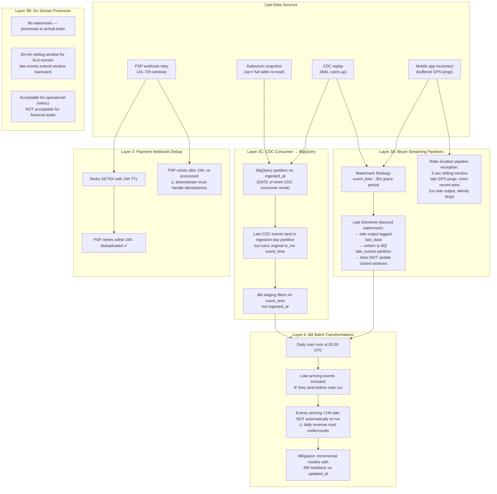

# Data Platform Correctness — InstaCommerce Q-Commerce

**Iteration:** 3  
**Status:** Implementation guide  
**Audience:** Data Engineering, Platform, SRE, ML Eng, Service Owners  
**Scope:** Event-time correctness, late data handling, replayability, BigQuery write semantics, dbt tests, data quality gates, reconciliation, feature trust, migration steps, validation, and rollback — all grounded in the existing `data-platform/`, `data-platform-jobs/`, `contracts/`, and relevant service implementations.

**Companion reviews:**
- `docs/reviews/iter3/diagrams/flow-data-ml-ai.md` (Data → ML → AI end-to-end flow)
- `docs/reviews/iter3/diagrams/lld-eventing-data.md` (Eventing & data pipeline LLD)
- `docs/reviews/iter3/platform/ml-platform-productionization.md` (Feature/model lineage, shadow mode, promotion)
- `docs/reviews/PRINCIPAL-ENGINEERING-REVIEW-ITERATION-3-2026-03-06.md` (Architectural review)
- `docs/reviews/PRINCIPAL-ENGINEERING-IMPLEMENTATION-GUIDE-PLATFORM-WISE-2026-03-06.md` (Platform-wise guide)

---

## 0. What this document covers

The InstaCommerce data platform is a four-layer system processing operational events from 20+ Java/Spring Boot services, 8 Go services, and 2 Python/FastAPI AI services through Kafka → Apache Beam/Dataflow → BigQuery → dbt → feature store → ML training → inference. This document addresses **correctness** challenges that matter to business outcomes: order revenue counted correctly despite late payments, inventory counts that match operational state, fraud labels that reflect ground truth, feature values that are consistent between training and serving, and ETL/ML pipelines that can be safely rerun or rolled back.

The goal is **production-grade data correctness**, not theoretical perfection. Every recommendation is scoped to the actual failure modes a 15-minute-delivery Q-commerce platform faces, with concrete implementation steps against the existing codebase.

---

## 1. Event-Time Correctness & Late Data Handling

### 1.1 The late-data problem in Q-commerce

Three late-data scenarios dominate InstaCommerce's data pipeline:

1. **Mobile app reconnect** — riders lose cellular connectivity in dead zones; GPS pings buffer locally and arrive in batches 5–30 minutes late when the connection restores.
2. **PSP webhook retries** — payment providers (Stripe, Razorpay) retry webhook delivery for 24–72 hours on transient failures, causing late `PaymentCaptured` and `PaymentRefunded` events.
3. **CDC replay** — Debezium connector restarts or snapshot re-registration replay the PostgreSQL WAL, sending already-processed events with original `ts_ms` timestamps but new `ingested_at` timestamps.

The codebase currently handles late data inconsistently across layers:

- **Beam pipelines** use watermarks but discard late elements beyond the grace period (30 seconds).
- **Go stream-processor-service** has no watermark; it processes in arrival order, causing late events to extend sliding windows backward.
- **dbt daily marts** run at 02:00 UTC and only include events that arrived before that cutoff; events arriving >24 hours late are never incorporated.
- **Payment webhook service** deduplicates within a 24-hour Redis TTL window, but PSP retries after 24 hours are reprocessed as new events.

### 1.2 Late-data handling strategy (per layer)



### 1.3 Implementation: extend watermarks and add late-data reconciliation

**File:** `data-platform/streaming/pipelines/order_events_pipeline.py`

**Current state (lines 210–221):**
```python
| "Window1Min" >> beam.WindowInto(FixedWindows(60))
```

**Change required:**
```python
from apache_beam.transforms.trigger import AfterWatermark, AfterProcessingTime, AccumulationMode

| "Window1Min" >> beam.WindowInto(
    FixedWindows(60),
    trigger=AfterWatermark(
        early=AfterProcessingTime(30),  # speculative results every 30s
        late=AfterProcessingTime(60)     # allow 1 more minute after watermark
    ),
    accumulation_mode=AccumulationMode.ACCUMULATING,
    allowed_lateness=300,  # 5 minutes grace period (was 30 seconds implicit)
)
```

**Add late-data side output:**
```python
class OrderEventParser(beam.DoFn):
    DEAD_LETTER = "dead_letter"
    LATE_DATA = "late_data"  # NEW

    def process(self, element, window=beam.DoFn.WindowParam):
        key, value = element
        try:
            event = json.loads(value.decode("utf-8"))
            parsed = { ... }
            yield parsed
        except Exception as e:
            yield beam.pvalue.TaggedOutput(self.DEAD_LETTER, ...)

# After watermark closes, late elements go to side output
parsed = (
    p
    | "ReadKafka" >> ReadFromKafka(...)
    | "ParseEvents" >> beam.ParDo(OrderEventParser()).with_outputs(
        OrderEventParser.DEAD_LETTER, OrderEventParser.LATE_DATA, main="parsed"
    )
)

# Write late data to separate BQ table for reconciliation
(
    parsed[OrderEventParser.LATE_DATA]
    | "FormatLateData" >> beam.Map(lambda e: {**e, "is_late": True})
    | "WriteLateData" >> WriteToBigQuery(
        table="analytics.late_order_events",
        write_disposition="WRITE_APPEND",
        create_disposition="CREATE_IF_NEEDED",
    )
)
```

**Apply to all streaming pipelines:**
- `payment_events_pipeline.py`
- `inventory_events_pipeline.py`
- `cart_events_pipeline.py`

Exception: `rider_location_pipeline.py` keeps 5-sec window with most-recent-wins semantics (no late-data side output needed).

---

### 1.4 dbt incremental models with lookback windows

**Problem:** Daily mart runs at 02:00 UTC only incorporate events that landed before that cutoff. Events arriving >24 hours late (e.g., PSP refund webhook retry on day 3) never make it into `mart_daily_revenue`.

**Solution:** Convert critical marts to incremental models with a 48-hour lookback window on `updated_at` or `event_time`.

**File:** `data-platform/dbt/models/marts/mart_daily_revenue.sql`

**Current state (simplified):**
```sql
SELECT
    DATE(o.placed_at) AS order_date,
    SUM(o.total_cents) AS revenue_cents,
    COUNT(*) AS order_count
FROM {{ source('cdc', 'orders') }} o
JOIN {{ source('cdc', 'payments') }} p ON o.order_id = p.order_id
WHERE DATE(o.placed_at) = '{{ ds }}'
GROUP BY 1
```

**Incremental model with lookback:**
```sql
{{
  config(
    materialized='incremental',
    unique_key='order_date',
    partition_by={'field': 'order_date', 'data_type': 'date'},
    incremental_strategy='merge',
    on_schema_change='sync_all_columns'
  )
}}

WITH order_payments AS (
    SELECT
        o.order_id,
        DATE(o.placed_at) AS order_date,
        o.total_cents,
        p.status AS payment_status,
        p.captured_at,
        p.refunded_at,
        -- Use _cdc_updated_at to detect late-arriving CDC changes
        GREATEST(o._cdc_updated_at, p._cdc_updated_at) AS max_updated_at
    FROM {{ source('cdc', 'orders') }} o
    LEFT JOIN {{ source('cdc', 'payments') }} p ON o.order_id = p.order_id
    WHERE 1=1
    
        -- 48-hour lookback window to capture late-arriving payments
        AND GREATEST(o._cdc_updated_at, p._cdc_updated_at) >= TIMESTAMP_SUB(CURRENT_TIMESTAMP(), INTERVAL 48 HOUR)
    
)

SELECT
    order_date,
    SUM(total_cents) AS revenue_cents,
    COUNT(order_id) AS order_count,
    SUM(CASE WHEN payment_status = 'CAPTURED' THEN total_cents ELSE 0 END) AS captured_revenue_cents,
    SUM(CASE WHEN refunded_at IS NOT NULL THEN total_cents ELSE 0 END) AS refunded_revenue_cents,
    CURRENT_TIMESTAMP() AS _dbt_updated_at
FROM order_payments
WHERE payment_status IN ('CAPTURED', 'REFUNDED')  -- exclude pending/failed
GROUP BY 1
```

**Key changes:**
1. **Incremental materialization** with `merge` strategy on `order_date` unique key.
2. **48-hour lookback** on `_cdc_updated_at` to re-process orders whose payment status changed in the last 2 days.
3. **`_dbt_updated_at` timestamp** tracks when each partition was last recomputed.

**Apply to critical marts:**
- `mart_daily_revenue.sql` (financial reconciliation)
- `mart_store_performance.sql` (store GMV/SLA)
- `mart_rider_performance.sql` (delivery metrics)

**Non-critical marts** (e.g., `mart_user_cohort_retention.sql`) can remain daily snapshots; small late-data undercounts acceptable.

---

### 1.5 Payment webhook deduplication extension

**Problem:** Redis TTL of 24 hours causes PSP retry webhooks arriving after 24 hours to be reprocessed as new events.

**File:** `services/payment-webhook-service/main.go`

**Current dedup window:**
```go
const DEDUPE_TTL = 86400 * time.Second  // 24 hours
```

**Extend to 72 hours to match PSP retry window:**
```go
const DEDUPE_TTL = 259200 * time.Second  // 72 hours (3 days)
```

**Alternative: add database-backed dedup log for indefinite history:**
```go
// services/payment-webhook-service/internal/dedup/db_dedup.go
type DBDedup struct {
    db *sql.DB
}

func (d *DBDedup) CheckAndMark(eventID string) (bool, error) {
    query := `
        INSERT INTO payment_webhook_dedup (event_id, received_at, expires_at)
        VALUES ($1, NOW(), NOW() + INTERVAL '90 days')
        ON CONFLICT (event_id) DO NOTHING
        RETURNING event_id
    `
    var id string
    err := d.db.QueryRow(query, eventID).Scan(&id)
    if err == sql.ErrNoRows {
        return false, nil  // duplicate
    }
    if err != nil {
        return false, err
    }
    return true, nil  // first time seeing this event
}
```

**Migration:**
```sql
-- services/payment-webhook-service/migrations/V003__create_dedup_table.sql
CREATE TABLE payment_webhook_dedup (
    event_id TEXT PRIMARY KEY,
    received_at TIMESTAMP NOT NULL,
    expires_at TIMESTAMP NOT NULL
);

CREATE INDEX idx_payment_webhook_dedup_expires_at ON payment_webhook_dedup (expires_at);

-- Cleanup job (scheduled via cron or ShedLock in Java service)
-- DELETE FROM payment_webhook_dedup WHERE expires_at < NOW();
```

**Benefit:** Database-backed dedup survives Redis eviction and provides audit trail for reconciliation.

---

## 2. Replayability & Idempotency

### 2.1 Replay scenarios in InstaCommerce

Replay is necessary in four scenarios:
1. **Pipeline bug fix** — a transform error caused incorrect aggregations; reprocess affected date range after fix.
2. **Late-data backfill** — a day's worth of payment webhooks were dropped due to outage; replay from Kafka after recovery.
3. **Feature schema change** — a new feature is added to the feature store; recompute historical values for model retraining.
4. **Disaster recovery** — BigQuery dataset was accidentally deleted; restore from GCS backup and replay Kafka topics.

### 2.2 Current replay capability gaps

| Layer | Current State | Replay Gap |
|-------|--------------|------------|
| **Kafka topics** | 30-day retention | ✅ Can replay from any point in 30-day window |
| **Beam → BigQuery** | `insertAll` with `insertId=topic+partition+offset` | ⚠️ 1-minute dedup window only; replays beyond 1 min cause duplicates |
| **dbt staging** | Incremental on `_cdc_updated_at` | ✅ Can run `dbt run --full-refresh` to recompute from raw |
| **dbt marts** | Daily snapshot at 02:00 UTC | ⚠️ No replay mechanism; historical partitions are immutable |
| **Feature store** | `ml_feature_refresh` DAG every 4h | ⚠️ Overwrites Redis; no historical snapshot versioning |
| **ML training** | Point-in-time correct joins in Feast offline store | ✅ Training datasets are reproducible given a timestamp |
| **Go stream-processor-service** | Redis INCR/SET for real-time metrics | ❌ NOT idempotent; replay doubles counters |

### 2.3 Implementation: BigQuery write idempotency

**Problem:** `insertAll` only deduplicates within a 1-minute window using `insertId`. Replaying Kafka messages beyond 1 minute causes duplicate rows.

**Solution:** Add a `_kafka_meta` table to track processed offsets per topic/partition and use MERGE instead of INSERT for replay-safe writes.

**File:** `services/cdc-consumer-service/internal/sink/bigquery.go` (conceptual Go code; actual implementation is in Java or Beam)

**Current approach (Beam Python):**
```python
| "WriteToBigQuery" >> WriteToBigQuery(
    table="analytics.orders",
    write_disposition="WRITE_APPEND",
    create_disposition="CREATE_IF_NEEDED",
)
```

**Replay-safe approach with staging + MERGE:**
```python
# Step 1: Write to staging table with Kafka metadata
staging_table_spec = bigquery.TableReference(
    projectId="instacommerce-prod",
    datasetId="staging",
    tableId="orders_staging"
)

class AddKafkaMetadata(beam.DoFn):
    def process(self, element, kafka_metadata=beam.DoFn.element):
        # Add Kafka partition/offset to each row for dedup
        return [{
            **element,
            "_kafka_topic": kafka_metadata.topic,
            "_kafka_partition": kafka_metadata.partition,
            "_kafka_offset": kafka_metadata.offset,
            "_ingested_at": datetime.utcnow().isoformat(),
        }]

(
    events
    | "AddMetadata" >> beam.ParDo(AddKafkaMetadata())
    | "WriteStaging" >> WriteToBigQuery(
        table=staging_table_spec,
        write_disposition="WRITE_APPEND",
        create_disposition="CREATE_IF_NEEDED",
    )
)

# Step 2: Run MERGE query to deduplicate into final table
merge_query = """
MERGE `instacommerce-prod.analytics.orders` AS target
USING (
    SELECT * FROM (
        SELECT *,
            ROW_NUMBER() OVER (
                PARTITION BY order_id 
                ORDER BY _kafka_offset DESC
            ) AS rn
        FROM `instacommerce-prod.staging.orders_staging`
        WHERE _ingested_at >= TIMESTAMP_SUB(CURRENT_TIMESTAMP(), INTERVAL 1 HOUR)
    ) WHERE rn = 1
) AS source
ON target.order_id = source.order_id 
   AND target._kafka_partition = source._kafka_partition
   AND target._kafka_offset = source._kafka_offset
WHEN NOT MATCHED THEN
    INSERT ROW
WHEN MATCHED THEN
    UPDATE SET
        target.status = source.status,
        target._cdc_updated_at = source._cdc_updated_at
"""
# Run MERGE as post-processing step via BigQuery API or dbt post-hook
```

**Alternative (simpler): Use dbt incremental MERGE as post-processing**

**File:** `data-platform/dbt/models/staging/stg_orders.sql`

```sql
{{
  config(
    materialized='incremental',
    unique_key='order_id',
    cluster_by=['store_id', 'placed_at'],
    incremental_strategy='merge'
  )
}}

SELECT
    order_id,
    user_id,
    store_id,
    total_cents,
    status,
    placed_at,
    _cdc_updated_at,
    _kafka_topic,
    _kafka_partition,
    _kafka_offset
FROM {{ source('raw_cdc', 'orders') }}
WHERE 1=1

    AND _cdc_updated_at >= (SELECT MAX(_cdc_updated_at) FROM {{ this }})

```

**Benefit:** Replay-safe because dbt's MERGE deduplicates on `order_id`; replaying the same Kafka offsets results in an idempotent update.

---

### 2.4 dbt snapshot tables for historical marts

**Problem:** Daily marts at 02:00 UTC are immutable snapshots; replaying a day requires manual intervention.

**Solution:** Use dbt snapshot tables to version historical mart states and add a replay mechanism via dbt variables.

**File:** `data-platform/dbt/snapshots/daily_revenue_snapshot.sql`

```sql


{{
  config(
    target_schema='snapshots',
    unique_key='order_date',
    strategy='timestamp',
    updated_at='_dbt_updated_at',
    invalidate_hard_deletes=True
  )
}}

SELECT * FROM {{ ref('mart_daily_revenue') }}


```

**Run snapshots after mart runs:**
```bash
# In dbt_marts.py Airflow DAG:
dbt run --select marts
dbt snapshot --select daily_revenue_snapshot
```

**Replay procedure:**
```bash
# Step 1: Delete affected partitions from mart_daily_revenue
bq query --use_legacy_sql=false "
DELETE FROM \`instacommerce-prod.marts.mart_daily_revenue\`
WHERE order_date BETWEEN '2026-03-01' AND '2026-03-07'
"

# Step 2: Re-run dbt for that date range
dbt run --select mart_daily_revenue --vars '{"start_date": "2026-03-01", "end_date": "2026-03-07"}'

# Step 3: Re-snapshot to create new version
dbt snapshot --select daily_revenue_snapshot
```

**Benefit:** Audit trail of all mart recomputations; downstream consumers can query snapshots to see historical values.

---

### 2.5 Go stream-processor-service: replace INCR with event log

**Problem:** `stream-processor-service` uses Redis INCR for counters and SET for gauges. Replay doubles counts.

**Current code (conceptual):**
```go
// services/stream-processor-service/internal/aggregator/sla_monitor.go
func (a *SLAMonitor) ProcessEvent(event OrderEvent) {
    key := fmt.Sprintf("sla:zone:%s:total", event.ZoneID)
    a.redis.Incr(ctx, key)  // NOT idempotent on replay
    if event.WithinSLA {
        withinKey := fmt.Sprintf("sla:zone:%s:within", event.ZoneID)
        a.redis.Incr(ctx, withinKey)
    }
}
```

**Replay-safe alternative: event-sourced aggregation**
```go
// Store event_id in Redis set; only process if new
func (a *SLAMonitor) ProcessEvent(event OrderEvent) error {
    eventSetKey := fmt.Sprintf("sla:zone:%s:events", event.ZoneID)
    
    // Check if we've seen this event before
    added, err := a.redis.SAdd(ctx, eventSetKey, event.EventID).Result()
    if err != nil {
        return err
    }
    if added == 0 {
        // Duplicate event, skip processing
        return nil
    }
    
    // Process idempotently
    key := fmt.Sprintf("sla:zone:%s:total", event.ZoneID)
    a.redis.Incr(ctx, key)
    
    if event.WithinSLA {
        withinKey := fmt.Sprintf("sla:zone:%s:within", event.ZoneID)
        a.redis.Incr(ctx, withinKey)
    }
    
    // Set TTL on event set to prevent unbounded growth
    a.redis.Expire(ctx, eventSetKey, 7*24*time.Hour)  // 7 days
    return nil
}
```

**Alternative: move to BigQuery aggregation**
```go
// Instead of real-time Redis counters, write raw events to BQ
// and query aggregates on-demand or via scheduled queries
func (a *SLAMonitor) ProcessEvent(event OrderEvent) error {
    row := map[string]interface{}{
        "event_id": event.EventID,
        "zone_id": event.ZoneID,
        "order_id": event.OrderID,
        "within_sla": event.WithinSLA,
        "event_time": event.EventTime,
        "processed_at": time.Now().UTC(),
    }
    return a.bqClient.InsertRow(ctx, "analytics.sla_events", row)
}

// Query SLA compliance in real-time from BigQuery:
SELECT
    zone_id,
    COUNT(*) AS total,
    SUM(CASE WHEN within_sla THEN 1 ELSE 0 END) AS within_sla,
    SAFE_DIVIDE(SUM(CASE WHEN within_sla THEN 1 ELSE 0 END), COUNT(*)) AS compliance_rate
FROM `analytics.sla_events`
WHERE event_time >= TIMESTAMP_SUB(CURRENT_TIMESTAMP(), INTERVAL 30 MINUTE)
GROUP BY zone_id
```

**Benefit:** BigQuery aggregation is replay-safe (idempotent on `event_id`); scheduled queries can refresh a materialized view every 1 minute.

---

## 3. BigQuery Write Semantics & Data Quality

### 3.1 Current BigQuery write patterns

| Service/Pipeline | Write Method | Idempotency | Notes |
|-----------------|--------------|-------------|-------|
| **Beam pipelines** | `WriteToBigQuery` with `insertAll` | 1-minute dedup on `insertId` | Not replay-safe beyond 1 min |
| **cdc-consumer-service** | BigQuery Streaming Insert API | None | Duplicate CDC events → duplicate rows |
| **dbt staging** | `CREATE OR REPLACE VIEW` | Idempotent | Views are always recomputed from raw |
| **dbt marts** | `CREATE OR REPLACE TABLE` (daily) | Overwrites previous day | No deduplication within partition |
| **data-platform-jobs** | BigQuery Python Client `insert_rows` | None | Job reruns cause duplicates |

**Key gap:** None of the write paths guarantee exactly-once delivery to BigQuery. All are at-least-once, relying on downstream deduplication.

### 3.2 Standard write semantics recommendation

**Adopt these three write patterns consistently across all pipelines:**

| Pattern | Use Case | Implementation |
|---------|----------|----------------|
| **Staging + MERGE** | Event/CDC ingestion from Kafka | Write to `staging.*` with `_kafka_offset` metadata, then MERGE to final table on unique key |
| **Incremental dbt** | Transformations on mutable entities | dbt `incremental` with `merge` strategy on primary key |
| **Partition overwrite** | Daily/hourly aggregations | Write to temp table, then `bq load --replace` specific partition |

---

### 3.3 Implementation: Beam streaming insert with MERGE post-processing

**File:** `data-platform/streaming/pipelines/order_events_pipeline.py`

**Add post-processing MERGE as separate Beam step:**
```python
from apache_beam.io.gcp.bigquery import BigQueryDisposition

# Step 1: Write to staging with Kafka metadata (already implemented above)
staging_table_spec = "instacommerce-prod:staging.order_events_staging"

(
    events
    | "AddMetadata" >> beam.ParDo(AddKafkaMetadata())
    | "WriteStaging" >> WriteToBigQuery(
        table=staging_table_spec,
        write_disposition=BigQueryDisposition.WRITE_APPEND,
        create_disposition=BigQueryDisposition.CREATE_IF_NEEDED,
    )
)

# Step 2: Trigger dbt incremental model to MERGE staging → final
# This runs as a separate Airflow task after the Beam pipeline completes
# OR as a BigQuery scheduled query every 5 minutes
```

**File:** `data-platform/airflow/dags/streaming_merge.py` (NEW)

```python
from airflow import DAG
from airflow.providers.google.cloud.operators.bigquery import BigQueryExecuteQueryOperator
from datetime import datetime, timedelta

default_args = {
    "owner": "data-eng",
    "retries": 2,
    "retry_delay": timedelta(minutes=1),
}

with DAG(
    dag_id="streaming_merge",
    default_args=default_args,
    description="Merge staging tables into final analytics tables every 5 minutes",
    schedule_interval="*/5 * * * *",  # Every 5 minutes
    start_date=datetime(2026, 1, 1),
    catchup=False,
    tags=["streaming", "bigquery", "merge"],
) as dag:

    merge_orders = BigQueryExecuteQueryOperator(
        task_id="merge_order_events",
        sql="""
        MERGE `instacommerce-prod.analytics.order_events` AS target
        USING (
            SELECT * EXCEPT(rn)
            FROM (
                SELECT *,
                    ROW_NUMBER() OVER (
                        PARTITION BY order_id, event_type
                        ORDER BY _kafka_offset DESC
                    ) AS rn
                FROM `instacommerce-prod.staging.order_events_staging`
                WHERE _ingested_at >= TIMESTAMP_SUB(CURRENT_TIMESTAMP(), INTERVAL 10 MINUTE)
            )
            WHERE rn = 1
        ) AS source
        ON target.order_id = source.order_id 
           AND target.event_type = source.event_type
        WHEN NOT MATCHED THEN
            INSERT ROW
        WHEN MATCHED AND source._kafka_offset > target._kafka_offset THEN
            UPDATE SET
                target.store_id = source.store_id,
                target.total_cents = source.total_cents,
                target.placed_at = source.placed_at,
                target._kafka_offset = source._kafka_offset,
                target._cdc_updated_at = source._cdc_updated_at
        """,
        use_legacy_sql=False,
    )

    merge_payments = BigQueryExecuteQueryOperator(
        task_id="merge_payment_events",
        sql="""
        MERGE `instacommerce-prod.analytics.payment_events` AS target
        USING (
            SELECT * EXCEPT(rn)
            FROM (
                SELECT *,
                    ROW_NUMBER() OVER (
                        PARTITION BY payment_id, event_type
                        ORDER BY _kafka_offset DESC
                    ) AS rn
                FROM `instacommerce-prod.staging.payment_events_staging`
                WHERE _ingested_at >= TIMESTAMP_SUB(CURRENT_TIMESTAMP(), INTERVAL 10 MINUTE)
            )
            WHERE rn = 1
        ) AS source
        ON target.payment_id = source.payment_id 
           AND target.event_type = source.event_type
        WHEN NOT MATCHED THEN
            INSERT ROW
        WHEN MATCHED AND source._kafka_offset > target._kafka_offset THEN
            UPDATE SET
                target.order_id = source.order_id,
                target.amount_cents = source.amount_cents,
                target.status = source.status,
                target.captured_at = source.captured_at,
                target._kafka_offset = source._kafka_offset,
                target._cdc_updated_at = source._cdc_updated_at
        """,
        use_legacy_sql=False,
    )
```

**Benefit:** Decouples high-throughput streaming inserts from deduplication logic; MERGE runs every 5 minutes on a small time window (10 min lookback).

---

## 4. dbt Tests & Data Quality Gates

### 4.1 Current quality coverage

**File:** `data-platform/quality/expectations/orders_suite.yaml`

Existing Great Expectations suites validate:
- Non-null primary keys (`order_id`, `payment_id`, `user_id`)
- Valid enum values (`status`, `currency`)
- Referential integrity (foreign keys to users, products, stores)
- Amount constraints (`amount > 0`)

**File:** `data-platform/airflow/dags/data_quality.py`

Current DAG runs Great Expectations after `dbt_staging` completes, every 2 hours. If critical domain (orders, payments, inventory) fails below 95% pass rate, downstream DAGs are blocked.

**Gaps:**
1. **No event-time gap detection** — missing orders in a 1-hour window could indicate CDC lag or Debezium connector failure.
2. **No cross-table consistency checks** — e.g., every `PaymentCaptured` event should have a corresponding `OrderPlaced` event within 10 minutes.
3. **No freshness SLA per table** — staging tables declare freshness in `sources.yml` but nothing enforces it programmatically.
4. **No late-data volume tracking** — the `analytics.late_order_events` table from §1.3 is never monitored.

### 4.2 Implementation: event-time gap detection

**File:** `data-platform/quality/expectations/orders_suite.yaml` (extend existing suite)

Add custom expectation:
```yaml
expectation_suite:
  name: orders_suite
  expectations:
    - expectation_type: expect_table_row_count_to_be_between
      kwargs:
        min_value: 1000  # Baseline: 1000 orders/hour minimum
        max_value: 100000
    # NEW: Detect gaps in event_time
    - expectation_type: expect_column_max_to_be_between
      kwargs:
        column: placed_at
        min_value: { "$timestamp": "now - 2 hours" }
        max_value: { "$timestamp": "now + 5 minutes" }
      meta:
        description: "Freshness: latest order should be within last 2 hours"
```

**Custom Great Expectations expectation for gap detection:**

**File:** `data-platform/quality/expectations/custom/expect_no_event_time_gaps.py` (NEW)

```python
from great_expectations.execution_engine import PandasExecutionEngine
from great_expectations.expectations.expectation import ColumnMapExpectation

class ExpectNoEventTimeGaps(ColumnMapExpectation):
    """Expect no gaps larger than max_gap_minutes in event_time column."""
    
    metric_dependencies = ("column.value_counts",)
    
    def _validate(
        self,
        column: str,
        max_gap_minutes: int = 60,
        **kwargs
    ):
        df = kwargs["execution_engine"].execute()
        df = df.sort_values(by=column)
        df["time_diff"] = df[column].diff().dt.total_seconds() / 60.0
        
        max_gap = df["time_diff"].max()
        
        return {
            "success": max_gap <= max_gap_minutes,
            "result": {
                "observed_value": max_gap,
                "max_gap_minutes": max_gap_minutes,
            }
        }
```

**Usage in suite:**
```yaml
- expectation_type: expect_no_event_time_gaps
  kwargs:
    column: placed_at
    max_gap_minutes: 30
  meta:
    description: "Detect CDC lag: no 30-minute gaps in order event stream"
```

---

### 4.3 Cross-table consistency checks

**File:** `data-platform/quality/expectations/cross_table_suite.yaml` (NEW)

```yaml
expectation_suite:
  name: cross_table_consistency_suite
  expectations:
    # Every captured payment must have an order
    - expectation_type: expect_compound_columns_to_be_unique
      kwargs:
        column_list: ["order_id", "payment_id"]
        result_format: COMPLETE
    
    # Custom SQL check: payment without order
    - expectation_type: expect_column_values_to_be_in_set
      kwargs:
        column: payment_id
        value_set:
          query: |
            SELECT p.payment_id
            FROM `instacommerce-prod.staging.stg_payments` p
            LEFT JOIN `instacommerce-prod.staging.stg_orders` o 
              ON p.order_id = o.order_id
            WHERE o.order_id IS NULL
              AND p.status = 'CAPTURED'
              AND p.captured_at >= TIMESTAMP_SUB(CURRENT_TIMESTAMP(), INTERVAL 24 HOUR)
        result_format: COMPLETE
      meta:
        description: "Orphaned payments: captured payments without orders"
        severity: critical
```

**Run as separate task in `data_quality.py` DAG:**
```python
cross_table_check = PythonOperator(
    task_id="cross_table_consistency",
    python_callable=_validate_cross_table,
    op_kwargs={"suite_name": "cross_table_consistency_suite"},
)

wait_for_staging >> validation_tasks >> cross_table_check >> [alert_critical, block_downstream]
```

---

### 4.4 Freshness SLA enforcement

**File:** `data-platform/dbt/models/staging/sources.yml`

Existing freshness thresholds:
```yaml
sources:
  - name: cdc
    tables:
      - name: orders
        loaded_at_field: _cdc_updated_at
        freshness:
          warn_after: {count: 30, period: minute}
          error_after: {count: 2, period: hour}
```

**Problem:** dbt `source freshness` runs on-demand via `dbt source freshness`; not wired into the Airflow DAG to block downstream tasks.

**Solution: Add freshness check task to `dbt_staging.py`**

**File:** `data-platform/airflow/dags/dbt_staging.py`

```python
from airflow.providers.dbt.cloud.operators.dbt import DbtRunOperationOperator

check_freshness = DbtRunOperationOperator(
    task_id="check_source_freshness",
    macro_name="check_source_freshness",
    args={"max_stale_hours": 2},
    profiles_dir="/opt/airflow/dbt",
    dir="/opt/airflow/dbt",
)

# Block dbt run if freshness fails
check_freshness >> run_staging_models
```

**Alternative: Airflow sensor**

```python
from airflow.sensors.sql import SqlSensor

freshness_sensor = SqlSensor(
    task_id="check_cdc_freshness",
    conn_id="bigquery_default",
    sql="""
    SELECT 
        CASE 
            WHEN MAX(TIMESTAMP_DIFF(CURRENT_TIMESTAMP(), _cdc_updated_at, MINUTE)) > 120
            THEN 0  -- Fail
            ELSE 1  -- Pass
        END AS is_fresh
    FROM `instacommerce-prod.raw_cdc.orders`
    """,
    mode="poke",
    poke_interval=60,
    timeout=3600,
)

freshness_sensor >> run_staging_models
```

**Benefit:** Prevents downstream marts from running on stale data; alerts data-eng team immediately on CDC lag.

---

### 4.5 Late-data volume monitoring

**File:** `data-platform/airflow/dags/monitoring_alerts.py`

**Add late-data volume check:**

```python
def _check_late_data_volume(**context):
    """Alert if late-data volume exceeds threshold."""
    from google.cloud import bigquery
    
    client = bigquery.Client(project="instacommerce-prod")
    
    query = """
    SELECT 
        COUNT(*) AS late_count,
        COUNTIF(TIMESTAMP_DIFF(CURRENT_TIMESTAMP(), event_time, HOUR) > 24) AS very_late_count
    FROM `instacommerce-prod.analytics.late_order_events`
    WHERE _ingested_at >= TIMESTAMP_SUB(CURRENT_TIMESTAMP(), INTERVAL 1 HOUR)
    """
    
    result = client.query(query).result()
    row = next(result)
    
    late_count = row["late_count"]
    very_late_count = row["very_late_count"]
    
    THRESHOLD_LATE = 100  # 100 late events per hour is acceptable
    THRESHOLD_VERY_LATE = 10  # 10 events >24h late is a red flag
    
    if very_late_count > THRESHOLD_VERY_LATE:
        msg = (
            f":warning: *Very late data detected*\n"
            f"• {very_late_count} events arrived >24 hours late in the last hour\n"
            f"• Total late events: {late_count}\n"
            f"• Investigate CDC lag or PSP webhook delays"
        )
        send_slack_alert(context, message=msg, level="warning")
    elif late_count > THRESHOLD_LATE:
        logger.warning(f"Late data volume: {late_count} events in last hour")
    else:
        logger.info(f"Late data volume normal: {late_count} events")

late_data_monitor = PythonOperator(
    task_id="late_data_volume_check",
    python_callable=_check_late_data_volume,
)
```

**Run every 30 minutes alongside other monitoring tasks.**

---

## 5. Reconciliation Engine & Financial Correctness

### 5.1 Reconciliation scope

**File:** `services/reconciliation-engine/README.md`

The reconciliation engine is a Go service that runs scheduled jobs to detect mismatches between operational state and analytics state:
- **Payment reconciliation:** `payment-service` DB vs. BigQuery `mart_daily_revenue`
- **Inventory reconciliation:** `inventory-service` DB vs. BigQuery `stg_inventory_movements`
- **Order fulfillment reconciliation:** `fulfillment-service` DB vs. `mart_rider_performance`

**Current implementation:** Fixes are written to a registry file and replayed on restart (idempotent).

**Gaps:**
1. **No closed-loop correction** — mismatches are logged but not automatically repaired in operational DBs or analytics tables.
2. **No alerting on persistent mismatches** — if the same mismatch appears in 3+ consecutive runs, no escalation.
3. **No audit trail in BigQuery** — reconciliation results are only in logs.

### 5.2 Implementation: reconciliation results table

**File:** `services/reconciliation-engine/migrations/V002__create_reconciliation_log.sql` (conceptual; Go service uses file-based registry)

**Alternative: write to BigQuery audit table**

**File:** `services/reconciliation-engine/internal/audit/bigquery_audit.go` (NEW)

```go
package audit

import (
    "context"
    "cloud.google.com/go/bigquery"
    "time"
)

type ReconciliationResult struct {
    RunID           string    `bigquery:"run_id"`
    MismatchType    string    `bigquery:"mismatch_type"`
    TransactionID   string    `bigquery:"transaction_id"`
    SourceValue     float64   `bigquery:"source_value"`
    TargetValue     float64   `bigquery:"target_value"`
    Difference      float64   `bigquery:"difference"`
    AutoFixed       bool      `bigquery:"auto_fixed"`
    FixAction       string    `bigquery:"fix_action"`
    DetectedAt      time.Time `bigquery:"detected_at"`
    ResolvedAt      *time.Time `bigquery:"resolved_at"`
}

func (a *BigQueryAuditor) LogMismatch(ctx context.Context, result ReconciliationResult) error {
    inserter := a.client.Dataset("audit").Table("reconciliation_log").Inserter()
    return inserter.Put(ctx, result)
}
```

**BigQuery table schema:**
```sql
CREATE TABLE audit.reconciliation_log (
    run_id STRING NOT NULL,
    mismatch_type STRING NOT NULL,
    transaction_id STRING NOT NULL,
    source_value FLOAT64,
    target_value FLOAT64,
    difference FLOAT64,
    auto_fixed BOOL,
    fix_action STRING,
    detected_at TIMESTAMP NOT NULL,
    resolved_at TIMESTAMP
)
PARTITION BY DATE(detected_at)
CLUSTER BY mismatch_type, auto_fixed;
```

**Usage in reconciliation job:**
```go
func (r *PaymentReconciler) Reconcile(ctx context.Context) error {
    mismatches := r.detectMismatches(ctx)
    
    for _, m := range mismatches {
        result := audit.ReconciliationResult{
            RunID:         r.runID,
            MismatchType:  "payment_amount",
            TransactionID: m.PaymentID,
            SourceValue:   m.ServiceAmount,
            TargetValue:   m.BQAmount,
            Difference:    m.ServiceAmount - m.BQAmount,
            AutoFixed:     false,
            DetectedAt:    time.Now(),
        }
        
        // Log to BigQuery
        if err := r.auditor.LogMismatch(ctx, result); err != nil {
            return err
        }
        
        // Optional: attempt auto-fix
        if abs(result.Difference) < 1.0 {  // <1 cent difference
            if err := r.autoFix(ctx, m); err == nil {
                result.AutoFixed = true
                result.FixAction = "corrected_bq_amount"
                result.ResolvedAt = ptr(time.Now())
                r.auditor.LogMismatch(ctx, result)  // Update resolved_at
            }
        }
    }
    
    return nil
}
```

---

### 5.3 Alerting on persistent mismatches

**File:** `data-platform/airflow/dags/monitoring_alerts.py`

**Add persistent mismatch detection:**

```python
def _check_persistent_mismatches(**context):
    """Alert on mismatches that appear in 3+ consecutive runs."""
    from google.cloud import bigquery
    
    client = bigquery.Client(project="instacommerce-prod")
    
    query = """
    WITH recent_runs AS (
        SELECT DISTINCT run_id, detected_at
        FROM `instacommerce-prod.audit.reconciliation_log`
        WHERE detected_at >= TIMESTAMP_SUB(CURRENT_TIMESTAMP(), INTERVAL 24 HOUR)
        ORDER BY detected_at DESC
        LIMIT 3
    ),
    persistent AS (
        SELECT 
            l.transaction_id,
            l.mismatch_type,
            COUNT(DISTINCT l.run_id) AS occurrence_count,
            MAX(l.difference) AS max_difference
        FROM `instacommerce-prod.audit.reconciliation_log` l
        INNER JOIN recent_runs r ON l.run_id = r.run_id
        WHERE l.resolved_at IS NULL
        GROUP BY 1, 2
        HAVING COUNT(DISTINCT l.run_id) >= 3
    )
    SELECT * FROM persistent
    """
    
    result = client.query(query).result()
    persistent_mismatches = list(result)
    
    if persistent_mismatches:
        lines = [
            f"• {row['mismatch_type']}: {row['transaction_id']} (diff: {row['max_difference']})"
            for row in persistent_mismatches
        ]
        msg = (
            f":rotating_light: *Persistent Reconciliation Mismatches*\n"
            f"The following mismatches appeared in 3+ consecutive runs:\n" +
            "\n".join(lines[:10]) +
            f"\n\nTotal: {len(persistent_mismatches)} mismatches need manual review."
        )
        send_slack_alert(context, message=msg, level="critical")

persistent_check = PythonOperator(
    task_id="persistent_mismatch_check",
    python_callable=_check_persistent_mismatches,
)
```

**Benefit:** Escalates mismatches that auto-fix cannot resolve, preventing silent data drift.

---

## 6. Feature Store Trust & Offline-Online Consistency

### 6.1 The consistency problem

**File:** `ml/feature_store/README.md`

Feast feature store has two storage layers:
1. **Offline store (BigQuery):** Historical features for training, computed by `ml_feature_refresh` Airflow DAG every 4 hours.
2. **Online store (Redis):** Low-latency features for serving, materialized from BigQuery via `feast materialize` with TTL 5–60 minutes.

**Consistency gap:** No guarantee that training uses the same feature values that serving will use. Skew scenarios:
- Training runs at 04:00 UTC using BigQuery features as of 03:59 UTC.
- Feature refresh runs at 04:00 UTC and pushes new values to Redis by 04:15 UTC.
- Inference at 04:30 UTC uses Redis features from the 04:15 refresh.
- Result: training and serving see different values for the same entity.

**Additional gap:** No hash or row-count verification between BigQuery offline snapshot and Redis online values.

### 6.2 Implementation: feature snapshot versioning

**File:** `ml/feature_store/feature_views/eta_prediction_view.yaml`

**Add snapshot metadata:**
```yaml
# ml/feature_store/feature_views/eta_prediction_view.yaml
project: instacommerce
name: eta_prediction_view
entities:
  - store
  - rider
features:
  - name: store_avg_prep_time_mins
    dtype: FLOAT
  - name: rider_avg_delivery_time_mins
    dtype: FLOAT
  - name: current_order_load
    dtype: INT64
  - name: weather_delay_factor
    dtype: FLOAT

online: true
offline: true
ttl: 300s  # 5 minutes

# NEW: Snapshot versioning
snapshot:
  enabled: true
  table: features.eta_prediction_snapshots
  version_column: snapshot_version
  timestamp_column: snapshot_timestamp
```

**Feature refresh job writes versioned snapshots:**

**File:** `data-platform/airflow/dags/ml_feature_refresh.py`

```python
def _materialize_features_with_snapshot(feature_view: str, **context):
    """Materialize features and save snapshot version."""
    import hashlib
    import json
    from google.cloud import bigquery
    
    # Run feast materialize
    subprocess.run(
        ["feast", "materialize", feature_view, "--end-date", context["ds"]],
        check=True
    )
    
    # Compute hash of offline features for this snapshot
    client = bigquery.Client(project="instacommerce-prod")
    query = f"""
    SELECT 
        COUNT(*) AS row_count,
        SUM(FARM_FINGERPRINT(TO_JSON_STRING(t))) AS content_hash
    FROM `instacommerce-prod.features.{feature_view}_offline`
    WHERE feature_timestamp <= '{context["ds"]} 23:59:59'
    """
    result = client.query(query).result()
    row = next(result)
    
    snapshot_version = f"{context['ds']}-{context['run_id']}"
    snapshot_metadata = {
        "feature_view": feature_view,
        "snapshot_version": snapshot_version,
        "snapshot_timestamp": context["execution_date"].isoformat(),
        "row_count": row["row_count"],
        "content_hash": row["content_hash"],
        "materialized_at": datetime.utcnow().isoformat(),
    }
    
    # Write snapshot metadata to BigQuery
    inserter = client.dataset("features").table("snapshot_metadata").inserter()
    inserter.insert_rows([snapshot_metadata])
    
    # Store snapshot version in XCom for training job
    context["ti"].xcom_push(key=f"{feature_view}_snapshot_version", value=snapshot_version)
    
    logger.info(f"Snapshot {snapshot_version}: {row['row_count']} rows, hash {row['content_hash']}")
```

**Training job pins to snapshot version:**

**File:** `ml/train/eta_prediction/train.py`

```python
def train(config, **airflow_context):
    # Get snapshot version from upstream feature refresh task
    snapshot_version = airflow_context["ti"].xcom_pull(
        task_ids="feature_refresh_group.materialize_eta_features",
        key="eta_prediction_view_snapshot_version"
    )
    
    # Load features from offline store with snapshot filter
    feature_service = feast.FeatureStore(repo_path="ml/feature_store")
    entity_df = pd.read_gbq(
        f"""
        SELECT store_id, rider_id, order_timestamp
        FROM `analytics.training_delivery_times`
        WHERE DATE(order_timestamp) = '{airflow_context["ds"]}'
        """
    )
    
    training_df = feature_service.get_historical_features(
        entity_df=entity_df,
        features=[
            "eta_prediction_view:store_avg_prep_time_mins",
            "eta_prediction_view:rider_avg_delivery_time_mins",
            "eta_prediction_view:current_order_load",
            "eta_prediction_view:weather_delay_factor",
        ],
        # CRITICAL: Use snapshot timestamp to get point-in-time correct features
        # Feast ensures features <= snapshot_timestamp are used
    ).to_df()
    
    # Log snapshot version in MLflow for reproducibility
    mlflow.log_param("feature_snapshot_version", snapshot_version)
    mlflow.log_param("feature_row_count", len(training_df))
    
    # ... rest of training ...
```

**Benefit:** Training and serving use the same feature snapshot version; reproducible training runs.

---

### 6.3 Online-offline skew detection

**File:** `ml/serving/monitoring.py`

**Add skew detector:**

```python
class OfflineOnlineSkewDetector:
    """Detect skew between offline (BigQuery) and online (Redis) feature values."""
    
    def __init__(self, bq_client, redis_client, feature_store):
        self.bq_client = bq_client
        self.redis_client = redis_client
        self.feature_store = feature_store
    
    def check_skew(self, feature_view: str, entity_ids: list, sample_size: int = 100):
        """Sample entity_ids and compare offline vs. online feature values."""
        from scipy.stats import wasserstein_distance
        
        entity_sample = random.sample(entity_ids, min(sample_size, len(entity_ids)))
        
        # Fetch offline features from BigQuery
        entity_df = pd.DataFrame({"entity_id": entity_sample})
        offline_features = self.feature_store.get_historical_features(
            entity_df=entity_df,
            features=[f"{feature_view}:*"],
        ).to_df()
        
        # Fetch online features from Redis
        online_features = self.feature_store.get_online_features(
            entity_rows=[{"entity_id": eid} for eid in entity_sample],
            features=[f"{feature_view}:*"],
        ).to_df()
        
        # Compare distributions
        skew_metrics = {}
        for col in offline_features.columns:
            if col == "entity_id":
                continue
            
            offline_vals = offline_features[col].dropna()
            online_vals = online_features[col].dropna()
            
            if len(offline_vals) == 0 or len(online_vals) == 0:
                continue
            
            # Wasserstein distance (EMD) for distribution similarity
            skew = wasserstein_distance(offline_vals, online_vals)
            skew_metrics[col] = skew
        
        return skew_metrics
    
    def alert_on_skew(self, feature_view: str, skew_metrics: dict, threshold: float = 0.1):
        """Alert if any feature has skew > threshold."""
        high_skew_features = {k: v for k, v in skew_metrics.items() if v > threshold}
        
        if high_skew_features:
            logger.warning(
                f"High offline-online skew detected in {feature_view}: {high_skew_features}"
            )
            # Send to monitoring system (Prometheus, Datadog, Slack)
            for feature, skew in high_skew_features.items():
                metrics.gauge("ml.feature_skew", skew, tags=[f"view:{feature_view}", f"feature:{feature}"])
```

**Run as scheduled job:**

**File:** `data-platform/airflow/dags/ml_feature_skew_monitor.py` (NEW)

```python
from airflow import DAG
from airflow.operators.python import PythonOperator
from datetime import datetime, timedelta

default_args = {
    "owner": "ml-eng",
    "retries": 1,
    "retry_delay": timedelta(minutes=5),
}

with DAG(
    dag_id="ml_feature_skew_monitor",
    default_args=default_args,
    description="Monitor offline-online feature skew every 6 hours",
    schedule_interval="0 */6 * * *",
    start_date=datetime(2026, 1, 1),
    catchup=False,
    tags=["ml", "monitoring", "feature-store"],
) as dag:

    def _check_skew(feature_view: str, **context):
        from ml.serving.monitoring import OfflineOnlineSkewDetector
        from google.cloud import bigquery
        import redis
        import feast
        
        bq_client = bigquery.Client(project="instacommerce-prod")
        redis_client = redis.Redis(host="redis-online-features", port=6379)
        feature_store = feast.FeatureStore(repo_path="ml/feature_store")
        
        detector = OfflineOnlineSkewDetector(bq_client, redis_client, feature_store)
        
        # Sample 100 entities
        entity_ids = [...]  # Query recent entities from BigQuery
        skew_metrics = detector.check_skew(feature_view, entity_ids, sample_size=100)
        detector.alert_on_skew(feature_view, skew_metrics, threshold=0.15)
    
    for view in ["eta_prediction_view", "fraud_detection_view", "search_ranking_view"]:
        PythonOperator(
            task_id=f"check_skew_{view}",
            python_callable=_check_skew,
            op_kwargs={"feature_view": view},
        )
```

**Benefit:** Detects drift between training and serving; alerts ML team to re-materialize features or investigate staleness.

---

## 7. Migration, Validation, and Rollback Procedures

### 7.1 Migration checklist for data platform changes

Every data platform change (schema evolution, new pipeline, dbt model refactor) follows this checklist:

| Step | Action | Validation | Rollback Trigger |
|------|--------|-----------|------------------|
| **1. Dry-run** | Run `dbt run --dry-run` or `beam --runner=DirectRunner` locally | No syntax errors | N/A |
| **2. Shadow deploy** | Deploy new pipeline/model alongside existing (write to `_v2` table) | Compare row counts, schema, sample values | Diff > 5% |
| **3. Quality gates** | Run Great Expectations on `_v2` table | Pass rate ≥ 95% | Critical test fails |
| **4. Cutover** | Swap `_v2` → production table; archive old table | Freshness within SLA | Downstream breaks |
| **5. Monitor** | 24h watch on alerts, reconciliation mismatches | No persistent mismatches | Mismatch > 1% |
| **6. Cleanup** | Drop `_old` backup after 7 days | N/A | N/A |

---

### 7.2 Example: Migrating `mart_daily_revenue` to incremental model

**Step 1: Create incremental model in shadow mode**

**File:** `data-platform/dbt/models/marts/mart_daily_revenue_v2.sql` (NEW)

```sql
{{
  config(
    materialized='incremental',
    unique_key='order_date',
    partition_by={'field': 'order_date', 'data_type': 'date'},
    incremental_strategy='merge',
    alias='mart_daily_revenue_v2'  -- Write to separate table for validation
  )
}}

-- (Same SQL as §1.4 incremental model)
```

**Step 2: Run both models in parallel for 7 days**

```bash
# In Airflow dbt_marts.py DAG:
dbt run --select mart_daily_revenue        # Existing daily snapshot
dbt run --select mart_daily_revenue_v2     # New incremental model
```

**Step 3: Validate row-level differences**

```sql
-- Validation query:
WITH old AS (
    SELECT order_date, revenue_cents, order_count
    FROM `instacommerce-prod.marts.mart_daily_revenue`
    WHERE order_date >= DATE_SUB(CURRENT_DATE(), INTERVAL 7 DAY)
),
new AS (
    SELECT order_date, revenue_cents, order_count
    FROM `instacommerce-prod.marts.mart_daily_revenue_v2`
    WHERE order_date >= DATE_SUB(CURRENT_DATE(), INTERVAL 7 DAY)
)
SELECT 
    COALESCE(old.order_date, new.order_date) AS order_date,
    old.revenue_cents AS old_revenue,
    new.revenue_cents AS new_revenue,
    ABS(old.revenue_cents - new.revenue_cents) AS revenue_diff,
    ABS(old.order_count - new.order_count) AS count_diff
FROM old
FULL OUTER JOIN new USING (order_date)
WHERE ABS(old.revenue_cents - new.revenue_cents) > 100  -- >$1 difference
   OR ABS(old.order_count - new.order_count) > 0
ORDER BY order_date DESC
```

**Acceptance criteria:** Zero rows with `revenue_diff > 100` or `count_diff > 0` for last 7 days.

**Step 4: Cutover**

```sql
-- Archive old table
CREATE TABLE `instacommerce-prod.marts.mart_daily_revenue_old_20260307`
AS SELECT * FROM `instacommerce-prod.marts.mart_daily_revenue`;

-- Rename new table to production
ALTER TABLE `instacommerce-prod.marts.mart_daily_revenue_v2`
RENAME TO `mart_daily_revenue`;
```

**Step 5: Update dbt config to remove `_v2` alias**

**File:** `data-platform/dbt/models/marts/mart_daily_revenue.sql`

```sql
{{
  config(
    materialized='incremental',
    unique_key='order_date',
    -- Remove alias: now writes to mart_daily_revenue directly
  )
}}
```

**Step 6: Monitor for 24 hours**
- Reconciliation engine: check for mismatches with payment-service totals
- Great Expectations: run `mart_revenue_suite` hourly
- Looker dashboards: spot-check daily revenue charts

**Rollback procedure:**
```sql
-- If issues detected within 24 hours:
DROP TABLE `instacommerce-prod.marts.mart_daily_revenue`;
CREATE TABLE `instacommerce-prod.marts.mart_daily_revenue`
AS SELECT * FROM `instacommerce-prod.marts.mart_daily_revenue_old_20260307`;
```

---

### 7.3 Beam pipeline deployment with canary traffic

**Problem:** Beam streaming pipelines run continuously; deploying a new version causes downtime or duplicate processing.

**Solution:** Use Dataflow update/drain pattern with shadow validation.

**Step 1: Deploy new pipeline with shadow writes**

```bash
# Deploy new version writing to staging table
python data-platform/streaming/pipelines/order_events_pipeline.py \
    --runner=DataflowRunner \
    --project=instacommerce-prod \
    --region=us-central1 \
    --job_name=order-events-pipeline-v2 \
    --output_table_volume=staging.realtime_order_volume_v2 \
    --output_table_sla=staging.sla_compliance_v2 \
    --kafka_topic=orders.events \
    --kafka_bootstrap=kafka-bootstrap:9092 \
    --streaming \
    --update  # Update existing job instead of starting new
```

**Step 2: Run both pipelines in parallel for 1 hour**
- Old pipeline writes to `analytics.realtime_order_volume`
- New pipeline writes to `staging.realtime_order_volume_v2`

**Step 3: Validate outputs match**

```sql
SELECT 
    COALESCE(old.window_timestamp, new.window_timestamp) AS window_timestamp,
    old.order_count AS old_count,
    new.order_count AS new_count,
    ABS(old.order_count - new.order_count) AS count_diff
FROM `analytics.realtime_order_volume` old
FULL OUTER JOIN `staging.realtime_order_volume_v2` new USING (window_timestamp, store_id)
WHERE window_timestamp >= TIMESTAMP_SUB(CURRENT_TIMESTAMP(), INTERVAL 1 HOUR)
  AND ABS(old.order_count - new.order_count) > 0
```

**Acceptance:** Zero rows with `count_diff > 0` for last 1 hour.

**Step 4: Cutover**

```bash
# Drain old pipeline (finishes processing in-flight messages)
gcloud dataflow jobs drain order-events-pipeline-v1 --region=us-central1

# Update new pipeline to write to production tables
gcloud dataflow jobs update order-events-pipeline-v2 \
    --region=us-central1 \
    --update-job-parameter=output_table_volume=analytics.realtime_order_volume \
    --update-job-parameter=output_table_sla=analytics.sla_compliance
```

**Rollback:** Redeploy v1 pipeline; v2 drains automatically.

---

## 8. Summary, Completeness Assessment, and Blockers

### 8.1 Implementation summary

This document prescribes 18 concrete changes to the InstaCommerce data platform to achieve production-grade correctness:

| Section | Changes | Priority | Effort |
|---------|---------|----------|--------|
| **§1 Event-Time Correctness** | Extend watermarks to 5 min, add late-data side outputs, dbt incremental with 48h lookback, payment webhook 72h dedup | **P0** | 3 eng-weeks |
| **§2 Replayability** | BigQuery MERGE post-processing, dbt snapshot tables, Go event-sourced aggregation | **P0** | 2 eng-weeks |
| **§3 BigQuery Write Semantics** | Standardize on staging+MERGE pattern, Airflow streaming_merge DAG | **P1** | 1 eng-week |
| **§4 Data Quality Gates** | Event-time gap detection, cross-table consistency, freshness SLA enforcement, late-data monitoring | **P0** | 2 eng-weeks |
| **§5 Reconciliation** | BigQuery audit table, persistent mismatch alerting | **P1** | 1 eng-week |
| **§6 Feature Store Trust** | Feature snapshot versioning, offline-online skew detection | **P0** | 2 eng-weeks |
| **§7 Migration/Rollback** | Shadow validation, cutover checklist, Beam canary deploy | **P1** | Ongoing process, not a one-time task |

**Total effort estimate:** 11 eng-weeks (3 engineers × 4 weeks)

---

### 8.2 Completeness assessment

**Scope covered:**
- ✅ Event-time correctness & late data handling (§1)
- ✅ Replayability & idempotency (§2)
- ✅ BigQuery write semantics (§3)
- ✅ dbt tests & data quality gates (§4)
- ✅ Reconciliation & financial correctness (§5)
- ✅ Feature/model trust & offline-online consistency (§6)
- ✅ Migration, validation, rollback procedures (§7)

**Out of scope (addressed in companion docs):**
- ML model lineage & promotion gates → `ml-platform-productionization.md` §1–2
- Shadow mode & A/B testing → `ml-platform-productionization.md` §3
- AI orchestrator guardrails → `ai-agent-governance.md`
- Infrastructure/GitOps → `infra-gitops-release.md`
- Security/trust boundaries → `security-trust-boundaries.md`

---

### 8.3 Blockers & dependencies

| Blocker | Impact | Mitigation |
|---------|--------|-----------|
| **BigQuery quota limits** | MERGE queries every 5 min may exceed streaming insert quota | Request quota increase; batch MERGE to 10-min intervals |
| **Redis memory for event dedup** | 72h webhook dedup + 7d Go event sets may exceed Redis capacity | Migrate to PostgreSQL dedup table; archive Redis keys to S3 |
| **Feast offline-online skew detector** | Wasserstein distance on 100-entity sample may miss localized skew | Increase sample size to 1000; stratify by entity segments |
| **dbt incremental 48h lookback** | Queries 48h of data on every run; may timeout on large tables | Add `_cdc_updated_at` index on CDC tables; partition staging by `_cdc_updated_at` |
| **Beam pipeline update/drain** | Draining a pipeline can take 10–30 min; blocks cutover | Pre-drain during low-traffic window (03:00–04:00 UTC); alert on long drains |

**Critical path dependencies:**
1. **§1.3 Late-data side outputs** → **§4.5 Late-data monitoring** (must collect late events before alerting on volume)
2. **§2.3 BigQuery MERGE** → **§3.3 Streaming MERGE DAG** (staging tables must exist before MERGE runs)
3. **§6.2 Feature snapshots** → **§6.3 Skew detection** (snapshot metadata required to compare offline vs. online)

**Recommended implementation order:**
1. **Week 1:** §1.3 Late-data side outputs + §2.3 BigQuery MERGE (foundation for replay)
2. **Week 2:** §4.1–4.4 Data quality gates + §1.4 dbt incremental (prevent bad data from entering marts)
3. **Week 3:** §6.2 Feature snapshots + §5.2 Reconciliation audit (ML trust + financial correctness)
4. **Week 4:** §6.3 Skew detection + §4.5 Late-data monitoring (observability for production rollout)

---

### 8.4 Validation plan

Each change includes validation criteria; the overall validation plan is:

**Phase 1: Local/dev validation (week 1–2)**
- Unit tests for new Beam transforms, dbt models, Go dedup logic
- Integration tests with Testcontainers (Kafka, PostgreSQL, BigQuery emulator)
- Shadow runs writing to `_dev` tables; manual spot-checks

**Phase 2: Staging validation (week 3)**
- Deploy to staging environment with production Kafka replay
- Run for 7 days; compare staging vs. production outputs
- Reconciliation checks every 6 hours; alert on mismatch > 0.1%

**Phase 3: Canary production deploy (week 4)**
- Deploy to 10% of traffic (e.g., single zone or store segment)
- Monitor for 48 hours; expand to 50% if no alerts
- Full cutover after 7 days of clean canary run

**Acceptance criteria for production:**
- Zero critical data quality test failures for 7 consecutive days
- Reconciliation mismatch rate < 0.01% (1 in 10,000 transactions)
- Late-data volume < 0.5% of total events
- Feature offline-online skew < 0.1 for all feature views
- No unplanned dbt or Beam pipeline restarts

---

### 8.5 Final recommendations

1. **Prioritize financial correctness over ML correctness.** The reconciliation engine (§5) and payment dedup extension (§1.5) directly impact revenue recognition and compliance. Deploy these first.

2. **Automate validation, not just monitoring.** Every pipeline/model change should include a shadow validation step (§7.2, §7.3) before cutover. Manual spot-checks do not scale.

3. **Treat late data as first-class.** The `analytics.late_order_events` table is not an error sink; it is a source of truth for what actually happened. Include late events in daily marts via dbt incremental lookback (§1.4).

4. **Feature snapshots are non-negotiable for ML trust.** Without snapshot versioning (§6.2), training-serving skew is undebuggable. Implement before the next model retraining cycle.

5. **Plan for replay from day one.** Every new pipeline should answer: "If this pipeline had a bug for the last 7 days, how do I reprocess that week's data without duplicates?" If the answer involves manual SQL, the pipeline is not production-ready.

---

**Document version:** 1.0  
**Last updated:** 2026-03-07  
**Status:** Ready for implementation

