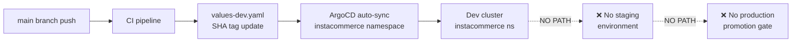
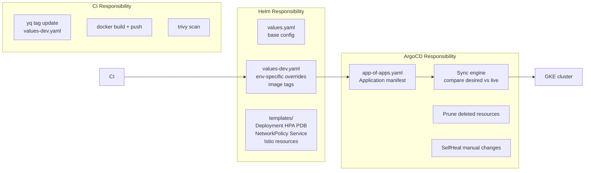

# InstaCommerce — Platform Infra & GitOps Release Engineering: Deep Implementation Guide

**Reviewer:** Principal SRE / Platform Engineering  
**Date:** 2026-03-06  
**Scope:** `.github/workflows/ci.yml`, `deploy/helm/`, `argocd/`, `infra/terraform/`, `docker-compose.yml` — all 28 services  
**Iteration:** 3 — Platform Track  
**Platform Context:** Q-commerce, 20M+ users, GKE (asia-south1), GitOps-first delivery model  
**Supporting docs:**
- `docs/reviews/infrastructure-review.md` — prior art, 54 findings baseline
- `docs/reviews/PRINCIPAL-ENGINEERING-IMPLEMENTATION-GUIDE-PLATFORM-WISE-2026-03-06.md`
- `docs/reviews/PRINCIPAL-ENGINEERING-REVIEW-ITERATION-3-2026-03-06.md`

---

## Table of Contents

1. [Executive Summary](#1-executive-summary)
2. [CI/CD Lineage: From Commit to Cluster](#2-cicd-lineage-from-commit-to-cluster)
3. [Image Provenance & Supply Chain Security](#3-image-provenance--supply-chain-security)
4. [Environment Promotion & Release Gates](#4-environment-promotion--release-gates)
5. [Helm & ArgoCD Responsibilities: Division of Concern](#5-helm--argocd-responsibilities-division-of-concern)
6. [Canary Deployments & Progressive Delivery](#6-canary-deployments--progressive-delivery)
7. [Config Drift Detection](#7-config-drift-detection)
8. [Rollback Safety](#8-rollback-safety)
9. [Local Infrastructure Fidelity (docker-compose)](#9-local-infrastructure-fidelity-docker-compose)
10. [Terraform / GCP Infrastructure Governance](#10-terraform--gcp-infrastructure-governance)
11. [Prioritized Implementation Roadmap](#11-prioritized-implementation-roadmap)

---

## 1. Executive Summary

The InstaCommerce delivery platform has the **right architectural intent**: GitOps via ArgoCD, immutable SHA-tagged images, Workload Identity for GCP auth, zero-downtime rolling updates, and PodDisruptionBudgets. The bones are sound.

The problem is that **many controls are partial or disconnected from each other**. The CI pipeline builds 20 Java services and 8 Go services, but Go services never produce Docker images. ArgoCD auto-syncs on every `main` commit with `prune: true` and `selfHeal: true`, but there is no staging environment between `main` and production. Image tags are SHA-pinned for dev but use the literal string `prod` in `values-prod.yaml`. There is no canary traffic split in the Istio VirtualService. Rollback is documented but not automated.

This guide traces the full delivery lineage from commit to live cluster for every layer, identifies every gap with precise file/line evidence, and provides concrete, code-level implementation recommendations tied to the actual repo structure.

### Finding Summary

| Severity | Count | Primary Areas |
|----------|-------|---------------|
| 🔴 CRITICAL | 9 | Go image gap, `prod` tag literal, no staging, no automated rollback, no drift alerting |
| 🟠 HIGH | 14 | No SBOM/signing, no canary gate, ArgoCD single-app blast radius, resource quota vs HPA math |
| 🟡 MEDIUM | 11 | Deploy-name mismatches, HPA stabilization, PDB coverage, Terraform module gap |
| 🔵 LOW | 6 | Docker Compose version, commit author hygiene, labeling, missing namespace isolation |

### What Is Done Well

| Area | Evidence |
|------|----------|
| Immutable SHA tagging (Java/dev) | `yq -i ".services[\"$svc\"].tag = \"${{ github.sha }}\""` in `deploy-dev` job |
| Workload Identity auth | `google-github-actions/auth@v2` with `workload_identity_provider` secret — no long-lived keys |
| Trivy scan on built image | `aquasecurity/trivy-action` with `exit-code: 1` on `main` push |
| Zero-downtime rolling update | `maxUnavailable: 0`, `maxSurge: 1` across all 28 deployments |
| GitOps self-healing | ArgoCD `selfHeal: true` + `prune: true` in `argocd/app-of-apps.yaml` |
| Multi-layer security | Seccomp, non-root UID 1001, `readOnlyRootFilesystem: true`, `capabilities.drop: ALL` |
| Fail-fast disabled | `strategy.fail-fast: false` — one service failure doesn't abort the matrix |
| PDB on every service | `deploy/helm/templates/pdb.yaml` generates a PDB for every entry in `values.services` |

---

## 2. CI/CD Lineage: From Commit to Cluster

### 2.1 Canonical Delivery Pipeline

```mermaid
flowchart TD
    Dev[Developer pushes to main] --> DC[detect-changes\ndorny/paths-filter@v3]
    DC -->|services JSON| BT[build-test matrix\n20 Java services]
    DC -->|go_services JSON| GT[go-build-test matrix\n8 Go services]
    DC --> SS[security-scan\ngitleaks + Trivy FS]
    DC -->|PR only| DR[dependency-review]
    BT -->|main push only| Docker[docker build + tag SHA\ngcr.io/.../image:$SHA]
    BT -->|main push only| Trivy[trivy image scan\nCRITICAL+HIGH exit:1]
    BT -->|main push only| Push[push to Artifact Registry\nasia-south1-docker.pkg.dev]
    GT --> GoTest[go test ./...]
    GT --> GoBuild[go build ./...]
    GT -.->|MISSING| GoDocker[❌ no docker build\nfor Go services]
    BT --> DD[deploy-dev\nif main push]
    GT --> DD
    SS --> DD
    DD --> YQ[yq update\ndeploy/helm/values-dev.yaml\n.services.SVC.tag = SHA]
    YQ --> GitPush[git commit + push\nchore: deploy XXXXXXXX to dev]
    GitPush --> ArgoCD[ArgoCD detects\nvalues-dev.yaml change]
    ArgoCD --> HelmRender[helm template render\nvalues.yaml + values-dev.yaml]
    HelmRender --> Apply[kubectl apply\ninstacommerce namespace]
    Apply --> Rolling[Kubernetes RollingUpdate\nmaxUnavailable:0 maxSurge:1]
```

### 2.2 Path Filter Coverage

**Source**: `.github/workflows/ci.yml`, `detect-changes` job, `dorny/paths-filter@v3`

The filter maps are defined per service (e.g., `identity-service: services/identity-service/**`). This is the correct pattern. However, two structural gaps exist:

**Finding 2.2.1 — `contracts/` changes do not trigger service rebuilds** 🟠 HIGH

When `contracts/` schemas or protos change, the `detect-changes` output will return an empty services list (no service path was touched). Java services that depend on generated gRPC stubs from `contracts/` will be deployed with stale stubs until their own source is next touched.

```yaml
# Currently missing in detect-changes filters:
contracts:
  - contracts/**
```

**Recommendation**: Add a `contracts` filter. If `contracts` is true, set `services` to the full service list (same logic as `main` push), or at minimum rebuild all Java services.

```yaml
# In detect-changes job outputs:
services: >-
  ${{
    (github.ref == 'refs/heads/main' || github.ref == 'refs/heads/master'
     || needs.detect-changes.outputs.contracts == 'true')
    && toJSON(fromJSON('[
      "identity-service","catalog-service",...
    ]'))
    || needs.detect-changes.outputs.changed_services
  }}
```

**Finding 2.2.2 — `go-shared` change triggers correct fan-out but is only tested, not deployed** 🟡 MEDIUM

The `go_services` output correctly expands to all 7 downstream Go modules when `go-shared` changes. However, because Go services never build Docker images, the expansion only affects `go test` coverage — not actual deployment tags. The safety net is incomplete.

### 2.3 The Go Image Gap

**Finding 2.3.1 — 8 Go services have no Docker image build or push in CI** 🔴 CRITICAL

The `go-build-test` job (job 5) runs `go test ./...` and `go build ./...` for each Go service. It does **not** execute `docker build`, `trivy image scan`, or `docker push`. The `deploy-dev` job updates `values-dev.yaml` tags for changed Go services via the deploy-name mapping:

```bash
# In deploy-dev job:
declare -A GO_DEPLOY_NAMES=(
  ["cdc-consumer-service"]="cdc-consumer"
  ["location-ingestion-service"]="location-ingestion"
  ["payment-webhook-service"]="payment-webhook"
)
```

But what image does ArgoCD actually pull after a Go service tag is updated to a new SHA? There is no image at `asia-south1-docker.pkg.dev/instacommerce/images/cdc-consumer:$SHA`. The cluster will either pull a stale image (if `imagePullPolicy: IfNotPresent`) or enter `ImagePullBackOff`.

**Impact**: All 8 Go services — `cdc-consumer-service`, `dispatch-optimizer-service`, `location-ingestion-service`, `outbox-relay-service`, `payment-webhook-service`, `reconciliation-engine`, `stream-processor-service`, and indirectly `go-shared` — have a silent broken delivery path.

**Recommendation**: Add a `go-docker` job parallel to `go-build-test`, or extend `go-build-test` with Docker steps matching the Java pattern:

```yaml
# Add to go-build-test job, after go build step, on main push only:
- name: Build Docker image (Go)
  if: github.ref == 'refs/heads/main' || github.ref == 'refs/heads/master'
  run: |
    docker build \
      -t ${{ env.REGISTRY }}/${{ matrix.service }}:${{ github.sha }} \
      services/${{ matrix.service }}

- name: Scan image (Trivy)
  if: github.ref == 'refs/heads/main' || github.ref == 'refs/heads/master'
  uses: aquasecurity/trivy-action@master
  with:
    image-ref: ${{ env.REGISTRY }}/${{ matrix.service }}:${{ github.sha }}
    vuln-type: os,library
    severity: CRITICAL,HIGH
    exit-code: '1'

- name: Authenticate to GCP
  if: github.ref == 'refs/heads/main' || github.ref == 'refs/heads/master'
  uses: google-github-actions/auth@v2
  with:
    workload_identity_provider: ${{ secrets.GCP_WORKLOAD_IDENTITY_PROVIDER }}
    service_account: ${{ secrets.GCP_SERVICE_ACCOUNT }}

- name: Push image
  if: github.ref == 'refs/heads/main' || github.ref == 'refs/heads/master'
  run: |
    gcloud auth configure-docker asia-south1-docker.pkg.dev --quiet
    docker push ${{ env.REGISTRY }}/${{ matrix.service }}:${{ github.sha }}
```

Each Go service directory must also have a `Dockerfile`. The `go-shared` module should **not** produce a deployable image — skip it in the Docker step using the existing `go-shared` exclusion logic.

### 2.4 Deploy-Dev Commit Hygiene

**Finding 2.4.1 — `[skip ci]` in commit message is the only guard against recursive CI runs** 🟡 MEDIUM

```bash
# In deploy-dev job:
git commit -m "chore: deploy ${GITHUB_SHA::8} to dev [skip ci]"
```

This is the correct pattern. However, the commit author is `github-actions[bot]`, and the push uses the `GITHUB_TOKEN` with `contents: write`. Two concerns:

1. If `[skip ci]` is accidentally removed, CI will trigger recursively.
2. The `not github.actor == 'github-actions[bot]'` guard in `deploy-dev` is a string comparison that will fail silently if GitHub changes the bot actor name.

**Recommendation**: Additionally guard with a commit message prefix check, and use a dedicated branch (`gitops/dev`) for tag updates to prevent main branch history pollution from bot commits.

---

## 3. Image Provenance & Supply Chain Security

### 3.1 Current State

**What exists:**
- Images tagged with `${{ github.sha }}` — immutable, traceable to commit
- Trivy image scan at build time with `exit-code: 1` on critical/high findings
- Workload Identity Federation for GCP authentication — no long-lived service account keys in secrets
- Trivy filesystem scan on the repo itself (in `security-scan` job)

**Image reference chain:**

```
git commit SHA (github.sha)
    ↓ (docker build in build-test job)
asia-south1-docker.pkg.dev/instacommerce/images/<service>:<SHA>
    ↓ (yq update in deploy-dev job)
deploy/helm/values-dev.yaml → .services.<svc>.tag = <SHA>
    ↓ (ArgoCD renders Helm)
Deployment.spec.template.spec.containers[0].image = registry/image:<SHA>
```

### 3.2 Supply Chain Gaps

**Finding 3.2.1 — No SBOM generation** 🟠 HIGH

No Software Bill of Materials is generated at build time. Without an SBOM, it is impossible to retrospectively identify affected images when a new CVE is disclosed for a transitive dependency.

**Recommendation**: Add `anchore/sbom-action` to the `build-test` job immediately after the Docker build step:

```yaml
- name: Generate SBOM
  uses: anchore/sbom-action@v0
  with:
    image: ${{ env.REGISTRY }}/${{ matrix.service }}:${{ github.sha }}
    format: spdx-json
    output-file: sbom-${{ matrix.service }}.spdx.json
    upload-artifact: true
```

Attach the SBOM as an OCI artifact alongside the image using `cosign attach sbom`.

**Finding 3.2.2 — No image signing** 🟠 HIGH

Images are pushed to Artifact Registry but not signed. ArgoCD pulls whatever SHA is in `values-dev.yaml` without cryptographic verification. A compromised Artifact Registry write path could silently inject a malicious image.

**Recommendation**: Sign images with `cosign` using keyless signing (OIDC + Sigstore transparency log). Add a verification step to the Helm `deployment.yaml` via a Kyverno or OPA policy that rejects unsigned images:

```yaml
# In build-test job, after docker push:
- name: Sign image
  uses: sigstore/cosign-installer@v3
  
- name: Sign with cosign (keyless)
  run: |
    cosign sign --yes \
      ${{ env.REGISTRY }}/${{ matrix.service }}:${{ github.sha }}
  env:
    COSIGN_EXPERIMENTAL: "1"
```

**Finding 3.2.3 — Trivy `exit-code: 0` on PR (warn only)** 🟡 MEDIUM

```yaml
# security-scan job:
exit-code: ${{ github.event_name == 'push' && '1' || '0' }}
```

Filesystem-level vulnerabilities on PRs are reported but do not block merge. High or critical CVEs can enter `main` if the reviewer ignores the Trivy annotation. The image-level Trivy scan (`exit-code: 1`) does catch these post-merge, but by that point the commit is already on `main` and a rollback is required.

**Recommendation**: Set `exit-code: 1` for the filesystem Trivy scan on PRs as well, at least for `CRITICAL` severity. Separate the severity filter: fail PRs on `CRITICAL` only, fail `main` push on `CRITICAL,HIGH`.

**Finding 3.2.4 — `values-prod.yaml` uses literal `prod` tags** 🔴 CRITICAL

```yaml
# deploy/helm/values-prod.yaml (all services):
services:
  identity-service:
    tag: prod
  catalog-service:
    tag: prod
  # ...
```

This is a mutable tag. In GCP Artifact Registry, the `prod` tag is reassigned on every push. ArgoCD with `selfHeal: true` will not re-deploy if the tag string in Git hasn't changed, even if the underlying image has been replaced by a new push. The exact same tag also means:

1. No auditability — you cannot trace which commit is running in production.
2. No atomic rollback — reverting the Git file still points to a floating tag.
3. No image provenance — the `prod` tag may not correspond to any CI-verified build.

**Recommendation**: Production must use SHA tags. The `deploy-dev` pattern (`yq` update + git commit) must be extended to a `deploy-prod` job (or a manual workflow dispatch with environment protection):

```yaml
# deploy-prod job (triggered manually or after staging promotion):
- name: Update prod image tags
  run: |
    for svc in ${{ needs.detect-changes.outputs.services }}; do
      yq -i ".services[\"$svc\"].tag = \"${{ github.sha }}\"" \
        deploy/helm/values-prod.yaml
    done
  
- name: Commit prod tag update
  run: |
    git add deploy/helm/values-prod.yaml
    git commit -m "chore: promote ${GITHUB_SHA::8} to prod [skip ci]"
    git push origin main
```

---

## 4. Environment Promotion & Release Gates

### 4.1 Current Environment Model



**Finding 4.1.1 — No staging environment exists** 🔴 CRITICAL

The entire pipeline flows `main push → dev deploy`. There is one ArgoCD Application (`argocd/app-of-apps.yaml`) pointing to `deploy/helm` with `values-dev.yaml` overlaid. `values-prod.yaml` exists as a file but there is no ArgoCD Application, no cluster destination, and no CI job that reads it. Production is effectively unmanaged.

**Impact**: Any `main` push deploys immediately to the only managed environment. There is no soak period, no smoke test gate, no human approval, and no diff between a dev experiment and a production release.

**Recommendation: Three-environment GitOps model**

Define separate ArgoCD Applications per environment. Each environment reads a dedicated values overlay. Promotion is achieved by updating that environment's values file — never by merging code branches.

```yaml
# argocd/apps/instacommerce-dev.yaml
apiVersion: argoproj.io/v1alpha1
kind: Application
metadata:
  name: instacommerce-dev
  namespace: argocd
spec:
  project: default
  source:
    repoURL: https://github.com/your-org/instacommerce
    targetRevision: main
    path: deploy/helm
    helm:
      valueFiles:
        - values.yaml
        - values-dev.yaml
  destination:
    server: https://kubernetes.default.svc
    namespace: instacommerce-dev
  syncPolicy:
    automated:
      prune: true
      selfHeal: true
    syncOptions:
      - CreateNamespace=true

---
# argocd/apps/instacommerce-staging.yaml
apiVersion: argoproj.io/v1alpha1
kind: Application
metadata:
  name: instacommerce-staging
  namespace: argocd
spec:
  project: default
  source:
    repoURL: https://github.com/your-org/instacommerce
    targetRevision: main
    path: deploy/helm
    helm:
      valueFiles:
        - values.yaml
        - values-staging.yaml       # SHA tags, promoted from dev
  destination:
    server: https://kubernetes.default.svc
    namespace: instacommerce-staging
  syncPolicy:
    automated:
      prune: true
      selfHeal: true
    syncOptions:
      - CreateNamespace=true

---
# argocd/apps/instacommerce-prod.yaml
apiVersion: argoproj.io/v1alpha1
kind: Application
metadata:
  name: instacommerce-prod
  namespace: argocd
spec:
  project: instacommerce-prod        # Restricted AppProject
  source:
    repoURL: https://github.com/your-org/instacommerce
    targetRevision: main
    path: deploy/helm
    helm:
      valueFiles:
        - values.yaml
        - values-prod.yaml            # SHA tags, promoted from staging
  destination:
    server: https://prod-cluster.example.com
    namespace: instacommerce
  syncPolicy:
    automated: null                   # Manual sync required for prod
    syncOptions:
      - CreateNamespace=false         # Namespace must exist before deploy
```

### 4.2 Promotion Gates

**Finding 4.2.1 — No promotion gate between dev and production** 🔴 CRITICAL

Currently there is no mechanism to require smoke tests, integration tests, load tests, or human approval before a change reaches production.

**Recommendation: GitHub Environment protection rules**

Use GitHub Environments with required reviewers for the `deploy-staging` and `deploy-prod` jobs:

```yaml
# In .github/workflows/ci.yml:
deploy-staging:
  needs: [build-test, go-build-test, security-scan]
  if: github.ref == 'refs/heads/main'
  environment:
    name: staging
    url: https://staging.instacommerce.dev
  runs-on: ubuntu-latest
  steps:
    - name: Run staging smoke tests
      run: |
        curl -f https://staging.instacommerce.dev/actuator/health || exit 1
    - name: Update staging image tags
      run: |
        for svc in ${{ needs.detect-changes.outputs.services }}; do
          yq -i ".services[\"$svc\"].tag = \"${{ github.sha }}\"" \
            deploy/helm/values-staging.yaml
        done
    # ... commit and push

deploy-prod:
  needs: [deploy-staging]
  if: github.ref == 'refs/heads/main'
  environment:
    name: production              # Requires explicit reviewer approval
    url: https://api.instacommerce.dev
  runs-on: ubuntu-latest
  steps:
    - name: Promote tags to prod
      run: |
        # Copy staging tags to prod (guarantees same SHA)
        for svc in ${{ needs.detect-changes.outputs.services }}; do
          STAGING_TAG=$(yq ".services[\"$svc\"].tag" deploy/helm/values-staging.yaml)
          yq -i ".services[\"$svc\"].tag = \"$STAGING_TAG\"" \
            deploy/helm/values-prod.yaml
        done
```

**Finding 4.2.2 — ArgoCD `automated` sync on the only environment** 🟠 HIGH

`argocd/app-of-apps.yaml` has `syncPolicy.automated` enabled with no environment separation. Any `values-dev.yaml` update (even a bad one) immediately syncs to the cluster. With `prune: true`, any service accidentally removed from the values file will be deleted from the cluster.

**Recommendation**: For the current single-environment setup, add a `syncOptions: - ApplyOutOfSyncOnly=true` to reduce the blast radius of each sync, and set up ArgoCD notifications (Slack/PagerDuty) for sync failures and pruning events before increasing ArgoCD's automation scope.

---

## 5. Helm & ArgoCD Responsibilities: Division of Concern

### 5.1 Responsibility Boundary



This boundary is correctly conceived. The issues are in its implementation.

### 5.2 Single Umbrella Chart — Blast Radius

**Finding 5.2.1 — Single Helm release covers all 28 services** 🟠 HIGH

`deploy/helm/Chart.yaml` defines a single Helm release named `instacommerce` version `0.1.0`. ArgoCD applies this as one unit. This means:

1. A template rendering error in **any** service's values block blocks deployment of **all** services.
2. ArgoCD's sync history shows one entry per release — you cannot see which services changed in a given sync.
3. `helm rollback` reverts all 28 services simultaneously — you cannot roll back one service without affecting others.

**Recommendation (Short-term)**: Add per-service Helm labels to all generated resources:

```yaml
# In deploy/helm/templates/_helpers.tpl, add:
{{- define "instacommerce.labels" -}}
app: {{ $name }}
app.kubernetes.io/name: {{ $name }}
app.kubernetes.io/instance: {{ $.Release.Name }}
app.kubernetes.io/version: {{ $svc.tag | default "dev" | quote }}
app.kubernetes.io/managed-by: Helm
app.kubernetes.io/component: microservice
helm.sh/chart: {{ $.Chart.Name }}-{{ $.Chart.Version }}
{{- end }}
```

**Recommendation (Long-term)**: Split into per-service or per-domain sub-charts (App-of-Apps pattern at Helm level too). Use `ApplicationSet` in ArgoCD to generate one Application per service from a common template:

```yaml
# argocd/applicationset.yaml
apiVersion: argoproj.io/v1alpha1
kind: ApplicationSet
metadata:
  name: instacommerce-services
  namespace: argocd
spec:
  generators:
    - list:
        elements:
          - service: identity-service
            port: "8080"
            env: dev
          - service: payment-service
            port: "8080"
            env: dev
          # ... all 28 services
  template:
    metadata:
      name: '{{service}}-{{env}}'
    spec:
      project: default
      source:
        repoURL: https://github.com/your-org/instacommerce
        targetRevision: main
        path: deploy/helm
        helm:
          valueFiles:
            - values.yaml
            - values-{{env}}.yaml
          parameters:
            - name: singleService
              value: '{{service}}'
      destination:
        server: https://kubernetes.default.svc
        namespace: instacommerce-{{env}}
      syncPolicy:
        automated:
          prune: true
          selfHeal: true
```

### 5.3 Helm Values Merge Strategy

**Finding 5.3.1 — Dev values override file only updates `tag` — all other config comes from base `values.yaml`** 🟡 MEDIUM

`values-dev.yaml` sets `global.image.registry` to a dev registry path and updates `.services.<svc>.tag`. All resource requests, HPA bounds, replica counts, and environment variables come from `values.yaml`. This means:

- Dev runs with the same resource sizing as prod (except explicit prod overrides).
- Any change to `values.yaml` (e.g., a replica count increase for load testing) immediately applies to all environments.
- There is no way to test a production-scale config change in dev without affecting prod values.

**Recommendation**: Introduce a `values-base.yaml` for truly invariant config (ports, health paths, security contexts) and split `values.yaml` into dev-default sizing. Make `values-prod.yaml` the explicit production sizing source of truth.

### 5.4 ArgoCD AppProject Missing

**Finding 5.4.1 — No AppProject defined; `project: default` used** 🟡 MEDIUM

`argocd/app-of-apps.yaml` references `project: default`. The `default` project in ArgoCD allows deploying to any cluster and any namespace. This means a misconfigured Application could accidentally deploy to the wrong namespace or cluster.

**Recommendation**: Define an explicit AppProject:

```yaml
# argocd/appproject-instacommerce.yaml
apiVersion: argoproj.io/v1alpha1
kind: AppProject
metadata:
  name: instacommerce
  namespace: argocd
spec:
  description: InstaCommerce microservices
  sourceRepos:
    - https://github.com/your-org/instacommerce
  destinations:
    - namespace: instacommerce
      server: https://kubernetes.default.svc
    - namespace: instacommerce-dev
      server: https://kubernetes.default.svc
  clusterResourceWhitelist:
    - group: ''
      kind: Namespace
  namespaceResourceWhitelist:
    - group: apps
      kind: Deployment
    - group: autoscaling
      kind: HorizontalPodAutoscaler
    - group: policy
      kind: PodDisruptionBudget
    - group: networking.k8s.io
      kind: NetworkPolicy
    - group: networking.istio.io
      kind: VirtualService
    - group: networking.istio.io
      kind: DestinationRule
    - group: security.istio.io
      kind: AuthorizationPolicy
  roles:
    - name: read-only
      policies:
        - p, proj:instacommerce:read-only, applications, get, instacommerce/*, allow
    - name: deployer
      policies:
        - p, proj:instacommerce:deployer, applications, sync, instacommerce/*, allow
        - p, proj:instacommerce:deployer, applications, get, instacommerce/*, allow
```

---

## 6. Canary Deployments & Progressive Delivery

### 6.1 Current State

All 28 services use the same `RollingUpdate` strategy defined in `deploy/helm/templates/deployment.yaml`:

```yaml
strategy:
  type: RollingUpdate
  rollingUpdate:
    maxUnavailable: 0
    maxSurge: 1
```

The Istio `VirtualService` in `deploy/helm/templates/istio/virtual-service.yaml` routes all traffic to each service by prefix with 100% weight — there is no traffic-split subset defined.

**What this means in practice**: A new version of `payment-service` is deployed by replacing pods one at a time with no traffic control. If the new version is buggy, 100% of traffic hits the bad pod as soon as the old pod is terminated. The only protection is Kubernetes readiness probes (15s initial delay, 10s period — meaning up to ~25 seconds of bad traffic before the probe fires and routes are restored).

### 6.2 Critical Services Requiring Canary

**Finding 6.2.1 — No canary/blue-green for financial or hot-path services** 🟠 HIGH

For the following services, a rolling update with `maxSurge: 1` is insufficient:

| Service | Risk | Canary Urgency |
|---------|------|----------------|
| `payment-service` | Financial transactions during rollout | 🔴 Critical |
| `order-service` | Temporal saga in-flight during rollout | 🔴 Critical |
| `checkout-orchestrator-service` | Active workflow state during rollout | 🔴 Critical |
| `wallet-loyalty-service` | Ledger consistency during rollout | 🟠 High |
| `inventory-service` | Stock reservation races during rollout | 🟠 High |
| `identity-service` | Auth tokens invalidated if JWT secret rotates | 🟠 High |
| `fraud-detection-service` | ML model swap — silent accuracy regression | 🟠 High |

### 6.3 Implementing Canary via Istio VirtualService + DestinationRule

The Istio infrastructure is already in place. The `DestinationRule` template in `deploy/helm/templates/istio/destination-rule.yaml` and `VirtualService` in `virtual-service.yaml` need only traffic-split subsets added.

**Recommendation: Add canary subset support to Helm values**

```yaml
# In deploy/helm/values.yaml, add per-service canary config:
services:
  payment-service:
    canary:
      enabled: true
      weight: 10          # Start at 10% canary traffic
      stableTag: ""       # Populated by promotion job
      canaryTag: ""       # Populated by CI deploy-dev job
```

```yaml
# deploy/helm/templates/istio/destination-rule.yaml (extend):
{{- range $name, $svc := .Values.services }}
{{- if and $svc.canary $svc.canary.enabled }}
apiVersion: networking.istio.io/v1beta1
kind: DestinationRule
metadata:
  name: {{ $name }}-dr
spec:
  host: {{ $name }}
  subsets:
    - name: stable
      labels:
        version: stable
    - name: canary
      labels:
        version: canary
---
{{- end }}
{{- end }}
```

```yaml
# deploy/helm/templates/istio/virtual-service.yaml (add canary routing):
{{- range $name, $svc := .Values.services }}
{{- if and $svc.canary $svc.canary.enabled }}
apiVersion: networking.istio.io/v1beta1
kind: VirtualService
metadata:
  name: {{ $name }}-vs
spec:
  hosts:
    - {{ $name }}
  http:
    - route:
        - destination:
            host: {{ $name }}
            subset: stable
          weight: {{ sub 100 $svc.canary.weight }}
        - destination:
            host: {{ $name }}
            subset: canary
          weight: {{ $svc.canary.weight }}
---
{{- end }}
{{- end }}
```

### 6.4 Argo Rollouts for Automated Analysis

**Recommendation (Medium-term)**: Replace Kubernetes `Deployment` with `argo-rollouts/Rollout` for tier-1 services. Argo Rollouts provides automated analysis gates tied to Prometheus metrics, with automatic abort and rollback if the canary degrades error rate or latency.

```yaml
# Example Rollout for payment-service:
apiVersion: argoproj.io/v1alpha1
kind: Rollout
metadata:
  name: payment-service
spec:
  replicas: 3
  selector:
    matchLabels:
      app: payment-service
  template:
    # ... same pod spec as current Deployment
  strategy:
    canary:
      canaryService: payment-service-canary
      stableService: payment-service-stable
      analysis:
        templates:
          - templateName: payment-success-rate
        startingStep: 2
      steps:
        - setWeight: 10
        - pause: { duration: 5m }
        - analysis:
            templates:
              - templateName: payment-success-rate
        - setWeight: 25
        - pause: { duration: 10m }
        - setWeight: 50
        - pause: { duration: 10m }
        - setWeight: 100

---
# AnalysisTemplate tied to Prometheus SLOs:
apiVersion: argoproj.io/v1alpha1
kind: AnalysisTemplate
metadata:
  name: payment-success-rate
spec:
  metrics:
    - name: success-rate
      interval: 2m
      successCondition: result[0] >= 0.99
      failureLimit: 1
      provider:
        prometheus:
          address: http://prometheus.monitoring.svc.cluster.local:9090
          query: |
            sum(rate(http_server_requests_seconds_count{
              app="payment-service", status!~"5.."
            }[2m])) /
            sum(rate(http_server_requests_seconds_count{
              app="payment-service"
            }[2m]))
```

### 6.5 HPA Stabilization During Canary

**Finding 6.5.1 — HPA has no stabilization window — can fight canary traffic shift** 🟡 MEDIUM

During a canary rollout (10% traffic to new pods), HPA may scale down the stable pod set because their CPU utilization drops. This can reduce the stable capacity headroom needed to absorb a quick canary abort.

```yaml
# Add to deploy/helm/templates/hpa.yaml for canary-enabled services:
behavior:
  scaleDown:
    stabilizationWindowSeconds: 300
    policies:
      - type: Percent
        value: 10
        periodSeconds: 60
  scaleUp:
    stabilizationWindowSeconds: 0
    policies:
      - type: Percent
        value: 100
        periodSeconds: 15
```

---

## 7. Config Drift Detection

### 7.1 What ArgoCD Self-Heal Covers

`argocd/app-of-apps.yaml` sets `selfHeal: true`. This means ArgoCD reconciles the cluster back to Git state whenever a manual `kubectl` change diverges. The reconciliation window is ArgoCD's default poll interval (typically 3 minutes, or via webhook for faster response).

**What selfHeal covers:**
- Manual `kubectl patch`, `kubectl edit`, `kubectl scale` changes to Deployments
- Manually applied ConfigMaps, Services, or Istio resources
- Direct Helm upgrade without going through Git

**What selfHeal does not cover:**
- Drift in Terraform-managed resources (GKE node pool sizing, Cloud SQL settings)
- Secret values in Kubernetes Secrets (ArgoCD does not compare secret data by default)
- OOM kills or pod crashes that cause replica count divergence (these are recovered by Kubernetes, not ArgoCD)
- Drift in resources outside the `instacommerce` namespace (e.g., Istio `Gateway` if deployed to `istio-system`)

### 7.2 Finding: No Drift Alerting

**Finding 7.2.1 — ArgoCD drift is silent; no notification configured** 🔴 CRITICAL

When ArgoCD detects out-of-sync state and triggers self-heal, this event is not surfaced to any alerting channel. Engineers may be unaware that manual changes are being reverted, masking operational incidents.

**Recommendation**: Install ArgoCD Notifications and configure alerts for sync failure, health degradation, and self-heal events:

```yaml
# argocd/notifications-config.yaml
apiVersion: v1
kind: ConfigMap
metadata:
  name: argocd-notifications-cm
  namespace: argocd
data:
  service.slack: |
    token: $slack-token
  template.app-out-of-sync: |
    message: |
      Application {{.app.metadata.name}} is OutOfSync.
      Revision: {{.app.status.sync.revision}}
      Message: {{.app.status.operationState.message}}
  template.app-self-healed: |
    message: |
      ⚠️ ArgoCD self-healed {{.app.metadata.name}}.
      A manual change was reverted. Review drift at: {{.context.argocdUrl}}/applications/{{.app.metadata.name}}
  template.app-sync-failed: |
    message: |
      🔴 ArgoCD sync FAILED for {{.app.metadata.name}}.
      Error: {{.app.status.operationState.message}}
  trigger.on-out-of-sync: |
    - when: app.status.sync.status == 'OutOfSync'
      send: [app-out-of-sync]
  trigger.on-self-healed: |
    - when: app.status.operationState.phase == 'Succeeded' and app.status.operationState.operation.sync.selfHeal
      send: [app-self-healed]
  trigger.on-sync-failed: |
    - when: app.status.operationState.phase in ['Error', 'Failed']
      send: [app-sync-failed]
```

### 7.3 Terraform Drift Detection

**Finding 7.3.1 — No scheduled `terraform plan` in CI** 🟠 HIGH

`infra/terraform/` is the source of truth for GCP infrastructure. However, `.github/workflows/ci.yml` has no path filter for `infra/**` and no Terraform job at all. Manual console changes to GKE node pools, Cloud SQL settings, or IAM bindings will not be detected until the next manual `terraform plan` run.

**Recommendation**: Add a scheduled Terraform drift detection workflow:

```yaml
# .github/workflows/terraform-drift.yml
name: Terraform Drift Detection
on:
  schedule:
    - cron: '0 6 * * *'     # Daily at 06:00 UTC
  workflow_dispatch:

jobs:
  terraform-plan:
    runs-on: ubuntu-latest
    strategy:
      matrix:
        env: [dev, prod]
    steps:
      - uses: actions/checkout@v4
      - uses: hashicorp/setup-terraform@v3
      - uses: google-github-actions/auth@v2
        with:
          workload_identity_provider: ${{ secrets.GCP_WORKLOAD_IDENTITY_PROVIDER }}
          service_account: ${{ secrets.GCP_TERRAFORM_SERVICE_ACCOUNT }}
      - name: Terraform Init
        run: terraform init
        working-directory: infra/terraform/environments/${{ matrix.env }}
      - name: Terraform Plan (detect drift)
        id: plan
        run: |
          terraform plan -detailed-exitcode -out=tfplan 2>&1 | tee plan.txt
          echo "exit_code=$?" >> $GITHUB_OUTPUT
        working-directory: infra/terraform/environments/${{ matrix.env }}
      - name: Alert on drift
        if: steps.plan.outputs.exit_code == '2'
        uses: slackapi/slack-github-action@v1
        with:
          payload: |
            {"text": "⚠️ Terraform drift detected in ${{ matrix.env }}. Review: ${{ github.server_url }}/${{ github.repository }}/actions/runs/${{ github.run_id }}"}
        env:
          SLACK_WEBHOOK_URL: ${{ secrets.SLACK_WEBHOOK_URL }}
```

### 7.4 Secret Drift

**Finding 7.4.1 — Kubernetes Secrets are not tracked by ArgoCD** 🟡 MEDIUM

ArgoCD by default excludes Secret resources from diff comparison to avoid leaking secret values in Git. This means secrets created by Helm chart (e.g., TLS certificates, pulled from GCP Secret Manager via External Secrets Operator or manually applied) can drift without detection.

**Recommendation**: Use External Secrets Operator (ESO) to sync secrets from GCP Secret Manager into Kubernetes Secrets declaratively. ESO creates `ExternalSecret` CRs that ArgoCD can track:

```yaml
# Example ExternalSecret in deploy/helm/templates/externalsecret.yaml:
{{- range $name, $svc := .Values.services }}
{{- if $svc.secretsFromGcp }}
apiVersion: external-secrets.io/v1beta1
kind: ExternalSecret
metadata:
  name: {{ $name }}-secrets
spec:
  refreshInterval: 5m
  secretStoreRef:
    name: gcp-secret-manager
    kind: ClusterSecretStore
  target:
    name: {{ $name }}-secrets
    creationPolicy: Owner
  data:
    {{- range $svc.secretsFromGcp }}
    - secretKey: {{ .key }}
      remoteRef:
        key: {{ .gcpSecretName }}
    {{- end }}
---
{{- end }}
{{- end }}
```

---

## 8. Rollback Safety

### 8.1 Current Rollback Mechanisms

Three rollback paths are documented in `argocd/README.md`:

| Method | Trigger | Time to Effect | Risk |
|--------|---------|----------------|------|
| ArgoCD self-heal | Manual kubectl change detected | ~3 minutes | Low — reverts to last known Git state |
| Git revert + push | Manual `git revert <sha>` | ~5-10 minutes (CI + sync) | Medium — requires Git history intact |
| Emergency kubectl rollout | `kubectl rollout undo deployment/<svc>` | ~30 seconds | High — fights ArgoCD self-heal unless disabled first |

### 8.2 Rollback Gap Analysis

**Finding 8.2.1 — No automated rollback on health probe failure post-deploy** 🔴 CRITICAL

The CI pipeline (`deploy-dev` job) updates image tags and pushes the commit. ArgoCD picks up the change and applies the new `Deployment`. If the new pods fail readiness probes, Kubernetes will stop the rolling update (because `maxUnavailable: 0`). However:

1. The old pods are already gone (they were terminated as each new pod became ready).
2. If 1 of 3 pods passes readiness but the new version has a subtle bug (e.g., intermittent 500s not caught by `/actuator/health/readiness`), 33% of live traffic runs on the bad version indefinitely.
3. ArgoCD does not monitor application-level health beyond pod readiness — it will mark the sync as `Healthy` once pods are running.
4. No automated rollback occurs unless an Argo Rollouts `AnalysisRun` is configured (which it is not currently).

**Recommendation**: Add post-deployment health verification to the `deploy-dev` job:

```yaml
# In deploy-dev job, after git push:
- name: Wait for ArgoCD sync
  run: |
    # Poll ArgoCD API for sync completion
    for i in $(seq 1 30); do
      STATUS=$(curl -s -H "Authorization: Bearer $ARGOCD_TOKEN" \
        "$ARGOCD_SERVER/api/v1/applications/instacommerce" | \
        jq -r '.status.sync.status')
      HEALTH=$(curl -s -H "Authorization: Bearer $ARGOCD_TOKEN" \
        "$ARGOCD_SERVER/api/v1/applications/instacommerce" | \
        jq -r '.status.health.status')
      if [ "$STATUS" = "Synced" ] && [ "$HEALTH" = "Healthy" ]; then
        echo "Deployment healthy"
        exit 0
      fi
      echo "Waiting... sync=$STATUS health=$HEALTH"
      sleep 10
    done
    echo "Deployment did not become healthy in 5 minutes"
    exit 1
  env:
    ARGOCD_SERVER: ${{ secrets.ARGOCD_SERVER }}
    ARGOCD_TOKEN: ${{ secrets.ARGOCD_TOKEN }}

- name: Auto-rollback on failure
  if: failure()
  run: |
    echo "Reverting image tag to previous SHA"
    git revert HEAD --no-edit
    git push origin main
```

**Finding 8.2.2 — Emergency kubectl rollback fights ArgoCD selfHeal** 🟠 HIGH

Per `argocd/README.md`, the emergency rollback procedure is:

```bash
# Step 1: Disable auto-sync
argocd app set instacommerce --sync-policy none
# Step 2: Roll back
kubectl rollout undo deployment/identity-service -n instacommerce
# Step 3: Re-enable after fixing Git
argocd app set instacommerce --sync-policy automated --self-heal --auto-prune
```

This is correct but requires manual ArgoCD CLI access in an emergency. The ArgoCD RBAC model is not defined (no AppProject roles), meaning any engineer with kubectl access could disable ArgoCD sync.

**Recommendation**: Define an emergency rollback runbook as a GitHub Actions `workflow_dispatch` workflow with environment protection:

```yaml
# .github/workflows/emergency-rollback.yml
name: Emergency Rollback
on:
  workflow_dispatch:
    inputs:
      service:
        description: 'Service name (e.g., payment-service)'
        required: true
      target_sha:
        description: 'Target git SHA to roll back to'
        required: true
      environment:
        description: 'Environment (dev/staging/prod)'
        required: true
        default: dev

jobs:
  rollback:
    runs-on: ubuntu-latest
    environment: ${{ github.event.inputs.environment }}-rollback  # Requires approval
    steps:
      - uses: actions/checkout@v4
      - name: Update tag to target SHA
        run: |
          VALUES_FILE="deploy/helm/values-${{ github.event.inputs.environment }}.yaml"
          yq -i ".services[\"${{ github.event.inputs.service }}\"].tag = \
            \"${{ github.event.inputs.target_sha }}\"" "$VALUES_FILE"
      - name: Commit rollback
        run: |
          git add deploy/helm/values-${{ github.event.inputs.environment }}.yaml
          git commit -m "ROLLBACK: ${{ github.event.inputs.service }} to \
            ${{ github.event.inputs.target_sha }} in ${{ github.event.inputs.environment }} [skip ci]"
          git push origin main
```

### 8.3 Kubernetes Rolling Update Safety Analysis

**Finding 8.3.1 — `maxSurge: 1` causes very slow rollouts for high-replica services** 🟡 MEDIUM

With `maxSurge: 1`, the `search-service` (HPA max 15) requires 15 sequential pod replacements during a rollout. With a 30s liveness initial delay and 10s readiness period, a full rollout under load can take 8+ minutes.

**Finding 8.3.2 — No `minReadySeconds` defined** 🟡 MEDIUM

Without `minReadySeconds`, a pod is considered "available" (and the next pod is terminated) as soon as its readiness probe passes once. Under the Spring Boot `/actuator/health/readiness` implementation, this fires when the application context is loaded but before the connection pool is warmed up and the Kafka consumer has joined its group.

**Recommendation**: Add `minReadySeconds: 30` to all Deployments to allow a brief soak period after readiness before the next pod is replaced:

```yaml
# In deploy/helm/templates/deployment.yaml:
spec:
  minReadySeconds: 30
  strategy:
    type: RollingUpdate
    rollingUpdate:
      maxUnavailable: 0
      maxSurge: 1
```

**Finding 8.3.3 — No `preStop` hook for graceful shutdown** 🟠 HIGH

When Kubernetes terminates a pod, it sends `SIGTERM` to the container and simultaneously removes it from the Service endpoints. Requests in flight may be dropped during the endpoint propagation delay (typically 1-3 seconds).

**Recommendation**: Add a `preStop` sleep hook to all containers:

```yaml
# In deploy/helm/templates/deployment.yaml containers spec:
lifecycle:
  preStop:
    exec:
      command: ["/bin/sh", "-c", "sleep 5"]
```

This gives the Service endpoint controller time to propagate the pod removal before the application starts shutting down. Spring Boot's graceful shutdown (`server.shutdown: graceful` in `application.yml`) must also be configured.

### 8.4 PodDisruptionBudget Analysis

**Assessment: ✅ CORRECT STRUCTURE, 🟡 POTENTIAL ISSUE with low-replica services**

`deploy/helm/templates/pdb.yaml` creates a PDB with `maxUnavailable: 1` for every service. With `replicas: 2` (dev default), `maxUnavailable: 1` means 50% of capacity can be disrupted simultaneously. For `payment-service` and `order-service` this is too permissive.

```yaml
# Current (from values.yaml):
pdb:
  enabled: true
  maxUnavailable: 1
```

**Recommendation**: Define tiered PDB policies in `values.yaml` and reference per service:

```yaml
# In values.yaml:
pdbTiers:
  critical:
    maxUnavailable: 0        # Zero disruption tolerance (requires 3+ replicas)
    minAvailable: "75%"
  standard:
    maxUnavailable: 1
  batch:
    maxUnavailable: 2

# Per service:
services:
  payment-service:
    pdbTier: critical
  order-service:
    pdbTier: critical
  cdc-consumer:
    pdbTier: batch
```

---

## 9. Local Infrastructure Fidelity (docker-compose)

### 9.1 Current Coverage

`docker-compose.yml` provisions: PostgreSQL 15, Redis 7, Kafka (KRaft), Debezium Kafka Connect 2.4, Temporal, Temporal UI, Kafka UI.

**This matches the GCP production topology**: Cloud SQL PostgreSQL 15, Memorystore Redis, Managed Kafka (or Confluent), Debezium on GKE, Temporal on GKE.

### 9.2 Gaps

**Finding 9.2.1 — `docker-compose.yml` uses `version: '3.9'` (deprecated syntax)** 🔵 LOW

The top-level `version` key in Docker Compose files is deprecated since Compose v2. It is ignored but produces a warning. Remove it.

**Finding 9.2.2 — Kafka `ADVERTISED_LISTENERS` hardcoded to `localhost`** 🟠 HIGH

```yaml
environment:
  KAFKA_ADVERTISED_LISTENERS: PLAINTEXT://localhost:9092
```

This means Kafka can only be reached from `localhost`. Services running inside the Docker Compose network (Debezium, Temporal) must use the internal listener (`kafka:9092`), but the advertised address says `localhost:9092`. Debezium will attempt to connect to its broker at `localhost:9092` — which inside the container refers to the Debezium container itself, not the Kafka container.

**Recommendation**:

```yaml
# docker-compose.yml Kafka service:
environment:
  KAFKA_LISTENERS: PLAINTEXT://0.0.0.0:9092,INTERNAL://0.0.0.0:29092,CONTROLLER://0.0.0.0:29093
  KAFKA_ADVERTISED_LISTENERS: PLAINTEXT://localhost:9092,INTERNAL://kafka:29092
  KAFKA_LISTENER_SECURITY_PROTOCOL_MAP: CONTROLLER:PLAINTEXT,PLAINTEXT:PLAINTEXT,INTERNAL:PLAINTEXT
  KAFKA_INTER_BROKER_LISTENER_NAME: INTERNAL

# Debezium:
environment:
  BOOTSTRAP_SERVERS: kafka:29092    # Use internal listener
```

**Finding 9.2.3 — No Istio equivalent in local development** 🟡 MEDIUM

Production traffic routing goes through the Istio `VirtualService` with JWT validation (`RequestAuthentication`) and service-to-service authorization (`AuthorizationPolicy`). Local development has no equivalent. Services call each other directly by host without mTLS or JWT validation, meaning:

1. Authorization bugs that only manifest with Istio policies in place will not be caught locally.
2. JWT validation logic in `payment-service` (configured via `RequestAuthentication` CRD) is bypassed locally.

**Recommendation**: At minimum, document the Istio auth gap in a developer setup guide. As a medium-term improvement, add a local authentication service mock or configure Spring Security to enforce JWT validation at the application layer (not delegating entirely to Istio) so local testing covers auth paths.

**Finding 9.2.4 — `scripts/init-dbs.sql` is the only database initialization mechanism** 🟡 MEDIUM

Local services run Flyway migrations on startup, which requires the databases to already exist. `scripts/init-dbs.sql` creates them. If a developer runs `docker-compose up` without running the Java services, the databases exist but are empty. If they run a service before `docker-compose up`, the database doesn't exist and Flyway fails.

**Recommendation**: Document the required startup order and add a `depends_on` health check in `docker-compose.yml` for the postgres container, so services can declare a proper dependency:

```yaml
# docker-compose.yml:
postgres:
  image: postgres:15-alpine
  healthcheck:
    test: ["CMD-SHELL", "pg_isready -U postgres"]
    interval: 5s
    timeout: 5s
    retries: 5
```

---

## 10. Terraform / GCP Infrastructure Governance

### 10.1 Module Coverage Assessment

| Module | Resource | Assessment |
|--------|----------|------------|
| `vpc` | VPC, subnets, secondary IP ranges | ✅ Complete |
| `gke` | GKE cluster, node pool (e2-standard-4, 2-6 nodes) | 🟡 Single node pool |
| `cloudsql` | PostgreSQL 15, db-custom-2-8192, PITR | 🟠 Single instance for all 28 services |
| `memorystore` | Redis | 🟡 No HA config shown |
| `bigquery` | Datasets | ✅ Present |
| `feature-store` | Feast online+offline store | ✅ Present |
| `data-lake` | GCS buckets | ✅ Present |
| `dataflow` | Streaming pipeline infra | ✅ Present |
| `iam` | Workload Identity bindings | ✅ Critical — enables keyless GCP auth |
| `secret-manager` | Secrets | ✅ Present |

**Finding 10.1.1 — Single Cloud SQL instance for all 28 services** 🔴 CRITICAL

`modules/cloudsql/main.tf` creates one `google_sql_database_instance` named `instacommerce-pg-${var.env}`. All service databases (identity_db, catalog_db, order_db, payment_db, etc.) are created as databases within this single instance. This means:

1. A single Cloud SQL maintenance window or failover takes all services offline simultaneously.
2. One runaway query (e.g., a missing index on order_service under load) can degrade all other services' database performance.
3. Independent scaling per service is impossible — all share the same `db-custom-2-8192` instance.
4. PITR recovery restores all databases to the same point — you cannot independently restore `payment_db` without restoring `identity_db` to the same timestamp.

**Recommendation**: Separate databases by blast radius tier. At minimum:

| Tier | Services | Instance |
|------|----------|----------|
| Financial | payment, order, wallet-loyalty, fraud | `instacommerce-pg-financial` |
| Identity | identity, audit-trail | `instacommerce-pg-identity` |
| Operations | fulfillment, inventory, warehouse | `instacommerce-pg-ops` |
| Catalog/Discovery | catalog, search, pricing | `instacommerce-pg-catalog` |
| Supporting | notification, config-feature-flag, rider-fleet, routing-eta | `instacommerce-pg-supporting` |

**Finding 10.1.2 — Single GKE node pool** 🟠 HIGH

`modules/gke/main.tf` defines one node pool (`general-pool`) with `e2-standard-4` machines (4 vCPU, 16 GB RAM) auto-scaling 2-6 nodes. All 28 services share this pool. Problems:

1. AI inference and Dataflow jobs may need different machine types (e.g., n1-standard-8 for batch ML).
2. No node pool separation means a node pressure eviction (e.g., during a memory spike from `ai-inference-service`) can evict `payment-service` pods.
3. No separate node pool for critical services with different maintenance windows.

**Recommendation**: Add a `critical` node pool for tier-1 services with node taints/tolerations:

```hcl
# In modules/gke/main.tf:
resource "google_container_node_pool" "critical" {
  name    = "critical-pool"
  cluster = google_container_cluster.primary.id

  autoscaling {
    min_node_count = 3
    max_node_count = 9
  }

  node_config {
    machine_type = "e2-standard-4"
    taint {
      key    = "workload"
      value  = "critical"
      effect = "NO_SCHEDULE"
    }
    labels = {
      workload = "critical"
      env      = var.env
    }
  }
}
```

**Finding 10.1.3 — No CI/CD for Terraform changes** 🟠 HIGH

The `.github/workflows/ci.yml` file has no `infra/**` path filter and no Terraform jobs. Infrastructure changes are applied manually outside CI. This means:

1. No peer review enforcement for infrastructure changes.
2. No automated `terraform validate` or `terraform plan` output on pull requests.
3. No Terraform state locking visibility in CI.

**Recommendation**: Add a dedicated `terraform-ci.yml` workflow with `terraform fmt`, `terraform validate`, and `terraform plan` on PRs touching `infra/**`.

### 10.2 GKE Resource Quota vs HPA Math

**Finding 10.2.1 — Namespace ResourceQuota will block HPA scaling** 🔴 CRITICAL

`deploy/helm/values.yaml` defines:

```yaml
resourceQuota:
  enabled: true
  cpu: "64"
  memory: "84Gi"
  cpuLimit: "128"
  memoryLimit: "164Gi"
```

At maximum HPA scale (summing `maxReplicas × cpu.requests` for all 28 services), the total CPU request exceeds the quota. For example:

| Service | maxReplicas | cpu.requests | Total |
|---------|-------------|--------------|-------|
| search-service | 15 | 500m | 7.5 |
| cart-service | 20 | 500m | 10.0 |
| pricing-service | 10 | 500m | 5.0 |
| identity-service | 10 | 500m | 5.0 |
| order-service | 10 | 500m | 5.0 |
| (24 more services) | ... | ... | ~35+ |
| **Total at max scale** | | | **~70+ cores** |

The namespace quota of 64 cores will be hit before most services reach their `maxReplicas`. The HPA will silently fail to create new pods with `FailedCreate` events.

**Recommendation**: Either increase `resourceQuota.cpu` to `128` (matching the `cpuLimit`), or use per-namespace `LimitRange` instead of `ResourceQuota` for CPU, reserving `ResourceQuota` only for object count limits.

---

## 11. Prioritized Implementation Roadmap

### Wave 1 — Critical Safety (Week 1-2)

These items represent active delivery failures or severe rollout risks:

| Priority | Item | File(s) to Change | Owner |
|----------|------|-------------------|-------|
| P0 | Fix Go service Docker build gap | `.github/workflows/ci.yml` — extend `go-build-test` | Platform/SRE |
| P0 | Replace `prod` string tag with SHA promotion | `deploy/helm/values-prod.yaml`, add `deploy-prod` CI job | Platform/SRE |
| P0 | Fix Kafka `ADVERTISED_LISTENERS` for inter-container routing | `docker-compose.yml` | Platform/SRE |
| P0 | Add ArgoCD drift notifications | `argocd/notifications-config.yaml` (new) | Platform/SRE |
| P0 | Increase ResourceQuota or restructure | `deploy/helm/values.yaml` — `resourceQuota.cpu: "128"` | Platform/SRE |

### Wave 2 — Rollout Safety (Week 3-4)

| Priority | Item | File(s) to Change | Owner |
|----------|------|-------------------|-------|
| P1 | Add staging environment (ArgoCD Application + values-staging.yaml) | `argocd/apps/instacommerce-staging.yaml`, `deploy/helm/values-staging.yaml` | Platform/SRE |
| P1 | Add `contracts/**` to CI path filters | `.github/workflows/ci.yml` — `detect-changes` filters | Platform |
| P1 | Add `preStop` sleep hook + `minReadySeconds: 30` | `deploy/helm/templates/deployment.yaml` | Platform/SRE |
| P1 | Add HPA `behavior` stabilization block | `deploy/helm/templates/hpa.yaml` | Platform/SRE |
| P1 | Add Terraform drift detection workflow | `.github/workflows/terraform-drift.yml` (new) | Infra |
| P1 | Define ArgoCD AppProject | `argocd/appproject-instacommerce.yaml` (new) | Platform/SRE |

### Wave 3 — Progressive Delivery (Week 5-8)

| Priority | Item | File(s) to Change | Owner |
|----------|------|-------------------|-------|
| P2 | Istio canary subsets for tier-1 services | `deploy/helm/values.yaml`, `templates/istio/destination-rule.yaml`, `virtual-service.yaml` | Platform |
| P2 | Automated post-deploy health verification | `.github/workflows/ci.yml` — `deploy-dev` job | Platform/SRE |
| P2 | Emergency rollback workflow | `.github/workflows/emergency-rollback.yml` (new) | Platform/SRE |
| P2 | SBOM generation and image signing (cosign) | `.github/workflows/ci.yml` — `build-test` job | Security |
| P2 | Per-tier PDB policies | `deploy/helm/values.yaml`, `templates/pdb.yaml` | Platform |
| P2 | Split Cloud SQL instance by tier | `infra/terraform/modules/cloudsql/` | Infra |

### Wave 4 — Full Production Hardening (Month 2-3)

| Priority | Item | File(s) to Change | Owner |
|----------|------|-------------------|-------|
| P3 | Argo Rollouts for payment/order/checkout | `deploy/helm/templates/` — new `rollout.yaml` template | Platform |
| P3 | ApplicationSet per-service Argo deployment | `argocd/applicationset.yaml` (new) | Platform |
| P3 | Additional GKE node pool for critical services | `infra/terraform/modules/gke/main.tf` | Infra |
| P3 | External Secrets Operator integration | `deploy/helm/templates/externalsecret.yaml` (new) | Security/Platform |
| P3 | Terraform CI pipeline | `.github/workflows/terraform-ci.yml` (new) | Infra |
| P3 | `values-base.yaml` / `values-dev-sizing.yaml` split | `deploy/helm/` restructure | Platform |

---

## Appendix A: Deploy-Name Mapping Reference

The `deploy-dev` job in `.github/workflows/ci.yml` uses this mapping to translate Go service module names to Helm service keys:

| CI Module Name | Helm Service Key | `values.yaml` Port |
|----------------|------------------|--------------------|
| `cdc-consumer-service` | `cdc-consumer` | 8104 |
| `location-ingestion-service` | `location-ingestion` | 8105 |
| `payment-webhook-service` | `payment-webhook` | 8106 |
| `dispatch-optimizer-service` | `dispatch-optimizer` | 8102 |
| `outbox-relay-service` | `outbox-relay` | 8103 |
| `reconciliation-engine` | `reconciliation-engine` | 8107 |
| `stream-processor-service` | `stream-processor` | (check values.yaml) |

Note: `go-shared` is excluded from Docker image builds and tag updates — it is a shared library, not a deployable service.

---

## Appendix B: Istio Route Coverage

The `values.yaml` `istio.routes` block defines 26 prefix-to-service routes. Verify these are exhaustive by comparing against service port definitions — any service without an Istio route is unreachable from the Istio Gateway (though still accessible within the mesh for service-to-service calls):

| Route Prefix | Backend Service | Port |
|---|---|---|
| `/api/v1/auth`, `/api/v1/users` | identity-service | 8080 |
| `/api/v1/products`, `/api/v1/categories` | catalog-service | 8080 |
| `/api/v1/inventory` | inventory-service | 8080 |
| `/api/v1/orders` | order-service | 8080 |
| `/api/v1/payments` | payment-service | 8080 |
| `/api/v1/fulfillment` | fulfillment-service | 8080 |
| `/api/v1/notifications` | notification-service | 8080 |
| `/api/v1/search` | search-service | 8086 |
| `/api/v1/pricing` | pricing-service | 8087 |
| `/api/v1/cart` | cart-service | 8088 |
| `/api/v1/checkout` | checkout-orchestrator-service | 8089 |
| `/api/v1/wallet`, `/api/v1/loyalty` | wallet-loyalty-service | 8093 |
| `/api/v1/warehouses` | warehouse-service | 8090 |
| `/api/v1/riders` | rider-fleet-service | 8091 |
| `/api/v1/routing` | routing-eta-service | 8092 |
| `/api/v1/fraud` | fraud-detection-service | 8095 |
| `/api/v1/config` | config-feature-flag-service | 8096 |
| `/api/v1/audit` | audit-trail-service | 8094 |
| `/m/` | mobile-bff-service | 8097 |
| `/admin/` | admin-gateway-service | 8099 |
| `/api/v1/ai` | ai-orchestrator-service | 8100 |

Go operational services (`cdc-consumer`, `outbox-relay`, `location-ingestion`, `payment-webhook`, `reconciliation-engine`, `stream-processor`) are **not** exposed via Istio Gateway — they are internal services accessible only within the mesh. This is the correct design for event-processing and CDC workloads.
