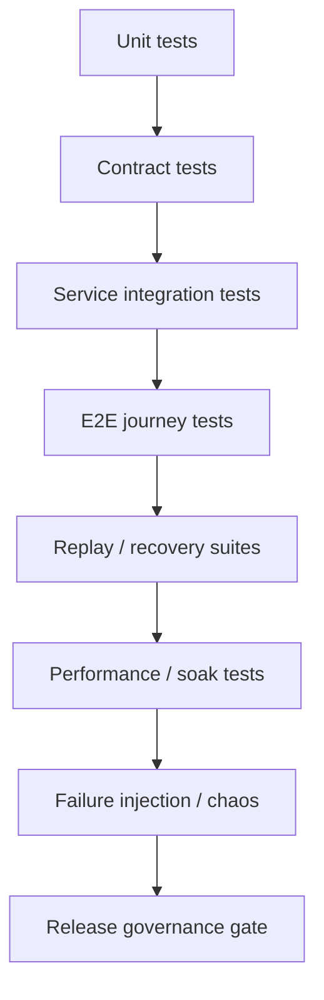

# InstaCommerce — Testing, Quality, and Release Governance

**Iteration:** 3  
**Audience:** Principal Engineers, Staff Engineers, EMs, Platform, SRE, Data/ML, AI Platform  
**Scope:** Contract tests, service integration tests, end-to-end tests, replay suites, performance testing, failure injection, ML evaluation gates, AI red-team evaluation, and release-quality governance for the q-commerce backend.  
**Companion docs:**
- `docs/reviews/iter3/appendices/validation-rollout-playbooks.md`
- `docs/reviews/iter3/platform/contracts-event-governance.md`
- `docs/reviews/iter3/platform/observability-sre.md`
- `docs/reviews/iter3/platform/repo-truth-ownership.md`
- `docs/reviews/PRINCIPAL-ENGINEERING-IMPLEMENTATION-GUIDE-PLATFORM-WISE-2026-03-06.md`

---

## 1. Executive summary

Iteration 3 confirmed a blunt truth: many of the repo's most serious defects were not subtle architecture problems, they were **defects that good quality governance should have caught much earlier**.

Examples already surfaced by the review set:
- dual checkout authority survived into production-facing code
- contract envelope drift survived across producer, schema, and consumer surfaces
- catalog-to-search indexing truth broke without a blocking signal
- payment pending-state recovery gaps were not protected by integration or replay tests
- data-platform event-time errors were able to exist without quality gates
- AI safety and rollout controls were ahead of autonomy, but still not enforced by evaluation or release policy

The testing problem is therefore not “add more unit tests.” The real program is:

1. define **what must never break**
2. wire those guarantees into **blocking gates**
3. make release classes explicit
4. force every high-risk change through the narrowest set of tests that proves it is safe
5. keep replay, rollback, and observability tied to quality governance rather than treating them as separate concerns

---

## 2. Current reality

### 2.1 Structural strengths

- Java services already use Gradle and JUnit, which is a workable base for targeted service and integration testing.
- Go services already have per-module test and build conventions.
- contracts are at least centralized in `contracts/`.
- the repo has existing rollout and observability primitives that can become release gates.

### 2.2 Structural weaknesses

| Area | Current state | Why it is dangerous |
|---|---|---|
| Contract validation | partial build-time validation only | runtime drift still reaches consumers |
| Integration testing | inconsistent and often absent | cross-service regressions survive |
| End-to-end critical-flow tests | not treated as mandatory release gates | money-path and dispatch-path regressions slip through |
| Replay suites | weak or absent across event and webhook flows | real-world duplicates and late events are under-tested |
| Load and latency testing | not formalized as release policy | flash-sale and surge behavior is guessed, not proven |
| Failure injection | no standard chaos/fault discipline | rollback assumptions are untested |
| Data and ML validation | fragmented between code, dbt, and pipeline layers | semantic drift becomes invisible |
| AI safety and evaluation | partly documented, weakly release-bound | “safe enough” remains subjective |
| Release governance | CI exists but does not map clearly to change classes | high-risk changes can pass low-signal gates |

---

## 3. Quality-governance principles

| Principle | Meaning for InstaCommerce |
|---|---|
| **Critical paths get system-level tests** | checkout, payment, reservation, dispatch, and notification cannot rely on unit coverage alone |
| **Contracts are product surfaces** | schema and topic changes must be validated like public APIs |
| **Replayability is a test discipline** | at-least-once systems must prove duplicate, reorder, and late-event safety |
| **Performance is correctness** | in q-commerce, latency regressions directly break conversion and SLA promises |
| **Every risky rollout must be observable** | tests do not replace runtime gates; they define what runtime gates must watch |
| **AI and ML need non-code gates** | offline metrics, shadow agreement, safety policy, and cost bounds are all release criteria |

---

## 4. Quality stack by layer

**Interpretation:** the layers are cumulative, not substitutable. Strong unit coverage does not excuse missing contract or replay tests.

### 4.1 Unit tests

Purpose:
- validate local business logic
- lock down state machines, validation rules, and algorithm branches

Required focus areas:
- payment state transitions
- inventory reserve/confirm/cancel invariants
- pricing and promo bounds
- fraud rule evaluation
- feature-flag percentage bucketing and kill-switch behavior
- AI guardrail policy decisions

### 4.2 Contract tests

Purpose:
- guarantee that producers, consumers, schemas, and topic names stay aligned

Required focus areas:
- envelope field presence and naming
- topic literal consistency
- consumer tolerance for additive changes
- dual-publish behavior for breaking migrations

### 4.3 Integration tests

Purpose:
- validate service + DB + messaging interactions

Required focus areas:
- order + payment + inventory transaction seams
- search index update flow
- fraud + wallet + notification side effects
- outbox + relay + consumer behavior

### 4.4 End-to-end tests

Purpose:
- validate user-visible and operator-visible critical journeys

Required focus areas:
- browse → cart → checkout → payment → order confirmation
- pick → pack → dispatch → ETA → delivery
- refund / cancel / reconciliation recovery
- admin-driven flag or config rollout

### 4.5 Replay and recovery tests

Purpose:
- prove the platform survives duplicates, retries, out-of-order events, and restarts

Required focus areas:
- webhook duplicates
- Kafka replays
- outbox resend
- late data in streaming and dbt layers
- model rollback and feature refresh replay

### 4.6 Performance and soak tests

Purpose:
- validate low-latency behavior under real load shapes

Required focus areas:
- checkout submit latency
- payment authorization/capture latency
- search and pricing fanout paths
- dispatch assignment under burst load
- AI/ML inference latency and fallback rates

### 4.7 Failure-injection and chaos tests

Purpose:
- validate rollback and resilience assumptions before production incidents validate them for you

Required focus areas:
- PSP timeout and uncertain capture
- Kafka consumer poison message
- Redis unavailable during feature or loyalty flows
- BigQuery write lag or failure
- AI inference dependency outage

---

## 5. Contract-testing program

### 5.1 Mandatory contract gates

All changes affecting `contracts/`, outbox producers, Kafka consumers, or externally visible request/response payloads must pass:

1. `./gradlew :contracts:build`
2. schema compatibility validation
3. producer fixture validation against canonical schemas
4. consumer fixture validation against both current and next additive versions
5. topic-name linting

### 5.2 Producer fixture rule

Every producer owning a domain event should maintain a serialized fixture set for:
- current happy-path payload
- minimal payload
- payload with newest additive fields populated

### 5.3 Consumer tolerance rule

Every consumer should prove:
- it accepts unknown additive fields
- it rejects incompatible shape changes clearly
- it preserves idempotency when duplicate `eventId` values arrive

### 5.4 Blocking release condition

No change class touching envelope semantics, topics, or required event fields may ship without a passing contract suite and designated owner approval.

---

## 6. Service integration and E2E program

### 6.1 Tiering critical flows

| Tier | Flow | Minimum test obligation |
|---|---|---|
| Tier 0 | checkout, payment, inventory reservation, reconciliation | integration + E2E + replay + load gate |
| Tier 1 | dispatch, ETA, fulfillment transitions, wallet, fraud review | integration + replay + latency gate |
| Tier 2 | search indexing, catalog update, notification delivery | integration + replay gate |
| Tier 3 | admin/config/reporting surfaces | targeted integration plus smoke coverage |

### 6.2 Must-have integration suites

#### Money path
- create quote / validate quote
- start checkout with deterministic idempotency key
- authorize payment
- fail order creation and verify compensation
- replay webhook and confirm no duplicate side effects
- reconcile mismatch and verify deterministic repair behavior

#### Inventory path
- reserve overlapping SKUs under concurrency
- confirm reservation exactly once
- cancel reservation idempotently
- verify warehouse and store identity alignment

#### Read/decision path
- publish catalog change and verify search update
- reprice cart on quote expiration
- apply promotion/coupon limits under concurrency

#### Logistics path
- complete pack event and verify assignment flow
- replay location updates and validate ETA recalculation
- inject malformed logistics event and confirm DLT rather than partition stall

---

## 7. Replay suites and failure-injection discipline

### 7.1 Replay matrix

| Surface | Replay scenario | Expected invariant |
|---|---|---|
| payment webhook | duplicate event | no duplicate ledger mutation or Kafka publish |
| outbox relay | resend same event | consumer dedup remains stable |
| Kafka topic | offset rewind | downstream state converges, not diverges |
| Beam/data pipeline | late event and backfill | corrected aggregates without double counting |
| feature refresh | repeated refresh | online feature store converges deterministically |
| AI model promotion | rollback to prior champion | online serving returns to previous version cleanly |

### 7.2 Failure-injection policy

Every Tier 0 and Tier 1 release must prove at least one injected failure path before production promotion:
- timeout
- duplicate delivery
- partial downstream failure
- dependency unavailability

### 7.3 What must be prohibited

- “we will test rollback in production if needed”
- “replay safety is implied by idempotency”
- “load testing is unnecessary because pods autoscale”

---

## 8. Performance, soak, and flash-event readiness

### 8.1 Performance gates

| Domain | Gate |
|---|---|
| checkout | p95 and p99 latency under representative concurrency |
| payment | auth/capture latency and pending-state volume |
| search | p95 query latency and null-result rate |
| pricing | batch-pricing latency and downstream timeout rate |
| dispatch | assignment latency and stale-rider cache rate |
| AI/ML | inference p95, fallback rate, shadow disagreement rate |

### 8.2 Soak policy

- normal high-risk changes: 72-hour soak
- money-path, dispatch, or ML/AI promotion: extended soak with explicit review sign-off
- soak must include error-budget review, not just lack of pages

### 8.3 Flash-event rehearsal

Before large sale or marketing events:
- replay expected burst patterns
- confirm queue lag thresholds
- validate autoscaling and back-pressure
- confirm kill switches and rollback paths

---

## 9. Data, ML, and AI evaluation gates

### 9.1 Data platform gates

Required before shipping data-platform changes:
- dbt parse/test success
- freshness checks
- late-data and reconciliation checks
- backfill shadow comparison when semantics change

### 9.2 ML gates

Required before model promotion:
- offline metric thresholds
- bias/fairness review where applicable
- shadow agreement gate
- versioned artifact provenance
- rollback pointer to previous champion

### 9.3 AI gates

Required before AI graph or tool changes:
- blocked-intent regression suite
- prompt injection and PII tests
- tool-permission tests by tier
- escalation and audit event tests
- cost-budget and fallback tests

---

## 10. Release quality governance

### 10.1 Change classes

| Class | Examples | Required gates |
|---|---|---|
| R0 | docs-only or low-risk internal refactor | local tests + review |
| R1 | additive service logic change | unit + targeted integration |
| R2 | contract or cross-service change | contract + integration + replay |
| R3 | money path, dispatch, inventory, or auth change | contract + integration + E2E + replay + performance + canary review |
| R4 | data semantics, model promotion, or AI behavior change | quality gates + shadow/canary + governance approval |

### 10.2 Approval policy

- Tier 0 / R3 / R4 changes require explicit owner and platform or principal sign-off
- contract and governance surfaces require CODEOWNERS review
- no emergency exception should skip post-release verification

### 10.3 Release packet

Every high-risk release should include:
- change class
- impacted services/topics/models
- required gates passed
- watch metrics
- rollback trigger
- rollback executor

---

## 11. Recommended implementation wave

### Wave 0
- CODEOWNERS
- contract CI
- repo-truth fixes
- explicit release classes

### Wave 1
- money-path integration suites
- webhook replay tests
- auth and edge regression suites

### Wave 2
- inventory and logistics replay/performance tests
- DLT and poison-message validation

### Wave 3
- read-plane regression and engagement concurrency suites
- notification/privacy and loyalty-integrity tests

### Wave 4
- data-platform correctness gates
- ML lineage, skew, shadow, and rollback tests
- AI policy and red-team suites

### Wave 5
- systematic chaos drills
- error-budget-based release freezes
- flash-event rehearsal policy

---

## 12. Final recommendation

The repo does not need a generic “more testing” initiative. It needs a **quality-governance system** that makes the most dangerous failures impossible to ship quietly.

The priority order is clear:
- contracts first
- money/inventory/dispatch correctness next
- replay and latency discipline after that
- data/ML/AI evaluation gates as the platform matures

If leadership wants one principle to enforce, it should be this:

> **No critical-path change is real until it has passed the narrowest blocking test suite that proves it is safe, reversible, and observable.**
