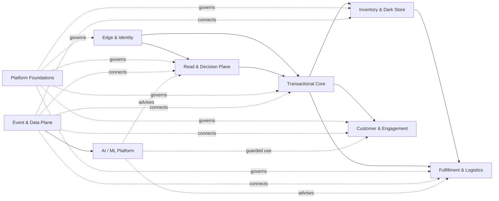
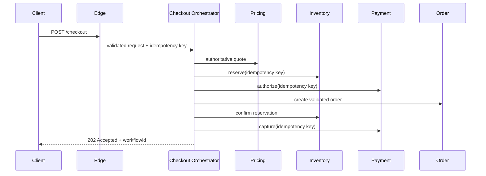
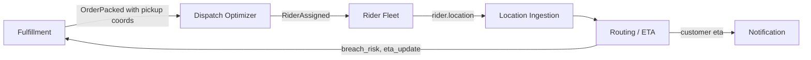
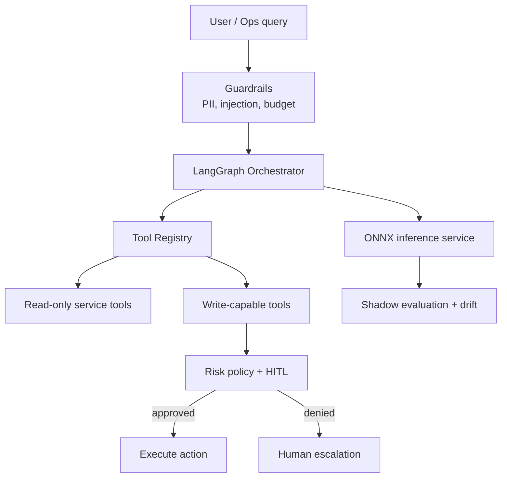

# InstaCommerce Principal Engineering Implementation Guide — Service Wise

**Date:** 2026-03-06  
**Audience:** CTO, Principal Engineers, Staff Engineers, EMs, SRE, Platform, Data/ML  
**Scope:** Concrete service-cluster implementation guidance derived from the iteration-2 and iteration-3 reviews, republished inside the `docs/reviews/iter3/` tree for discoverability.  
**Supporting docs:**  
- `docs/reviews/iter3/services/edge-identity.md`  
- `docs/reviews/iter3/services/transactional-core.md`  
- `docs/reviews/iter3/services/read-decision-plane.md`  
- `docs/reviews/iter3/services/inventory-dark-store.md`  
- `docs/reviews/iter3/services/fulfillment-logistics.md`  
- `docs/reviews/iter3/services/customer-engagement.md`  
- `docs/reviews/iter3/services/platform-foundations.md`  
- `docs/reviews/iter3/services/event-data-plane.md`  
- `docs/reviews/iter3/services/ai-ml-platform.md`  
- `docs/reviews/iter3/diagrams/hld-system-context.md`  
- `docs/reviews/iter3/diagrams/lld-edge-checkout.md`  
- `docs/reviews/iter3/diagrams/lld-eventing-data.md`  
- `docs/reviews/iter3/diagrams/sequence-checkout-payment.md`  
- `docs/reviews/iter3/implementation-program.md`

> **Location note:** The original service-wise guide was authored at the top level of `docs/reviews/`. This copy exists so the entire iteration-3 deliverable set is available under one folder tree.

---

## 1. Executive summary

This guide is not a restatement of review findings. It is the **implementation view** of those findings: how each service cluster should be corrected, in what order, with which tradeoffs, and under what operational guardrails.

Across the service fleet, the deepest pattern is consistent:

- the platform usually has the **right service boundaries**
- it often lacks a **single authority** for critical write decisions
- it frequently has **contract drift** at service seams
- it under-invests in **durable idempotency**, **DLQ behavior**, and **rollback-safe rollout**
- its biggest problem is not missing components; it is **incomplete closure of the loops between components**

The correct response is therefore not “rewrite everything.” It is:

1. make every cluster honest about current reality  
2. fix P0 contract and correctness defects first  
3. establish one decision owner per closed loop  
4. add observability, tests, and rollback before adding sophistication  
5. keep AI and advanced optimization out of authoritative control paths until the underlying loops are trustworthy

---

## 2. Cluster map

| Cluster | Display name | Services | Primary theme |
|---|---|---|---|
| C1 | Edge & Identity | `identity-service`, `mobile-bff-service`, `admin-gateway-service` | entry control, auth, rate limit, public boundary |
| C2 | Transactional Core | `checkout-orchestrator-service`, `order-service`, `payment-service`, `payment-webhook-service`, `reconciliation-engine` | money path correctness |
| C3 | Read & Decision Plane | `catalog-service`, `search-service`, `cart-service`, `pricing-service` | browse/search/cart/pricing truth |
| C4 | Inventory & Dark Store | `inventory-service`, `warehouse-service` | stock truth, reserve/confirm, dark-store semantics |
| C5 | Fulfillment & Logistics | `fulfillment-service`, `rider-fleet-service`, `dispatch-optimizer-service`, `routing-eta-service`, `location-ingestion-service` | assignment, ETA, delivery control loop |
| C6 | Customer & Engagement | `notification-service`, `wallet-loyalty-service`, `fraud-detection-service` | messaging, rewards, trust |
| C7 | Platform Foundations | `audit-trail-service`, `config-feature-flag-service` | control plane and governance substrate |
| C8 | Event & Data Plane | `outbox-relay-service`, `cdc-consumer-service`, `stream-processor-service`, `contracts/` | async truth and data movement |
| C9 | AI/ML Platform | `ai-orchestrator-service`, `ai-inference-service`, `data-platform/`, `ml/` | model serving, agent safety, analytics loop |

**Interpretation:** C1 through C6 are the business-facing clusters. C7 through C9 are enabling clusters. C2, C4, and C5 are the most operationally sensitive because they form the q-commerce promise loop.

---

## 3. Cross-cluster implementation rules

Before the cluster chapters, these rules apply everywhere:

1. **No new cross-service contract ships without a compatibility window.**
2. **No money-path or dispatch-path rollout without explicit rollback triggers and dashboards.**
3. **No pod-local cache may be treated as durable correctness state.**
4. **No cluster may claim production readiness without at least one real integration test path.**
5. **No AI write path may bypass human approval and kill-switch controls.**

---

## 4. C1 — Edge & Identity

### Current reality

Identity is the strongest part of this cluster. It already has RS256 JWT, refresh rotation, BCrypt, lockout, JWKS, and Prometheus metrics. The rest of the cluster is not at the same maturity: the mobile BFF is thin, the admin gateway is not production-safe, path normalization is inconsistent, and internal-service auth is dangerously flattened.

### Must-fix issues

| ID | Issue | Why it matters |
|---|---|---|
| C1-F1 | Edge routing mismatch between external `/api/v1/*` paths and controller paths | public traffic can 404 at the boundary |
| C1-F2 | Shared internal token collapses all callers into one trusted identity | any internal compromise can become a platform compromise |
| C1-F3 | `admin-gateway-service` has effectively no real auth posture | admin domain must not receive production traffic as-is |
| C1-F4 | Missing `@EnableSchedulerLock` means cleanup/sweeper jobs race across replicas | duplicate cleanup and inconsistent background behavior |
| C1-F5 | Rate limiting is pod-local and bypassable | attack and abuse protection is not real at scale |

### Target state

- Edge is authoritative for authn/authz normalization, quotas, path shaping, and external error envelopes.
- Identity remains the token issuer and account authority, but **not** the only defense layer.
- All service-to-service auth uses workload identity and explicit authorization policies.
- Public and admin traffic are segregated with explicit authorization at the mesh edge.
- Rate limiting runs in a shared, durable layer (Envoy/Redis) rather than per-pod memory.

### Options and tradeoffs

| Option | Summary | Pros | Cons |
|---|---|---|---|
| A | Keep current services, harden them with Istio JWT/authz and real BFF logic | lowest migration cost, preserves structure | still requires substantial code completion in BFF/admin |
| B | Collapse BFF/admin into a dedicated API gateway product | stronger centralized control | larger tooling shift, less aligned to current repo |
| C | Hybrid: Istio handles authz/rate limits, BFF only does aggregation and shaping | best near-term balance | still requires disciplined boundary ownership |

**Recommendation:** Option C. Use Istio and workload identity for security/control, and keep BFF/admin only for client-specific aggregation and policy-safe orchestration.

### Migration sequence

1. **Sprint 1**
   - deny `admin-gateway-service` traffic at Istio until auth exists
   - remove `ROLE_ADMIN` from shared internal auth filter paths
   - add `@EnableSchedulerLock`
   - fix external route rewrites and smoke-test them
2. **Sprint 2**
   - implement AuthorizationPolicy coverage for all edge-reachable services
   - move rate limiting to Envoy/Redis-backed policy
   - annotate KSAs/GSAs for workload identity
3. **Sprint 3**
   - implement real mobile BFF aggregation for checkout status, catalog, and order tracking
   - build admin JWT/RBAC flow explicitly

### Validation and observability

- smoke tests for every public route prefix
- explicit authz-deny tests for admin endpoints
- rate-limit effectiveness under multi-replica load
- metrics: `401 rate`, `403 rate`, `rate_limit_rejects`, `jwt_validation_failures`, `internal_auth_denies`

### Rollback

- mesh policy changes are reversible by Helm/Argo rollback
- admin deny policy should stay on until positive auth proof exists
- workload identity rollout should be canaried service-by-service

### Ownership notes

This cluster needs one **edge platform owner** and one **identity owner**. Without that separation, BFF scope creep and auth sprawl will continue.

---

## 5. C2 — Transactional Core (Money Path)

### Current reality

The repo currently contains **two real checkout implementations** with different workflow IDs, different compensation behavior, and different pricing authority. The payment service itself is closer to production-grade than several surrounding services, but its durability and recovery loops are incomplete. This cluster is the most critical part of the program because it directly affects money, order correctness, and customer trust.

### Must-fix issues

| ID | Issue | Why it matters |
|---|---|---|
| C2-F1 | checkout authority duplicated across `checkout-orchestrator-service` and `order-service` | same external action can follow two different correctness models |
| C2-F2 | `order-service` trusts client-supplied price data | direct exploit surface for price manipulation |
| C2-F3 | payment capture/void idempotency is incomplete | timeout + retry can become double charge or invalid void |
| C2-F4 | no stuck-pending recovery job | orders can remain blocked indefinitely |
| C2-F5 | webhook fan-out is incomplete and not durable enough | PSP truth does not reliably reach downstream services |
| C2-F6 | reconciliation uses non-authoritative input | finance correction loop is not real |

### Target state

- `checkout-orchestrator-service` is the **sole** checkout saga owner.
- `order-service` owns order state, not checkout orchestration.
- payment auth/capture/void/refund all have durable idempotency keys.
- webhook events are durably ingested, deduplicated, and propagated.
- intermediate payment states are swept and reconciled automatically.
- all checkout APIs return semantics that reflect real state, not “200 OK with failed body”.

### Options and tradeoffs

| Option | Summary | Pros | Cons |
|---|---|---|---|
| A | Make checkout-orchestrator the sole orchestrator | preserves clean domain separation, best current implementation base | adds network hop to order creation |
| B | Collapse orchestration into order-service | fewer services | increases service complexity and starts from the weaker implementation |
| C | Keep both but route by use case | lowest short-term disruption | longest-term correctness hazard |

**Recommendation:** Option A. The orchestrator is already closer to the desired model, and keeping orchestration outside the order domain is healthier for long-term evolution.

### Recommended migration

1. fix inventory idempotency on the orchestrator path
2. return proper non-200 failure semantics immediately
3. route all traffic to the orchestrator path
4. add metric alarms to detect any residual traffic to `order-service /checkout`
5. remove checkout workflow code from order-service
6. add async `202 + status` semantics to reduce thread exhaustion
7. add stuck-pending recovery and reconciliation closure

### Validation and rollback

- Temporal workflow tests for retry and compensation
- integration tests for PSP replay, webhook replay, and capture timeout
- canary traffic split between old and new path only during observation window
- rollback trigger: duplicate charge, stuck authorization spike, order creation divergence

### Ownership notes

This cluster must have a single **money-path DRI**. Splitting checkout, payment, and reconciliation ownership without one accountable lead will fail.

---

## 6. C3 — Read & Decision Plane

### Current reality

This cluster has the right macro-boundaries but multiple broken seams. Search is not merely underpowered; its current indexing path is effectively broken because catalog events are not truly published and the payload shape does not satisfy search consumer expectations. Cart and pricing also contain P0 contract defects that can break add-to-cart and checkout flows outright.

### Must-fix issues

| ID | Issue | Why it matters |
|---|---|---|
| C3-F1 | catalog→search indexing is broken end to end | search freshness and correctness are not trustworthy |
| C3-F2 | cart/pricing API mismatches break runtime behavior | customer path can fail before any optimization matters |
| C3-F3 | promotion `maxUses` bug makes bounded promos effectively unlimited | direct margin leakage |
| C3-F4 | no store-aware availability in ranking | false in-stock promises leak GMV and trust |
| C3-F5 | no quote / quote-lock semantics | customer can see one price and pay another |

### Target state

- catalog publishes one authoritative product event vocabulary
- search ingests it successfully and ranks with store-aware availability
- cart uses durable idempotency and correct inter-service APIs
- pricing returns TTL-bounded quote tokens validated during checkout
- search quality can improve iteratively without lying about availability

### Options and tradeoffs

| Option | Summary | Pros | Cons |
|---|---|---|---|
| A | Fix contracts and harden Postgres search first | cheapest and fastest | limited long-term semantic retrieval |
| B | Move immediately to OpenSearch/Elasticsearch | higher ceiling | too much change before contract truth is fixed |
| C | Hybrid: fix Postgres now, then add dedicated retrieval later | balanced path | requires discipline to avoid “temporary forever” |

**Recommendation:** Option C. Fix the broken event path and user-visible correctness first, then uplift retrieval once the base truth is stable.

### Migration sequence

1. replace logging stub publisher with real outbox publication
2. align event payload with consumer contract
3. add store availability to search index and ranking
4. fix cart/pricing URL/method mismatches and promotion limits
5. introduce quote token contract
6. add `pg_trgm` / similarity as first typo-tolerance upgrade
7. evaluate dedicated search stack only after availability-aware search is stable

### Validation and observability

- indexing lag metric and dead-letter monitoring
- search freshness synthetic tests
- quote mismatch rate
- promo usage limit enforcement tests
- business metrics: add-to-cart success, zero-result rate, out-of-stock click-through rate

### Rollback

- keep old ranking as a feature flag fallback
- dual-write index fields during availability rollout
- quote token rollout should allow a temporary compatibility mode with legacy price validation

---

## 7. C4 — Inventory & Dark Store

### Current reality

Inventory correctness is currently blocked by concrete defects: wrong reservation routes, missing optimistic concurrency, and contract-broken events. Even after those are fixed, the model is still not dark-store-grade because it lacks explicit ATP strategy, store-type semantics, and hot-SKU handling.

### Must-fix issues

| ID | Issue | Why it matters |
|---|---|---|
| C4-F1 | checkout calls nonexistent inventory endpoints | reserve step can fail with 404 |
| C4-F2 | reservation confirm/cancel is not concurrency-safe | stock can double-decrement |
| C4-F3 | inventory event payloads violate schemas | downstream consumers cannot trust them |
| C4-F4 | low-stock uses wrong field names | replenishment signals are unreliable |
| C4-F5 | no perishable/expiry or store-type depth | not credible for serious dark-store operations |

### Target state

- reserve, confirm, and cancel are stable APIs with durable idempotency
- reservation state changes are versioned and concurrency-safe
- emitted inventory events conform to contracts
- ATP and replenishment signals are explicit
- warehouse and inventory semantics support dark store, hub, and replenishment flows

### Options and tradeoffs

| Option | Summary | Pros | Cons |
|---|---|---|---|
| A | Retrofit current inventory service with locking, API fixes, and ATP fields | fastest path | still keeps complexity inside one service |
| B | Split ATP/reservation into separate authority service | cleaner conceptual separation | too much churn before current defects are fixed |
| C | Add warehouse-driven reservation authority | closer to physical ops | complicates checkout path prematurely |

**Recommendation:** Option A first. Make current inventory truthful before decomposing further.

### Migration sequence

1. fix reservation endpoints and payload contracts
2. add `@Version` / migration on reservation entities
3. correct emitted event fields (`orderId`, `storeId`)
4. add capacity / ATP fields and store-type semantics
5. add replenishment event loop and expiry tracking

### Validation and rollback

- concurrency test for double-confirm and double-cancel
- checkout reserve-path smoke tests
- schema validation for all inventory events
- rollback trigger: stock divergence, reservation errors, checkout reserve failures

---

## 8. C5 — Fulfillment & Logistics

### Current reality

This cluster has multiple services but not yet one closed operational loop. Dispatch authority is split, rider lifecycle recovery is weak, malformed messages can stall Kafka handling, and live ETA does not yet function as a real predictive control loop. This is the clearest gap between the current repo and top q-commerce operators.

### Must-fix issues

| ID | Issue | Why it matters |
|---|---|---|
| C5-F1 | no single dispatch owner | duplicate or conflicting assignment decisions |
| C5-F2 | rider lifecycle has no recovery sweeper | stuck states permanently reduce capacity |
| C5-F3 | malformed logistics events can stall partitions | localized bad data becomes fleet-wide pain |
| C5-F4 | `OrderPacked` payload is too sparse | downstream geo-assignment path breaks |
| C5-F5 | ETA and dispatch are not continuously closed-loop | SLA breach discovered too late |

### Target state

- `dispatch-optimizer-service` owns assignment decisions
- fulfillment does not assign riders directly
- rider state machine has timeout-based recovery
- ETA is recalculated from live location and prep-time signals
- delivery status changes are driven by confirmed counter-events, not optimistic assumptions

### Options and tradeoffs

| Option | Summary | Pros | Cons |
|---|---|---|---|
| A | Let fulfillment remain the orchestrator and use optimizer as advisor | low change | preserves split authority |
| B | Make dispatch optimizer the sole assignment authority | clean ownership | requires contract and ownership cleanup |
| C | External routing engine owns assignment loop | scalable ceiling | too much infrastructure change now |

**Recommendation:** Option B. The optimizer should own dispatch decisions; everything else should consume or provide signals.

### Migration sequence

1. add `DefaultErrorHandler + DeadLetterPublishingRecoverer` to Kafka consumers
2. complete `OrderPacked` and `RiderAssigned` schemas
3. enforce rider identity on terminal actions
4. designate optimizer as sole assignment owner
5. add stuck-state sweeper and ETA breach loop
6. add dynamic prep-time and batching only after the control loop is real

### Validation and rollback

- DLT volume alarms
- rider-state timeout tests
- assignment duplication detector
- ETA error distribution by zone and hour
- rollback trigger: assignment drop, rider stuck states, breach-rate spike

---

## 9. C6 — Customer & Engagement

### Current reality

This cluster is not structurally broken, but it contains several customer-visible and financially risky correctness gaps: raw PII persistence, duplicate loyalty deductions, lack of distributed locking, and insufficient fraud operator controls.

### Must-fix issues

| ID | Issue | Why it matters |
|---|---|---|
| C6-F1 | notification masking is silently ignored | privacy and GDPR risk |
| C6-F2 | loyalty updates are not concurrency-safe | double-spend and liability risk |
| C6-F3 | `redeemPoints()` is retry-unsafe | duplicate deductions under retry |
| C6-F4 | notification and loyalty outbox/event shapes drift from platform contracts | downstream breakage |
| C6-F5 | fraud decisions lack real operator override and fast rule refresh | model or rule mistakes have no safe operational escape |

### Target state

- notification deduplicates by event fingerprint and fully erases user content where required
- loyalty credit/debit paths are versioned or locked
- retries are stable because business references are deterministic
- fraud modes include pass-through, review, and block with fast kill switches

### Options and tradeoffs

| Option | Summary | Pros | Cons |
|---|---|---|---|
| A | Fix each service locally with DB locking and contract alignment | fastest remediation | keeps some duplicated platform patterns |
| B | Extract shared engagement primitives | cleaner future state | overkill before correctness basics are fixed |
| C | Push more control into event platform first | centralizes delivery semantics | delays urgent customer-facing fixes |

**Recommendation:** Option A now, with selective extraction later if patterns repeat.

### Migration sequence

1. honor masking and erase rendered bodies
2. add optimistic locking/versioning to loyalty accounts
3. make redemption references deterministic and idempotent
4. align outbox/event envelopes with platform standard
5. add fraud-rule audit log, fast cache refresh, and override modes

### Validation and rollback

- replay notification events and confirm no duplicate sends
- concurrent redeem/earn tests
- GDPR erasure verification
- fraud mode-switch drills

---

## 10. C7 — Platform Foundations

### Current reality

This cluster is the governance substrate for the rest of the repo. Today it is directionally correct but operationally weak: feature flags are not fast enough for true emergency stop behavior, audit integrity is not tamper-evident, and repository ownership/governance is under-specified.

### Must-fix issues

| ID | Issue | Why it matters |
|---|---|---|
| C7-F1 | feature flags do not provide a real low-latency kill switch | incident response is slower than it should be |
| C7-F2 | audit log lacks cryptographic tamper evidence | compliance and incident reconstruction are weaker than required |
| C7-F3 | no CODEOWNERS and weak review enforcement | ownership drift continues everywhere |

### Target state

- feature evaluation is cached locally with explicit TTL policy and emergency-stop propagation
- audit records are hash-linked and verifiable
- ownership, ADRs, and release classes are explicit and enforced

### Recommended path

- keep current services, but harden them instead of replacing them
- pair platform-foundation changes with Wave 0 and Wave 5 governance rollout
- avoid overbuilding a control plane before the repo itself is honest about ownership and CI

### Validation and rollback

- kill-switch latency tests
- audit-chain verifier CLI checks
- review rule enforcement on representative PRs

---

## 11. C8 — Event & Data Plane

### Current reality

The repo has the right eventing primitives—outbox relay, CDC, Kafka, contracts, data-platform directories—but the plane is undermined by envelope inconsistency, ghost events, missing CI enforcement, and some dangerous runtime bugs in the Go data path.

### Must-fix issues

| ID | Issue | Why it matters |
|---|---|---|
| C8-F1 | envelope semantics are inconsistent and partly header-only | consumers cannot rely on event metadata uniformly |
| C8-F2 | many published events have no schema | platform contract governance is incomplete |
| C8-F3 | no CI breaking-change enforcement | contract regressions ship silently |
| C8-F4 | consumer commit semantics and webhook publishing are unsafe | retries and broker faults can lose correctness |
| C8-F5 | data platform uses processing time instead of event time | analytical and ML signals are semantically wrong under late data |

### Target state

- one authoritative envelope model with shared publish/consume libraries
- all production events have schemas and compatibility windows
- CI enforces proto and JSON schema safety
- Go consumers and relays use durable retry/DLQ semantics
- data platform is event-time correct and idempotent

### Options and tradeoffs

| Option | Summary | Pros | Cons |
|---|---|---|---|
| A | Standardize existing Kafka stack with shared libraries + CI | aligned with current repo, fast path | requires discipline across many services |
| B | Introduce a heavier external schema registry first | stronger central control | more tooling before basic correctness is fixed |
| C | Freeze event evolution and minimize shared contracts | lowest coordination | limits platform growth and does not solve current bugs |

**Recommendation:** Option A first, with registry evolution only after schema truth and CI are functioning.

### Migration sequence

1. define one envelope contract and publish helper behavior
2. add CI checks for contracts
3. remove ghost events or formalize them
4. fix Go commit semantics and webhook publish durability
5. convert Beam pipelines to event-time, add allowed lateness, and add BQ upsert semantics

### Validation and rollback

- consumer contract tests
- DLQ depth and lag alarms
- data replay correctness tests
- rollback by dual-topic or dual-schema compatibility windows, not hard cutovers

---

## 12. C9 — AI / ML Platform

### Current reality

This cluster has better structure than many companies at this stage: feature-store concepts, training pipelines, shadow mode, guardrails, and ONNX serving intent exist. But iteration 3 found a large truth gap between documentation and runtime, plus two blocking ML issues: the inference path still runs stubs rather than the promoted ONNX artifacts, and shadow agreement is not operationally visible across pods.

### Must-fix issues

| ID | Issue | Why it matters |
|---|---|---|
| C9-F1 | runtime is thinner than the documented AI story | architectural trust is overstated |
| C9-F2 | production inference is not yet serving the intended artifacts consistently | “ML in production” is overstated |
| C9-F3 | shadow agreement is not durable or cross-pod visible | promotions are weakly governed |
| C9-F4 | feature naming/path drift exists | training and serving can silently diverge |
| C9-F5 | AI write actions do not yet have mature HITL and kill-switch governance | unsafe automation risk |

### Target state

- ONNX inference is the real online serving path
- shadow, drift, and promotion gates are visible and durable
- feature definitions are canonicalized across training and serving
- AI agents stay read-only until policy, audit, and rollback controls are proven

### Options and tradeoffs

| Option | Summary | Pros | Cons |
|---|---|---|---|
| A | Conservative staged rollout: read-only AI, hardened ML ops | safest and most aligned to repo state | slower visible AI ambition |
| B | Aggressive agentic rollout into operations | high upside narrative | unacceptable control risk at current maturity |
| C | Freeze AI and focus only on data/ML | reduces risk | leaves real leverage on the table |

**Recommendation:** Option A. Keep AI in recommendation, retrieval, support, and bounded decision-support roles until the platform beneath it is trustworthy.

### Migration sequence

1. replace inference stubs with actual served artifacts
2. persist shadow agreement and drift signals centrally
3. fix feature naming drift and CI validation
4. harden LangGraph guardrails and checkpoint persistence
5. permit HITL-gated write actions only after policy and rollback drills pass

### Validation and rollback

- champion/challenger comparison gates
- artifact provenance and rollback drills
- tool-call audit verification
- fail-open/fail-closed policy tests for LLM dependency outages

---

## 13. Service-wise ownership and wave map

| Cluster | First wave to implement | Blocking ADRs | Primary rollout risk |
|---|---|---|---|
| C1 | Wave 0 / Wave 1 | ADR-002 | accidental public/admin exposure |
| C2 | Wave 1 | ADR-001, ADR-005 | money-path regression |
| C3 | Wave 3 | ADR-005 | user-visible conversion loss |
| C4 | Wave 2 | none before execution | stock divergence |
| C5 | Wave 2 | ADR-006 | assignment or ETA collapse |
| C6 | Wave 3 | ADR-005 partly | customer trust and liability |
| C7 | Wave 0 / Wave 5 | ADR-009, ADR-010 | governance stays non-binding |
| C8 | Wave 0 / Wave 4 | ADR-003, ADR-004, ADR-011 | systemic async inconsistency |
| C9 | Wave 4 / Wave 6 | ADR-007, ADR-008 | unsafe or misleading automation |

---

## 14. Final recommendation

If leadership wants the shortest implementable service-wise message, it is this:

- **C1 and C2** must be stabilized before broad production confidence is rational  
- **C4 and C5** must be closed-loop before promising top-tier q-commerce SLAs  
- **C3 and C6** must stop lying to customers before optimization work matters  
- **C8 and C9** must become governed before data, ML, or AI claims can be trusted at scale  

The repo already has most of the structural pieces. The implementation challenge is to wire them into **authoritative, observable, rollback-safe loops**.
