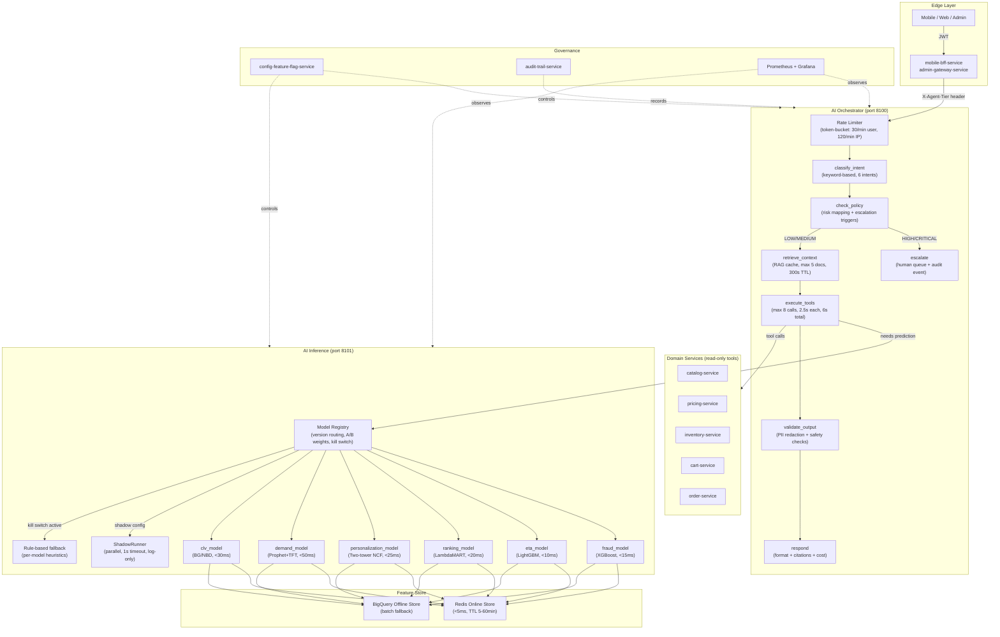
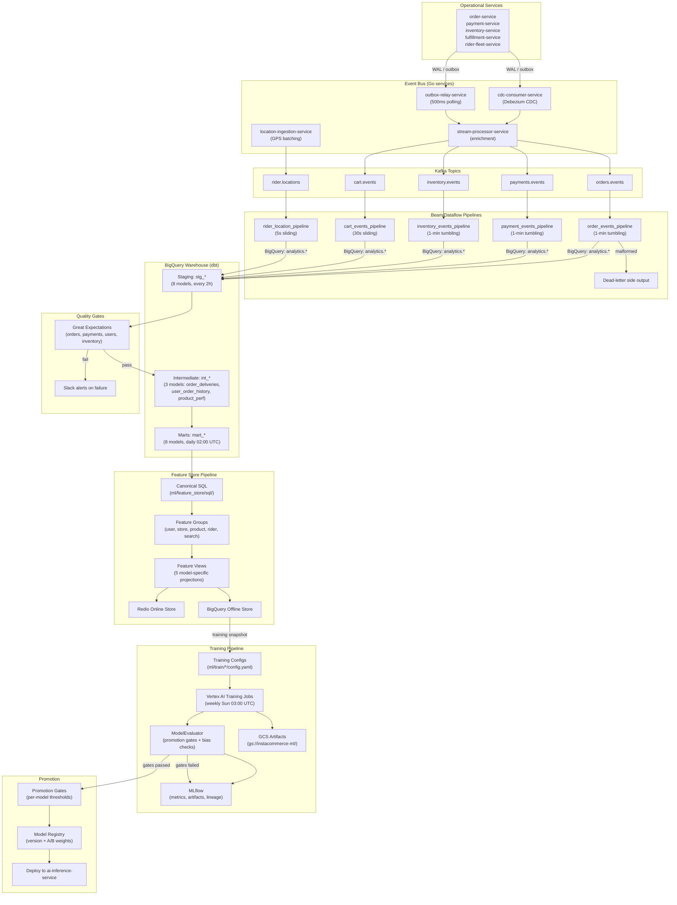
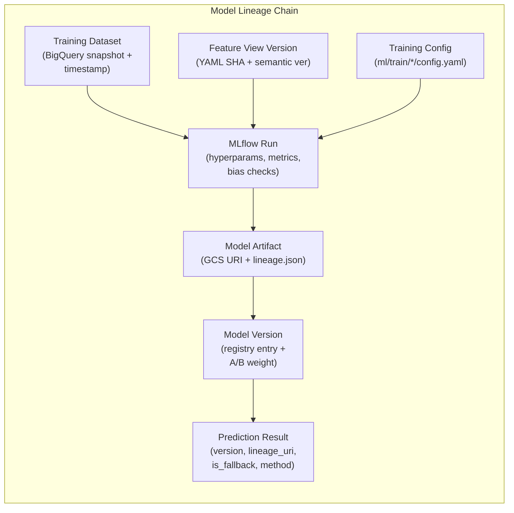
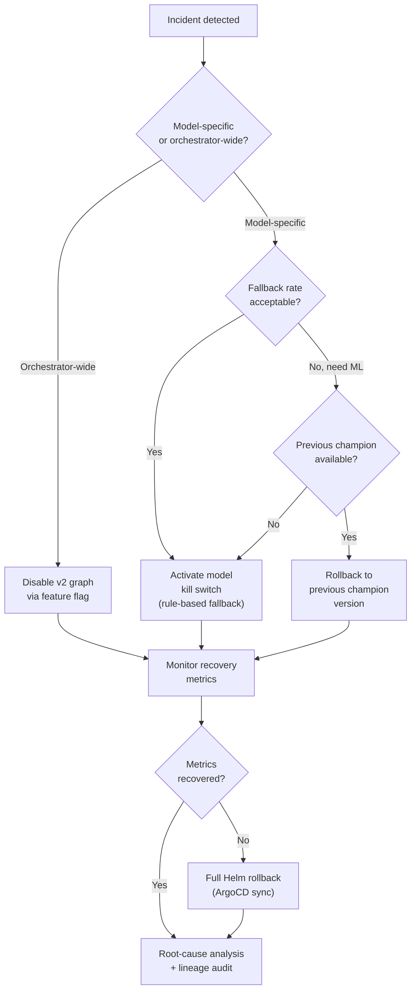

# InstaCommerce -- AI / ML Platform Service-Cluster Implementation Guide

**Iteration:** 3
**Audience:** Principal Engineers, Staff Engineers, ML Platform, Data Platform, AI Platform, SRE, Security
**Scope:** `services/ai-orchestrator-service`, `services/ai-inference-service`, `ml/`, `data-platform/`, and the production control surfaces that AI and ML can influence in a q-commerce backend.
**Companion docs:**
- `docs/reviews/iter3/platform/ml-platform-productionization.md`
- `docs/reviews/iter3/platform/ai-agent-governance.md`
- `docs/reviews/iter3/diagrams/flow-data-ml-ai.md`
- `docs/reviews/PRINCIPAL-ENGINEERING-IMPLEMENTATION-GUIDE-SERVICE-WISE-2026-03-06.md`

---

## Table of Contents

1. [Cluster Purpose -- Why AI Must Remain Guarded in Q-Commerce](#1-cluster-purpose----why-ai-must-remain-guarded-in-q-commerce)
2. [Current-State Topology](#2-current-state-topology)
3. [Authoritative vs Advisory Boundaries](#3-authoritative-vs-advisory-boundaries)
4. [Online Inference Flow and Offline Training Flow](#4-online-inference-flow-and-offline-training-flow)
5. [Feature / Data Contract Boundaries and Drift Controls](#5-feature--data-contract-boundaries-and-drift-controls)
6. [Runtime Policies, Approvals, and Kill Switches](#6-runtime-policies-approvals-and-kill-switches)
7. [Failure Modes, Fallback Modes, and Rollback Model](#7-failure-modes-fallback-modes-and-rollback-model)
8. [Metrics, SLOs, and Evaluation Gates](#8-metrics-slos-and-evaluation-gates)
9. [Implementation Roadmap and Ownership Model](#9-implementation-roadmap-and-ownership-model)
10. [Appendix -- Mermaid Diagrams for Online and Offline Paths](#10-appendix----mermaid-diagrams-for-online-and-offline-paths)

---

## 1. Cluster Purpose -- Why AI Must Remain Guarded in Q-Commerce

### 1.1 Strategic Promise

The AI / ML cluster is the highest-leverage enhancement plane in the InstaCommerce backend. Six production models already cover the critical q-commerce decision surfaces:

| Model | Service file | Framework | Decision surface |
|---|---|---|---|
| Fraud detection | `ai-inference-service/app/models/fraud_model.py` | XGBoost (98 features) | Checkout gate: auto-approve / soft-review / block |
| ETA prediction | `ai-inference-service/app/models/eta_model.py` | LightGBM (60+ features, 3 stages) | Customer-facing delivery promise |
| Search ranking | `ai-inference-service/app/models/ranking_model.py` | LambdaMART (LightGBM -> ONNX) | Search result ordering |
| Demand forecast | `ai-inference-service/app/models/demand_model.py` | Prophet + TFT | Inventory replenishment, rider planning |
| Personalization | `ai-inference-service/app/models/personalization_model.py` | Two-tower NCF (PyTorch -> ONNX) | Homepage, buy-again, frequently-bought-together |
| CLV prediction | `ai-inference-service/app/models/clv_model.py` | BG/NBD + Gamma-Gamma | Segment targeting, retention triggers |

The LangGraph orchestrator (`ai-orchestrator-service`) adds an agentic layer that coordinates intent classification, policy gating, RAG context retrieval, tool invocation against domain services, and guardrailed response generation.

### 1.2 Why Caution is Mandatory

Q-commerce operates under hard time constraints (10-20 minute delivery promises), real-money flows (payment capture, refunds, wallet credits), and safety-critical dispatch decisions (rider assignment, route optimization). In this environment:

1. **A wrong fraud score blocks a legitimate order or leaks a fraudulent one.** The consequences are either lost GMV or chargeback losses -- both measured in minutes, not days.
2. **A wrong ETA promise erodes customer trust.** ETA is the single most visible ML output; errors compound across the funnel (cart abandonment, support calls, rider penalties).
3. **An autonomous AI action on a money path is an irrevocable commitment.** Unlike a misranked search result, a refund execution or dispatch reassignment cannot be silently corrected.
4. **LLM reliability is fundamentally probabilistic.** The orchestrator uses external LLM APIs (`llm_api_url` in config) with per-request budgets (`max_cost_usd` capped at $0.50, `max_latency_ms` up to 30s). These are advisory-quality outputs, not transactional-quality commitments.

**Principal rule:** AI may propose, infer, classify, triage, retrieve, summarize, and recommend. It must not autonomously commit authoritative writes on money, inventory, dispatch, or account paths until governance is proven in production.

### 1.3 Current Maturity Assessment

| Capability | Repo evidence | Gap |
|---|---|---|
| Graph-based orchestration | `app/graph/graph.py` -- compiled LangGraph state machine with 7 typed nodes | Mature |
| Guardrails (PII, injection, budget, rate-limit) | `app/guardrails/` -- 5 modules with real implementations | Injection detector fails open on error (catches Exception, returns safe=True) |
| Tool safety | `app/graph/tools.py` -- circuit breaker, idempotency keys, per-tool timeout | Allowlist is global, not per-trust-tier |
| Model registry | `ml/serving/model_registry.py` -- in-process dict, A/B weights, kill switch | No persistence across restarts; no lineage to training run |
| Shadow mode | `ml/serving/shadow_mode.py` -- async parallel inference, 1s timeout, 10% tolerance | Agreement state is pod-local; not persisted; no automatic promotion |
| Drift detection | `ml/serving/monitoring.py` -- PSI per-call | Never aggregated; no scheduled baseline comparison |
| Feature store | `ml/feature_store/` -- 5 entities, 5 feature groups, 5 feature views, SQL definitions | No offline-online reconciliation; no skew check |
| Evaluation gates | `ml/eval/evaluate.py` -- threshold checks, bias checks, MLflow logging | Not wired into Airflow DAG gate task; DAG checks single metric |
| Inbound auth | Neither AI service enforces caller authentication | Open internal attack surface |
| Audit integration | Structured logs exist but do not reach `audit-trail-service` | Compliance queries cross three log streams |

---

## 2. Current-State Topology

### 2.1 Service Map

| Surface | Port | Language | Primary role |
|---|---|---|---|
| `ai-orchestrator-service` | 8100 | Python / FastAPI | LangGraph orchestration, tool routing, guardrails, budget enforcement |
| `ai-inference-service` | 8101 | Python / FastAPI | Online model serving (6 models), shadow mode, feature store integration |
| `ml/` | N/A (offline) | Python | Training configs, evaluation framework, feature store definitions, serving library |
| `data-platform/` | N/A (offline) | Python / SQL | dbt warehouse (stg/int/mart), Airflow orchestration, Beam streaming, Great Expectations |

### 2.2 Dependency Topology

**AI Orchestrator dependencies:**
- External LLM API (configurable via `llm_api_url`, `llm_model`)
- `ai-inference-service` for real-time predictions
- Domain services via tool registry: `catalog-service`, `pricing-service`, `inventory-service`, `cart-service`, `order-service` (all read-only via HTTP with circuit breakers)
- Redis (optional, for conversation checkpoints via `checkpoints.py`)

**AI Inference dependencies:**
- Feature store backend: Redis (online, <5ms) or BigQuery (batch fallback)
- Model weights: `$AI_INFERENCE_WEIGHTS_PATH` (default `./weights.json`), in-process model registry
- Shadow model configuration: `$AI_INFERENCE_SHADOW_MODELS` (JSON map)
- Prometheus metrics endpoint for observability

**Offline pipeline dependencies:**
- BigQuery as the warehouse (dbt source and sink)
- Kafka topics: `order.events`, `payment.events`, `cart.events`, `inventory.events`, `rider.locations`
- Beam/Dataflow for streaming ingestion
- Vertex AI for training job execution (GPU: T4 for PyTorch/TF, CPU for LightGBM)
- MLflow for experiment tracking and artifact registry
- GCS data lake: `gs://instacommerce-data-lake/` (raw, processed, ml zones)
- Vertex AI Feature Store for online serving push

### 2.3 Deployment Shape

| Service | Replicas (dev) | HPA range | CPU req/limit | Memory req/limit | PDB |
|---|---|---|---|---|---|
| `ai-orchestrator-service` | 2 | 2-8 @ 70% CPU | 500m / 1000m | 768Mi / 1536Mi | maxUnavailable: 1 |
| `ai-inference-service` | 2 | 2-6 @ 70% CPU | 750m / 1500m | 1024Mi / 2048Mi | maxUnavailable: 1 |

Health probes for both services: readiness at `/health/ready` (initial delay 15s, period 10s), liveness at `/health/live` (initial delay 30s, period 15s), startup at `/health/live` (initial delay 10s, period 5s, failure threshold 20).

---

## 3. Authoritative vs Advisory Boundaries

### 3.1 The Boundary Principle

Every interaction between the AI cluster and the rest of the platform falls into one of two categories:

| Category | Meaning | Enforcement |
|---|---|---|
| **Authoritative** | The AI output directly commits a state change | PROHIBITED for money, inventory, dispatch, account paths |
| **Advisory** | The AI output proposes, ranks, scores, or summarizes; a deterministic service or human commits the change | PERMITTED and actively encouraged |

This is not a philosophical distinction. It is an operational safety boundary that determines rollback cost. Advisory outputs can be ignored, overridden, or corrected without side effects. Authoritative outputs create obligations (refunds, deliveries, charges) that require compensating transactions.

### 3.2 Current Tool Registry Boundary

The tool registry in `app/graph/tools.py` currently allowlists eight read-only tools:

```
catalog.search, catalog.get_product, catalog.list_products
pricing.calculate, pricing.get_product
inventory.check
cart.get, order.get
```

No write tools (order creation, refund initiation, payment modification, inventory mutation) are registered. This is the correct default posture. The risk is that `tool_allowlist` is a `List[str]` in `Settings` loaded from the environment -- a misconfigured deployment could extend the list without code review.

### 3.3 Recommended Tier-Based Enforcement

Tool access must be identity-aware, not global. The orchestrator should resolve the caller's trust tier from the verified JWT claim (`X-Agent-Tier` header injected by the BFF after JWT validation) and enforce a per-tier allowlist:

| Tier | Allowed tools | Write authority |
|---|---|---|
| `anonymous` | catalog.search, catalog.get_product, catalog.list_products, inventory.check, pricing.get_product | None |
| `verified` | All anonymous tools + pricing.calculate, cart.get, order.get | None |
| `operator` | All verified tools + order.refund, order.cancel (with approval workflow) | Propose-only; requires human approval before execution |
| `system` | Direct service calls, not tool registry | N/A |

### 3.4 Domains That Must Remain Deterministic

| Domain | Why AI must not have write authority |
|---|---|
| Payment (capture, refund, dispute) | Irrevocable financial commitment |
| Inventory (reservation, mutation) | Affects real-world stock and fulfillment |
| Dispatch (rider assignment, route change) | Safety-critical, affects live riders |
| Order state transitions | Triggers downstream payment and fulfillment workflows |
| Pricing (bulk override, promo creation) | Revenue and competitive exposure |
| Identity / compliance (KYC, account close) | Regulatory and legal obligation |

AI may read, summarize, classify, and prepare proposals for all of these. The domain service owner commits the authoritative state change.

---

## 4. Online Inference Flow and Offline Training Flow

### 4.1 Online Inference Path

When a user or operator query reaches the AI cluster, the following path executes:

1. **Edge authentication** -- BFF validates JWT, injects `X-Agent-Tier`, forwards to orchestrator.
2. **Rate limiting** -- Token-bucket rate limiter in `rate_limiter.py` (per-user: 30/min, per-IP: 120/min, max inflight: 200).
3. **Intent classification** -- `classify_intent` node uses keyword matching to determine intent (SUBSTITUTE, SUPPORT, RECOMMEND, SEARCH, ORDER_STATUS, UNKNOWN) with confidence score.
4. **Policy check** -- `check_policy` node maps intent to risk level (LOW/MEDIUM/HIGH/CRITICAL). HIGH/CRITICAL or flagged users trigger escalation.
5. **Context retrieval** -- `retrieve_context` node fetches RAG results (max 5 documents, 300s cache TTL).
6. **Tool execution** -- `execute_tools` node calls domain services via the tool registry (max 8 calls, 2.5s per call, 6.0s total ceiling, circuit breaker at 3 failures with 30s reset).
7. **Model inference** -- If the query requires a prediction (ETA, fraud score, ranking, demand, personalization), the orchestrator calls `ai-inference-service`:
   - Model registry resolves the active version (with A/B weights if configured).
   - Feature retrieval from Redis online store (<5ms) or BigQuery fallback.
   - Model prediction with version tagging and SHAP feature contributions.
   - Shadow model runs in parallel if configured (1s timeout, results logged but not served).
8. **Output validation** -- `validate_output` node runs PII redaction (reversible vault with HMAC tagging) and safety checks.
9. **Response** -- `respond` node formats the final response with citations, tool results summary, token count, cost, and latency.

**Latency budget:** The orchestrator enforces `max_latency_ms` (configurable, up to 30s). Individual model targets are: fraud <15ms, ETA <10ms, ranking <20ms, personalization <25ms, CLV <30ms, demand <50ms.

### 4.2 Offline Training Path

The offline pipeline follows a layered architecture with clear stage boundaries:

1. **Event ingestion** -- Operational services emit events via Debezium CDC and outbox relay through Kafka. Go services (`cdc-consumer-service`, `outbox-relay-service`, `stream-processor-service`) manage the event bus.
2. **Streaming landing** -- Beam/Dataflow pipelines (`data-platform/streaming/pipelines/`) land events in BigQuery with 1-min tumbling windows for orders/payments/inventory, 30s sliding windows for carts, and 5s sliding windows for rider locations. Malformed events go to dead-letter side outputs.
3. **Warehouse transformation** -- dbt models transform data through three layers:
   - Staging (`stg_*`): 8 models, refreshed every 2h via `dbt_staging` DAG
   - Intermediate (`int_*`): 3 models (order_deliveries, user_order_history, product_performance)
   - Marts (`mart_*`): 8 models, rebuilt daily at 02:00 UTC via `dbt_marts` DAG
4. **Quality gates** -- Great Expectations suites (`data-platform/quality/expectations/`) validate orders, payments, users, and inventory after each load. Critical failures trigger Slack alerts and DAG pause.
5. **Feature computation** -- `ml_feature_refresh` DAG (every 4h) executes canonical SQL from `ml/feature_store/sql/` to compute features for 5 entity types (user, store, product, rider, search_query) across 5 feature groups.
6. **Feature store push** -- Computed features are pushed to Vertex AI online store (Redis-backed, TTL 5-60min per view) and retained in BigQuery offline store for training snapshots.
7. **Training** -- `ml_training` DAG (weekly, Sunday 03:00 UTC) submits Vertex AI training jobs for each model using configs from `ml/train/*/config.yaml`. GPU resources (T4) allocated for PyTorch/TF models; CPU for LightGBM/XGBoost.
8. **Evaluation** -- `ml/eval/evaluate.py` checks promotion gates (per-model thresholds), bias checks (demographic parity, equalized odds, disparate impact), and logs results to MLflow.
9. **Promotion** -- If gates pass, the model artifact is registered in the model registry and deployed to `ai-inference-service`. If gates fail, the artifact is logged but not promoted.

### 4.3 Online-Offline Coupling Points

| Coupling point | Online side | Offline side | Risk if inconsistent |
|---|---|---|---|
| Feature values | Redis online store | BigQuery training snapshot | Training-serving skew: model sees values it never trained on |
| Feature schema | Feature view YAML + request features | Training config feature list | Missing or reordered features cause silent prediction errors |
| Model weights | `weights.json` + in-process registry | MLflow artifact + GCS | Stale or mismatched weights degrade prediction quality |
| Label definitions | N/A | Training query `WHERE` clauses + label columns | Label drift changes what the model learns vs. what it serves |

---

## 5. Feature / Data Contract Boundaries and Drift Controls

### 5.1 Feature Store Architecture

The feature store is defined declaratively in `ml/feature_store/`:

- **Entities** (5): `user`, `store`, `product`, `rider`, `search_query` -- each with a join key and owner
- **Feature groups** (5): `user_features` (14 features), `store_features`, `product_features`, `rider_features`, `search_features` -- each with TTL, online serving flag, and update frequency
- **Feature views** (5): `fraud_detection_view`, `eta_prediction_view`, `search_ranking_view`, `demand_forecast_view`, `personalization_view` -- model-specific projections with serving config, scoring thresholds, and model refs
- **SQL definitions** (5): `ml/feature_store/sql/` -- canonical feature computation queries executed by both training and refresh pipelines

### 5.2 Single-Source SQL Principle

The authoritative feature computation must live in one place: `ml/feature_store/sql/<entity>_features.sql`. Both the training pipeline (via BigQuery snapshot) and the online refresh pipeline (via `ml_feature_refresh` DAG) must execute the same SQL. Point-in-time wrappers for training should add `WHERE event_time <= :as_of_ts` predicates on top of the canonical SQL, not duplicate the aggregation logic.

**Current gap:** No hash or row-count reconciliation exists between the offline snapshot used for training and the online values served at inference. This is the single most common cause of silent model degradation.

### 5.3 Feature View Versioning Protocol

| Change type | Version bump | Required action |
|---|---|---|
| Add new optional feature | Minor (1.x.0 -> 1.x+1.0) | Retrain within 30 days |
| Remove or rename feature | Major (1.x.0 -> 2.0.0) | Immediately retrain and replace; old version archived |
| Change feature dtype | Major | Same as remove |
| Change SQL computation logic (same name) | Minor | Retrain; log skew check against old values |
| Change TTL or serving config only | Patch | No retrain needed |

When a major version bump occurs, the old feature view YAML is kept as `<view>.v<N>.yaml` (archived, read-only) to support rollback and post-hoc debugging of historical predictions.

### 5.4 Drift Detection and Controls

**Current state:** `ml/serving/monitoring.py` computes Population Stability Index (PSI) per prediction call against an in-memory baseline. Thresholds: PSI < 0.1 (no drift), 0.1-0.2 (moderate/warning), > 0.2 (significant/alert).

**Gaps and required improvements:**

| Control | Current state | Required state |
|---|---|---|
| PSI computation | Per-call, in-memory only | Aggregated hourly, persisted to BigQuery |
| Baseline | Not written at training time | Written to GCS at training time alongside artifact |
| Per-feature PSI | Not implemented | Required for root-cause analysis (which feature drifted?) |
| Feature freshness | `check_freshness()` warns if >1h stale | Must block serving (force fallback) if >2h stale for fraud/ETA |
| Late data handling | Not addressed | PIT wrappers must handle late-arriving events; feature refresh must account for event-time vs. processing-time skew |

### 5.5 Contract Boundaries with Domain Events

AI/ML decisions flow through existing domain event envelopes (no dedicated AI proto package in `contracts/`). This is architecturally correct -- predictions should enrich domain events, not create parallel event streams. The contract boundary is:

- **Fraud score** enriches the order event at checkout (via synchronous HTTP call from `checkout-orchestrator-service` to `ai-inference-service`)
- **ETA prediction** enriches the delivery event (synchronous call from BFF)
- **Ranking scores** are returned inline in search responses (synchronous call from `catalog-service`)
- **Demand forecast** feeds into batch inventory planning (asynchronous, via BigQuery marts)

Any change to prediction output schema must be treated as a contract change and validated against downstream consumers in the affected domain services.

---

## 6. Runtime Policies, Approvals, and Kill Switches

### 6.1 Orchestrator Policy Surface

The current policy surface lives in two layers:

**Layer 1 -- Intent risk mapping** (`app/graph/nodes.py`):
- RECOMMEND, SEARCH, ORDER_STATUS -> LOW risk
- SUBSTITUTE, SUPPORT -> MEDIUM risk
- UNKNOWN -> HIGH risk

**Layer 2 -- Escalation triggers** (`app/guardrails/escalation.py`):
- High-value refund: `amount_cents > 50000`
- Low confidence: `intent_confidence < 0.5`
- User-requested escalation: phrase matching
- Repeated failure: `errors >= 3`
- Safety concern: `risk_level == CRITICAL`
- Payment dispute: `intent == SUPPORT and "chargeback" in query`

### 6.2 Budget Enforcement

`app/graph/budgets.py` enforces hard ceilings per request:

| Budget dimension | Default | Hard cap | Fail mode |
|---|---|---|---|
| Cost (USD) | configurable | $0.50 | Fail-closed: missing data treated as exhausted |
| Tokens | configurable | unlimited if 0 | Stop generation at ceiling |
| Tool calls | 10 | 10 | Stop tool execution |
| Latency (ms) | 10,000 | 30,000 | Timeout and return partial response |

Per-model LLM pricing is tracked (GPT-4o: $0.005/$0.015 per 1K tokens in/out; GPT-4o-mini: $0.00015/$0.0006).

### 6.3 Kill Switches

**Model-level kill switch** (`ml/serving/model_registry.py`): Each registered model has a kill switch that, when activated, forces `predictor.status = DEGRADED` and routes all traffic to the rule-based fallback. This is an all-or-nothing switch -- it kills ML entirely for that model, not to a prior version.

**Required improvement:** The kill switch must support rollback to a specific previous version, not just to rule-based fallback. The registry should maintain a `previous_champion` pointer for every promoted model.

**Agent-level kill switch:** Currently absent. There is no feature-flag gate on `/v2/agent/invoke` vs the legacy endpoint. A misbehaving orchestrator graph version cannot be rolled back independently of a full deployment rollback.

**Required improvement:** Wire `config-feature-flag-service` integration so that the orchestrator checks a feature flag before routing to the v2 graph. Flag states: `v2_enabled` (normal), `v2_disabled` (route to legacy), `v2_shadow` (run both, serve legacy).

### 6.4 Approval Workflows

**Current state:** `EscalationPolicy` correctly identifies escalation triggers but hands off to nothing. There is no durable async approval loop for write-path actions.

**Required state:** When an operator-tier request triggers a write-capable tool (e.g., `order.refund`), the orchestrator must:
1. Create a proposal record with the intended action, parameters, and justification
2. Emit an audit event to `audit-trail-service` with `event_type: agent.proposal`
3. Return the proposal to the operator for review
4. Only execute the action after the operator explicitly approves via a separate authenticated endpoint
5. Emit a second audit event with `event_type: agent.execution` linking to the proposal

---

## 7. Failure Modes, Fallback Modes, and Rollback Model

### 7.1 Failure Mode Catalog

| Failure | Detection | Impact | Fallback |
|---|---|---|---|
| LLM API unreachable | httpx timeout (3.0s default) | Orchestrator cannot generate responses | Return cached response or graceful error with human escalation |
| LLM API returns unsafe output | `output_validator.py` safety checks | PII leak, jailbreak, or policy violation | Redact and re-prompt once, then escalate |
| Model weights file missing/corrupt | `ai-inference-service` startup or hot-reload | Model serves stale or default weights | Fall back to rule-based heuristics; emit `model_fallback_total` metric |
| Feature store (Redis) down | Redis connection timeout | Inference has no fresh features | Serve cached features up to TTL; then fall back to rule-based |
| Feature store stale (>1h) | `check_freshness()` in `monitoring.py` | Predictions based on outdated features | Warn at 1h; block and fall back at 2h for fraud/ETA |
| Shadow model timeout | 1s async timeout in `shadow_mode.py` | Shadow result dropped | No user impact; log shadow timeout for monitoring |
| Tool circuit breaker open | 3 consecutive failures to a domain service | Orchestrator cannot call that tool | Skip tool, inform user of partial result, continue graph |
| Prompt injection detected | `injection.py` pattern matching | Attacker attempts to override system prompt | Reject request with 400 |
| Prompt injection detector errors | `injection.py` catches Exception | Detector itself fails | **CURRENT BUG:** Fails open (returns safe=True). Must fail closed. |
| Rate limit exhausted | Token-bucket in `rate_limiter.py` | User exceeds 30/min or IP exceeds 120/min | Return 429 with `retry_after_seconds` |
| Budget exhausted | `budgets.py` cost/token/latency check | Request exceeds spending or time ceiling | Return partial response with budget exhaustion explanation |

### 7.2 Fallback Hierarchy

Every model in `ai-inference-service` implements a `rule_based_fallback()` method that returns a deterministic heuristic result when ML is unavailable:

| Model | Rule-based fallback |
|---|---|
| Fraud | Static thresholds on `order_amount`, `account_age_days`, `chargeback_rate` |
| ETA | Linear formula: `bias + distance_km * 2.3 + item_count * 0.6 + traffic_factor * 3.1` |
| Ranking | Static weights: relevance 0.55, price 0.2, availability 0.35, user_affinity 0.4 |
| Demand | Historical average with day-of-week and hour-of-day multipliers |
| Personalization | Popularity-based ranking (no user signal) |
| CLV | Recency-frequency heuristic |

The `PredictionResult` includes `is_fallback: bool` and `method: str` (either `ml` or `rule_based`), so downstream consumers and dashboards can distinguish ML predictions from fallback heuristics.

### 7.3 Rollback Model

Rollback must be deterministic and independently operable at each layer:

| Layer | Rollback mechanism | Time to effect |
|---|---|---|
| **Model version** | Model registry `previous_champion` pointer + feature flag | Seconds (in-process) |
| **Model kill switch** | Registry kill switch -> rule-based fallback | Seconds (in-process) |
| **Orchestrator graph** | Feature flag: `v2_enabled` -> `v2_disabled` | Seconds (feature flag propagation) |
| **Tool access** | Remove tool from allowlist via environment variable | Seconds (pod restart) |
| **Feature view** | Revert to prior feature view YAML + compatible model version | Minutes (retrain or rollback model) |
| **Full service** | Helm rollback to previous revision | Minutes (ArgoCD sync) |

**Critical rule:** Do not rely on "the LLM will probably recover." Rollback must use deterministic switches, pinned versions, and explicit runbooks. Every rollback action should be executable by SRE without ML team involvement.

---

## 8. Metrics, SLOs, and Evaluation Gates

### 8.1 Production Metrics

The inference service already instruments per-model Prometheus metrics. The full required metric surface:

**Inference service metrics (existing):**

| Metric | Type | Labels | Purpose |
|---|---|---|---|
| `ml_fraud_predictions_total` | Counter | decision, model_version, method | Fraud prediction volume and decision distribution |
| `ml_fraud_latency_seconds` | Histogram | model_version | Fraud prediction latency |
| `ml_fraud_score` | Histogram | -- | Score distribution (0-100) |
| `ml_eta_predictions_total` | Counter | stage, model_version, method | ETA prediction volume by stage (pre/post/transit) |
| `ml_eta_latency_seconds` | Histogram | stage, model_version | ETA prediction latency by stage |
| `ml_eta_prediction_minutes` | Histogram | -- | Predicted ETA distribution (5-120 min buckets) |
| `ml_personalization_predictions_total` | Counter | surface, model_version, method | Personalization volume by surface |
| `ml_personalization_latency_seconds` | Histogram | surface, model_version | Personalization latency |

**Inference service metrics (required additions):**

| Metric | Type | Labels | Purpose |
|---|---|---|---|
| `ml_inference_fallback_rate` | Gauge | model_name | Fraction of requests served by rule-based fallback |
| `ml_shadow_agreement_rate` | Gauge | model_name | Champion-challenger agreement rate |
| `ml_shadow_disagreement_rate` | Gauge | model_name | Inverse; promotion blocker signal |
| `ml_model_version_active` | Info | model_name, version, lineage_uri | Active model version for rollout clarity |
| `ml_feature_freshness_seconds` | Gauge | entity_type | Time since last feature refresh |
| `ml_drift_psi` | Gauge | model_name, feature_name | Per-feature PSI for drift detection |

**Orchestrator metrics (required):**

| Metric | Type | Labels | Purpose |
|---|---|---|---|
| `ai_agent_requests_total` | Counter | tier, intent, risk_level | Trust and abuse visibility |
| `ai_agent_latency_seconds` | Histogram | intent | End-to-end orchestrator latency |
| `ai_agent_escalations_total` | Counter | reason | Escalation workload and policy tuning |
| `ai_agent_blocked_requests_total` | Counter | reason | Safety and policy effectiveness |
| `ai_tool_invocations_total` | Counter | tool_name, success | Per-tool usage and failure patterns |
| `ai_tool_circuit_breaker_state` | Gauge | tool_name | Circuit breaker state (0=closed, 1=open, 2=half-open) |
| `ai_budget_exhausted_total` | Counter | budget_type | Cost/token/latency budget violations |
| `ai_audit_event_delivery_failures_total` | Counter | -- | Compliance and forensics risk |

### 8.2 SLO Targets

| SLO | Target | Measurement | Burn-rate alert |
|---|---|---|---|
| Fraud p95 latency | < 15 ms | `ml_fraud_latency_seconds` | 2x in 5-min window |
| ETA p95 latency | < 10 ms | `ml_eta_latency_seconds` | 2x in 5-min window |
| Ranking p95 latency | < 20 ms | Ranking histogram (to be added) | 2x in 5-min window |
| Personalization p95 latency | < 25 ms | `ml_personalization_latency_seconds` | 2x in 5-min window |
| Orchestrator p95 latency | < 5,000 ms | `ai_agent_latency_seconds` | 2x in 5-min window |
| Inference fallback rate | < 5% per model | `ml_inference_fallback_rate` | >10% for 10 min |
| Feature freshness | < 4h | `ml_feature_freshness_seconds` | >6h for any entity |
| Shadow agreement | > 95% for 48h before promotion | `ml_shadow_agreement_rate` | <90% blocks promotion |
| Fraud false-positive rate | < 5% | Offline evaluation gates | Tracked per training run |
| ETA within-2-min accuracy | > 85% | Offline evaluation gates | Tracked per training run |

### 8.3 Evaluation Gates (Promotion Thresholds)

These gates are defined in `ml/train/*/config.yaml` and enforced by `ml/eval/evaluate.py`:

| Model | Gate metric | Threshold | Improvement req |
|---|---|---|---|
| Fraud detection | `min_auc_roc` | >= 0.98 | >= 1% over baseline |
| Fraud detection | `min_precision_at_95_recall` | >= 0.70 | -- |
| Fraud detection | `max_false_positive_rate` | <= 0.05 | -- |
| ETA prediction | `max_mae_min` | <= 1.5 minutes | >= 5% over baseline |
| ETA prediction | `min_within_2min_pct` | >= 0.85 | -- |
| Demand forecast | `max_mape` | <= 0.08 | >= 3% over baseline |
| Demand forecast | `min_accuracy_pct` | >= 92% | -- |
| Search ranking | `min_ndcg@10` | >= 0.75 | -- |
| All models | Bias check | Disparate impact ratio >= 4/5 rule | -- |

**Evaluation gap:** The Airflow `ml_training` DAG currently checks only one primary metric per model (e.g., RMSE for demand, MAE for ETA). The full gate set defined in `config.yaml` should be evaluated by calling `ml/eval/evaluate.py` with the complete gates configuration, not the DAG's simplified threshold check.

### 8.4 Validation Checklist

Before any model promotion:
- [ ] Run shadow mode for representative traffic for >= 48h
- [ ] Verify active model and version labels match intended promotion artifact
- [ ] Inject inference dependency failures; confirm deterministic fallback behavior
- [ ] Validate prompt injection, PII, budget, and policy failure modes
- [ ] Validate that write-capable tools cannot execute without approval
- [ ] Validate rollback to previous champion artifact
- [ ] Verify lineage record links artifact to training run, feature view version, and dataset snapshot

---

## 9. Implementation Roadmap and Ownership Model

### 9.1 Implementation Waves

#### Wave A -- Truth and Auth (P0, blocking for production at scale)

| Item | Owner | Deliverable |
|---|---|---|
| A1. Enforce inbound auth on both AI services | AI Platform + Security | JWT validation middleware; reject unauthenticated requests |
| A2. Propagate caller trust tier from BFF | AI Platform + Edge team | `X-Agent-Tier` header from verified JWT; tier-based tool allowlist |
| A3. Fix injection detector fail-open bug | AI Platform | Change `injection.py` catch-all to fail-closed (reject on detector error) |
| A4. Add request and policy metadata to audit events | AI Platform + Audit team | Emit structured events to `audit-trail-service` |
| A5. Verify deployed model artifacts match promoted truth | ML Platform | Startup health check fails if expected artifact version cannot be loaded |

#### Wave B -- Serving Governance (P1, implement within next sprint)

| Item | Owner | Deliverable |
|---|---|---|
| B1. Persist shadow agreement state centrally | ML Platform | Write agreement/disagreement to BigQuery or Redis, not pod-local memory |
| B2. Add canary and gradual rollout controls | ML Platform + SRE | Zero-traffic canary step in `_promote_model()`; gradual traffic shift |
| B3. Implement previous-champion rollback pointer | ML Platform | Model registry stores `previous_champion` per model; rollback is one-step |
| B4. Add feature-flag gate on orchestrator graph version | AI Platform | `config-feature-flag-service` integration for v2 enable/disable/shadow |
| B5. Expose fallback rate and version metrics | ML Platform | Add `ml_inference_fallback_rate` and `ml_model_version_active` metrics |

#### Wave C -- Feature and Data Correctness (P1)

| Item | Owner | Deliverable |
|---|---|---|
| C1. Add offline-online consistency validation | Data Platform + ML Platform | Post-refresh job samples entities and compares offline vs online values |
| C2. Canonicalize PIT wrappers | ML Platform + Data Platform | PIT SQL calls canonical SQL with `WHERE event_time <= :as_of_ts` |
| C3. Add per-feature PSI baselines at training time | ML Platform | Write baseline distributions to GCS alongside model artifact |
| C4. Implement feature view versioning protocol | ML Platform | Semantic versioning with breaking-change rules and archived views |
| C5. Add feature freshness hard-block for fraud/ETA | ML Platform | Force fallback if features > 2h stale |

#### Wave D -- Bounded Operator Value (P2)

| Item | Owner | Deliverable |
|---|---|---|
| D1. Implement durable approval workflow | AI Platform + Ops team | Proposal-approve-execute loop with audit trail |
| D2. Pilot low-blast-radius operator assist | AI Platform + Support team | Support summarization, fraud case triage (read-only) |
| D3. Measure human override and correction rates | AI Platform + Analytics | Track how often operators override AI proposals |
| D4. Add red team adversarial test suite | Security + AI Platform | Automated tests for prompt injection, jailbreak, PII leak |

#### Wave E -- Guarded Automation (P2, only after governance proves itself)

| Item | Owner | Deliverable |
|---|---|---|
| E1. Evaluate guarded automation for narrow operator flows | AI Platform + Domain owners | Specific low-risk workflows with full audit trail |
| E2. Preserve immediate feature-flag rollback | SRE | Every automated flow has an independent kill switch |
| E3. Refuse expansion into money/inventory/dispatch authority | Architecture | Documented policy; requires principal-level exception process |

### 9.2 Ownership Model

| Area | Primary owner | Key dependencies |
|---|---|---|
| AI orchestrator safety and graph governance | AI Platform + Security | Edge auth, audit trail, feature flags |
| Online inference truth and model serving | ML Platform | Data platform, SRE, feature refresh |
| Offline training, evaluation, and promotion | ML Platform | Data platform, domain event quality |
| Feature freshness, data semantics, and quality gates | Data Platform | Contracts, event/data plane, service owners |
| dbt models and warehouse correctness | Data Platform | Source service owners, SRE |
| Airflow DAG reliability and scheduling | Data Platform + SRE | GCP infrastructure, monitoring |
| Streaming pipeline correctness (Beam/Dataflow) | Data Platform | Kafka topic owners, Go service owners |
| Rollout controls and deployment | Platform / SRE | Helm, ArgoCD, observability |
| Domain action boundaries | Domain service owners | AI Platform, Security, Audit |

**Principal rule:** AI Platform can propose and infer; domain owners decide what becomes authoritative state.

---

## 10. Appendix -- Mermaid Diagrams for Online and Offline Paths

### 10.1 Online Inference and Orchestration Flow



### 10.2 Offline Training and Data Pipeline Flow



### 10.3 Model Lineage and Version Traceability



### 10.4 Rollback Decision Tree



---

## Final Recommendation

InstaCommerce should treat the AI / ML cluster as a high-leverage but tightly governed enhancement plane. The six production models, the LangGraph orchestrator, the feature store, and the offline training pipeline represent genuine platform value -- not scaffolding.

The implementation sequence that matches both the repo's promise and its current maturity:

1. **Truthful serving first** -- model artifacts match promoted versions, fallback is observable, auth is enforced
2. **Durable shadow and rollback next** -- agreement state survives restarts, promotion has gates, rollback is one-step
3. **Canonical feature and data semantics after that** -- single-source SQL, skew checks, freshness enforcement
4. **Guarded operator value next** -- propose-only workflows with approval queues and audit trails
5. **Broader automation only after governance is proven** -- never for money, inventory, dispatch, or identity paths without a fundamentally different governance posture

The correct posture is: make inference truthful before making AI ambitious.
