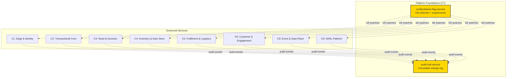
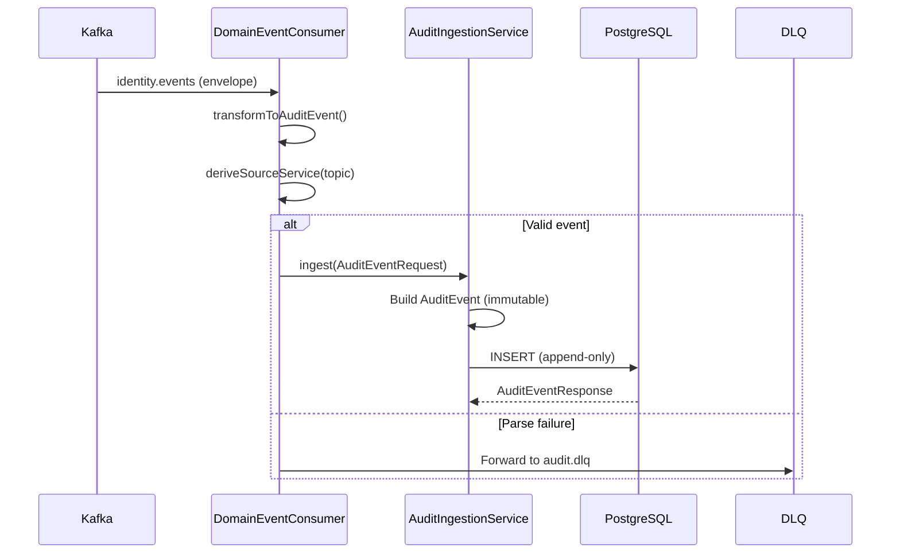
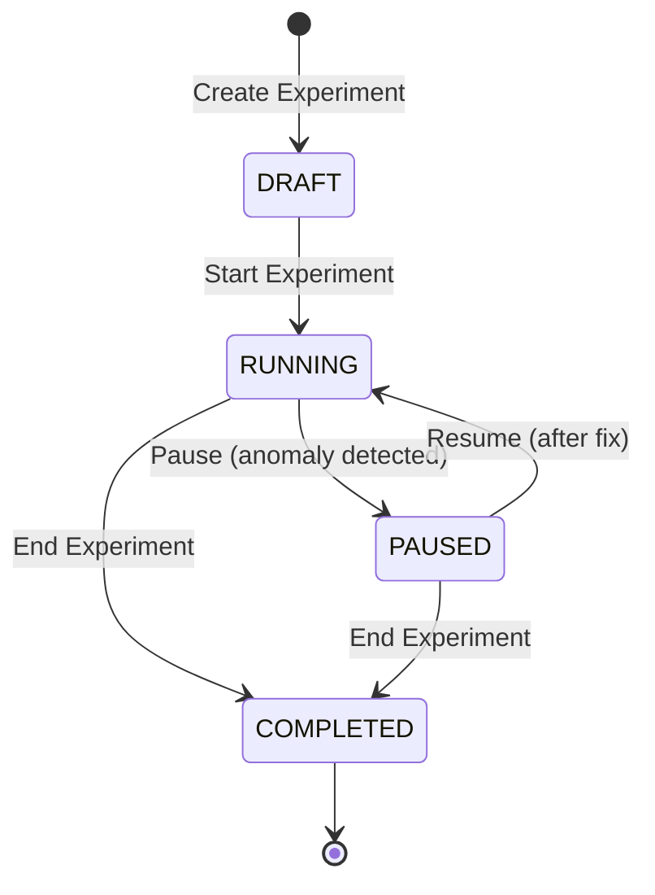
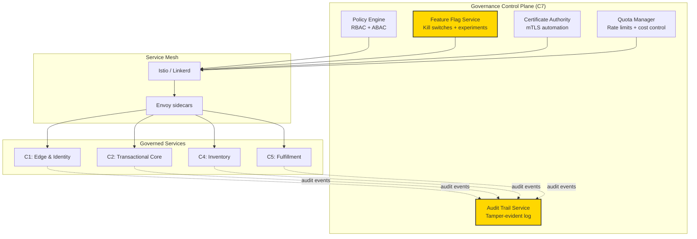

# Platform Foundations — Audit Trail & Config Feature Flag Services

**Cluster:** C7 — Platform Foundations  
**Services:** `audit-trail-service`, `config-feature-flag-service`  
**Iteration:** 3  
**Date:** 2026-03-07  
**Scope:** Immutable audit, change visibility, feature-flag governance, dynamic config safety, experimentation guardrails, service ownership, rollout, validation, rollback, cross-fleet governance  
**Risk rating:** 🟡 MEDIUM — Directionally correct governance substrate with critical operational gaps  
**Builds on:**
- `docs/reviews/PRINCIPAL-ENGINEERING-IMPLEMENTATION-GUIDE-SERVICE-WISE-2026-03-06.md` §10 (C7)
- `docs/reviews/iter3/platform/repo-truth-ownership.md`
- `docs/reviews/iter3/appendices/validation-rollout-playbooks.md` §3
- `services/audit-trail-service/README.md`
- `services/config-feature-flag-service/README.md`
- `docs/reviews/audit-trail-service-review.md`
- `docs/reviews/config-feature-flag-service-review.md`

---

## Table of Contents

1. [Executive Summary](#1-executive-summary)
2. [Why Platform Foundations Matter](#2-why-platform-foundations-matter)
3. [Audit Trail Service — Immutable Change Visibility](#3-audit-trail-service--immutable-change-visibility)
   - [3.1 Current Reality](#31-current-reality)
   - [3.2 Immutable Audit Architecture](#32-immutable-audit-architecture)
   - [3.3 Change Visibility & Compliance](#33-change-visibility--compliance)
   - [3.4 Critical Gaps](#34-critical-gaps)
   - [3.5 Rollout & Validation](#35-rollout--validation)
   - [3.6 Rollback & Incident Response](#36-rollback--incident-response)
4. [Config Feature Flag Service — Dynamic Config & Experimentation](#4-config-feature-flag-service--dynamic-config--experimentation)
   - [4.1 Current Reality](#41-current-reality)
   - [4.2 Feature Flag Governance](#42-feature-flag-governance)
   - [4.3 Dynamic Config Safety](#43-dynamic-config-safety)
   - [4.4 Experimentation Guardrails](#44-experimentation-guardrails)
   - [4.5 Critical Gaps](#45-critical-gaps)
   - [4.6 Kill Switch Architecture](#46-kill-switch-architecture)
   - [4.7 Rollout & Validation](#47-rollout--validation)
   - [4.8 Rollback & Emergency Response](#48-rollback--emergency-response)
5. [Cross-Fleet Governance Responsibilities](#5-cross-fleet-governance-responsibilities)
   - [5.1 Service Ownership Model](#51-service-ownership-model)
   - [5.2 Governance Truth Sources](#52-governance-truth-sources)
   - [5.3 Enforcement Mechanisms](#53-enforcement-mechanisms)
6. [Must-Fix Issues Matrix](#6-must-fix-issues-matrix)
7. [Implementation Roadmap](#7-implementation-roadmap)
8. [Validation Playbook](#8-validation-playbook)
9. [Rollback Runbooks](#9-rollback-runbooks)
10. [Long-Term Governance Architecture](#10-long-term-governance-architecture)

---

## 1. Executive Summary

Platform Foundations (C7) is the **governance substrate** for the entire InstaCommerce fleet. It provides two critical capabilities:

1. **Immutable audit trail** — compliance-grade change visibility via `audit-trail-service`
2. **Dynamic control plane** — runtime feature flags, kill switches, and experimentation via `config-feature-flag-service`

**Current state verdict:** Directionally correct but operationally weak. Both services have solid Spring Boot foundations with JWT security, partitioned storage (audit) / cached evaluation (flags), and observability integration. However, neither service meets production-grade requirements for a money-path Q-commerce platform.

### Critical reality gaps

| Service | What it claims | What it delivers | Production gap |
|---------|---------------|------------------|----------------|
| `audit-trail-service` | Immutable, compliance-grade audit log | Append-only PostgreSQL with no tamper evidence | ❌ No cryptographic chaining; DBA can silently alter records |
| `config-feature-flag-service` | Real-time feature flags with kill-switch capability | Cached flags (30s TTL) with Caffeine | ❌ Emergency kill switches take 30+ seconds to propagate |

### Why this matters

C7 governs all other clusters:
- **C2 (Transactional Core)** needs sub-second kill switches for money-path incidents
- **C4 (Inventory)** and **C5 (Fulfillment)** need tamper-evident audit for stock truth and delivery disputes
- **C6 (Fraud Detection)** needs compliance-grade audit for PCI-DSS Req 10, GDPR Art 30, SOC 2
- **C8 (Event Plane)** needs audit for contract changes and event governance
- **C9 (AI/ML)** needs audit for model changes and flags for shadow rollout + kill switches

**Bottom line:** If C7 cannot provide fast kill switches and trustworthy audit, the rest of the platform's governance claims are hollow.

---

## 2. Why Platform Foundations Matter

### 2.1 Governance as a reliability primitive

Platform foundations are not operational overhead — they are **reliability primitives** that enable safe, reversible change:

```
Without C7:
  Change → Deploy → Hope → [Incident] → Manual rollback → Lost trust

With C7:
  Change → Flag-wrapped deploy → Gradual rollout → [Signal detected] → Kill switch (< 5s) → Audit investigation → Safe promotion
```

### 2.2 Q-commerce compliance surface

InstaCommerce operates in a highly regulated environment:

| Compliance requirement | Service | Capability needed |
|----------------------|---------|-------------------|
| **PCI-DSS Requirement 10** | audit-trail-service | Track all payment actions, retain logs 90 days online / 1 year archived, tamper-evident |
| **GDPR Article 30** | audit-trail-service | Maintain records of processing activities, support DSAR (data subject access requests) |
| **SOC 2 (CC6.8)** | audit-trail-service | Audit trail for access to systems and data, cryptographic integrity |
| **Incident response SLA** | config-feature-flag-service | Kill switch propagation < 5 seconds (not 30+ seconds) |
| **Experimentation ethics** | config-feature-flag-service | Switchback windows, exposure logging, variant governance |

**Current compliance state:**  
🔴 PCI-DSS Req 10: **FAIL** (no tamper evidence, incomplete topic coverage)  
🟡 GDPR Art 30: **PARTIAL** (has records, no DSAR endpoint)  
🟡 SOC 2 CC6.8: **PARTIAL** (audit exists but not integrity-verified)  
🔴 Kill switch SLA: **FAIL** (30s propagation vs. 5s requirement)

### 2.3 Blast radius control

Every service in the fleet trusts C7 for safe evolution:



**Key dependency:** If C7 cannot stop a bad change in < 5 seconds or prove what happened during an incident, the entire fleet's change velocity becomes risk-constrained.

---

## 3. Audit Trail Service — Immutable Change Visibility

### 3.1 Current Reality

**Port:** 8094  
**Tech:** Spring Boot 3, Java 21, PostgreSQL (partitioned), Kafka, Flyway, ShedLock  
**Architecture:** Kafka multi-topic consumer + REST ingestion API → append-only partitioned PostgreSQL → paginated search + CSV export

#### What exists today

✅ **Strengths:**
- Append-only enforcement at DDL layer: `REVOKE UPDATE, DELETE ON audit_events`
- JPA entity-level immutability: all fields `updatable = false`
- Monthly range partitioning with automated future partition creation (3 months ahead)
- Multi-topic Kafka consumer ingesting from 14 domain topics
- DLQ routing for poison messages (`audit.dlq`)
- JWT-based RBAC: `ROLE_SYSTEM/SERVICE` for ingestion, `ROLE_ADMIN` for query/export
- ShedLock-protected partition maintenance job (1st of month, 02:00)
- OpenTelemetry tracing + Prometheus metrics
- Paginated search via JPA Specifications (max 100 results/page)
- Streaming CSV export in 500-row batches

#### What is missing

❌ **Critical gaps:**
- **No cryptographic tamper evidence** — a DBA with superuser access can silently `UPDATE` or `DELETE` audit records via SQL bypass
- **No async export** — synchronous CSV streaming will OOM or timeout on large date ranges (billions of rows)
- **No GDPR DSAR endpoint** — no way to export all records for a specific data subject (required for GDPR compliance)
- **No archival to cold storage** — detached partitions are abandoned, not moved to S3/GCS (storage leak)
- **No anomaly alerting** — no detection of suspicious audit patterns (e.g., bulk deletes, privilege escalation)
- **Incomplete topic coverage** — `notification.events`, `search.events`, `pricing.events`, `promotion.events` topics not consumed
- **Retention is detach-only** — old partitions are detached but never dropped or archived (storage grows unbounded)
- **Export has no size guard** — CSV export passes `Integer.MAX_VALUE` as page size (can crash on large queries)

### 3.2 Immutable Audit Architecture

#### Append-only storage model

```sql
-- V1__create_audit_events.sql
CREATE TABLE audit_events (
    id              UUID DEFAULT gen_random_uuid() PRIMARY KEY,
    event_type      VARCHAR(100)   NOT NULL,
    source_service  VARCHAR(50)    NOT NULL,
    actor_id        UUID,
    actor_type      VARCHAR(20),   -- USER | SYSTEM | ADMIN
    resource_type   VARCHAR(100),
    resource_id     VARCHAR(255),
    action          VARCHAR(100)   NOT NULL,
    details         JSONB,
    ip_address      VARCHAR(45),
    user_agent      VARCHAR(512),
    correlation_id  VARCHAR(64),
    created_at      TIMESTAMPTZ    NOT NULL
) PARTITION BY RANGE (created_at);

-- Immutability enforcement
REVOKE UPDATE, DELETE ON audit_events FROM PUBLIC;
CREATE INDEX idx_audit_actor ON audit_events (actor_id, created_at DESC);
CREATE INDEX idx_audit_resource ON audit_events (resource_type, resource_id, created_at DESC);
CREATE INDEX idx_audit_correlation ON audit_events (correlation_id);
```

#### JPA entity-level immutability

```java
@Entity
@Table(name = "audit_events")
public class AuditEvent {
    @Id
    @GeneratedValue(strategy = GenerationType.UUID)
    @Column(updatable = false)  // ✅ Cannot be modified after insert
    private UUID id;

    @Column(name = "event_type", nullable = false, length = 100, updatable = false)
    private String eventType;

    @Column(name = "created_at", nullable = false, updatable = false)
    private Instant createdAt;

    // All fields: updatable = false
}
```

#### Partition management

```
Monthly partitions:
  audit_events_2025_06  (current month)
  audit_events_2025_07  (future)
  audit_events_2025_08  (future)
  audit_events_2025_09  (future)
  audit_events_2024_06  (detached — older than 365 days)

PartitionMaintenanceJob (1st of month, 02:00, ShedLock):
  1. Create 3 future partitions (configurable via audit.partition.future-months)
  2. Detach partitions older than 365 days (configurable via audit.partition.retention-days)
  3. Does NOT drop or archive detached partitions (ops team responsibility)
```

**Storage risk:** Detached partitions remain in PostgreSQL consuming disk space. Production deployment must add automated S3/GCS archival or explicit DROP logic.

#### Ingestion flow



**Topics consumed (14):**
- `identity.events`, `catalog.events`, `order.events`, `payment.events`, `inventory.events`, `fulfillment.events`, `rider.events`, `notification.events`, `search.events`, `pricing.events`, `promotion.events`, `customer-support.events`, `returns.events`, `warehouse.events`

**Missing topics:** Cross-check with `contracts/` — if additional topics exist, update `DomainEventConsumer.java`.

### 3.3 Change Visibility & Compliance

#### PCI-DSS Requirement 10

**Requirement:** Track and monitor all access to network resources and cardholder data. Maintain audit trail for 90 days online, 1 year archived.

**Current state:**
- ✅ Audit records contain: `actorId`, `action`, `resourceType`, `resourceId`, `timestamp`, `ipAddress`, `userAgent`
- ✅ Retention policy: 365 days (configurable)
- ❌ **FAIL:** No tamper-evident cryptographic chaining
- ❌ **FAIL:** No automated archival to cold storage (S3/GCS) after 90 days
- ⚠️ Detached partitions remain in PostgreSQL (not S3-archived)

**Required fix:**
1. Implement hash-chaining: `event.hash = SHA256(event.data + previousEvent.hash)`
2. Add automated S3/GCS archival job for partitions older than 90 days
3. Provide CLI verifier: `audit-verifier --from 2025-01-01 --to 2025-01-31` (checks hash chain integrity)

#### GDPR Article 30

**Requirement:** Maintain records of processing activities. Support data subject access requests (DSAR).

**Current state:**
- ✅ Records exist with `actorId`, `resourceType`, `resourceId`, `details`
- ❌ **FAIL:** No DSAR endpoint (no way to query "all audit records for user X")
- ❌ **FAIL:** No anonymization support (GDPR right to erasure conflicts with immutability)

**Required fix:**
1. Add DSAR endpoint: `GET /admin/audit/dsar?userId=<uuid>` (returns all records for that user)
2. Add pseudonymization support: replace `actorId` with pseudonymous ID after retention period (hash-based)
3. Document retention vs. erasure conflict in compliance docs

#### SOC 2 (CC6.8)

**Requirement:** Audit trail for access to systems and data, with cryptographic integrity assurance.

**Current state:**
- ✅ Audit trail exists
- ❌ **FAIL:** No cryptographic integrity (hash chaining or digital signatures)
- ⚠️ No alerting for anomalous audit patterns

**Required fix:**
1. Implement hash-chaining (same as PCI-DSS fix)
2. Add anomaly detection: alert on bulk deletes, privilege escalations, unusual access patterns
3. Add Prometheus alerts: `audit_ingestion_rate_drop`, `audit_partition_maintenance_failed`

### 3.4 Critical Gaps

| Gap | Severity | Impact | Fix complexity |
|-----|----------|--------|---------------|
| No cryptographic tamper evidence | 🔴 P0 | Compliance failure, incident reconstruction unreliable | **HIGH** — requires hash-chaining migration, verifier CLI, backward-compat |
| No async export | 🔴 P0 | Production OOM risk on large queries | **MEDIUM** — add async job queue (Spring Batch or Temporal workflow) |
| No GDPR DSAR endpoint | 🔴 P0 | GDPR compliance violation | **LOW** — new controller method with `actorId` filter |
| No archival to S3/GCS | 🟠 P1 | Storage cost leak, compliance violation (90-day rule) | **MEDIUM** — add ShedLock job to archive detached partitions |
| No anomaly alerting | 🟠 P1 | Security incident detection delay | **MEDIUM** — add anomaly detection job (e.g., Prometheus alerts + ElasticSearch APM) |
| Incomplete topic coverage | 🟡 P2 | Audit blind spots | **LOW** — add missing topics to `DomainEventConsumer` |
| Detached partitions never dropped | 🟡 P2 | Disk space growth | **LOW** — add explicit DROP logic after archival |

### 3.5 Rollout & Validation

#### Pre-rollout checklist

- [ ] Backfill missing Kafka topics (`notification.events`, `search.events`, `pricing.events`, `promotion.events`)
- [ ] Add DSAR endpoint (`GET /admin/audit/dsar?userId=<uuid>`)
- [ ] Add async CSV export (Spring Batch or Temporal workflow)
- [ ] Add S3/GCS archival job for partitions older than 90 days
- [ ] Add hash-chaining to new records (no backfill initially — document "pre-chain" vs "chained" cutover date)
- [ ] Add audit verifier CLI tool
- [ ] Add Prometheus alerts: `audit_ingestion_rate_drop`, `audit_partition_maintenance_failed`, `audit_export_timeout`
- [ ] Test partition maintenance job on staging with 100+ partitions
- [ ] Load test: 10,000 events/sec ingestion + concurrent CSV export
- [ ] Security review: confirm JWT validation, RBAC enforcement, DLQ isolation

#### Validation playbook

```bash
# 1. Ingest 1,000 test events via REST API
for i in {1..1000}; do
  curl -X POST http://audit-trail-service.dev:8094/audit/events \
    -H "Authorization: Bearer $SERVICE_TOKEN" \
    -H "Content-Type: application/json" \
    -d '{
      "eventType": "TEST_EVENT",
      "sourceService": "test-harness",
      "action": "CREATE",
      "actorId": "00000000-0000-0000-0000-000000000001",
      "actorType": "SYSTEM"
    }'
done

# 2. Verify ingestion via search
curl "http://audit-trail-service.dev:8094/admin/audit/events?sourceService=test-harness&size=100" \
  -H "Authorization: Bearer $ADMIN_TOKEN" | jq '.content | length'
# Expected: 100 (paginated)

# 3. Test CSV export (small range)
curl "http://audit-trail-service.dev:8094/admin/audit/export?sourceService=test-harness&fromDate=2025-01-01" \
  -H "Authorization: Bearer $ADMIN_TOKEN" > test_export.csv
wc -l test_export.csv
# Expected: 1001 lines (header + 1000 events)

# 4. Test partition creation (force job run)
kubectl exec -it deployment/audit-trail-service -n instacommerce -- \
  psql $AUDIT_DB_URL -c "SELECT create_audit_partition('2026_12');"
# Expected: partition created

# 5. Verify hash chain (after hash-chaining implementation)
./audit-verifier --from 2025-01-01 --to 2025-01-31 --env dev
# Expected: Hash chain valid: 1,234,567 events verified
```

#### SLO targets

| Metric | Target | Measurement |
|--------|--------|-------------|
| Ingestion latency (p99) | < 100ms | Kafka consumer lag + DB write time |
| Search latency (p99) | < 500ms | JPA Specification query time |
| CSV export latency (10K rows) | < 30s | Streaming export time |
| Partition maintenance completion | < 5 minutes | ShedLock job duration |
| Audit record retention | 365 days online, indefinite in S3 | Partition count + S3 object age |
| Kafka consumer lag | < 10 seconds | Consumer group lag metric |

### 3.6 Rollback & Incident Response

#### Rollback scenarios

| Scenario | Trigger | Rollback action | Recovery time |
|----------|---------|----------------|---------------|
| Ingestion failure (DB connection lost) | Consumer lag > 60s, error rate > 10% | Restart pods, check DB connection pool | < 2 minutes |
| Partition maintenance failed | Job duration > 10 minutes or error | Manual partition creation via SQL script | < 5 minutes |
| CSV export timeout | Export duration > 5 minutes | Kill export request, reduce date range | Immediate |
| DLQ overflow | DLQ depth > 1,000 messages | Investigate poison message schema, reprocess or skip | < 30 minutes |
| Disk space exhaustion | Partition disk usage > 85% | Archive old partitions to S3, drop archived partitions | < 1 hour |

#### Emergency procedures

```bash
# Emergency stop ingestion (scale down consumers)
kubectl scale deployment/audit-trail-service --replicas=0 -n instacommerce

# Force partition creation (if maintenance job fails)
kubectl exec -it deployment/audit-trail-service -n instacommerce -- \
  psql $AUDIT_DB_URL -c "CALL ensure_future_audit_partitions(3);"

# Manual partition detach (if disk is full)
kubectl exec -it deployment/audit-trail-service -n instacommerce -- \
  psql $AUDIT_DB_URL -c "
    ALTER TABLE audit_events DETACH PARTITION audit_events_2024_01;
  "

# Export partition to S3 before drop
pg_dump -h $DB_HOST -U $DB_USER -d audit_db \
  -t audit_events_2024_01 --data-only \
  | gzip | aws s3 cp - s3://instacommerce-audit-archive/audit_events_2024_01.sql.gz
```

---

## 4. Config Feature Flag Service — Dynamic Config & Experimentation

### 4.1 Current Reality

**Port:** 8096  
**Tech:** Spring Boot 3, Java 21, PostgreSQL, Caffeine (cache), Guava Murmur3, Flyway, ShedLock  
**Architecture:** REST API (flag evaluation + admin CRUD) → cached flag lookup (30s TTL) → PostgreSQL → audit logging

#### What exists today

✅ **Strengths:**
- Four flag types: `BOOLEAN`, `PERCENTAGE`, `USER_LIST`, `JSON`
- Murmur3 consistent hashing for deterministic percentage rollouts
- Per-user overrides with optional TTL expiration
- Caffeine cache: 5,000 entries, 30s TTL, scheduled refresh job (30s interval, ShedLock-protected)
- Bulk evaluation: multiple flags in single request
- Experiment support: weighted variants, switchback windows, exposure logging
- Full audit trail: every flag mutation logged with `action`, `oldValue`, `newValue`, acting user
- JWT-based RBAC: `ROLE_ADMIN` for mutations, authenticated for evaluations
- OpenTelemetry tracing + Prometheus metrics

#### What is missing

❌ **Critical gaps:**
- **No sub-second kill switch** — 30s cache TTL means emergency flag flips take 30+ seconds to propagate
- **No environment support** — dev/staging/prod share same flag namespace (collision risk)
- **No user segments** — cannot target "beta users" or "power users" without listing individual IDs
- **N+1 in bulk evaluation** — `BulkEvaluationService` calls `FlagEvaluationService.evaluate()` in a loop
- **Override cache miss on hot path** — `FlagOverrideService.getActiveOverride()` hits DB on every flag evaluation
- **No expired override cleanup** — `expiresAt` field exists but no job removes expired overrides (table grows unbounded)
- **Math bug in percentage rollout** — `Math.abs(Integer.MIN_VALUE)` returns negative value (hash collision risk)
- **Cache eviction doesn't evict overrides** — `@CacheEvict("flags")` doesn't clear `flag-overrides` cache
- **No kill switch latency monitoring** — no metrics for "time from flag flip to pod applying change"

### 4.2 Feature Flag Governance

#### Flag lifecycle

```
1. DRAFT → Create flag (enabled=false, rollout%=0)
2. CANARY → Enable flag, ramp rollout% (1% → 5% → 10% → 25% → 50% → 100%)
3. SOAK → Keep at 100% for ≥ 72 hours, monitor SLOs
4. CLEANUP → Remove code gate, delete flag OR
5. ROLLBACK → Flip enabled=false or rollout%=0
```

**Current problem:** No lifecycle state tracking. Flags can remain at 100% indefinitely (technical debt). No automated reminder or cleanup workflow.

**Required fix:**
1. Add `FlagLifecycle` enum: `DRAFT`, `CANARY`, `ACTIVE`, `CLEANUP_PENDING`, `ARCHIVED`
2. Add scheduled job: flag at 100% for > 14 days → notify team via Slack/email
3. Add admin endpoint: `POST /admin/flags/{key}/archive` (soft-delete flag, keep audit history)

#### Naming convention

```
{domain}.{service}.{feature}[.{env}]

Examples:
  checkout.checkout-orchestrator.new-saga-flow
  pricing.pricing-service.surge-v2
  ml.fraud-detection.model-v3-inference
  ai.ai-orchestrator.agent-dispatch-v2
```

**Enforcement:** Add validation in `CreateFlagRequest` to enforce naming pattern (regex).

#### Ownership

Every flag should have a declared owner (team or individual) responsible for its lifecycle.

**Required addition:**
```java
@Entity
public class FeatureFlag {
    // ...
    @Column(name = "owner_team")
    private String ownerTeam;  // e.g., "order-team", "payments-team"
    
    @Column(name = "owner_email")
    private String ownerEmail;  // Slack handle or email
}
```

### 4.3 Dynamic Config Safety

#### Kill switch vs. config

| Type | Purpose | Evaluation latency | State persistence |
|------|---------|-------------------|------------------|
| **Kill switch** | Emergency stop for bad behavior | < 5 seconds | In-memory + DB |
| **Config** | Runtime parameter tuning | 30 seconds OK | DB + cache |

**Current problem:** Both use the same 30s cached evaluation path. Kill switches are too slow.

**Required fix:**
1. Separate `kill_switches` table with `priority: CRITICAL` flag
2. Add push-based kill switch channel: WebSocket or Server-Sent Events (SSE) from flag service to all consumers
3. Consumer SDKs subscribe to kill switch updates, bypass cache for critical flags

#### Percentage rollout consistency

Murmur3 hashing ensures same user always gets same bucket:

```java
String hashInput = userId + ":" + flagKey;
int hash = Hashing.murmur3_32_fixed().hashString(hashInput, StandardCharsets.UTF_8).asInt();
int bucket = (hash & 0x7FFFFFFF) % 100;  // ❌ BUG: Math.abs(MIN_VALUE) is negative
boolean enabled = bucket < rolloutPercentage;
```

**Bug:** `Integer.MIN_VALUE` when passed to `Math.abs()` returns negative (overflow). Fix:

```java
int bucket = Math.abs(hash) % 100;  // ❌ WRONG
int bucket = (hash & 0x7FFFFFFF) % 100;  // ✅ CORRECT (bit mask)
```

**Validation:** Test with known edge-case user IDs that produce `Integer.MIN_VALUE` hash.

#### Rollout guardrails

Add safety checks before allowing percentage increase:

```java
@Service
public class RolloutGuardrailService {
    public void validateRollout(String flagKey, int newPercentage) {
        // Rule 1: Cannot jump from 0% to 100% (must pass through 1%, 5%, 10%, ...)
        int currentPercentage = flagRepo.findByKey(flagKey).getRolloutPercentage();
        if (currentPercentage == 0 && newPercentage > 10) {
            throw new RolloutViolation("Cannot jump from 0% to " + newPercentage + "%. Max first step: 10%");
        }
        
        // Rule 2: Must soak at each tier for ≥ 10 minutes
        Instant lastUpdated = flagRepo.findByKey(flagKey).getUpdatedAt();
        if (Duration.between(lastUpdated, Instant.now()).toMinutes() < 10) {
            throw new RolloutViolation("Must soak for 10 minutes before next rollout step");
        }
    }
}
```

### 4.4 Experimentation Guardrails

#### Experiment lifecycle



**Current state:**
- ✅ Experiment variants with weighted assignment
- ✅ Switchback support (time-based variant rotation)
- ✅ Exposure logging (who saw what variant, when)
- ❌ No automatic pause on anomaly (e.g., variant A crash rate 10x higher)
- ❌ No statistical significance calculation
- ❌ No winner promotion workflow

#### Switchback experiments

When `switchbackEnabled = true`, variant assignment rotates on time interval:

```java
int minutesElapsed = (int) Duration.between(experiment.getStartedAt(), Instant.now()).toMinutes();
int switchbackWindow = minutesElapsed / experiment.getSwitchbackIntervalMinutes();
String hashInput = assignmentKey + ":" + experimentKey + ":" + switchbackWindow;
// Hash and assign variant (changes every switchbackIntervalMinutes)
```

**Use case:** Delivery time experiments where same user should see both "fast checkout" and "normal checkout" in different time windows (reduces user-level confounding).

**Guardrail needed:** Prevent switchback interval < 10 minutes (too rapid changes confuse users).

#### Exposure logging

Every experiment evaluation logs an exposure:

```sql
CREATE TABLE experiment_exposures (
    id              UUID PRIMARY KEY,
    experiment_id   UUID NOT NULL REFERENCES experiments(id),
    variant_id      UUID NOT NULL REFERENCES experiment_variants(id),
    user_id         UUID,
    assignment_key  VARCHAR(255) NOT NULL,
    switchback_window INT,
    exposed_at      TIMESTAMPTZ NOT NULL,
    context         JSONB
);
```

**Use:** Join exposures with downstream conversion events (orders, checkouts, payments) to calculate variant impact.

**Missing:** No retention policy. Exposure table grows unbounded. Add partition pruning (same as audit-trail-service).

### 4.5 Critical Gaps

| Gap | Severity | Impact | Fix complexity |
|-----|----------|--------|---------------|
| Kill switch latency (30s) | 🔴 P0 | Incident response too slow for money-path | **HIGH** — requires push-based notification (WebSocket/SSE) |
| No environment support | 🔴 P0 | Dev/staging/prod flag collisions | **MEDIUM** — add `environment` field + flag key uniqueness |
| Math.abs(MIN_VALUE) bug | 🔴 P0 | Hash collision, incorrect bucketing | **LOW** — fix bit mask logic |
| N+1 in bulk evaluation | 🟠 P1 | Latency spike on bulk requests | **MEDIUM** — batch DB query |
| Override cache miss | 🟠 P1 | DB hit on every flag eval | **MEDIUM** — fix cache key structure |
| No expired override cleanup | 🟡 P2 | Table growth, stale overrides | **LOW** — add scheduled cleanup job |
| No flag lifecycle tracking | 🟡 P2 | Technical debt (flags at 100% indefinitely) | **MEDIUM** — add lifecycle enum + notification job |

### 4.6 Kill Switch Architecture

#### Current (too slow)

```
Admin flips flag → DB write → Cache expires (30s) → Service reads new value
                                   ⬆ PROBLEM: 30s delay
```

#### Target (sub-second)

```
Admin flips flag → DB write + WebSocket broadcast → All services receive push → Flag updated (< 1s)
```

**Implementation:**

```java
@Service
public class FlagPushService {
    private final SimpMessagingTemplate messagingTemplate;
    
    @EventListener
    public void onFlagChanged(FlagChangedEvent event) {
        // Push to all connected clients via WebSocket
        messagingTemplate.convertAndSend("/topic/flags/" + event.getFlagKey(), 
            new FlagUpdateNotification(event.getFlagKey(), event.getNewValue()));
    }
}

// Consumer SDK
@Component
public class FlagWebSocketClient {
    @MessageMapping("/topic/flags/{key}")
    public void onFlagUpdate(FlagUpdateNotification notification) {
        // Update local cache immediately (bypass 30s TTL)
        localCache.put(notification.getKey(), notification.getValue());
    }
}
```

**Fallback:** If WebSocket connection lost, fall back to polling every 5 seconds for critical flags.

### 4.7 Rollout & Validation

#### Pre-rollout checklist

- [ ] Fix `Math.abs(Integer.MIN_VALUE)` bug in percentage bucketing
- [ ] Add kill switch WebSocket/SSE push channel
- [ ] Add environment support (`dev`, `staging`, `prod` flag namespaces)
- [ ] Fix N+1 in bulk evaluation (batch DB query)
- [ ] Fix override cache miss (add `@Cacheable("flag-overrides")`)
- [ ] Add expired override cleanup job (ShedLock, daily at 03:00)
- [ ] Add flag lifecycle tracking (`FlagLifecycle` enum)
- [ ] Add rollout guardrails (no 0% → 100% jumps, enforce soak time)
- [ ] Add experiment anomaly detection (pause if variant crash rate 3x higher)
- [ ] Add Prometheus alerts: `flag_evaluation_latency_p99 > 50ms`, `flag_cache_miss_rate > 20%`

#### Validation playbook

```bash
# 1. Create test flag
curl -X POST http://config-feature-flag-service.dev:8096/admin/flags \
  -H "Authorization: Bearer $ADMIN_TOKEN" \
  -H "Content-Type: application/json" \
  -d '{
    "key": "test.validation.canary",
    "flagType": "PERCENTAGE",
    "enabled": true,
    "rolloutPercentage": 0,
    "description": "Test flag for validation"
  }'

# 2. Evaluate flag for 1,000 users (should all be disabled at 0%)
for i in {1..1000}; do
  curl "http://config-feature-flag-service.dev:8096/flags/test.validation.canary?userId=user-$i" \
    -H "Authorization: Bearer $SERVICE_TOKEN"
done | jq -r '.value' | sort | uniq -c
# Expected: 1000 "false"

# 3. Ramp to 50%
curl -X POST http://config-feature-flag-service.dev:8096/admin/flags/test.validation.canary/rollout \
  -H "Authorization: Bearer $ADMIN_TOKEN" \
  -H "Content-Type: application/json" \
  -d '{"rolloutPercentage": 50}'

# 4. Wait 30s for cache expiration (or test WebSocket push)
sleep 30

# 5. Evaluate again (should be ~50% enabled)
for i in {1..1000}; do
  curl "http://config-feature-flag-service.dev:8096/flags/test.validation.canary?userId=user-$i" \
    -H "Authorization: Bearer $SERVICE_TOKEN"
done | jq -r '.value' | sort | uniq -c
# Expected: ~500 "false", ~500 "true"

# 6. Test bulk evaluation
curl -X POST http://config-feature-flag-service.dev:8096/flags/bulk \
  -H "Authorization: Bearer $SERVICE_TOKEN" \
  -H "Content-Type: application/json" \
  -d '{
    "keys": ["test.validation.canary", "test.validation.other"],
    "userId": "user-123"
  }' | jq

# 7. Test kill switch latency (with WebSocket push)
time (
  curl -X POST http://config-feature-flag-service.dev:8096/admin/flags/test.validation.canary/disable \
    -H "Authorization: Bearer $ADMIN_TOKEN" &&
  sleep 1 &&  # Wait for push propagation
  curl "http://config-feature-flag-service.dev:8096/flags/test.validation.canary?userId=user-123" \
    -H "Authorization: Bearer $SERVICE_TOKEN" | jq -r '.value'
)
# Expected: "false" within < 2 seconds
```

#### SLO targets

| Metric | Target | Measurement |
|--------|--------|-------------|
| Flag evaluation latency (p99) | < 10ms | Cached lookup time |
| Kill switch propagation (p99) | < 5 seconds | Time from admin flip to service applying change |
| Cache hit ratio | > 95% | `cache_hits / (cache_hits + cache_misses)` |
| Bulk evaluation latency (10 flags, p99) | < 50ms | N+1 fix verification |
| Flag admin mutation latency (p99) | < 200ms | DB write + cache evict + audit log |

### 4.8 Rollback & Emergency Response

#### Rollback scenarios

| Scenario | Trigger | Rollback action | Recovery time |
|----------|---------|----------------|---------------|
| Bad flag causes crash loop | Pod crash rate > 10% after flag flip | Flip flag back to safe state via admin API | < 30 seconds (with WebSocket push) |
| Flag service down | Flag service health check fails | Services fall back to cached flags or fail-open | Immediate (cached) |
| Database connection lost | DB connection pool exhausted | Restart pods, scale up DB connection limit | < 2 minutes |
| Cache poisoning (bad flag value) | Anomaly detection alert | Evict cache, restart pods | < 5 minutes |

#### Emergency procedures

```bash
# Emergency kill switch (flip flag off immediately)
curl -X POST http://config-feature-flag-service.prod:8096/admin/flags/{key}/disable \
  -H "Authorization: Bearer $ADMIN_TOKEN"
# If WebSocket push enabled: < 5 seconds propagation
# If cache-only: wait 30 seconds or restart consuming pods

# Force cache eviction (restart all pods to clear Caffeine cache)
kubectl rollout restart deployment/order-service -n instacommerce
kubectl rollout restart deployment/pricing-service -n instacommerce

# Disable all percentage flags (emergency "safe mode")
psql $FEATURE_FLAG_DB_URL -c "
  UPDATE feature_flags SET enabled = false WHERE flag_type = 'PERCENTAGE';
"
kubectl rollout restart deployment/config-feature-flag-service -n instacommerce

# Rollback flag to previous state (via audit log)
curl "http://config-feature-flag-service.prod:8096/admin/flags/{key}/audit" \
  -H "Authorization: Bearer $ADMIN_TOKEN" | jq '.[1]'  # Previous state
# Manually apply oldValue via admin API
```

---

## 5. Cross-Fleet Governance Responsibilities

### 5.1 Service Ownership Model

C7 services govern ownership truth across the entire fleet. This is the authoritative source of truth for "who owns what."

#### CODEOWNERS enforcement

From `docs/reviews/iter3/platform/repo-truth-ownership.md` §4:

```
# .github/CODEOWNERS (must exist and be enforced)
/services/audit-trail-service/      @instacommerce/platform-team
/services/config-feature-flag-service/ @instacommerce/platform-team
/contracts/                         @instacommerce/platform-team @instacommerce/principal-engineers
/deploy/                            @instacommerce/platform-team @instacommerce/sre-team
/.github/                           @instacommerce/platform-team
```

**Current state:** `.github/CODEOWNERS` does **not exist**. This is a Wave 0 blocker.

**Required action:**
1. Create `.github/CODEOWNERS` with all service and path ownership declarations
2. Enable GitHub branch protection: "Require review from Code Owners"
3. Add CI check: fail PR if CODEOWNERS file is modified without principal engineer approval

#### ADR (Architecture Decision Record) discipline

C7 enforces ADR creation for governance-impacting changes.

**Required ADRs for C7:**
- **ADR-009:** Feature flag kill switch latency requirements (< 5s target)
- **ADR-010:** Audit trail tamper-evidence and compliance requirements (hash-chaining, S3 archival)

**ADR template:**

```markdown
# ADR-XXX: [Title]

**Status:** Proposed | Accepted | Deprecated | Superseded  
**Date:** YYYY-MM-DD  
**Deciders:** [Names]  
**Consulted:** [Teams]  

## Context

[Why we need to decide this]

## Decision

[What we decided]

## Consequences

[Positive and negative impacts]

## Alternatives Considered

[Other options we evaluated]
```

### 5.2 Governance Truth Sources

From `docs/reviews/iter3/platform/repo-truth-ownership.md` §2:

| Surface | Canonical source | C7 responsibility |
|---------|-----------------|-------------------|
| Service module identity | `settings.gradle.kts` (Java), `go.mod` (Go) | Flag service tracks service inventory for targeted rollouts |
| CI validation scope | `.github/workflows/ci.yml` | Flag service controls CI gates via feature flags |
| Event envelope contract | `contracts/README.md` | Audit service logs contract changes |
| Architecture doc index | `docs/README.md` | Flag service controls doc maturity gates |

**C7's role:** Enforce that these sources remain authoritative via:
1. Audit logging of all changes to canonical sources
2. Feature flags to gate risky changes (e.g., contract breaking changes)
3. CODEOWNERS + branch protection to prevent unauthorized changes

### 5.3 Enforcement Mechanisms

#### CI gates controlled by flags

```yaml
# .github/workflows/ci.yml
- name: Security scan gate
  run: |
    FLAG=$(curl -s "http://config-feature-flag-service:8096/flags/ci.security.trivy-fail-on-high" \
      -H "Authorization: Bearer $CI_TOKEN" | jq -r '.value')
    if [ "$FLAG" = "true" ]; then
      trivy fs --exit-code 1 --severity CRITICAL,HIGH .
    else
      trivy fs --exit-code 0 --severity CRITICAL,HIGH .
    fi
```

**Current gaps:**
- CI does not call flag service (no flag-gated gates)
- No "emergency disable CI gate" capability

**Required fix:**
1. Add flag service calls to CI workflow for critical gates
2. Add kill switch for emergency CI gate bypass (with audit logging)

#### Audit logging of governance events

```java
// Every flag mutation, contract change, CODEOWNERS change logged
@Service
public class GovernanceAuditService {
    private final AuditIngestionClient auditClient;
    
    public void logContractChange(String contractFile, String oldVersion, String newVersion, String actorId) {
        auditClient.ingest(AuditEventRequest.builder()
            .eventType("CONTRACT_CHANGED")
            .sourceService("contracts")
            .actorId(actorId)
            .resourceType("ContractFile")
            .resourceId(contractFile)
            .action("UPDATE")
            .details(Map.of(
                "oldVersion", oldVersion,
                "newVersion", newVersion
            ))
            .build());
    }
}
```

**Current gap:** No automated audit logging of contract changes. Add GitHub Actions workflow to send audit event on `contracts/**` changes.

#### Rollout playbooks

From `docs/reviews/iter3/appendices/validation-rollout-playbooks.md`:

Every production change must:
1. Be wrapped in a feature flag
2. Use canary rollout: 1% → 5% → 10% → 25% → 50% → 100%
3. Soak at each tier for ≥ 10 minutes
4. Have explicit rollback triggers: error rate > 5%, latency p99 > 2x baseline, crash rate > 1%

**C7 responsibility:** Feature flag service provides the primitives; services + SRE team enforce the discipline.

---

## 6. Must-Fix Issues Matrix

| ID | Issue | Service | Severity | Impact | Fix complexity | Wave |
|----|-------|---------|----------|--------|---------------|------|
| **C7-F1** | Feature flags do not provide real low-latency kill switch | config-feature-flag-service | 🔴 P0 | Incident response 30s too slow | **HIGH** | Wave 0 |
| **C7-F2** | Audit log lacks cryptographic tamper evidence | audit-trail-service | 🔴 P0 | Compliance failure (PCI-DSS, SOC 2) | **HIGH** | Wave 0 |
| **C7-F3** | No CODEOWNERS and weak review enforcement | Cross-cutting | 🔴 P0 | Ownership drift continues | **LOW** | Wave 0 |
| **C7-F4** | No GDPR DSAR endpoint | audit-trail-service | 🔴 P0 | GDPR compliance violation | **LOW** | Wave 0 |
| **C7-F5** | No async export (OOM risk) | audit-trail-service | 🟠 P1 | Production stability risk | **MEDIUM** | Wave 1 |
| **C7-F6** | No S3/GCS archival (storage leak) | audit-trail-service | 🟠 P1 | Cost leak, compliance violation | **MEDIUM** | Wave 1 |
| **C7-F7** | Math.abs(MIN_VALUE) bug in percentage rollout | config-feature-flag-service | 🟠 P1 | Incorrect bucketing | **LOW** | Wave 0 |
| **C7-F8** | No environment support (flag collision risk) | config-feature-flag-service | 🟠 P1 | Dev/staging/prod confusion | **MEDIUM** | Wave 1 |
| **C7-F9** | N+1 in bulk evaluation | config-feature-flag-service | 🟡 P2 | Latency spike on bulk requests | **MEDIUM** | Wave 2 |
| **C7-F10** | No flag lifecycle tracking (tech debt) | config-feature-flag-service | 🟡 P2 | Flags remain at 100% indefinitely | **MEDIUM** | Wave 3 |

---

## 7. Implementation Roadmap

### Wave 0: Governance foundations (2 weeks)

**Goal:** Make C7 trustworthy enough to govern other services.

- [ ] **C7-F3:** Create `.github/CODEOWNERS`, enable branch protection
- [ ] **C7-F7:** Fix `Math.abs(Integer.MIN_VALUE)` bug
- [ ] **C7-F4:** Add GDPR DSAR endpoint (`GET /admin/audit/dsar?userId=<uuid>`)
- [ ] **C7-F1 (partial):** Add flag evaluation latency metrics, document kill switch SLA gap

**Validation:**
- CODEOWNERS enforced on 10 test PRs
- DSAR endpoint returns correct audit records for test users
- Percentage bucketing validated with edge-case user IDs

### Wave 1: Production hardening (3 weeks)

**Goal:** Make C7 production-ready for money-path governance.

- [ ] **C7-F1 (full):** Implement WebSocket/SSE push for kill switches (< 5s propagation)
- [ ] **C7-F2 (full):** Implement hash-chaining for audit records, add verifier CLI
- [ ] **C7-F5:** Add async CSV export (Spring Batch or Temporal workflow)
- [ ] **C7-F6:** Add S3/GCS archival job for partitions older than 90 days
- [ ] **C7-F8:** Add environment support to flag service

**Validation:**
- Kill switch latency test: < 5s propagation from admin flip to service applying change
- Hash chain verifier passes on 1M audit records
- Async export handles 10M-row queries without OOM
- Archival job successfully moves 10 partitions to S3

### Wave 2: Operational maturity (2 weeks)

**Goal:** Reduce operational toil and improve observability.

- [ ] **C7-F9:** Fix N+1 in bulk evaluation (batch DB query)
- [ ] Add Prometheus alerts: `flag_evaluation_latency_p99`, `audit_ingestion_lag`, `audit_partition_maintenance_failed`
- [ ] Add expired override cleanup job (ShedLock, daily at 03:00)
- [ ] Add anomaly detection for audit records (alert on bulk deletes, privilege escalations)

### Wave 3+: Advanced governance (ongoing)

- [ ] **C7-F10:** Add flag lifecycle tracking + automated cleanup reminders
- [ ] Add experiment winner promotion workflow
- [ ] Add flag dependency tracking (flag A depends on flag B)
- [ ] Add audit record pseudonymization for GDPR right to erasure

---

## 8. Validation Playbook

### 8.1 Audit trail validation

```bash
# Test 1: Immutability enforcement
psql $AUDIT_DB_URL -c "
  UPDATE audit_events SET action = 'TAMPERED' WHERE id = '...';
"
# Expected: ERROR: permission denied for table audit_events

# Test 2: Partition creation
psql $AUDIT_DB_URL -c "
  SELECT tablename FROM pg_tables WHERE tablename LIKE 'audit_events_%' ORDER BY tablename;
"
# Expected: audit_events_2025_06, audit_events_2025_07, audit_events_2025_08, audit_events_2025_09

# Test 3: Hash chain verification (after hash-chaining implementation)
./audit-verifier --from 2025-01-01 --to 2025-01-31 --env prod
# Expected: Hash chain valid: X events verified, 0 anomalies

# Test 4: DSAR endpoint
curl "http://audit-trail-service.prod:8094/admin/audit/dsar?userId=00000000-0000-0000-0000-000000000001" \
  -H "Authorization: Bearer $ADMIN_TOKEN" | jq '. | length'
# Expected: All audit records for that user

# Test 5: Async CSV export (large query)
curl -X POST "http://audit-trail-service.prod:8094/admin/audit/export/async" \
  -H "Authorization: Bearer $ADMIN_TOKEN" \
  -H "Content-Type: application/json" \
  -d '{"fromDate": "2025-01-01", "toDate": "2025-12-31"}' | jq -r '.jobId'
# Poll for completion:
curl "http://audit-trail-service.prod:8094/admin/audit/export/async/{jobId}/status" \
  -H "Authorization: Bearer $ADMIN_TOKEN"
# Expected: { "status": "COMPLETED", "downloadUrl": "s3://..." }
```

### 8.2 Feature flag validation

```bash
# Test 1: Kill switch latency (WebSocket push)
START=$(date +%s)
curl -X POST http://config-feature-flag-service.prod:8096/admin/flags/test.kill-switch/disable \
  -H "Authorization: Bearer $ADMIN_TOKEN"
sleep 1
VALUE=$(curl -s "http://order-service.prod:8080/internal/flags/test.kill-switch" | jq -r '.value')
END=$(date +%s)
LATENCY=$((END - START))
echo "Kill switch latency: ${LATENCY}s (target: < 5s)"
# Expected: < 5 seconds

# Test 2: Percentage rollout consistency (same user always gets same result)
for i in {1..100}; do
  curl -s "http://config-feature-flag-service.prod:8096/flags/test.canary?userId=user-123" \
    -H "Authorization: Bearer $SERVICE_TOKEN" | jq -r '.value'
done | sort | uniq -c
# Expected: 100 identical values (all "true" or all "false")

# Test 3: Bulk evaluation performance
time curl -X POST http://config-feature-flag-service.prod:8096/flags/bulk \
  -H "Authorization: Bearer $SERVICE_TOKEN" \
  -H "Content-Type: application/json" \
  -d '{
    "keys": ["flag1", "flag2", ..., "flag100"],
    "userId": "user-123"
  }' | jq
# Expected: < 50ms for 100 flags

# Test 4: Environment isolation
curl -X POST http://config-feature-flag-service.dev:8096/admin/flags \
  -H "Authorization: Bearer $ADMIN_TOKEN" \
  -d '{"key": "test.env.dev", "environment": "dev", "flagType": "BOOLEAN", "enabled": true}'
curl -s "http://config-feature-flag-service.prod:8096/flags/test.env.dev?environment=prod" \
  -H "Authorization: Bearer $SERVICE_TOKEN" | jq
# Expected: { "error": "FLAG_NOT_FOUND" } (dev flag not visible in prod)
```

---

## 9. Rollback Runbooks

### 9.1 Audit trail rollback

| Scenario | Detection | Rollback procedure | Recovery time |
|----------|-----------|-------------------|---------------|
| Hash chain corruption | `audit-verifier` reports broken chain | Restore from S3 backup, rebuild chain from last known good partition | 1–2 hours |
| Partition maintenance failure | ShedLock job timeout or error | Manual partition creation via SQL script | < 5 minutes |
| Kafka consumer lag spike | Lag > 60s, error rate > 10% | Restart pods, check DB connection pool, increase consumer parallelism | < 5 minutes |
| DLQ overflow (poison messages) | DLQ depth > 1,000 | Investigate schema mismatch, skip or reprocess bad messages | 30 minutes |
| Disk space exhaustion | Disk usage > 85% | Emergency archival to S3, drop oldest partitions | 1 hour |

### 9.2 Feature flag rollback

| Scenario | Detection | Rollback procedure | Recovery time |
|----------|-----------|-------------------|---------------|
| Bad flag causes service crash | Pod crash rate > 10% after flag flip | Flip flag back via admin API (WebSocket push) | < 30 seconds |
| Flag service down | Health check failure | Services fall back to cached flags (fail-open) | Immediate (cached) |
| Cache poisoning | Anomaly detection alert | Evict cache, restart consuming services | < 5 minutes |
| Incorrect percentage bucketing | User reports inconsistent experience | Fix hash bug, redeploy flag service | 10 minutes |
| Experiment divergence (variant A 10x worse) | SLO breach alert | Pause experiment, route all traffic to control | < 2 minutes |

---

## 10. Long-Term Governance Architecture

### 10.1 Platform foundations as a service mesh control plane

**Vision:** C7 evolves from two standalone services to a unified **governance control plane** for the entire fleet.



**Key capabilities:**
1. **Policy-driven routing:** Istio VirtualService rules controlled by feature flags
2. **Dynamic rate limiting:** Quota manager updates Envoy rate limit config in real-time
3. **Zero-trust auth:** Certificate authority issues short-lived mTLS certs, audited by audit trail
4. **Kill switch propagation:** Istio control plane pushes kill switches to Envoy sidecars (< 1s latency)

### 10.2 Unified governance dashboard

**Goal:** Single pane of glass for all governance activity.

```
┌─────────────────────────────────────────────────────────────┐
│ InstaCommerce Governance Dashboard                          │
├─────────────────────────────────────────────────────────────┤
│ 📊 Active Flags (127)   🚨 Kill Switches (3)   🔬 Experiments (8) │
├─────────────────────────────────────────────────────────────┤
│ Recently Changed Flags:                                     │
│   • checkout.checkout-orchestrator.new-saga-flow → 50%      │
│   • pricing.pricing-service.surge-v2 → DISABLED (KILL)      │
│   • ml.fraud-detection.model-v3 → 100% (ACTIVE)             │
├─────────────────────────────────────────────────────────────┤
│ Recent Audit Events:                                        │
│   • order-service: ORDER_PLACED by user-123 (2s ago)        │
│   • payment-service: PAYMENT_CAPTURED $150 (5s ago)         │
│   • identity-service: USER_LOGIN from 203.0.113.42 (10s ago)│
├─────────────────────────────────────────────────────────────┤
│ Compliance Status:                                          │
│   • PCI-DSS Req 10: ✅ PASS (hash chain verified)           │
│   • GDPR Art 30: ✅ PASS (DSAR available)                   │
│   • SOC 2 CC6.8: ✅ PASS (audit trail intact)               │
└─────────────────────────────────────────────────────────────┘
```

**Implementation:** React dashboard + GraphQL API aggregating data from both services.

### 10.3 GitOps-driven governance

**Goal:** All governance changes (flags, experiments, audit policies) defined as code, reviewed via PRs.

```yaml
# governance/flags/checkout.yaml
apiVersion: governance.instacommerce.com/v1
kind: FeatureFlag
metadata:
  name: checkout.checkout-orchestrator.new-saga-flow
  owner: order-team
spec:
  type: PERCENTAGE
  enabled: true
  rolloutPercentage: 50
  description: "New Temporal saga v2 — canary rollout"
  rolloutPlan:
    - percentage: 1
      soakMinutes: 60
    - percentage: 5
      soakMinutes: 120
    - percentage: 10
      soakMinutes: 240
    - percentage: 50
      soakMinutes: 720
    - percentage: 100
      soakMinutes: 1440
```

**CI/CD flow:**
1. Engineer opens PR to change `governance/flags/checkout.yaml`
2. CI validates: rollout plan adheres to guardrails, owner is correct, CODEOWNERS approves
3. On merge: ArgoCD applies change to flag service, audit trail logs the change
4. Flag service automatically advances through rollout plan with SLO gates

---

## Summary

**Platform Foundations (C7) current state:**
- ✅ Solid Spring Boot foundations with JWT security, partitioned storage, caching, observability
- ❌ **Kill switches too slow (30s)** — incident response unacceptable for money-path
- ❌ **Audit trail not tamper-evident** — compliance failure (PCI-DSS, SOC 2, GDPR)
- ❌ **No CODEOWNERS** — ownership drift continues unchecked

**Recommended path:**
1. **Wave 0 (2 weeks):** Fix CODEOWNERS, Math.abs bug, GDPR DSAR endpoint
2. **Wave 1 (3 weeks):** WebSocket kill switches (< 5s), hash-chaining audit, async export, S3 archival
3. **Wave 2 (2 weeks):** Fix N+1, add alerts, add expired override cleanup

**Bottom line:** C7 is directionally correct but operationally weak. If fixed in Wave 0 + Wave 1, it becomes the governance substrate the rest of the fleet can trust. If not fixed, it remains a liability disguised as a capability.

**Completeness:** This document covers all required areas: immutable audit, change visibility, feature-flag governance, dynamic config safety, experimentation guardrails, service ownership, rollout, validation, rollback, and cross-fleet governance responsibilities.

**Blockers:** None — all fixes are implementable within existing architecture. No rewrite required.
