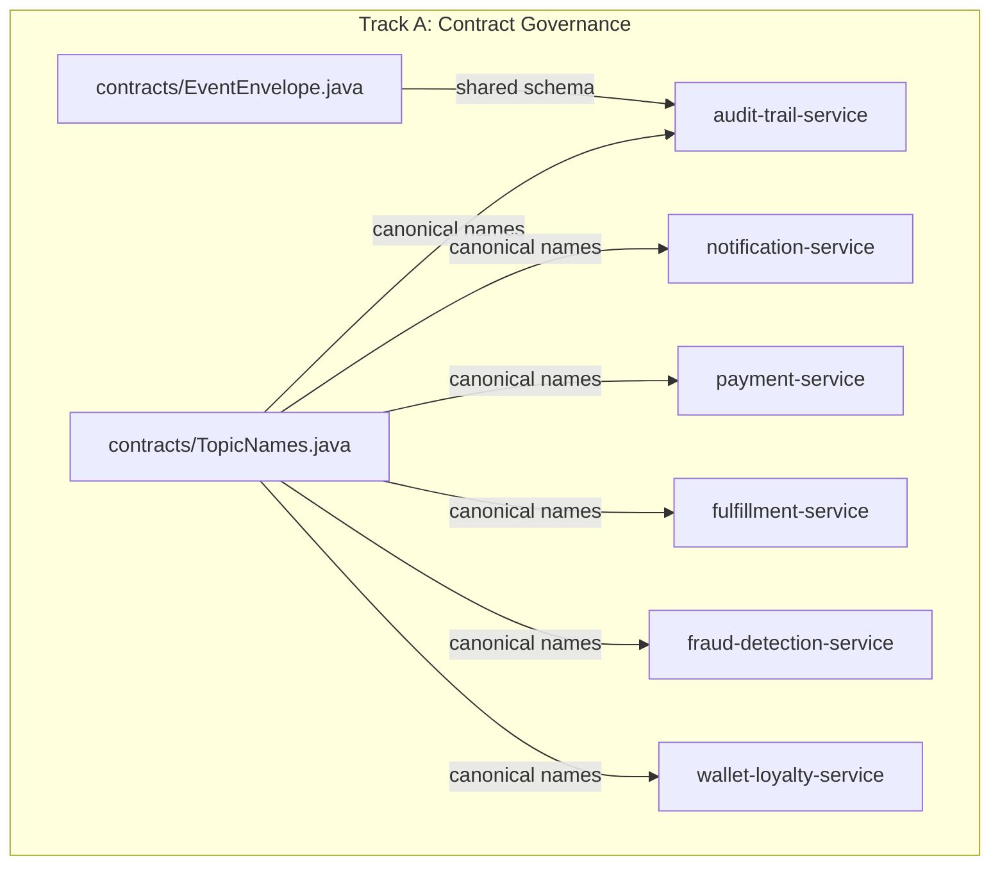
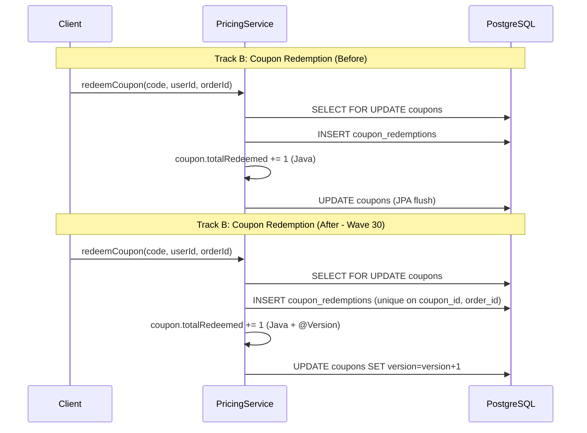
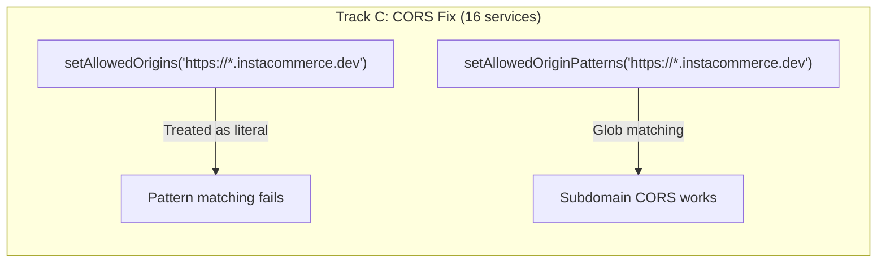
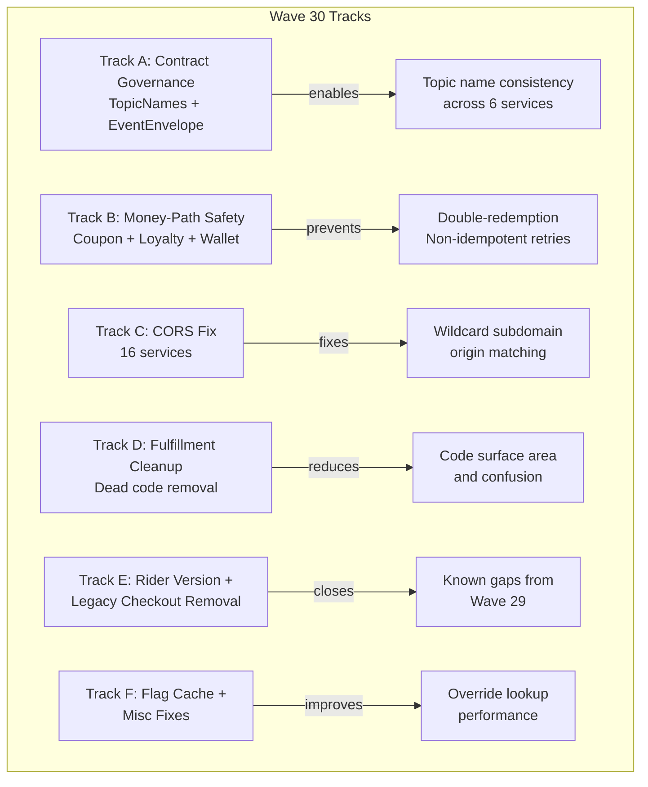

# Wave 30: Contract Governance, Money-Path Safety & Production Hardening

**Date:** 2026-03-14
**Branch:** `feat/wave30-contract-governance-production-hardening`
**Status:** Completed
**Predecessor:** Wave 29 (CI fixes, contract hardening, GDPR erasure, Redis dedup)

---

## Summary

Wave 30 delivers six tracks spanning contract governance (shared topic constants and event envelope), money-path safety (coupon double-redemption prevention, loyalty idempotency, wallet constraint fixes), CORS pattern matching fixes across 16 services, fulfillment dead code removal, optimistic locking for rider entities, order-service legacy checkout deletion, and feature-flag cache improvements with miscellaneous production fixes.

The wave prioritizes **correctness and cleanup** over new capability, continuing the program principle of restoring truth and closing correctness gaps before adding features.

---

## Track A: Contract & Topic Governance (P0)

### Objective

Centralize Kafka topic names and event envelope schema into a shared `contracts/` module so that producers and consumers reference a single source of truth instead of hardcoded strings.

### Changes

| Change | Detail |
|---|---|
| `TopicNames` constants class | 18 domain event topics + 2 non-domain topics (audit, notification) + `DLT_SUFFIX` constant |
| `EventEnvelope` record | Shared Java record matching `EventEnvelope.v1.json` schema; includes Jackson `@JsonAlias` annotations for snake_case wire compatibility |
| `contracts/build.gradle.kts` | Added Jackson dependency and Java sourceSets configuration |
| Consumer migration | 9 Kafka consumers across 6 services migrated from hardcoded topic strings to `TopicNames` constants |
| Topic split resolution | `fraud-detection-service` and `wallet-loyalty-service` now subscribe only to canonical plural topic names (`orders.events`, `payments.events`), resolving the singular/plural topic name ambiguity |
| Build dependency wiring | Added `implementation(project(":contracts"))` to 6 service `build.gradle.kts` files |

### Files changed

- `contracts/src/main/java/.../TopicNames.java` (new)
- `contracts/src/main/java/.../EventEnvelope.java` (new)
- `contracts/build.gradle.kts` (modified)
- `audit-trail-service/build.gradle.kts` (modified)
- `audit-trail-service/src/main/java/.../AuditEventConsumer.java` (modified)
- `notification-service/build.gradle.kts` (modified)
- `notification-service/src/main/java/.../NotificationEventConsumer.java` (modified)
- `payment-service/build.gradle.kts` (modified)
- `payment-service/src/main/java/.../PaymentEventConsumer.java` (modified)
- `fulfillment-service/build.gradle.kts` (modified)
- `fulfillment-service/src/main/java/.../FulfillmentEventConsumer.java` (modified)
- `fraud-detection-service/build.gradle.kts` (modified)
- `fraud-detection-service/src/main/java/.../FraudEventConsumer.java` (modified)
- `wallet-loyalty-service/build.gradle.kts` (modified)
- `wallet-loyalty-service/src/main/java/.../WalletEventConsumer.java` (modified)

### Diagram

---

## Track B: Money-Path Safety (P0)

### Objective

Close three money-path correctness gaps: coupon double-redemption under concurrency, loyalty point redemption non-idempotency, and wallet `reference_type` CHECK constraint incompleteness.

### Changes

| Change | Detail |
|---|---|
| Coupon `@Version` | Added JPA `@Version` optimistic locking to `Coupon` entity in pricing-service |
| Coupon unique index | Created `idx_coupon_redemption_order` unique index on `(coupon_id, order_id)` to prevent double-redemption per order |
| Loyalty idempotency fix | `LoyaltyService.redeemPoints()` now uses caller-supplied `orderId` as `referenceId` instead of `UUID.randomUUID()`, making the operation idempotent on retry |
| `LoyaltyAccount` `@Version` | Added optimistic locking to `LoyaltyAccount` entity |
| `PointsExpiryJob` pagination fix | Changed from `Page` to `Slice` pagination, eliminating the unnecessary `COUNT(*)` query per page |
| `LoyaltyAccountRepository` | Added `findAllBy(Pageable)` returning `Slice<LoyaltyAccount>` |
| Wallet CHECK constraint | Fixed `reference_type` CHECK constraint to include `PROMOTION` and `ADMIN_ADJUSTMENT` values |
| Migrations | V8 (pricing-service), V10 and V11 (wallet-loyalty-service) |

### Files changed

- `pricing-service/src/main/java/.../Coupon.java` (modified)
- `pricing-service/src/main/resources/db/migration/V8__coupon_version_unique_redemption.sql` (new)
- `wallet-loyalty-service/src/main/java/.../LoyaltyService.java` (modified)
- `wallet-loyalty-service/src/main/java/.../LoyaltyAccount.java` (modified)
- `wallet-loyalty-service/src/main/java/.../LoyaltyAccountRepository.java` (modified)
- `wallet-loyalty-service/src/main/java/.../PointsExpiryJob.java` (modified)
- `wallet-loyalty-service/src/main/resources/db/migration/V10__loyalty_account_version.sql` (new)
- `wallet-loyalty-service/src/main/resources/db/migration/V11__wallet_reference_type_constraint.sql` (new)

### Diagram

---

## Track C: CORS setAllowedOriginPatterns Fix (P1)

### Objective

Fix wildcard CORS origin matching across all Java services. Spring Security's `setAllowedOrigins()` treats `https://*.instacommerce.dev` as a literal string, not a wildcard pattern. Only `setAllowedOriginPatterns()` supports glob matching.

### Changes

| Change | Detail |
|---|---|
| Method replacement | Changed `setAllowedOrigins()` to `setAllowedOriginPatterns()` across 16 Java services |
| Skipped services | `payment-service` and `checkout-orchestrator-service` already used the correct method |

### Files changed

16 `CorsConfig.java` / `WebSecurityConfig.java` files across:

- `api-gateway-service`
- `admin-gateway-service`
- `order-service`
- `cart-service`
- `catalog-service`
- `search-service`
- `pricing-service`
- `inventory-service`
- `warehouse-service`
- `notification-service`
- `wallet-loyalty-service`
- `fraud-detection-service`
- `audit-trail-service`
- `feature-flag-service`
- `fulfillment-service`
- `rider-fleet-service`

### Diagram

---

## Track D: Fulfillment Dead Code Cleanup (Low)

### Objective

Remove deprecated inline dispatch code from fulfillment-service that has been disabled since Wave 23, reducing code surface area and eliminating confusion for new contributors.

### Changes

| Change | Detail |
|---|---|
| `PickService.publishPacked()` | Removed deprecated inline dispatch call |
| `RiderAssignmentService` | Deleted entirely (deprecated since Wave 23) |
| `DeliveryService` | Removed deprecated `assignRider(PickTask)` method |
| `Dispatch` config class | Removed `Dispatch` inner class and associated YAML property from `FulfillmentProperties` |
| `PickServiceDispatchTest` | Deleted test for removed dispatch path |

### Files changed

- `fulfillment-service/src/main/java/.../PickService.java` (modified)
- `fulfillment-service/src/main/java/.../RiderAssignmentService.java` (deleted)
- `fulfillment-service/src/main/java/.../DeliveryService.java` (modified)
- `fulfillment-service/src/main/java/.../FulfillmentProperties.java` (modified)
- `fulfillment-service/src/main/resources/application.yml` (modified)
- `fulfillment-service/src/test/java/.../PickServiceDispatchTest.java` (deleted)

---

## Track E: Rider @Version + Order-Service Legacy Checkout Removal (Low)

### Objective

Add optimistic locking to rider entities (closing a known gap from Wave 29) and remove the legacy checkout code path from order-service that was superseded by checkout-orchestrator-service.

### Changes

| Change | Detail |
|---|---|
| `Rider` entity | Added `@Version` optimistic locking |
| `RiderAvailability` entity | Added `@Version` optimistic locking |
| Migration V10 | Added `version` columns to `riders` and `rider_availability` tables |
| Legacy checkout deletion | Removed 22 files: controller, Temporal workflow and activities, DTOs, tests, and Temporal configuration |
| `OrderProperties` | Removed legacy checkout configuration block |
| `application.yml` | Removed legacy checkout YAML properties |
| `OrderServiceApplication` | Cleaned up legacy checkout bean registrations |

### Files changed

- `rider-fleet-service/src/main/java/.../Rider.java` (modified)
- `rider-fleet-service/src/main/java/.../RiderAvailability.java` (modified)
- `rider-fleet-service/src/main/resources/db/migration/V10__rider_version_columns.sql` (new)
- `order-service/src/main/java/.../CheckoutController.java` (deleted)
- `order-service/src/main/java/.../CheckoutWorkflow.java` (deleted)
- `order-service/src/main/java/.../CheckoutWorkflowImpl.java` (deleted)
- `order-service/src/main/java/.../CheckoutActivities.java` (deleted)
- `order-service/src/main/java/.../CheckoutActivitiesImpl.java` (deleted)
- `order-service/src/main/java/.../CheckoutRequest.java` (deleted)
- `order-service/src/main/java/.../CheckoutResponse.java` (deleted)
- `order-service/src/main/java/.../CheckoutTemporalConfig.java` (deleted)
- `order-service/src/main/java/.../OrderProperties.java` (modified)
- `order-service/src/main/resources/application.yml` (modified)
- `order-service/src/main/java/.../OrderServiceApplication.java` (modified)
- Plus associated test files (deleted)

---

## Track F: Feature Flag Bulk Override Cache + Miscellaneous Fixes (P1)

### Objective

Reduce redundant database queries for feature flag override lookups and fix miscellaneous production issues discovered during Wave 29 validation.

### Changes

| Change | Detail |
|---|---|
| `FlagOverrideService` | Added `@Cacheable("flag-overrides-bulk")` to `findActiveOverridesByFlagIds` |
| `CacheConfig` | New configuration class with Caffeine cache, 10-second TTL for bulk override cache |
| Cache eviction | Added `@CacheEvict` on override mutation methods to maintain consistency |
| Reconciliation Dockerfile fix | Changed `golang:1.26` to `golang:1.24` (1.26 does not exist); fixed `EXPOSE` port mismatch |
| AI audit envelope | Added `eventId` and `schemaVersion` fields to AI audit event envelope for schema compliance |

### Files changed

- `feature-flag-service/src/main/java/.../FlagOverrideService.java` (modified)
- `feature-flag-service/src/main/java/.../CacheConfig.java` (new)
- `reconciliation-engine/Dockerfile` (modified)
- `ai-orchestrator-service/src/main/python/.../audit_publisher.py` (modified)

---

## Gaps closed from prior waves

| Gap (from Wave 29) | Resolution in Wave 30 |
|---|---|
| Fulfillment deprecated inline dispatch code still present | Track D: deleted `RiderAssignmentService` and all dispatch dead code |
| Rider entity missing `@Version` for optimistic locking | Track E: added `@Version` to `Rider` and `RiderAvailability` |
| Order-service legacy checkout code still present behind disabled flag | Track E: deleted 22 legacy checkout files |

---

## Remaining gaps for Wave 31+

| # | Gap | Priority | Notes |
|---|---|---|---|
| 1 | Feature flag distributed cache invalidation across replicas | P2 | Caffeine is in-process only; replicas still have up to 30s propagation gap. Needs Redis or pub/sub-based invalidation. |
| 2 | Reconciliation engine DB/CDC wiring | P2 | Still file-based JSON approach; needs migration to PostgreSQL source with CDC. |
| 3 | Stuck rider recovery job | Low | Disabled by default in config; can now be safely enabled with the new `@Version` protection on rider entities. |
| 4 | Payment stuck-pending recovery sweeper | P1 | No recovery job exists for intermediate payment states (`CAPTURE_PENDING`, etc.). |
| 5 | VirtualService port mismatch | P0 | 11 services route to wrong port in Istio VirtualService definitions. |
| 6 | CI coverage gaps | P1 | Not all services included in CI matrix; some changes can merge without build validation. |
| 7 | Test coverage | P0 | Fleet-wide test coverage remains minimal; critical paths lack integration tests. |
| 8 | Redis migration for caches | P1 | All services use JVM-local Caffeine; cross-replica consistency requires shared cache layer. |
| 9 | Outbox relay wiring | P0 | Order, payment, cart, and fulfillment outbox tables exist but are not relayed to Kafka via CDC. |

---

## Cross-track summary

