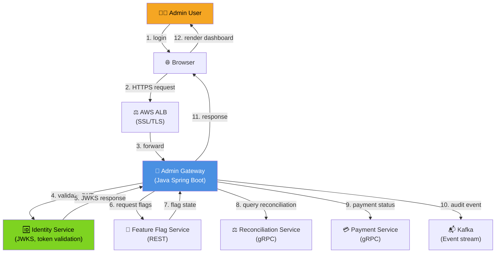
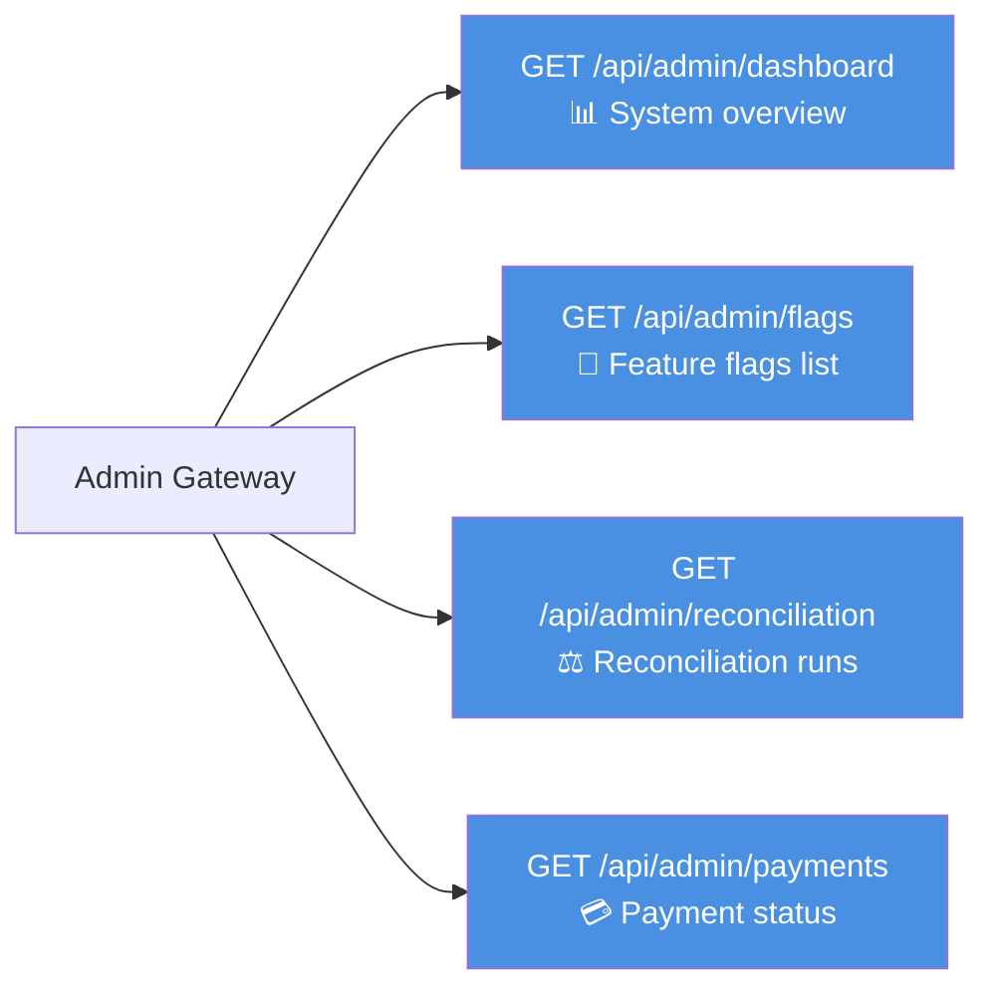
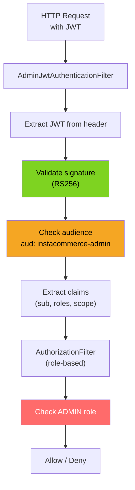

# Admin Gateway - High-Level Design

```mermaid
graph TB
    AdminUser["👨‍💼 Admin User"]
    Browser["🌐 Browser"]
    ALB["⚖️ AWS ALB<br/>(SSL/TLS)"]
    AdminGateway["🔐 Admin Gateway<br/>(Java Spring Boot)"]
    IdentityService["🆔 Identity Service<br/>(JWKS, token validation)"]
    PaymentSvc["💳 Payment Service<br/>(gRPC)"]
    ReconciliationSvc["⚖️ Reconciliation Service<br/>(gRPC)"]
    FlagSvc["🚩 Feature Flag Service<br/>(REST)"]
    Kafka["📬 Kafka<br/>(Event stream)"]

    AdminUser -->|1. login| Browser
    Browser -->|2. HTTPS request| ALB
    ALB -->|3. forward| AdminGateway
    AdminGateway -->|4. validate JWT| IdentityService
    IdentityService -->|5. JWKS response| AdminGateway
    AdminGateway -->|6. request flags| FlagSvc
    FlagSvc -->|7. flag state| AdminGateway
    AdminGateway -->|8. query reconciliation| ReconciliationSvc
    AdminGateway -->|9. payment status| PaymentSvc
    AdminGateway -->|10. audit event| Kafka
    AdminGateway -->|11. response| Browser
    Browser -->|12. render dashboard| AdminUser

    style AdminGateway fill:#4A90E2,color:#fff
    style IdentityService fill:#7ED321,color:#000
    style AdminUser fill:#F5A623,color:#000
```

## Admin Dashboard API Endpoints

```mermaid
graph LR
    Gateway["Admin Gateway"]

    DashboardEP["GET /api/admin/dashboard<br/>📊 System overview"]
    FlagsEP["GET /api/admin/flags<br/>🚩 Feature flags list"]
    ReconcileEP["GET /api/admin/reconciliation<br/>⚖️ Reconciliation runs"]
    PaymentEP["GET /api/admin/payments<br/>💳 Payment status"]

    Gateway --> DashboardEP
    Gateway --> FlagsEP
    Gateway --> ReconcileEP
    Gateway --> PaymentEP

    style DashboardEP fill:#4A90E2,color:#fff
    style FlagsEP fill:#4A90E2,color:#fff
    style ReconcileEP fill:#4A90E2,color:#fff
    style PaymentEP fill:#4A90E2,color:#fff
```

## Authentication & Authorization

```mermaid
graph TD
    Request["HTTP Request<br/>with JWT"]
    JwtFilter["AdminJwtAuthenticationFilter"]
    Extract["Extract JWT from header"]
    Validate["Validate signature<br/>(RS256)"]
    CheckAud["Check audience<br/>aud: instacommerce-admin"]
    ExtractClaims["Extract claims<br/>(sub, roles, scope)"]
    AuthzCheck["AuthorizationFilter<br/>(role-based)"]
    AdminRole["Check ADMIN role"]
    AllowOrDeny["Allow / Deny"]

    Request --> JwtFilter
    JwtFilter --> Extract
    Extract --> Validate
    Validate --> CheckAud
    CheckAud --> ExtractClaims
    ExtractClaims --> AuthzCheck
    AuthzCheck --> AdminRole
    AdminRole --> AllowOrDeny

    style Validate fill:#7ED321,color:#000
    style CheckAud fill:#F5A623,color:#000
    style AdminRole fill:#FF6B6B,color:#fff
```
