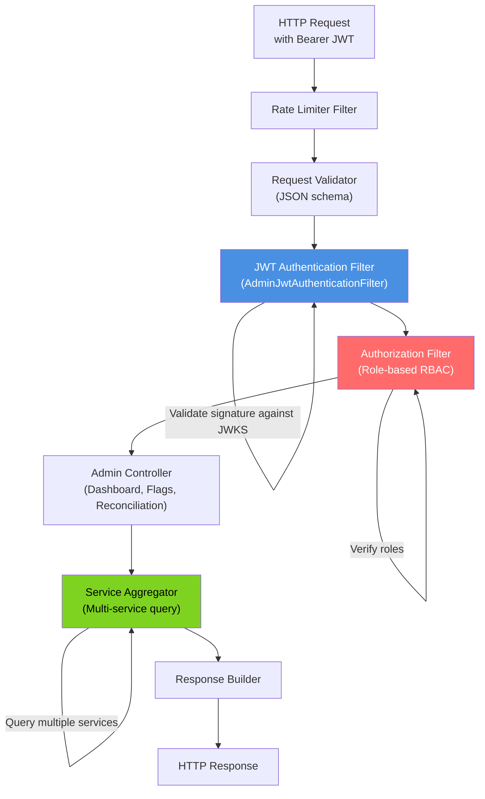
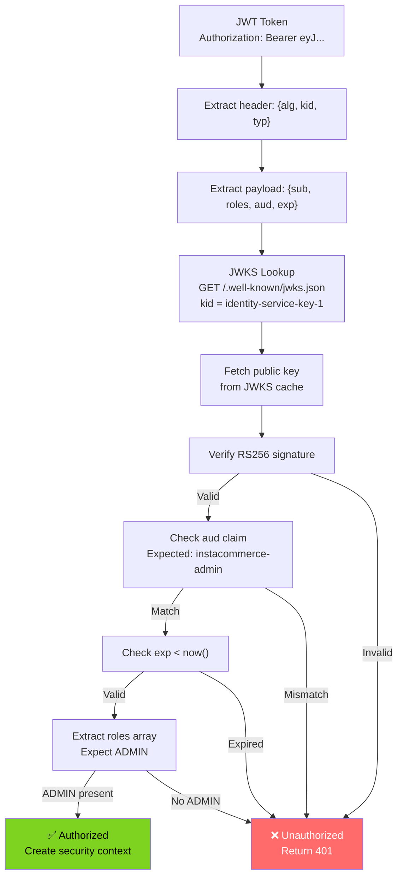
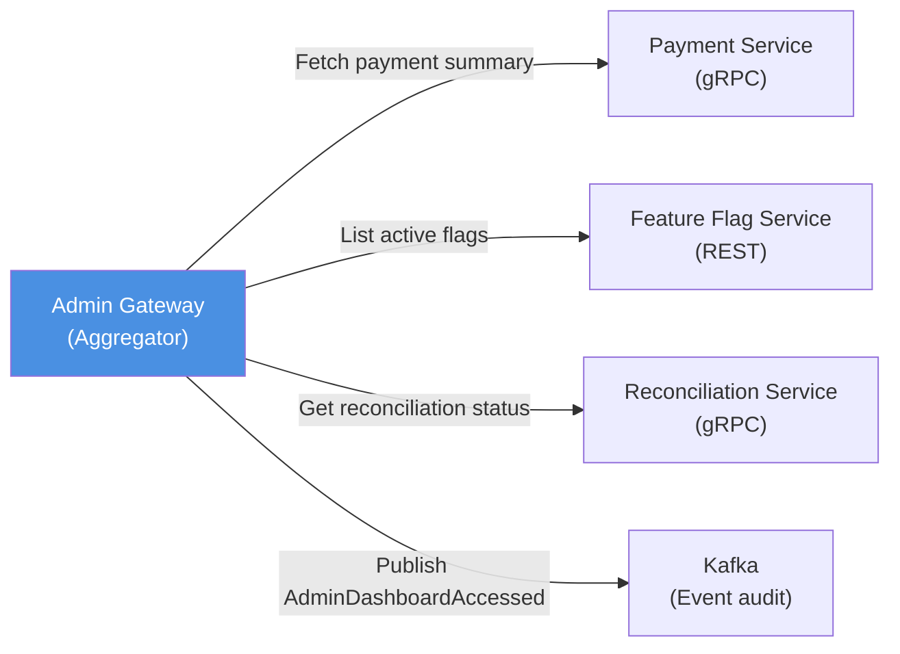

# Admin Gateway - Low-Level Design

```mermaid
graph TB
    Request["HTTP Request<br/>with Bearer JWT"]
    RateLimit["Rate Limiter Filter"]
    RequestValidator["Request Validator<br/>(JSON schema)"]
    JwtFilter["JWT Authentication Filter<br/>(AdminJwtAuthenticationFilter)"]
    AuthzFilter["Authorization Filter<br/>(Role-based RBAC)"]
    Controller["Admin Controller<br/>(Dashboard, Flags, Reconciliation)"]
    ServiceAggregator["Service Aggregator<br/>(Multi-service query)"]
    ResponseBuilder["Response Builder"]
    Response["HTTP Response"]

    Request --> RateLimit
    RateLimit --> RequestValidator
    RequestValidator --> JwtFilter
    JwtFilter -->|Extract from Bearer token| JwtFilter
    JwtFilter -->|Validate signature against JWKS| JwtFilter
    JwtFilter --> AuthzFilter
    AuthzFilter -->|Check aud=instacommerce-admin| AuthzFilter
    AuthzFilter -->|Verify roles| AuthzFilter
    AuthzFilter --> Controller
    Controller --> ServiceAggregator
    ServiceAggregator -->|Query multiple services| ServiceAggregator
    ServiceAggregator --> ResponseBuilder
    ResponseBuilder --> Response

    style JwtFilter fill:#4A90E2,color:#fff
    style AuthzFilter fill:#FF6B6B,color:#fff
    style ServiceAggregator fill:#7ED321,color:#000
```

## JWT Validation Pipeline

```mermaid
graph TD
    JWT["JWT Token<br/>Authorization: Bearer eyJ..."]
    ExtractHeader["Extract header: {alg, kid, typ}"]
    ExtractPayload["Extract payload: {sub, roles, aud, exp}"]
    LookupKey["JWKS Lookup<br/>GET /.well-known/jwks.json<br/>kid = identity-service-key-1"]
    GetPublicKey["Fetch public key<br/>from JWKS cache"]
    VerifySignature["Verify RS256 signature"]
    CheckAudience["Check aud claim<br/>Expected: instacommerce-admin"]
    CheckExpiry["Check exp < now()"]
    ExtractRoles["Extract roles array<br/>Expect ADMIN"]
    Authorized["✅ Authorized<br/>Create security context"]
    Unauthorized["❌ Unauthorized<br/>Return 401"]

    JWT --> ExtractHeader
    ExtractHeader --> ExtractPayload
    ExtractPayload --> LookupKey
    LookupKey --> GetPublicKey
    GetPublicKey --> VerifySignature
    VerifySignature -->|Valid| CheckAudience
    VerifySignature -->|Invalid| Unauthorized
    CheckAudience -->|Match| CheckExpiry
    CheckAudience -->|Mismatch| Unauthorized
    CheckExpiry -->|Valid| ExtractRoles
    CheckExpiry -->|Expired| Unauthorized
    ExtractRoles -->|ADMIN present| Authorized
    ExtractRoles -->|No ADMIN| Unauthorized

    style Authorized fill:#7ED321,color:#000
    style Unauthorized fill:#FF6B6B,color:#fff
```

## Service Integration Pattern

```mermaid
graph LR
    AdminGateway["Admin Gateway<br/>(Aggregator)"]
    PaymentSvc["Payment Service<br/>(gRPC)"]
    FlagSvc["Feature Flag Service<br/>(REST)"]
    ReconcileSvc["Reconciliation Service<br/>(gRPC)"]
    Kafka["Kafka<br/>(Event audit)"]

    AdminGateway -->|Fetch payment summary| PaymentSvc
    AdminGateway -->|List active flags| FlagSvc
    AdminGateway -->|Get reconciliation status| ReconcileSvc
    AdminGateway -->|Publish AdminDashboardAccessed| Kafka

    style AdminGateway fill:#4A90E2,color:#fff
```
